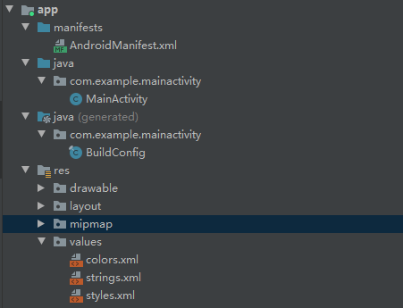
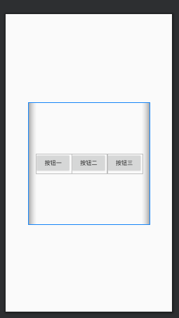
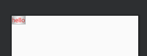
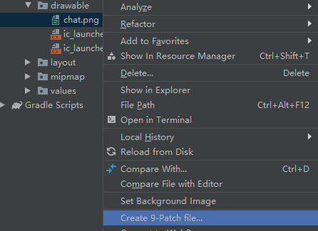

## 安装开发环境


## 环境配置

### 1.配置adb

1.找到位于Android SDK下的**platform-tools**目录，里面会有**adb.exe**文件 


2.配置环境变量


3.连接wifi调试 

```sh
# adb connect 手机ip
adb connect 10.168.1.168
# 连接成功
connected to 192.168.108.113:5555
# 断开连接
adb disconnect 192.168.108.113
```

##  第一个项目

### 1.创建项目


### 2.目录结构


### 3.修改布局文件

- `LinearLayout` 线性布局
- `android:layout_height="match_parent"` 设置宽度为父元素宽度
- `android:orientation="horizontal"` 子元素排列方式(水平排列)
- `android:layout_width="wrap_content"` 设置宽度为内容宽度

```xml
<!-- res/layout/activity_main.xml -->
<?xml version="1.0" encoding="utf-8"?>
<LinearLayout android:layout_width="match_parent"
    android:layout_height="match_parent"
    android:orientation="horizontal"
    xmlns:android="http://schemas.android.com/apk/res/android" >
    <EditText
        android:id="@+id/message"
        android:layout_width="wrap_content"
        android:layout_height="wrap_content"
        android:layout_weight="1"
        android:hint="Enter a message"
        >
    </EditText>

    <Button
        android:id="@+id/btn"
        android:layout_width="wrap_content"
        android:layout_height="wrap_content"
        android:layout_weight="1"
        android:text="Send" />
</LinearLayout>
```

效果


### 4.配置字符常量

```xml
<!-- res/values/strings.xml -->
<resources>
    <string name="app_name">MainActivity</string>
    <string name="message">Enter a message</string>
    <string name="send">Send</string>
</resources>
```

重新修改`activity_main.xml`

```xml
<!-- res/layout/activity_main.xml -->
<!-- 13行 22行 -->
<?xml version="1.0" encoding="utf-8"?>
<LinearLayout android:layout_width="match_parent"
    android:layout_height="match_parent"
    android:orientation="horizontal"
    xmlns:android="http://schemas.android.com/apk/res/android" >
    <EditText
        android:id="@+id/message"
        android:layout_width="wrap_content"
        android:layout_height="wrap_content"
        android:layout_weight="1"
        android:hint="@string/message"
        >
    </EditText>

    <Button
        android:id="@+id/btn"
        android:layout_width="wrap_content"
        android:layout_height="wrap_content"
        android:layout_weight="1"
        android:text="@string/send" />
</LinearLayout>
```

### 5.事件监听

5.1为按钮绑定事件

```xml
<!-- res/layout/activity_main.xml -->
<!-- 23行 -->
<?xml version="1.0" encoding="utf-8"?>
<LinearLayout android:layout_width="match_parent"
    android:layout_height="match_parent"
    android:orientation="horizontal"
    xmlns:android="http://schemas.android.com/apk/res/android" >
    <EditText
        android:id="@+id/message"
        android:layout_width="wrap_content"
        android:layout_height="wrap_content"
        android:layout_weight="1"
        android:hint="@string/message"
        >
    </EditText>

    <Button
        android:id="@+id/btn"
        android:layout_width="wrap_content"
        android:layout_height="wrap_content"
        android:layout_weight="1"
        android:text="@string/send"
        android:onClick="sendMessage"
        />
</LinearLayout>
```

5.2添加事件函数

```java
package com.example.mainactivity;

import androidx.appcompat.app.AppCompatActivity;

import android.os.Bundle;
import android.view.View;
import android.widget.EditText;

public class MainActivity extends AppCompatActivity {

    @Override
    protected void onCreate(Bundle savedInstanceState) {
        super.onCreate(savedInstanceState);
        setContentView(R.layout.activity_main);
    }

    // 事件函数
    public  void sendMessage(View view){
        // 响应按钮的事件
        EditText msg = findViewById(R.id.message);
        // 获取输入框中的值
        String s = msg.getText().toString();
        System.out.println(s);
    }
}
```

输入框输入值后

```
控制台
I/System.out: 555
I/System.out: 555
I/System.out: 555
I/System.out: 55566
```

### 6.日志输出

- i -- info通知
- d -- debug调试
- e -- error错误
- w -- warning 警告

```java
package com.example.mainactivity;
public class MainActivity extends AppCompatActivity {
    @Override
    protected void onCreate(Bundle savedInstanceState) {
        super.onCreate(savedInstanceState);
        setContentView(R.layout.activity_main);
        Log.i("MainActivity","iMessage");
        Log.d("MainActivity","dMessage");
        Log.e("MainActivity","eMessage");
        Log.w("MainActivity","wMessage");
    }
}
```


## 项目文档结构



## 视图

### 1.显示调用

1.1创建activity


1.2创建成功


1.3修改manifest文件

- `android.intent.category.LAUNCHER` 会在桌面生成一个图标
- 如果不想显示为图标则需要设置为default `android:name="android.intent.category.DEFAULT"`

```xml
<!-- manifests/AndroidManifest.xml -->
<!-- 20-25行 -->
<?xml version="1.0" encoding="utf-8"?>
<manifest xmlns:android="http://schemas.android.com/apk/res/android"
    package="com.example.mainactivity">

    <application
        android:allowBackup="true"
        android:icon="@mipmap/ic_launcher"
        android:label="@string/app_name"
        android:roundIcon="@mipmap/ic_launcher_round"
        android:supportsRtl="true"
        android:theme="@style/AppTheme">
        <activity android:name=".MainActivity">
            <intent-filter>
                <action android:name="android.intent.action.MAIN" />
                <category android:name="android.intent.category.LAUNCHER" />
            </intent-filter>
        </activity>
        <activity android:name=".SecondActivity">
            <intent-filter>
                <action android:name="android.intent.action.MAIN" />
                <category android:name="android.intent.category.LAUNCHER" />
            </intent-filter>
        </activity>
    </application>
</manifest>
```

1.4 修改`secondActivity`布局

```xml
<?xml version="1.0" encoding="utf-8"?>
<LinearLayout android:layout_width="match_parent"
    android:layout_height="match_parent"
    android:orientation="horizontal"
    xmlns:android="http://schemas.android.com/apk/res/android" >
    <TextView
        android:id="@+id/message"
        android:layout_width="wrap_content"
        android:layout_height="wrap_content"
        android:layout_weight="1"
        android:text="这是第二个activity"
        >
    </TextView>

    <Button
        android:id="@+id/btn"
        android:layout_width="wrap_content"
        android:layout_height="wrap_content"
        android:layout_weight="1"
        android:text="@string/send"
        android:onClick="sendMessage"
        />
</LinearLayout>
```

1.5 设置意图跳转代码

```java
// MainActivity
package com.example.mainactivity;
public class MainActivity extends AppCompatActivity {

    @Override
    protected void onCreate(Bundle savedInstanceState) {
        super.onCreate(savedInstanceState);
        setContentView(R.layout.activity_main);
    }

    public  void sendMessage(View view){
        // 显示启动，写法一：class跳转
        Intent intent = new Intent(this,SecondActivity.class);
        this.startActivity(intent);
    }
}
```

运行结果

- 桌面上有两个图标 
- 在`MainActivity`中点击按钮跳转到`SecondActivity`

1.6 所有方式

```java
// 显示启动，写法一：class跳转
Intent intent = new Intent(this,SecondActivity.class);
this.startActivity(intent);

// 显示启动，写法二：包名.类名
Intent intent = new Intent();
intent.setClassName(this,"com.example.mainactivity.SecondActivity");
startActivity(intent);

// 显示启动，写法三：ComponentName
Intent intent = new Intent();
ComponentName cname = new ComponentName(this,SecondActivity.class);
intent.setComponent(cname);
startActivity(intent);
```

### 2.隐式调用

1.通过配置文件里的名称找到activity

2.当`<action android:name="action.nextActivity" />`完全一样时会弹出选择框

```xml
<!-- manifests/AndroidManifest.xml -->
<!-- 22行 随便起的名字 -->
<?xml version="1.0" encoding="utf-8"?>
<manifest xmlns:android="http://schemas.android.com/apk/res/android"
    package="com.example.mainactivity">

    <application
        android:allowBackup="true"
        android:icon="@mipmap/ic_launcher"
        android:label="@string/app_name"
        android:roundIcon="@mipmap/ic_launcher_round"
        android:supportsRtl="true"
        android:theme="@style/AppTheme">
        <activity android:name=".MainActivity">
            <intent-filter>
                <action android:name="android.intent.action.MAIN" />
                <category android:name="android.intent.category.LAUNCHER" />
            </intent-filter>
        </activity>
        <activity android:name=".SecondActivity">
            <intent-filter>
                <action android:name="action.nextActivity" />
                <category android:name="android.intent.category.DEFAULT" />
            </intent-filter>
        </activity>
    </application>
</manifest>
```

2.跳转代码

```java
package com.example.mainactivity;
public class MainActivity extends AppCompatActivity {

    @Override
    protected void onCreate(Bundle savedInstanceState) {
        super.onCreate(savedInstanceState);
        setContentView(R.layout.activity_main);
    }

    public  void sendMessage(View view){
        // 隐式启动
        Intent intent = new Intent();
        intent.setAction("action.nextActivity");
        startActivity(intent);
    }
}
```

3.两种写法

```java
// 写法一
Intent intent = new Intent();
intent.setAction("action.nextActivity");
startActivity(intent);

// 写法二
Intent intent = new Intent("action.nextActivity");
startActivity(intent);
```

## 生命周期

- onCreate() 创建
- onStart() 启动
- onResume() 恢复
- onPause() 暂停
- onStop() 停止
- onDestory() 销毁
- onRestart() 重新开始


代码

```java
// mainactivity
package com.example.mainactivity;
public class MainActivity extends AppCompatActivity {

    @Override
    // 生命周期 --- onCreate
    protected void onCreate(Bundle savedInstanceState) {
        super.onCreate(savedInstanceState);
        setContentView(R.layout.activity_main);
        Log.e("activityState","MainActivity_onCreate");
    }

    @Override
    // 生命周期 --- onStart
    protected void onStart() {
        super.onStart();
        Log.e("activityState","MainActivity_onStart");
    }

    @Override
    // 生命周期 --- onRestart
    protected void onRestart() {
        super.onRestart();
        Log.e("activityState","MainActivity_onRestart");
    }

    @Override
    // 生命周期 --- onPause
    protected void onPause() {
        super.onPause();
        Log.e("activityState","MainActivity_onPause");
    }

    @Override
    // 生命周期 --- onResume
    protected void onResume() {
        super.onResume();
        Log.e("activityState","MainActivity_onResume");
    }

    @Override
    // 生命周期 --- onStop
    protected void onStop() {
        super.onStop();
        Log.e("activityState","MainActivity_onStop");
    }

    @Override
    // 生命周期 --- onDestroy
    protected void onDestroy() {
        super.onDestroy();
        Log.e("activityState","MainActivity_onDestroy");
    }
    public  void sendMessage(View view){
        // 隐式启动
        Intent intent = new Intent("action.nextActivity");
        startActivity(intent);
    }
}
```

给`secondActivity`添加事件

```xml
<!-- 22行 -->
<?xml version="1.0" encoding="utf-8"?>
<LinearLayout android:layout_width="match_parent"
    android:layout_height="match_parent"
    android:orientation="horizontal"
    xmlns:android="http://schemas.android.com/apk/res/android" >
    <TextView
        android:id="@+id/message"
        android:layout_width="wrap_content"
        android:layout_height="wrap_content"
        android:layout_weight="1"
        android:text="这是第二个activity"
        >
    </TextView>

    <Button
        android:id="@+id/btn"
        android:layout_width="wrap_content"
        android:layout_height="wrap_content"
        android:layout_weight="1"
        android:text="@string/send"
        android:onClick="closeActivity"
        />
</LinearLayout>
```

```java
// SecondActivity
package com.example.mainactivity;

public class SecondActivity extends AppCompatActivity {

    @Override
    // 生命周期 --- onCreate
    protected void onCreate(Bundle savedInstanceState) {
        super.onCreate(savedInstanceState);
        setContentView(R.layout.activity_second);
        Log.e("activityState","SecondActivity_onCreate");
    }

    @Override
    // 生命周期 --- onStart
    protected void onStart() {
        super.onStart();
        Log.e("activityState","SecondActivity_onStart");
    }

    @Override
    // 生命周期 --- onRestart
    protected void onRestart() {
        super.onRestart();
        Log.e("activityState","SecondActivity_onRestart");
    }

    @Override
    // 生命周期 --- onPause
    protected void onPause() {
        super.onPause();
        Log.e("activityState","SecondActivity_onPause");
    }

    @Override
    // 生命周期 --- onResume
    protected void onResume() {
        super.onResume();
        Log.e("activityState","SecondActivity_onResume");
    }

    @Override
    // 生命周期 --- onStop
    protected void onStop() {
        super.onStop();
        Log.e("activityState","SecondActivity_onStop");
    }

    @Override
    // 生命周期 --- onDestroy
    protected void onDestroy() {
        super.onDestroy();
        Log.e("activityState","SecondActivity_onDestroy");
    }

    public void closeActivity(View view){
        Log.e("activityState","SecondActivity_finish");
        // 关闭activity
        this.finish();
    }
}
```

### 测试

1.首次启动

```
E/activityState: MainActivity_onCreate
E/activityState: MainActivity_onStart
E/activityState: MainActivity_onResume
```

2.点击回到桌面

```
E/activityState: MainActivity_onPause
E/activityState: MainActivity_onStop
```

3.再次打开程序

```
E/activityState: MainActivity_onRestart
E/activityState: MainActivity_onStart
E/activityState: MainActivity_onResume
```

4.清除后台

```
E/activityState: MainActivity_onPause
E/activityState: MainActivity_onStop
E/activityState: MainActivity_onDestroy
```


一个activity生命周期


### 测试二

1.首次启动

```
E/activityState: MainActivity_onCreate
E/activityState: MainActivity_onStart
E/activityState: MainActivity_onResume
```

2.点击按钮启动第二个`activitity`

```
E/activityState: MainActivity_onPause
E/activityState: SecondActivity_onCreate
E/activityState: SecondActivity_onStart
E/activityState: SecondActivity_onResume
E/activityState: MainActivity_onStop
```

3.点击关闭按钮

```
E/activityState: SecondActivity_finish
E/activityState: SecondActivity_onPause
E/activityState: MainActivity_onRestart
E/activityState: MainActivity_onStart
E/activityState: MainActivity_onResume
E/activityState: SecondActivity_onStop
E/activityState: SecondActivity_onDestroy
```

两个activity生命周期


## 布局

Android中常见的布局包括

- 相对布局RelativeLayout

- 线性布局LinearLayout

- 表格布局TableLayout

- 网格布局GridLayout

- 帧布局FrameLayout

相关概念


### 线性布局

- match_parent 填充父容器 wrap_content 包裹内容
- vertical 垂直排列 horizontal水平排列
- layout_height可以使用`300dp`单位定义
- layout_gravity 设置在父窗口中的位置

```xml
<?xml version="1.0" encoding="utf-8"?>
<LinearLayout android:layout_width="300dp"
    android:layout_height="300dp"
    android:orientation="horizontal"
    android:layout_gravity="center"
    xmlns:android="http://schemas.android.com/apk/res/android">
    <Button
        android:layout_width="wrap_content"
        android:layout_height="wrap_content"
        android:text="按钮一"/>
    <Button
        android:layout_width="wrap_content"
        android:layout_height="wrap_content"
        android:text="按钮二"/>
    <Button
        android:layout_width="wrap_content"
        android:layout_height="wrap_content"
        android:text="按钮三"/>
</LinearLayout>
```


gravity设置布局内部元素所在位置

```xml
<?xml version="1.0" encoding="utf-8"?>
<LinearLayout android:layout_width="300dp"
    android:layout_height="300dp"
    android:orientation="horizontal"
    android:layout_gravity="center"
    android:gravity="center"
    xmlns:android="http://schemas.android.com/apk/res/android">
    <Button
        android:layout_width="wrap_content"
        android:layout_height="wrap_content"
        android:text="按钮一"/>
    <Button
        android:layout_width="wrap_content"
        android:layout_height="wrap_content"
        android:text="按钮二"/>
    <Button
        android:layout_width="wrap_content"
        android:layout_height="wrap_content"
        android:text="按钮三"/>
</LinearLayout>
```



设置为中间上方

```
android:gravity="center|top"
```


权重weight

- 对剩余空间进行分配

```xml
<?xml version="1.0" encoding="utf-8"?>
<LinearLayout android:layout_width="300dp"
    android:layout_height="300dp"
    android:orientation="vertical"
    android:layout_gravity="center"
    android:gravity="center|top"
    xmlns:android="http://schemas.android.com/apk/res/android">
    <Button
        android:layout_width="wrap_content"
        android:layout_height="wrap_content"
        android:text="按钮一"
        android:layout_weight="1"
        />
    <Button
        android:layout_width="wrap_content"
        android:layout_height="wrap_content"
        android:layout_weight="1"
        android:text="按钮二"/>
    <Button
        android:layout_width="wrap_content"
        android:layout_height="wrap_content"
        android:text="按钮三"/>
</LinearLayout>
```


### 帧布局

- 帧布局会依次叠加
- 可以通过

```xml
<?xml version="1.0" encoding="utf-8"?>
<androidx.constraintlayout.widget.ConstraintLayout xmlns:android="http://schemas.android.com/apk/res/android"
    xmlns:app="http://schemas.android.com/apk/res-auto"
    xmlns:tools="http://schemas.android.com/tools"
    android:layout_width="match_parent"
    android:layout_height="match_parent"
    tools:context=".FrameLayout">

    <FrameLayout
        android:id="@+id/myframe"
        android:layout_width="match_parent"
        android:layout_height="match_parent"
        tools:layout_editor_absoluteX="106dp"
        tools:layout_editor_absoluteY="125dp">
        <TextView
            android:layout_width="200dp"
            android:layout_height="200dp"
            android:background="#4AAF4A"
            />
        <TextView
            android:layout_width="100dp"
            android:layout_height="100dp"
            android:background="#fff"
            android:text="你好"
            android:textColor="#f00"
            android:textSize="20sp"
            />
    </FrameLayout>
</androidx.constraintlayout.widget.ConstraintLayout>
```


### 相对布局

- ed1相对在label的下面
- ok相对在ed1的下面
- ok在父容器的右边
- 右边距10dp
- cancel相对在ok的左边

```xml
<?xml version="1.0" encoding="utf-8"?>
<RelativeLayout
    android:layout_height="wrap_content"
    android:layout_width="wrap_content"
    xmlns:android="http://schemas.android.com/apk/res/android">
    <TextView
        android:id="@+id/label"
        android:layout_width="match_parent"
        android:layout_height="wrap_content"
        android:text="相对布局"
        android:textSize="50sp"
        />
    <EditText
        android:id="@+id/ed1"
        android:layout_width="match_parent"
        android:layout_height="wrap_content"
        android:layout_below="@+id/label"/>
    <Button
        android:id="@+id/ok"
        android:layout_width="wrap_content"
        android:layout_height="wrap_content"
        android:layout_below="@+id/ed1"
        android:text="ok"
        android:layout_alignParentRight="true"
        android:layout_marginRight="10dp"
        />
    <Button
        android:layout_width="wrap_content"
        android:layout_height="wrap_content"
        android:layout_below="@id/ed1"
        android:layout_toLeftOf="@+id/ok"
        android:layout_marginRight="10dp"
        android:text="cancel"
        />
</RelativeLayout>
```


### 表格布局

```xml
<?xml version="1.0" encoding="utf-8"?>
<TableLayout android:layout_width="wrap_content"
    android:layout_height="wrap_content"
    xmlns:android="http://schemas.android.com/apk/res/android">
    <Button android:layout_height="wrap_content"
        android:layout_width="wrap_content"
        android:text="按钮一"
        />
    <TableRow>
        <Button android:layout_height="wrap_content"
            android:layout_width="wrap_content"
            android:text="按钮二"
            />
        <Button android:layout_height="wrap_content"
            android:layout_width="wrap_content"
            android:text="按钮三"
            />
    </TableRow>
</TableLayout>
```


### 网格布局

```xml
<?xml version="1.0" encoding="utf-8"?>
<GridLayout android:layout_width="wrap_content"
    android:layout_height="wrap_content"
    android:rowCount="6"
    android:columnCount="4"
    xmlns:android="http://schemas.android.com/apk/res/android">
    <TextView
        android:text="0"
        android:layout_width="wrap_content"
        android:layout_height="wrap_content"
        android:textSize="50sp"
        android:layout_columnSpan="4"
        />
    <Button
        android:text="清除"
        android:layout_width="wrap_content"
        android:layout_height="wrap_content"
        android:layout_columnSpan="4"
        />
    <Button android:text="0" android:textSize="26sp"/>
    <Button android:text="1" android:textSize="26sp"/>
    <Button android:text="2" android:textSize="26sp"/>
    <Button android:text="3" android:textSize="26sp"/>
    <Button android:text="4" android:textSize="26sp"/>
    <Button android:text="5" android:textSize="26sp"/>
    <Button android:text="6" android:textSize="26sp"/>
    <Button android:text="7" android:textSize="26sp"/>
    <Button android:text="8" android:textSize="26sp"/>
    <Button android:text="9" android:textSize="26sp"/>
    <Button android:text="*" android:textSize="26sp"/>
    <Button android:text="=" android:textSize="26sp"/>
</GridLayout>
```


### 引入布局

1.创建一个layout


2.写入内容

```xml
<!-- layout/layout_text.xml   -->
<?xml version="1.0" encoding="utf-8"?>
<LinearLayout xmlns:android="http://schemas.android.com/apk/res/android"
android:layout_width="wrap_content"
android:layout_height="wrap_content">
<TextView
    android:text="text"
    android:layout_width="match_parent"
    android:layout_height="match_parent"/>
</LinearLayout>
```

3.引入layout文件

```xml
<!-- layout/active_main.xml   -->
<!-- 7行 -->
<?xml version="1.0" encoding="utf-8"?>
<LinearLayout android:layout_width="300dp"
    android:layout_height="300dp"
    xmlns:android="http://schemas.android.com/apk/res/android">
    <include layout="@layout/layout_text"/>
</LinearLayout>
```

## 样式和主题


### 主题

1.colors中定义主题的颜色

```xml
<?xml version="1.0" encoding="utf-8"?>
<resources>
    <color name="color_red">#F00</color>
    <color name="colorPrimaryDark">#3700B3</color>
    <color name="colorAccent">#03DAC5</color>
</resources>
```

2.styles中定义主题

```xml
<resources>
    <!-- Base application theme. -->
    <style name="AppTheme" parent="Theme.AppCompat.Light.DarkActionBar">
        <!-- Customize your theme here. -->
        <item name="colorPrimary">@color/color_red</item>
        <item name="colorPrimaryDark">@color/colorPrimaryDark</item>
        <item name="colorAccent">@color/colorAccent</item>
    </style>
    <!-- 蓝色主题 -->
    <style name="BlueTheme" parent="Theme.AppCompat.Light.DarkActionBar">
        <!-- Customize your theme here. -->
        <item name="colorPrimary">@color/color_red</item>
        <item name="colorPrimaryDark">@color/colorPrimaryDark</item>
        <item name="colorAccent">@color/colorAccent</item>
    </style>
</resources>
```

3.使用主题

```xml
<!-- manifests/AndroidManifest.xml -->
<!-- 全局主题 13行 -->
<!-- 单个activity设置主题 15行 -->
<?xml version="1.0" encoding="utf-8"?>
<manifest xmlns:android="http://schemas.android.com/apk/res/android"
    package="com.example.layouts">

    <application
        android:allowBackup="true"
        android:icon="@mipmap/ic_launcher"
        android:label="@string/app_name"
        android:roundIcon="@mipmap/ic_launcher_round"
        android:supportsRtl="true"
        android:theme="@style/AppTheme">
        <activity android:name=".MainActivity" android:theme="@style/BlueTheme">
            <intent-filter>
                <action android:name="android.intent.action.MAIN" />
                <category android:name="android.intent.category.LAUNCHER" />
            </intent-filter>
        </activity>
    </application>
</manifest>
```

### 控件

1.定义

```xml
<resources>
    <!-- Base application theme. -->
    <style name="AppTheme" parent="Theme.AppCompat.Light.DarkActionBar">
        <!-- Customize your theme here. -->
        <item name="colorPrimary">@color/color_red</item>
        <item name="colorPrimaryDark">@color/colorPrimaryDark</item>
        <item name="colorAccent">@color/colorAccent</item>
    </style>
    <!-- 蓝色主题 -->
    <style name="BlueTheme" parent="Theme.AppCompat.Light.DarkActionBar">
        <!-- Customize your theme here. -->
        <item name="colorPrimary">@color/color_red</item>
        <item name="colorPrimaryDark">@color/colorPrimaryDark</item>
        <item name="colorAccent">@color/colorAccent</item>
    </style>

    <!-- 控件样实定义 -->
    <style name="myFont" parent="TextAppearance.AppCompat.Medium">
        <item name="android:layout_width">wrap_content</item>
        <item name="android:layout_height">wrap_content</item>
        <item name="android:textSize">20sp</item>
        <item name="android:textColor">#F00</item>
    </style>
</resources>
```

2.使用

```xml
<!-- 使用样式 8行 -->
<?xml version="1.0" encoding="utf-8"?>
<LinearLayout xmlns:android="http://schemas.android.com/apk/res/android"
android:layout_width="wrap_content"
android:layout_height="wrap_content">
<TextView
    android:text="hello"
    style="@style/myFont"
    />
</LinearLayout>
```




## 图片的拉伸

1.复制图片到drawable


2.右键图片创建点九图




## fragment

### 基本使用

1.创建layout xml


2.创建fragment片段

```xml
<?xml version="1.0" encoding="utf-8"?>
<LinearLayout xmlns:android="http://schemas.android.com/apk/res/android"
    android:layout_width="match_parent"
    android:layout_height="match_parent">
    <TextView
        android:id="@+id/text1"
        android:layout_width="wrap_content"
        android:layout_height="wrap_content"
        android:text="Hello World!"
        />
</LinearLayout>
```

3.为创建的xml文件添加java类，并继承Fragment类


```java
package com.example.fragmentdemo;

import android.os.Bundle;
import android.view.LayoutInflater;
import android.view.View;
import android.view.ViewGroup;

import androidx.annotation.NonNull;
import androidx.annotation.Nullable;
import androidx.fragment.app.Fragment;

public class TextViewFragment extends Fragment {
    @Nullable
    @Override
    public View onCreateView(@NonNull LayoutInflater inflater, @Nullable ViewGroup container, @Nullable Bundle savedInstanceState) {
        // inflater填充器
        // R.layout.fragment_textview xml所在路径
        return inflater.inflate(R.layout.fragment_textview,container,false);
    }
}
```

4.在main.xml中引入

```xml
<?xml version="1.0" encoding="utf-8"?>
<LinearLayout xmlns:android="http://schemas.android.com/apk/res/android"
    android:layout_width="match_parent"
    android:layout_height="match_parent"
    >

    <fragment
        android:id="@+id/text_fragment"
        android:layout_width="wrap_content"
        android:layout_height="wrap_content"
        android:name="com.example.fragmentdemo.TextViewFragment"
        />
</LinearLayout>
```

### 生命周期


```java
package com.example.fragmentdemo;

import android.content.Context;
import android.os.Bundle;
import android.util.Log;
import android.view.LayoutInflater;
import android.view.View;
import android.view.ViewGroup;

import androidx.annotation.NonNull;
import androidx.annotation.Nullable;
import androidx.fragment.app.Fragment;

public class TextViewFragment extends Fragment {
    /* 当Fragment被加载时 */
    @Override
    public void onAttach(@NonNull Context context) {
        super.onAttach(context);
        Log.d("TextViewFragment","onAttach...");
    }

    /* 当Fragment被初始化时 */
    @Override
    public void onCreate(@Nullable Bundle savedInstanceState) {
        super.onCreate(savedInstanceState);
        Log.d("TextViewFragment","onCreate....");
    }

    /* 当Fragment被加载界面时 */
    @Nullable
    @Override
    public View onCreateView(@NonNull LayoutInflater inflater, @Nullable ViewGroup container, @Nullable Bundle savedInstanceState) {
        Log.d("TextViewFragment","onCreateView....");
        return inflater.inflate(R.layout.fragment_textview,container,false);
    }

    /* 当Activity完成所有fragment的加载时 */
    @Override
    public void onActivityCreated(@Nullable Bundle savedInstanceState) {
        super.onActivityCreated(savedInstanceState);
        Log.d("TextViewFragment","onActivityCreated....");
    }
}
```

执行结果

```
D/TextViewFragment: onAttach...
D/TextViewFragment: onCreate....
D/TextViewFragment: onCreateView....
D/TextViewFragment: onActivityCreated....
```

## 事件处理


### 1.基于回调

1.1创建activity

```xml
<?xml version="1.0" encoding="utf-8"?>
<LinearLayout android:layout_width="match_parent"
    android:layout_height="match_parent"
    android:orientation="vertical"
    xmlns:android="http://schemas.android.com/apk/res/android" >
    <TextView
        android:id="@+id/text_view"
        android:layout_width="match_parent"
        android:layout_height="wrap_content"
        android:textSize="30sp"
        android:text="这是一段文字"
        android:gravity="center"
        android:layout_marginTop="20dp"
        />
    <Button
        android:id="@+id/btn"
        android:layout_width="wrap_content"
        android:layout_height="wrap_content"
        android:text="点击我"
        android:layout_gravity="center"
        android:layout_marginTop="20dp"
        android:onClick="changeText"
        />
</LinearLayout>
```

2.java中添加事件处理

```java
package com.example.fragmentdemo;

import androidx.appcompat.app.AppCompatActivity;

import android.os.Bundle;
import android.util.Log;
import android.view.View;
import android.widget.TextView;

public class EventActivity extends AppCompatActivity {

    @Override
    protected void onCreate(Bundle savedInstanceState) {
        super.onCreate(savedInstanceState);
        setContentView(R.layout.activity_event);
    }

    public void changeText(View view){
        // 获取text
        TextView tv = findViewById(R.id.text_view);
        // 修改text文字
        tv.setText("修改后的文字");
        // 修改标题文字
        this.setTitle("这是一个新标题");
    }
}
```

### 2.基于监听接口

1.xml文件

```xml
<?xml version="1.0" encoding="utf-8"?>
<LinearLayout android:layout_width="match_parent"
    android:layout_height="match_parent"
    android:orientation="vertical"
    xmlns:android="http://schemas.android.com/apk/res/android" >
    <TextView
        android:id="@+id/text_view"
        android:layout_width="match_parent"
        android:layout_height="wrap_content"
        android:textSize="30sp"
        android:text="这是一段文字"
        android:gravity="center"
        android:layout_marginTop="20dp"
        />
    <Button
        android:id="@+id/btn"
        android:layout_width="wrap_content"
        android:layout_height="wrap_content"
        android:text="点击我"
        android:layout_gravity="center"
        android:layout_marginTop="20dp"
        />
</LinearLayout>
```

2.添加事件监听

```java
package com.example.fragmentdemo;

import androidx.appcompat.app.AppCompatActivity;

import android.os.Bundle;
import android.util.Log;
import android.view.View;
import android.widget.Button;
import android.widget.TextView;

public class EventActivity extends AppCompatActivity {

    @Override
    protected void onCreate(Bundle savedInstanceState) {
        super.onCreate(savedInstanceState);
        setContentView(R.layout.activity_event);
        // 获取按钮
        Button btn = findViewById(R.id.btn);
        // 添加监听
        btn.setOnClickListener(new myOnclickListener());
    }

    public class myOnclickListener implements View.OnClickListener{

        @Override
        public void onClick(View v) {
            // 获取text
            TextView tv = findViewById(R.id.text_view);
            // 修改text文字
            tv.setText("修改后的文字");
            // 修改标题文字
            EventActivity.this.setTitle("这是一个新标题");
        }
    }
}
```

匿名方式

```java
package com.example.fragmentdemo;

import androidx.appcompat.app.AppCompatActivity;

import android.os.Bundle;
import android.util.Log;
import android.view.View;
import android.widget.Button;
import android.widget.TextView;

public class EventActivity extends AppCompatActivity {

    @Override
    protected void onCreate(Bundle savedInstanceState) {
        super.onCreate(savedInstanceState);
        setContentView(R.layout.activity_event);
         // 获取按钮
        Button btn = findViewById(R.id.btn);
        // 添加监听
        btn.setOnClickListener(new View.OnClickListener() {
            @Override
            public void onClick(View v) {
                // 获取text
                TextView tv = findViewById(R.id.text_view);
                // 修改text文字
                tv.setText("修改后的文字");
                // 修改标题文字
                EventActivity.this.setTitle("这是一个新标题");
            }
        });
    }
}
```

## fragment

动态创建fragment的步骤

- 创建activity和fragment子类
- 定义需要静态或动态添加的fragment布局
- 根据添加fragment和fragment事务的策略，定义activity布局
- 动态添加、删除或替换fragment
- 动态fragment的事件处理
- 在manifest文件中声明activity

### fragment动态创建

1.创建动态添加的fragment的linearlayout

```xml
<?xml version="1.0" encoding="utf-8"?>
<LinearLayout xmlns:android="http://schemas.android.com/apk/res/android"
    android:layout_width="match_parent"
    android:layout_height="match_parent"
    >
    <!-- 动态调用 -->
    <LinearLayout
        android:id="@+id/listFragment"
        android:layout_width="wrap_content"
        android:layout_height="wrap_content"
        android:orientation="horizontal">
    </LinearLayout>
</LinearLayout>
```

2.创建fragment布局

```xml
<?xml version="1.0" encoding="utf-8"?>
<LinearLayout xmlns:android="http://schemas.android.com/apk/res/android"
    android:layout_width="match_parent"
    android:layout_height="match_parent"
    android:orientation="horizontal"
    >
    <ImageView
        android:id="@+id/img1"
        android:layout_width="150dp"
        android:layout_height="150dp"
        android:padding="10dp"
        android:src="@drawable/img1"
        />
    <ImageView
        android:id="@+id/img2"
        android:layout_width="150dp"
        android:layout_height="150dp"
        android:padding="10dp"
        android:src="@drawable/img2"
        />
    <ImageView
        android:id="@+id/img3"
        android:layout_width="150dp"
        android:layout_height="150dp"
        android:padding="10dp"
        android:src="@drawable/img3"
        />
</LinearLayout>
```

3.创建fragment对应的java类

```java
package com.example.fragmentdemo;

public class ListViewFragment extends Fragment {
    @Nullable
    @Override
    public View onCreateView(@NonNull LayoutInflater inflater, @Nullable ViewGroup container, @Nullable Bundle savedInstanceState) {
        // R.layout.fragment_listview fragment的xml布局文件
        return inflater.inflate(R.layout.fragment_listview,container,false);
    }
}
```

4.引入fragmnet片段

```java
public class MainActivity extends AppCompatActivity {

    @Override
    protected void onCreate(Bundle savedInstanceState) {
        super.onCreate(savedInstanceState);
        setContentView(R.layout.activity_main);

        // 创建fragment 管理器
        FragmentManager fm = getSupportFragmentManager();
        // 向id为listfragment的布局添加一个fragment片段
        fm.beginTransaction().add(R.id.listFragment,new ListViewFragment()).commitNow();
    }
}
```

### fragment动态移除

```java
package com.example.fragmentdemo;

import androidx.appcompat.app.AppCompatActivity;
import androidx.fragment.app.Fragment;
import androidx.fragment.app.FragmentManager;

import android.os.Bundle;
import android.util.DisplayMetrics;

public class MainActivity extends AppCompatActivity {

    @Override
    protected void onCreate(Bundle savedInstanceState) {
        super.onCreate(savedInstanceState);
        setContentView(R.layout.activity_main);

        // 获取屏幕
        DisplayMetrics dm = new DisplayMetrics();
        getWindowManager().getDefaultDisplay().getMetrics(dm);
        int screenWidth = dm.widthPixels;
        int screenHeight = dm.heightPixels;
        // 创建fragment 管理器
        FragmentManager fm = getSupportFragmentManager();
        Fragment fragment = fm.findFragmentById(R.id.listFragment);

        if(screenWidth>screenHeight){ //横屏
          if(fragment != null){
              // 移除
              fm.beginTransaction().remove(fragment).commitNow();
          }
        }else{ // 竖屏
            if(fragment == null){
                // 向id为listfragment的布局添加一个fragment片段
                fm.beginTransaction().add(R.id.listFragment,new ListViewFragment()).commitNow();
            }
        }
    }
}
```

### fragment间通信

**方法一：由mainactivity进行fragment控件的事件处理**

```xml
<?xml version="1.0" encoding="utf-8"?>
<LinearLayout xmlns:android="http://schemas.android.com/apk/res/android"
    android:layout_width="match_parent"
    android:layout_height="match_parent"
    android:orientation="vertical"
    >
    <!-- 切换图片 -->
    <ImageView
        android:id="@+id/imgView"
        android:layout_width="wrap_content"
        android:layout_height="wrap_content"
        android:src="@drawable/img1"
        android:layout_weight="3"
        />
    <!-- 动态调用 -->
    <HorizontalScrollView
        android:id="@+id/listFragment"
        android:layout_width="wrap_content"
        android:layout_height="wrap_content"
        android:orientation="horizontal">
    </HorizontalScrollView>
</LinearLayout>
```

图片的切换

```java
package com.example.fragmentdemo;

import androidx.appcompat.app.AppCompatActivity;
import androidx.fragment.app.Fragment;
import androidx.fragment.app.FragmentManager;

import android.os.Bundle;
import android.util.DisplayMetrics;
import android.view.View;
import android.widget.ImageView;

public class MainActivity extends AppCompatActivity {

    // img对象的id
    private int img[] = {R.id.img1,R.id.img2,R.id.img3};

    @Override
    protected void onCreate(Bundle savedInstanceState) {
        super.onCreate(savedInstanceState);
        setContentView(R.layout.activity_main);

        // 获取屏幕
        DisplayMetrics dm = new DisplayMetrics();
        getWindowManager().getDefaultDisplay().getMetrics(dm);
        int screenWidth = dm.widthPixels;
        int screenHeight = dm.heightPixels;
        // 创建fragment 管理器
        FragmentManager fm = getSupportFragmentManager();
        Fragment fragment = fm.findFragmentById(R.id.listFragment);

        if(screenWidth>screenHeight){ //横屏
          if(fragment != null){
              // 移除
              fm.beginTransaction().remove(fragment).commitNow();
          }
        }else{ // 竖屏
            if(fragment == null){
                // 向id为listfragment的布局添加一个fragment片段
                fm.beginTransaction().add(R.id.listFragment,new ListViewFragment()).commitNow();
            }
        }
    }

    // 切换图片
    @Override
    protected void onStart() {
        super.onStart();
        final ImageView img_view = findViewById(R.id.imgView);
        for(int i=0;i
<LinearLayout android:layout_width="match_parent"
    android:layout_height="match_parent"
    xmlns:android="http://schemas.android.com/apk/res/android"
    android:orientation="vertical"
    >
    <Button
        android:layout_width="wrap_content"
        android:layout_height="wrap_content"
        android:text="@string/btnText"
        />
    <ImageButton
        android:layout_width="wrap_content"
        android:layout_height="wrap_content"
        android:src="@drawable/dog"
        />
    <Button
        android:layout_width="wrap_content"
        android:layout_height="wrap_content"
        android:text="@string/btnText"
        android:drawableLeft="@drawable/dog"
    />
</LinearLayout>
```


toggle button和switch button

```xml
<?xml version="1.0" encoding="utf-8"?>
<LinearLayout android:layout_width="match_parent"
    android:layout_height="match_parent"
    xmlns:android="http://schemas.android.com/apk/res/android"
    android:orientation="vertical"
    >
    <TextView
        android:id="@+id/textInfo"
        android:layout_width="wrap_content"
        android:layout_height="wrap_content"
        android:text=""
        android:textSize="20sp"
        android:gravity="center"
        />
    <ToggleButton
        android:id="@+id/btn_toggle"
        android:layout_width="wrap_content"
        android:layout_height="wrap_content"
        android:textOn="开"
        android:textOff="关"
        android:onClick="showMSG"
        />
    <Switch
        android:id="@+id/btn_switch"
        android:layout_width="wrap_content"
        android:layout_height="wrap_content"
        android:textOn="开"
        android:textOff="关"
        android:onClick="showMSG_switch"
        />
    
</LinearLayout>
```


java代码

```java
package com.example.widgetdemo;
public class MainActivity extends AppCompatActivity {

    TextView textView;

    @Override
    protected void onCreate(Bundle savedInstanceState) {
        super.onCreate(savedInstanceState);
        setContentView(R.layout.activity_main);
        //获取文本框
        textView = findViewById(R.id.textInfo);
    }

    public void showMSG(View view){
        // 获取开关状态
        boolean flag = ((ToggleButton)view).isChecked();
        if(flag){
          textView.setText("toggle button is on");
        }else{
            textView.setText("toggle button is off");
        }
    }

    public void showMSG_switch(View view){
        // 获取开关状态
        boolean flag = ((Switch)view).isChecked();
        if(flag){
            textView.setText("switch button is on");
        }else{
            textView.setText("switch button is off");
        }
    }
}
```

## 单选按钮

string

```xml
<resources>
    <string name="btnText">按钮</string>
    <string name="btnTeOn">开</string>
    <string name="btnTeOff">关</string>
    <string name="nameInfo">请输入你的名字</string>
    <string name="boy">男</string>
    <string name="girl">女</string>
</resources>
```

xml

```xml
<?xml version="1.0" encoding="utf-8"?>
<LinearLayout android:layout_width="match_parent"
    android:layout_height="match_parent"
    android:orientation="vertical"
    xmlns:android="http://schemas.android.com/apk/res/android" >
    <TextView
        android:layout_width="match_parent"
        android:layout_height="wrap_content"
        android:text="@string/nameInfo"
        />
    <EditText
        android:id="@+id/name"
        android:layout_width="match_parent"
        android:layout_height="wrap_content"
        android:inputType="text"
        android:textSize="20sp"
        />
    <RadioGroup
        android:id="@+id/sex"
        android:layout_width="wrap_content"
        android:layout_height="wrap_content">
        <RadioButton
            android:id="@+id/boy"
            android:layout_width="wrap_content"
            android:layout_height="wrap_content"
            android:text="@string/boy"
            />
        <RadioButton
            android:id="@+id/gril"
            android:layout_width="wrap_content"
            android:layout_height="wrap_content"
            android:text="@string/girl"/>
    </RadioGroup>
    <Button
        android:id="@+id/btn_ok"
        android:layout_width="wrap_content"
        android:layout_height="wrap_content"
        android:text="确认"
        />
    <TextView
        android:id="@+id/text_sex"
        android:layout_width="match_parent"
        android:layout_height="wrap_content"
        android:text=""
        android:gravity="center"
        android:textSize="20sp"
        />
</LinearLayout>
```


java

```java
package com.example.widgetdemo;

import androidx.appcompat.app.AppCompatActivity;

import android.os.Bundle;
import android.view.View;
import android.widget.Button;
import android.widget.EditText;
import android.widget.RadioButton;
import android.widget.RadioGroup;
import android.widget.TextView;

public class RadioButtonActive extends AppCompatActivity {

    TextView textView;
    RadioButton r1;
    RadioButton r2;
    EditText name;
    Button btn;

    @Override
    protected void onCreate(Bundle savedInstanceState) {
        super.onCreate(savedInstanceState);
        setContentView(R.layout.activity_radio_button_active);

        name = findViewById(R.id.name);
        btn = findViewById(R.id.btn_ok);
        textView = findViewById(R.id.text_sex);
        r1 = findViewById(R.id.boy);
        r2 = findViewById(R.id.gril);
        RadioGroup sex = findViewById(R.id.sex);

        // 处理单选
        sex.setOnCheckedChangeListener(new RadioGroup.OnCheckedChangeListener() {
            @Override
            public void onCheckedChanged(RadioGroup group, int checkedId) {
                RadioButton r = findViewById(checkedId);
                // 获取被单选按钮的值
                textView.setText("你输入的信息为：性别"+r.getText());
            }
        });
        // 处理按钮
        btn.setOnClickListener(new myClick());
    }

    class myClick implements View.OnClickListener{
        @Override
        public void onClick(View v) {
            CharSequence str = "";
            CharSequence name2 = "";
            name2 = name.getText();
            if(r1.isChecked()){
                str = r1.getText();
            }

            if(r2.isChecked()){
                str = r2.getText();
            }
            textView.setText("你输入的信息为：\n姓名"+name2+"\n性别"+str);
        }
    }
}
```

## 复选按钮

string

```xml
<resources>
    <string name="sport1">游泳</string>
    <string name="sport2">跑步</string>
    <string name="sport3">打球</string>
</resources>
```

xml

```xml
<?xml version="1.0" encoding="utf-8"?>
<LinearLayout android:layout_width="match_parent"
    android:layout_height="match_parent"
    xmlns:android="http://schemas.android.com/apk/res/android"
    android:orientation="vertical"
    >
    <TextView
        android:layout_width="match_parent"
        android:layout_height="wrap_content"
        android:text="请选择你喜欢的运动"
        android:textSize="20sp"
        />
    <CheckBox
        android:id="@+id/sport1"
        android:layout_width="wrap_content"
        android:layout_height="wrap_content"
        android:textSize="20sp"
        android:text="@string/sport1"
        android:onClick="onCheckboxClicked"
        />
    <CheckBox
        android:id="@+id/sport2"
        android:layout_width="wrap_content"
        android:layout_height="wrap_content"
        android:textSize="20sp"
        android:text="@string/sport2"
        android:onClick="onCheckboxClicked"
        />
    <CheckBox
        android:id="@+id/sport3"
        android:layout_width="wrap_content"
        android:layout_height="wrap_content"
        android:textSize="20sp"
        android:text="@string/sport3"
        android:onClick="onCheckboxClicked"
        />
    <Button
        android:id="@+id/btn_sport"
        android:layout_width="wrap_content"
        android:layout_height="wrap_content"
        android:text="提交"
        android:textSize="20sp"
        />
    <TextView
        android:id="@+id/text_sports"
        android:layout_width="wrap_content"
        android:layout_height="wrap_content"
        android:gravity="center"
        android:text=""
        android:textSize="20sp"
        />
</LinearLayout>
```


java

```java
package com.example.widgetdemo;

import androidx.appcompat.app.AppCompatActivity;

import android.os.Bundle;
import android.view.View;
import android.widget.Button;
import android.widget.CheckBox;
import android.widget.TextView;
import android.widget.Toast;

public class CheckBoxActivigy extends AppCompatActivity {

    TextView text_sport;
    Button btn_sport;
    CheckBox cb1;
    CheckBox cb2;
    CheckBox cb3;

    @Override
    protected void onCreate(Bundle savedInstanceState) {
        super.onCreate(savedInstanceState);
        setContentView(R.layout.activity_check_box_activigy);

        //checkbox
        cb1 = findViewById(R.id.sport1);
        cb2 = findViewById(R.id.sport2);
        cb3 = findViewById(R.id.sport3);
        // 显示文本
        text_sport = findViewById(R.id.text_sports);
        // 按钮
        btn_sport = findViewById(R.id.btn_sport);
        btn_sport.setOnClickListener(new View.OnClickListener() {
            @Override
            public void onClick(View v) {
                String str = "";
                if(cb1.isChecked()){
                    str = str + "\n" + cb1.getText();
                }
                if(cb2.isChecked()){
                    str = str + "\n" + cb2.getText();
                }
                if(cb3.isChecked()){
                    str = str + "\n" + cb3.getText();
                }
                text_sport.setText("你选择了："+str);
            }
        });
    }

    public void onCheckboxClicked(View view){
        CheckBox v = ((CheckBox)view);
        // 被选中的状态
        if(v.isChecked()){
            // 参数一 显示位置 参数二 显示内容 参数三 显示时间 show() 显示
            Toast.makeText(CheckBoxActivigy.this,v.getText(),Toast.LENGTH_SHORT).show();
        }
    }
}
```

## Toast

xml

```xml
<?xml version="1.0" encoding="utf-8"?>
<LinearLayout android:layout_width="match_parent"
    android:layout_height="match_parent"
    android:orientation="vertical"
    android:padding="5dp"
    android:gravity="center"
    xmlns:android="http://schemas.android.com/apk/res/android" >
    <Button
        android:id="@+id/btnSimpleToast"
        android:layout_width="match_parent"
        android:layout_height="wrap_content"
        android:text="默认效果的Toast"/>
    <Button
        android:id="@+id/btnSimpleToastWithCustomPosition"
        android:layout_width="match_parent"
        android:layout_height="wrap_content"
        android:text="更改显示位置的Toast"/>
    <Button
        android:id="@+id/btnSimpleToastWithImage"
        android:layout_width="match_parent"
        android:layout_height="wrap_content"
        android:text="带图片的Toast"/>
    <Button
        android:id="@+id/btnCustomToast"
        android:layout_width="match_parent"
        android:layout_height="wrap_content"
        android:text="带图片+更改位置的Toast"/>
</LinearLayout>
```


 java

```java
package com.example.widgetdemo;

import androidx.appcompat.app.AppCompatActivity;

import android.os.Bundle;
import android.view.Gravity;
import android.view.View;
import android.widget.ImageView;
import android.widget.LinearLayout;
import android.widget.Toast;

public class ToastActivity extends AppCompatActivity implements View.OnClickListener {

    @Override
    protected void onCreate(Bundle savedInstanceState) {
        super.onCreate(savedInstanceState);
        setContentView(R.layout.activity_toast);

        findViewById(R.id.btnSimpleToast).setOnClickListener(this);
        findViewById(R.id.btnSimpleToastWithCustomPosition).setOnClickListener(this);
        findViewById(R.id.btnSimpleToastWithImage).setOnClickListener(this);
        findViewById(R.id.btnCustomToast).setOnClickListener(this);
    }

    @Override
    public void onClick(View v) {
        Toast toast = null;
        switch (v.getId()){
            case R.id.btnSimpleToast:
                Toast.makeText(getApplicationContext(),"默认的Toast样式",Toast.LENGTH_SHORT).show();
                break;
            case R.id.btnSimpleToastWithCustomPosition :
                toast = Toast.makeText(getApplicationContext(),"自定义位置的Toast",Toast.LENGTH_SHORT);
                // 设置toast位置 位置,x偏移量，y偏移量
                toast.setGravity(Gravity.CENTER,0,0);
                toast.show();
                break;
            case R.id.btnSimpleToastWithImage:
                toast = Toast.makeText(getApplicationContext(),"带图片的Toast",Toast.LENGTH_SHORT);
                LinearLayout toastView = (LinearLayout) toast.getView();
                ImageView imageCodeProject = new ImageView(getApplicationContext());
                imageCodeProject.setImageResource(R.drawable.docker);
                toastView.addView(imageCodeProject);
                // 设置toast位置 位置,x偏移量，y偏移量
                toast.setGravity(Gravity.CENTER,0,0);
                toast.show();
        }
    }
}
```

## 自定义Toast

兴建layout布局文件

```xml
<?xml version="1.0" encoding="utf-8"?>
<LinearLayout xmlns:android="http://schemas.android.com/apk/res/android"
    android:id="@+id/llToast"
    android:layout_width="match_parent"
    android:layout_height="match_parent"
    android:background="#ffffff"
    android:orientation="vertical"
    >

    <TextView
        android:id="@+id/tvTitleToast"
        android:layout_width="match_parent"
        android:layout_height="wrap_content"
        android:layout_margin="1dp"
        android:gravity="center"
        android:textColor="#eee"
        />
    <LinearLayout
        android:id="@+id/llToastContent"
        android:layout_width="wrap_content"
        android:layout_height="wrap_content"
        android:layout_marginBottom="1dp"
        android:layout_marginLeft="1dp"
        android:layout_marginRight="1dp"
        android:background="#aaa"
        android:orientation="vertical"
        android:padding="15dp"
        >
        <ImageView
            android:id="@+id/tvImageToast"
            android:layout_width="wrap_content"
            android:layout_height="wrap_content"
            android:layout_gravity="center"
            />
        <TextView
            android:id="@+id/tvTextToast"
            android:layout_width="wrap_content"
            android:layout_height="wrap_content"
            android:gravity="center"
            android:padding="10dp"
            android:textColor="#C18888"
            />
    </LinearLayout>
</LinearLayout>
```

java

```java
package com.example.widgetdemo;

import androidx.appcompat.app.AppCompatActivity;

import android.os.Bundle;
import android.view.Gravity;
import android.view.LayoutInflater;
import android.view.View;
import android.view.ViewGroup;
import android.widget.ImageView;
import android.widget.LinearLayout;
import android.widget.TextView;
import android.widget.Toast;

public class ToastActivity extends AppCompatActivity implements View.OnClickListener {

    @Override
    protected void onCreate(Bundle savedInstanceState) {
        super.onCreate(savedInstanceState);
        setContentView(R.layout.activity_toast);

        findViewById(R.id.btnSimpleToast).setOnClickListener(this);
        findViewById(R.id.btnSimpleToastWithCustomPosition).setOnClickListener(this);
        findViewById(R.id.btnSimpleToastWithImage).setOnClickListener(this);
        findViewById(R.id.btnCustomToast).setOnClickListener(this);
    }

    @Override
    public void onClick(View v) {
        Toast toast = null;
        switch (v.getId()){
            case R.id.btnSimpleToast:
                Toast.makeText(getApplicationContext(),"默认的Toast样式",Toast.LENGTH_SHORT).show();
                break;
            case R.id.btnSimpleToastWithCustomPosition :
                toast = Toast.makeText(getApplicationContext(),"自定义位置的Toast",Toast.LENGTH_SHORT);
                // 设置toast位置 位置,x偏移量，y偏移量
                toast.setGravity(Gravity.CENTER,0,0);
                toast.show();
                break;
            case R.id.btnSimpleToastWithImage:
                toast = Toast.makeText(getApplicationContext(),"带图片的Toast",Toast.LENGTH_SHORT);
                LinearLayout toastView = (LinearLayout) toast.getView();
                ImageView imageCodeProject = new ImageView(getApplicationContext());
                imageCodeProject.setImageResource(R.drawable.docker);
                toastView.addView(imageCodeProject);
                // 设置toast位置 位置,x偏移量，y偏移量
                toast.setGravity(Gravity.CENTER,0,0);
                toast.show();
                break;
            case R.id.btnCustomToast:
                // 获取一个布局填充器
                LayoutInflater inflater =  getLayoutInflater();
                View layout = inflater.inflate(R.layout.customer,((ViewGroup)findViewById(R.id.llToast)));
                TextView title = layout.findViewById(R.id.tvTitleToast);
                title.setText("Attention");
                ImageView image = layout.findViewById(R.id.tvImageToast);
                image.setImageResource(R.drawable.docker);
                TextView text = layout.findViewById(R.id.tvTextToast);
                text.setText("完全自定义的Toast");
                // 创建toast设置布局
                toast = new Toast(getApplicationContext());
                toast.setGravity(Gravity.CENTER,0,0);
                toast.setDuration(Toast.LENGTH_SHORT);
                toast.setView(layout);
                toast.show();
                break;
        }
    }
}
```

## EditText

```
<?xml version="1.0" encoding="utf-8"?>
<LinearLayout android:layout_width="match_parent"
    android:layout_height="match_parent"
    android:orientation="vertical"
    xmlns:android="http://schemas.android.com/apk/res/android">
    <TextView
        android:layout_width="wrap_content"
        android:layout_height="wrap_content"
        android:text="请注册"
        android:textSize="20sp"
        android:maxLength="40"
        />
    <EditText
        android:layout_width="match_parent"
        android:layout_height="wrap_content"
        android:maxLength="40"
        android:hint="请输入用户名"
        android:textColorHint="#f00"
        android:imeOptions="actionGo"
        />
    <EditText
        android:layout_width="match_parent"
        android:layout_height="wrap_content"
        android:maxLength="40"
        android:hint="请输入密码"
        android:inputType="textPassword"
        android:imeOptions="actionNext"
        />
    <EditText
        android:layout_width="match_parent"
        android:layout_height="wrap_content"
        android:maxLength="40"
        android:hint="请输入电话号码"
        android:inputType="phone"
        android:imeOptions="actionSearch"
        />
    <EditText
        android:layout_width="match_parent"
        android:layout_height="wrap_content"
        android:maxLength="40"
        android:hint="请输入数字"
        android:inputType="numberSigned"
        android:imeOptions="actionSend"
    />
    <EditText
        android:layout_width="match_parent"
        android:layout_height="wrap_content"
        android:maxLength="40"
        android:hint="请输入日期"
        android:inputType="date"
        android:imeOptions="actionDone"
        />
</LinearLayout>
```


## ImageView

```XML
<?xml version="1.0" encoding="utf-8"?>
<LinearLayout android:layout_width="match_parent"
    android:layout_height="match_parent"
    android:orientation="vertical"
    xmlns:android="http://schemas.android.com/apk/res/android" >
    <ImageView
        android:id="@+id/image"
        android:layout_width="200dp"
        android:layout_height="200dp"
        android:scaleType="center"
        android:src="@drawable/docker"
        />
    <LinearLayout
        android:layout_width="wrap_content"
        android:layout_height="wrap_content"
        android:orientation="horizontal"
        >
        <Button
            android:layout_width="wrap_content"
            android:layout_height="wrap_content"
            android:text="CENTER_CROP"
            android:onClick="centerCrop"
            />
        <Button
            android:layout_width="wrap_content"
            android:layout_height="wrap_content"
            android:text="CENTER_INSIDE"
            android:onClick="centerInside"
            />
    </LinearLayout>
    <LinearLayout
        android:layout_width="wrap_content"
        android:layout_height="wrap_content"
        android:orientation="horizontal"
        >
        <Button
            android:layout_width="wrap_content"
            android:layout_height="wrap_content"
            android:text="FIT_CENTER"
            android:onClick="fitCenter"
            />
        <Button
            android:layout_width="wrap_content"
            android:layout_height="wrap_content"
            android:text="FIT_END"
            android:onClick="fitEnd"
            />
        <Button
            android:layout_width="wrap_content"
            android:layout_height="wrap_content"
            android:text="FIT_START"
            android:onClick="fitStart"
            />
    </LinearLayout>
    <LinearLayout
        android:layout_width="wrap_content"
        android:layout_height="wrap_content"
        android:orientation="horizontal"
        >
        <Button
            android:layout_width="wrap_content"
            android:layout_height="wrap_content"
            android:text="FIT_XY"
            android:onClick="fitXy"
            />
        <Button
            android:layout_width="wrap_content"
            android:layout_height="wrap_content"
            android:text="MATRIX"
            android:onClick="matrix"
            />
    </LinearLayout>
</LinearLayout>
```


java

```java
package com.example.widgetdemo;

import androidx.appcompat.app.AppCompatActivity;

import android.os.Bundle;
import android.view.View;
import android.widget.ImageView;

public class ImageViewActivity extends AppCompatActivity {

    ImageView image;
    @Override
    protected void onCreate(Bundle savedInstanceState) {
        super.onCreate(savedInstanceState);
        setContentView(R.layout.activity_image_view);
        image = findViewById(R.id.image);
    }

    public void centerCrop(View view){
        image.setScaleType(ImageView.ScaleType.CENTER_CROP);
    }

    public void centerInside(View view){
        image.setScaleType(ImageView.ScaleType.CENTER_INSIDE);
    }

    public void fitCenter(View view){
        image.setScaleType(ImageView.ScaleType.FIT_CENTER);
    }

    public void fitEnd(View view){
        image.setScaleType(ImageView.ScaleType.FIT_END);
    }

    public void fitXy(View view){
        image.setScaleType(ImageView.ScaleType.FIT_START);
    }

    public void fitStart(View view){
        image.setScaleType(ImageView.ScaleType.FIT_XY);
    }
    public void matrix(View view){
        image.setScaleType(ImageView.ScaleType.MATRIX);
    }
}
```

## ProgressBar

1.新建drawable样式xml

定义渐变色

```xml
<?xml version="1.0" encoding="utf-8"?>
<shape xmlns:android="http://schemas.android.com/apk/res/android">
    <gradient android:angle="180" android:startColor="#00dbff" android:endColor="#2f74fb"></gradient>
</shape>
```

定义progressBar形状

```xml
<?xml version="1.0" encoding="utf-8"?>
<layer-list xmlns:android="http://schemas.android.com/apk/res/android">
    <!--  背景色  -->
    <item android:id="@+id/background">
        <shape>
            <solid android:color="#f0f0f0"></solid>
        </shape>
    </item>
    <!--  进度条颜色  -->
    <item android:id="@android:id/progress">
        <scale android:scaleWidth="100%" android:drawable="@drawable/progress_color">

        </scale>
    </item>
</layer-list>
```

2.xml

```xml
<?xml version="1.0" encoding="utf-8"?>
<LinearLayout android:layout_width="match_parent"
    android:layout_height="match_parent"
    android:orientation="vertical"
    xmlns:android="http://schemas.android.com/apk/res/android" >
    <TextView
        android:layout_width="wrap_content"
        android:layout_height="wrap_content"
        android:text="普通圆形"
        />
    <ProgressBar
        android:layout_width="wrap_content"
        android:layout_height="wrap_content"/>
    <TextView
        android:layout_width="wrap_content"
        android:layout_height="wrap_content"
        android:text="大号圆形"
        />
    <ProgressBar
        android:layout_width="wrap_content"
        android:layout_height="wrap_content"
        style="?android:attr/progressBarStyleLarge"
        />
    <TextView
        android:layout_width="wrap_content"
        android:layout_height="wrap_content"
        android:text="小号圆形"
        />
    <ProgressBar
        android:layout_width="wrap_content"
        android:layout_height="wrap_content"
        style="?android:attr/progressBarStyleSmall"
        />
    <TextView
        android:layout_width="wrap_content"
        android:layout_height="wrap_content"
        android:text="标题形圆形"
        />
    <ProgressBar
        android:layout_width="wrap_content"
        android:layout_height="wrap_content"
        style="?android:attr/progressBarStyleSmallTitle"
        />
    <LinearLayout
        android:layout_width="wrap_content"
        android:layout_height="wrap_content"
        android:orientation="vertical"
        >
        <TextView
            android:layout_width="wrap_content"
            android:layout_height="wrap_content"
            android:text="横向进度条"
            />
        <ProgressBar
            android:id="@+id/progressBar"
            android:layout_width="300dp"
            android:layout_height="10dp"
            android:max="100"
            android:progress="0"
            style="@android:style/Widget.ProgressBar.Horizontal"
            android:progressDrawable="@drawable/progress_shape"
            />
    </LinearLayout>
</LinearLayout>
```


3.java

```java
package com.example.widgetdemo;

import androidx.appcompat.app.AppCompatActivity;

import android.os.Bundle;
import android.os.Handler;
import android.widget.ProgressBar;

public class ProcessBarActivity extends AppCompatActivity {

    // 处理进度条的类
    private Handler handler = new Handler();
    // 进度条本身
    private ProgressBar progressBar;
    private int i = 0;

    private Runnable runnable = new Runnable() {
        @Override
        public void run() {
            i++;
            if(i==100){
                handler.removeCallbacks(this);
            }
            progressBar.setProgress(i);
            handler.postDelayed(this,100);
        }
    };
    @Override
    protected void onCreate(Bundle savedInstanceState) {
        super.onCreate(savedInstanceState);
        setContentView(R.layout.activity_process_bar);

        progressBar = findViewById(R.id.progressBar);
        handler.postDelayed(runnable,100);
    }
}
```

## 文本处理

string.xml

```xml
<resources>
    <string name="app_name">UIDemo</string>
    <string name="info">
        百度
        \n www.baidu.com
        \n <i>淘宝</i>
        \n www.taobao.com
    </string>
</resources>
```

xml

```xml
<?xml version="1.0" encoding="utf-8"?>
<LinearLayout android:layout_width="match_parent"
    android:layout_height="match_parent"
    android:orientation="vertical"
    xmlns:android="http://schemas.android.com/apk/res/android" >
    <TextView
        android:id="@+id/info_text"
        android:layout_width="wrap_content"
        android:layout_height="wrap_content"
        android:text="@string/info"
        android:autoLink="web"
        />
</LinearLayout>
```


java

```java
package com.example.uidemo;

import androidx.appcompat.app.AppCompatActivity;

import android.graphics.Typeface;
import android.os.Bundle;
import android.text.Spannable;
import android.text.style.StyleSpan;
import android.text.style.TypefaceSpan;
import android.widget.TextView;

public class MainActivity extends AppCompatActivity {

    @Override
    protected void onCreate(Bundle savedInstanceState) {
        super.onCreate(savedInstanceState);
        setContentView(R.layout.activity_main);
        TextView textView = findViewById(R.id.info_text);
        // 字符串对象
        Spannable s = (Spannable)textView.getText();
        // 样式对象 加粗
        StyleSpan boldSpan = new StyleSpan(Typeface.BOLD);
        s.setSpan(boldSpan,0,4,Spannable.SPAN_EXCLUSIVE_EXCLUSIVE);
    }

}
```

## 菜单

```xml
<menu xmlns:android="http://schemas.android.com/apk/res/android"
    xmlns:app="http://schemas.android.com/apk/res-auto"
    xmlns:tools="http://schemas.android.com/tools"
    tools:context="com.example.menudemo.MainActivity">
    <item
        android:id="@+id/action_settings"
        android:orderInCategory="100"
        android:title="@string/action_settings"
        app:showAsAction="never" />
    <item
        android:id="@+id/action_help"
        android:orderInCategory="90"
        android:title="@string/action_help"
        app:showAsAction="never"
        />
    <item
        android:id="@+id/action_file"
        android:orderInCategory="90"
        android:title="@string/action_file"
        app:showAsAction="ifRoom"
        />
    <!-- ifRoom|withText 位置足够时显示图标和文本 -->    
    <item
        android:id="@+id/action_icon"
        android:orderInCategory="1"
        android:icon="@drawable/setting"
        android:title="@string/action_settings"
        app:showAsAction="ifRoom|withText"
        />
</menu>
```


java

```java
package com.example.menudemo;

import android.os.Bundle;

import com.google.android.material.floatingactionbutton.FloatingActionButton;
import com.google.android.material.snackbar.Snackbar;

import androidx.appcompat.app.AppCompatActivity;
import androidx.appcompat.widget.Toolbar;

import android.view.View;

import android.view.Menu;
import android.view.MenuItem;
import android.widget.TextView;

public class MainActivity extends AppCompatActivity {

    TextView textView;
    
    @Override
    protected void onCreate(Bundle savedInstanceState) {
        super.onCreate(savedInstanceState);
        setContentView(R.layout.activity_main);
        Toolbar toolbar = findViewById(R.id.toolbar);
        setSupportActionBar(toolbar);

        FloatingActionButton fab = findViewById(R.id.fab);
        fab.setOnClickListener(new View.OnClickListener() {
            @Override
            public void onClick(View view) {
                Snackbar.make(view, "Replace with your own action", Snackbar.LENGTH_LONG)
                        .setAction("Action", null).show();
            }
        });
    }

    @Override
    public boolean onCreateOptionsMenu(Menu menu) {
        // Inflate the menu; this adds items to the action bar if it is present.
        getMenuInflater().inflate(R.menu.menu_main, menu);
        return true;
    }

    @Override
    public boolean onOptionsItemSelected(MenuItem item) {
        // Handle action bar item clicks here. The action bar will
        // automatically handle clicks on the Home/Up button, so long
        // as you specify a parent activity in AndroidManifest.xml.
        int id = item.getItemId();
        textView = findViewById(R.id.text_view);
        //noinspection SimplifiableIfStatement
        if (id == R.id.action_settings) {
            textView.setText("settings菜单被选中");
            return true;
        }
        if (id == R.id.action_help) {
            textView.setText("help菜单被选中");
            return true;
        }
        if (id == R.id.action_file) {
            textView.setText("file菜单被选中");
            return true;
        }
        return super.onOptionsItemSelected(item);
    }
}
```

## 弹出菜单

