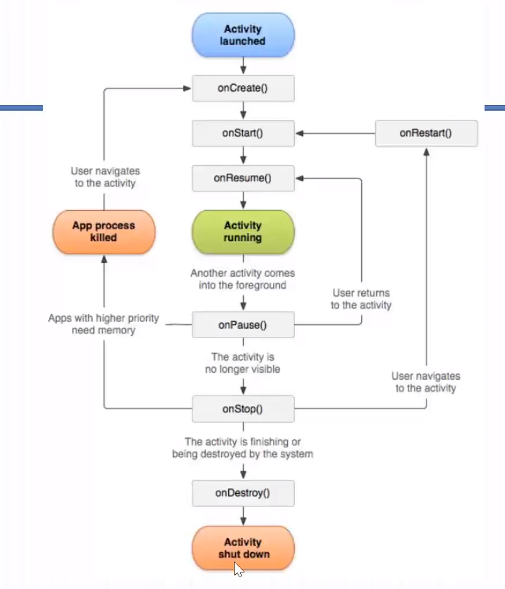
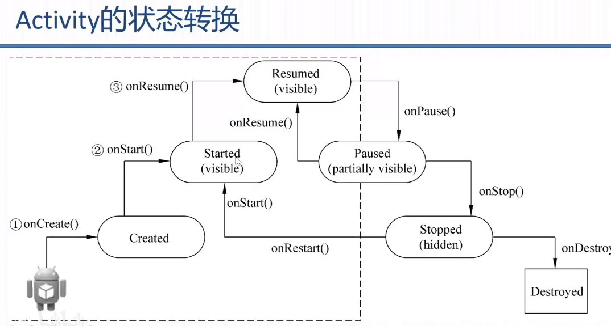
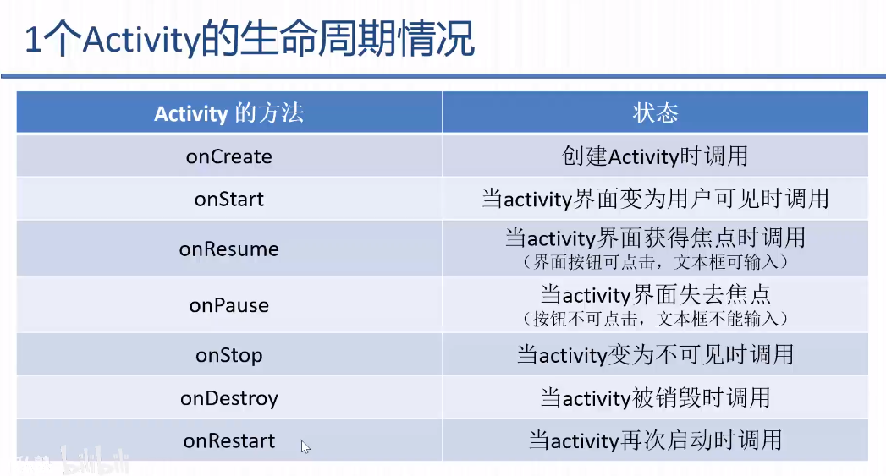
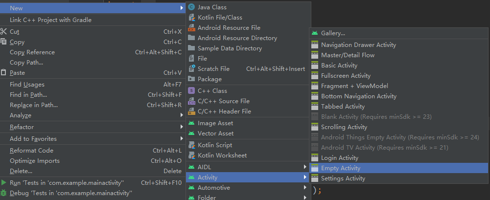

## Activity

- onCreate() 创建
- onStart() 启动
- onResume() 恢复
- onPause() 暂停
- onStop() 停止
- onDestory() 销毁
- onRestart() 重新开始



代码

```java
// mainactivity
package com.example.mainactivity;
public class MainActivity extends AppCompatActivity {

    @Override
    // 生命周期 --- onCreate
    protected void onCreate(Bundle savedInstanceState) {
        super.onCreate(savedInstanceState);
        setContentView(R.layout.activity_main);
        Log.e("activityState","MainActivity_onCreate");
    }

    @Override
    // 生命周期 --- onStart
    protected void onStart() {
        super.onStart();
        Log.e("activityState","MainActivity_onStart");
    }

    @Override
    // 生命周期 --- onRestart
    protected void onRestart() {
        super.onRestart();
        Log.e("activityState","MainActivity_onRestart");
    }

    @Override
    // 生命周期 --- onPause
    protected void onPause() {
        super.onPause();
        Log.e("activityState","MainActivity_onPause");
    }

    @Override
    // 生命周期 --- onResume
    protected void onResume() {
        super.onResume();
        Log.e("activityState","MainActivity_onResume");
    }

    @Override
    // 生命周期 --- onStop
    protected void onStop() {
        super.onStop();
        Log.e("activityState","MainActivity_onStop");
    }

    @Override
    // 生命周期 --- onDestroy
    protected void onDestroy() {
        super.onDestroy();
        Log.e("activityState","MainActivity_onDestroy");
    }
    public  void sendMessage(View view){
        // 隐式启动
        Intent intent = new Intent("action.nextActivity");
        startActivity(intent);
    }
}
```

给`secondActivity`添加事件

```xml
<!-- 22行 -->
<?xml version="1.0" encoding="utf-8"?>
<LinearLayout android:layout_width="match_parent"
    android:layout_height="match_parent"
    android:orientation="horizontal"
    xmlns:android="http://schemas.android.com/apk/res/android" >
    <TextView
        android:id="@+id/message"
        android:layout_width="wrap_content"
        android:layout_height="wrap_content"
        android:layout_weight="1"
        android:text="这是第二个activity"
        >
    </TextView>

    <Button
        android:id="@+id/btn"
        android:layout_width="wrap_content"
        android:layout_height="wrap_content"
        android:layout_weight="1"
        android:text="@string/send"
        android:onClick="closeActivity"
        />
</LinearLayout>
```

```java
// SecondActivity
package com.example.mainactivity;

public class SecondActivity extends AppCompatActivity {

    @Override
    // 生命周期 --- onCreate
    protected void onCreate(Bundle savedInstanceState) {
        super.onCreate(savedInstanceState);
        setContentView(R.layout.activity_second);
        Log.e("activityState","SecondActivity_onCreate");
    }

    @Override
    // 生命周期 --- onStart
    protected void onStart() {
        super.onStart();
        Log.e("activityState","SecondActivity_onStart");
    }

    @Override
    // 生命周期 --- onRestart
    protected void onRestart() {
        super.onRestart();
        Log.e("activityState","SecondActivity_onRestart");
    }

    @Override
    // 生命周期 --- onPause
    protected void onPause() {
        super.onPause();
        Log.e("activityState","SecondActivity_onPause");
    }

    @Override
    // 生命周期 --- onResume
    protected void onResume() {
        super.onResume();
        Log.e("activityState","SecondActivity_onResume");
    }

    @Override
    // 生命周期 --- onStop
    protected void onStop() {
        super.onStop();
        Log.e("activityState","SecondActivity_onStop");
    }

    @Override
    // 生命周期 --- onDestroy
    protected void onDestroy() {
        super.onDestroy();
        Log.e("activityState","SecondActivity_onDestroy");
    }

    public void closeActivity(View view){
        Log.e("activityState","SecondActivity_finish");
        // 关闭activity
        this.finish();
    }
}
```

**测试**

1.首次启动

```
E/activityState: MainActivity_onCreate
E/activityState: MainActivity_onStart
E/activityState: MainActivity_onResume
```

2.点击回到桌面

```
E/activityState: MainActivity_onPause
E/activityState: MainActivity_onStop
```

3.再次打开程序

```
E/activityState: MainActivity_onRestart
E/activityState: MainActivity_onStart
E/activityState: MainActivity_onResume
```

4.清除后台

```
E/activityState: MainActivity_onPause
E/activityState: MainActivity_onStop
E/activityState: MainActivity_onDestroy
```



一个activity生命周期



**测试二**

1.首次启动

```
E/activityState: MainActivity_onCreate
E/activityState: MainActivity_onStart
E/activityState: MainActivity_onResume
```

2.点击按钮启动第二个`activitity`

```
E/activityState: MainActivity_onPause
E/activityState: SecondActivity_onCreate
E/activityState: SecondActivity_onStart
E/activityState: SecondActivity_onResume
E/activityState: MainActivity_onStop
```

3.点击关闭按钮

```
E/activityState: SecondActivity_finish
E/activityState: SecondActivity_onPause
E/activityState: MainActivity_onRestart
E/activityState: MainActivity_onStart
E/activityState: MainActivity_onResume
E/activityState: SecondActivity_onStop
E/activityState: SecondActivity_onDestroy
```

两个activity生命周期


## Broadcast

- 定义：广播Broadcast是一种广泛运用在程序之间用于**传送消息的机制**

- 多数广播是系统发起的，如地域变换、电量不足、来电来信等。
- 程序也可以发出一个广播。

Broadcast Receiver组件

- 广播发出以后，由组件BroadcastReceiver过滤接收并响应。它**可以监听系统全局的广播消息**，实现**系统中不同组件之间通信**。
- BroadcastReceiver类是所有广播接收器的**基类(父类)**
- 消息到达时，BroadcastReceiver调用**onReceive方法**，方法执行完，BroadcastReceiver实例失效。

发送广播

安卓提供两种方法发送广播

- 满足条件的BroadcastReceiver(广播接收者)**都会执行**。使用Context.sendBroadcast()
- 有序广播，会根据BroadcastReceiver注册时IntentFilter的优先**顺序来执行**onReceive()方法。
  - 方法一：优先级在意图过滤器`<intentFilter>`的android:prority中声明
  - 方法二：代码中通过IntentFilter.setPriority()方法设置。

Broadcast Receiver需要注册后才能使用。

- 静态注册：在AndroidManifest.xml中注册，在内设置过滤器
- 动态注册：在java中通过Context.registerReceiver()方法来注册，**动态注册的类必须是BroadcastReceiver的子类**

- 静态注册的应用程序会**一直进行监听**

### 静态注册

1.定义广播接收者Broadcast Receiver

```java
package com.example.broadcastdemo01;

import android.content.BroadcastReceiver;
import android.content.Context;
import android.content.Intent;
import android.util.Log;

/**
 * 定义一个接收器
 */
public class MyReceiver extends BroadcastReceiver {
    @Override
    public void onReceive(Context context, Intent intent) {
        // 处理接受到广播
        Log.i(intent.getAction(),intent.getStringExtra("msg"));
    }
}
```

2.静态注册接收者

```xml
<?xml version="1.0" encoding="utf-8"?>
<manifest xmlns:android="http://schemas.android.com/apk/res/android"
    package="com.example.broadcastdemo01">
	...
        <!-- 注册过滤器 -->
        <receiver android:name=".MyReceiver">
            <intent-filter>
                <!-- 需要捕获的intent name -->
                <action android:name="com.example.BROADCAST"></action>
            </intent-filter>
        </receiver>
    </application>
</manifest>
```

3.定义发送广播的布局

```xml
<?xml version="1.0" encoding="utf-8"?>
<androidx.constraintlayout.widget.ConstraintLayout xmlns:android="http://schemas.android.com/apk/res/android"
    xmlns:app="http://schemas.android.com/apk/res-auto"
    xmlns:tools="http://schemas.android.com/tools"
    android:layout_width="match_parent"
    android:layout_height="match_parent"
    tools:context=".MainActivity">

    <!--  创建发送广播的按钮  -->
    <Button
        android:id="@+id/broadcast"
        android:layout_width="wrap_content"
        android:layout_height="wrap_content"
        android:text="发送广播"
        app:layout_constraintBottom_toBottomOf="parent"
        app:layout_constraintLeft_toLeftOf="parent"
        app:layout_constraintRight_toRightOf="parent"
        app:layout_constraintTop_toTopOf="parent" />

</androidx.constraintlayout.widget.ConstraintLayout>
```

4.点击按钮发送广播

```java
package com.example.broadcastdemo01;

import androidx.appcompat.app.AppCompatActivity;

import android.content.Intent;
import android.os.Bundle;
import android.view.View;
import android.widget.Button;

public class MainActivity extends AppCompatActivity {

    @Override
    protected void onCreate(Bundle savedInstanceState) {
        super.onCreate(savedInstanceState);
        setContentView(R.layout.activity_main);

        Button btn = findViewById(R.id.broadcast);
        // 发送广播
        btn.setOnClickListener(new View.OnClickListener(){

            @Override
            public void onClick(View v) {
                Intent intent = new Intent();
                // 设置隐式意图,传递可以接受的receiver
                intent.setAction("com.example.BROADCAST");
                // 传递数据
                intent.putExtra("msg","这是一条广播消息");
                // 发送广播
                sendBroadcast(intent);
            }
        });
    }
}
```

执行结果


### 动态注册

1.定义布局页面

```xml
<?xml version="1.0" encoding="utf-8"?>
<LinearLayout android:layout_width="match_parent"
    android:layout_height="match_parent"
    android:orientation="vertical"
    xmlns:android="http://schemas.android.com/apk/res/android" >
    <Button
        android:id="@+id/sendBroadcast"
        android:text="发送广播"
        android:layout_width="wrap_content"
        android:layout_height="wrap_content"/>
    <Button
        android:id="@+id/registerReceiver"
        android:text="注册接收器"
        android:layout_width="wrap_content"
        android:layout_height="wrap_content"/>
    <Button
        android:id="@+id/unregisterReceiver"
        android:text="取消注册接收器"
        android:layout_width="wrap_content"
        android:layout_height="wrap_content"/>
</LinearLayout>
```

2.定义接收器

```java
package com.example.broadcastdemo2;

import android.content.BroadcastReceiver;
import android.content.Context;
import android.content.Intent;
import android.util.Log;

// 定义广播接收器
public class MyReceiver extends BroadcastReceiver {
    @Override
    public void onReceive(Context context, Intent intent) {
        Log.i("Test","已经收到广播信息："+intent.getStringExtra("msg"));
    }
}
```

3.注册、取消注册接收器和发送广播

```java
package com.example.broadcastdemo2;

import androidx.appcompat.app.AppCompatActivity;

import android.content.Intent;
import android.content.IntentFilter;
import android.os.Bundle;
import android.view.View;
import android.widget.Button;

public class MainActivity extends AppCompatActivity {

    @Override
    protected void onCreate(Bundle savedInstanceState) {
        super.onCreate(savedInstanceState);
        setContentView(R.layout.activity_main);

        // 发送广播
        final Button sendBroadcast = findViewById(R.id.sendBroadcast);
        sendBroadcast.setOnClickListener(new View.OnClickListener() {
            @Override
            public void onClick(View v) {
                // 定义隐式意图
                Intent intent = new Intent();
                intent.setAction("sendMsg");
                intent.putExtra("msg","发送广播");
                // 发送广播
                sendBroadcast(intent);
            }
        });

        // 定义Receiver
        final MyReceiver[] receiver = {null};

        // 动态注册接收器
        final Button registerReceiver = findViewById(R.id.registerReceiver);
        registerReceiver.setOnClickListener(new View.OnClickListener() {
            @Override
            public void onClick(View v) {
               receiver[0] = new MyReceiver();
               // 定义意图过滤器
                IntentFilter filter = new IntentFilter();
                filter.addAction("sendMsg");
                // 注册广播接收者
                registerReceiver(receiver[0],filter);
            }
        });

        // 取消注册接收器
        final Button unregisterReceiver = findViewById(R.id.unregisterReceiver);
        unregisterReceiver.setOnClickListener(new View.OnClickListener() {
            @Override
            public void onClick(View v) {
                unregisterReceiver(receiver[0]);
            }
        });
    }
}
```

## Intent

### 1.显示调用

1.1创建activity



1.2创建成功


1.3修改manifest文件

- `android.intent.category.LAUNCHER` 会在桌面生成一个图标
- 如果不想显示为图标则需要设置为default `android:name="android.intent.category.DEFAULT"`

```xml
<!-- manifests/AndroidManifest.xml -->
<!-- 20-25行 -->
<?xml version="1.0" encoding="utf-8"?>
<manifest xmlns:android="http://schemas.android.com/apk/res/android"
    package="com.example.mainactivity">

    <application
        android:allowBackup="true"
        android:icon="@mipmap/ic_launcher"
        android:label="@string/app_name"
        android:roundIcon="@mipmap/ic_launcher_round"
        android:supportsRtl="true"
        android:theme="@style/AppTheme">
        <activity android:name=".MainActivity">
            <intent-filter>
                <action android:name="android.intent.action.MAIN" />
                <category android:name="android.intent.category.LAUNCHER" />
            </intent-filter>
        </activity>
        <activity android:name=".SecondActivity">
            <intent-filter>
                <action android:name="android.intent.action.MAIN" />
                <category android:name="android.intent.category.LAUNCHER" />
            </intent-filter>
        </activity>
    </application>
</manifest>
```

1.4 修改`secondActivity`布局

```xml
<?xml version="1.0" encoding="utf-8"?>
<LinearLayout android:layout_width="match_parent"
    android:layout_height="match_parent"
    android:orientation="horizontal"
    xmlns:android="http://schemas.android.com/apk/res/android" >
    <TextView
        android:id="@+id/message"
        android:layout_width="wrap_content"
        android:layout_height="wrap_content"
        android:layout_weight="1"
        android:text="这是第二个activity"
        >
    </TextView>

    <Button
        android:id="@+id/btn"
        android:layout_width="wrap_content"
        android:layout_height="wrap_content"
        android:layout_weight="1"
        android:text="@string/send"
        android:onClick="sendMessage"
        />
</LinearLayout>
```

1.5 设置意图跳转代码

```java
// MainActivity
package com.example.mainactivity;
public class MainActivity extends AppCompatActivity {

    @Override
    protected void onCreate(Bundle savedInstanceState) {
        super.onCreate(savedInstanceState);
        setContentView(R.layout.activity_main);
    }

    public  void sendMessage(View view){
        // 显示启动，写法一：class跳转
        Intent intent = new Intent(this,SecondActivity.class);
        this.startActivity(intent);
    }
}
```

运行结果

- 桌面上有两个图标 
- 在`MainActivity`中点击按钮跳转到`SecondActivity`

1.6 所有方式

```java
// 显示启动，写法一：class跳转
Intent intent = new Intent(this,SecondActivity.class);
this.startActivity(intent);

// 显示启动，写法二：包名.类名
Intent intent = new Intent();
intent.setClassName(this,"com.example.mainactivity.SecondActivity");
startActivity(intent);

// 显示启动，写法三：ComponentName
Intent intent = new Intent();
ComponentName cname = new ComponentName(this,SecondActivity.class);
intent.setComponent(cname);
startActivity(intent);
```

### 2.隐式调用

1.通过配置文件里的名称找到activity

2.当`<action android:name="action.nextActivity" />`完全一样时会弹出选择框

```xml
<!-- manifests/AndroidManifest.xml -->
<!-- 22行 随便起的名字 -->
<?xml version="1.0" encoding="utf-8"?>
<manifest xmlns:android="http://schemas.android.com/apk/res/android"
    package="com.example.mainactivity">

    <application
        android:allowBackup="true"
        android:icon="@mipmap/ic_launcher"
        android:label="@string/app_name"
        android:roundIcon="@mipmap/ic_launcher_round"
        android:supportsRtl="true"
        android:theme="@style/AppTheme">
        <activity android:name=".MainActivity">
            <intent-filter>
                <action android:name="android.intent.action.MAIN" />
                <category android:name="android.intent.category.LAUNCHER" />
            </intent-filter>
        </activity>
        <activity android:name=".SecondActivity">
            <intent-filter>
                <action android:name="action.nextActivity" />
                <category android:name="android.intent.category.DEFAULT" />
            </intent-filter>
        </activity>
    </application>
</manifest>
```

2.跳转代码

```java
package com.example.mainactivity;
public class MainActivity extends AppCompatActivity {

    @Override
    protected void onCreate(Bundle savedInstanceState) {
        super.onCreate(savedInstanceState);
        setContentView(R.layout.activity_main);
    }

    public  void sendMessage(View view){
        // 隐式启动
        Intent intent = new Intent();
        intent.setAction("action.nextActivity");
        startActivity(intent);
    }
}
```

3.两种写法

```java
// 写法一
Intent intent = new Intent();
intent.setAction("action.nextActivity");
startActivity(intent);

// 写法二
Intent intent = new Intent("action.nextActivity");
startActivity(intent);
```

##  Service

Service是一个能够在**后台执行**长时间运行的操作应用程序组件，**不提供用户界面**，应用在后台启动一个Service运行，即使用户切换到另一个应用此service也会**继续运行**。

特点：

- 无法与用户直接进行交互
- 必须由用户或其他程序启动
- 优先级介于前台应用和后台应用之间
- Service具有自己的生命周期。Service服务的生命周期是与Activity生命周期分类的，当Activity被暂停、停止或者销毁时，Service组件还可以继续处理其他任务。

创建服务的方式

- ①启动方式，通过startService()方法启动
- ②绑定方式，通过bindService()方法启动

① 启动方式

- Context.startService()：服务开始无限期运行
- Context.stopService()：被其他组件阻止

② 绑定方式

- Context.bindService()：绑定后客户端通过Ibind接口和服务通信
- Context.unbindService()：客户端解绑
- ServiceConnection提供数据
- 一个服务可以绑定多个ServiceConnection同时为不同组件提供服务

### 服务的生命周期


### 创建启动类型服务

- 通过startService()方法创建一个一个启动型的Service,并调用服务的onStartCommand()方法启动服务
- 启动服务时需要通过intent显示或隐式启动，Intent可以携带一部分数据，在Service的onStartCommand中可以使用其数据
- 默认启动的服务存在于主线程中，会导致主线程阻塞，故通常采用新线程模式启动服务

1.在MainActivity中通过intent启动服务

2.定义服务类MyService,继承Service,完成menifest注册

3.重写系统方法

------------------------------------------------------------------------------

1.定义界面

```xml
<?xml version="1.0" encoding="utf-8"?>
<LinearLayout android:layout_width="wrap_content"
    android:layout_height="wrap_content"
    android:orientation="vertical"
    xmlns:android="http://schemas.android.com/apk/res/android" >
    <TextView
        android:id="@+id/info"
        android:layout_width="wrap_content"
        android:layout_height="wrap_content"
        android:text="hello world"
        android:textSize="24sp"
        />
    <Button
        android:id="@+id/btn_start1"
        android:layout_width="wrap_content"
        android:layout_height="wrap_content"
        android:text="启动后台音乐服务：MUSIC"
        android:textSize="24sp"
        />
    <Button
        android:id="@+id/btn_stop"
        android:layout_width="wrap_content"
        android:layout_height="wrap_content"
        android:text="关闭后台音乐服务程序"
        android:textSize="24sp"
        />
</LinearLayout>
```


2.创建service

```java
package com.example.servicelifecycledemo;

import android.app.Service;
import android.content.Intent;
import android.os.IBinder;
import android.util.Log;
import android.widget.Toast;

// 创建service 并重新方法
public class MyService extends Service {
    public MyService() {
    }

    @Override
    public void onCreate() {
        Log.i("hello","onCreate() is running......");
        Toast.makeText(this,"创建后台服务",Toast.LENGTH_SHORT).show();
        super.onCreate();
    }

    @Override
    public int onStartCommand(Intent intent, int flags, int startId) {
        Log.i("hello","onStartCommand() is running......");
        Toast.makeText(this,"开始服务",Toast.LENGTH_SHORT).show();
        return super.onStartCommand(intent, flags, startId);
    }

    @Override
    public void onDestroy() {
        Log.i("hello","onDestroy() is running......");
        Toast.makeText(this,"销毁服务",Toast.LENGTH_SHORT).show();
        super.onDestroy();
    }

    @Override
    public IBinder onBind(Intent intent) {
        Log.i("hello","onBind() is running......");
        return null;
    }

    @Override
    public boolean onUnbind(Intent intent) {
        Log.i("hello","onUnbind() is running......");
        return super.onUnbind(intent);
    }

    @Override
    public void onRebind(Intent intent) {
        Log.i("hello","onRebind() is running......");
        super.onRebind(intent);
    }
}

```

3.mainfest配置服务

```xml
<service
	android:name=".MyService"
	android:enabled="true"
	android:exported="true">
</service>
```

4.启动服务和停止服务

```java
package com.example.servicelifecycledemo;

import androidx.appcompat.app.AppCompatActivity;

import android.content.Intent;
import android.os.Bundle;
import android.view.View;
import android.widget.Button;
import android.widget.TextView;

public class MainActivity extends AppCompatActivity {

    TextView info = null;
    Intent intent = null;
    @Override
    protected void onCreate(Bundle savedInstanceState) {
        super.onCreate(savedInstanceState);
        setContentView(R.layout.activity_main);

        info = findViewById(R.id.info);

        Button btn_start = findViewById(R.id.btn_start1);
        Button btn_stop = findViewById(R.id.btn_stop);
        btn_start.setOnClickListener(new MClick());
        btn_stop.setOnClickListener(new MClick());

        // 显示意图
        intent = new Intent(this,MyService.class);
    }

    class MClick implements View.OnClickListener{
        @Override
        public void onClick(View v) {
            switch (v.getId()){
                case R.id.btn_start1:
                    // 启动服务
                    MainActivity.this.startService(intent);
                    break;
                case R.id.btn_stop:
                    // 停止服务
                    MainActivity.this.stopService(intent);
                    break;
            }
        }
    }

}
```

启动效果

- 点击一次star和一次stop后
- 通过startService方式onBind、onUnbind、onRebind不会执行


----------------------------

播放音乐

1.创建界面

```xml
<?xml version="1.0" encoding="utf-8"?>
<LinearLayout android:layout_width="wrap_content"
    android:layout_height="wrap_content"
    android:orientation="vertical"
    xmlns:android="http://schemas.android.com/apk/res/android" >
    <TextView
        android:id="@+id/info"
        android:layout_width="wrap_content"
        android:layout_height="wrap_content"
        android:text="hello world"
        android:textSize="24sp"
        />
    <Button
        android:id="@+id/btn_start1"
        android:layout_width="wrap_content"
        android:layout_height="wrap_content"
        android:text="启动后台音乐服务：MUSIC1"
        android:textSize="24sp"
        />
    <Button
        android:id="@+id/btn_start2"
        android:layout_width="wrap_content"
        android:layout_height="wrap_content"
        android:text="启动后台音乐服务：MUSIC2"
        android:textSize="24sp"
        />
    <Button
        android:id="@+id/btn_stop"
        android:layout_width="wrap_content"
        android:layout_height="wrap_content"
        android:text="关闭后台音乐服务程序"
        android:textSize="24sp"
        />
</LinearLayout>
```


2.创建server

```java
package com.example.servicelifecycledemo;

import android.app.Service;
import android.content.Intent;
import android.media.MediaPlayer;
import android.os.IBinder;
import android.util.Log;
import android.widget.Toast;

// 创建service 并重新方法
public class MyService extends Service {

    // 定义播放器1
    MediaPlayer player1;
    // 定义播放器2
    MediaPlayer player2;

    public MyService() {
    }

    @Override
    public void onCreate() {
        Log.i("hello","onCreate() is running......");
        Toast.makeText(this,"创建后台服务",Toast.LENGTH_SHORT).show();
        super.onCreate();
    }

    @Override
    public int onStartCommand(Intent intent, int flags, int startId) {
        Log.i("hello","onStartCommand() is running......");
        Toast.makeText(this,"开始服务",Toast.LENGTH_SHORT).show();
        if(intent.getExtras().get("music").equals("R.raw.music1")){
            player1 = MediaPlayer.create(this,R.raw.music1);
            player1.start();
        }else{
            player2 = MediaPlayer.create(this,R.raw.music2);
            player2.start();
        }

        return START_STICKY;
    }

    @Override
    public void onDestroy() {
        Log.i("hello","onDestroy() is running......");
        Toast.makeText(this,"销毁服务",Toast.LENGTH_SHORT).show();
        if(player1 != null){
            // 释放掉资源
            player1.release();
            player1 = null;
        }
        if(player2 != null){
            player2.release();
            player2 = null;
        }
        super.onDestroy();
    }

    @Override
    public IBinder onBind(Intent intent) {
        Log.i("hello","onBind() is running......");
        return null;
    }

    @Override
    public boolean onUnbind(Intent intent) {
        Log.i("hello","onUnbind() is running......");
        return super.onUnbind(intent);
    }

    @Override
    public void onRebind(Intent intent) {
        Log.i("hello","onRebind() is running......");
        super.onRebind(intent);
    }
}
```

3.启动服务

```java
package com.example.servicelifecycledemo;

import androidx.appcompat.app.AppCompatActivity;

import android.content.Intent;
import android.os.Bundle;
import android.view.View;
import android.widget.Button;
import android.widget.TextView;

public class MainActivity extends AppCompatActivity {

    TextView info = null;
    Intent intent = null;
    @Override
    protected void onCreate(Bundle savedInstanceState) {
        super.onCreate(savedInstanceState);
        setContentView(R.layout.activity_main);

        info = findViewById(R.id.info);

        Button btn_start1 = findViewById(R.id.btn_start1);
        Button btn_start2 = findViewById(R.id.btn_start2);
        Button btn_stop = findViewById(R.id.btn_stop);
        btn_start1.setOnClickListener(new MClick());
        btn_start2.setOnClickListener(new MClick());
        btn_stop.setOnClickListener(new MClick());

        // 显示意图
        intent = new Intent(this,MyService.class);
    }

    class MClick implements View.OnClickListener{
        @Override
        public void onClick(View v) {
            switch (v.getId()){
                case R.id.btn_start1:
                    // 传递数据
                    intent.putExtra("music","R.raw.music1");
                    // 启动服务
                    MainActivity.this.startService(intent);
                    break;
                case R.id.btn_start2:
                    // 传递数据
                    intent.putExtra("music","R.raw.music2");
                    // 启动服务
                    MainActivity.this.startService(intent);
                    break;
                case R.id.btn_stop:
                    // 停止服务
                    MainActivity.this.stopService(intent);
                    break;
            }
        }
    }

}
```

4.运行结果

- 点击一次music1和一次music2
- onCreate在销毁前只会执行一次


### IntentService

- intentService是**service类的子类**，用于处理异步请求
- 大多数被启动类型的服务不需要同时处理多个请求，使用IntentService类是最好的选择
- 客户端可以通过startService(Intent)方法传递请求给IntentService。
- IntentService实际上是Looper、Handler、Service的集合体，它不仅有服务的功能，还有消息处理和消息循环的功能
- 使用IntentService开发异步程序会减少很多工作量

操作步骤

1.定义服务启动语句

2.定义服务类，继承IntentService

3.重写方法

#### 基本服务

1.布局

```xml
<?xml version="1.0" encoding="utf-8"?>
<LinearLayout android:layout_width="match_parent"
    android:layout_height="match_parent"
    android:orientation="vertical"
    xmlns:android="http://schemas.android.com/apk/res/android" >
    <Button
        android:id="@+id/btn1"
        android:text="启动IntentService 1 to 10"
        android:layout_width="wrap_content"
        android:layout_height="wrap_content"/>
    <Button
        android:id="@+id/btn2"
        android:text="启动IntentService 10 to 20"
        android:layout_width="wrap_content"
        android:layout_height="wrap_content"/>
</LinearLayout>
```


2.定义服务类，继承IntentService

```java
package com.example.intentservicedemo;

import android.app.IntentService;
import android.content.Intent;
import android.content.Context;
import android.util.Log;

public class MyIntentService extends IntentService {


    public MyIntentService() {
        super("MyIntentService");
    }

    @Override
    protected void onHandleIntent(Intent intent) {
        if (intent != null) {
            String num = (String) intent.getExtras().get("num");
            if("1".endsWith(num)){
                Log.i("test",Thread.currentThread().getName()+"--"+num);
                for(int i = 0;i<=10;i++){
                    try {
                        Thread.sleep(1000);
                        Log.i("test",Thread.currentThread().getName()+"***"+i);
                    } catch (InterruptedException e) {
                        e.printStackTrace();
                    }
                }
            }else if("2".endsWith(num)){
                Log.i("test",Thread.currentThread().getName()+"--"+num);
                for(int i = 10;i<=20;i++){
                    Log.i("test",Thread.currentThread().getName()+"***"+i);
                }
            }

        }
    }

    @Override
    public void onDestroy() {
        super.onDestroy();
        Log.i("test","服务停止销毁");
    }
}
```

3.启动服务

```java
package com.example.intentservicedemo;

import androidx.appcompat.app.AppCompatActivity;

import android.content.Intent;
import android.os.Bundle;
import android.view.View;
import android.widget.Button;

public class MainActivity extends AppCompatActivity {

    Button btn1;
    Button btn2;
    Intent intent;

    @Override
    protected void onCreate(Bundle savedInstanceState) {
        super.onCreate(savedInstanceState);
        setContentView(R.layout.activity_main);
        btn1 = findViewById(R.id.btn1);
        btn2 = findViewById(R.id.btn2);

        btn1.setOnClickListener(new MClick());
        btn2.setOnClickListener(new MClick());

    }

    private class MClick implements View.OnClickListener{

        @Override
        public void onClick(View v) {
            intent = new Intent(MainActivity.this,MyIntentService.class);
           switch (v.getId()){
               case R.id.btn1:
                   intent.putExtra("num","1");
                   break;
               case R.id.btn2:
                   intent.putExtra("num","2");
                   break;
           }
           startService(intent);
        }
    }
}
```

4.运行效果

- 点击服务1后马上点击服务2
- 服务2不会马上执行，会等服务1执行完成后执行

```
08-12 09:05:23.458 10018-10159/com.example.intentservicedemo I/test: IntentService[MyIntentService]--1
08-12 09:05:24.460 10018-10159/com.example.intentservicedemo I/test: IntentService[MyIntentService]***0
08-12 09:05:25.460 10018-10159/com.example.intentservicedemo I/test: IntentService[MyIntentService]***1
08-12 09:05:26.461 10018-10159/com.example.intentservicedemo I/test: IntentService[MyIntentService]***2
08-12 09:05:27.462 10018-10159/com.example.intentservicedemo I/test: IntentService[MyIntentService]***3
08-12 09:05:28.463 10018-10159/com.example.intentservicedemo I/test: IntentService[MyIntentService]***4
08-12 09:05:29.464 10018-10159/com.example.intentservicedemo I/test: IntentService[MyIntentService]***5
08-12 09:05:30.465 10018-10159/com.example.intentservicedemo I/test: IntentService[MyIntentService]***6
08-12 09:05:31.466 10018-10159/com.example.intentservicedemo I/test: IntentService[MyIntentService]***7
08-12 09:05:32.467 10018-10159/com.example.intentservicedemo I/test: IntentService[MyIntentService]***8
08-12 09:05:33.468 10018-10159/com.example.intentservicedemo I/test: IntentService[MyIntentService]***9
08-12 09:05:34.469 10018-10159/com.example.intentservicedemo I/test: IntentService[MyIntentService]***10
08-12 09:05:34.470 10018-10159/com.example.intentservicedemo I/test: IntentService[MyIntentService]--2
08-12 09:05:34.470 10018-10159/com.example.intentservicedemo I/test: IntentService[MyIntentService]***10
08-12 09:05:34.470 10018-10159/com.example.intentservicedemo I/test: IntentService[MyIntentService]***11
08-12 09:05:34.470 10018-10159/com.example.intentservicedemo I/test: IntentService[MyIntentService]***12
08-12 09:05:34.470 10018-10159/com.example.intentservicedemo I/test: IntentService[MyIntentService]***13
08-12 09:05:34.470 10018-10159/com.example.intentservicedemo I/test: IntentService[MyIntentService]***14
08-12 09:05:34.470 10018-10159/com.example.intentservicedemo I/test: IntentService[MyIntentService]***15
08-12 09:05:34.470 10018-10159/com.example.intentservicedemo I/test: IntentService[MyIntentService]***16
08-12 09:05:34.471 10018-10159/com.example.intentservicedemo I/test: IntentService[MyIntentService]***17
08-12 09:05:34.471 10018-10159/com.example.intentservicedemo I/test: IntentService[MyIntentService]***18
08-12 09:05:34.471 10018-10159/com.example.intentservicedemo I/test: IntentService[MyIntentService]***19
08-12 09:05:34.471 10018-10159/com.example.intentservicedemo I/test: IntentService[MyIntentService]***20
08-12 09:05:34.472 10018-10018/com.example.intentservicedemo I/test: 服务停止销毁
```

#### 绑定类型的服务

- 绑定类型服务运行组件（如Activity）绑定服务，实现发送请求、接收响应及执行进程间通信。
- 一个典型的绑定类型服务只跟他所绑定的应用程序组件同时存在，并且不在后台无限期运行。  

1.定义页面

```xml
<?xml version="1.0" encoding="utf-8"?>
<LinearLayout android:layout_width="match_parent"
    android:layout_height="match_parent"
    android:orientation="vertical"
    xmlns:android="http://schemas.android.com/apk/res/android" >
    <Button
        android:id="@+id/btnBindService"
        android:text="绑定服务"
        android:onClick="bindService"
        android:layout_width="wrap_content"
        android:layout_height="wrap_content"/>
    <Button
        android:id="@+id/btnUnBindService"
        android:text="取消绑定服务"
        android:onClick="unBindService"
        android:layout_width="wrap_content"
        android:layout_height="wrap_content"/>
    <Button
        android:id="@+id/getData"
        android:text="获取随机数"
        android:onClick="getData"
        android:layout_width="wrap_content"
        android:layout_height="wrap_content"/>
</LinearLayout>
```


2.定义service

```java
package com.example.bindingdemo;

import android.app.Service;
import android.content.Intent;
import android.os.Binder;
import android.os.IBinder;
import android.util.Log;

import java.util.Random;

public class MyBindService extends Service {

    final static String TAG = "MyBindService";
    IBinder iBinder = null;
    Random mGenerator;

    // 定义要传递的binder
    public class Mybinder extends Binder{
        MyBindService getService(){
            return MyBindService.this;
        }
    }
    @Override
    public void onCreate() {
        Log.i(TAG,"onCreate..............");
        super.onCreate();
        // 初始化binder
        iBinder = new Mybinder();
        // 初始化随机数对象
        mGenerator = new Random();
    }

    @Override
    public void onDestroy() {
        Log.i(TAG,"onDestroy..............");
        super.onDestroy();
    }

    @Override
    public boolean onUnbind(Intent intent) {
        Log.i(TAG,"onUnbind..............");
        return super.onUnbind(intent);
    }

    @Override
    public void onRebind(Intent intent) {
        Log.i(TAG,"onRebind..............");
        super.onRebind(intent);
    }

    @Override
    public IBinder onBind(Intent intent) {
        Log.i(TAG,"onBind..............");
        // 传递binder
        return iBinder;
    }

    // 获取随机数
    public int getRandomNumber(){
        return mGenerator.nextInt(100);
    }
    public MyBindService() {
    }
}
```

3.绑定服务

```java
package com.example.bindingdemo;

import androidx.appcompat.app.AppCompatActivity;

import android.content.ComponentName;
import android.content.Context;
import android.content.Intent;
import android.content.ServiceConnection;
import android.os.Bundle;
import android.os.IBinder;
import android.util.Log;
import android.view.View;
import android.widget.Toast;

public class MainActivity extends AppCompatActivity {

    MyBindService myService;
    // 是否绑定
    boolean mbind = false;

    ServiceConnection myConnection =  new ServiceConnection(){

        @Override
        public void onServiceConnected(ComponentName name, IBinder iBinder) {
            Log.i("MyBindService","onServiceConnected...............");
            MyBindService.Mybinder mybinder = (MyBindService.Mybinder) iBinder;
            myService = mybinder.getService();
            mbind = true;
        }

        @Override
        public void onServiceDisconnected(ComponentName name) {
            Log.i("MyBindService","onServiceDisconnected...............链接断开");
            mbind = false;
        }
    };

    @Override
    protected void onCreate(Bundle savedInstanceState) {
        super.onCreate(savedInstanceState);
        setContentView(R.layout.activity_main);
    }

    public void bindService(View view){
        // 创建Intent
        Intent intent = new Intent(this,MyBindService.class);
        // 绑定服务 BIND_AUTO_CREATE 绑定并自动执行create方法
        bindService(intent,myConnection, Context.BIND_AUTO_CREATE);
    }

    public void unBindService(View view){
        // 取消绑定
        if(mbind){
            unbindService(myConnection);
            mbind = false;
        }
    }

    public void getData(View view){
        if(mbind){
            Toast.makeText(this,"获取到的随机数为："+myService.getRandomNumber(),Toast.LENGTH_LONG).show();
        }else {
            Toast.makeText(this,"服务未绑定",Toast.LENGTH_LONG).show();
        }
    }

}
```

运行结果

- 点击绑定服务
- 取消绑定
- 获取随机数必须绑定后才能获取

```
08-12 10:39:48.598 12886-12886/com.example.bindingdemo I/MyBindService: onCreate..............
08-12 10:39:48.598 12886-12886/com.example.bindingdemo I/MyBindService: onBind..............
08-12 10:39:48.603 12886-12886/com.example.bindingdemo I/MyBindService: onServiceConnected...............
08-12 10:39:53.304 12886-12886/com.example.bindingdemo I/MyBindService: onUnbind..............
08-12 10:39:53.305 12886-12886/com.example.bindingdemo I/MyBindService: onDestroy..............
```

