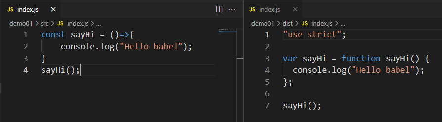
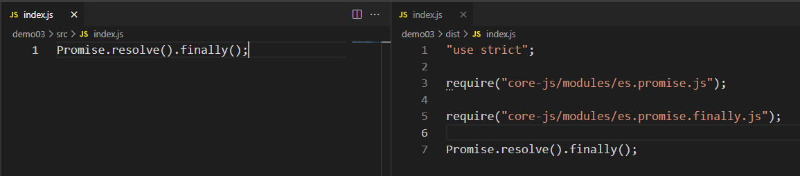
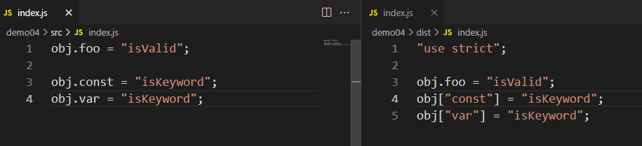
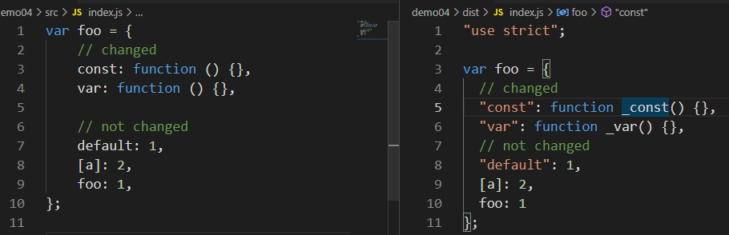
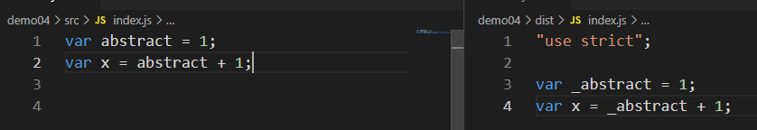
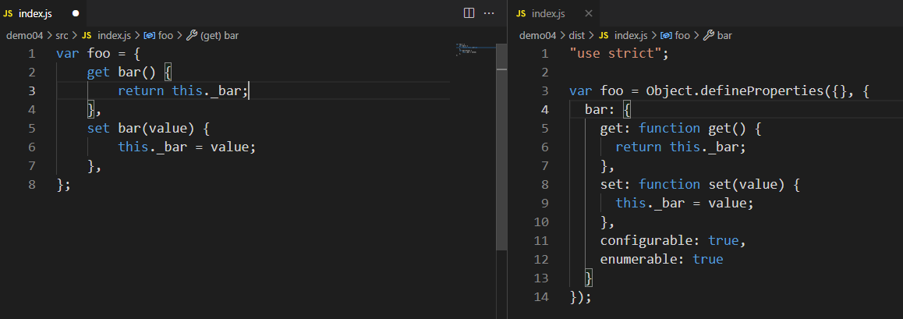

## 基本使用

1.初始化项目

```
npm init -y
```

2.安装babel

```
# 开发配置
npm i -D @babel/core @babel/cli @babel/preset-env
# 生产配置
npm i @babel/polyfill
```

3.新建`babel.config.js`

```js
const presets = [
    [
        "@babel/env",
        {
            targets: {
                ie: "10",
                edge: "17",
                firefox: "60",
                chrome: "67",
                safari: "11.1",
            },
            useBuiltIns: "usage",
            corejs: "3.6.4",
        },
    ],
];
module.exports = { presets };
```

4.新建src目录并新建index.js

```js
const sayHi = ()=>{
    console.log("Hello babel");
}
sayHi();
```

5.编译

```sh
# 原始
.\node_modules\.bin\babel src -out-dir dist
# npx
npx babel src --out-dir dist
# 简写
npx babel src -d dist
```

6.效果



## 插件和预设

1.安装箭头函数转换插件

```
npm i -D @babel/plugin-transform-arrow-functions
```

2.配置babel

```js
const presets = [
    [
        "@babel/env",
        {
            targets: {
                edge: "17",
                firefox: "60",
                chrome: "67",
                safari: "11.1",
            },
            useBuiltIns: "usage",
            corejs: "3.6.4",
        },
    ],
];
module.exports = { presets };
```

3.执行转换命令

```
npx babel src -d dist --plugins=@babel/plugin-transform-arrow-functions
```

4.简化配置script

```json
"scripts": {
    "build":"babel src -d dist",
    "build:arrow":"babel src -d dist --plugins=@babel/plugin-transform-arrow-functions",
    "build:env":"babel src -d dist --presets=@babel/env"
},
```

## Polyfill

1.安装`polyfill`

```
npm install --save @babel/polyfill
```

2.使用polyfill

```js
const presets = [
    [
        "@babel/env",
        {
            targets: {
                edge: "17",
                firefox: "60",
                chrome: "67",
                safari: "11.1",
            },
            // 使用polyfill
            useBuiltIns: "usage",
            corejs: "3.6.4",
        },
    ],
];
module.exports = { presets };
```

3.编写测试代码

```js
Promise.resolve().finally();
```

4.运行结果

```
npm run build:auto
```



## 插件

### ES3插件

#### 插件一

```
npm i -D @babel/plugin-transform-member-expression-literals
```

1.配置插件

```js
const presets = [
    [
        "@babel/env",
        {
            targets: {
                edge: "17",
                firefox: "60",
                chrome: "67",
                safari: "11.1",
            },
            // 使用polyfill
            useBuiltIns: "usage",
            corejs: "3.6.4",
        },
    ],
];

// 配置插件
const plugins = ["@babel/plugin-transform-member-expression-literals"];

module.exports = { presets,plugins};
```

2.编写测试代码

```js
// 此插件会将关键字转换成[]形式
obj.foo = "isValid";

obj.const = "isKeyword";
obj.var = "isKeyword";
```

3.运行结果

```
npm run build:auot
```



#### 插件二

```
npm i -D @babel/plugin-transform-property-literals
```

1.配置插件

```js
// 配置插件
const plugins = ["@babel/plugin-transform-property-literals"];
```

2.编写测试代码

```js
// 将函数类关键字作为对象的转换为_关键字
var foo = {
    // changed
    const: function () {},
    var: function () {},

    // not changed
    default: 1,
    [a]: 2,
    foo: 1,
};
```

3.运行结果

```
npm run build:auot
```



插件三

```
npm i -D @babel/plugin-transform-reserved-words 
```

1.配置插件

```
// 配置插件
const plugins = ["@babel/plugin-transform-reserved-words"];
```

2.编写测试代码

```js
// 将变量关键字转换为变量_下划线形式
var abstract = 1;
var x = abstract + 1;
```

3.运行结果

```
npm run build:auot
```



### ES5插件

#### 插件一

```
npm i -D @babel/plugin-transform-property-mutators 
```

1.配置插件

```
// 配置插件
const plugins = ["@babel/plugin-transform-property-mutators"];
```

2.编写测试代码

```js
// 生成get set
var foo = {
  get bar() {
    return this._bar;
  },
  set bar(value) {
    this._bar = value;
  },
};
```

3.运行结果

```
npm run build:auot
```

