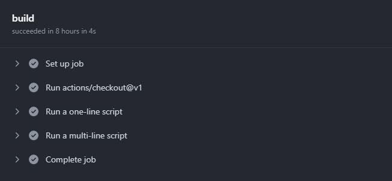

## 开始入门

```yaml
name: CI # 流程的名称
on: [push] # 触发的条件
jobs: # 具体的流程
  build: # 一个流程(名称为build)
    runs-on: ubuntu-latest # 运行的环境
    steps: # 执行的具体步
      - uses: actions/checkout@v1 # 下载下来代码
      - name: Run a one-line script # 当前步骤命名
        run: echo hello,world # 打印hello world
      - name: Run a multi-line script # 当前步骤命名(打印多行脚本)
        run: |
          echo Add other actions to build     
          echo test, and deploy your project.
```



## Actions 详解

**官方文档**：[文档地址](https://docs.github.com/en/actions/reference/workflow-syntax-for-github-actions)

### `name`

你的工作流程名称。GitHub 会在存储库的操作页面上显示工作流程的名称。如果省略`name`，GitHub 会将其设置为相对于存储库根目录的工作流文件路径。

### `on`

**必须要有。**触发工作流的条件。

示例 1：单个事件

```yaml
# 将代码推送到存储库中的任何分支时触发
on: push
```

示例 2：多个事件

```yaml
# 拉取代码或者发起pull_request时触发
on: [push, pull_request]
```

示例 3：使用具有活动类型或配置的多个事件

```yaml
on:
  # 发起push或者pull_request并且是main分支时触发
  push:
    branches:
      - main
  pull_request:
    branches:
      - main
```

示例 4：自动触发

```yaml
on:
  schedule:
    # 每天 5:30 和 17:30 触发工作流
    - cron: "30 5,17 * * *"
```

示例 5：设置路径

```yaml
on:
  push:
    paths:
      - src/*
```

### `jobs`

工作流(jobs)一般由一个或多个作业组成。默认情况下，作业并行运行。要按顺序运行作业，您可以使用`jobs.<job_id>.needs`关键字定义对其他作业的依赖关系。

---

`job_id`: 每个作业都必须有一个 id 与作业关联。键`job_id`是一个字符串，其值是作业配置数据的映射。您必须用对象`<job_id>`唯一的字符串替换`jobs`。在`<job_id>`必须以字母开头，或者`_`和只包含字母数字字符，`-`或`_`。

示例：

```yaml
jobs:
  my_first_job:
    name: My first job
  my_second_job:
    name: My second job
```

---

`name`:GitHub 上显示的作业名称。

---

`neends` 标识在此作业运行之前必须成功完成的任何作业。

示例：

```yaml
# job1必须在job2开始前成功完成，并job3等待job1和job2完成
jobs:
  job1:
  job2:
    needs: job1
  job3:
    needs: [job1, job2]
```

---

`runs-on` **必需**。运行作业的机器类型。该机器可以是 GitHub 托管的运行器或自托管的运行器。

|                              |                                      |                                                                                                                                                                                                                   |
| :--------------------------- | :----------------------------------- | :---------------------------------------------------------------------------------------------------------------------------------------------------------------------------------------------------------------- |
| **虚拟环境**                 | **YAML 工作流标签**                  | **笔记**                                                                                                                                                                                                          |
| Windows Server 2022 [测试版] | `windows-2022`                       | 该`windows-latest`标签当前使用 Windows Server 2019 运行程序映像。                                                                                                                                                 |
| 视窗服务器 2019              | `windows-latest` 或者 `windows-2019` |                                                                                                                                                                                                                   |
| 视窗服务器 2016              | `windows-2016`                       |                                                                                                                                                                                                                   |
| Ubuntu 20.04                 | `ubuntu-latest` 或者 `ubuntu-20.04`  |                                                                                                                                                                                                                   |
| Ubuntu 18.04                 | `ubuntu-18.04`                       |                                                                                                                                                                                                                   |
| Ubuntu 16.04 [已弃用]        | `ubuntu-16.04`                       | 已弃用且仅限于现有客户。迁移到 Ubuntu 20.04。有关更多信息，请参阅 [博客文章](https://github.blog/changelog/2021-04-29-github-actions-ubuntu-16-04-lts-virtual-environment-will-be-removed-on-september-20-2021)。 |
| macOS 大苏尔 11              | `macos-11`                           | 该`macos-latest`标签当前使用 macOS 10.15 runner 映像。                                                                                                                                                            |
| macOS Catalina 10.15         | `macos-latest` 或者 `macos-10.15`    |                                                                                                                                                                                                                   |

示例

```yaml
runs-on: ubuntu-latest
```

---

`uses` :选择要作为作业步骤的一部分运行的操作。操作是可重用的代码单元。您可以使用在与工作流相同的存储库、公共存储库或已[发布的 Docker 容器映像中定义的操作](https://hub.docker.com/)。

示例：使用版本化操作

```yaml
steps:
  # Reference a specific commit
  - uses: actions/checkout@a81bbbf8298c0fa03ea29cdc473d45769f953675
  # Reference the major version of a release
  - uses: actions/checkout@v2
  # Reference a specific version
  - uses: actions/checkout@v2.2.0
  # Reference a branch
  - uses: actions/checkout@main
```

示例：使用 Docker Hub 操作

```
{owner}/{repo}@{ref}
```

您可以在公共 GitHub 存储库中指定分支、引用或 SHA。

```yaml
jobs:
  my_first_job:
    steps:
      - name: My first step
        # Uses the default branch of a public repository
        uses: actions/heroku@main
      - name: My second step
        # Uses a specific version tag of a public repository
        uses: actions/aws@v2.0.1
```

## 容器中运行

```yaml
jobs:
  job1:
  	runs-on: ubuntu-latest
  	container:
  		image: node:8
  	steps:
  	- uses: actions/checkout@v1
  	- run: |
  		node -v
```
