## 结构选择器

### 后代选择器

> 后代选择器：标签下所有的后代**都会被选择**

 

```html
<style type="text/css">
    main article h2 {
        color: red;
    }
</style>
<main>
    <article>
        <h2>外层</h2>
        <aside>
            <h2>内层</h2>
        </aside>
    </article>
</main>
```

> 显示效果：

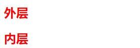

### 子元素选择

> 子元素选择器：只会选择儿子，孙子不会被选择

 

```html
<style type="text/css">
    main article>h2 {
        color: red;
    }
</style>
<main>
    <article>
        <h2>外层</h2>
        <aside>
            <h2>内层</h2>
        </aside>
    </article>
</main>
```

> 显示效果

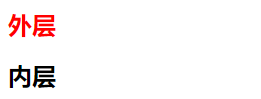

### 后面兄弟选择

> 后面兄弟选择器：上面的元素不会被选择

 

```html
<style type="text/css">
    article h1~h2 {
        color: red;
    }
</style>
<article>
    <h2>上面的不会被选择</h2>
    <h1>兄弟选择器</h1>
    <h2>兄弟1</h2>
    <aside>
        <h2>内层</h2>
    </aside>
    <h2>兄弟2</h2>
</article>
```

> 显示效果

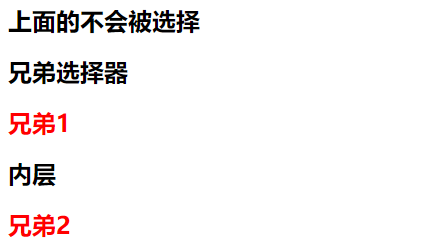

### 紧邻兄弟选择

> 紧邻兄弟选择：只会选择下面紧挨着的兄弟，中间不能有其他标签

 

```html
<style type="text/css">
    article h1+h2 {
        color: red;
    }
</style>
<article>
    <h2>上面的不会被选择</h2>
    <h1>兄弟选择器</h1>
    <h2>兄弟1</h2>
    <aside>
        <h2>内层</h2>
    </aside>
    <h2>兄弟2</h2>
</article>
```

> 显示效果

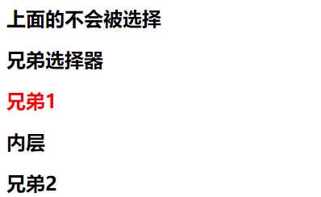

## 属性选择器

属性选择器：有[指定属性]的**全部匹配**才能被选择，可以指定多个属性不能有空格

| 选择器              | 示例               | 描述                                                        |
| ------------------- | ------------------ | ----------------------------------------------------------- |
| [attribute]         | [target]           | 带有 target 属性所有元素                                    |
| [attribute=value]   | [target=_blank]    | targe 属性 等于"_blank" 的所有元素                          |
| [attribute~=value]  | [title~=houdunren] | title 属性包含单词 "houdunren" 的所有元素                   |
| [attribute\|=value] | [title\|=hd]       | `title 属性值为 "hd"的单词，或hd-cms` 以`-`连接的的独立单词 |
| [attribute*=value]  | a[src*="hdcms"]    | src 属性中包含 "hdcms" 字符的每个 元素                      |
| [attribute^=value]  | a[src^="https"]    | src 属性值以 "https" 开头的每个 元素                        |
| [attribute$=value]  | a[src$=".jpeg"]    | src 属性以 ".jpeg" 结尾的所有 元素                          |

```html
<style type="text/css">
    <!--多个属性[属性1][属性2]-->
    h1[title] {
        color: red;
    }
</style>
<article>
    <h1 title>属性选择器</h1>
    <h1>属性选择器</h1>
</article>
```

> 显示效果

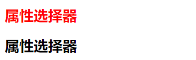

> 属性值选择:需要属性和值**全部匹配**才能被选中

```html
<style type="text/css">
    h1[title="tudou"][id] {
        color: red;
    }
</style>
<article>
    <h1 title="tudou" id>属性选择器</h1>
    <h1 title id>属性选择器</h1>
</article>
```

> 显示效果：


> 以某字符串**开始**的就会被选中

```html
<style type="text/css">
    h1[title^="tudou"][id] {
        color: red;
    }
</style>
<article>
    <h1 title="tudou" id>属性选择器</h1>
    <h1 title="tudou123" id>属性选择器</h1>
</article>
```

> 显示效果

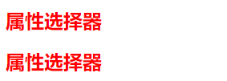

> 以某字符串**结尾**的就会被选中

 

```html
<style type="text/css">
    h1[title$="com"] {
        color: red;
    }
</style>
<article>
    <h1 title="tudou">属性选择器</h1>
    <h1 title="tudou.com">属性选择器</h1>
</article>
```

> 显示效果

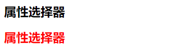

> **任何位置出现**都会被选中

 

```html
<style type="text/css">
    h1[title*="com"] {
        color: red;
    }
</style>
<article>
    <h1 title="tucomdou">属性选择器</h1>
    <h1 title="tudou.com">属性选择器</h1>
</article>
```

> 显示效果


> 是一个**独立单词**才会被选中：单词左右都有空格

 

```html
<style type="text/css">
    h1[title~="tudou"] {
        color: red;
    }
</style>
<article>
    <h1 title="tudou">属性选择器</h1>
    <h1 title="tudou.com">属性选择器</h1>
    <h1 title="www. tudou .com">属性选择器</h1>
</article>
```

> 显示效果

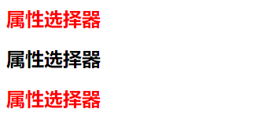

> 和选则字符串**一样**或以选择字符串开始并且**后面用-连接**

 

```html
<style type="text/css">
    h1[title|="tudou"] {
        color: red;
    }
</style>
<article>
    <h1 title="tudou">属性选择器</h1>
    <h1 title="tudou-com">属性选择器</h1>
    <h1 title="tudou.com">属性选择器</h1>
</article>
```

> 显示效果

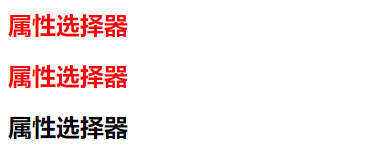

## 伪类选择器

| 状态                 | 示例                  | 说明                                       |
| -------------------- | --------------------- | ------------------------------------------ |
| :link                | a:link                | 选择所有未被访问的链接                     |
| :visited             | a:visited             | 选择所有已被访问的链接                     |
| :hover               | a:hover               | 鼠标移动到元素上时                         |
| :active              | a:active              | 点击正在发生时                             |
| :focus               | input::focus          | 选择获得焦点的 input 元素                  |
| :root                | :root                 | 选择文档的根元素即html。                   |
| :empty               | p:empty               | 选择没有子元素的每个元素（包括文本节点）。 |
| :first-child         | p:first-child         | 选择属于父元素的第一个子元素的每个元素     |
| :last-child          | p:last-child          | 选择属于其父元素最后一个子元素每个元素。   |
| :first-of-type       | p:first-of-type       | 选择属于其父元素的首个元素的每个元素       |
| :last-of-type        | p:last-of-type        | 选择属于其父元素的最后元素的每个元素。     |
| :only-of-type        | p:only-of-type        | 选择属于其父元素唯一的元素的每个元素。     |
| :only-child          | p:only-child          | 选择属于其父元素的唯一子元素的每个元素。   |
| :nth-child(n)        | p:nth-child(2)        | 选择属于其父元素的第二个子元素的每个元素。 |
| :nth-child(odd)      | p:nth-child(odd)      | 选择属于其父元素的奇数元素。               |
| :nth-child(even)     | p:nth-child(even)     | 选择属于其父元素的偶数元素。               |
| :nth-of-type(n)      | p:nth-of-type(2)      | 选择属于其父元素第二个元素的每个元素。     |
| :nth-last-child(n)   | p:nth-last-child(2)   | 同上，从最后一个子元素开始计数。           |
| :nth-last-of-type(n) | p:nth-last-of-type(2) | 同上，但是从最后一个子元素开始计数。       |
| :not(selector)       | :not(p)               | 选择非元素的每个元素                       |

### 超链接伪类

```html
<style type="text/css">
    /* 未点击颜色 */
    a:link {
        color: red;
    }
    /* 访问之后 */
    a:visited {
        color: yellow;
    }
    /* 鼠标滑过 */
    a:hover {
        color: green;
    }
    /* 点击没有松开鼠标的时候 */
    a:active {
        color: black;
    }
</style>
<a href="http://www.baidu.com">百度一下</a>
```

### 表单使用伪类

```html
<style type="text/css">
    /* 获得焦点 */
    input:focus {
        background: blue;
        /* 去掉外框线 */
        outline: none;
    }
    /* 鼠标滑过 */
    input:hover {
        background: red;
    }
    /* 鼠标按下未松开 */
    input:active {
        background: green;
    }
</style>
<input type="text" />
```

### target锚点选择器

> 未使用锚点的情况

```html
<style type="text/css">
    div {
        height: 900px;
        border: solid 1px #ddd;
    }
</style>
<a href="#hd">页面跳转</a>
<div></div>
<div id="hd">
    跳转到的内容
</div>
```

> 使用锚点选择器

```html
<style type="text/css">
    div {
        height: 900px;
        border: solid 1px #ddd;
    }
    div:target{
        color: red;
    }
</style>
<a href="#hd">页面跳转</a>
<div></div>
<div id="hd">
    跳转到的内容
</div>
```


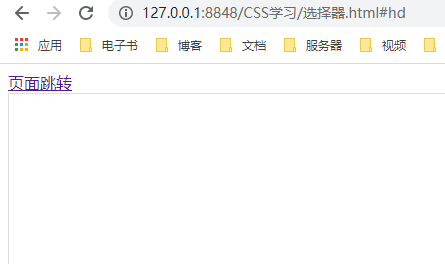


### 根选择器

> 根选择器：会选择html标签

```html
<style type="text/css">
    :root {
        color: red;
    }
</style>
<h1>root选择器</h1>
<p>root选择器</p>
```

> 显示效果

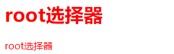

### 空选择器

> 如果**内容为空**则选择：里面**不能有文字或标签**

```html
<style type="text/css">
    li {
        border: 1px solid #ddd;
        margin-bottom: 10px;
    }
    /* 选择内容为空的元素 */
    li:empty {
        display: none;
    }
</style>
<ul>
    <li>空选择器</li>
    <li></li>
</ul>
```

> 显示效果

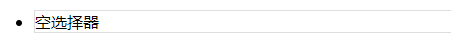

## 结构伪类

### :first-children

> 会选择在article下第一个元素叫span的标签

```html
<style type="text/css">
    article span:first-child {
        color: red;
    }
</style>
<article>
    <span>百度</span>
    <aside>
        <span>淘宝</span>
        <span>京东</span>
    </aside>
</article>
```

> 运行效果：

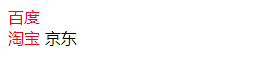

> **错误实例**：因为p标签是第二个元素所有选不中

```html
<style type="text/css">
    article p:first-child {
        color: red;
    }
</style>
<article>
    <span>百度</span>
    <p>选不中</p>
</article>
```

> 运行效果

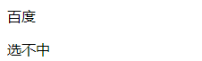

### :first-of-type

> 选择是**某类型的第一个**：

```html
<style type="text/css">
    article p:first-of-type {
        color: red;
    }
</style>
<article>
    <span>百度</span>
    <p>选中</p>
    <p>未选中</p>
</article>
```

> 运行效果

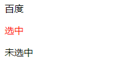

### :last-child

> 选择元素中`span` 标签并且是最后一个。

```html
<style type="text/css">
    article span:last-child {
        color: red;
    }
</style>
<article>
    <span>百度</span>
    <aside>
        <span>淘宝</span>
        <span>京东</span>
    </aside>
</article>
```

> 显示效果

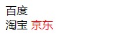

### :last-of-type

> 选择类型为`span` 的最后一个元素:百度是article里最后一个为span的标签，京东是aside里第一个为span的标签

```html
<style type="text/css">
    article span:last-of-type {
        color: red;
    }
</style>
<article>
    <span>百度</span>
    <aside>
        <span>淘宝</span>
        <span>京东</span>
    </aside>
</article>
```

> 显示效果：

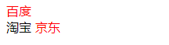

### :only-child

> 选择**是唯一子元素**的标签

```html
<style type="text/css">
    article :only-child {
        color: red;
    }
</style>
<article>
    <span>百度</span>
    <aside>
        <span>淘宝</span>
    </aside>
    <aside>
        <p>QQ</p>
    </aside>
</article>
```

> 显示效果

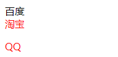

> 选择是唯一子元素的`span` 标签

```html
<style type="text/css">
    article span:only-child {
        color: red;
    }
</style>
<article>
    <span>百度</span>
    <aside>
        <span>淘宝</span>
    </aside>
    <aside>
        <p>QQ</p>
    </aside>
</article>
```

> 显示效果

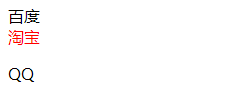

### :only-of-type

> 选择同级中**类型是**`span` 的唯一子元素

```html
<style type="text/css">
    article span:only-of-type {
        color: red;
    }
</style>
<article>
    <span>百度</span>
    <aside>
        <span>淘宝</span>
    </aside>
    <aside>
        <p>QQ</p>
    </aside>
</article>
```

> 显示效果

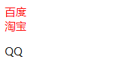

### :nth-child(n)

> 选择第二个元素的标签 **注意：这里选择的是aside而不是aside下的span**

```html
<style type="text/css">
    article :nth-child(2) {
        color: red;
    }
</style>
<article>
    <span>百度</span>
    <aside>
        <span>淘宝</span>
    </aside>
    <span>微信</span>
</article>
```

> 显示效果

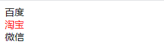

> 通过子元素选择器来选择：aside下的span不会被选中(不是直接子元素)

```html
<style type="text/css">
    article>:nth-child(1) {
        color: red;
    }
</style>
<article>
    <span>百度</span>
    <aside>
        <span>淘宝</span>
    </aside>
    <span>微信</span>
</article>
```

> 运行效果

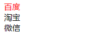

### 隔行变色的实现

> `nth-child(2n)`实现偶数行变色

```html
<style type="text/css">
    ul li:nth-child(2n) {
        color: red;
    }
</style>
<ul>
    <li>内容1</li>
    <li>内容2</li>
    <li>内容3</li>
    <li>内容4</li>
</ul>
```

> 显示效果

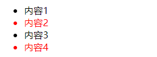

> `nth-child(2n-1)`实现奇数行变色

```html
<style type="text/css">
    ul li:nth-child(2n-1) {
        color: red;
    }
</style>
<ul>
    <li>内容1</li>
    <li>内容2</li>
    <li>内容3</li>
    <li>内容4</li>
</ul>
```

> 显示效果

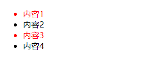

> 显示前两个：选中0+2=2，-1+2=1，之后的-2+2=0,-3+2=-1...都不存在，所有显示最前两个

```html
<style type="text/css">
    ul li:nth-child(-n+2) {
        color: red;
    }
</style>
<ul>
    <li>内容1</li>
    <li>内容2</li>
    <li>内容3</li>
    <li>内容4</li>
</ul>
```

> 显示效果

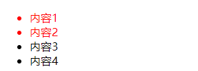

> 从第n个开始选中：从第3个开始选中--0+3=3，1+3=4依次类推

```html
<style type="text/css">
    ul li:nth-child(n+3) {
        color: red;
    }
</style>
<ul>
    <li>内容1</li>
    <li>内容2</li>
    <li>内容3</li>
    <li>内容4</li>
    <li>内容5</li>
</ul>
```

> 显示效果

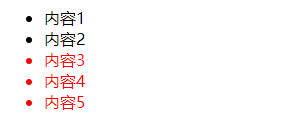

### 奇偶行显示

> 奇行显示

```html
<style type="text/css">
    ul li:nth-child(odd) {
        color: red;
    }
</style>
<ul>
    <li>内容1</li>
    <li>内容2</li>
    <li>内容3</li>
    <li>内容4</li>
    <li>内容5</li>
</ul>
```

> 运行效果

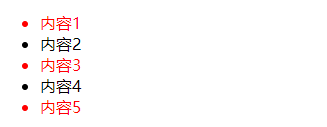

> 偶行显示

```html
<style type="text/css">
    ul li:nth-child(even) {
        color: red;
    }
</style>
<ul>
    <li>内容1</li>
    <li>内容2</li>
    <li>内容3</li>
    <li>内容4</li>
    <li>内容5</li>
</ul>
```

> 显示效果

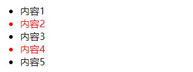

### :nth-of-type(n)

> 选择第二个`span` 元素，不管中间的其他元素

```html
<style type="text/css">
    article span:nth-of-type(2) {
        color: red;
    }
</style>
<article>
    <span>百度</span>
    <aside>
        <span>淘宝</span>
    </aside>
    <span>微信</span>
</article>
```

> 显示效果

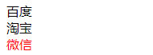

### :nth-last-child(n)

> 从最后一个元素开始获取

```html
<style type="text/css">
    article>span:nth-last-child(1) {
        color: red;
    }
</style>
<article>
    <span>百度</span>
    <aside>
        <span>淘宝</span>
    </aside>
    <span>微信</span>
</article>
```

> 运行效果

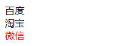

### :nth-last-of-type(n)

> 从最后一个元素开始选择`span` 标签 。

```html
<style type="text/css">
    article>span:nth-last-of-type(2) {
        color: red;
    }
</style>
<article>
    <span>百度</span>
    <aside>
        <span>淘宝</span>
    </aside>
    <span>微信</span>
</article>
```

> 运行效果

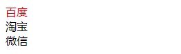

### NOT排除选择器

> 选择前三个，排除第二个

```html
<style type="text/css">
    ul li:nth-child(-n+3):not(:nth-child(2)) {
        color: red;
    }
</style>
<ul>
    <li>内容1</li>
    <li>内容2</li>
    <li>内容3</li>
    <li>内容4</li>
</ul>
```

> 运行效果

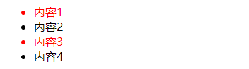

## 表单伪类

### 表单属性样式

> 通过表单属性改变样式：选则不同单选框对应文本改变颜色

```html
<style type="text/css">
    /* 表单属性样式 */
    /* 表单不可用样式 */
    input:disabled {
        background-color: red;
    }
    /* 表单可用样式 */
    input:enabled {
        background: green;
    }
    /* 被选中的显示文字改为绿色 */
    /* 被选中单选框紧挨的兄弟 */
    input:checked+label {
        color: green;
    }
</style>
<form>
    <input type="text" disabled />
    <input type="text" />
    <hr />
    <input type="radio" name="sex" id="boy" />
    <label for="boy">男</label>
    <input type="radio" name="sex" id="girl" checked />
    <label for="girl">女</label>
    <hr />
    <input type="button" value="保存" />
</form>
```

> 显示效果

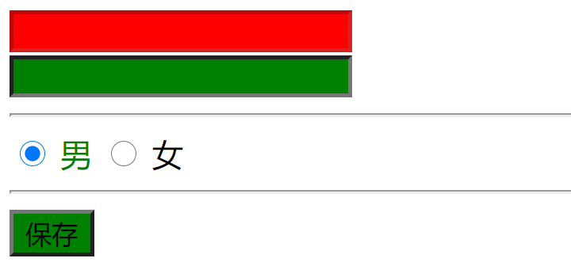

### 表单必填样式

```html
<style type="text/css">
    /* 必填项 */
    input:required {
        border: solid 2px red;
    }
    /* 可选项 */
    input:optional {
        border: solid 2px green;
    }
</style>
<form>
    <!-- required必填项 -->
    <input type="text" required />
    <!-- 默认可选项 -->
    <input type="text" />
    <input type="text" />
</form>
```

> 运行结果

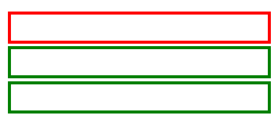

 

### 表单验证样式

> 上面的输入框为必填项，在没输入的时候是无效的，输入后就有效了

```html
<style type="text/css">
    /* 有效 */
    input:valid {
        background: green;
    }
    /* 无效 */
    input:invalid {
        background: red;
    }
</style>
<form>
    <!-- required必填项 -->
    <input type="text" required />
    <!-- 默认可选项 -->
    <input type="email" />
    <button>保存</button>
</form>
```

> 运行效果

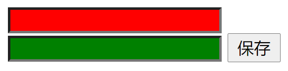

## 字符伪类

### 首字母选择

> 选择每个元素的首字母

```html
<style type="text/css">
    p::first-letter {
        color: red;
        font-size: 20px;
    }
</style>
<p>层叠样式表等文件样式的计算机语言。</p>
<p>CSS不仅可以静态地修饰网页，还可以配合各种脚本语言动态地对网页各元素进行格式化。</p>
```

> 运行效果

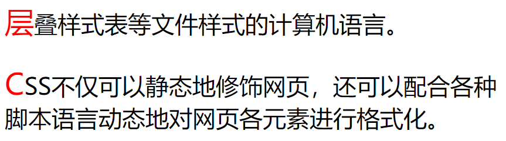

### 一行选择

> 选择每个元素的首行

```html
<style type="text/css">
    p::first-line {
        color: red;
        font-size: 20px;
    }
</style>
<p>CSS不仅可以静态地修饰网页，还可以配合各种脚本语言动态地对网页各元素进行格式化。</p>
```

> 运行效果

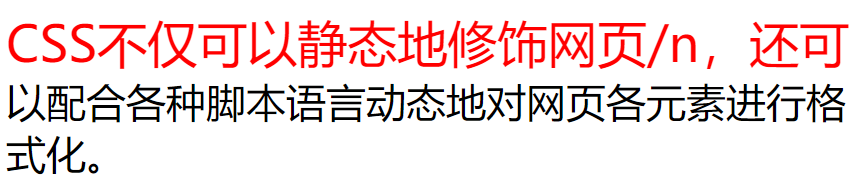

### 前后追加数据

> 后面追加数据

```html
<style type="text/css">
    span::after {
        content: "www.baidu.com";
    }
</style>
<span>百度</span>
```

> 效果

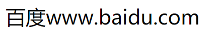

> 前面追加数据

```html
<style type="text/css">
    span::before {
        content: "www.baidu.com";
    }
</style>
<span>百度</span>
```

> 运行效果

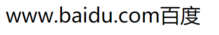

### 搜索框案例

> 通过追加的方式来实现带图搜索框

```html
<style type="text/css">
    /* 设置外边框大小 */
    div {
        border: solid 1px #ddd;
        width: 193px;
    }
    /* 设置表单外框不显示 */
    div>input[type=text] {
        /* 外框线 */
        outline: none;
        /* 边框 */
        border: 0;
        padding: 5px 4px;
    }
    div>input[type=text]+span::after {
        content: "★";
    }
</style>
<input type="text" />
<span></span>
```

> 运行效果

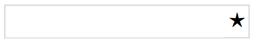

### 添加属性内容

> 追究属性内容到文本

```html
<style type="text/css">
    /* 把属性内容追究到文本 */
    /* 把百度追加到文本 */
    h2::before {
        content: attr(title);
    }
</style>
<h2 title="百度">www.baidu.com</h2>
```

> 运行效果

