# 外边距

## 声明定义

> 一个值设置四个方向边距：四边外边距均为50px

 

```css
margin: 50px;
```

> 效果


> 两个值：第一个值设置上下，第二个值设置左右

```css
margin: 50px 80px;
```

> 效果

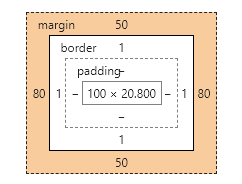

> 四个值，边距顺序依次为：上、右、下、左。

```css
margin: 10px 20px 30px 40px;
```

> 效果

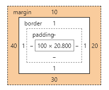

## 居中设置

> `margin` 设置auto 后，浏览器会自动：上下为0，左右自动

```css
div {
    width: 900px;
    height: 100px;
    border: 3px solid red;
    margin: 0 auto;
}
```

> 效果

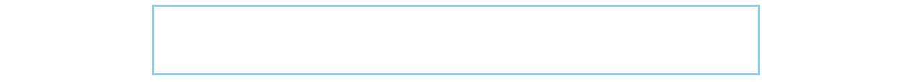

## 负值设置

> 左右边距修改为负值

```css
margin-left: -50px;
margin-right: -50px;
```

> 效果

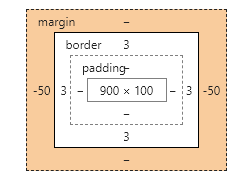

## 边距合并

> 相邻元素的纵向外边距会进行合并：并不会相加

```html
<style type="text/css">
    ul li {
        height: 50px;
        width: 300px;
        margin-top: 10px;
        list-style: none;
        background-color: skyblue;
    }
</style>
<ul>
    <li></li>
    <li></li>
    <li></li>
</ul>
```

> 效果

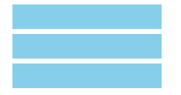

# 内边距

## 内边距

> 内边距和外边距设置类似

```css
padding: 10px 20px 30px 40px;
```

> 效果

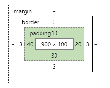

## 固定大小

> box-sizing：宽度与高度包括内边距与边框。**当padding值+边框值<小于宽高则不变大，如果大于则变大**

```css
div {
width: 300px;
height: 300px;
border: 5px solid skyblue;
padding: 100px;
box-sizing: border-box;
}
```

> 设置左边设置box-sizing大小=300*300，右边未设置box-sizing大小510*510

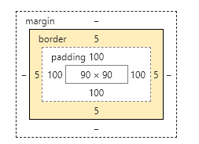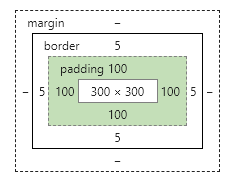

# 边框设计

## 样式选择

| 类型   | 描述                                                  |
| ------ | ----------------------------------------------------- |
| none   | 定义无边框。                                          |
| dotted | 定义点状边框。在大多数浏览器中呈现为实线。            |
| dashed | 定义虚线。在大多数浏览器中呈现为实线。                |
| solid  | 定义实线。                                            |
| double | 定义双线。双线的宽度等于 border-width 的值。          |
| groove | 定义 3D 凹槽边框。其效果取决于 border-color 的值。    |
| ridge  | 定义 3D 垄状边框。其效果取决于 border-color 的值。    |
| inset  | 定义 3D inset 边框。其效果取决于 border-color 的值。  |
| outset | 定义 3D outset 边框。其效果取决于 border-color 的值。 |

> 双线

```css
div {
width: 100px;
height: 100px;
border-width: 5px;
border-color: skyblue;
/* 双线 */
border-style: double;
/* 实线 */   
border-style: solid;
/* 3d边框 */     
border-style: groove;
/* 点线 */
border-style: dotted;
/* inset边框 */
border-style: inset;
}
```

> 效果

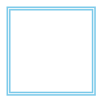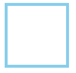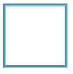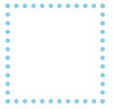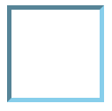

## 边框宽度

| 规则                | 说明 |
| ------------------- | ---- |
| border-top-width    | 顶边 |
| border-right-width  | 右边 |
| border-bottom-width | 下边 |
| border-left-width   | 左边 |
| border-width        | 四边 |

## 边框颜色

| 规则                | 说明 |
| ------------------- | ---- |
| border-top-color    | 顶边 |
| border-right-color  | 右边 |
| border-bottom-color | 下边 |
| border-left-color   | 左边 |
| border-color        | 四边 |

## 简写规则

| 规则          | 说明 |
| ------------- | ---- |
| border-top    | 顶边 |
| border-right  | 右边 |
| border-bottom | 下边 |
| border-left   | 左边 |
| border        | 四边 |

设置底部边框

```css
border-bottom: solid 5px red;
```

## 行元素边框

行元素也可以进行边框设置

```css
em {
    border-bottom: solid 2px red;
}
```

## 圆角边框

> 使用 `border-radius` 规则设置圆角，可以使用`px | %` 等单位。也支持四个边分别设置。

```css
div {
width: 300px;
height: 100px;
border: 3px solid skyblue;
border-radius: 10px;
}
```

> 效果

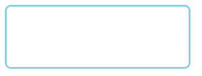

> 绘制圆

```css
div {
width: 100px;
height: 100px;
border: 3px solid skyblue;
border-radius: 50px;
/* 也可以使用 */
border-radius: 50%;
}
```

> 效果


> 定义不同边

```css
border-radius: 20px 40px 60px 80px;
```

> 效果


> 行元素绘制圆角

```css
em{
font-size: 50px;
border-radius: 50%;
border-bottom: 3px solid orangered;
}
<em>amazon</em>
```

> 效果


# 轮廓线

元素在获取焦点时产生，并且轮廓线不占用空间。可以使用伪类 `:focus` 定义样式。

- 轮廓线显示在边框外面
- 轮廓线不影响页面布局

## 线条样式

| 值     | 描述                                                |
| ------ | --------------------------------------------------- |
| none   | 默认。定义无轮廓。                                  |
| dotted | 定义点状的轮廓。                                    |
| dashed | 定义虚线轮廓。                                      |
| solid  | 定义实线轮廓。                                      |
| double | 定义双线轮廓。双线的宽度等同于 outline-width 的值。 |
| groove | 定义 3D 凹槽轮廓。此效果取决于 outline-color 值。   |
| ridge  | 定义 3D 凸槽轮廓。此效果取决于 outline-color 值。   |
| inset  | 定义 3D 凹边轮廓。此效果取决于 outline-color 值。   |
| outset | 定义 3D 凸边轮廓。此效果取决于 outline-color 值。   |

```css
outline-style: double;
```

## 线宽设置

```css
outline-width: 10px;
```

## 线条颜色

```css
outline-color: red;
```

## 组合定义

```css
outline: red solid 2px;
```

## 表单轮廓线

表单默认具有轮廓线，但有时并不好看，使用以下样式规则去除。

```css
input:focus {
    outline: none;
}
```

# DISPLAY

## 控制显示隐藏

使用 `display` 控制元素的显示机制。

| 选项         | 说明                        |
| ------------ | --------------------------- |
| none         | 隐藏元素                    |
| block        | 显示为块元素                |
| inline       | 显示为行元素，不能设置宽/高 |
| inline-block | 行级块元素，允许设置宽/高f  |

## 行转块元素

```css
a{
text-decoration: none;
width: 100px;
text-align: center;
border-bottom: 1px solid #eee;
/* 行内元素转块元素 */
display: block;
}
<a href="">百度</a>
<a href="">京东</a>
<a href="">淘宝</a>
<a href="">知乎</a>
```

> 效果

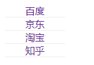

## 块转行元素

```html
a{
text-decoration: none;
width: 100px;
<style type="text/css">
    li {
        list-style: none;
        /* 块元素转行内元素 */
        display: inline;
    }
</style>
<ul>
    <li>百度</li>
    <li>淘宝</li>
    <li>京东</li>
    <li>知乎</li>
</ul>
```

> 效果

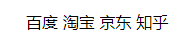

## 行级块使用

```html
<style type="text/css">
    li {
        list-style: none;
        display: inline-block;
        width: 50px;
        border: 1px solid aqua;
        text-align: center;
        line-height: 3em;
    }
</style>
<ul>
    <li>百度</li>
    <li>淘宝</li>
    <li>京东</li>
    <li>知乎</li>
</ul>
```

> 效果

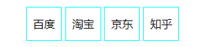

## visibility

```html
<style type="text/css">
    article {
        width: 220px;
        padding: 20px;
        border: 5px inset skyblue;
    }
    div {
        width: 200px;
        height: 200px;
        border: 5px groove red;
    }
    div:nth-of-type(1) {
        /* 设置第一个不显示 */
        visibility: hidden;
        /* display: none; */
    }
</style>
<article>
    <div></div>
    <div></div>
</article>
```

> 左：visibility效果，右：display效果

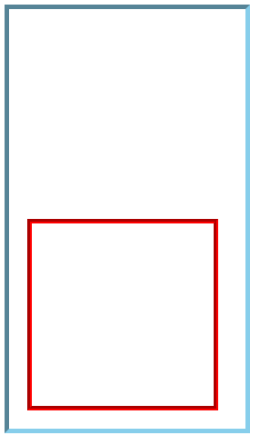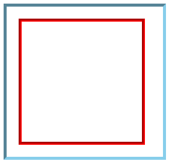

# 溢出控制

## 隐藏控制

| 选项   | 说明                                                 |
| ------ | ---------------------------------------------------- |
| hidden | 溢出内容隐藏                                         |
| scroll | 显示滚动条（有些浏览器会一直显示，有些在滚动时显示） |
| auto   | 根据内容自动处理滚动条                               |

> 溢出内容隐藏

```html
<style type="text/css">
    div {
        width: 300px;
        height: 100px;
        border: 3px solid skyblue;
        /* 溢出内容隐藏 */
        overflow: hidden;
    }
</style>
<div>
    世间最难忘的是童年，最怀念的是故园，最不舍的是光阴，岁月犹如一首青春之歌，一唱便没有回头路，往事如风，深深浅浅都已飘荡在日月的光辉之中，留下的是浅浅的记忆，淡淡的忧伤。
    五月的春风轻柔地拂过脸庞，多情的白云紧紧地贴着浩瀚的蓝天，秀逸俊廷的绿竹青榕，热情如火的一串红，给娴静的岭南印象园带来了春的生机，春的喜悦。
    走在熟悉的园林，看着尝过的锅巴、福饼、猫耳朵、鸡仔饼，用过的鱼篓、渔网、“风柜” ，心里一股热流涌过，暖暖的，唤醒了沉睡中的记忆，我像个小孩一样痴痴地陶醉，静静地回味，似看到了故乡，似回到了童年。
</div>
```

> 效果

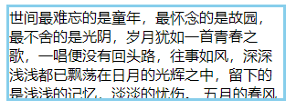

> **溢出产生滚动条**

```css
overflow: scroll;
```

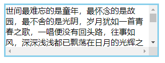

## 文本溢出

> 单行文本溢出

```html
<style type="text/css">
    div {
        width: 300px;
        height: 30px;
        border: 3px solid skyblue;
        /* 设置溢出隐藏 */
        overflow: hidden;
        /* 设置不换行 */
        white-space: nowrap;
        /* 显示小点 */
        text-overflow: ellipsis;
    }
</style>
```

> 显示效果

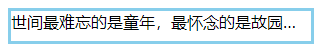

# 尺寸定义

可以使用多种方式为元素设置宽、高尺寸。

| 选项           | 说明             |
| -------------- | ---------------- |
| width          | 宽度             |
| height         | 高度             |
| min-width      | 最小宽度         |
| min-height     | 最小高度         |
| max-width      | 最大宽度         |
| max-height     | 最大高度         |
| fill-available | 撑满可用的空间   |
| fit-content    | 根据内容适应尺寸 |

## min&max

> 最大(最小)高度或宽度：**图片如果低于最小值则将图片设置为最小值，如果图片大于最大值则设置图片为最大值**

```html
<style type="text/css">
    div {
        width: 300px;
        height: 200px;
        border: 3px solid skyblue;
        padding: 10px;
    }
    div>img {
        /* 最大高度 */
        max-height: 100%;
        /* 最小高度 */
        min-height: 60%;
    }
</style>
<div>
    
</div>
```

> 效果

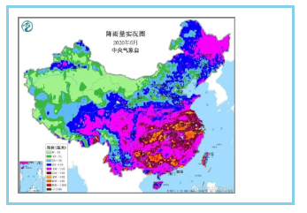

## fill-available

> 撑满可用的空间：在`chrome` 浏览器中使用前缀 `-webkit` 书写样式。

```html
<style type="text/css">
    div {
        width: 300px;
        height: 100px;
        border: 3px solid skyblue;
    }
    span {
        /* 设置为行内块元素 */
        display: inline-block;
        background: rgba(238, 238, 209, 0.3);
        /* 宽度充满 */
        width: -webkit-fill-available;
        /* 高度充满 */
        height: -webkit-fill-available;
    }
</style>
<div>
    <span>你好</span>
</div>
```

> 效果

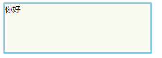

## fit-content

> 内容自适应

```html
<style type="text/css">
    div {
        /* 宽度自适应 */
        width: fit-content;
        border: 3px solid skyblue;
        padding: 5px;
    }
</style>
<div>
    宽度自适应-----
</div>
```

> 效果

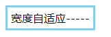

## min-content

> 使用`min-content` 将容器尺寸按最小元素宽度设置。

```html
<style type="text/css">
    div {
        width: min-content;
        background: orange;
        padding: 5px;
    }
</style>
<div>你好呀</div>
```

> 汉字的宽度最小是一个汉字宽度，显示如下：

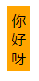

> 单词的显示：这段文本中最长的是[www.baidu.com](http://www.baidu.com/)，没换行空格和换行就算一个单词

```html
<style type="text/css">
    div {
        width: min-content;
        background: orange;
        padding: 5px;
    }
</style>
<div>你好呀 Hello word www.baidu.com</div>
```

> 显示效果


> 如果一个块元素有多个子元素，则取单词最长的那个的长度

```css
main{
width: min-content;
}
div {
background: orange;
padding: 5px;
}
<main>
    <div>你好呀 Hello word www.baidu.com</div>
    <div>ccccccccccccccccccccc</div>
</main>
```

> 显示效果

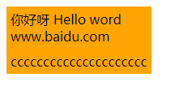

## max-content

> 容器尺寸按子元素最大宽度设置。**显示当前标签及以下最长的那个**

```html
<style type="text/css">
    main {}
    div {
        width: max-content;
        background: orange;
        padding: 5px;
    }
</style>
<div>你好呀 Hello word www.baidu.com dd cc</div>
```

> 显示效果

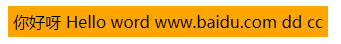

 