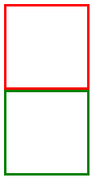

# 浮动布局

## FLOAT

**使用浮动可以控制相邻元素间的排列关系。**

| 选项  | 说明     |
| ----- | -------- |
| left  | 向左浮动 |
| right | 向右浮动 |
| none  | 不浮动   |

> 左浮动

```css
<style type="text/css">
    div {
        height: 200px;
        width: 200px;
        border: 1px solid #ccc;
        /* 浮动 */
        float: left;
    }
</style>
<div></div>
<div></div>
```

> 效果


## 文档流

> **下面的元素使用浮动对上面的元素没有影响**

```html
<style type="text/css">
    div {
        height: 200px;
        width: 200px;
    }
    div:nth-of-type(1) {
        float: left;
        border: 3px solid red;
    }
    div:nth-of-type(2) {
        /* 下面元素使用浮动 */
        float: left;
        border: 3px solid greenyellow;
    }
</style>
```

> 效果


 

## 丢失空间

> 如果只给第一个元素设置浮动，第二个元素不设置，**后面的元素会占用第一个元素空间。**

```html
<style type="text/css">
    div {
        height: 200px;
        width: 200px;
    }
    div:nth-of-type(1) {
        float: left;
        border: 3px solid red;
    }
    div:nth-of-type(2) {
        background: skyblue;
    }
</style>
```

> 效果---注：**虽然空间被占用但还是显示在上面**


## 使用浮动

> 两个元素都设置浮动后，会并排显示

```html
<style type="text/css">
    div {
        height: 200px;
        width: 200px;
    }
    div:nth-of-type(1) {
        float: left;
        border: 3px solid red;
        float: left;
    }
    div:nth-of-type(2) {
        float: left;
        border: 3px solid greenyellow;
    }
</style>
```

> 效果


## 浮动边界

> 浮动元素边界不能超过父元素的**padding**，**在没有设置div的时候元素就参考body进行浮动，如果元素被包裹，则参考父元素进行浮动**

```html
<style type="text/css">
    main {
        width: 530px;
        height: 206px;
        margin: 0 auto;
        border: 3px solid black;
        padding: 10px;
    }
    div {
        height: 200px;
        width: 200px;
    }
    div:nth-of-type(1) {
        border: 3px solid red;
        float: left;
    }
    div:nth-of-type(2) {
        float: right;
        border: 3px solid greenyellow;
    }
</style>
<main>
    <div></div>
    <div></div>
</main>
```

> 效果: **注意如果不设置父元素长宽，浮动的元素是不能撑开父元素的**


## 浮动转块

> 不设置浮动，行级元素是不能设置宽高的

```html
<style type="text/css">
    span {
        width: 100px;
        height: 100px;
        border: 1px solid skyblue;
    }
</style>
<span>hello</span><span>word</span>
```

> 效果


> 设置浮动后

```html
<style type="text/css">
    span {
        width: 100px;
        height: 100px;
        border: 1px solid skyblue;
        float: left;
    }
</style>
<span>hello</span><span>word</span>
```

> 效果


# 清除浮动

不希望元素受浮动元素影响时，可以清除浮动。

## CLEAR清除浮动

**CSS提供了 `clear` 规则用于清除元素浮动影响。**

| 选项  | 说明               |
| ----- | ------------------ |
| left  | 左边远离浮动元素   |
| right | 右连远离浮动元素   |
| both  | 左右都远离浮动元素 |

> 清除左侧浮动

```html
<style type="text/css">
    div {
        width: 100px;
        height: 100px;
    }
    #red {
        border: 3px solid red;
        /* 左浮动 */
        float: left;
    }
    #green {
        border: 3px solid green;
        clear: left;
    }
</style>
<div id="red"></div>
<div id="green"></div>
```

> 效果



> 清除右浮动

```html
<style type="text/css">
    div {
        width: 100px;
        height: 100px;
    }
    #red {
        border: 3px solid red;
        /* 右浮动 */
        float: right;
    }
    #green {
        border: 3px solid green;
        clear: right;
    }
</style>
<div id="red"></div>
<div id="green"></div>
```

> 效果


> 清除两侧浮动

```html
<style type="text/css">
    div {
        width: 100px;
        height: 100px;
    }
    #red {
        border: 3px solid red;
        /* 左浮动 */
        float: left;
    }
    #green {
        border: 3px solid green;
        /* 右浮动 */
        float: right;
    }
    #blue {
        border: 3px solid blue;
        /* 清除两侧浮动 */
        clear: both;
    }
</style>
<div id="red"></div>
<div id="green"></div>
<div id="blue"></div>
```

> 效果


## 设置一个class来清除浮动

> 未设置宽高情况下浮动的子元素是不能撑开父元素的

```html
<style type="text/css">
    main {
        width: 300px;
        border: 3px solid blue;
        padding: 10px;
    }
    main>div {
        width: 100px;
        height: 100px;
    }
    main>div:nth-of-type(1) {
        border: 3px solid red;
        float: left;
    }
    main>div:nth-of-type(2) {
        border: 3px solid green;
        float: right;
    }
</style>
<main>
    <div></div>
    <div></div>
</main>
```

> 效果：**因为浮动，父元素不能识别子元素大小**


> 解决：**在父元素\*里面\*设置一个空元素并清除浮动**

```html
<style type="text/css">
    main {
        width: 300px;
        border: 3px solid blue;
        padding: 10px;
    }
    main>div {
        width: 100px;
        height: 100px;
    }
    main>div:nth-of-type(1) {
        border: 3px solid red;
        float: left;
    }
    main>div:nth-of-type(2) {
        border: 3px solid green;
        float: right;
    }
    /* 清除浮动 */
    .cl{
        clear: both;
    }
</style>
<main>
    <div></div>
    <div></div>
    <!-- 设置空的元素 -->
    <article class="cl"></article>
</main>
```

> 效果


## AFTER清除浮动

使用 `::after` 伪类为父元素添加后标签，实现清除浮动影响。

```html
<style type="text/css">
    main {
        width: 300px;
        border: 3px solid blue;
        padding: 10px;
    }
    /* 追加一个div并清除浮动 */
    main::after {
        /* 设置内容为空必须 */
        content: "";
        clear: both;
        display: block;
    }
    main>div {
        width: 100px;
        height: 100px;
    }
    main>div:nth-of-type(1) {
        border: 3px solid red;
        float: left;
    }
    main>div:nth-of-type(2) {
        border: 3px solid green;
        float: right;
    }
</style>
<main>
    <div></div>
    <div></div>
</main>
```

> 效果


## OVERFLOW

子元素使用浮动后将不占用空间，这时父元素高度为将为零。通过添加父元素并设置 `overflow` 属性可以清除浮动。

将会使用父元素产生 `BFC` 机制，即父元素的高度计算会包括浮动元素的高度。

```html
<style type="text/css">
    main {
        width: 300px;
        border: 3px solid blue;
        padding: 10px;
        /* BFC机制 */
        overflow: hidden;
    }
    main>div {
        width: 100px;
        height: 100px;
    }
    main>div:nth-of-type(1) {
        border: 3px solid red;
        float: left;
    }
    main>div:nth-of-type(2) {
        border: 3px solid green;
        float: right;
    }
</style>
<main>
    <div></div>
    <div></div>
</main>
```

> 效果


# 页面布局

## 父容器

一组浮动元素要放在一个父容器中，如下图绿线指父容器，里面的红线为浮动子元素。


> 实现代码

```html
<!DOCTYPE html>
<html>
    <head>
        <meta charset="utf-8">
        <title></title>
        <style type="text/css">
            article{
                width: 1000px;
                border: 1px solid #f3f3f3;
                margin: 0 auto;
                padding: 10px;
                /* BFC机制清除浮动 */
                overflow: hidden;
                
            }
            article.hot section{
                width: 490px;
                height: 300px;
                border: 1px solid #fff;
                box-shadow: 0 0 3px #777;
            }
            article.hot section:nth-of-type(1){
                float: left;
            }
            article.hot section:nth-of-type(2){
                float: right;
            }
            article.swiper section{
                height: 230px;
                border: 1px solid #fff;
                box-shadow: 0 0 3px #777;
            }
            article.swiper section:nth-of-type(1){
                width: 200px;
                float: left;
            }
            article.swiper section:nth-of-type(2){
                width: 780px;
                float: right;
            }
        </style>
    </head>
    <body>
        <article class="hot">
            <section></section>
            <section></section>
        </article>
        <article class="swiper">
                <section></section>
                <section></section>
        </article>
    </body>
</html>
```

> 效果


# 形状浮动

通过形状浮动可以让内容围绕图片，类似于我们在word 中的环绕排版。要求图片是有透明度的PNG格式。

## 距离控制

| 选项        | 说明       |
| ----------- | ---------- |
| margin-box  | 外边距环绕 |
| padding-box | 内边距环绕 |
| border-box  | 边线环绕   |
| content-box | 内容环绕   |

> **外边距环绕**

```html
<style type="text/css">
    p {
        width: 500px;
        margin: 50px auto;
    }
    .shape {
        width: 100px;
        height: 100px;
        background: url(1.jpg);
        background-size: cover;
        border: 10px solid skyblue;
        /* 浮动会让行内元素边块元素 */
        float: left;
        margin: 20px;
        padding: 10px;
        /* 外边距环绕 */
        shape-outside: margin-box;
    }
</style>
<p>
    <span class="shape"></span>
    当地时间7月2日，美国卫生与公众服务部助理部长布雷特·吉罗尔表示，
    日前美国各地新增确诊病例激增的趋势并非由检测能力增强造成，而是由新冠病毒传播引起的。
    美国卫生与公众服务部助理部长布雷特·吉罗尔
    “我们相信新增确诊病例确实是在增加，因为检测结果呈阳性的比例正在增加。”吉罗尔表示，美国目前“没有压平疫情曲线，它还在往上走”。
</p>
```

> 效果


> 内边距环绕

```css
/* 内边距环绕 */
shape-outside: padding-box;
```

> 效果


> 边框环绕

```css
/* 边框环绕 */
shape-outside: border-box;
```

> 效果


> 内容环绕

```css
/* 内容环绕 */
shape-outside: content-box;
```

> 效果：内容环绕从内容以外的地方开始，因为设置了内边距，所以从内边距开始的地方开始


## 显示区域

| 选项    | 说明   |
| ------- | ------ |
| circle  | 圆形   |
| ellipse | 椭圆   |
| polygon | 多边形 |

> 圆形

```css
.shape {
    float: left;
    width: 100px;
    height: 100px;
    padding: 30px;
    margin: 30px;
    background: green;
    /* 第一个值圆角大小，第二个值所在位置 */
    clip-path: circle(50% at center);
    clip-path: circle(50% at left top);
}
```

> 效果


> **椭圆**

```css
/* 宽 高 位置 */
clip-path: ellipse(30% 20% at center);
```

> 效果


> **多边形**

```css
/*第一个点位置，第二个点，第三个点.....*/
clip-path: polygon(50% 0,100% 100%,0 100%);
```

> 效果


## 环绕模式

| 选项    | 说明     |
| ------- | -------- |
| circle  | 圆形环绕 |
| ellipse | 椭圆环绕 |
| url     | 图片环绕 |
| polygan | 多边环绕 |

> 圆形环绕

```html
<style type="text/css">
    p {
        width: 500px;
        margin: 50px auto;
    }
    .shape {
        float: left;
        width: 100px;
        height: 100px;
        /*圆形环绕*/
        shape-outside: circle(50% at center);
    }
</style>
```

> 效果


> 椭圆形环绕

```css
/* 椭圆环绕 */
shape-outside:ellipse(40% 20% at center);
```

> 效果


> 多边形环绕

```css
/* 多边形环绕 */
shape-outside: polygon(50% 0,100% 100%,0 100%);
```

> 效果


> 图片环绕

```html
<style type="text/css">
    p {
        width: 500px;
        margin: 50px auto;
    }
    img {
        float: left;
        width: 100px;
        /* 图片环绕 */
        shape-outside: url(https:1.jpg);
    }
</style>
<p>
    
    当地时间7月2日，美国卫生与公众服务部助理部长布雷特·吉罗尔表示。
</p>
```

> 效果

