## 1.1响应式开发原理

就是使用媒体查询针对不同宽度的设备进行布局和样式的设置,从而适配不同设备的目的。

| 设备划分               | 尺寸区间            |
| ---------------------- | ------------------- |
| 超小屏幕(手机)         | < 768px             |
| 小屏设备(平板)         | >= 768px ~ < 992px  |
| 中等屏幕(桌面显示器)   | >= 992px ~ < 1200px |
| 宽屏设备(大桌面显示器) | >= 1200px           |

## 1.2响应式布局容器

响应式需要一个父级做为布局容器 ,来配合子级元素来实现变化效果。原理就是在不同屏幕下,通过媒体查询来改变这个布局容器的大小,再改变里面子元素的排列方式和大小,从而实现不同屏幕下,看到不同的页面布局和样式变化。

平时我们的响应式尺寸划分●超小屏幕(手机，小于768px) : 设置宽度为100%●小屏幕(平板,大于等于768px) :设置宽度为750px●中等屏幕(桌面显示器，大于等于992px) : 宽度设置为970px●大屏幕 (大桌面显示器,大于等于1200px) : 度设为1170px

```html
<style>
    .container{
        height: 150px;
        background-color: pink;
        margin: 0 auto;
    }
    /* 1.超小屏幕 小于768 布局宽度100% */
    @media screen and (min-width: 767px){
        .container{
            width:100%
        }
    }
    /* 2.小屏幕 大于等于768 布局容器改为750px*/
    @media screen and (min-width: 768px){
        .container{
            width: 750px;
        }
    }
    /* 3.中等屏幕下992px 布局容器修改为970px */
    @media screen and (min-width:992px){
        .container{
            width: 970px;
        }            
    }
    /* 4.大屏幕下 大于等于1200 布局修改 1170*/
    @media screen and (min-width:1200px){
        .container{
            width: 1170px;
        }            
    }
</style>
```

## 使用bootsrap

### 3.0bootsrap容器

Bootstrap需要为页面内容和栅格系统包裹一个 .container容器, Bootstarp预先定义好了这个类,叫.container它提供了两个作此用处的类。1.container类●	响应式布局的容器固定宽度●	大屏(>=1200px) 宽度定为1170px●	中屏( >=992px)宽度定为970px●	小屏( >=768px)宽度定为750px●	超小屏(100%)

2.container-fluid类●流式布局容器百分百宽度●占据全部视口( viewport)的容器。●适合于单独做移动端开发

```css
<div class="container"></div>
```

### 3.1栅格系统简介

栅格系统英文为"grid systems" ,也有人翻译为“网格系统”, 它是指将页面布局划分为等宽的列,然后通过列数的定义来模块化页面布局。Bootstrap提供了一套响应式、 移动设备优先的流式栅格系统,随着屏幕或视口( viewport )尺寸的增加,系统会自动分为最多12列。Bootstrap里面container宽度是固定的,但是不同屏幕下, container的宽度不同,我们再把container划分为12等份

### 3.2栅格选项参数

栅格系统用于通过一系列的行( row )与列( column )的组合来创建页面布局,你的内容就可以放入这些创建好的布局中。


行( row )必须放到container布局容器里面我们实现列的平均划分需要给列添加类前缀xs-extra small :超小; sm-Small :小; md-medium:中等 ; lg-large :大;列( column)大于12 ,多余的“列( column )”所在的元素将被作为-个整体另起- -行排列每一列默认有左右15像素的padding可以同时为一列指定多个设备的类名,以便划分不同份数例如class= "col-md-4 col-sm-6"

平均分配

```html
<div class="container">
    <!-- row第一行 -->
    <div class="row">
        <!-- 共12份每个占3份 -->
        <div class="col-lg-3">1</div>
        <div class="col-lg-3">2</div>
        <div class="col-lg-3">3</div>
        <div class="col-lg-3">4</div>
    </div>
</div>
```

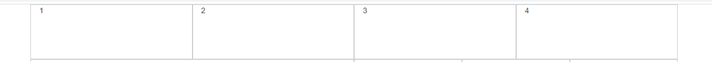

不平均分配

```html
<div class="container">
    <div class="row">
        <!-- 共12份第一个分6份其余3份 -->
        <div class="col-lg-6">1</div>
        <div class="col-lg-2">2</div>
        <div class="col-lg-2">3</div>
        <div class="col-lg-2">4</div>
    </div>
</div>
```

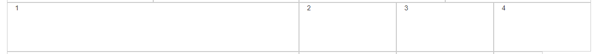

份数相加小于12(会留空格)

```html
<div class="container">
    <!-- 如果份数相加小于12 -->
    <div class="row">
        <div class="col-lg-6">1</div>
        <div class="col-lg-2">2</div>
        <div class="col-lg-2">3</div>
        <div class="col-lg-1">4</div>
    </div>
</div>
```

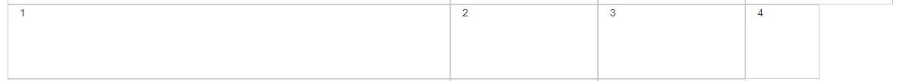

份数相加大于12(会换行)

```html
<div class="container">
    <!-- 如果份是相加大于12 -->
    <div class="row">
        <div class="col-lg-6">1</div>
        <div class="col-lg-2">2</div>
        <div class="col-lg-2">3</div>
        <div class="col-lg-3">4</div>
    </div>
</div>
```

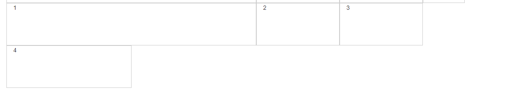

大屏幕每个占3份，中断屏幕每个占4份，小屏幕每个占6份，超小屏幕每个占12份

```html
<div class="container">
    <!-- row第一行 -->
    <div class="row">
        <div class="col-lg-3 col-md-4 col-sm-6 col-xs-12">1</div>
        <div class="col-lg-3 col-md-4 col-sm-6 col-xs-12">2</div>
        <div class="col-lg-3 col-md-4 col-sm-6 col-xs-12">3</div>
        <div class="col-lg-3 col-md-4 col-sm-6 col-xs-12">4</div>
    </div>
</div>
```

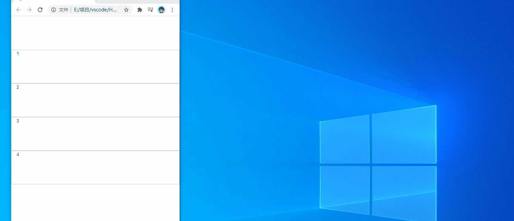

### 3.3列嵌套

栅格系统内置的栅格系统将内容再次嵌套。简单理解就是一个列内再分成若 干份小列。我们可以通过添加一个新的.row元素和一系列.col-sm-*元素到已经存在的.col-sm-*元素内。

```html
<div class="container">
    <!-- row第一行 -->
    <div class="row">
        <div class="col-md-4">
            <!-- 我们列嵌套最后加1行row这样可以取消父元素的padding值 -->
            <div class="row">
                <div class="col-md-6">a</div>
                <div class="col-md-6">b</div>
            </div>
        </div>
        <div class="col-md-4">2</div>
        <div class="col-md-4">3</div>
    </div>
</div>
```

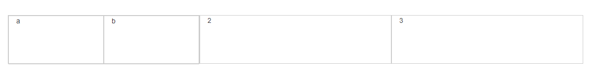

### 3.4列偏移

使用.col-md-offset-*可以将列向右侧偏移。这些类实际是通过使用*选择器为当前元素增加了左侧的边距( margin)。

```html
<div class="container">
    <div class="row">
       <div class="col-md-4">左侧</div>
       <!-- 偏移4份 -->
       <div class="col-md-4 col-md-offset-4">右侧</div>
    </div>
</div>
```


```html
<div class="container">
    <div class="row">
        <!-- (12-8)/2=2 -->
       <div class="col-md-8 col-md-offset-2">居中</div>
    </div>
</div>
```

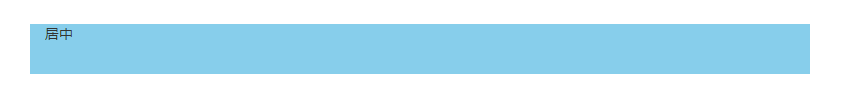

### 3.5列排序

通过使用.col-md-push-*和.col-md-pull-*类就可以很容易的改变列( column )的顺序。

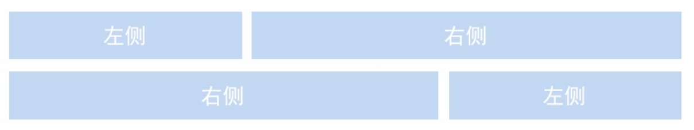

```html
<div class="container">
    <div class="row">
       <div class="col-md-4">左侧</div>
       <!-- 右侧盒子拉4份 -->
       <div class="col-md-8 col-md-pull-4">右侧</div>
    </div>
</div>
```


```html
<div class="container">
    <div class="row">
        <!-- 左侧推8份 -->
        <div class="col-md-4 col-md-push-8">左侧</div>
        <!-- 右侧盒子拉4份 -->
        <div class="col-md-8 col-md-pull-4">右侧</div>
    </div>
</div>
```

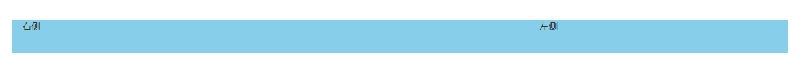

### 3.6响应式工具

为了加快对移动设备友好的页面研发工作,利用媒体查询功能,并使用这些红具可以方便的针对不同设备展示或隐藏页面内容。

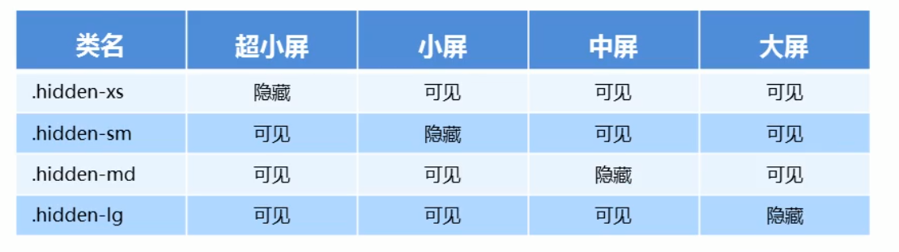

与之相反的,是visible-xs visible-sm visible-md visible-lg是显示某个页面内容

#### 在中屏隐藏

```html
<div class="container">
    <div class="row">
       <div class="col-xs-3">1</div>
       <div class="col-xs-3">2</div>
       <div class="col-xs-3 hidden-md">中屏隐藏</div>
       <div class="col-xs-3">3</div>
    </div>
</div>
```


#### 在大屏显示

```html
<div class="container">
    <div class="row">
       <div class="col-xs-3">1</div>
       <div class="col-xs-3">2</div>
       <div class="col-xs-3">  
           <span class="visible-lg">大屏显示</span>
       </div>
       <div class="col-xs-3">3</div>
    </div>
</div>
```

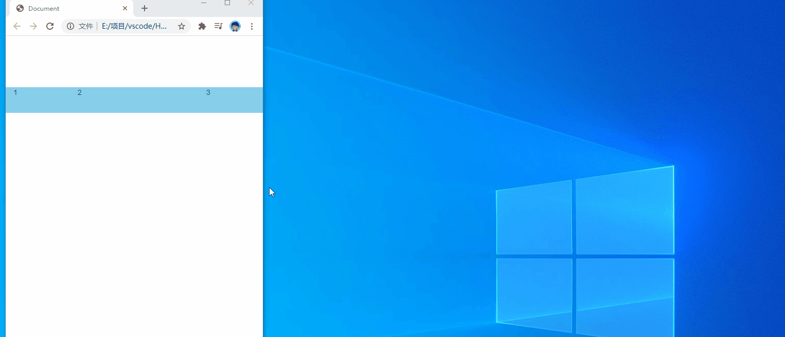