# CSS3 过渡

## 过渡属性

下表列出了所有的过渡属性:

| 属性                       | 描述                                         | CSS |
| -------------------------- | -------------------------------------------- | --- |
| transition                 | 简写属性，用于在一个属性中设置四个过渡属性。 | 3   |
| transition-property        | 规定应用过渡的 CSS 属性的名称。              | 3   |
| transition-duration        | 定义过渡效果花费的时间。默认是 0。           | 3   |
| transition-timing-function | 规定过渡效果的时间曲线。默认是 "ease"。      | 3   |
| transition-delay           | 规定过渡效果何时开始。默认是 0。             | 3   |

## 过渡的时间曲线

| 值                            | 描述                                                                              |
| ----------------------------- | --------------------------------------------------------------------------------- |
| linear                        | 规定以相同速度开始至结束的过渡效果（等于 cubic-bezier(0,0,1,1)）。                |
| ease                          | 规定慢速开始，然后变快，然后慢速结束的过渡效果（cubic-bezier(0.25,0.1,0.25,1)）。 |
| ease-in                       | 规定以慢速开始的过渡效果（等于 cubic-bezier(0.42,0,1,1)）。                       |
| ease-out                      | 规定以慢速结束的过渡效果（等于 cubic-bezier(0,0,0.58,1)）。                       |
| ease-in-out                   | 规定以慢速开始和结束的过渡效果（等于 cubic-bezier(0.42,0,0.58,1)）。              |
| cubic-bezier(_n_,_n_,_n_,_n_) | 在 cubic-bezier 函数中定义自己的值。可能的值是 0 至 1 之间的数值。                |

## 过渡属性的使用

```html
<style>
  div {
    width: 200px;
    height: 100px;
    background: skyblue;
    /* transition: 变化的属性 花费的时间 运动曲线 何时开始; */
    transition: width 0.5s;
  }
  div:hover {
    width: 400px;
  }
</style>
```


## 多个属性的使用

```html
<style>
  div {
    width: 200px;
    height: 100px;
    background: skyblue;
    /* transition: 变化的属性 花费的时间 运动曲线 何时开始; */
    /* 如果想写多个属性，利用逗号分割 */
    transition: width 0.5s, height 0.5s;
  }
  div:hover {
    width: 400px;
    height: 200px;
  }
</style>
```

**所有属性的使用**

```css
transition: all 0.5s;
```

# 2D 转换

## translateX

正值向右移动、负值向左移动。

```css
transform: translateX(100px);
```

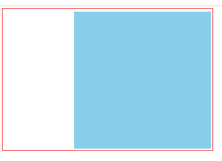

### translateY

正值向下移动、负值向上移动。

```css
transform: translateY(100px);
```

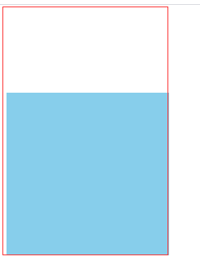

### translate

使用 `translate` 可以控制按 X、Y 同时移动操作，第一个值控制 X 移动，第二个值控制 Y 移动。

```css
div{
    width: 200px;
    height: 200px;
    background: skyblue;
    /* 参数是x轴上移动位置,y轴上移动位置 */
    transform: translate(100px,100px);
}
<body>
    <div></div>
</body>
```

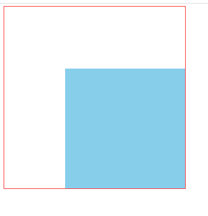

### 最大优点：不会影响其他元素位置

```css
div{
    width: 200px;
    height: 200px;
    background: skyblue;
}
div:first-child{
    background: skyblue;
    transform: translate(30px,30px);
}
div:last-child{
    background: purple;
}
<body>
    <div></div>
    <div></div>
</body>
```

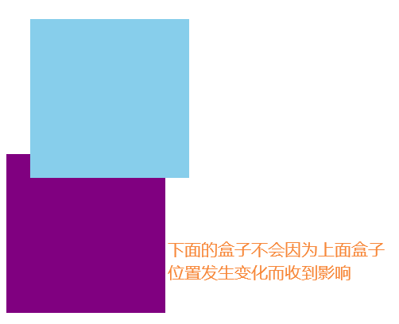

案例

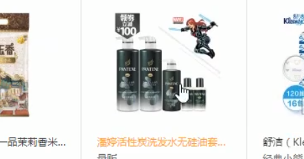

### 百分比移动

元素宽度为 100px 设置 50%时将移动 50px，即百分比是指元素的尺寸的百分比。

```css
div{
    width: 200px;
    height: 200px;
    background: skyblue;
    /* 百分比移动 */
    transform: translateX(50%);
}
<body>
    <div></div>
</body>
```

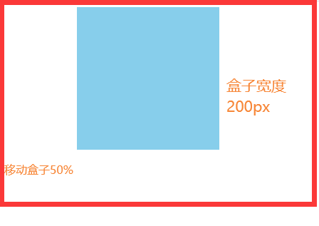

### 元素居中

通过百分比实现不需要手动计算

注意：translate 对行内元素是没有效果的

```css
div{
    width: 500px;
    height: 500px;
    background-color: skyblue;
    position: relative;
}
p{
    width: 200px;
    height: 200px;
    background: purple;
    /* 实现居中 */
    position: absolute;
    top: 50%;
    left: 50%;
    /*往左走宽度的一半，往上走自己高度的一半*/
    transform: translate(-50%,-50%);
}
<body>
    <div>
        <p></p>
    </div>
</body>
```

## 旋转操作

使用 CSS 可以控制元素按照不同坐标轴进行旋转。

```css
/* 旋转45度   */
transform: rotate(45deg);
```

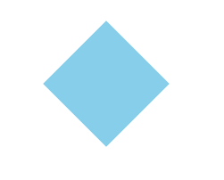

### 案例：CSS 三角

```html
<!DOCTYPE html>
<html lang="en">
  <head>
    <meta charset="UTF-8" />
    <meta name="viewport" content="width=device-width, initial-scale=1.0" />
    <title>Document</title>
    <style>
      div {
        position: relative;
        margin: 100px;
        width: 249px;
        height: 35px;
        border: 1px solid #000;
      }
      div::after {
        content: "";
        position: absolute;
        top: 8px;
        right: 15px;
        width: 10px;
        height: 10px;
        border-right: 1px solid #000;
        border-bottom: 1px solid #000;
        transform: rotate(45deg);
        /* 添加过渡动画 */
        transition: all 0.2s;
      }
      /* 鼠标经过div 里面的三角旋转 */
      div:hover::after {
        transform: rotate(225deg);
      }
    </style>
  </head>
  <body>
    <div></div>
  </body>
</html>
```


**变形基点**

使用 `transform-origin` 设置元素的 X/YZ 操作的基点，用于控制旋转、倾斜等操作。

```html
<style>
  div {
    width: 200px;
    height: 200px;
    background: skyblue;
    margin: 100px auto;
    /* 过渡动画 */
    transition: all 1s;
    /* 设置旋转点 */
    transform-origin: left bottom;
  }
  div:hover {
    transform: rotate(360deg);
  }
</style>
```

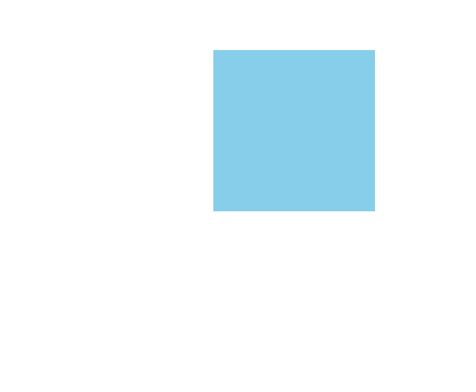

### 案例：旋转中心点

```html
<!DOCTYPE html>
<html lang="en">
  <head>
    <meta charset="UTF-8" />
    <meta name="viewport" content="width=device-width, initial-scale=1.0" />
    <title>Document</title>
    <style>
      div {
        width: 200px;
        height: 200px;
        border: 1px solid skyblue;
        margin: 100px auto;
        /* 隐藏超出屏幕的 */
        overflow: hidden;
      }
      div::before {
        content: " ";
        display: block;
        width: 100%;
        height: 100%;
        background: hotpink;
        transform: rotate(180deg);
        /* 设置旋转点位置 */
        transform-origin: left bottom;
        /* 添加过渡动画 */
        transition: all 1s;
      }
      /* 鼠标经过效果 */
      div:hover::before {
        transform: rotate(0deg);
      }
    </style>
  </head>
  <body>
    <div></div>
  </body>
</html>
```

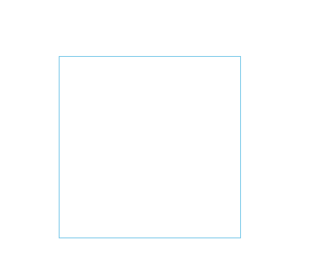

## 缩放元素

比如数值为 2 时表示为原尺寸的两倍。

```html
<style>
  div {
    width: 200px;
    height: 200px;
    border: 1px solid skyblue;
    margin: 200px auto;
  }
  div:hover {
    /* 放大两倍 */
    transform: scale(2, 2);
  }
</style>
```

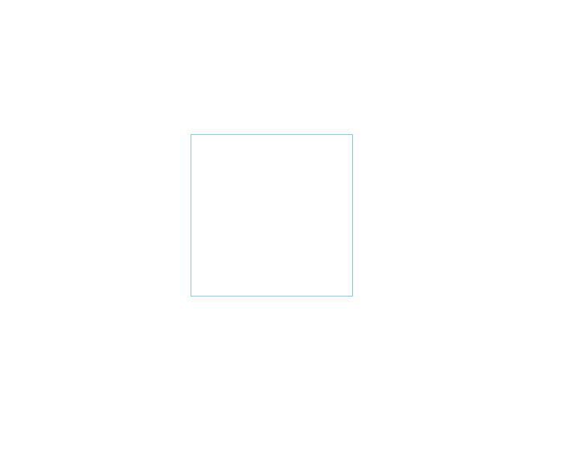

x 轴缩放

```css
transform: scale(2, 1);
```

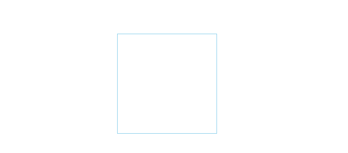

y 轴缩放

```css
transform: scale(1, 2);
```

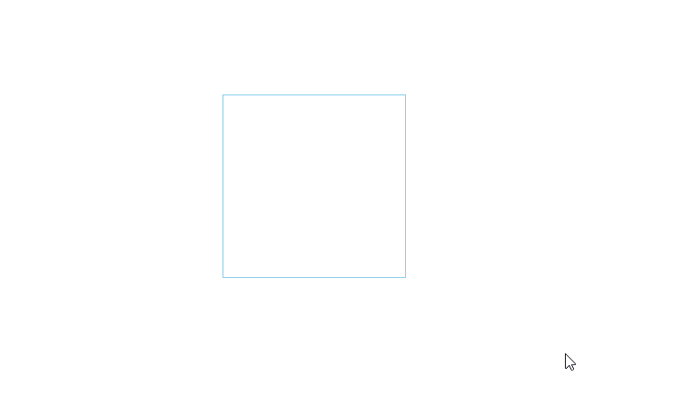

缩小

```css
transform: scale(0.5, 0.5);
/*如果两个值一样可以简写*/
transform: scale(0.5);
```

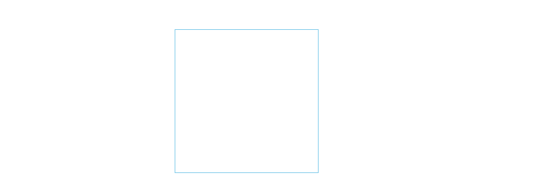

### 案例：图片缩放

```html
<!DOCTYPE html>
<html lang="en">
  <head>
    <meta charset="UTF-8" />
    <meta name="viewport" content="width=device-width, initial-scale=1.0" />
    <title>Document</title>
    <style>
      div {
        overflow: hidden;
        margin: 10px;
        float: left;
      }
      div img {
        width: 400px;
        transition: all 0.5s;
      }
      div img:hover {
        /* 放大1.1倍 */
        transform: scale(1.1);
      }
    </style>
  </head>
  <body>
    <div>
      <a href="#"></a>
    </div>
    <div>
      <a href="#"></a>
    </div>
  </body>
</html>
```


**参数顺序**

可以同时设置多个旋转规则，顺序不同结果也会不同。

```css
transform: scale(1.5) rotateX(30deg);
```

# 帧动画

## 关键帧

```html
<style>
  /* 定义关键帧 */
  /* from和to等价于0%和100% */
  @keyframes move {
    from {
      transform: translate(0, 0);
    }
    to {
      transform: translate(1000px, 0);
    }
  }
  div {
    width: 100px;
    height: 100px;
    background: skyblue;
    /* 使用关键帧 */
    animation: move;
    /* 设置事件 */
    animation-duration: 2s;
  }
</style>
```

## 多个状态变化

```html
<style>
  /* 定义关键帧 */
  @keyframes move {
    0% {
      transform: translate(0, 0);
    }
    25% {
      transform: translate(1000px, 0);
    }
    50% {
      transform: translate(1000px, 500px);
    }
    75% {
      transform: translate(0, 500px);
    }
    100% {
      transform: translate(0, 0);
    }
  }
  div {
    width: 100px;
    height: 100px;
    background: skyblue;
    /* 使用关键帧 */
    animation: move;
    /* 设置事件 */
    animation-duration: 10s;
  }
</style>
```


## CSS3 的动画属性

下面的表格列出了 @keyframes 规则和所有动画属性：

| 属性                      | 描述                                                |
| ------------------------- | --------------------------------------------------- |
| @keyframes                | 规定动画。                                          |
| animation                 | 所有动画属性的简写属性。                            |
| animation-name            | 规定 @keyframes 动画的名称。                        |
| animation-duration        | 规定动画完成一个周期所花费的秒或毫秒。默认是 0。    |
| animation-timing-function | 规定动画的速度曲线。默认是 "ease"。                 |
| animation-fill-mode       | 规定当动画不播放时，要应用到元素的样式。            |
| animation-delay           | 规定动画何时开始。默认是 0。                        |
| animation-iteration-count | 规定动画被播放的次数。默认是 1。                    |
| animation-direction       | 规定动画是否在下一周期逆向地播放。默认是 "normal"。 |
| animation-play-state      | 规定动画是否正在运行或暂停。默认是 "running"。      |

```html
<style>
  /* 定义关键帧 */
  @keyframes move {
    0% {
      transform: translate(0, 0);
    }
    100% {
      transform: translate(1000px, 0);
    }
  }
  div {
    width: 100px;
    height: 100px;
    background: skyblue;
    /* 使用关键帧 */
    animation: move;
    /* 设置时间 */
    animation-duration: 2s;
    /* 运动曲线 */
    animation-timing-function: ease;
    /* 何时开始 */
    animation-delay: 1s;
    /* 重复次数 */
    animation-iteration-count: infinite;
    /* 是否反方向播放 */
    animation-direction: alternate;
  }
</style>
```


### 动画结束后停止到结束状态

```html
<style>
  /* 定义关键帧 */
  @keyframes move {
    0% {
      transform: translate(0, 0);
    }
    100% {
      transform: translate(1000px, 0);
    }
  }
  div {
    width: 100px;
    height: 100px;
    background: skyblue;
    /* 使用关键帧 */
    animation: move;
    /* 设置时间 */
    animation-duration: 2s;
    /* 运动曲线 */
    animation-timing-function: ease;
    /* 何时开始 */
    animation-delay: 1s;
    /* 动画结束后的状态默认是backwards 回到起始状态 结束状态forwards */
    animation-fill-mode: forwards;
  }
</style>
```


### 鼠标经过 div 让 div 停止动画

```css
div:hover {
  /* 鼠标经过div 让div停止动画 */
  animation-play-state: paused;
}
```


### 动画简写属性

animation :动画名称 持续时间 运动曲线 何时开始 播放次数 是否反方向 动画起始或者结束的状态;

```css
/* animation: name duration timing-function delay iteration-count direction fill-mode; */
/*前面2个属性 name duration 一定要写*/
animation: move 2s linear 0s 1 alternate forwards;
```

● 简写属性里面不包含 animation play- state● 暂停动画: animation-play-state: puased; 经常和鼠标经过等其他配合使用 ● 想要动画走回来, 而不是直接跳回来: animation-direction : alternate● 盒子动画结束后,停在结束位置: animation-fill-mode : forwards

## 案例：热点图案例

```html
<!DOCTYPE html>
<html lang="en">
  <head>
    <meta charset="UTF-8" />
    <meta name="viewport" content="width=device-width, initial-scale=1.0" />
    <title>Document</title>
    <style>
      body {
        background: #333;
      }
      .map {
        width: 747px;
        height: 616px;
        background: url(img/map.png) no-repeat;
        margin: 0 auto;
        position: relative;
      }
      .city {
        position: absolute;
        top: 227px;
        right: 193px;
        color: #ffffff;
      }
      .tb {
        top: 500px;
        right: 80px;
      }
      .gz {
        top: 540px;
        right: 191px;
      }
      .dotted {
        width: 8px;
        height: 8px;
        background-color: #09f;
        border-radius: 50%;
      }
      .city div[class^="pulse"] {
        /* 保证我们小波纹在父盒子中央 */
        position: absolute;
        top: 50%;
        left: 50%;
        transform: translate(-50%, -50%);
        width: 8px;
        height: 8px;
        box-shadow: 0 0 12px #009dfd;
        border-radius: 50%;
        animation: pulse 1.2s linear infinite;
      }
      /* 时间插值 */
      .city div.pulse2 {
        animation-delay: 0.4s;
      }
      .city div.pulse3 {
        animation-delay: 0.8s;
      }
      @keyframes pulse {
        0% {
        }
        70% {
          width: 40px;
          height: 40px;
          opacity: 1;
        }
        100% {
          width: 70px;
          height: 70px;
          opacity: 0;
        }
      }
    </style>
  </head>
  <body>
    <div class="map">
      <div class="city">
        <div class="dotted"></div>
        <div class="pulse1"></div>
        <div class="pulse2"></div>
        <div class="pulse3"></div>
      </div>
      <div class="city tb">
        <div class="dotted"></div>
        <div class="pulse1"></div>
        <div class="pulse2"></div>
        <div class="pulse3"></div>
      </div>
      <div class="city gz">
        <div class="dotted"></div>
        <div class="pulse1"></div>
        <div class="pulse2"></div>
        <div class="pulse3"></div>
      </div>
    </div>
  </body>
</html>
```

### 速度曲线

使用的数学函数，称为三次贝塞尔曲线，速度曲线。使用此函数，您可以使用您自己的值，或使用预先定义的值之一：

| 值                            | 描述                                                         |
| ----------------------------- | ------------------------------------------------------------ |
| linear                        | 动画从头到尾的速度是相同的。                                 |
| ease                          | 默认。动画以低速开始，然后加快，在结束前变慢。               |
| ease-in                       | 动画以低速开始。                                             |
| ease-out                      | 动画以低速结束。                                             |
| ease-in-out                   | 动画以低速开始和结束。                                       |
| cubic-bezier(_n_,_n_,_n_,_n_) | 在 cubic-bezier 函数中自己的值。可能的值是从 0 到 1 的数值。 |

### 步数 steps

```html
<style>
  div {
    width: 0;
    height: 30px;
    background: pink;
    /*steps步数*/
    animation: w 4s steps(10);
  }
  @keyframes w {
    0% {
      width: 0;
    }
    100% {
      width: 200px;
    }
  }
</style>
```


## 案例：奔跑的熊大

```html
<!DOCTYPE html>
<html lang="en">
  <head>
    <meta charset="UTF-8" />
    <meta name="viewport" content="width=device-width, initial-scale=1.0" />
    <title>Document</title>
    <style>
      body {
        background: #ccc;
      }
      div {
        position: absolute;
        width: 200px;
        height: 100px;
        background: url(img/bear.png) no-repeat;
        /* 可以添加多个动画用逗号分割 */
        animation: bear 1s steps(8) infinite, move 6s forwards;
      }
      /* 让熊动起来 */
      @keyframes bear {
        0% {
          background-position: 0 0;
        }
        100% {
          background-position: -1600px 0;
        }
      }
      /* 让熊跑起来 */
      @keyframes move {
        0% {
          left: 0;
        }
        100% {
          left: 50%;
          transform: translateX(-50%);
        }
      }
    </style>
  </head>
  <body>
    <div></div>
  </body>
</html>
```

# 3D 转换

## 三维坐标系

三维坐标系其实就是指立体空间,立体空间是由 3 个轴共同组成的。● x 轴: 水平向右 注意: x 右边是正值,左边是负值 ● y 轴: 垂直向下 注意: y 下面是正值,上面是负值 ● z 轴: 垂直屏幕 注意: 往外面是正值,往里面是负值

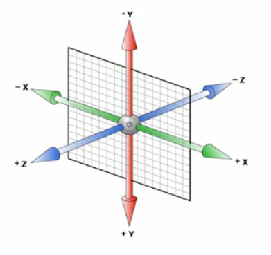

## 透视 perspective

在 2D 平面产生近大远小视觉立体,但是只是效果二维的

● 如果想要在网页产生 3D 效果需要透视(理解成 3D 物体投影在 2D 平面内)。

● 模拟人类的视觉位置,可认为安排一只眼睛去看

● 透视我们也称为视距 :视距就是人的眼睛到屏幕的距离

● 距离视觉点越近的在电脑平面成像越大 ,越远成像越小

● 透视的单位是像素

透视写在被观察元素的父盒子上面的

d :就是视距,视距就是一个距离人的眼睛到屏幕的距离。

z:就是 z 轴,物体距离屏幕的距离, z 轴越大(正值)我们看到的物体就越大。


```html
<style>
  body {
    /* 透视写到被观察元素的父盒子上面 */
    perspective: 500px;
  }
  div {
    width: 200px;
    height: 200px;
    background-color: pink;
    transform: translate3d(400px, 300px, 100px);
  }
</style>
```

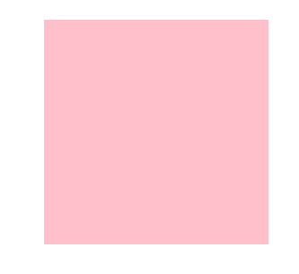

```html
<style>
  body {
    /* 透视写到被观察元素的父盒子上面 */
    perspective: 500px;
  }
  div {
    width: 200px;
    height: 200px;
    background-color: pink;
    margin: 100px auto;
    transform: translateZ(0px);
  }
</style>
```

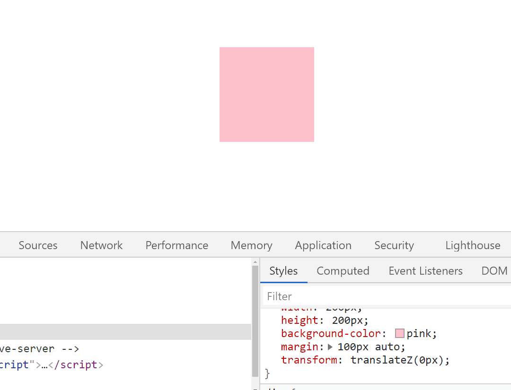

**3D 旋转**

### 绕 x 轴旋转

```html
<style>
  body {
    /* 透视写到被观察元素的父盒子上面 */
    perspective: 500px;
  }
  img {
    display: block;
    margin: 100px auto;
    transition: all 1s;
  }
  img:hover {
    transform: rotateX(180deg);
  }
</style>
<body>
  
</body>
```

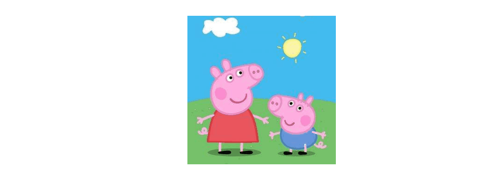

正值

```css
transform: rotateX(45deg);
```

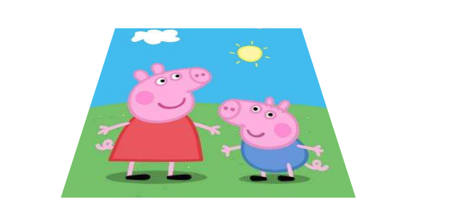

负值

```css
transform: rotateX(-45deg);
```


### Y 轴旋转

```html
<style>
  body {
    /* 透视写到被观察元素的父盒子上面 */
    perspective: 500px;
  }
  img {
    display: block;
    margin: 100px auto;
    transition: all 1s;
  }
  img:hover {
    transform: rotateY(180deg);
  }
</style>
<body>
  
</body>
```

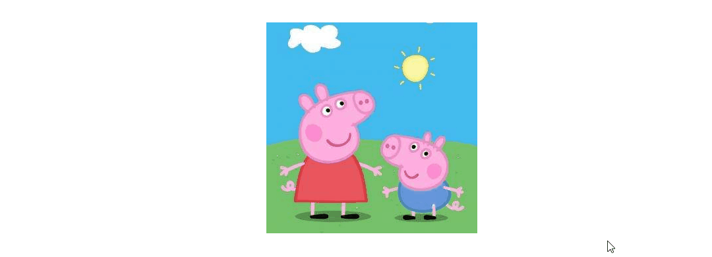

正值

```css
transform: rotateY(45deg);
```

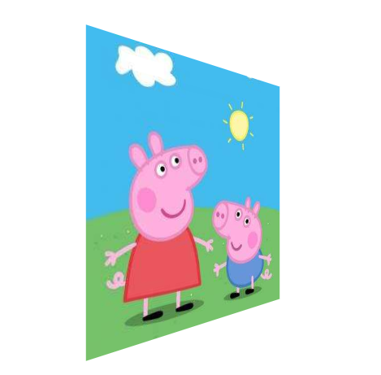

负值

```css
transform: rotateY(-45deg);
```


### Z 轴旋转

```html
<style>
  body {
    /* 透视写到被观察元素的父盒子上面 */
    perspective: 500px;
  }
  img {
    display: block;
    margin: 100px auto;
    transition: all 1s;
  }
  img:hover {
    transform: rotateZ(180deg);
  }
</style>
<body>
  
</body>
```

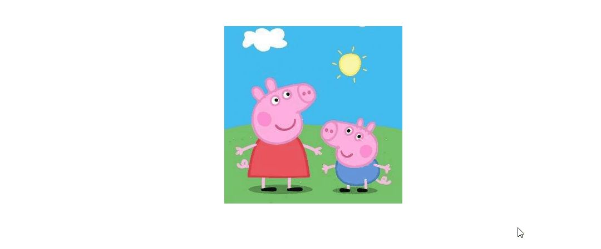

**3D 呈现 transfrom-style**

● 控制子元素是否开启三维立体环境。●transform-style: flat 子元素不开启 3d 立体空间默认的 ●transform-style: preserve- 3d;子元素开启立体空间 ● 代码写给父级,但是影响的是子盒子 ● 这个属性很重要,后面必用

### 未开启子元素 3d 立体空间

```html
<style>
  body {
    /* 添加透视 */
    perspective: 500px;
  }
  .box {
    position: relative;
    width: 200px;
    height: 200px;
    margin: 100px auto;
  }
  .box:hover {
    /* 父元素绕Y轴旋转 */
    transform: rotateY(60deg);
  }
  .box div {
    position: absolute;
    top: 0;
    left: 0;
    width: 100%;
    height: 100%;
    background: skyblue;
  }
  .box div:last-child {
    background: purple;
    /* 子元素绕x轴旋转 */
    transform: rotateX(60deg);
  }
</style>
<body>
  <div class="box">
    <div></div>
    <div></div>
  </div>
</body>
```


**开启子元素 3d 立体空间**

```css
/* 让子元素保持三维立体空间 */
transform-style: preserve-3d;
```

```html
<style>
  body {
    /* 添加透视 */
    perspective: 500px;
  }
  .box {
    position: relative;
    width: 200px;
    height: 200px;
    margin: 100px auto;
    /* 让子元素保持三维立体空间 */
    transform-style: preserve-3d;
  }
  .box:hover {
    /* 父元素绕Y轴旋转 */
    transform: rotateY(60deg);
  }
  .box div {
    position: absolute;
    top: 0;
    left: 0;
    width: 100%;
    height: 100%;
    background: skyblue;
  }
  .box div:last-child {
    background: purple;
    /* 子元素绕x轴旋转 */
    transform: rotateX(60deg);
  }
</style>
<body>
  <div class="box">
    <div></div>
    <div></div>
  </div>
</body>
```


## 案例：两面翻转的盒子

```html
<!DOCTYPE html>
<html lang="en">
  <head>
    <meta charset="UTF-8" />
    <meta name="viewport" content="width=device-width, initial-scale=1.0" />
    <title>Document</title>
    <style>
      body {
        perspective: 400px;
      }
      .box {
        position: relative;
        width: 300px;
        height: 300px;
        margin: 100px auto;
        transition: all 0.4s;
        /* 让子元素保留立体空间 */
        transform-style: preserve-3d;
      }
      .box:hover {
        transform: rotateY(180deg);
      }
      .front,
      .back {
        position: absolute;
        top: 0;
        left: 0;
        width: 100%;
        height: 100%;
        border-radius: 50%;
        color: white;
        font-size: 30px;
        text-align: center;
        line-height: 300px;
      }
      .front {
        background: skyblue;
        z-index: 2;
      }
      .back {
        background: purple;
        /* 旋转180度，背靠背旋转 */
        transform: rotateY(180deg);
      }
    </style>
  </head>
  <body>
    <div class="box">
      <div class="front">正面</div>
      <div class="back">反面</div>
    </div>
  </body>
</html>
```


