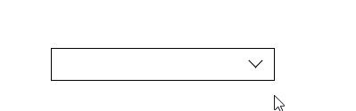

# CSS3 过渡

## 过渡属性

下表列出了所有的过渡属性:

| 属性                       | 描述                                         | CSS  |
| -------------------------- | -------------------------------------------- | ---- |
| transition                 | 简写属性，用于在一个属性中设置四个过渡属性。 | 3    |
| transition-property        | 规定应用过渡的 CSS 属性的名称。              | 3    |
| transition-duration        | 定义过渡效果花费的时间。默认是 0。           | 3    |
| transition-timing-function | 规定过渡效果的时间曲线。默认是 "ease"。      | 3    |
| transition-delay           | 规定过渡效果何时开始。默认是 0。             | 3    |

## 过渡的时间曲线

| 值                            | 描述                                                         |
| ----------------------------- | ------------------------------------------------------------ |
| linear                        | 规定以相同速度开始至结束的过渡效果（等于 cubic-bezier(0,0,1,1)）。 |
| ease                          | 规定慢速开始，然后变快，然后慢速结束的过渡效果（cubic-bezier(0.25,0.1,0.25,1)）。 |
| ease-in                       | 规定以慢速开始的过渡效果（等于 cubic-bezier(0.42,0,1,1)）。  |
| ease-out                      | 规定以慢速结束的过渡效果（等于 cubic-bezier(0,0,0.58,1)）。  |
| ease-in-out                   | 规定以慢速开始和结束的过渡效果（等于 cubic-bezier(0.42,0,0.58,1)）。 |
| cubic-bezier(*n*,*n*,*n*,*n*) | 在 cubic-bezier 函数中定义自己的值。可能的值是 0 至 1 之间的数值。 |

## 过渡属性的使用

```html
<style>
    div{
        width: 200px;
        height: 100px;
        background: skyblue;
        /* transition: 变化的属性 花费的时间 运动曲线 何时开始; */
        transition: width .5s;
    }
    div:hover{
        width: 400px;
    }
</style>
```


## 多个属性的使用

```html
<style>
    div{
        width: 200px;
        height: 100px;
        background: skyblue;
        /* transition: 变化的属性 花费的时间 运动曲线 何时开始; */
        /* 如果想写多个属性，利用逗号分割 */
        transition: width .5s,height .5s;
    }
    div:hover{
        width: 400px;
        height: 200px;
    }
</style>
```


**所有属性的使用**

```css
transition: all .5s;
```

# 2D转换

## translateX

正值向右移动、负值向左移动。

```css
transform: translateX(100px)
```


### translateY

正值向下移动、负值向上移动。

```css
transform: translateY(100px)
```


### translate

使用 `translate` 可以控制按X、Y同时移动操作，第一个值控制X移动，第二个值控制Y移动。

```css
div{
    width: 200px;
    height: 200px;
    background: skyblue;
    /* 参数是x轴上移动位置,y轴上移动位置 */
    transform: translate(100px,100px);
}
<body>
    <div></div>
</body>
```


### 最大优点：不会影响其他元素位置

```css
div{
    width: 200px;
    height: 200px;
    background: skyblue;
}
div:first-child{
    background: skyblue;
    transform: translate(30px,30px);
}
div:last-child{
    background: purple;
}
<body>
    <div></div>
    <div></div>
</body>
```


案例


### 百分比移动

元素宽度为100px设置50%时将移动50px，即百分比是指元素的尺寸的百分比。

```css
div{
    width: 200px;
    height: 200px;
    background: skyblue;
    /* 百分比移动 */
    transform: translateX(50%);
}
<body>
    <div></div>
</body>
```


### 元素居中

通过百分比实现不需要手动计算

注意：translate对行内元素是没有效果的

```css
div{
    width: 500px;
    height: 500px;
    background-color: skyblue;
    position: relative;
}
p{
    width: 200px;
    height: 200px;
    background: purple;
    /* 实现居中 */
    position: absolute;
    top: 50%;
    left: 50%;
    /*往左走宽度的一半，往上走自己高度的一半*/
    transform: translate(-50%,-50%);
}
<body>
    <div>
        <p></p>
    </div>
</body>
```

## 旋转操作

使用CSS可以控制元素按照不同坐标轴进行旋转。

```css
/* 旋转45度   */
transform: rotate(45deg);
```


### 案例：CSS三角

```html
<!DOCTYPE html>
<html lang="en">
<head>
    <meta charset="UTF-8">
    <meta name="viewport" content="width=device-width, initial-scale=1.0">
    <title>Document</title>
    <style>
        div{
            position: relative;
            margin: 100px;
            width: 249px;
            height: 35px;
            border: 1px solid #000;
        }
        div::after{
            content: "";
            position: absolute;
            top: 8px;
            right: 15px;
            width: 10px;
            height: 10px;
            border-right: 1px solid #000;
            border-bottom: 1px solid #000;
            transform: rotate(45deg);
            /* 添加过渡动画 */
            transition: all 0.2s;
        }
        /* 鼠标经过div 里面的三角旋转 */
        div:hover::after{
            transform: rotate(225deg);
        }
    </style>
</head>
<body>
    <div></div>
</body>
</html>
```





**变形基点**

使用 `transform-origin` 设置元素的X/YZ操作的基点，用于控制旋转、倾斜等操作。

```html
<style>
    div{
        width: 200px;
        height: 200px;
        background: skyblue;
        margin: 100px auto;
        /* 过渡动画 */
        transition: all 1s;
        /* 设置旋转点 */
        transform-origin: left bottom;
    }
    div:hover{
        transform: rotate(360deg);
    }
</style>
```


### 案例：旋转中心点

```html
<!DOCTYPE html>
<html lang="en">
<head>
    <meta charset="UTF-8">
    <meta name="viewport" content="width=device-width, initial-scale=1.0">
    <title>Document</title>
    <style>
        div{
            width: 200px;
            height: 200px;
            border: 1px solid skyblue;
            margin: 100px auto;
            /* 隐藏超出屏幕的 */
            overflow: hidden;
        }
        div::before{
            content: " ";
            display: block;
            width: 100%;
            height: 100%;
            background: hotpink;
            transform: rotate(180deg);
            /* 设置旋转点位置 */
            transform-origin: left bottom;
            /* 添加过渡动画 */
            transition: all 1s;
        }
        /* 鼠标经过效果 */
        div:hover::before{
            transform: rotate(0deg);
        }
    </style>
</head>
<body>
    <div></div>
</body>
</html>
```


## 缩放元素

比如数值为2时表示为原尺寸的两倍。

```html
<style>
    div{
        width: 200px;
        height: 200px;
        border: 1px solid skyblue;
        margin: 200px auto;
    }
    div:hover{
        /* 放大两倍 */
        transform: scale(2,2);
    }
</style>
```


x轴缩放

```css
transform: scale(2,1);
```


y轴缩放

```css
transform: scale(1,2);
```


缩小

```css
transform: scale(0.5,0.5);
/*如果两个值一样可以简写*/
transform: scale(0.5);
```


### 案例：图片缩放

```html
<!DOCTYPE html>
<html lang="en">
<head>
    <meta charset="UTF-8">
    <meta name="viewport" content="width=device-width, initial-scale=1.0">
    <title>Document</title>
    <style>
        div{
            overflow: hidden;
            margin: 10px;
            float: left;
        }
        div img{
            width: 400px;
           transition: all 0.5s;
        }
        div img:hover{
            /* 放大1.1倍 */
            transform: scale(1.1);
        }
    </style>
</head>
<body>
    <div>
        <a href="#"></a>
    </div>
    <div>
        <a href="#"></a>
    </div>
</body>
</html>
```


**参数顺序**

可以同时设置多个旋转规则，顺序不同结果也会不同。

```css
transform: scale(1.5) rotateX(30deg) ;
```

# 帧动画

## 关键帧

```html
<style>
    /* 定义关键帧 */
    /* from和to等价于0%和100% */
    @keyframes move {
        from{
            transform: translate(0,0);
        }
        to{
            transform: translate(1000px,0);
        }
    }
    div{
        width: 100px;
        height: 100px;
        background: skyblue;
        /* 使用关键帧 */
        animation: move;
        /* 设置事件 */
        animation-duration: 2s;
    }
</style>
```


## 多个状态变化

```html
<style>
    /* 定义关键帧 */
    @keyframes move {
        0%{
            transform: translate(0,0);
        }
        25%{
            transform: translate(1000px,0);
        }
        50%{
            transform: translate(1000px,500px);
        }
        75%{
            transform: translate(0,500px);
        }
        100%{
            transform: translate(0,0);
        }
    }
    div{
        width: 100px;
        height: 100px;
        background: skyblue;
        /* 使用关键帧 */
        animation: move;
        /* 设置事件 */
        animation-duration: 10s;
    }
</style>
```


## CSS3的动画属性

下面的表格列出了 @keyframes 规则和所有动画属性：

| 属性                      | 描述                                                |
| ------------------------- | --------------------------------------------------- |
| @keyframes                | 规定动画。                                          |
| animation                 | 所有动画属性的简写属性。                            |
| animation-name            | 规定 @keyframes 动画的名称。                        |
| animation-duration        | 规定动画完成一个周期所花费的秒或毫秒。默认是 0。    |
| animation-timing-function | 规定动画的速度曲线。默认是 "ease"。                 |
| animation-fill-mode       | 规定当动画不播放时，要应用到元素的样式。            |
| animation-delay           | 规定动画何时开始。默认是 0。                        |
| animation-iteration-count | 规定动画被播放的次数。默认是 1。                    |
| animation-direction       | 规定动画是否在下一周期逆向地播放。默认是 "normal"。 |
| animation-play-state      | 规定动画是否正在运行或暂停。默认是 "running"。      |

```html
<style>
    /* 定义关键帧 */
    @keyframes move {
        0%{
            transform: translate(0,0);
        }
        100%{
            transform: translate(1000px,0);
        }
    }
    div{
        width: 100px;
        height: 100px;
        background: skyblue;
        /* 使用关键帧 */
        animation: move;
        /* 设置时间 */
        animation-duration: 2s;
        /* 运动曲线 */
        animation-timing-function: ease;
        /* 何时开始 */
        animation-delay: 1s;
        /* 重复次数 */
        animation-iteration-count: infinite;
        /* 是否反方向播放 */
        animation-direction:alternate;
    }
</style>
```


### 动画结束后停止到结束状态

```html
<style>
    /* 定义关键帧 */
    @keyframes move {
        0%{
            transform: translate(0,0);
        }
        100%{
            transform: translate(1000px,0);
        }
    }
    div{
        width: 100px;
        height: 100px;
        background: skyblue;
        /* 使用关键帧 */
        animation: move;
        /* 设置时间 */
        animation-duration: 2s;
        /* 运动曲线 */
        animation-timing-function: ease;
        /* 何时开始 */
        animation-delay: 1s;
        /* 动画结束后的状态默认是backwards 回到起始状态 结束状态forwards */
        animation-fill-mode: forwards;
    }
</style>
```


### 鼠标经过div让div停止动画

```css
div:hover{
    /* 鼠标经过div 让div停止动画 */
    animation-play-state: paused;
}
```


### 动画简写属性

animation :动画名称 持续时间 运动曲线 何时开始 播放次数 是否反方向 动画起始或者结束的状态;

```css
/* animation: name duration timing-function delay iteration-count direction fill-mode; */
/*前面2个属性 name duration 一定要写*/
animation: move 2s linear 0s 1 alternate forwards;
```

● 简写属性里面不包含animation play- state● 暂停动画: animation-play-state: puased; 经常和鼠标经过等其他配合使用● 想要动画走回来, 而不是直接跳回来: animation-direction : alternate● 盒子动画结束后,停在结束位置: animation-fill-mode : forwards

## 案例：热点图案例

```html
<!DOCTYPE html>
<html lang="en">
<head>
    <meta charset="UTF-8">
    <meta name="viewport" content="width=device-width, initial-scale=1.0">
    <title>Document</title>
    <style>
        body{
            background: #333;
        }
        .map{
            width: 747px;
            height: 616px;
            background: url(img/map.png) no-repeat;
            margin: 0 auto;
            position: relative;
        }
        .city{
            position: absolute;
            top: 227px;
            right: 193px;
            color: #ffffff;
        }
        .tb{
            top: 500px;
            right: 80px;
        }
        .gz{
            top: 540px;
            right: 191px;
        }
        .dotted{
            width: 8px;
            height: 8px;
            background-color: #09f;
            border-radius: 50%;
        }
        .city div[class^="pulse"]{
            /* 保证我们小波纹在父盒子中央 */
            position: absolute;
            top: 50%;
            left: 50%;
            transform: translate(-50%,-50%);
            width: 8px;
            height: 8px;
            box-shadow: 0 0 12px #009dfd;
            border-radius: 50%;
            animation: pulse 1.2s linear infinite;
        }
        /* 时间插值 */
        .city div.pulse2{
            animation-delay: 0.4s;
        }
        .city div.pulse3{
            animation-delay: 0.8s;
        }
        @keyframes pulse {
            0%{
            }
            70%{
                width: 40px;
                height: 40px;
                opacity: 1;
            }
            100%{
                width: 70px;
                height: 70px;
                opacity: 0;
            }
        }
    </style>
</head>
<body>
    <div class="map">
        <div class="city">
            <div class="dotted"></div>
            <div class="pulse1"></div>
            <div class="pulse2"></div>
            <div class="pulse3"></div>
        </div>
        <div class="city tb">
            <div class="dotted"></div>
            <div class="pulse1"></div>
            <div class="pulse2"></div>
            <div class="pulse3"></div>
        </div>
        <div class="city gz">
            <div class="dotted"></div>
            <div class="pulse1"></div>
            <div class="pulse2"></div>
            <div class="pulse3"></div>
        </div>
    </div>
</body>
</html>
```


### 速度曲线

使用的数学函数，称为三次贝塞尔曲线，速度曲线。使用此函数，您可以使用您自己的值，或使用预先定义的值之一：

| 值                            | 描述                                                         |
| ----------------------------- | ------------------------------------------------------------ |
| linear                        | 动画从头到尾的速度是相同的。                                 |
| ease                          | 默认。动画以低速开始，然后加快，在结束前变慢。               |
| ease-in                       | 动画以低速开始。                                             |
| ease-out                      | 动画以低速结束。                                             |
| ease-in-out                   | 动画以低速开始和结束。                                       |
| cubic-bezier(*n*,*n*,*n*,*n*) | 在 cubic-bezier 函数中自己的值。可能的值是从 0 到 1 的数值。 |

### 步数steps

```html
<style>
    div{
        width: 0;
        height: 30px;
        background: pink;
        /*steps步数*/
        animation: w 4s steps(10);
    }
    @keyframes w {
        0%{
            width: 0;
        }
        100%{
            width: 200px;
        }
    }
</style>
```


## 案例：奔跑的熊大

```html
<!DOCTYPE html>
<html lang="en">
<head>
    <meta charset="UTF-8">
    <meta name="viewport" content="width=device-width, initial-scale=1.0">
    <title>Document</title>
    <style>
        body{
            background: #ccc;
        }
        div{
            position: absolute;
            width: 200px;
            height: 100px;
            background: url(img/bear.png) no-repeat;
            /* 可以添加多个动画用逗号分割 */
            animation: bear 1s steps(8) infinite,move 6s forwards;
        }
        /* 让熊动起来 */
        @keyframes bear {
            0%{
                background-position: 0 0;
            }
            100%{
                background-position: -1600px 0;
            }
        }
        /* 让熊跑起来 */
        @keyframes move {
            0%{
                left: 0;
            }
            100%{
                left: 50%;
                transform: translateX(-50%);
            }
        }
    </style>
</head>
<body>
    <div></div>
</body>
</html>
```


# 3D转换

## 三维坐标系

三维坐标系其实就是指立体空间,立体空间是由3个轴共同组成的。● x轴: 水平向右  注意: x右边是正值,左边是负值● y轴: 垂直向下  注意: y下面是正值,上面是负值● z轴: 垂直屏幕  注意: 往外面是正值,往里面是负值


## 透视perspective

在2D平面产生近大远小视觉立体,但是只是效果二维的 

●如果想要在网页产生3D效果需要透视(理解成3D物体投影在2D平面内)。 

●模拟人类的视觉位置,可认为安排一只眼睛去看 

●透视我们也称为视距 :视距就是人的眼睛到屏幕的距离 

●距离视觉点越近的在电脑平面成像越大 ,越远成像越小 

●透视的单位是像素

透视写在被观察元素的父盒子上面的 

d :就是视距,视距就是一个距离人的眼睛到屏幕的距离。 

z:就是z轴,物体距离屏幕的距离, z轴越大(正值)我们看到的物体就越大。


 

```html
<style>
    body{
        /* 透视写到被观察元素的父盒子上面 */
        perspective: 500px;
    }
    div{
        width: 200px;
        height: 200px;
        background-color: pink;
        transform: translate3d(400px,300px,100px);
    }
</style>
```


 

```html
<style>
    body{
        /* 透视写到被观察元素的父盒子上面 */
        perspective: 500px;
    }
    div{
        width: 200px;
        height: 200px;
        background-color: pink;
        margin: 100px auto;
        transform: translateZ(0px)
    }
</style>
```


**3D旋转**

### 绕x轴旋转

```html
<style>
    body{
        /* 透视写到被观察元素的父盒子上面 */
        perspective: 500px;
    }
    img{
        display: block;
        margin: 100px auto;
        transition: all 1s;
    }
    img:hover{
        transform: rotateX(180deg);
    }
</style>
<body>
    
</body>
```


正值

```css
transform: rotateX(45deg);
```


负值

```css
transform: rotateX(-45deg);
```


### Y轴旋转

```html
<style>
    body{
        /* 透视写到被观察元素的父盒子上面 */
        perspective: 500px;
    }
    img{
        display: block;
        margin: 100px auto;
        transition: all 1s;
    }
    img:hover{
        transform: rotateY(180deg);
    }
</style>
<body>
    
</body>
```


正值

```css
transform: rotateY(45deg);
```


负值

```css
transform: rotateY(-45deg);
```


### Z轴旋转

```html
<style>
    body{
        /* 透视写到被观察元素的父盒子上面 */
        perspective: 500px;
    }
    img{
        display: block;
        margin: 100px auto;
        transition: all 1s;
    }
    img:hover{
        transform: rotateZ(180deg);
    }
</style>
<body>
    
</body>
```


**3D呈现transfrom-style**


●控制子元素是否开启三维立体环境。●transform-style: flat子元素不开启3d立体空间默认的●transform-style: preserve- 3d;子元素开启立体空间●代码写给父级,但是影响的是子盒子●这个属性很重要,后面必用

### 未开启子元素3d立体空间

```html
<style>
    body{
        /* 添加透视 */
        perspective: 500px;
    }
    .box{
        position: relative;
        width: 200px;
        height: 200px;
        margin: 100px auto;
    }
    .box:hover{
        /* 父元素绕Y轴旋转 */
        transform: rotateY(60deg);
    }
    .box div{
        position: absolute;
        top: 0;
        left: 0;
        width: 100%;
        height: 100%;
        background: skyblue;
    }
    .box div:last-child{
        background: purple;
        /* 子元素绕x轴旋转 */
        transform: rotateX(60deg);
    }
</style>
<body>
    <div class="box">
        <div></div>
        <div></div>
    </div>
</body>
```


**开启子元素3d立体空间**

```css
/* 让子元素保持三维立体空间 */
transform-style: preserve-3d;
```

```html
<style>
    body{
        /* 添加透视 */
        perspective: 500px;
    }
    .box{
        position: relative;
        width: 200px;
        height: 200px;
        margin: 100px auto;
        /* 让子元素保持三维立体空间 */
        transform-style: preserve-3d;
    }
    .box:hover{
        /* 父元素绕Y轴旋转 */
        transform: rotateY(60deg);
    }
    .box div{
        position: absolute;
        top: 0;
        left: 0;
        width: 100%;
        height: 100%;
        background: skyblue;
    }
    .box div:last-child{
        background: purple;
        /* 子元素绕x轴旋转 */
        transform: rotateX(60deg);
    }
</style>
<body>
    <div class="box">
        <div></div>
        <div></div>
    </div>
</body>
```


## 案例：两面翻转的盒子

```html
<!DOCTYPE html>
<html lang="en">
<head>
    <meta charset="UTF-8">
    <meta name="viewport" content="width=device-width, initial-scale=1.0">
    <title>Document</title>
    <style>
        body{
            perspective: 400px;
        }
        .box{
            position: relative;
            width: 300px;
            height: 300px;
            margin: 100px auto;
            transition: all .4s;
            /* 让子元素保留立体空间 */
            transform-style: preserve-3d;
        }
        .box:hover{
            transform: rotateY(180deg);
        }
        .front,
        .back{
            position: absolute;
            top: 0;
            left: 0;
            width: 100%;
            height: 100%;
            border-radius: 50%;
            color: white;
            font-size: 30px;
            text-align: center;
            line-height: 300px;
        }
        .front{
            background: skyblue;
            z-index: 2;
        }
        .back{
            background: purple;
            /* 旋转180度，背靠背旋转 */
            transform: rotateY(180deg);
        }
    </style>
</head>
<body>
    <div class="box">
        <div class="front">正面</div>
        <div class="back">反面</div>
    </div>
</body>
</html>
```


