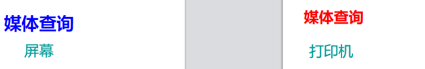
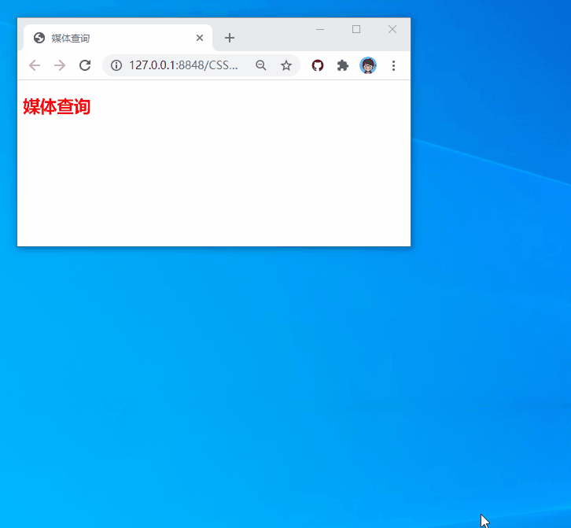
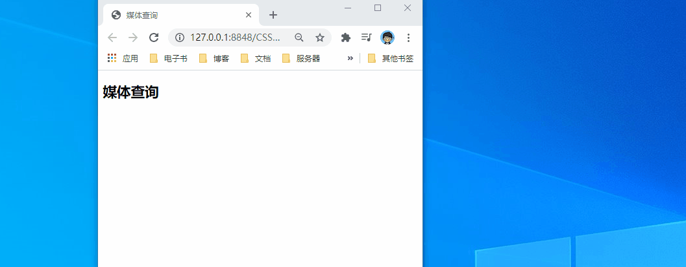
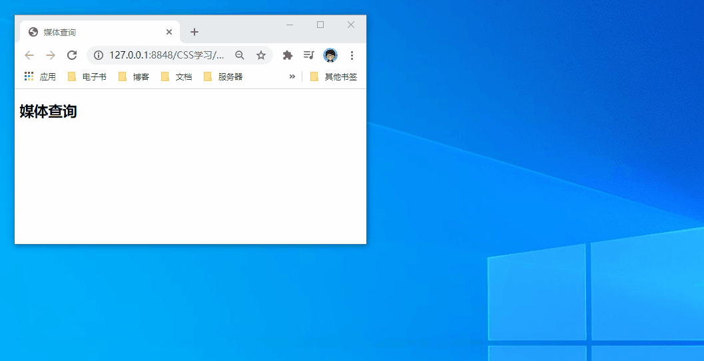
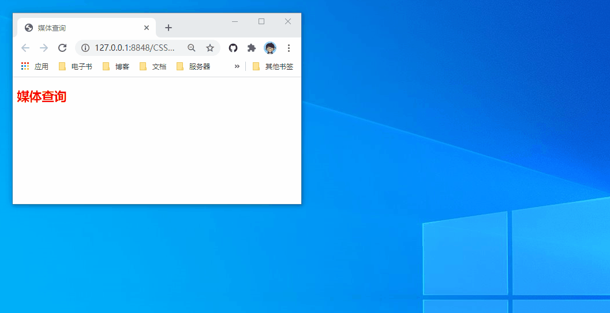
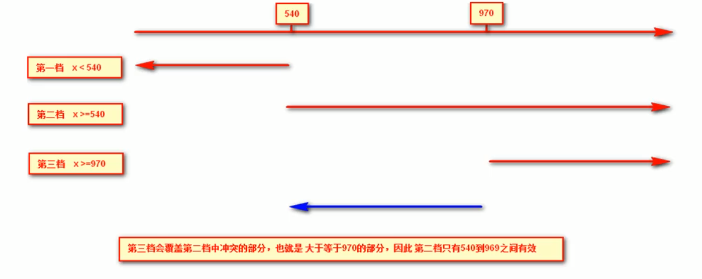
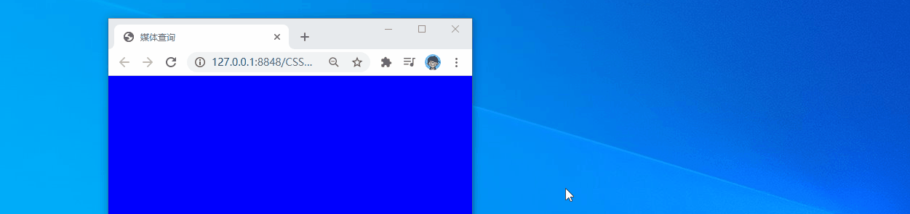
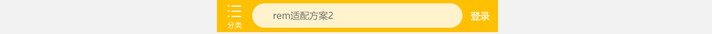

## 媒体查询

下面是常用媒体类型，当然主要使用的还是screen

| 选项   | 说明                               |
| ------ | ---------------------------------- |
| all    | 所有媒体类型                       |
| screen | 用于电脑屏幕，平板电脑，智能手机等 |
| print  | 打印设备                           |
| speech | 应用于屏幕阅读器等发声设备         |

### 常用特性

下面列出常用的媒体查询特性

| 特性                               | 说明                        |
| ---------------------------------- | --------------------------- |
| orientation: landscape \| portrait | landscape横屏，portrait竖屏 |
| width                              | 设备宽度                    |
| height                             | 设备高度                    |
| min-width                          | 最小宽度                    |
| max-width                          | 最大宽度                    |
| min-height                         | 最小高度                    |
| max-height                         | 最大高度                    |

### style方式

```html
<!-- 屏幕设备 -->
<style media="screen">
    h1 {
        color: blue;
    }
</style>
<!-- 打印设备 -->
<style media="print">
    h1 {
        color: red;
    }
</style>
```



### link方式

在 `link` 标签中通过 `media` 属性可以设置样式使用的媒体设备。

- `common.css` 没有指定媒体所以全局应用
- `screen.css` 应用在屏幕设备
- `print.css` 应用在打印设备

```html
<!DOCTYPE html>
<html>
    <head>
        <meta charset="UTF-8">
        <meta name="viewport" content="width=device-width, initial-scale=1.0">
        <title>后盾人</title>
        <!-- 为设置媒体查询是样式 -->
        <link rel="stylesheet" href="common.css">
        <!-- 屏幕样式 -->
        <link rel="stylesheet" href="screen.css" media="screen">
        <!-- 打印样式 -->
        <link rel="stylesheet" href="print.css" media="print">
    </head>
    <body>
        <h1>淘宝</h1>
        <h2>百度</h2>
    </body>
</html>
```

公共样式

```css
/* common.css */
h1 {
    color: red;
}
```

屏幕样式

```css
/* screen.css */
h2 {
    color: blue;
}
```

打印样式

```css
/* print.css */
h2 {
    color: red;
}
```


### @import方式

使用`@import` 可以引入指定设备的样式规则。文件中引入一个样式文件，在这个文件中再引入其他媒体的样式文件。

```html
<!DOCTYPE html>
<html>
    <head>
        <meta charset="UTF-8">
        <meta name="viewport" content="width=device-width, initial-scale=1.0">
        <title>后盾人</title>
        <!-- 设置导入的连接 -->
        <link rel="stylesheet" type="text/css" href="style.css"/>
    </head>
    <body>
        <h1>淘宝</h1>
        <h2>百度</h2>
    </body>
</html>
```

```css
/* style.css */
@import url(common.css);
@import url(screen.css) screen;
@import url(print.css) print;
```


### @media方式

```html
<style type="text/css">
    @media screen {
        h2 {
            color: blue;
        }
    }
    @media print {
        h2 {
            color: red;
        }
    }
</style>
</head>
<body>
    <h2>媒体查询</h2>
</body>
```


### 设备方向

使用 `orientation` 属性可以定义设备的方向

| 值        | 说明                   |
| --------- | ---------------------- |
| portrait  | 竖屏设备即高度大于宽度 |
| landscape | 横屏设备即宽度大于高度 |

> 当宽度大于高度显示红色

```html
<style type="text/css">
    /* 当屏幕宽度>高度则颜色设置为红色 */
    @media screen and (orientation:landscape) {
        h2 {
            color: red;
        }
    }
</style>
</head>
<body>
    <h2>媒体查询</h2>
</body>
```



## 查询条件

### 逻辑与

需要满足多个条件时才使用样式，多个条件使用`and` 连接。

> 当屏幕在700px到800px之间字体颜色设置为红色




### 逻辑或

多个`或` 条件查询使用逗号连接

> 最小宽度700px或最大高度200px

```html
<style type="text/css">
    <style type="text/css">
    /* 最小宽度700px或最大高度200px */
    @media screen and (min-width:700px),
    screen and (max-height:200px) {
        h2 {
            color: red;
        }
    }
</style>
</head>
<body>
    <h2>媒体查询</h2>
</body>
```




### 逻辑非

`not` 表示不应用样式，即所有条件**都满足**时**不应用**样式。

注意：必须将not写在查询的最前面

> 当屏幕不在700px到800px之间字体颜色设置为红色




### only

用来排除不支持媒体查询的浏览器。

- 对支持媒体查询的设备，正常调用样式，此时就当only不存在
- 对不支持媒体查询的设备不使用样式
- only 和 not 一样只能出现在媒体查询的开始

```css
@media only screen and (max-width: 600px) {
    ...
}
```

### 案例:媒体查询从小到大优势



 

```html
<style type="text/css">
    /* 1.媒体查询一般按照从小到大的顺序来 */
    /* 2.小于700px页面的背景颜色变为蓝色 */
    @media screen and (max-width:699px) {
        body {
            background-color: blue;
        }
    }
    /* 3.700~970页面的背景颜色变为绿色 */
    @media screen and (min-width:700px) {
        body {
            background-color: green;
        }
    }
    /* 4.大于970页面的背景颜色变为红色 */
    @media screen and (min-width:970px) {
        body {
            background-color: red;
        }
    }
</style>
```



## 视口标签

```html
<meta name="viewport" content="width=device-width,user-scalable=no,initial-scale=1.0,minimum-scale=1.0,maximum-scale=1.0">
```

| 属性              | 说明                                                 |
| ----------------- | ---------------------------------------------------- |
| width             | 宽度设置的是viewport宽度，可以设置device-width特殊值 |
| initial-scale     | 初始缩放比例,大于0的数字                             |
| minimum-scale     | 最小缩放比例,大于0的数字                             |
| *maximum-scale*   | 最大缩放比例,大于0的数字                             |
| user-scalable=yes | 用户是否可以缩放,yes或no                             |

**标准的viewport设置**

①视口宽度和设备保持一致②视口的默认缩放比例1.0③不允许用户自行缩放④最大允许的缩放比例1.0⑤最小允许的缩放比例1.0

```html
<meta name="viewport" content="width=device-width,user-scalable=no,initial-scale=1.0,minimum-scale=1.0,maximum-scale=1.0">
```

## em/rem

em是相对于父元素的字体大小来说的

```html
<style type="text/css">
    div {
        font-size: 12px;
    }
    p {
        /* em相当于父元素字体来所的 */
        /* 10em = 12*10 = 120px*/
        width: 10em;
        height: 10em;
        background-color: pink;
    }
</style>
</head>
<body>
    <div>
        <p></p>
    </div>
</body>
```


rem(root em)的基准是相对于html元素的字体大小

优点：相对于em来说，一个页面只有一个html标签，更容易控制

```html
<style type="text/css">
    html {
        font-size: 14px;
    }
    p {
        /* rem相对于html元素字体来的 */
        width: 10rem;
        height: 10rem;
        background-color: pink;
    }
</style>
<body>
    <div>
        <p></p>
    </div>
</body>
```


## 媒体查询+rem实现元素变化

```html
<style type="text/css">
    * {
        margin: 0;
        padding: 0;
    }
    @media screen and (min-width:320px) {
        html {
            font-size: 50px;
        }
    }
    @media screen and (min-width:640px) {
        html {
            font-size: 100px;
        }
    }
    .top {
        height: 1rem;
        font-size: .5rem;
        background-color: green;
        color: #fff;
        text-align: center;
        line-height: 1rem;
    }
</style>
<body>
    <div class="top">购物车</div>
</body>
```


## less使用

### less变量

1.变量命名规范●必须有@为前缀●不能包含特殊字符●不能以数字开头●大小写敏感

```css
//定义一个粉丝的变量
@color:pink;
body{
    background-color: @color;
}
```

### Less嵌套

如果遇见(交集|伪类|伪元素选择器)●内层选择器的前面没有 &符号,则它被解析为父选择器的后代;●如果有&符号, 它就被解析为父元素自身或父元素的伪类。

```css
.header{
    width: 200px;
    height: 200px;
    a{
        color: red;
        // 使用伪类,交集选择器需要用&
        &:hover{
            color: blue;
        }
    }
}
```

### Less运算★

任何数字颜色或者量都可以参与运算。就是Less提供了加(+ )、减(-)、乘(*)、除(/)算术运算。

1.运算符必须敲空格隔开2.如果一个数有单位，则最后结果以这个单位为主3.两个都有单位且单位不一样,则最后结果以第一个单位为准

```css
@baseFont: 50px;
html{
    font-size: @baseFont;
}
@border:5px+5;
div{
    // 一个数有单位，则最后结果以这个单位为主
    width: 200px - 50;
    //括号运算
    height: (200px + 10px) * 2;
    border: @border solid red;
    //颜色也可以运算
    background-color: #666 - #222;
}
img{
    //两个数参与运算以第一个单位为准
    width: 82rem / @baseFont;
    height: 82rem / @baseFont;
}
```

```css
//生成的css
html {
  font-size: 50px;
}
div {
  width: 150px;
  height: 420px;
  border: 10px solid red;
  background-color: #444444;
}
img {
  width: 1.64rem;
  height: 1.64rem;
}
```

## rem适配方案

### 适配方案1：rem+媒体查询+less技术

一般以750px为准

#### 1.设计稿常见尺寸宽度

| 设备       | 常见宽度                                                     |
| ---------- | ------------------------------------------------------------ |
| iphone 4.5 | 640px                                                        |
| iphone 678 | 750px                                                        |
| Android    | 常见320px、360px、 375px、 384px、 400px、 414px、 500px、 720px |

#### 2.动态设置html标签font-size大小

① 假设设计稿是750px② 假设我们把整个屏幕划分为15等份(划分标准不一可以是20份也可以是10等份)③ 每一份作为html字体大小,这里就是50px④ 那么在320px设备的时候,字体大小为320/15就是21.33px⑤ 用我们页面元素的大小除以不同的html字体大小会发现他们比例还是相同的⑥ 比如我们以750为标准设计稿⑦ 一个100*100像素的页面元素在750屏幕下，就是100/ 50转换为rem是2rem * 2 rem比例是1比1⑧ 320屏幕下，html 字体大小为21.33则2rem = 42.66px 此时宽和高都是42.66但是宽和高的比例还是1比1⑨ 但是已经能实现不同屏幕下页面元素盒子等比例缩放的效果

#### 3.元素大小取值方法

①最后的公式:页面元素的rem值=页面元素值(px) / ( 屏幕宽度/划分的份数)②屏幕宽度/划分的份数就是html font-size的大小③或者:页面元素的rem值=页面元素值(px) / html font-size字体大小

```html
<style>
    @media screen and (min-width:320px) {
        html {
            font-size: 21.33px;
        }
    }
    @media screen and (min-width:750px) {
        html {
            font-size: 50px;
        }
    }
    div {
        width: 2rem;
        height: 2rem;
        background-color: skyblue;
    }
</style>
<body>
    <div></div>
</body>
```

### 案例：苏宁首页

#### 1.添加视口标签和引入normalize.css

```html
<meta name="viewport" content="width=device-width, initial-scale=1.0, maximum-scale=1.0, user-scalable=0" />
```

#### 2.设置公共common.less文件

1.新建common.less 设 置好最常见的屏幕尺寸,利用媒体查询设置不同的html字体大小,因为除了首页其他页面也需要2.我们关心的尺寸有320px、360px、 375px、 384px、 400px、 414px、 424px、 480px、 540px、 720px、 750px3.划分的份数我们定为15等份4.因为我们pc端也可以打开我们苏宁移动端首页,我们默认htm|字体大小为50px ,注意这句话写到最上面

```css
a{
    text-decoration: none;
}
//常见屏幕尺寸
//pc打开尺寸
html{
    font-size: 50px;
}
//我们此次定义的分类 为15
@no: 15;
//320
@media screen and(min-width: 320px){
    html{
        font-size: 320px / @no;
    }
}
//360
@media screen and(min-width: 360px){
    html{
        font-size: 360px / @no;
    }
}
//375
@media screen and(min-width: 375px){
    html{
        font-size: 375px / @no;
    }
}
//384
@media screen and(min-width: 384px){
    html{
        font-size: 384px / @no;
    }
}
//400
@media screen and(min-width: 400px){
    html{
        font-size: 400px / @no;
    }
}
//424
@media screen and(min-width: 424px){
    html{
        font-size: 424px / @no;
    }
}
//480
@media screen and(min-width: 480px){
    html{
        font-size: 480px / @no;
    }
}
//540
@media screen and(min-width: 540px){
    html{
        font-size: 540px / @no;
    }
}
//720
@media screen and(min-width: 720px){
    html{
        font-size: 720px / @no;
    }
}
//750
@media screen and(min-width: 750px){
    html{
        font-size: 750px / @no;
    }
}
```

#### 3.新建index.less文件

1.新建index.less 这里面写首页的样式2.将刚才设置好的common.less引入到index.less里面语法如下:

```less
//在index.less 中导入
common.less文件
@import " common"
```

3.生成index.css引入到index.html里面

#### 4.body样式

```css
body{
    min-width: 320px;
    //15份是最大宽度
    width: 15rem;
    margin: 0 auto;
    line-height: 1.5;
    font-family: Arial,Helvetica;
    background: #f2f2f2;
}
```

#### 5.html

```html
<!DOCTYPE html>
<html lang="en">
<head>
    <meta charset="UTF-8">
    <meta name="viewport" content="width=device-width, initial-scale=1.0, maximum-scale=1.0, user-scalable=0" />
    <title>Document</title>
    <link rel="stylesheet" href="css/index.css">
</head>
<body>
   <!-- 顶部搜索框 -->
   <div class="serch-content">
       <a href="#" class="classify"></a>
       <div class="search">
           <form action="">
               <input type="search" value="厨卫保暖季 哒哒哒">
           </form>
       </div>
       <a href="#" class="login">登录</a>
   </div>
   <!-- banner部分 -->
   <div class="banner">
       
   </div>
   <!-- 广告部分 -->
   <div class="ad">
       <a href="#"></a>
       ...省略2
   </div>
   <!-- nav模块 -->
   <nav>
       <a href="#">
           
           <span>爆款手机</span>
        </a>
        ...省略9
   </nav>
</body>
</html>
```

#### 6.less

```less
//首页样式less文件
//导入less文件
@import "common";
body{
    min-width: 320px;
    //15份是最大宽度
    width: 15rem;
    margin: 0 auto;
    line-height: 1.5;
    font-family: Arial,Helvetica;
    background: #f2f2f2;
}
// 页面元素rem计算公式 页面元素px/html字体大小50
// search-content
@baseFont:50;
.serch-content{
    display: flex;
    position: fixed;
    top: 0;
    left: 50%;
    transform: translateX(-50%);
    width: 15rem;
    height: 88rem / @baseFont;
    background: #ffc001;
    .classify{
        width: 44rem / @baseFont;
        height: 70rem / @baseFont;
        margin: 11rem/@baseFont 25rem/@baseFont 7rem/@baseFont 24rem/@baseFont;
        background: url(../imgs/classify.png) no-repeat;
        //背景缩放
        background-size: 44rem / @baseFont 70rem / @baseFont;
    }
    .search{
        flex: 1;
        input{
            width: 100%;
            border: 0;
            height: 66rem / @baseFont;
            border-radius: 33rem / @baseFont;
            background-color: #fff2cc;
            margin-top: 12rem / @baseFont;
            font-size: 25rem / @baseFont;
            padding-left: 55rem / @baseFont;
            color: #757575;
        }
    }
    .login{
        width: 75rem/@baseFont;
        height: 70rem/@baseFont;
        line-height: 70rem/@baseFont;
        font-size: 25rem / @baseFont;
        text-align: center;
        color: #fff;
        margin: 10rem / @baseFont;
    }
}
//banner
.banner{
    width: 750rem / @baseFont;
    height: 368rem / @baseFont;
    img{
        width: 100%;
        height: 100%;
    }
}
//ad
.ad{
    display: flex;
    a{
        flex: 1;
        img{
            width: 100%;
        }
    }
}
//nav
nav{
    width: 750rem / @baseFont;
    a{
        float: left;
        width: 150rem / @baseFont;
        height: 140rem / @baseFont;
        text-align: center;
        img{
            display: block;
            width: 82rem / @baseFont;
            height: 82rem / @baseFont;
            margin: 10rem / @baseFont auto 0;
        }
        span{
            display: block;
            font-size: 25rem / @baseFont;
            color: #333;
        }
    }
}
```


### 

### 适配方案2：rem+flexble.js

比如当前设计稿是750px，那么我们只需要把html文字大小设置为75px(750px/ 10)就可以里面页面元素rem值:页面元素的px值/ 75 剩余的,让flexible.js来去算

#### 1.添加视口标签和引入normalize.css

```html
<meta name="viewport" content="width=device-width, initial-scale=1.0, maximum-scale=1.0, user-scalable=0" />
<link rel="stylesheet" href="css/normalize.css">
```

#### 2.引入flexble.js

```html
<script src="js/flexible.js"></script>
```

#### 4.body样式

```css
body{
    min-width: 320px;
    max-width: 750px;
    //flexble.js给我们划分了10等分
    width: 10rem;
    margin: 0 auto;
    line-height: 1.5;
    font-family: Arial,Helvetica;
    background: #f2f2f2;
}
```

#### 5.安装px 转换rem插件cssrem

```
//设置基准字体大小75px
```

#### 6.html

```html
<!DOCTYPE html>
<html lang="en">
<head>
    <meta charset="UTF-8">
    <meta name="viewport" content="width=device-width, initial-scale=1.0, maximum-scale=1.0, user-scalable=0" />
    <link rel="stylesheet" href="css/normalize.css">
    <link rel="stylesheet" href="css/index.css">
    <script src="js/flexible.js"></script>
    <title>Document</title>
</head>
<body>
    <div class="serach-content">
        <a href="#" class="classify"></a>
        <div class="search">
            <form action="">
                <input type="search" value="rem适配方案2">
            </form>
        </div>
        <div class="login">登录</div>
    </div>
</body>
</html>
```

#### 7.css

```css
body{
    min-width: 320px;
    max-width: 750px;
    width: 10rem;
    margin: 0 auto;
    line-height: 1.5;
    font-family: Arial,Helvetica;
    background: #f2f2f2;
}
a{
    text-decoration: none;
    font-size: .333333rem;
}
/* 如果我们的屏幕超过了750px 那么我们就按照750设计稿来走 */
@media screen and (min-width:750px){
    html{
        font-size: 75px!important;
    }
}
/* serach-content */
.serach-content{
    display: flex;
    position: fixed;
    top: 0;
    left: 50%;
    transform: translateX(-50%);
    width: 10rem;
    height: 1.173333rem;
    background: #ffc001;
}
.classify{
    width: 0.586667rem;
    height: 0.933333rem;
    margin: 0.146667rem 0.333333rem 0.133333rem;
    background: url(../images/classify.png) no-repeat;
    background-size: 0.586667rem 0.933333rem;
}
.search{
    flex: 1;
}
.search input{
    outline: none;
    border: 0;
    width: 100%;
    height: 0.88rem;
    font-size: 0.333333rem;
    background-color: #fff2cc;
    margin-top: 0.133333rem;
    border-radius: 0.44rem;
    color: #757575;
    padding-left: 0.733333rem;
}
.login{
    width: 1rem;
    height: 0.933333rem;
    margin: 0.133333rem;
    color: #fff;
    text-align: center;
    line-height: 0.933333rem;
    font-size: 0.333333rem;
}
```



 

 