## 基础知识

定位的基本思想很简单，它允许你定义元素框相对于其正常位置应该出现的位置，或者相对于父元素、另一个元素甚至浏览器窗口本身的位置。

> 轮播图是典型的定位应用

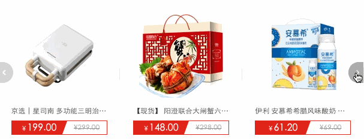


> 下面弹出的二维码也可以使用定位处理

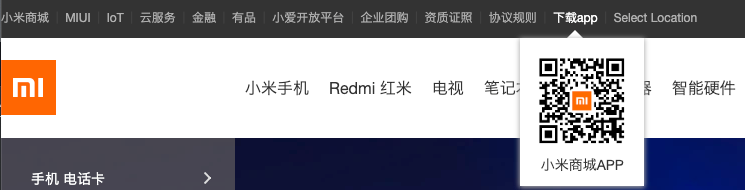

## 相对定位

相对定位是**相对于元素原来的位置**控制，当元素发生位置偏移时，**原位置留白。**

```html
<style type="text/css">
    p {
        width: 500px;
        margin: 50px auto;
    }
    img {
        position: relative;
        /* 距离顶部20px */
        top: 20px;
        /* 距离左边30px */
        left: 30px;
    }
</style>
<p>
    
    CSS 指层叠样式表 (Cascading Style Sheets)
    样式定义如何显示 HTML 元素
    样式通常存储在样式表中
</p>
```

> 效果

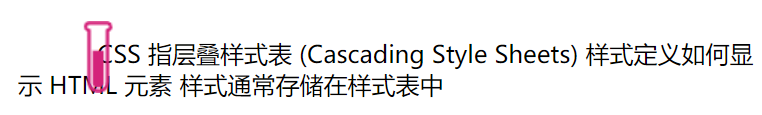

## 绝对定位

绝对定义不受文档流影响，就像漂浮在页面中的精灵，绝对定位元素拥有行内块特性。

### 参照元素

如果父级元素**设置了 `relative | fixed | sticky`** ，绝对定位子元素将参数此父元素进行定位

> 父级元素没有设置`relative | fixed | sticky`

```html
<style type="text/css">
    p {
        width: 300px;
        height: 300px;
        margin: 50px auto;
        border: 3px solid skyblue;
    }
    img {
        position: absolute;
        top: 0;
        left: 100px;
    }
</style>
<p>
    
</p>
```

> 效果：**因为父元素没有设置定位属性，则元素参照body进行定位**

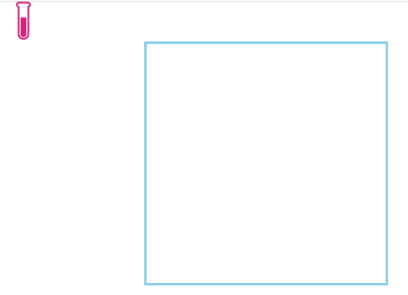

> 父元素设置定位属性后

```html
<style type="text/css">
    p {
        width: 300px;
        height: 300px;
        margin: 50px auto;
        border: 3px solid skyblue;
        /* 设置定位属性 */
        position: relative;
    }
    img {
        position: absolute;
        top: 0;
        left: 100px;
    }
</style>
<p>
    
</p>
```

> 效果

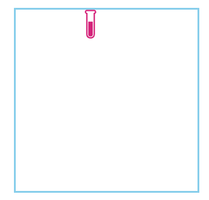

### 默认位置

> 如果**没有为定位元素设置偏移**，将**受父元素的padding等属性**影响。但使用定位一般都会设置偏移位置。

```html
<style type="text/css">
    p {
        width: 300px;
        height: 300px;
        margin: 50px auto;
        border: 3px solid skyblue;
        padding: 20px;
        /* 设置定位属性 */
        position: relative;
    }
    img {
        position: absolute;
        /* top: 0;
        left: 100px; */     
    }
</style>
<p>
    
</p>
```

> 效果

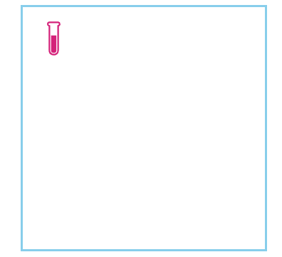

### 设置尺寸

> 如果设置了固定宽高，元素的尺寸不会发生改变

```html
<style type="text/css">
    * {
        margin: 0;
        padding: 0;
    }
    article {
        width: 300px;
        height: 300px;
        margin: 50px auto;
        border: 3px solid skyblue;
        padding: 10px;
        /* 设置定位属性 */
        position: relative;
    }
    div {
        /* 设置绝对布局 */
        position: absolute;
        width: 100px;
        height: 100px;
        top: 50px;
        left: 50px;
        border: 3px solid brown;
    }
</style>
</head>
<body>
    <article>
        <div></div>
    </article>
</body>
```


> 如果没设置宽高，大小会根据偏移动态变化

```html
<style type="text/css">
    * {
        margin: 0;
        padding: 0;
    }
    article {
        width: 300px;
        height: 300px;
        margin: 50px auto;
        border: 3px solid skyblue;
        padding: 10px;
        /* 设置定位属性 */
        position: relative;
    }
    div {
        /* 设置绝对布局 */
        position: absolute;
        /* 偏离顶部 */
        top: 10px;
        /* 偏离底部 */
        bottom: 10px;
        /* 偏离左部 */
        left: 100px;
        /* 偏离右部 */
        right: 0px;
        border: 3px solid brown;
    }
</style>
</head>
<body>
    <article>
        <div></div>
    </article>
</body>
```

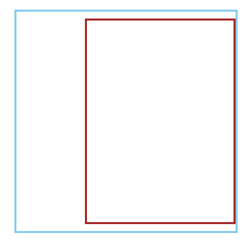

### 居中定位

> 第一种方式：[父元素宽度-当前元素宽度(包括边框)]/2

```html
<style type="text/css">
    * {
        margin: 0;
        padding: 0;
    }
    article {
        width: 200px;
        height: 200px;
        margin: 50px auto;
        border: 3px solid skyblue;
        /* 设置定位属性 */
        position: relative;
    }
    div {
        /* 设置绝对布局 */
        position: absolute;
        width: 100px;
        height: 100px;
        /* 水平居中 [200-(100+3)]/2=48*/
        left: 48px;
        /* 垂直居中 [200-(100+3)]/2=48*/
        top: 48px;
        border: 3px solid brown;
    }
</style>
</head>
<body>
    <article>
        <div></div>
    </article>
</body>
```

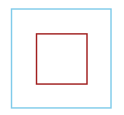

> 第二种方式：通过将 left 设置为50% ,并向左偏移子元素宽度一半可以实现水平居中，垂直居中使用方式类似。

```html
<style type="text/css">
    * {
        margin: 0;
        padding: 0;
    }
    article {
        width: 200px;
        height: 200px;
        margin: 50px auto;
        border: 4px solid skyblue;
        /* 设置定位属性 */
        position: relative;
    }
    div {
        /* 设置绝对布局 */
        position: absolute;
        width: 100px;
        height: 100px;
        left: 50%;
        top: 50%;
        margin-left: -54px;
        margin-top: -54px;
        border: 4px solid brown;
    }
</style>
</head>
<body>
    <article>
        <div></div>
    </article>
</body>
```

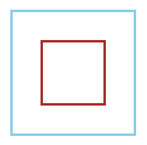

### 滚动行为

> 固定定位元素会随滚动条发生滚动。

```html
<style type="text/css">
    * {
        margin: 0;
        padding: 0;
    }
    main {
        width: 300px;
        height: 200px;
        margin: 50px;
        border: solid 3px skyblue;
        overflow: scroll;
    }
    article {
        height: 600px;
    }
    article div {
        width: 100px;
        height: 100px;
        background: saddlebrown;
    }
</style>
</head>
<body>
    <main>
        <article>
            <div></div>
        </article>
    </main>
</body>
```

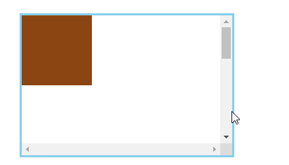


### 图标定位

> 有了绝对定位我们可以很方便的控制元素在任何位置的摆放。

```html
<style type="text/css">
    * {
        margin: 0;
        padding: 0;
    }
    main {
        margin: 50px;
    }
    main div {
        position: relative;
        width: 300px;
        /* BFC机制,即父元素的高度计算会包括浮动元素的高度 */
        overflow: hidden;
        border: solid 6px blueviolet;
    }
    img {
        width: 100%;
        /* 设置了浮动，并且父元素设置overflow: hidden */
        float: left;
    }
    span {
        /* 绝对定位 */
        position: absolute;
        width: 40px;
        height: 40px;
        text-align: center;
        line-height: 40px;
        background: blueviolet;
        color: white;
        border-radius: 50%;
        margin: 10px 0 0 10px;
    }
</style>
</head>
<body>
    <main>
        <div>
            <span>热</span>
            
        </div>
    </main>
</body>
```

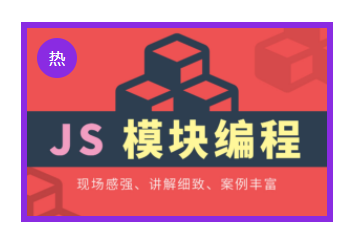

## 纵向重叠

如果元素重叠在一起，可以使用 `z-index` 控制元素的上下层级，数值越大越在上面。

父级子元素设置 `z-index` 没有意义，子元素永远在父元素上面的。

### 改变层级

```html
<style type="text/css">
    * {
        margin: 0;
        padding: 0;
    }
    article {
        position: relative;
        width: 200px;
        height: 200px;
        margin: 50px;
        border: 5px solid blueviolet;
    }
    div {
        width: 200px;
        height: 200px;
        position: absolute;
    }
    /* 默认层级 */
    article div:nth-of-type(1) {
        background: #666666;
    }
    article div:nth-of-type(2) {
        background: #CC9999;
    }
    /* 鼠标移上去后改变层级 */
    article:hover div:nth-of-type(1) {
        z-index: 666;
    }
</style>
</head>
<body>
    <article>
        <div></div>
        <div></div>
    </article>
</body>
```

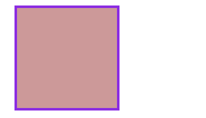

### 购物车

因为事件捕获特性（请在JS系统课程了解）所要以把父级的 `z-index` 放在最下面。

```html
<style type="text/css">
    * {
        margin: 0;
        padding: 0;
    }
    main {
        width: 600px;
        padding: 100px;
        margin: 0 auto;
    }
    main article {
        width: 150px;
        position: relative;
        cursor: pointer;
        font-size: 14px;
        color: #555;
        /* border: solid 2px blueviolet; */
    }
    main article:hover div:nth-of-type(1) {
        /* 当点击时设计第一个div下边线不显示 */
        border-bottom: none;
    }
    main article:hover div:nth-of-type(2) {
        display: block;
    }
    main article div {
        box-sizing: border-box;
        height: 50px;
        line-height: 3.5em;
        text-align: center;
        border: solid 2px blueviolet;
        background: white;
    }
    main article div:nth-of-type(1) {
        /* 子元素设置相对定位会撑开父元素 */
        position: relative;
        /* 设置第一div高于第二个div来覆盖边框线 */
        z-index: 2;
    }
    main article div:nth-of-type(2) {
        display: none;
        /* 绝对定位不会撑开父元素 */
        position: absolute;
        right: 0;
        top: 48px;
        left: -150px;
        z-index: 1;
    }
</style>
</head>
<body>
    <main>
        <article>
            <div>我的购物车</div>
            <div>购物车中暂无产品</div>
        </article>
    </main>
</body>
```


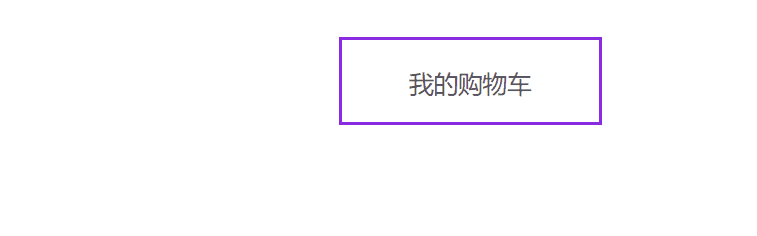

## 固定定位

元素相对于页面固定定位在某个位置，固定定位元素不会在滚动时改变位置 ，使用`position: fixed` 产生固定定位。

```html
<style type="text/css">
    * {
        margin: 0;
        padding: 0;
    }
    header {
        height: 60px;
        border-bottom: solid 5px #7f35c9;
        box-shadow: 0 5px 8px rgba(100, 100, 100, 0.6);
        position: fixed;
        top: 0px;
        left: 0px;
        right: 0px;
    }
    article {
        height: 3000px;
        margin-top: 80px;
        background: #f3f3f3;
        border: solid 5px #ddd;
    }
</style>
</head>
<body>
    <header></header>
    <article></article>
</body>
```

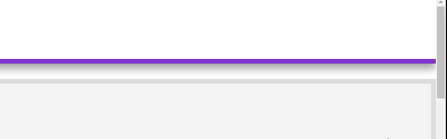


## 粘性定位

### 同级定位

```html
<style type="text/css">
    * {
        margin: 0;
        padding: 0;
    }
    article {
        width: 200px;
        height: 200px;
        margin: 50px;
        border: solid 5px #ddd;
        overflow: scroll;
    }
    h2 {
        /* 设置粘性布局 */
        position: sticky;
        /* 黏住的位置 */
        top: 0px;
        background: #7F35C9;
        color: white;
    }
    h2:nth-of-type(2n) {
        background: red;
    }
    section {
        height: 300px;
    }
</style>
</head>
<body>
    <article>
        <h2>百度</h2>
        <section></section>
        <h2>淘宝</h2>
        <section></section>
        <h2>腾讯</h2>
        <section></section>
        <h2>京东</h2>
        <section></section>
    </article>
</body>
```

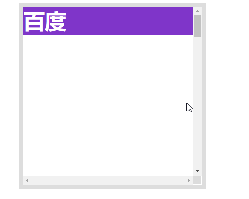

### 非同级定位

不属于同一个父元素设置粘性定位时，后面的元素挤掉原来位置的元素

```html
<style type="text/css">
    * {
        margin: 0;
        padding: 0;
    }
    article {
        width: 300px;
        height: 200px;
        margin: 50px;
        border: solid 5px #ddd;
        overflow: scroll;
    }
    h2 {
        /* 设置粘性布局 */
        position: sticky;
        /* 黏住的位置 */
        top: 0px;
        background: #7F35C9;
        color: white;
    }
    h2:nth-of-type(2n) {
        background: red;
    }
    section {
        height: 300px;
    }
</style>
</head>
<body>
    <article>
        <section>
            <h2>hdcms.com</h2>
            <p>
                后盾人自2010年创立至今，免费发布了大量高质量视频教程，视频在优酷、土豆、酷六等视频网站均有收录，很多技术爱好者受益其中。除了免费视频外，后盾人还为大家提供了面授班、远程班、公益公开课、VIP系列课程等众多形式的学习途径。后盾人有一群认真执着的老师，他们一心为同学着想，将真正的知识传授给大家是后盾人永远不变的追求。
            </p>
        </section>
        <section>
            <h2>后盾人</h2>
            <p>
                后盾人隶属于北京后盾计算机技术培训有限责任公司，是专注于培养中国互联网精英PHP程序语言专业人才的专业型培训机构，拥有七年培训行业经验。后盾人拥有国内一线的讲师和技术团队，团队成员项目经验均在8年以上，团队曾多次为国内外上市集团、政府机关的大型项目提供技术支持，其中包括新浪、搜狐、腾讯、宝洁公司、联想、丰田、工商银行、中国一汽等众多大众所熟知的知名企业。
            </p>
        </section>
        <section>
            <h2>houdunwang.com</h2>
            <p>
                后盾人自2010年创立至今，免费发布了大量高质量视频教程，视频在优酷、土豆、酷六等视频网站均有收录，很多技术爱好者受益其中。除了免费视频外，后盾人还为大家提供了面授班、远程班、公益公开课、VIP系列课程等众多形式的学习途径。后盾人有一群认真执着的老师，他们一心为同学着想，将真正的知识传授给大家是后盾人永远不变的追求。
            </p>
        </section>
    </article>
</body>
```

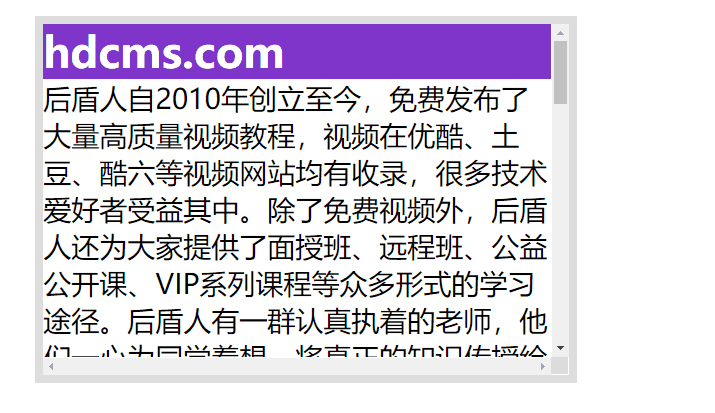