## 弹性盒子

### 声明定义

flex-direction :设置主轴的方向justify-content :设置主轴上的子元素排列方法

flex-wrap:设置子元素是否换行

align-items :设置侧轴上的子元素排列方式(单行)

align-content :设置侧轴上的子元素的排列方式(多行)

flex-flow :复合属性，相当于同时设置了flex-direction和flex-wrap

容器盒子里面包含着容器元素，使用 `display:flex` 或 `display:inline-flex` 声明为弹性盒子。

> 声明块级弹性盒子

```html
<style type="text/css">
    * {
        margin: 0;
        padding: 0;
    }
    article {
        height: 150px;
        width: 900px;
        margin: 100px;
        padding: 10px;
        border: 3px solid blueviolet;
        /* 弹性布局 */
        display: flex;
    }
    article div {
        width: 150px;
        height: 100%;
        box-sizing: border-box;
        border: 3px solid skyblue;
    }
</style>
</head>
<body>
    <article>
        <div>1</div>
        <div>2</div>
        <div>3</div>
    </article>
</body>
```


声明内联盒子模型

```css
display: inline-flex;
```

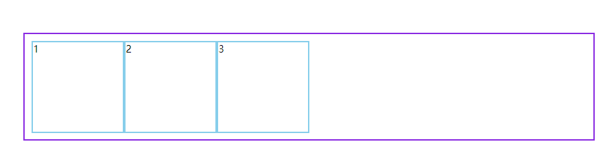

### 设置主轴方向

用于控制盒子元素排列的方向。

| 值             | 描述                           |
| -------------- | ------------------------------ |
| row            | 从左到右水平排列元素（默认值） |
| row-reverse    | 从右向左排列元素               |
| column         | 从上到下垂直排列元素           |
| column-reverse | 从下到上垂直排列元素           |

从右向左排列元素

```html
<style type="text/css">
    * {
        margin: 0;
        padding: 0;
    }
    article {
        height: 150px;
        width: 900px;
        margin: 100px;
        padding: 10px;
        border: 3px solid blueviolet;
        /* 弹性布局 */
        display: inline-flex;
        /* 设置主轴排列方向 */
        flex-direction: row-reverse;
    }
    article div {
        width: 150px;
        height: 100%;
        box-sizing: border-box;
        border: 3px solid skyblue;
    }
</style>
</head>
<body>
    <article>
        <div>1</div>
        <div>2</div>
        <div>3</div>
    </article>
</body>
```

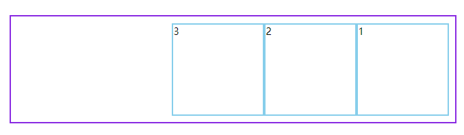

从下向上排列

```html
<style type="text/css">
    * {
        margin: 0;
        padding: 0;
    }
    article {
        height: 150px;
        width: 900px;
        margin: 100px;
        padding: 10px;
        border: 3px solid blueviolet;
        /* 弹性布局 */
        display: inline-flex;
        /* 设置主轴排列方向 */
        flex-direction: column-reverse;
    }
    article div {
        width: 150px;
        height: 100%;
        box-sizing: border-box;
        border: 3px solid skyblue;
    }
</style>
</head>
<body>
    <article>
        <div>1</div>
        <div>2</div>
        <div>3</div>
    </article>
</body>
```


### 设置子元素是否换行

flex-wrap 属性规定flex容器是单行或者多行，同时横轴的方向决定了新行堆叠的方向。

| 选项         | 说明                                             |
| ------------ | ------------------------------------------------ |
| nowrap       | 元素不拆行或不拆列（默认值）                     |
| wrap         | 容器元素在必要的时候拆行或拆列。                 |
| wrap-reverse | 容器元素在必要的时候拆行或拆列，但是以相反的顺序 |

**行元素换行**

> 默认不换行，元素宽度会被挤压

```html
<style type="text/css">
    * {
        margin: 0;
        padding: 0;
    }
    article {
        height: 400px;
        width: 300px;
        margin: 100px;
        padding: 10px;
        border: 3px solid blueviolet;
        /* 弹性布局 */
        display: flex;
        /* 设置主轴排列方向 */
        flex-direction: row;
        /* 设置是否换行:默认不换行,元素宽度会被挤压 */
        flex-wrap: nowrap;
    }
    article div {
        width: 150px;
        height: 150px;
        box-sizing: border-box;
        border: 3px solid skyblue;
    }
</style>
</head>
<body>
    <article>
        <div>1</div>
        <div>2</div>
        <div>3</div>
    </article>
</body>
```

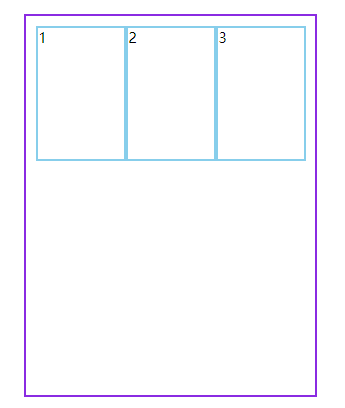

> 换行

```css
/* 设置换行*/
flex-wrap: wrap;
```


> 反向换行

```css
flex-wrap: wrap-reverse;
```

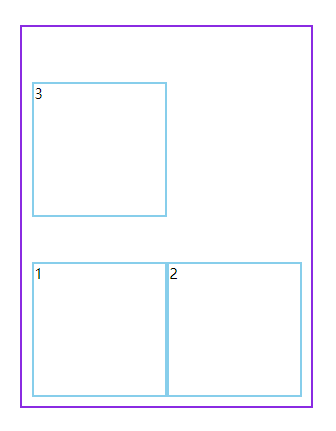

**垂直元素换行**

> 普通换行

```css
/* 设置排列方向 */
flex-direction: column;
/* 设置换行*/
flex-wrap: wrap;
```

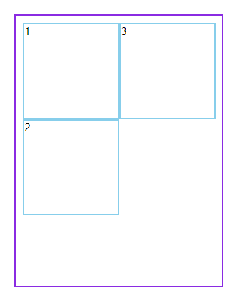

> 垂直反向换行

```css
/* 弹性布局 */
display: flex;
/* 设置排列方向 */
flex-direction: column;
/* 设置换行*/
flex-wrap: wrap-reverse;
```

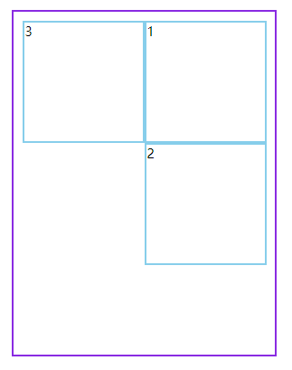

### 复合属性

`flex-flow` 是 `flex-direction` 与 `flex-wrap` 的组合简写模式。

**下面是从右向左排列，换行向上拆分行。**

```css
flex-flow: row-reverse wrap-reverse;
```


### 轴说明

**水平排列**

下面是使用 `flex-flow: row wrap` 的主轴与交叉轴说明。

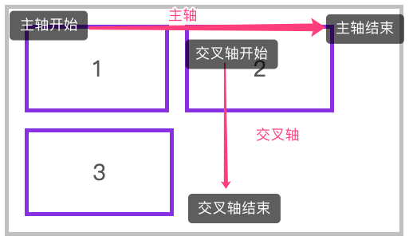

下面是使用 `flex-flow: row-reverse wrap-reverse` 的主轴与交叉轴说明。

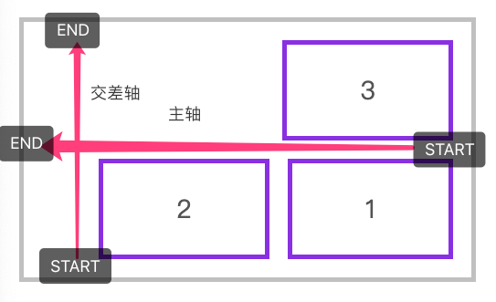

**垂直排列**

下面是使用 `flex-flow: column wrap` 的主轴与交叉轴说明。

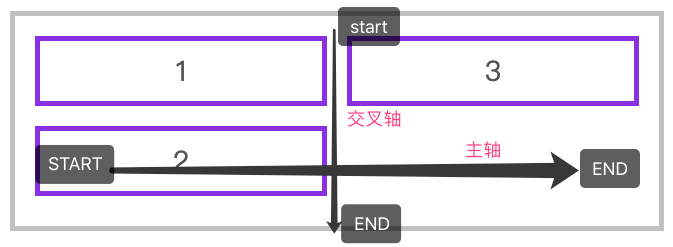

### 主轴排列方式

用于控制元素在主轴上的排列方式，再次强调是主轴的排列方式。

| 选项          | 说明                                                         |
| ------------- | ------------------------------------------------------------ |
| flex-start    | 元素紧靠主轴起点                                             |
| flex-end      | 元素紧靠主轴终点                                             |
| center        | 元素从弹性容器中心开始                                       |
| space-between | 第一个元素靠起点，最后一个元素靠终点，余下元素平均分配空间   |
| space-around  | 每个元素两侧的间隔相等。所以，元素之间的间隔比元素与容器的边距的间隔大一倍 |
| space-evenly  | 元素间距离平均分配                                           |

水平排列元素，并使用 `justify-content: flex-end` 对齐到主轴终点

```html
<style type="text/css">
    * {
        margin: 0;
        padding: 0;
    }
    article {
        height: 150px;
        width: 500px;
        margin: 100px;
        padding: 10px;
        border: 3px solid blueviolet;
        /* 弹性布局 */
        display: flex;
        /* 设置主轴排列方式 */
        justify-content: flex-end;
    }
    article div {
        width: 150px;
        height: 150px;
        box-sizing: border-box;
        border: 3px solid skyblue;
    }
</style>
</head>
<body>
    <article>
        <div>1</div>
        <div>2</div>
        <div>3</div>
    </article>
</body>
```

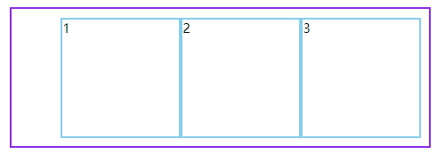

> 对齐主轴到起点，默认

```css
justify-content: flex-start;
```

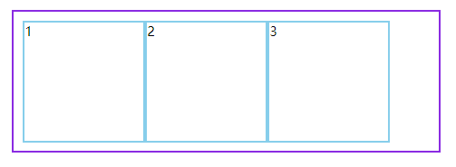

> 对齐主轴到终点

```css
justify-content: center;
```

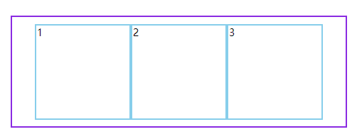

> 左右靠边，其他平均分配，如果有内边距会留出内边距

```css
padding: 0px;
justify-content: space-between;
```

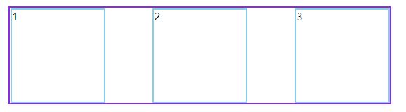

> 有内边距情况

```css
padding: 10px;
justify-content: space-between;
```

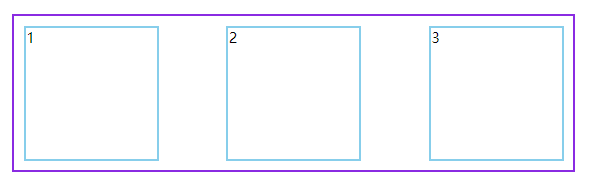

> 每个元素两侧的间隔相等。

```css
padding: 0px;
justify-content: space-around;
```

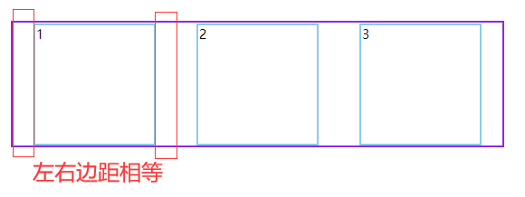

> 元素之间水平分配

```css
justify-content: space-evenly;
```

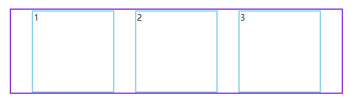

### 侧轴子元素排列方式(单行)

- align-item是控制元素在行上的排列
- align-content是控制行在交差轴上的排列

**align-items**

用于控制容器元素在侧轴上的排列方式。

| 选项       | 说明                           |
| ---------- | ------------------------------ |
| stretch    | 元素被拉伸以适应容器（默认值） |
| center     | 元素位于容器的中心             |
| flex-start | 元素位于容器的交叉轴开头       |
| flex-end   | 元素位于容器的交叉轴结尾       |

**拉伸适应侧轴**

如果设置了 `width | height | min-height | min-width | max-width | max-height` ，将影响`stretch` 的结果，因为 `stretch` 优先级你于宽高设置。

> 元素被拉伸适应容器，注意不能设置宽高

```html
<style type="text/css">
    * {
        margin: 0;
        padding: 0;
    }
    article {
        height: 200px;
        width: 600px;
        margin: 100px;
        padding: 0px;
        border: 3px solid blueviolet;
        /* 弹性布局 */
        display: flex;
        /* 设置主轴排列方式 */
        justify-content: space-evenly;
        /* 交叉轴排列方式 默认拉伸*/
        align-items: stretch;
    }
    article div {
        width: 150px;
        box-sizing: border-box;
        border: 3px solid skyblue;
    }
</style>
</head>
<body>
    <article>
        <div>1</div>
        <div>2</div>
        <div>3</div>
    </article>
</body>
```


> 对齐到侧轴顶部

```css
article {
align-items: flex-start;
}
article div {
width: 150px;
height: 100px;
border: 3px solid skyblue;
}
```

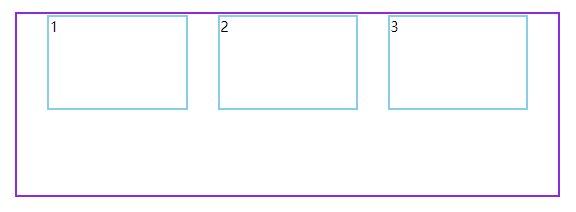

> 对齐到侧轴底部

```css
align-items: flex-end;
```

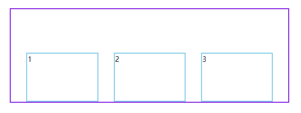

> 对齐到交叉轴中心

```css
align-items: center;
```

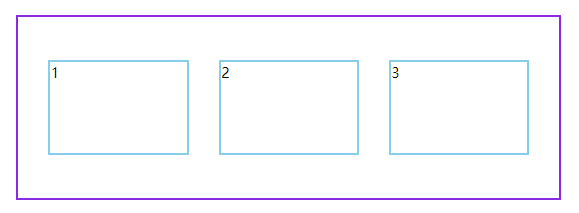

### 侧轴子元素排列方式(多行)

**align-content**

只适用于多行显示的弹性容器，用于控制行（而不是元素）在交叉轴上的排列方式。

| 选项          | 说明                                                         |
| ------------- | ------------------------------------------------------------ |
| stretch       | 将空间平均分配给元素                                         |
| flex-start    | 元素紧靠主轴起点                                             |
| flex-end      | 元素紧靠主轴终点                                             |
| center        | 元素从弹性容器中心开始                                       |
| space-between | 第一个元素靠起点，最后一个元素靠终点，余下元素平均分配空间   |
| space-around  | 每个元素两侧的间隔相等。所以，项目之间的间隔比项目与边框的间隔大一倍 |
| space-evenly  | 元素间距离平均分配                                           |

> 侧轴方向顶部对齐

```css
/* 弹性布局 */
display: flex;
/* 设置主轴排列方式 */
flex-direction: row;
/* 设置主轴换行 */
flex-wrap: wrap;
/* 设置多行排列方式align-content */
align-content: flex-start;
```

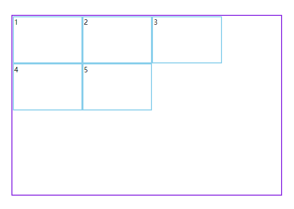

> 侧轴方向底部对齐

```css
/* 弹性布局 */
display: flex;
/* 设置主轴排列方式 */
flex-direction: row;
/* 设置主轴换行 */
flex-wrap: wrap;
/* 设置多行排列方式align-content */
align-content: flex-end;
```

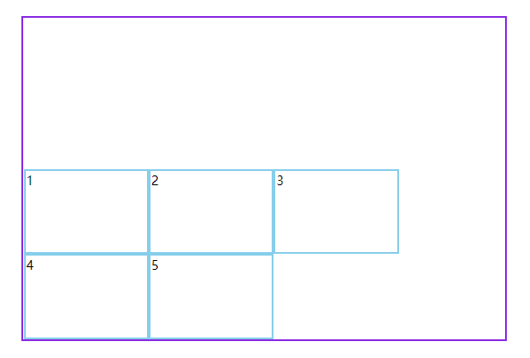

> 侧轴方向居中对齐

```css
/* 弹性布局 */
display: flex;
/* 设置主轴排列方式 */
flex-direction: row;
/* 设置主轴换行 */
flex-wrap: wrap;
/* 设置多行排列方式align-content */
align-content: center;
```

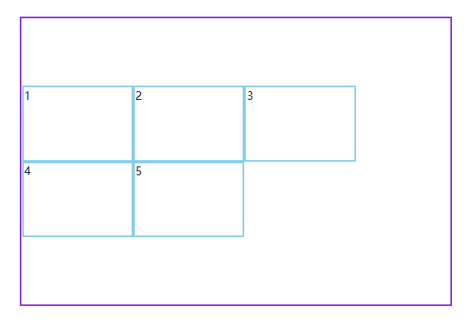

> 左右(上下)靠边其他平均分配--根据主轴方向确定

```css
/* 弹性布局 */
display: flex;
/* 设置主轴排列方式 */
flex-direction: row;
/* 设置主轴换行 */
flex-wrap: wrap;
/* 设置多行排列方式align-content */
align-content: space-between;
```

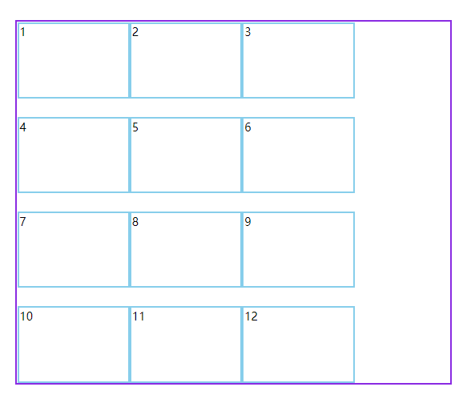

> 上下(左右)平均间隔---根据主轴方向确定

```css
/* 设置主轴换行 */
flex-wrap: wrap;
align-content: space-around;
```

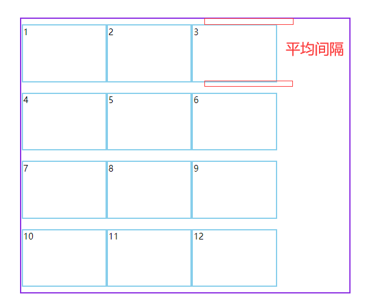

> 元素间距离平均分配

```css
/* 设置主轴换行 */
flex-wrap: wrap;
align-content: space-evenly;
```

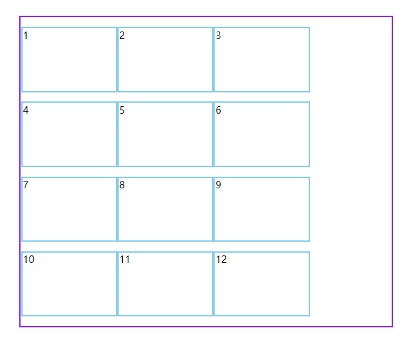

> 空间平均分配给元素（默认）

```css
/* 设置主轴换行 */
flex-wrap: wrap;
align-content: stretch;
```

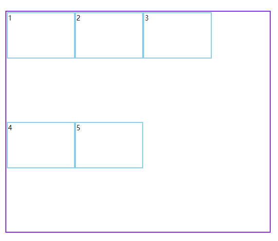

## 子项属性

### flex属性

flex属性定义子项目分配**剩余空间**，用flex来表示占多少**份数**

> 二号盒子分配剩余空间，中间能够自适应

```html
<style type="text/css">
    article {
        height: 200px;
        width: 800px;
        margin: 100px;
        border: 3px solid blueviolet;
        /* 弹性布局 */
        display: flex;
        /* 设置主轴排列方式 */
        flex-direction: row;
    }
    article div:nth-child(1) {
        width: 150px;
        border: 3px solid skyblue;
    }
    article div:nth-child(3) {
        width: 150px;
        border: 3px solid skyblue;
    }
    article div:nth-child(2) {
        /* 分配剩余空间 */
        flex: 1;
        border: 3px solid skyblue;
    }
</style>
</head>
<body>
    <article>
        <div>1</div>
        <div>2</div>
        <div>3</div>
    </article>
</body>
```

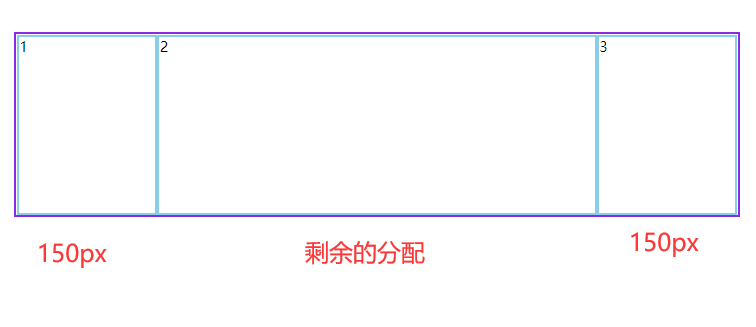

> 平均分配空间，每个占一份

```html
<style type="text/css">
    article {
        height: 200px;
        width: 800px;
        margin: 100px;
        border: 3px solid blueviolet;
        /* 弹性布局 */
        display: flex;
        /* 设置主轴排列方式 */
        flex-direction: row;
    }
    article div {
        /* 每个占一份 */
        flex: 1;
        border: 3px solid skyblue;
    }
</style>
</head>
<body>
    <article>
        <div>1</div>
        <div>2</div>
        <div>3</div>
    </article>
</body>
```


> 第一个盒子占两份

```html
<style type="text/css">
    article {
        height: 200px;
        width: 800px;
        margin: 100px;
        border: 3px solid blueviolet;
        /* 弹性布局 */
        display: flex;
        /* 设置主轴排列方式 */
        flex-direction: row;
    }
    article div {
        /* 每个占一份 */
        flex: 1;
        border: 3px solid skyblue;
    }
    article div:nth-child(1){
        /* 第一个占两份 */
        flex: 2;
        border: 3px solid skyblue;
    }
</style>
</head>
<body>
    <article>
        <div>1</div>
        <div>2</div>
        <div>3</div>
    </article>
</body>
```

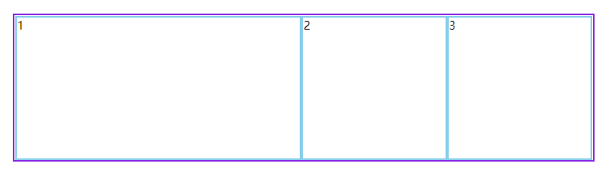

### align-self

align-self属性允许单个项目有与其他项目不一样的对齐方式，可覆盖align-items属性。

默认值为auto,表示继承父元素的align-items属性，如果没有父属性，则等同stretch

| 选项       | 说明                   |
| ---------- | ---------------------- |
| stretch    | 将空间平均分配给元素   |
| flex-start | 元素紧靠主轴起点       |
| flex-end   | 元素紧靠主轴终点       |
| center     | 元素从弹性容器中心开始 |

> 设置第三个和在侧轴上底部对齐

```html
<style type="text/css">
    article {
        height: 400px;
        width: 800px;
        margin: 100px;
        border: 3px solid blueviolet;
        /* 弹性布局 */
        display: flex;
        /* 设置主轴排列方式 */
        flex-direction: row;
    }
    article div {
        /* 每个占一份 */
        flex: 1;
        height: 150px;
        border: 3px solid skyblue;
    }
    article div:nth-child(3) {
        /* 脱离组织，在侧轴上底部对齐 */
        align-self: flex-end;
    }
</style>
</head>
<body>
    <article>
        <div>1</div>
        <div>2</div>
        <div>3</div>
    </article>
</body>
```

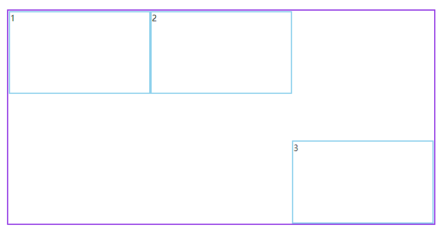

### order

用于控制弹性元素的位置，默认为 `order:0` 数值越小越在前面，可以负数或整数。

> 调换1和2号盒子顺序

```html
<style type="text/css">
    article {
        height: 400px;
        width: 800px;
        margin: 100px;
        border: 3px solid blueviolet;
        /* 弹性布局 */
        display: flex;
        /* 设置主轴排列方式 */
        flex-direction: row;
    }
    article div {
        /* 每个占一份 */
        flex: 1;
        height: 150px;
        border: 3px solid skyblue;
    }
    article div:nth-child(2) {
        /* 将2号盒子放到1号盒子前面 */
        order: -1;
    }
</style>
</head>
<body>
    <article>
        <div>1</div>
        <div>2</div>
        <div>3</div>
    </article>
</body>
```

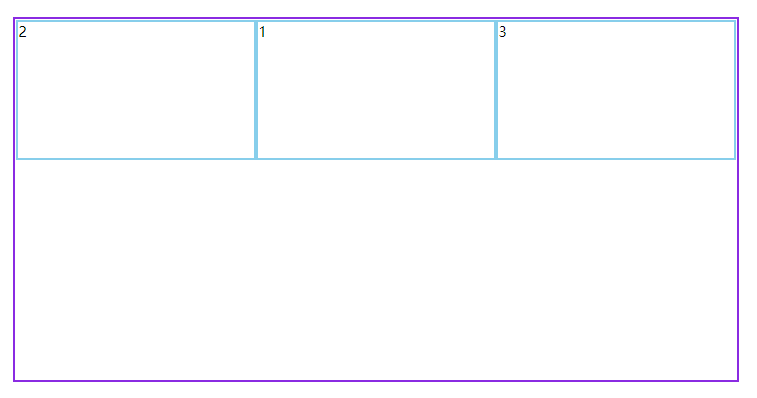