## 字体基础

### 字体设置

```css
font-family: 'Courier New', Courier, monospace;
```

### 字重定义

取值范围 `normal | bold | bolder | lighter | 100 ~900`。

```css
font-weight: bold;
```

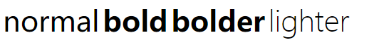

### 文本字号

字号用于控制字符的显示大小，包括 `xx-small | x-small | small | meidum | large | x-large | xx-large`。

```css
font-size: xx-small;
```

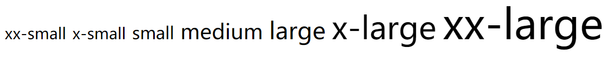

**百分数**

百分数是子元素相对于父元素的大小，如父元素是20px，子元素设置为 200%即为你元素的两倍大小。

```html
<style>
  article {
    font-size: 20px;
  }
  span {
    font-size: 500%;
  }
</style>
```

**em**

em单位等同于百分数单位。

```html
<style>
  article {
    font-size: 20px;
  }
  span {
    font-size: 5em;
  }
</style>
```

### 文本颜色

```css
color:red;
color:#ddffde
color:rgb(38, 149, 162);
/*.2透明度*/
/*透明色从 0~1 间，表示从透明到不透明*/
color:rgba(38, 149, 162,.2);
```

### 行高定义

```css
line-height: 2em;
```

### 倾斜风格

```css
font-style: italic;
```

## 文本样式

### 大小转换

小号大写字母

```css
font-variant: small-caps
```

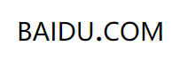

字母大小写转换

```css
/* 首字母大写*/
  text-transform: capitalize;
  /* 全部大写*/
  text-transform: uppercase;
  /* 全部小写 */
  text-transform: lowercase;
```

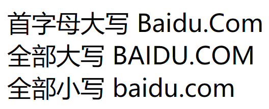

### 文本线条

```css
/* 无线条 */
text-decoration: none;
/* 下划线 */
text-decoration: underline;
/* 删除线 */
text-decoration: line-through;
/* 上划线 */
text-decoration: overline;
```

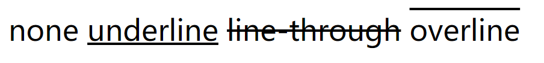

### 阴影控制

参数顺序为：颜色，水平偏移，垂直偏移，模糊度。

```css
text-shadow: rgba(13, 6, 89, 0.8) 3px 3px 5px;
```

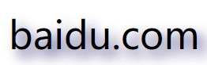

### 空白处理

使用 `white-space` 控制文本空白显示。

| 选项     | 说明                                    |
| -------- | --------------------------------------- |
| pre      | 保留文本中的所有空白，类似使用 pre 标签 |
| nowrap   | 禁止文本换行                            |
| pre-wrap | 保留空白，保留换行符                    |
| pre-line | 空白合并，保留换行符                    |

```css
white-space: pre;
<span>bai du.  com</span>
```

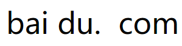

### 文本溢出

**单行文本**

```css
/* 1.设置宽度 */
width: 200px;
/* 2.设置不换行 */
white-space: nowrap;
/* 3.超出隐藏 */
overflow: hidden;
/* 4.超出部分... */
text-overflow: ellipsis;
```

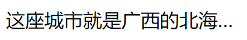

**多行文本**

```css
/* 1.设置宽度 */
width: 200px;
/* 2.超出隐藏 */
overflow: hidden;
/* 3.超出部分... */
display: -webkit-box;
-webkit-box-orient: vertical;
/* 显示几行 */
-webkit-line-clamp: 2;
```

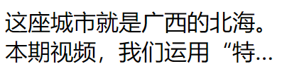

## 段落控制

### 文本缩进

控制元素部的文本、图片进行缩进操作

```css
text-indent: 2em;
```

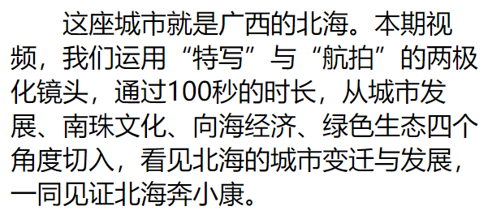

### 水平对齐

使用 `left|right|center` 对文本进行对齐操作

```css
text-align: center;
```

### 垂直对齐

使用 `vertical-align` 用于定义内容的垂直对齐风格，包括`middle | baseline | sub | super` 等。

```css
<style>
    img{
       width: 100px;
       vertical-align: middle;
    }
    span{
        font-size: 50px;
    }
</style>
<body>
<div>
    
    <span>参照</span>
</div>
</body>
```

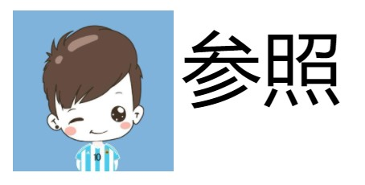

```css
vertical-align: baseline;
```

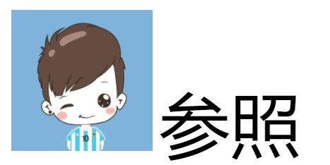

### 字符间隔

```css
word-spacing: 2em;
```

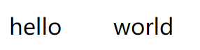

 

```css
letter-spacing: 0.5em;
```

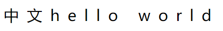

### 排版模式

| 模式          | 说明                                     |
| ------------- | ---------------------------------------- |
| horizontal-tb | 水平方向自上而下的书写方式               |
| vertical-rl   | 垂直方向自右而左的书写方式               |
| vertical-lr   | 垂直方向内内容从上到下，水平方向从左到右 |

```css
writing-mode: vertical-rl;
```

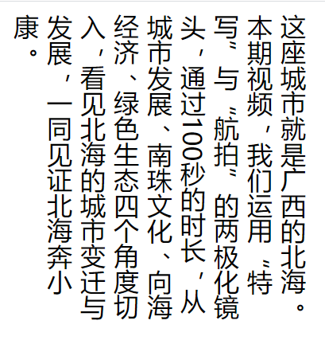