# 背景样式

## 背景颜色

> 背景颜色可以使用 `rga | rgba | 十六进制` 等颜色格式

```css
div {
height:100px;
width: 300px;
background-color: rgba(255,0,0,0.3);
}
```

> 运行效果

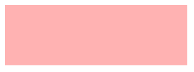

## 背景图片

> 可以使用 `png| gif |jpeg` 等图片做为背景使用

```css
background-image: url(1.jpg);
```

> 运行效果


## 背景裁切

| 选项        | 说明                 |
| ----------- | -------------------- |
| border-box  | 包括边框             |
| padding-box | 不含边框，包括内边距 |
| content-box | 内容区域             |

> 背景剪裁 background-clip

```html
<style type="text/css">
    div {
        height: 100px;
        width: 100px;
        text-align: center;
        line-height: 100px
        background-color: rgba(255, 0, 0, 0.3);
        /* 内边距 */
        padding: 10px;
        /* 边框 */
        border: 5px solid #ddd;
        /* 内容区域剪裁 */
        background-clip: content-box;
        /* 内边距剪裁 */
        background-clip: padding-box;
        /* 边框区域剪裁 */
        background-clip: border-box;
    }
</style>
```

> 边框剪裁需要设置点线`border: 5px dashed #ddd;`

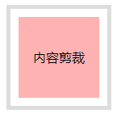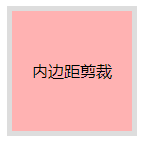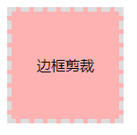

## 背景重复

用于设置背景重复的规则

| 选项      | 说明                 |
| --------- | -------------------- |
| repeat    | 水平、垂直重复       |
| repeat-x  | 水平重复             |
| repeat-y  | 垂直重复             |
| no-repeat | 不重复               |
| space     | 背景图片对称均匀分布 |

> 水平、垂直重复

```css
div {
height:300px;
width: 500px;
border: 5px solid #ddd;
background-image: url(2.png);
/* background-repeat: repeat; */
/* 水平重复 */
background-repeat: repeat-x;    
/* 垂直重复 */
background-repeat: repeat-y;
}
```

> 效果

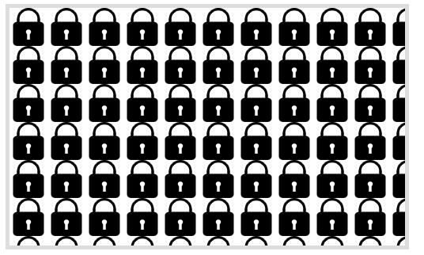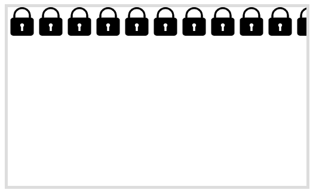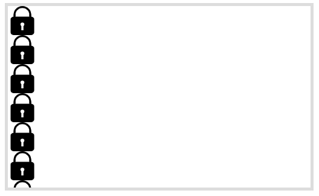

> 不重复和平均分配

```css
/* 不重复 */
background-repeat: no-repeat;
/* 平均分配 */
background-repeat: space;
```

> 平均分配会**保证图片不出现一半的情况**

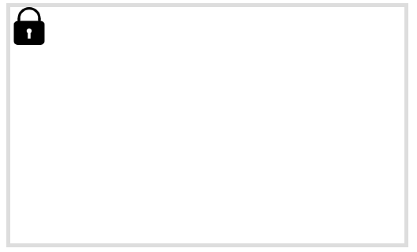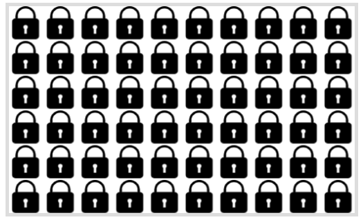

## 背景滚动

用于设置在页面滚动时的图片处理方式

| 选项   | 说明     |
| ------ | -------- |
| scroll | 背景滚动 |
| fixed  | 背景固定 |

```html
<style type="text/css">
    body>div {
        height: 300px;
        overflow: auto;
    }
    body>div>div {
        height: 500px;
        width: 500px;
        border: 5px solid #ddd;
        background-image: url(2.png);
        /* 滚动默认 */
        background-attachment: scroll;
        /* 固定，可用作文章固定背景 */
        background-attachment: fixed;
    }
</style>
<div>
    <div></div>
</div>
```

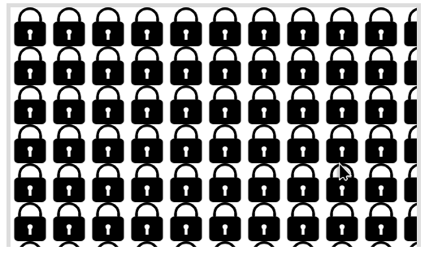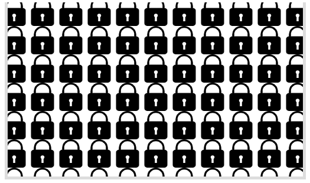

## 背景位置

用于设置背景图片的水平、垂直定位。

| 选项   | 说明     |
| ------ | -------- |
| left   | 左对齐   |
| right  | 右对齐   |
| center | 居中对齐 |
| top    | 顶端对齐 |
| bottom | 底部对齐 |

> 单个使用

```html
<style type="text/css">
    div {
        height: 200px;
        width: 200px;
        border: 5px solid #ddd;
        background-image: url(2.png);
        background-repeat: no-repeat;
        /* 左 */
        background-position: left;
        /* 右 */
        background-position: right;
        /* 上 */
        background-position: top;
        /* 下 */
        background-position: bottom;
        /* 中 */
        background-position: center;
    }
</style>
```

> 依次是左，右，上，下，中

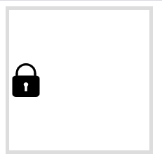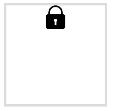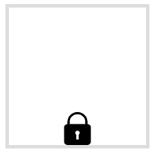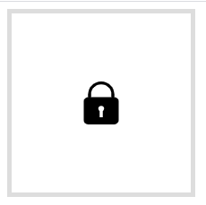

> 组合使用

```css
background-position: left top;
background-position: right bottom;
```

> 左上、右下

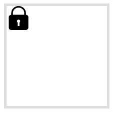

> 支持数值和百分比

```css
/* 百分比 */
background-position: 50% 20%;
/* 数值 */
background-position: 30px 50px;
```

> 效果左：百分比，有数值

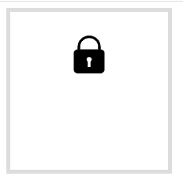

## 背景尺寸

> 支持数值和百分比设置

| 选项    | 说明                                       |
| ------- | ------------------------------------------ |
| cover   | 背景完全覆盖，可能会有背景溢出             |
| contain | 图片不溢出的放在容器中，可能会漏出部分区域 |

> 图片不溢出的放在容器中

```html
<style type="text/css">
    div {
        height: 300px;
        width: 500px;
        border: 5px solid #ddd;
        background-image: url(3.jpg);
        background-repeat: no-repeat;
        /* 不溢出的放在容器中 */
        background-size: contain;
    }
</style>
```

> 效果

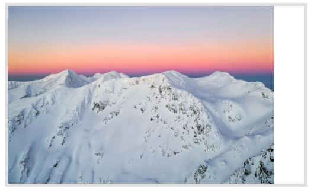

> 背景完全覆盖

```html
<style type="text/css">
    div {
        height: 300px;
        width: 500px;
        border: 5px solid #ddd;
        background-image: url(3.jpg);
        background-repeat: no-repeat;
        /* 填满整个容器 */
        background-size: cover;
    }
</style>
```

> 效果

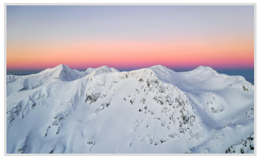

## 多个背景

> 后定义的背景置于底层

```html
<style type="text/css">
    div {
        height: 300px;
        width: 500px;
        border: 5px solid #ddd;
        /* 多背景设置 */
        background-image: url(2.png), url(7.png);
        background-repeat: no-repeat;
    }
</style>
```

> 7在下面2在上面

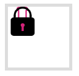

> 多属性定义

```html
<style type="text/css">
    div {
        height: 100px;
        width: 100px;
        border: 5px solid #ddd;
        /* 多背景设置 */
        background-image: url(2.png), url(7.png);
        /* 只有一个值的时候作用所有图片 */
        background-repeat: no-repeat;
        /* 设置图片位置 */
        background-position: left top, right bottom;
    }
</style>
```

> 多张图片设置用逗号隔开，**background-repeat只有一个值时作用所有背景图片**

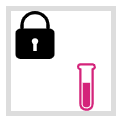

## 组合设置

> 可以使用一条指令设置背景--设置一张图片 注：**无先后顺序**

```css
/* 一条语句设置无先后顺序 */
background:skyblue url(2.png) top left no-repeat;
```

> 效果


> 设置多个用逗号隔开

```css
background:url(2.png) top left no-repeat,url(7.png) no-repeat bottom right;
```

> 效果

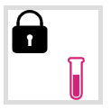

# 盒子阴影

> 可以使用 `box-shadow` 对盒子元素设置阴影，参数为 **水平偏移,垂直偏移,模糊度,颜色**构成。

```css
/* 水平偏移,垂直偏移,模糊度,颜色*/
box-shadow:7px 7px 5px rgba(100,100,100,0.5) ;
```

> 效果

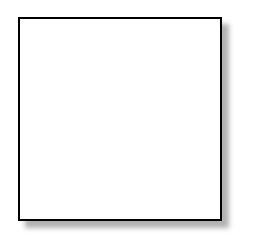

# 颜色渐变

## 线性渐变

> 渐变一般用在背景颜色中使用，**可以设置多个颜色用逗号隔开**

```css
div {
height:200px;
width: 200px;
margin: 100px;
border: 3px solid #ddd;
/* 线性渐变 */
background: linear-gradient(#FFEFD5,#FF6A6A,#00F5FF);
}
```

> 效果

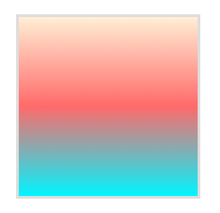

> 渐变角度deg：**可以为负数，正顺时针，负逆时针**

```css
background: linear-gradient(30deg,#FFEFD5,#FF6A6A,#00F5FF);
```

> 效果

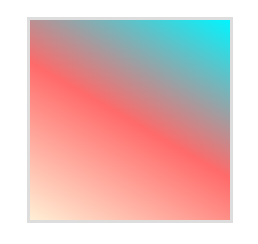

> 设置渐变方向

```css
/* 上 */
background: linear-gradient(to top,#FFEFD5,#FF6A6A,#00F5FF);
/* 左上 */
background: linear-gradient(to left top,#FFEFD5,#FF6A6A,#00F5FF);
/* 右下 */
background: linear-gradient(to right bottom,#FFEFD5,#FF6A6A,#00F5FF);
```

> 效果

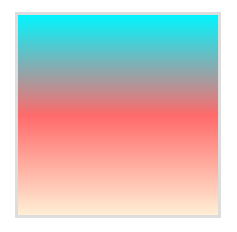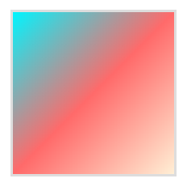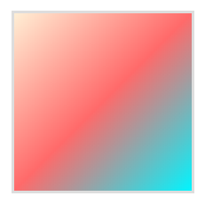

## 径向渐变

> 设置渐变

```css
/* 径向渐变 */
background: radial-gradient(#FFEFD5,#FF6A6A,#00F5FF);
```

> 效果

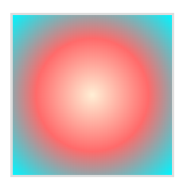

> 设置渐变宽度与高度

```css
background: radial-gradient(100px 50px,#FFEFD5,#FF6A6A,#00F5FF);
```

> 效果

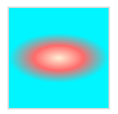

> 渐变**起始位置**：可以通过百分比设置

```css
/*左上*/
background: radial-gradient(at left top,#FFEFD5,#FF6A6A,#00F5FF);
/*右*/
background: radial-gradient(at right,#FFEFD5,#FF6A6A,#00F5FF);
```

> 效果

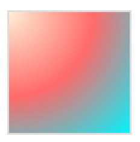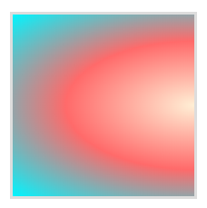

## 标识位

**颜色未指定标识时，颜色会平均分布。**

```css
background: linear-gradient(90deg,#FF6A6A 60%,#00F5FF);
```

> 效果

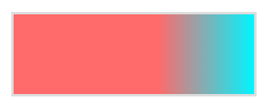

> 标识位相同时将没有过渡效果

```css
background: linear-gradient(90deg,#FF6A6A 60%,#00F5FF 60%);
```

> 效果

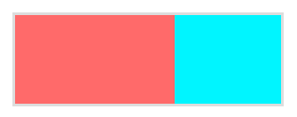

> 径向标识位绘制小太阳

```css
div {
    height:300px;
    width: 300px;
    margin: 100px;
    border: 10px groove skyblue;
    /* 镜像渐变绘制太阳 */
    background: radial-gradient(red,yellow,black);
}
```

> 效果

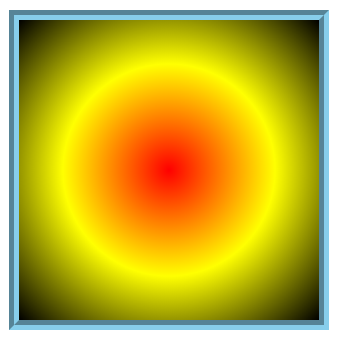

> 改变各个颜色所占比例

```css
background: radial-gradient(red 0, yellow 30%, black 60%, black 100%);
```

> 效果

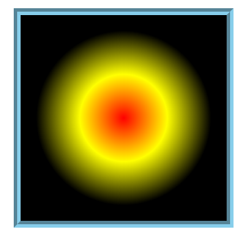

> 通过在两个颜色间中间点定义过渡位置

```css
background: linear-gradient(90deg,red,0%,green);
background: linear-gradient(90deg,red,50%,green);
```

> 效果：和Photoshop的色标一致

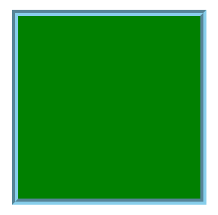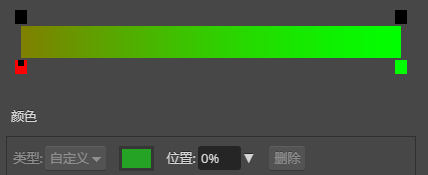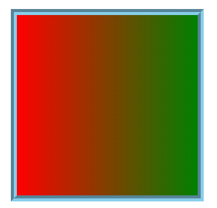

## 渐变重复

> 线性重复

```css
background: repeating-linear-gradient(90deg, blue, 25px, yellow 25px, 25px, red 50px);
```

> 效果

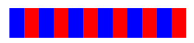

> 径向重复

```css
background: repeating-radial-gradient(10px 10px, red 0%, yellow 40%, black 60%, black 200%);
```

> 效果

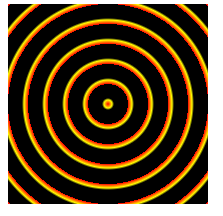