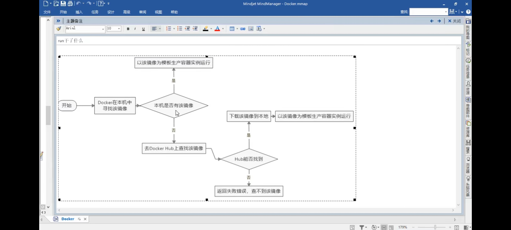

hello world

本地没有 hello world 镜像，就会下载一个 hello-world 镜像，并在容器中运行

```sh
docker run hello-world
```



## Docker 常用命令

1.帮助命令

```sh
# docker 版本
docker version
# docker 信息
docker info
# docker 帮助
docker --help
```

2.镜像命令

```sh
# 列出本地镜像(镜像模板)
docker images
#------------------------------------------------------------#
[root@VM-0-10-centos ~]# docker images
REPOSITORY    TAG       IMAGE ID       CREATED        SIZE
docs          latest    165bb054198f   7 weeks ago    179MB
test/ubuntu   v1        c485e3657685   8 weeks ago    0B
httpd         latest    39c2d1c93266   2 months ago   138MB
#------------------------------------------------------------#
REPOSITORY 镜像仓储源
TAG 镜像的标签(默认latest)
IMAGE ID 镜像的ID
CREATED 镜像创建时间
SIZE 镜像大小
#------------------------------------------------------------#
docker images -a 列出本地所有镜像(含中间层镜像:相当于千层饼)
docker images -q 只显示镜像id
docker images --digests 显示镜像摘要信息
docker images --no-trunc 显示完整的镜像信息(ID没有截取)
```

```sh
# 查找某个镜像
docker search 镜像名
#------------------------------------------------------------#
docker search tomcat
NAME                          DESCRIPTION                                     STARS     OFFICIAL   AUTOMA                          TED
tomcat                        Apache Tomcat is an open source implementati…   3082      [OK]
tomee                         Apache TomEE is an all-Apache Java EE certif…   91        [OK]
dordoka/tomcat                Ubuntu 14.04, Oracle JDK 8 and Tomcat 8 base…   57
#------------------------------------------------------------#
网站: https://hub.docker.com
OFFICIAL 官方版
STARS 镜像星数
#------------------------------------------------------------#
--no-trunk 显示完整镜像描述
-s 列出收藏数不少于指定值的镜像
--automated 只列出automated build类型的镜像
```

```sh
# 下载镜像
docker pull 镜像名[:TAG]
#------------------------------------------------------------#
docker pull tomcat
#------------------------------------------------------------#
```

```sh
# 删除镜像
docker rmi 镜像名
#------------------------------------------------------------#
[root@VM-0-10-centos ~]# docker rmi hello-world
Error response from daemon: conflict: unable to remove repository reference "hello-world" (must force) - container f8c5c059eae6 is using its referenced image d1165f221234
#------------------------------------------------------------#
# 删除的镜像正在运行---强制删除
docker rmi -f 镜像名 #单个
docker rmi -f 镜像名1:TAG 镜像名2:TAG #删除多个
docker rmi -f $(docker images -qa) #删除所有
```

## 容器命令

```sh
# 新建并启动容器
docker run [options] image [command][arg..]
#------------------------------------------------------------#
options 说明
--name="容器新名字"   为容器指定一个名称
-d 后台运行容器，并返回容器ID,也即启动守护试容器
-i 以交互模式运行容器，通常与-t同时使用
-t 为容器重新分配一个伪输入终端，通常与-i同时使用
-P 随机端口映射
-p 指定端口映射，有以下四种格式
	ip:hostPort:containerPort
	ip::containerPort
	hostPort:containerPort
	containerPort
#------------------------------------------------------------#
# 运行centos容器
[root@VM-0-10-centos www]# docker run -it 7e0aa2d69a15
root@a2bf9751ea11:/# ls
#------------------------------------------------------------#
# 命名方式
 docker run -it --name myubuntu ubuntu
```

```sh
# 列出所有运行的容器
docker ps
#------------------------------------------------------------#
-a 列出当前所有正在运行的容器+历史上运行过的
-l 显示最近创建的容器
-n 显示最近n个创建的容器
-q 静音模式，只显示容器编号
--no-trunc 不截断输出
#------------------------------------------------------------#
```

```sh
# 退出容器
#------------------------------------------------------------#
exit        容器停止退出
ctrl+p+q    容器不停止退出
#------------------------------------------------------------#
```

```sh
# 启动容器
#------------------------------------------------------------#
docker start 容器ID或名字
#------------------------------------------------------------#
```

```sh
# 重启容器
#------------------------------------------------------------#
docker restart 容器ID或名字

docker restart 6bc037aff1b4
#------------------------------------------------------------#
```

```sh
# 停止容器
#------------------------------------------------------------#
docker stop 容器ID或名字(一般停止)
docker kill 容器ID或名字(强制停止)

docker stop 6bc037aff1b4
#------------------------------------------------------------#
```

```sh
# 删除容器
#------------------------------------------------------------#
docker ps -n 2 查看最近运行的两条容器
docker rm 容器ID或名字
docker rm -f 容器ID或名字(强制删除)
docker rm 6bc037aff1b4
#------------------------------------------------------------#
```

```sh
# 删除多个容器
#------------------------------------------------------------#
docker rm -f $(docker ps -a -q) 删除所有容器
docker ps -a -q | xargs docker rm 删除所有容器
#------------------------------------------------------------#
```

### 重要

```sh
# 后台运行
#------------------------------------------------------------#
[root@VM-0-10-centos ~]# docker run -d ubuntu
问题： 然后通过docker ps -a 进行查看，会发现容器已经退出
很重要的一点的说明：Docker 容器后台运行,就必须有一个前台进程
#------------------------------------------------------------#
```

```sh
# 查看容器日志
#------------------------------------------------------------#
docker logs -f -t --tail 容器ID
-t 加入时间戳
-f 跟随最新的日志打印
--tail 数字 显示最后多少条
#------------------------------------------------------------#
# 查看容器内运行的进程
docker top 容器ID
# 查看容器内部细节
docker inspect 容器ID
```

## 提交镜像

```sh
# 启动tomcat
#------------------------------------------------------------#
docker run -it -p 8089:8080 tomcat
8089 外部暴露的端口
8080 容器内部端口
#------------------------------------------------------------#
# 随机端口
docker run -it -P tomcat
# 后台运行
docker run -d -P tomcat
#------------------------------------------------------------#

# 案例：修改tomcat默认文档并发布新镜像
# 1.启动tomcat
docker run -it -P tomcat
# 2.打开另一个终端进入tomcat容器
[root@VM-0-10-centos ~]# docker exec -it b03ee9b861c3 /bin/bash
root@b03ee9b861c3:/usr/local/tomcat#
# 3.查看tomcat目录
root@b03ee9b861c3:/usr/local/tomcat# ls
BUILDING.txt     LICENSE  README.md      RUNNING.txt  conf  logs            temp     webapps.dist
CONTRIBUTING.md  NOTICE   RELEASE-NOTES  bin          lib   native-jni-lib  webapps  work
# 4.进入webapps目录并删除docs文档
root@97d640ff5ed4:/usr/local/tomcat# cd webapps.dist
root@97d640ff5ed4:/usr/local/tomcat/webapps.dist# ls
ROOT  docs  examples  host-manager  manager
root@97d640ff5ed4:/usr/local/tomcat/webapps.dist# rm -rf docs
# 5.提交新的镜像
[root@VM-0-10-centos ~]# docker commit -a="zzyy" -m="tomcat without docs" 97d640ff5ed4 zh/tomcat:1.2
sha256:3166d613f85625a8bce8a474e7ab86f9d2b3420eeb08e6c308f8653dd170373f
[root@VM-0-10-centos ~]# docker images
REPOSITORY    TAG       IMAGE ID       CREATED          SIZE
zh/tomcat     1.2       3166d613f856   15 seconds ago   668MB
tomcat        latest    46cfbf1293b1   2 weeks ago      668MB
```

## 数据卷

## DockerFile

1. 手动编写一个 dockerfile 文件
2. 直接 docker build 命令执行，获得一个自定义的镜像
3. run

```
FROM 基础镜像，当前新镜像是基于那个镜像的
MAINTAINER 镜像维护者的姓名和邮箱地址
RUN 容器构建时需要运行的命令
EXPOSE 当前容器对外暴露的端口
WORKDIR 指定在创建容器后，终端默认登陆的进来工作目录，一个落脚点
ENV 用来在构建镜像过程中设置环境变量
ADD 将宿主机目录下的文件拷贝进镜像且ADD命令会自动处理URL和解压tar压缩包
COPY 类型ADD,拷贝文件和目录到镜像中
VOLUME 容器数据卷，用于数据保存和持久化工作
CMD 指定一个容器启动时要运行的命令(dockerfile中可以有多个CMD命令，但只有最后一个生效，CMD会被docker run 之后的参数替换)
ENTRYPOINT 指定一个容器启动时要运行的命令(ENTRYPOINT的目的和CMD一样，都是在指定容器启动程序及参数，会追加)
ONBUILD 当构建一个被继承的Dockerfile时运行命令，父镜像在被继承后父镜像的build被触发
```

案例一：自定义 centos 镜像

- 登录后的默认路径
- vim 编辑器
- 查看网络配置 ifconfig 支持

```sh
# 1.创建DockerFile
vim Dockerfile
#------------------------------------------------------------#
FROM centos                      # 设置基础镜像
MAINTAINER zb<zb@qq.com>         # 姓名和邮箱地址(选填)

ENV mypath /usr/local            # 设置环境变量
WORKDIR $mypath                  # 登录后进入tmp目录(相当于 WORKDIR /usr/local)

RUN yum -y install vim           # 安装vim
RUN yum -y install net-tools     # 安装net-tools

EXPOSE 80                        # 设置对外部暴露的端口
CMD /bin/bash                    # 容器启动时运行的命令
#------------------------------------------------------------#
# 2.构建
#------------------------------------------------------------#
# TAG 版本号 . 当前路径
# docker build -t 新镜像名字:TAG .
docker build -f /mydocker/Dockerfile -t mycentos:1.3 .
#------------------------------------------------------------#
# 3.运行
#------------------------------------------------------------#
[root@VM-0-10-centos mydocker]# docker images
REPOSITORY    TAG       IMAGE ID       CREATED          SIZE
mycentos      1.3       bfc7199cf162   41 seconds ago   303MB
[root@VM-0-10-centos mydocker]# docker run -it mycentos:1.3
[root@a1679dcccc8a local]# pwd
/usr/local #刚刚设置的路径
#------------------------------------------------------------#
# 4.查看镜像历史
#------------------------------------------------------------#
[root@VM-0-10-centos mydocker]# docker history bfc7199cf162
IMAGE          CREATED         CREATED BY                                      SIZE      COMMENT
bfc7199cf162   4 minutes ago   /bin/sh -c #(nop)  CMD ["/bin/sh" "-c" "/bin…   0B
8565128b189f   4 minutes ago   /bin/sh -c #(nop)  EXPOSE 8083                  0B
890e9bc28e65   4 minutes ago   /bin/sh -c yum -y install net-tools             27.9MB
f6f57e8a4bc2   4 minutes ago   /bin/sh -c yum -y install vim                   65.5MB
7b74b6f30d7c   7 minutes ago   /bin/sh -c #(nop) WORKDIR /usr/local            0B
1d5a5bb00b4d   7 minutes ago   /bin/sh -c #(nop)  ENV mypath=/usr/local        0B
cb21016cfd0f   7 minutes ago   /bin/sh -c #(nop)  MAINTAINER zb<zb@qq.com>     0B
300e315adb2f   8 months ago    /bin/sh -c #(nop)  CMD ["/bin/bash"]            0B
<missing>      8 months ago    /bin/sh -c #(nop)  LABEL org.label-schema.sc…   0B
<missing>      8 months ago    /bin/sh -c #(nop) ADD file:bd7a2aed6ede423b7…   209MB
#------------------------------------------------------------#
```

案例二

```sh
# RUN命令
#------------------------------------------------------------#
[root@VM-0-10-centos mydocker]# docker run -it -p 7777:8080 tomcat ls -l
total 160
-rw-r--r-- 1 root root 18949 Jun 28 08:46 BUILDING.txt
-rw-r--r-- 1 root root  6210 Jun 28 08:46 CONTRIBUTING.md
-rw-r--r-- 1 root root 57092 Jun 28 08:46 LICENSE
-rw-r--r-- 1 root root  2333 Jun 28 08:46 NOTICE
-rw-r--r-- 1 root root  3372 Jun 28 08:46 README.md
-rw-r--r-- 1 root root  6898 Jun 28 08:46 RELEASE-NOTES
-rw-r--r-- 1 root root 16507 Jun 28 08:46 RUNNING.txt
drwxr-xr-x 2 root root  4096 Jul 23 09:46 bin
drwxr-xr-x 2 root root  4096 Jun 28 08:46 conf
drwxr-xr-x 2 root root  4096 Jul 23 09:46 lib
drwxrwxrwx 2 root root  4096 Jun 28 08:46 logs
drwxr-xr-x 2 root root  4096 Jul 23 09:46 native-jni-lib
drwxrwxrwx 2 root root  4096 Jul 23 09:46 temp
drwxr-xr-x 2 root root  4096 Jul 23 09:46 webapps
drwxr-xr-x 7 root root  4096 Jun 28 08:46 webapps.dist
drwxrwxrwx 2 root root  4096 Jun 28 08:46 work
# 上面的代码相当于
CMD ["catalina.sh","run"]  # 默认配置
CMD ls -l  # 当前命令替换了上面的命令
# 打印的目录是WORKDIR路径下的内容
#------------------------------------------------------------#
# ENTRYPOINT命令
#------------------------------------------------------------#
FROM centos
ENTRYPOINT ["curl","-s","http://ip.cn"]
# 构造后再运行命令
docker build -f /mydocker/Dockerfile2 -t myip .
docker run myip -i
# 上面的代码相当于
ENTRYPOINT ["curl","-s","-i","http://ip.cn"]
#------------------------------------------------------------#
```
