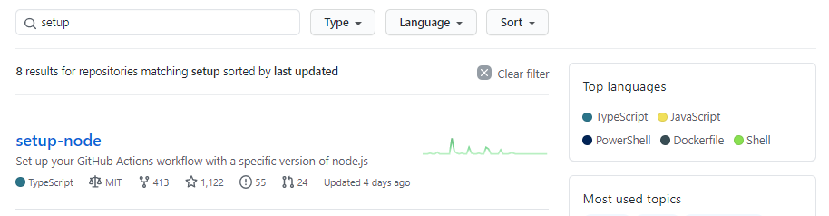
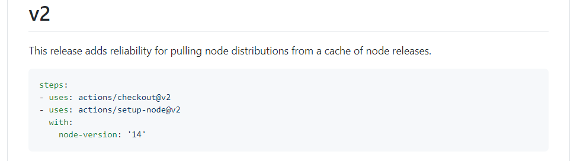
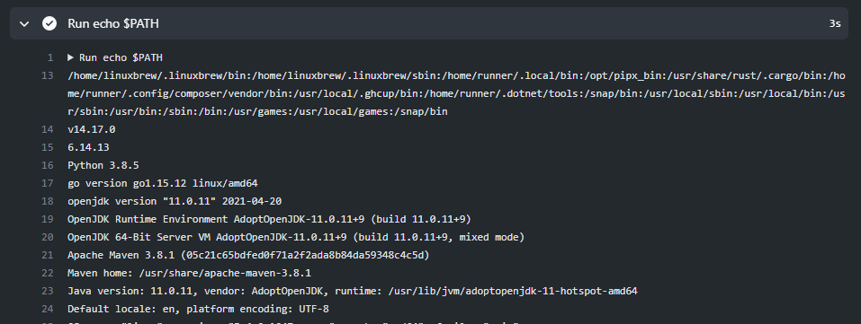
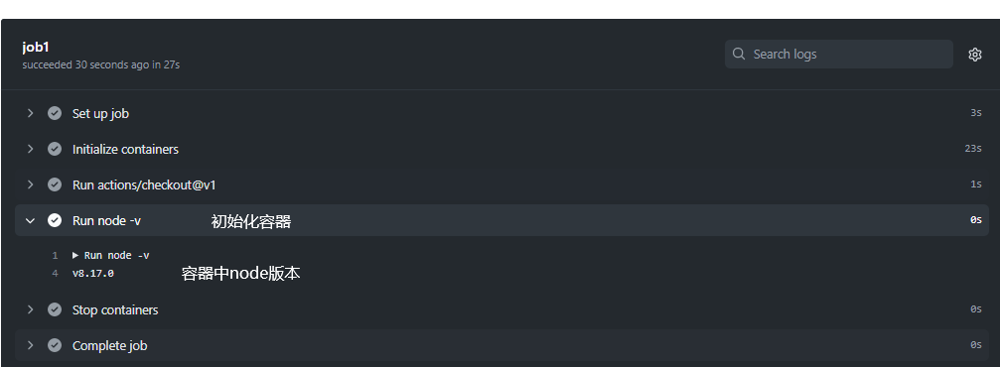
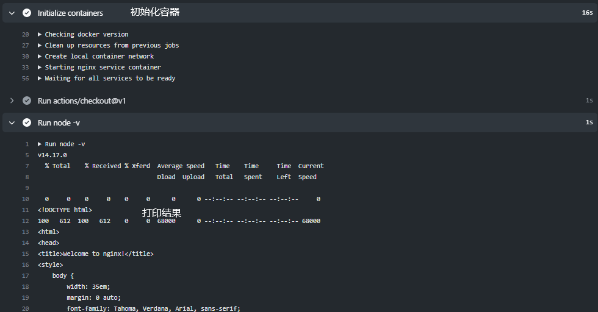
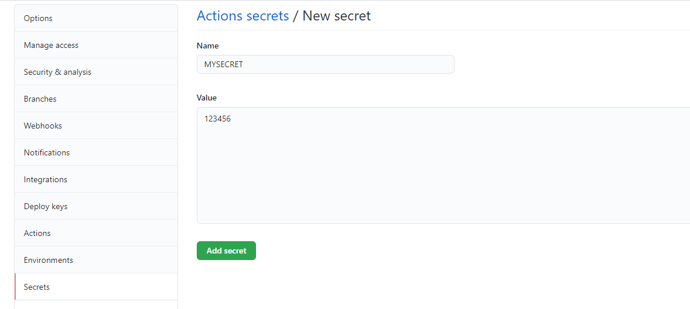
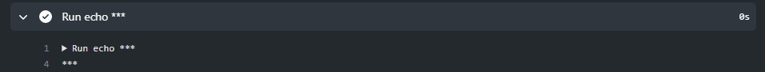

## CI

2.实例二

```yaml
name: CI
# 触发条件 当src下文件改动->push到master分支才会触发
on: 
  push:
    branches:
    - master
    paths:
    - src/*
# 触发的任务
jobs:
    job1:                             # 任务名，可以随意命名
      runs-on: ubuntu-latest          # 设置运行环境
      steps:                          # 运行步骤
      - run: echo hello               # 运行shell 命令(打印hello)
      - uses: actions/checkout@v2     # clone代码(下载代码)
      - uses: actions/setup-node@v2   # 指定nodejs
        with:
          node-version: '14'          # 设置node版本  
      - run: |                        # 运行shell命令
          npm install 
          npm run build --if-present  
          npm test 
```

问题：为啥actions/checkout@v1就能下载代码

github的actions https://github.com/actions

打开仓库



用法



github默认安装了环境

```yaml
name: CI

on: [push]

jobs:
  build:
    runs-on: ubuntu-latest
    steps: 
    - run: |
        echo $PATH
        node -v
        npm -v
        python --version
        java -version
        go version
        mvn -version
        docker version
        docker-compose -v
        git version
```

运行结果



```yaml
name: CI

on: [push]

jobs:
  job1:
    runs-on: ubuntu-latest      # 指定运行环境
    container:                  # 设置docker
      image: node:8             # 指定node镜像
    steps: 
    - uses: actions/checkout@v1 # 下载代码
    - run: |
        node -v
```



```yaml
name: CI

on: [push]

jobs:
  job1:
    runs-on: ubuntu-latest      # 指定运行环境
    services:                    # 指定服务器
      nginx:
       image: nginx             # 指定镜像
       ports: 
          - 8080:80
    steps: 
    - uses: actions/checkout@v1 # 下载代码
    - run: |
        node -v
        curl localhost:8080     
      # 访问8080
```



设置secret用来读取

setting->secrets



```yaml
  
name: CI

on: [push]

jobs:
  job1:
    runs-on: ubuntu-latest      # 指定运行环境
    steps: 
    - uses: actions/checkout@v1 # 下载代码
    # 读取secret: secrets.设置的secrete
    - run: |
        echo ${{ secrets.MYSECRET }}
```



CD

启动docker

```sh
systemctl start docker
```

 安装nginx镜像

```sh
docker pull nginx
# 查看镜像
docker images
```

配置Dockerfile

```dockerfile
# Dockerfile
# FROM 设置基础镜像
# MAINTAINER 作者(随便写)
# COPY 将dist文件夹下面的内容拷贝到/usr/share/nginx/html/这个目录
FROM nginx:latest
MAINTAINER xx
COPY dist/ /usr/share/nginx/html/ 
```

创建镜像

```sh
# docker build -t 打包后的镜像名 .
docker build -t docs .
# 查看镜像
docker images

```

运行

```sh
# docker run -d --name xx -p 8848:80 xxx
# -d：代表后台启动
# --name xx：这是创建的容器名称
# -p 8848:80: 是将nginx的80映射到你服务器的8848端口(注意你服务器的端口是否开放8848，其他端口也可以)
# xxx：是刚刚创建的镜像名称
docker run -d --name docs1 -p 8001:80 docs
# 停止运行
docker stop 7bb5427b2541
```

