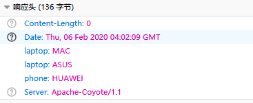
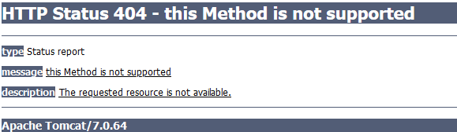
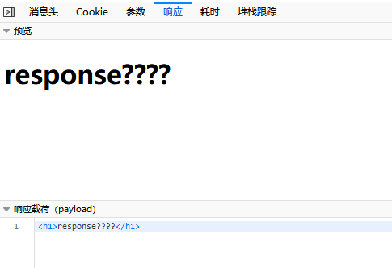
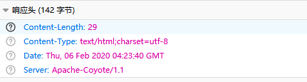
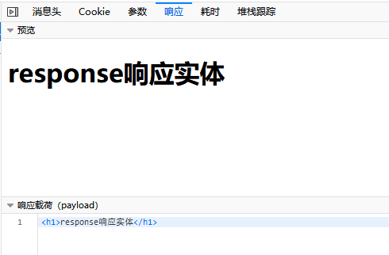
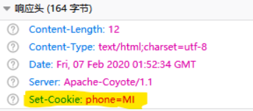
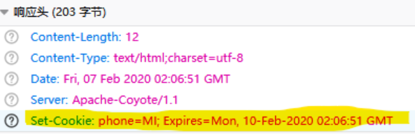
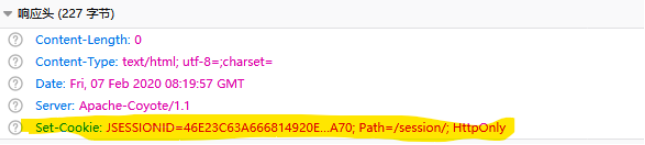
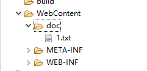

## 入门

**1.编写一个java类继承HttpServlet方法**

```java
public class myServlet extends HttpServlet{
    @Override
    protected void service(HttpServletRequest req, HttpServletResponse resp) throws ServletException, IOException {
        resp.getWriter().write("this is my first servlet.");
    }
}
```

**2.配置web.xml**

```xml
<!-- 配置servlet路径 -->
<servlet>
    <servlet-name>my</servlet-name>
    <servlet-class>com.servlet.myServlet</servlet-class>
</servlet>
<!-- 配置访问方式 -->
<servlet-mapping>
    <servlet-name>my</servlet-name>
    <url-pattern>/my</url-pattern>
</servlet-mapping>
```

**运行结果**

```java
浏览器访问:
http://localhost:8000/test/my
浏览器显示:
this is my first servlet.
```

## 生命周期

Servlet的生命周期：

- 1、从第一次调用到服务器关闭。
- 2、如果Servlet在web.xml中配置了load-on-startup，生命周期为 从服务器启动到服务器关闭
- 3、注意：init方法是对Servlet进行初始化的一个方法，会在Servlet第一次 加载进行存储时执行
- 4、destory方法是在servlet被销毁时执行，也就服务器关闭时

```java
public class ServletLeft extends HttpServlet{
    //初始化方法，在servlet第一次加载内容时被调用
    @Override
    public void init() throws ServletException {
        System.out.println("servlet初始化完成");
    }
    //service方法，浏览器请求时被调用
    @Override
    protected void service(HttpServletRequest req, HttpServletResponse resp) throws ServletException, IOException {
        System.out.println("service被调用");
    }
    //销毁方法，服务器关闭时调用
    @Override
    public void destroy() {
        System.out.println("servlet被销毁");
    }
}
```

**运行结果**

```
运行结果

控制台:
servlet初始化完成-------浏览器第一次请求时被调用
service被调用-----------浏览器每次请求调用
service被调用-----------浏览器每次请求调用
service被调用-----------浏览器每次请求调用
servlet被销毁-----------服务器关闭调用
```

**如果想启动服务器就初始化servlet则需要下面的配置**

```xml
<!--加上次标签则在服务器启动就调用-->
<load-on-startup>1</load-on-startup>
```

**完整代码**

```xml
<!-- 配置servlet路径 -->
<servlet>
    <servlet-name>lift</servlet-name>
    <servlet-class>com.servlet.ServletLeft</servlet-class>
    <load-on-startup>1</load-on-startup>
</servlet>
<!-- 配置访问方式 -->
<servlet-mapping>
    <servlet-name>lift</servlet-name>
    <url-pattern>/lift</url-pattern>
</servlet-mapping>
```

## request对象

作用：request对象中封存了当前请求的所有请求信息

### 获取请求头数据

```java
public class RequestServlet extends HttpServlet{
    @Override
    protected void service(HttpServletRequest req, HttpServletResponse resp) throws ServletException, IOException {
        //获取请求头数据
        //获取请求方式
        String method = req.getMethod();
        System.out.println("请求方式:"+method);
        //获取请求URL+URI
        StringBuffer url = req.getRequestURL();
        System.out.println("url地址:"+url);
        String uri = req.getRequestURI();
        System.out.println("uri地址:"+uri);
        //获取协议
        String h = req.getScheme();
        System.out.println("网络协议:"+h);
    }
}
```

**运行结果**

```
浏览器:
http://localhost:8000/test/request
控制台:
请求方式:GET
url地址:http://localhost:8000/test/request
uri地址:/test/request
网络协议:http
```

### 获取用户数据

**定义表单**

```html
<body>
    <form action="request" method="post">
        用户名：<input type="text" name="username"><br />
        密码：<input type="password" name="password"><br />
        爱好：<br />
        <input type="checkbox" name="hobbys" value="sing"/>唱歌<br />
        <input type="checkbox" name="hobbys" value="dance"/>跳舞<br />
        <input type="checkbox" name="hobbys" value="swim"/>游泳<br />
        <input type="submit" value="登录">
    </form>
</body>
```

**定义servlet**

```java
public class RequestServlet extends HttpServlet{
    @Override
    protected void service(HttpServletRequest req, HttpServletResponse resp) throws ServletException, IOException {
        //获取用户数据
        String name=req.getParameter("username");
        String pwd=req.getParameter("password");
        System.out.println("用户名:"+name);
        System.out.println("密码:"+pwd);
        //获取所有的用户请求数据的键的枚举集合---req.getParameterNames()
        String[] hobbys=req.getParameterValues("hobbys");
        System.out.println("爱好:");
        if(hobbys!=null){
            for(String hobby:hobbys){
                System.out.print(hobby+" ");
            }
        }   
    }
}
```

**运行结果**

```
浏览器:
http://localhost:8000/test/index.jsp
填入参数提交
控制台:
用户名:zhangsan
密码:123
爱好:
sing dance swim
```

## response对象

**作用：**用来响应数据到浏览器的一个对象

### 设置响应头

- setHeader方法会覆盖同名对象
- addHeader方法捕获覆盖同名对象

```java
public class ResponseServlet extends HttpServlet{
    @Override
    protected void service(HttpServletRequest req, HttpServletResponse resp) throws ServletException, IOException {
        //设置响应头
        //setHeader会覆盖同名对象
        resp.setHeader("phone", "MI");
        resp.setHeader("phone", "HUAWEI");
        //addHeader不会覆盖同名对象
        resp.addHeader("laptop", "MAC");
        resp.addHeader("laptop", "ASUS");
    }
}
```



### 设置响应状态码

```java
//设置响应状态码
resp.sendError(404,"this Method is not supported");
```



### 设置响应实体

```java
//设置响应实体
resp.getWriter().write("<h1>response响应实体</h1>");
```



**存在问题：中文乱码**

### 设置响应编码格式

```java
//设置响应编码格式
//方法一:
resp.setHeader("content-type", "text/html;charset=utf-8");
//方法二:推荐使用
resp.setContentType("text/html;charset=utf-8");
```



**上面的问题可以得到解决**

```java
public class ResponseServlet extends HttpServlet{
    @Override
    protected void service(HttpServletRequest req, HttpServletResponse resp) throws ServletException, IOException {
        //设置响应编码格式
        //resp.setHeader("content-type", "text/html;charset=utf-8");
        resp.setContentType("text/html;charset=utf-8");
        //设置响应实体
        resp.getWriter().write("<h1>response响应实体</h1>");
    }
}
```



## 转发和重定向

### 请求转发

- **作用:**实现多个servlet联动操作处理请求，这样避免代码冗余，让servlet的职责更加明确。
- **使用：**`req.getRequestDispatcher("要转发的地址").forward(req, resp);`
- **地址：**相对路径，直接书写servlet的别名即可。
- **特点:** **一次请求**，**浏览器地址栏信息不改变**。
- **注意：**请求转发后直接`return`结束即可。

```java
if(u!=null) {
    resp.getWriter().write("登录成功");
}else {
    //登录失败请求转发
    req.getRequestDispatcher("page").forward(req, resp);
    return;
}
```

### 重定向

- **重定向：**解决了表单重复提交的问题，以及当前servlet无法处理的请求的问题。

- **使用:**`resp.sendRedirect(String uri);`

- **示例:**`resp.sendRedirect("/login/main");`

- **特点：** **1.两次请求，两个request对象。2.浏览器地址栏信息改变**

- **时机：**

  **1.如果请求中有表单数据，而数据又比较重要，不能重复提交，建议使用重定向。**

  **2.如果请求被Servlet接收后，无法进行处理，建议使用重定向定位到可以处理的源**

```java
if(u!=null) {
    //重定向
    resp.sendRedirect("/test/main");
}else {
    //登录失败请求转发
    req.getRequestDispatcher("page").forward(req, resp);
    return;
}
```

## request对象的作用域

- **使用：**`request.setAttribute(objectname,Objectvalue);` `request.getAttribute(Objectobj);`
- **作用：**解决了一次请求内的不同 Servlet 的数据(请求数据+其他数据)共享问题。
- **作用域：**基于请求转发，一次请求中的所有 Servlet 共享。
- **注意：**使用 Request 对象进行数据流转，数据只在一次请求内有效。
- **特点：**1.服务器创建 2.每次请求都会创建 3.生命周期一次请求

```java
if(u!=null) {
	resp.getWriter().write("登录成功");
}else {
    //存取request作用域对象
    req.setAttribute("str", "用户名或密码错误");
    req.getRequestDispatcher("page").forward(req, resp);
    return;
}
```

## Cookie对象

### 1.cookie的创建

```java
//创建cookie对象
Cookie c = new Cookie("phone", "MI");
//响应cookie信息
resp.addCookie(c);
```



**特点**：cookie会存储在浏览器的**运行内存**中，请求同项目其他地址会附带。

**问题：关闭浏览器cookie会失效**

**解决：设置有效期**

### 2.cookie的有效期

```java
//创建cookie对象
Cookie c = new Cookie("phone", "MI");
//设置cookie有效期(单位秒)
c.setMaxAge(3600*24*3);
//响应cookie信息
resp.addCookie(c);
```



**特点：**cookie**存储在硬盘**中，在设置时间(3天)内不会失效

**问题：**同项目下每个请求都附带cookie

**解决：**设置cookie**有效路径**

### 3.cookie有效路径

```java
//创建cookie对象
Cookie c = new Cookie("phone", "MI");
//设置cookie有效期(单位秒)
c.setMaxAge(3600*24*3);
//设置有效路径
c2.setPath("/cookie/abc");
//响应cookie信息
resp.addCookie(c);
```

**作用：在访问/cookie/abc才会附带cookie信息，其他地址则不会附带**

### 4.cookie信息的获取

```java
//获取cookie信息
Cookie[] cks = req.getCookies();
if(cks!=null) {
    for(Cookie c:cks) {
        String name = c.getName();
        String value = c.getValue();
        System.out.println(name+":"+value);
    }
}
```

## session对象

**问题：**一个用户的不同请求处理的数据共享怎么办？

**解决：**使用session技术

**原理：**用户第一次访问服务器，服务器会创建一个session对象给此用户，并将该session对象的JSESSIONID使用Cookie技术存储到浏览器中，保证用户的其他请求能够获取到同一个session对象，也保证了不同请求能够获取到共享的数据。

**特点：**1.存储在**服务器端** 2.服务器进行创建 3.依赖Cookie技术 4.一次会话 5.默认存储时间是30分钟

**作用：**解决了一个用户不同请求处理的数据共享问题

**简单理解：**用户第一次访问服务器，服务器将在服务器上创建一个柜子(session对象)，并将打开柜子的钥匙(JSESSIONID)发送到浏览器存储(使用cookie技术),用户访问其他页面时就会附带这个钥匙(JSESSIONID)

**总结：**

session解决了一个用户的不同请求的数据共享问题，只要在JSESSIONID不失效和session对象不失效的情况下。

用户的任意请求在处理时都能获取到同一个session对象。

**作用域：**1.一次会话 2.在JSESSIONID和SESSION对象不失效的情况下为整个项目内。

**session失效处理：**将用户请求中的JSESSIONID和后台获取到的SESSION对象的JSESSIONID进行比对，如果一致

则session没有失效，如果不一致则证明session失效了。重定向到登录页面，让用户重新登录。

**注意：JSESSIONID存储在了Cookie的临时存储空间中，浏览器关闭即失效。**

### 创建和获取session对象

- 1.如果请求中拥有session的标识符也就是JSESSIONID，则返回其对应的session对象
- 2.如果请求中没有session的标识符也就是JSESSIONID，则创建新的session对象，并将其JSESSIONID作为从cookie数据存储到浏览器内存中
- 3.如果session对象是失效了，也会重新创建一个session对象，并将其JSESSIONID存储在浏览器内存中。

```java
HttpSession hs = req.getSession();
```

**完整代码**

```java
public class SessionServlet extends HttpServlet {
    @Override
    protected void service(HttpServletRequest req, HttpServletResponse resp) throws ServletException, IOException {
        //设置请求编码格式
        req.setCharacterEncoding("utf-8");
        //设置响应编码格式
        resp.setContentType("text/html;charset;utf-8");
        //创建session对象
        HttpSession hs = req.getSession();
    }
}
```



```
浏览器存储JSESSIONID,在访问同项目其他路径就会携带
失效3种情况
1.cookie被清除
2.关掉了浏览器
3.服务端的session超时被销毁
```

### 设置session存储时间

```java
//创建session对象
HttpSession hs = req.getSession();
//设置session存储时间(单位秒)
hs.setMaxInactiveInterval(5);
```

```
超时访问生成新的JSESSIONID
在指定的时间内session对象没有被使用则销毁，如果使用了则重新计时。
如果在5秒内又访问则又重新计时5秒，session对象不会销毁
```

### 设置session强制失效

**作用：当用户退出登录时主动销毁session**

```java
//设置强制失效
hs.invalidate();
```

### session存储和获取数据

```java
//存储数据
String name = "张三";
hs.setAttribute("name", name);
//取数据
hs.getAttribute("name")
```

**存储和获取数据**

**存储：**`hs.setAttribute(String name,Object value);`

**获取：**`hs.getAttribute(String name)` 返回的数据类型为**Object**

**注意：存储的动作和取出的动作发生在不同的请求中，但是存储要先于取出执行。**

**使用时机:**一般用户在登陆web项目时会将用户的个人信息存储到Sesion中，供该用户的其他请求使用。

### 修改session默认失效时间

```xml

<!--D:\tomcat\conf\web.xml-->
<!--注意:
1.全局模式:修改tomcat下的web.xml，tomcat下所有项目有效
2.局部模式:在项目下的web.xml添加如下代码
-->
<session-config>
   <session-timeout>30</session-timeout>
</session-config>
```

## ServletContext对象

**ServletContext对象学习：**

**问题:**不同的用户使用相同的数据

**解决:**ServletContext对象

**特点:** 1.服务器创建 2.用户共享

**作用域：**整个项目内

**生命周期：**服务器启动到服务器关闭

### 获取ServletContext对象三种方法

```java
//获取servletContext的三种方式:
//第一种方式(常用)
ServletContext sc1 = this.getServletContext();
//第二种方式
ServletContext sc2 = this.getServletConfig().getServletContext();
//第三种方式(常用)
ServletContext sc3 = req.getSession().getServletContext();
```

**完整代码**

```java
public class ServletContextServlet extends HttpServlet {
    @Override
    protected void service(HttpServletRequest req, HttpServletResponse resp) throws ServletException, IOException {
        //获取servletContext的三种方式:
        //第一种方式
        ServletContext sc1 = this.getServletContext();
        //第二种方式
        ServletContext sc2 = this.getServletConfig().getServletContext();
        //第三种方式
        ServletContext sc3 = req.getSession().getServletContext();
        System.out.println(sc1==sc2);
        System.out.println(sc1==sc3);
    }
}
```

**结果**

```
浏览器:
http://localhost:8000/ServletContext/context
控制台:
true
true
结论:通过三种方式拿到的是同一个对象
```

### ServletContext对象的存取

**数据存储** `sc.setAttribute(String name, Object value);`

**数据获取**`sc.getAttribute("str") 返回的是Object类型`

**注意：不同的用户可以给ServletContext对象进行数据的存取。获取的数据不存在返回null。**

```java
//数据存储
sc.setAttribute("str", "servletcontext学习");
//获取数据
sc.getAttribute("str");
```

**完整代码**

```java
//数据存储
public class ServletContextServlet extends HttpServlet {
    @Override
    protected void service(HttpServletRequest req, HttpServletResponse resp) throws ServletException, IOException {
        //获取servletContext的三种方式:
        //第一种方式
        ServletContext sc1 = this.getServletContext();
        //使用ServletContext对象完成数据共享
        //数据存储
        sc1.setAttribute("str", "servletcontext学习");
    }
}
```

### 获取项目中web.xml文件中的全局配置数据

**获取项目中web.xml文件中的全局配置数据**

`sc.getInitParameter(String name);` 根据键的名字返回web.xml中配置的全局数据的值，返回String类型。

如果数据不存在返回null。

`sc.getInitParameterNames();`返回键名的枚举

**配置方式：**注意 一组标签只能存储一组键值对数据，多组可以声明多个 进行存储。 **作用：** **将静态数据**(不可改变)和代码进行解耦。对于一些重要数据的修改避免改源码。

```xml
<!-- 配置全局数据 -->
<context-param>
  <param-name>name</param-name>
  <param-value>zhangsan</param-value>
</context-param>
```

**配置多个全局参数**

```xml
<!-- 配置多个全局参数 -->
<context-param>
  <param-name>name</param-name>
  <param-value>zhangsan</param-value>
</context-param>
<context-param>
  <param-name>age</param-name>
  <param-value>18</param-value>
</context-param>
```

**获取全局配置数据**

```java
//获取项目web.xml的全局配置数据
String name = sc.getInitParameter("name");
System.out.println(name);
```

**完整代码**

```java
public class ServletContextServlet extends HttpServlet {
    @Override
    protected void service(HttpServletRequest req, HttpServletResponse resp) throws ServletException, IOException {
        //获取servletContext的三种方式:
        //第一种方式
        ServletContext sc = this.getServletContext();
        //使用ServletContext对象完成数据共享

        //获取项目web.xml的全局配置数据
        String name = sc.getInitParameter("name");
        System.out.println("全局参数:"+name);
    }
}
```

## 获取项目webroot下的资源的绝对路径和流对象

**1.获取项目webroot下的资源的绝对路径，eclipse下为WebContent**



```java
//获取项目根目录下的资源的绝对路径
1.String path = "D:\\\\apache-tomcat-7.0.56\\webapps\\sc\\doc\\1.txt";
System.out.println(path);
//存在问题，当项目部署到远程服务器或没有D盘将出错
```

**项目根目录的绝对路径**

```java
//获取项目根目录下的资源的绝对路径
2.String path = sc.getRealPath("/doc/1.txt");
System.out.println(path);
```

**获取webroot下的资源的流对象**

```java
//获取项目根目录下资源的流对象
InputStream is = sc.getResourceAsStream("/doc/1.txt");
```

**注意:此种方式只能获取项目根目录下的资源流对象，class文件的流对象需要使用类加载器获取。**

## servletConfig对象

- **问题：**如何获取在web.xml中给每个servlet**单独配置**的数据呢？
- **解决：**使用ServletConfig对象
- **使用：**获取ServletConfig对象获取web.xml中的配置数据

```xml
  <!--web.xml配置
      注意：需要配置到servlet里面
  -->
  <servlet>
    <description></description>
    <display-name>ServletConfigServlet</display-name>
    <servlet-name>ServletConfigServlet</servlet-name>
    <servlet-class>com.zh.servlet.ServletConfigServlet</servlet-class>
    <init-param>
        <param-name>name</param-name>
        <param-value>config</param-value>
    </init-param>
  </servlet>
```

**获取servletConfig对象**

```java
//获取ServletConfig对象
ServletConfig sc = this.getServletConfig();
//获取web.xml中配置的数据
String name = sc.getInitParameter("name");
```

**完整代码**

```java

public class ServletConfigServlet extends HttpServlet {
    @Override
    protected void service(HttpServletRequest req, HttpServletResponse resp) throws ServletException, IOException {
        //获取ServletConfig对象
        ServletConfig sc = this.getServletConfig();
        //获取web.xml中配置的数据
        String name = sc.getInitParameter("name");
        System.out.println(name);
    }
}
```

结果

```
浏览器:
http://localhost:8000/ServletConfig/config
控制台:
config
```

## 中文问题

### 单独配置

```
uname=new String(uname.getBytes("iso8859-1"),"utf-8");
```

### 公共配置

**get方式：**

步骤一：`req.setCharacterEncoding("utf-8");`

 步骤二：在tomcat的目录下的conf目录中修改server.xml文件：在Connector标签中增加属性 `useBodyEncodingForURI="true"`

 **post方式：**

 `req.setCharacterEncoding("utf-8");`

## 文件上传

### 上传页面

```html
<meta http-equiv="Content-Type" content="text/html; charset=UTF-8">
<form action="uploadPhoto" method="post" enctype="multipart/form-data">
  英雄名称:<input type="text" name="heroName" /> <br>
  上传头像 : <input type="file" name="filepath" /> <br>
  <input type="submit" value="上传">
</form>
```

### servlet

 需要用到两个第三方的jar包，**commons-io-1.4.jar**和**commons-fileupload-1.2.2.jar**。 

```java
public class UploadPhotoServlet extends HttpServlet {
  
    public void doPost(HttpServletRequest request, HttpServletResponse response) {
  
        String filename = null;
        try {
            DiskFileItemFactory factory = new DiskFileItemFactory();
            ServletFileUpload upload = new ServletFileUpload(factory);
            // 设置上传文件的大小限制为1M
            factory.setSizeThreshold(1024 * 1024);
             
            List items = null;
            try {
                items = upload.parseRequest(request);
            } catch (FileUploadException e) {
                e.printStackTrace();
            }
  
            Iterator iter = items.iterator();
            while (iter.hasNext()) {
                FileItem item = (FileItem) iter.next();
                if (!item.isFormField()) {
  
                    // 根据时间戳创建头像文件
                    filename = System.currentTimeMillis() + ".jpg";
                     
                    //通过getRealPath获取上传文件夹，如果项目在e:/project/j2ee/web,那么就会自动获取到 e:/project/j2ee/web/uploaded
                    String photoFolder =request.getServletContext().getRealPath("uploaded");
                     
                    File f = new File(photoFolder, filename);
                    f.getParentFile().mkdirs();
  
                    // 通过item.getInputStream()获取浏览器上传的文件的输入流
                    InputStream is = item.getInputStream();
  
                    // 复制文件
                    FileOutputStream fos = new FileOutputStream(f);
                    byte b[] = new byte[1024 * 1024];
                    int length = 0;
                    while (-1 != (length = is.read(b))) {
                        fos.write(b, 0, length);
                    }
                    fos.close();
  
                } else {
                    System.out.println(item.getFieldName());
                    String value = item.getString();
                    value = new String(value.getBytes("ISO-8859-1"), "UTF-8");
                    System.out.println(value);
                }
            }
             
            String html = "";
            response.setContentType("text/html");
            PrintWriter pw= response.getWriter();
             
            pw.format(html, filename);
             
        } catch (FileNotFoundException e) {
            // TODO Auto-generated catch block
            e.printStackTrace();
        } catch (Exception e) {
            // TODO Auto-generated catch block
            e.printStackTrace();
        }
    }
}
```

