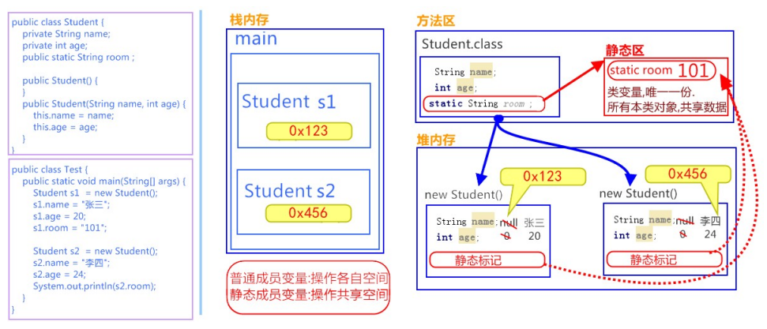

## Scanner类

### 什么是Scanner类

一个可以解析基本类型和字符串的简单文本扫描器。 例如，以下代码使用户能够从` System.in` 中读取一个数：

```java
Scanner sc = new Scanner(System.in);
int i = sc.nextInt();
```

> 备注：System.in 系统输入指的是通过键盘录入数据。

### Scanner使用步骤

查看类 

- `java.util.Scanner` ：该类需要import导入后使用。

查看构造方法

- `public Scanner(InputStream source)` : 构造一个新的 `Scanner` ，它生成的值是从指定的输入流扫描的。

查看成员方法

- `public int nextInt()` ：将输入信息的下一个标记扫描为一个 `int `值。

使用Scanner类，完成接收键盘录入数据的操作，代码如下：

```java
//1. 导包
import java.util.Scanner;
public class Demo01_Scanner {
    public static void main(String[] args) {
        //2. 创建键盘录入数据的对象
        Scanner sc = new Scanner(System.in);
        //3. 接收数据
        System.out.println("请录入一个整数：");
        int i = sc.nextInt();
        //4. 输出数据
        System.out.println("i:"+i);
    }
}
```

### 练习

**求和** 

键盘录入两个数据并求和，代码如下：

```java
import java.util.Scanner;
public class Test01Scanner {
    public static void main(String[] args) {
        // 创建对象
        Scanner sc = new Scanner(System.in);
        // 接收数据
        System.out.println("请输入第一个数据：");
        int a = sc.nextInt();
        System.out.println("请输入第二个数据：");
        int b = sc.nextInt();
        // 对数据进行求和
        int sum = a + b;
        System.out.println("sum:" + sum);
    }
}
```

**取最值**

键盘录入三个数据并获取最大值，代码如下：

```java
import java.util.Scanner;
public class Test02Scanner {
    public static void main(String[] args) {
        // 创建对象
        Scanner sc = new Scanner(System.in);
        // 接收数据
        System.out.println("请输入第一个数据：");
        int a = sc.nextInt();
        System.out.println("请输入第二个数据：");
        int b = sc.nextInt();
        System.out.println("请输入第三个数据：");
        int c = sc.nextInt();
        // 如何获取三个数据的最大值
        int temp = (a > b ? a : b);
        int max = (temp > c ? temp : c);
        System.out.println("max:" + max);
    }
}
```

## Random类

### 什么是Random类

此类的实例用于生成伪随机数。

例如，以下代码使用户能够得到一个随机数

```java
Random r = new Random();
int i = r.nextInt();
```

### Random使用步骤

查看类 

- `java.util.Random` ：该类需要 import导入使后使用。 

查看构造方法

- `public Random()` ：创建一个新的随机数生成器。 

查看成员方法

- `public int nextInt(int n)` ：返回一个伪随机数，范围在 `0 `（包括）和 `指定值 n` （不包括）之间的 `int` 值。 

使用Random类，完成生成3个10以内的随机整数的操作，代码如下：

```java
//1. 导包
import java.util.Random;
    public class Demo01_Random {
        public static void main(String[] args) {
        //2. 创建键盘录入数据的对象
        Random r = new Random();
        for(int i = 0; i < 3; i++){
            //3. 随机生成一个数据
            int number = r.nextInt(10);
            //4. 输出数据
            System.out.println("number:"+ number);
        }
    }
}

```

> 备注：创建一个 Random 对象，每次调用 `nextInt() `方法，都会生成一个随机数。

### 练习

**获取随机数** 

获取1-n之间的随机数，包含n，代码如下：

```java
// 导包
import java.util.Random;
public class Test01Random {
    public static void main(String[] args) {
        int n = 50;
        // 创建对象
        Random r = new Random();
        // 获取随机数
        int number = r.nextInt(n) + 1;
        // 输出随机数
        System.out.println("number:" + number);
    }
}

```

**猜数字小游戏**

游戏开始时，会随机生成一个1-100之间的整数 `number` 。玩家猜测一个数字` guessNumber `，会与 `number `作比 较，系统提示大了或者小了，直到玩家猜中，游戏结束。

> 小贴士：先运行程序代码，理解此题需求，经过分析后，再编写代码

```java
// 导包
import java.util.Random;
public class Test02Random {
    public static void main(String[] args) {
        // 系统产生一个随机数1‐100之间的。
        Random r = new Random();
        int number = r.nextInt(100) + 1;
        while(true){
            // 键盘录入我们要猜的数据
            Scanner sc = new Scanner(System.in);
            System.out.println("请输入你要猜的数字(1‐100)：");
            int guessNumber = sc.nextInt();
            // 比较这两个数据(用if语句)
            if (guessNumber > number) {
            	System.out.println("你猜的数据" + guessNumber + "大了");
            } else if (guessNumber < number) {
            	System.out.println("你猜的数据" + guessNumber + "小了");
            } else {
            	System.out.println("恭喜你,猜中了");
            	break;
            }
        }
    }
}

```

## String类

### String类概述

**概述** 

`java.lang.String` 类代表字符串。Java程序中所有的字符串文字（例如 `"abc"` ）都可以被看作是实现此类的实例。

类 String 中包括用于检查各个字符串的方法，比如用于**比较**字符串，**搜索**字符串，**提取**子字符串以及创建具有翻 译为**大写**或**小写**的所有字符的字符串的副本。

**特点** 

1.字符串不变：字符串的值在创建后不能被更改。

```java
String s1 = "abc";
s1 += "d";
System.out.println(s1); // "abcd"
// 内存中有"abc"，"abcd"两个对象，s1从指向"abc"，改变指向，指向了"abcd"。
```

2.因为String对象是不可变的，所以它们可以被共享。

```java
String s1 = "abc";
String s2 = "abc";
// 内存中只有一个"abc"对象被创建，同时被s1和s2共享。
```

3.`"abc"` 等效于 `char[] data={ 'a' , 'b' , 'c' }` 。

```java
例如：
String str = "abc";
相当于：
char data[] = {'a', 'b', 'c'};
String str = new String(data);
// String底层是靠字符数组实现的。
```

### 使用步骤

查看类 

- `java.lang.String` ：此类不需要导入。 

查看构造方法 

- `public String()` ：初始化新创建的 String对象，以使其表示空字符序列。 

- `public String(char[] value)` ：通过当前参数中的字符数组来构造新的String。 

- `public String(byte[] bytes)` ：通过使用平台的默认字符集解码当前参数中的字节数组来构造新的 String。 

构造举例，代码如下：

```java
// 无参构造
String str = new String（）；
// 通过字符数组构造
char chars[] = {'a', 'b', 'c'};
String str2 = new String(chars);
// 通过字节数组构造
byte bytes[] = { 97, 98, 99 };
String str3 = new String(bytes);

```

### 常用方法

**判断功能的方法**

- `public boolean equals (Object anObject)` ：将此字符串与指定对象进行比较。 
- `public boolean equalsIgnoreCase (String anotherString)` ：将此字符串与指定对象进行比较，忽略大小 写。 

方法演示，代码如下：

```java
public class String_Demo01 {
	public static void main(String[] args) {
        // 创建字符串对象
        String s1 = "hello";
        String s2 = "hello";
        String s3 = "HELLO";
        // boolean equals(Object obj):比较字符串的内容是否相同
        System.out.println(s1.equals(s2)); // true
        System.out.println(s1.equals(s3)); // false
        System.out.println("‐‐‐‐‐‐‐‐‐‐‐");
        //boolean equalsIgnoreCase(String str):比较字符串的内容是否相同,忽略大小写
        System.out.println(s1.equalsIgnoreCase(s2)); // true
        System.out.println(s1.equalsIgnoreCase(s3)); // true
        System.out.println("‐‐‐‐‐‐‐‐‐‐‐");
    }
}

```

> Object 是” 对象”的意思，也是一种引用类型。作为参数类型，表示任意对象都可以传递到方法中。

**获取功能的方法**

- `public int length ()` ：返回此字符串的长度。 
- `public String concat (String str)` ：将指定的字符串连接到该字符串的末尾。 
- `public char charAt (int index)` ：返回指定索引处的 char值。 
- `public int indexOf (String str)` ：返回指定子字符串第一次出现在该字符串内的索引。 
- `public String substring (int beginIndex)` ：返回一个子字符串，从beginIndex开始截取字符串到字符 串结尾。 
- `public String substring (int beginIndex, int endIndex)` ：返回一个子字符串，从beginIndex到 endIndex截取字符串。含beginIndex，不含endIndex。

方法演示，代码如下：

```java
public class String_Demo02 {
    public static void main(String[] args) {
    //创建字符串对象
    String s = "helloworld";
    // int length():获取字符串的长度，其实也就是字符个数
    System.out.println(s.length());
    System.out.println("‐‐‐‐‐‐‐‐");
    // String concat (String str):将将指定的字符串连接到该字符串的末尾.
    String s = "helloworld";
    String s2 = s.concat("**hello itheima");
    System.out.println(s2);// helloworld**hello itheima
    // char charAt(int index):获取指定索引处的字符
    System.out.println(s.charAt(0));
    System.out.println(s.charAt(1));
    System.out.println("‐‐‐‐‐‐‐‐");
    // int indexOf(String str):获取str在字符串对象中第一次出现的索引,没有返回‐1
    System.out.println(s.indexOf("l"));
    System.out.println(s.indexOf("owo"));
    System.out.println(s.indexOf("ak"));
    System.out.println("‐‐‐‐‐‐‐‐");
    // String substring(int start):从start开始截取字符串到字符串结尾
    System.out.println(s.substring(0));
    System.out.println(s.substring(5));
    System.out.println("‐‐‐‐‐‐‐‐");
    // String substring(int start,int end):从start到end截取字符串。含start，不含end。
    System.out.println(s.substring(0, s.length()));
    System.out.println(s.substring(3,8));
    }
}
```

**转换功能的方法**

- `public char[] toCharArray ()` ：将此字符串转换为新的字符数组。 
- `public byte[] getBytes ()` ：使用平台的默认字符集将该 String编码转换为新的字节数组。 
- `public String replace (CharSequence target, CharSequence replacement)` ：将与target匹配的字符串使 用replacement字符串替换。

方法演示，代码如下：

```java
public class String_Demo03 {
    public static void main(String[] args) {
        //创建字符串对象
        String s = "abcde";
        // char[] toCharArray():把字符串转换为字符数组
        char[] chs = s.toCharArray();
        for(int x = 0; x < chs.length; x++) {
        System.out.println(chs[x]);
        }
        System.out.println("‐‐‐‐‐‐‐‐‐‐‐");
        // byte[] getBytes ():把字符串转换为字节数组
        byte[] bytes = s.getBytes();
        for(int x = 0; x < bytes.length; x++) {
        System.out.println(bytes[x]);
        }
        System.out.println("‐‐‐‐‐‐‐‐‐‐‐");
        // 替换字母it为大写IT
        String str = "itcast itheima";
        String replace = str.replace("it", "IT");
        System.out.println(replace); // ITcast ITheima
        System.out.println("‐‐‐‐‐‐‐‐‐‐‐");
    }
}
```

> CharSequence 是一个接口，也是一种引用类型。作为参数类型，可以把String对象传递到方法中。

**分割功能的方法**

- `public String[] split(String regex)` ：将此字符串按照给定的regex（规则）拆分为字符串数组。

方法演示，代码如下：

```java
public class String_Demo03 {
    public static void main(String[] args) {
        //创建字符串对象
        String s = "aa|bb|cc";
        String[] strArray = s.split("|"); // ["aa","bb","cc"]
        for(int x = 0; x < strArray.length; x++) {
        	System.out.println(strArray[x]); // aa bb cc
        }
    }
}
```

### 练习

**拼接字符串**

定义一个方法，把数组{1,2,3}按照指定个格式拼接成一个字符串。格式参照如下：[word1#word2#word3]。

```java
public class StringTest1 {
    public static void main(String[] args) {
        //定义一个int类型的数组
        int[] arr = {1, 2, 3};
        //调用方法
        String s = arrayToString(arr);
        //输出结果
        System.out.println("s:" + s);
    }
    /*
    * 写方法实现把数组中的元素按照指定的格式拼接成一个字符串
    * 两个明确：
    * 返回值类型：String
    * 参数列表：int[] arr
    */
    public static String arrayToString(int[] arr) {
        // 创建字符串s
        String s = new String("[");
        // 遍历数组，并拼接字符串
        for (int x = 0; x < arr.length; x++) {
            if (x == arr.length ‐ 1) {
            	s = s.concat(arr[x] + "]");
            } else {
            	s = s.concat(arr[x] + "#");
            }
        }
        return s;
    }
}

```

**统计字符个数**

键盘录入一个字符，统计字符串中大小写字母及数字字符个数

```java
public class StringTest2 {
    public static void main(String[] args) {
        //键盘录入一个字符串数据
        Scanner sc = new Scanner(System.in);
        System.out.println("请输入一个字符串数据：");
        String s = sc.nextLine();
        //定义三个统计变量，初始化值都是0
        int bigCount = 0;
        int smallCount = 0;
        int numberCount = 0;
        //遍历字符串，得到每一个字符
        for(int x=0; x<s.length(); x++) {
            char ch = s.charAt(x);
            //拿字符进行判断
            if(ch>='A'&&ch<='Z') {
            	bigCount++;
            }else if(ch>='a'&&ch<='z') {
            	smallCount++;
            }else if(ch>='0'&&ch<='9') {
            	numberCount++;
            }else {
            	System.out.println("该字符"+ch+"非法");
            }
        }
        //输出结果
        System.out.println("大写字符："+bigCount+"个");
        System.out.println("小写字符："+smallCount+"个");
        System.out.println("数字字符："+numberCount+"个");
    }
}
```

## static关键字

### 概述

关于 `static` 关键字的使用，它可以用来修饰的成员变量和成员方法，被修饰的成员是**属于类**的，而不是单单是属 于某个对象的。也就是说，既然属于类，就可以不靠创建对象来调用了。

### 定义和使用格式

**类变量**

当 `static` 修饰成员变量时，该变量称为**类变量**。该类的每个对象都**共享**同一个类变量的值。任何对象都可以更改 该类变量的值，但也可以在不创建该类的对象的情况下对类变量进行操作。

- 类变量：使用 static关键字修饰的成员变量。

定义格式：

```java
static 数据类型 变量名；
```

举例：

```java
static int numberID；
```

比如说，基础班新班开班，学员报到。现在想为每一位新来报到的同学编学号（sid），从第一名同学开始，sid为 1，以此类推。学号必须是唯一的，连续的，并且与班级的人数相符，这样以便知道，要分配给下一名新同学的学 号是多少。这样我们就需要一个变量，与单独的每一个学生对象无关，而是与整个班级同学数量有关。 

所以，我们可以这样定义一个静态变量numberOfStudent，代码如下：

```java
public class Student {
    private String name;
    private int age;
    // 学生的id
    private int sid;
    // 类变量，记录学生数量，分配学号
	public static int numberOfStudent = 0;
	public Student(String name, int age){
        this.name = name;
        this.age = age;
        // 通过 numberOfStudent 给学生分配学号
        this.sid = ++numberOfStudent;
    }
    // 打印属性值
    public void show() {
    	System.out.println("Student : name=" + name + ", age=" + age + ", sid=" + sid );
    }
}

public class StuDemo {
    public static void main(String[] args) {
        Student s1 = new Student("张三", 23);
        Student s2 = new Student("李四", 24);
        Student s3 = new Student("王五", 25);
        Student s4 = new Student("赵六", 26);
        s1.show(); // Student : name=张三, age=23, sid=1
        s2.show(); // Student : name=李四, age=24, sid=2
        s3.show(); // Student : name=王五, age=25, sid=3
        s4.show(); // Student : name=赵六, age=26, sid=4
    }
}

```

**静态方法**

当 `static` 修饰成员方法时，该方法称为类方法 。静态方法在声明中有 `static` ，建议使用类名来调用，而不需要 创建类的对象。调用方式非常简单。

- **类方法**：使用 static关键字修饰的成员方法，习惯称为**静态方法**。

定义格式：

```java
修饰符 static 返回值类型 方法名 (参数列表){
	// 执行语句
}
```

举例：在Student类中定义静态方法

```java
public static void showNum() {
	System.out.println("num:" + numberOfStudent);
}
```

静态方法调用的注意事项：

- 静态方法可以直接访问类变量和静态方法。 
- 静态方法不能直接访问普通成员变量或成员方法。反之，成员方法可以直接访问类变量或静态方法。 
- 静态方法中，不能使用this关键字。

> 小贴士：静态方法只能访问静态成员。

**调用格式**

被static修饰的成员可以并且建议通过类名直接访问。虽然也可以通过对象名访问静态成员，原因即多个对象均属 于一个类，共享使用同一个静态成员，但是不建议，会出现警告信息。

格式：

```java
// 访问类变量
类名.类变量名；
// 调用静态方法
类名.静态方法名(参数)；
```

调用演示，代码如下：

```java
public class StuDemo2 {
    public static void main(String[] args) {
        // 访问类变量
        System.out.println(Student.numberOfStudent);
        // 调用静态方法
        Student.showNum();
    }
}

```

### 静态原理图解

`static` 修饰的内容：

- 是随着类的加载而加载的，且只加载一次。
- 存储于一块固定的内存区域（静态区），所以，可以直接被类名调用。 
- 它优先于对象存在，所以，可以被所有对象共享。



### 静态代码块

静态代码块：定义在成员位置，使用static修饰的代码块{ }。 

- 位置：类中方法外。 

- 执行：随着类的加载而执行且执行一次，优先于main方法和构造方法的执行。 

格式：

```java
public class ClassName{
    static {
    	// 执行语句
    }
}
```

作用：给类变量进行初始化赋值。用法演示，代码如下：

```java
public class Game {
    public static int number;
    public static ArrayList<String> list;
    static {
        // 给类变量赋值
        number = 2;
        list = new ArrayList<String>();
        // 添加元素到集合中
        list.add("张三");
        list.add("李四");
    }
}

```

> 小贴士： 
>
> static 关键字，可以修饰变量、方法和代码块。在使用的过程中，其主要目的还是想在不创建对象的情况 下，去调用方法。下面将介绍两个工具类，来体现static 方法的便利。

## Arrays类

### 概述

- `java.util.Arrays` 此类包含用来操作数组的各种方法，比如排序和搜索等。其所有方法均为静态方法，调用起来 非常简单。

### 操作数组的方法

- `public static String toString(int[] a)` ：返回指定数组内容的字符串表示形式。

```java
public static void main(String[] args) {
    // 定义int 数组
    int[] arr = {2,34,35,4,657,8,69,9};
    // 打印数组,输出地址值
    System.out.println(arr); // [I@2ac1fdc4
    // 数组内容转为字符串
    String s = Arrays.toString(arr);
    // 打印字符串,输出内容
    System.out.println(s); // [2, 34, 35, 4, 657, 8, 69, 9]
}

```

- `public static void sort(int[] a)` ：对指定的 int 型数组按数字升序进行排序。

```java
public static void main(String[] args) {
    // 定义int 数组
    int[] arr = {24, 7, 5, 48, 4, 46, 35, 11, 6, 2};
    System.out.println("排序前:"+ Arrays.toString(arr)); // 排序前:[24, 7, 5, 48, 4, 46, 35, 11, 6,
    2]
    // 升序排序
    Arrays.sort(arr);
    System.out.println("排序后:"+ Arrays.toString(arr));// 排序后:[2, 4, 5, 6, 7, 11, 24, 35, 46,
    48]
}
```

### 练习

请使用 `Arrays `相关的API，将一个随机字符串中的所有字符升序排列，并倒序打印。

```java
public class ArraysTest {
    public static void main(String[] args) {
        // 定义随机的字符串
        String line = "ysKUreaytWTRHsgFdSAoidq";
        // 转换为字符数组
        char[] chars = line.toCharArray();
        // 升序排序
        Arrays.sort(chars);
        // 反向遍历打印
        for (int i = chars.length‐1; i >= 0 ; i‐‐) {
        	System.out.print(chars[i]+" "); 
            // y y t s s r q o i g e d d a W U T S R K H F A
        }
    }
}

```

## Math类

### 概述

`java.lang.Math` 类包含用于执行基本数学运算的方法，如初等指数、对数、平方根和三角函数。类似这样的工具 类，其所有方法均为静态方法，并且不会创建对象，调用起来非常简单。

### 基本运算的方法

- `public static double abs(double a)` ：返回 double 值的绝对值。

```java
double d1 = Math.abs(‐5); //d1的值为5
double d2 = Math.abs(5); //d2的值为5
```

- `public static double ceil(double a)` ：返回大于等于参数的最小的整数。

```java
double d1 = Math.ceil(3.3); //d1的值为 4.0
double d2 = Math.ceil(‐3.3); //d2的值为 ‐3.0
double d3 = Math.ceil(5.1); //d3的值为 6.0
```

- `public static double floor(double a)` ：返回小于等于参数最大的整数。

```java
double d1 = Math.floor(3.3); //d1的值为3.0
double d2 = Math.floor(‐3.3); //d2的值为‐4.0
double d3 = Math.floor(5.1); //d3的值为 5.0
```

- `public static long round(double a)` ：返回最接近参数的 long。(相当于四舍五入方法)

```java
long d1 = Math.round(5.5); //d1的值为6.0
long d2 = Math.round(5.4); //d2的值为5.0
```

### 练习

请使用 Math 相关的API，计算在 `-10.8` 到 `5.9` 之间，绝对值大于 `6` 或者小于 `2.1` 的整数有多少个？

```java
public class MathTest {
    public static void main(String[] args) {
        // 定义最小值
        double min = ‐10.8;
        // 定义最大值
        double max = 5.9;
        // 定义变量计数
        int count = 0;
        // 范围内循环
        for (double i = Math.ceil(min); i <= max; i++) {
            // 获取绝对值并判断
            if (Math.abs(i) > 6 || Math.abs(i) < 2.1) {
                // 计数
                count++;
            }
    	}
    	System.out.println("个数为: " + count + " 个");
    }
}
```

## Object类

### 概述

`java.lang.Object`类是Java语言中的根类，即所有类的父类。它中描述的所有方法子类都可以使用。在对象实例化的时候，最终找的父类就是Object。

如果一个类没有特别指定父类，	那么默认则继承自Object类。例如：

```java
public class MyClass /*extends Object*/ {
  	// ...
}
```

根据JDK源代码及Object类的API文档，Object类当中包含的方法有11个。今天我们主要学习其中的2个：

* `public String toString()`：返回该对象的字符串表示。
* `public boolean equals(Object obj)`：指示其他某个对象是否与此对象“相等”。

### toString方法

**方法摘要**

* `public String toString()`：返回该对象的字符串表示。

toString方法返回该对象的字符串表示，其实该字符串内容就是对象的类型+@+内存地址值。

由于toString方法返回的结果是内存地址，而在开发中，经常需要按照对象的属性得到相应的字符串表现形式，因此也需要重写它。

**覆盖重写**

如果不希望使用toString方法的默认行为，则可以对它进行覆盖重写。例如自定义的Person类：

```java
public class Person {  
    private String name;
    private int age;

    @Override
    public String toString() {
        return "Person{" + "name='" + name + '\'' + ", age=" + age + '}';
    }

    // 省略构造器与Getter Setter
}
```

> 小贴士： 在我们直接使用输出语句输出对象名的时候,其实通过该对象调用了其toString()方法。

### equals方法

**方法摘要**

* `public boolean equals(Object obj)`：指示其他某个对象是否与此对象“相等”。

调用成员方法equals并指定参数为另一个对象，则可以判断这两个对象是否是相同的。这里的“相同”有默认和自定义两种方式。

**默认地址比较**

如果没有覆盖重写equals方法，那么Object类中默认进行`==`运算符的对象地址比较，只要不是同一个对象，结果必然为false。

**对象内容比较**

如果希望进行对象的内容比较，即所有或指定的部分成员变量相同就判定两个对象相同，则可以覆盖重写equals方法。例如：

```java
import java.util.Objects;

public class Person {	
	private String name;
	private int age;
	
    @Override
    public boolean equals(Object o) {
        // 如果对象地址一样，则认为相同
        if (this == o)
            return true;
        // 如果参数为空，或者类型信息不一样，则认为不同
        if (o == null || getClass() != o.getClass())
            return false;
        // 转换为当前类型
        Person person = (Person) o;
        // 要求基本类型相等，并且将引用类型交给java.util.Objects类的equals静态方法取用结果
        return age == person.age && Objects.equals(name, person.name);
    }
}
```

> tips：Object类当中的hashCode等其他方法，今后学习。

## Objects类

在刚才IDEA自动重写equals代码中，使用到了`java.util.Objects`类，那么这个类是什么呢？

在**JDK7**添加了一个Objects工具类，它提供了一些方法来操作对象，它由一些静态的实用方法组成，这些方法是null-save（空指针安全的）或null-tolerant（容忍空指针的），用于计算对象的hashcode、返回对象的字符串表示形式、比较两个对象。

在比较两个对象的时候，Object的equals方法容易抛出空指针异常，而Objects类中的equals方法就优化了这个问题。方法如下：

* `public static boolean equals(Object a, Object b)`:判断两个对象是否相等。

我们可以查看一下源码，学习一下：

~~~java
public static boolean equals(Object a, Object b) {  
    return (a == b) || (a != null && a.equals(b));  
}
~~~

## Date类

### 概述

` java.util.Date`类 表示特定的瞬间，精确到毫秒。

继续查阅Date类的描述，发现Date拥有多个构造函数，只是部分已经过时，但是其中有未过时的构造函数可以把毫秒值转成日期对象。

- `public Date()`：分配Date对象并初始化此对象，以表示分配它的时间（精确到毫秒）。
- `public Date(long date)`：分配Date对象并初始化此对象，以表示自从标准基准时间（称为“历元（epoch）”，即1970年1月1日00:00:00 GMT）以来的指定毫秒数。

> tips: 由于我们处于东八区，所以我们的基准时间为1970年1月1日8时0分0秒。

简单来说：使用无参构造，可以自动设置当前系统时间的毫秒时刻；指定long类型的构造参数，可以自定义毫秒时刻。例如：

```java
import java.util.Date;

public class Demo01Date {
    public static void main(String[] args) {
        // 创建日期对象，把当前的时间
        System.out.println(new Date()); // Tue Jan 16 14:37:35 CST 2018
        // 创建日期对象，把当前的毫秒值转成日期对象
        System.out.println(new Date(0L)); // Thu Jan 01 08:00:00 CST 1970
    }
}
```

> tips:在使用println方法时，会自动调用Date类中的toString方法。Date类对Object类中的toString方法进行了覆盖重写，所以结果为指定格式的字符串。

### 常用方法

Date类中的多数方法已经过时，常用的方法有：

* `public long getTime()` 把日期对象转换成对应的时间毫秒值。

## DateFormat类

`java.text.DateFormat` 是日期/时间格式化子类的抽象类，我们通过这个类可以帮我们完成日期和文本之间的转换,也就是可以在Date对象与String对象之间进行来回转换。

* **格式化**：按照指定的格式，从Date对象转换为String对象。
* **解析**：按照指定的格式，从String对象转换为Date对象。

### 构造方法

由于DateFormat为抽象类，不能直接使用，所以需要常用的子类`java.text.SimpleDateFormat`。这个类需要一个模式（格式）来指定格式化或解析的标准。构造方法为：

* `public SimpleDateFormat(String pattern)`：用给定的模式和默认语言环境的日期格式符号构造SimpleDateFormat。

参数pattern是一个字符串，代表日期时间的自定义格式。

### 格式规则

常用的格式规则为：

| 标识字母（区分大小写） | 含义 |
| ---------------------- | ---- |
| y                      | 年   |
| M                      | 月   |
| d                      | 日   |
| H                      | 时   |
| m                      | 分   |
| s                      | 秒   |

> 备注：更详细的格式规则，可以参考SimpleDateFormat类的API文档0。

创建SimpleDateFormat对象的代码如：

```java
import java.text.DateFormat;
import java.text.SimpleDateFormat;

public class Demo02SimpleDateFormat {
    public static void main(String[] args) {
        // 对应的日期格式如：2018-01-16 15:06:38
        DateFormat format = new SimpleDateFormat("yyyy-MM-dd HH:mm:ss");
    }    
}
```

### 常用方法

DateFormat类的常用方法有：

- `public String format(Date date)`：将Date对象格式化为字符串。
- `public Date parse(String source)`：将字符串解析为Date对象。

#### format方法

使用format方法的代码为：

```java
import java.text.DateFormat;
import java.text.SimpleDateFormat;
import java.util.Date;
/*
 把Date对象转换成String
*/
public class Demo03DateFormatMethod {
    public static void main(String[] args) {
        Date date = new Date();
        // 创建日期格式化对象,在获取格式化对象时可以指定风格
        DateFormat df = new SimpleDateFormat("yyyy年MM月dd日");
        String str = df.format(date);
        System.out.println(str); // 2008年1月23日
    }
}
```

#### parse方法

使用parse方法的代码为：

```java
import java.text.DateFormat;
import java.text.ParseException;
import java.text.SimpleDateFormat;
import java.util.Date;
/*
 把String转换成Date对象
*/
public class Demo04DateFormatMethod {
    public static void main(String[] args) throws ParseException {
        DateFormat df = new SimpleDateFormat("yyyy年MM月dd日");
        String str = "2018年12月11日";
        Date date = df.parse(str);
        System.out.println(date); // Tue Dec 11 00:00:00 CST 2018
    }
}
```

### 练习

请使用日期时间相关的API，计算出一个人已经出生了多少天。

**思路：**

1.获取当前时间对应的毫秒值

2.获取自己出生日期对应的毫秒值

3.两个时间相减（当前时间– 出生日期）

**代码实现：**

```java
public static void function() throws Exception {
	System.out.println("请输入出生日期 格式 YYYY-MM-dd");
	// 获取出生日期,键盘输入
	String birthdayString = new Scanner(System.in).next();
	// 将字符串日期,转成Date对象
	// 创建SimpleDateFormat对象,写日期模式
	SimpleDateFormat sdf = new SimpleDateFormat("yyyy-MM-dd");
	// 调用方法parse,字符串转成日期对象
	Date birthdayDate = sdf.parse(birthdayString);	
	// 获取今天的日期对象
	Date todayDate = new Date();	
	// 将两个日期转成毫秒值,Date类的方法getTime
	long birthdaySecond = birthdayDate.getTime();
	long todaySecond = todayDate.getTime();
	long secone = todaySecond-birthdaySecond;	
	if (secone < 0){
		System.out.println("还没出生呢");
	} else {
		System.out.println(secone/1000/60/60/24);
	}
}
```

## Calendar类

### 概念

`java.util.Calendar`是日历类，在Date后出现，替换掉了许多Date的方法。该类将所有可能用到的时间信息封装为静态成员变量，方便获取。日历类就是方便获取各个时间属性的。

### 获取方式

Calendar为抽象类，由于语言敏感性，Calendar类在创建对象时并非直接创建，而是通过静态方法创建，返回子类对象，如下：

Calendar静态方法

* `public static Calendar getInstance()`：使用默认时区和语言环境获得一个日历

例如：

```java
import java.util.Calendar;

public class Demo06CalendarInit {
    public static void main(String[] args) {
        Calendar cal = Calendar.getInstance();
    }    
}
```

### 常用方法

根据Calendar类的API文档，常用方法有：

- `public int get(int field)`：返回给定日历字段的值。
- `public void set(int field, int value)`：将给定的日历字段设置为给定值。
- `public abstract void add(int field, int amount)`：根据日历的规则，为给定的日历字段添加或减去指定的时间量。
- `public Date getTime()`：返回一个表示此Calendar时间值（从历元到现在的毫秒偏移量）的Date对象。

Calendar类中提供很多成员常量，代表给定的日历字段：

| 字段值       | 含义                                  |
| ------------ | ------------------------------------- |
| YEAR         | 年                                    |
| MONTH        | 月（从0开始，可以+1使用）             |
| DAY_OF_MONTH | 月中的天（几号）                      |
| HOUR         | 时（12小时制）                        |
| HOUR_OF_DAY  | 时（24小时制）                        |
| MINUTE       | 分                                    |
| SECOND       | 秒                                    |
| DAY_OF_WEEK  | 周中的天（周几，周日为1，可以-1使用） |

#### get/set方法

get方法用来获取指定字段的值，set方法用来设置指定字段的值，代码使用演示：

```java
import java.util.Calendar;

public class CalendarUtil {
    public static void main(String[] args) {
        // 创建Calendar对象
        Calendar cal = Calendar.getInstance();
        // 设置年 
        int year = cal.get(Calendar.YEAR);
        // 设置月
        int month = cal.get(Calendar.MONTH) + 1;
        // 设置日
        int dayOfMonth = cal.get(Calendar.DAY_OF_MONTH);
        System.out.print(year + "年" + month + "月" + dayOfMonth + "日");
    }    
}
```

```java
import java.util.Calendar;

public class Demo07CalendarMethod {
    public static void main(String[] args) {
        Calendar cal = Calendar.getInstance();
        cal.set(Calendar.YEAR, 2020);
        System.out.print(year + "年" + month + "月" + dayOfMonth + "日"); // 2020年1月17日
    }
}
```

#### add方法

add方法可以对指定日历字段的值进行加减操作，如果第二个参数为正数则加上偏移量，如果为负数则减去偏移量。代码如：

```java
import java.util.Calendar;

public class Demo08CalendarMethod {
    public static void main(String[] args) {
        Calendar cal = Calendar.getInstance();
        System.out.print(year + "年" + month + "月" + dayOfMonth + "日"); // 2018年1月17日
        // 使用add方法
        cal.add(Calendar.DAY_OF_MONTH, 2); // 加2天
        cal.add(Calendar.YEAR, -3); // 减3年
        System.out.print(year + "年" + month + "月" + dayOfMonth + "日"); // 2015年1月18日; 
    }
}
```

#### getTime方法

Calendar中的getTime方法并不是获取毫秒时刻，而是拿到对应的Date对象。

```java
import java.util.Calendar;
import java.util.Date;

public class Demo09CalendarMethod {
    public static void main(String[] args) {
        Calendar cal = Calendar.getInstance();
        Date date = cal.getTime();
        System.out.println(date); // Tue Jan 16 16:03:09 CST 2018
    }
}
```

> 小贴士：
>
> ​     西方星期的开始为周日，中国为周一。
>
> ​     在Calendar类中，月份的表示是以0-11代表1-12月。
>
> ​     日期是有大小关系的，时间靠后，时间越大。

## System类

`java.lang.System`类中提供了大量的静态方法，可以获取与系统相关的信息或系统级操作，在System类的API文档中，常用的方法有：

- `public static long currentTimeMillis()`：返回以毫秒为单位的当前时间。
- `public static void arraycopy(Object src, int srcPos, Object dest, int destPos, int length)`：将数组中指定的数据拷贝到另一个数组中。

### currentTimeMillis方法

实际上，currentTimeMillis方法就是 获取当前系统时间与1970年01月01日00:00点之间的毫秒差值

```java
import java.util.Date;

public class SystemDemo {
    public static void main(String[] args) {
       	//获取当前时间毫秒值
        System.out.println(System.currentTimeMillis()); // 1516090531144
    }
}
```

### 练习

验证for循环打印数字1-9999所需要使用的时间（毫秒）

~~~java
public class SystemTest1 {
    public static void main(String[] args) {
        long start = System.currentTimeMillis();
        for (int i = 0; i < 10000; i++) {
            System.out.println(i);
        }
        long end = System.currentTimeMillis();
        System.out.println("共耗时毫秒：" + (end - start));
    }
}
~~~

### arraycopy方法

* `public static void arraycopy(Object src, int srcPos, Object dest, int destPos, int length)`：将数组中指定的数据拷贝到另一个数组中。

数组的拷贝动作是系统级的，性能很高。System.arraycopy方法具有5个参数，含义分别为：

| 参数序号 | 参数名称 | 参数类型 | 参数含义             |
| -------- | -------- | -------- | -------------------- |
| 1        | src      | Object   | 源数组               |
| 2        | srcPos   | int      | 源数组索引起始位置   |
| 3        | dest     | Object   | 目标数组             |
| 4        | destPos  | int      | 目标数组索引起始位置 |
| 5        | length   | int      | 复制元素个数         |

### 练习

将src数组中前3个元素，复制到dest数组的前3个位置上复制元素前：src数组元素[1,2,3,4,5]，dest数组元素[6,7,8,9,10]复制元素后：src数组元素[1,2,3,4,5]，dest数组元素[1,2,3,9,10]

```java
import java.util.Arrays;

public class Demo11SystemArrayCopy {
    public static void main(String[] args) {
        int[] src = new int[]{1,2,3,4,5};
        int[] dest = new int[]{6,7,8,9,10};
        System.arraycopy( src, 0, dest, 0, 3);
        /*代码运行后：两个数组中的元素发生了变化
         src数组元素[1,2,3,4,5]
         dest数组元素[1,2,3,9,10]
        */
    }
}
```

## StringBuilder类

### 字符串拼接问题

由于String类的对象内容不可改变，所以每当进行字符串拼接时，总是会在内存中创建一个新的对象。例如：

~~~java
public class StringDemo {
    public static void main(String[] args) {
        String s = "Hello";
        s += "World";
        System.out.println(s);
    }
}
~~~

在API中对String类有这样的描述：字符串是常量，它们的值在创建后不能被更改。

根据这句话分析我们的代码，其实总共产生了三个字符串，即`"Hello"`、`"World"`和`"HelloWorld"`。引用变量s首先指向`Hello`对象，最终指向拼接出来的新字符串对象，即`HelloWord` 。


由此可知，如果对字符串进行拼接操作，每次拼接，都会构建一个新的String对象，既耗时，又浪费空间。为了解决这一问题，可以使用`java.lang.StringBuilder`类。

### StringBuilder概述

查阅`java.lang.StringBuilder`的API，StringBuilder又称为可变字符序列，它是一个类似于 String 的字符串缓冲区，通过某些方法调用可以改变该序列的长度和内容。

原来StringBuilder是个字符串的缓冲区，即它是一个容器，容器中可以装很多字符串。并且能够对其中的字符串进行各种操作。

它的内部拥有一个数组用来存放字符串内容，进行字符串拼接时，直接在数组中加入新内容。StringBuilder会自动维护数组的扩容。原理如下图所示：(默认16字符空间，超过自动扩充)

### 构造方法

根据StringBuilder的API文档，常用构造方法有2个：

- `public StringBuilder()`：构造一个空的StringBuilder容器。
- `public StringBuilder(String str)`：构造一个StringBuilder容器，并将字符串添加进去。

```java
public class StringBuilderDemo {
    public static void main(String[] args) {
        StringBuilder sb1 = new StringBuilder();
        System.out.println(sb1); // (空白)
        // 使用带参构造
        StringBuilder sb2 = new StringBuilder("itcast");
        System.out.println(sb2); // itcast
    }
}
```

### 常用方法

StringBuilder常用的方法有2个：

- `public StringBuilder append(...)`：添加任意类型数据的字符串形式，并返回当前对象自身。
- `public String toString()`：将当前StringBuilder对象转换为String对象。

#### append方法

append方法具有多种重载形式，可以接收任意类型的参数。任何数据作为参数都会将对应的字符串内容添加到StringBuilder中。例如：

```java
public class Demo02StringBuilder {
	public static void main(String[] args) {
		//创建对象
		StringBuilder builder = new StringBuilder();
		//public StringBuilder append(任意类型)
		StringBuilder builder2 = builder.append("hello");
		//对比一下
		System.out.println("builder:"+builder);
		System.out.println("builder2:"+builder2);
		System.out.println(builder == builder2); //true
	    // 可以添加 任何类型
		builder.append("hello");
		builder.append("world");
		builder.append(true);
		builder.append(100);
		// 在我们开发中，会遇到调用一个方法后，返回一个对象的情况。然后使用返回的对象继续调用方法。
        // 这种时候，我们就可以把代码现在一起，如append方法一样，代码如下
		//链式编程
		builder.append("hello").append("world").append(true).append(100);
		System.out.println("builder:"+builder);
	}
}
```

> 备注：StringBuilder已经覆盖重写了Object当中的toString方法。

#### toString方法

通过toString方法，StringBuilder对象将会转换为不可变的String对象。如：

```java
public class Demo16StringBuilder {
    public static void main(String[] args) {
        // 链式创建
        StringBuilder sb = new StringBuilder("Hello").append("World").append("Java");
        // 调用方法
        String str = sb.toString();
        System.out.println(str); // HelloWorldJava
    }
}
```

## 包装类

### 概述

Java提供了两个类型系统，基本类型与引用类型，使用基本类型在于效率，然而很多情况，会创建对象使用，因为对象可以做更多的功能，如果想要我们的基本类型像对象一样操作，就可以使用基本类型对应的包装类，如下：

| 基本类型 | 对应的包装类（位于java.lang包中） |
| -------- | --------------------------------- |
| byte     | Byte                              |
| short    | Short                             |
| int      | **Integer**                       |
| long     | Long                              |
| float    | Float                             |
| double   | Double                            |
| char     | **Character**                     |
| boolean  | Boolean                           |

### 装箱与拆箱

基本类型与对应的包装类对象之间，来回转换的过程称为”装箱“与”拆箱“：

* **装箱**：从基本类型转换为对应的包装类对象。

* **拆箱**：从包装类对象转换为对应的基本类型。

用Integer与 int为例：（看懂代码即可）

基本数值---->包装对象

~~~java
Integer i = new Integer(4);//使用构造函数函数
Integer iii = Integer.valueOf(4);//使用包装类中的valueOf方法
~~~

包装对象---->基本数值

~~~java
int num = i.intValue();
~~~

### 自动装箱与自动拆箱

由于我们经常要做基本类型与包装类之间的转换，从Java 5（JDK 1.5）开始，基本类型与包装类的装箱、拆箱动作可以自动完成。例如：

```java
Integer i = 4;//自动装箱。相当于Integer i = Integer.valueOf(4);
i = i + 5;//等号右边：将i对象转成基本数值(自动拆箱) i.intValue() + 5;
//加法运算完成后，再次装箱，把基本数值转成对象。
```

### 基本类型与字符串之间的转换

### 基本类型转换为String

   基本类型转换String总共有三种方式，查看课后资料可以得知，这里只讲最简单的一种方式： 

~~~
基本类型直接与””相连接即可；如：34+""
~~~

String转换成对应的基本类型 

除了Character类之外，其他所有包装类都具有parseXxx静态方法可以将字符串参数转换为对应的基本类型：

- `public static byte parseByte(String s)`：将字符串参数转换为对应的byte基本类型。
- `public static short parseShort(String s)`：将字符串参数转换为对应的short基本类型。
- `public static int parseInt(String s)`：将字符串参数转换为对应的int基本类型。
- `public static long parseLong(String s)`：将字符串参数转换为对应的long基本类型。
- `public static float parseFloat(String s)`：将字符串参数转换为对应的float基本类型。
- `public static double parseDouble(String s)`：将字符串参数转换为对应的double基本类型。
- `public static boolean parseBoolean(String s)`：将字符串参数转换为对应的boolean基本类型。

代码使用（仅以Integer类的静态方法parseXxx为例）如：

```java
public class Demo18WrapperParse {
    public static void main(String[] args) {
        int num = Integer.parseInt("100");
    }
}
```

> 注意:如果字符串参数的内容无法正确转换为对应的基本类型，则会抛出`java.lang.NumberFormatException`异常。

