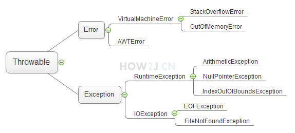

## 异常处理

### try catch

```java
package exception;
 
import java.io.File;
import java.io.FileInputStream;
import java.io.FileNotFoundException;
 
public class TestException {
 
    public static void main(String[] args) {
         
        File f= new File("d:/LOL.exe");
         
        try{
            System.out.println("试图打开 d:/LOL.exe");
            new FileInputStream(f);
            System.out.println("成功打开");
        }
        catch(FileNotFoundException e){
            System.out.println("d:/LOL.exe不存在");
            e.printStackTrace();
        }
         
    }
}
```

### 使用异常的父类进行catch

FileNotFoundException是Exception的子类，使用Exception也可以catch住FileNotFoundException

```java
package exception;
  
import java.io.File;
import java.io.FileInputStream;
import java.io.FileNotFoundException;
  
public class TestException {
  
    public static void main(String[] args) {
          
        File f= new File("d:/LOL.exe");
          
        try{
            System.out.println("试图打开 d:/LOL.exe");
            new FileInputStream(f);
            System.out.println("成功打开");
        }
         
        catch(Exception e){
            System.out.println("d:/LOL.exe不存在");
            e.printStackTrace();
        }
          
    }
}
```

### 多异常捕捉办法1

```java
package exception;
 
import java.io.File;
import java.io.FileInputStream;
import java.io.FileNotFoundException;
import java.text.ParseException;
import java.text.SimpleDateFormat;
import java.util.Date;
 
public class TestException {
 
    public static void main(String[] args) {
 
        File f = new File("d:/LOL.exe");
 
        try {
            System.out.println("试图打开 d:/LOL.exe");
            new FileInputStream(f);
            System.out.println("成功打开");
            SimpleDateFormat sdf = new SimpleDateFormat("yyyy-MM-dd");
            Date d = sdf.parse("2016-06-03");
        } catch (FileNotFoundException e) {
            System.out.println("d:/LOL.exe不存在");
            e.printStackTrace();
        } catch (ParseException e) {
            System.out.println("日期格式解析错误");
            e.printStackTrace();
        }
    }
}
```

### 多异常捕捉办法2

```java
package exception;
 
import java.io.File;
import java.io.FileInputStream;
import java.io.FileNotFoundException;
import java.text.ParseException;
import java.text.SimpleDateFormat;
import java.util.Date;
 
public class TestException {
 
    public static void main(String[] args) {
 
        File f = new File("d:/LOL.exe");
 
        try {
            System.out.println("试图打开 d:/LOL.exe");
            new FileInputStream(f);
            System.out.println("成功打开");
            SimpleDateFormat sdf = new SimpleDateFormat("yyyy-MM-dd");
            Date d = sdf.parse("2016-06-03");
        } catch (FileNotFoundException | ParseException e) {
            if (e instanceof FileNotFoundException)
                System.out.println("d:/LOL.exe不存在");
            if (e instanceof ParseException)
                System.out.println("日期格式解析错误");
 
            e.printStackTrace();
        }
 
    }
}
```

### finally

无论是否出现异常，finally中的代码都会被执行

```java
package exception;
 
import java.io.File;
import java.io.FileInputStream;
import java.io.FileNotFoundException;
 
public class TestException {
 
    public static void main(String[] args) {
         
        File f= new File("d:/LOL.exe");
         
        try{
            System.out.println("试图打开 d:/LOL.exe");
            new FileInputStream(f);
            System.out.println("成功打开");
        }
        catch(FileNotFoundException e){
            System.out.println("d:/LOL.exe不存在");
            e.printStackTrace();
        }
        finally{
            System.out.println("无论文件是否存在， 都会执行的代码");
        }
    }
}
```

### throws

```java
package exception;
 
import java.io.File;
import java.io.FileInputStream;
import java.io.FileNotFoundException;
 
public class TestException {
 
    public static void main(String[] args) {
        method1();
 
    }
 
    private static void method1() {
        try {
            method2();
        } catch (FileNotFoundException e) {
            // TODO Auto-generated catch block
            e.printStackTrace();
        }
 
    }
 
    private static void method2() throws FileNotFoundException {
 
        File f = new File("d:/LOL.exe");
 
        System.out.println("试图打开 d:/LOL.exe");
        new FileInputStream(f);
        System.out.println("成功打开");
 
    }
}
```

### throw和throws的区别

throws与throw这两个关键字接近，不过意义不一样，有如下区别：

1. throws 出现在方法声明上，而throw通常都出现在方法体内。
2. throws 表示出现异常的一种可能性，并不一定会发生这些异常；throw则是抛出了异常，执行throw则一定抛出了某个异常对象。

## 异常的分类

### 可查异常

可查异常： CheckedException
可查异常即**必须进行处理的异常**，要么try catch住,要么往外抛，谁调用，谁处理，比如 FileNotFoundException
如果不处理，编译器，就不让你通过

```java
package exception;
  
import java.io.File;
import java.io.FileInputStream;
import java.io.FileNotFoundException;
  
public class TestException {
  
    public static void main(String[] args) {
          
        File f= new File("d:/LOL.exe");
          
        try{
            System.out.println("试图打开 d:/LOL.exe");
            new FileInputStream(f);
            System.out.println("成功打开");
        }
        catch(FileNotFoundException e){
            System.out.println("d:/LOL.exe不存在");
            e.printStackTrace();
        }
          
    }
}
```

### 运行时异常

运行时异常RuntimeException指： **不是必须进行try catch的异常**
**常见运行时异常:**
除数不能为0异常:ArithmeticException
下标越界异常:ArrayIndexOutOfBoundsException
空指针异常:NullPointerException
在编写代码的时候，依然可以使用try catch throws进行处理，与可查异常不同之处在于，**即便不进行try catch，也不会有编译错误**
Java之所以会设计运行时异常的原因之一，是因为下标越界，空指针这些运行时异常**太过于普遍**，如果都需要进行捕捉，代码的可读性就会变得很糟糕。

```java
package exception;
  
public class TestException {
  
    public static void main(String[] args) {
         
        //任何除数不能为0:ArithmeticException
        int k = 5/0;
         
        //下标越界异常：ArrayIndexOutOfBoundsException
        int j[] = new int[5];
        j[10] = 10;
         
        //空指针异常：NullPointerException
        String str = null;
        str.length();
   }
}
```

### 错误

错误Error，指的是**系统级别的异常**，通常是内存用光了
在**默认设置下**，一般java程序启动的时候，最大可以使用16m的内存
如例不停的给StringBuffer追加字符，很快就把内存使用光了。抛出**OutOfMemoryError**
与运行时异常一样，错误也是不要求强制捕捉的

```java
package exception;
  
public class TestException {
  
    public static void main(String[] args) {
     
        StringBuffer sb =new StringBuffer();
         
        for (int i = 0; i < Integer.MAX_VALUE; i++) {
            sb.append('a');
        }
         
    }
 
}
```

## THROWABLE接口

Throwable是类，Exception和Error都继承了该类
所以在捕捉的时候，也可以使用Throwable进行捕捉
如图： 异常分**Error**和**Exception**
Exception里又分**运行时异常**和**可查异常**。



```java
package exception;
 
import java.io.File;
import java.io.FileInputStream;
 
public class TestException {
 
    public static void main(String[] args) {
 
        File f = new File("d:/LOL.exe");
 
        try {
            new FileInputStream(f);
            //使用Throwable进行异常捕捉
        } catch (Throwable t) {
            // TODO Auto-generated catch block
            t.printStackTrace();
        }
 
    }
}
```

## 自定义异常

### 创建自定义异常

​	一个英雄攻击另一个英雄的时候，如果发现另一个英雄已经挂了，就会抛出EnemyHeroIsDeadException
创建一个类EnemyHeroIsDeadException，并继承Exception
提供两个构造方法

1. 无参的构造方法
2. 带参的构造方法，并调用父类的对应的构造方法

```java
class EnemyHeroIsDeadException extends Exception{
     
    public EnemyHeroIsDeadException(){
         
    }
    public EnemyHeroIsDeadException(String msg){
        super(msg);
    }
}
```

### 抛出自定义异

在Hero的attack方法中，当发现敌方英雄的血量为0的时候，抛出该异常

1. 创建一个EnemyHeroIsDeadException实例
2. 通过**throw** 抛出该异常
3. 当前方法通过 **throws** 抛出该异常

在外部调用attack方法的时候，就需要进行捕捉，并且捕捉的时候，可以通过e.getMessage() 获取当时出错的具体原因

```java
package charactor;
  
public class Hero {
    public String name;
    protected float hp;
 
    public void attackHero(Hero h) throws EnemyHeroIsDeadException{
        if(h.hp == 0){
            throw new EnemyHeroIsDeadException(h.name + " 已经挂了,不需要施放技能" );
        }
    }
 
    public String toString(){
        return name;
    }
     
    class EnemyHeroIsDeadException extends Exception{
         
        public EnemyHeroIsDeadException(){
             
        }
        public EnemyHeroIsDeadException(String msg){
            super(msg);
        }
    }
      
    public static void main(String[] args) {
         
        Hero garen =  new Hero();
        garen.name = "盖伦";
        garen.hp = 616;
 
        Hero teemo =  new Hero();
        teemo.name = "提莫";
        teemo.hp = 0;
         
        try {
            garen.attackHero(teemo);
             
        } catch (EnemyHeroIsDeadException e) {
            // TODO Auto-generated catch block
            System.out.println("异常的具体原因:"+e.getMessage());
            e.printStackTrace();
        }
         
    }
}
```

