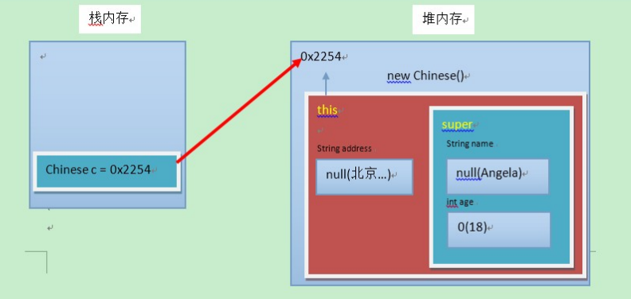

## 1.1 概述

**由来**

多个类中存在相同属性和行为时，将这些内容抽取到单独一个类中，那么多个类无需再定义这些属性和行为，只要 继承那一个类即可。

**定义**

继承：就是子类继承父类的**属性**和**行为**，使得子类对象具有与父类相同的属性、相同的行为。子类可以直接 访问父类中的**非私有**的属性和行为。

**好处**

1.提高代码的复用性。 

2.类与类之间产生了关系，是多态的前提。

## 1.2 继承的格式

通过 `extends `关键字，可以声明一个子类继承另外一个父类，定义格式如下：

```java
class 父类 {
...
}
class 子类 extends 父类 {
...
}
```

继承演示，代码如下：

```java
/*
* 定义员工类Employee，做为父类
*/
class Employee {
    String name; // 定义name属性
    // 定义员工的工作方法
    public void work() {
    	System.out.println("尽心尽力地工作");
    }
}
/*
* 定义讲师类Teacher 继承 员工类Employee
*/
class Teacher extends Employee {
    // 定义一个打印name的方法
    public void printName() {
    	System.out.println("name=" + name);
    }
}
/*
* 定义测试类
*/
public class ExtendDemo01 {
	public static void main(String[] args) {
		// 创建一个讲师类对象
		Teacher t = new Teacher();
        // 为该员工类的name属性进行赋值
        t.name = "小明";
        // 调用该员工的printName()方法
        t.printName(); // name = 小明
        // 调用Teacher类继承来的work()方法
        t.work(); // 尽心尽力地工作
	}
}
```

## 1.3 继承后的特点——成员变量

当类之间产生了关系后，其中各类中的成员变量，又产生了哪些影响呢？

### 成员变量不重名

如果子类父类中出现**不重名**的成员变量，这时的访问是**没有影响**的。代码如下：

```java
class Fu {
    // Fu中的成员变量。
    int num = 5;
}
class Zi extends Fu {
    // Zi中的成员变量
    int num2 = 6;
    // Zi中的成员方法
    public void show() {
        // 访问父类中的num，
        System.out.println("Fu num="+num); // 继承而来，所以直接访问。
        // 访问子类中的num2
        System.out.println("Zi num2="+num2);
    }
}
class ExtendDemo02 {
    public static void main(String[] args) {
        // 创建子类对象
        Zi z = new Zi();
        // 调用子类中的show方法
        z.show();
    }
}
演示结果：
Fu num = 5
Zi num2 = 6
```

### 成员变量重名

如果子类父类中出现**重名**的成员变量，这时的访问是**有影响**的。代码如下：

```java
class Fu {
    // Fu中的成员变量。
    int num = 5;
}
class Zi extends Fu {
    // Zi中的成员变量
    int num = 6;
    public void show() {
        // 访问父类中的num
        System.out.println("Fu num=" + num);
        // 访问子类中的num
        System.out.println("Zi num=" + num);
    }
}
class ExtendsDemo03 {
    public static void main(String[] args) {
        // 创建子类对象
        Zi z = new Zi();
        // 调用子类中的show方法
        z.show();
    }
}
演示结果：
Fu num = 6
Zi num = 6
```

子父类中出现了同名的成员变量时，在子类中需要访问父类中非私有成员变量时，需要使用 super 关键字，修饰 父类成员变量，类似于之前学过的 `this` 。

使用格式：

```java
super.父类成员变量名
```

子类方法需要修改，代码如下：

```java
class Zi extends Fu {
    // Zi中的成员变量
    int num = 6;
    public void show() {
        //访问父类中的num
        System.out.println("Fu num=" + super.num);
        //访问子类中的num
        System.out.println("Zi num=" + this.num);
    }
}
演示结果：
Fu num = 5
Zi num = 6
```

> 小贴士：Fu 类中的成员变量是非私有的，子类中可以直接访问。若Fu 类中的成员变量私有了，子类是不能 直接访问的。通常编码时，我们遵循封装的原则，使用private修饰成员变量，那么如何访问父类的私有成员 变量呢？对！可以在父类中提供公共的getXxx方法和setXxx方法。

## 1.4 继承后的特点——成员方法

当类之间产生了关系，其中各类中的成员方法，又产生了哪些影响呢？

### 成员方法不重名

如果子类父类中出现**不重名**的成员方法，这时的调用是**没有影响的**。对象调用方法时，会先在子类中查找有没有对 应的方法，若子类中存在就会执行子类中的方法，若子类中不存在就会执行父类中相应的方法。代码如下：

```java
class Fu{
    public void show(){
    	System.out.println("Fu类中的show方法执行");
    }
}
class Zi extends Fu{
    public void show2(){
    	System.out.println("Zi类中的show2方法执行");
    }
}
public class ExtendsDemo04{
    public static void main(String[] args) {
        Zi z = new Zi();
        z.show();
        z.show2();
    }
}

```

### 成员方法重名——重写(Override)

如果子类父类中出现重名的成员方法，这时的访问是一种特殊情况，叫做**方法重写 (Override)。**

**方法重写** ：子类中出现与父类一模一样的方法时（返回值类型，方法名和参数列表都相同），会出现覆盖效 果，也称为重写或者复写。**声明不变，重新实现**。

代码如下：

```java
class Fu {
    public void show() {
    	System.out.println("Fu show");
    }
}
class Zi extends Fu {
    //子类重写了父类的show方法
    public void show() {
    	System.out.println("Zi show");
    }
}
public class ExtendsDemo05{
    public static void main(String[] args) {
        Zi z = new Zi();
        // 子类中有show方法，只执行重写后的show方法
        z.show(); // Zi show
    }
}
```

### 重写的应用

子类可以根据需要，定义特定于自己的行为。既沿袭了父类的功能名称，又根据子类的需要重新实现父类方法，从 而进行扩展增强。比如新的手机增加来电显示头像的功能，代码如下：

```java
class Phone {
    public void sendMessage(){
    	System.out.println("发短信");
    }
    public void call(){
    	System.out.println("打电话");
    }
    public void showNum(){
    	System.out.println("来电显示号码");
    }
}
//智能手机类
class NewPhone extends Phone {
    //重写父类的来电显示号码功能，并增加自己的显示姓名和图片功能
    public void showNum(){
        //调用父类已经存在的功能使用super
        super.showNum();
        //增加自己特有显示姓名和图片功能
        System.out.println("显示来电姓名");
        System.out.println("显示头像");
    }
}
public class ExtendsDemo06 {
    public static void main(String[] args) {
        // 创建子类对象
        NewPhone np = new NewPhone()；
        // 调用父类继承而来的方法
        np.call();
        // 调用子类重写的方法
        np.showNum();
    }
}
```

> 小贴士：这里重写时，用到super.父类成员方法，表示调用父类的成员方法。

### 注意事项

1.子类方法覆盖父类方法，必须要保证权限大于等于父类权限。 

2.子类方法覆盖父类方法，返回值类型、函数名和参数列表都要一模一样。

## 1.5 继承后的特点——构造方法

当类之间产生了关系，其中各类中的构造方法，又产生了哪些影响呢？ 

首先我们要回忆两个事情，构造方法的定义格式和作用。

1.构造方法的名字是与类名一致的。所以子类是无法继承父类构造方法的。 

2.构造方法的作用是初始化成员变量的。所以子类的初始化过程中，必须先执行父类的初始化动作。子类的构 造方法中默认有一个 `super() `，表示调用父类的构造方法，父类成员变量初始化后，才可以给子类使用。代 码如下：

```java
class Fu {
    private int n;
    Fu(){
    	System.out.println("Fu()");
    }
}
class Zi extends Fu {
    Zi(){
        // super（），调用父类构造方法
        super();
        System.out.println("Zi（）");
    }
}
public class ExtendsDemo07{
    public static void main (String args[]){
        Zi zi = new Zi();
    }
}
输出结果：
Fu（）
Zi（）
```

## 1.6 super和this

### 父类空间优先于子类对象产生

在每次创建子类对象时，先初始化父类空间，再创建其子类对象本身。目的在于子类对象中包含了其对应的父类空 间，便可以包含其父类的成员，如果父类成员非private修饰，则子类可以随意使用父类成员。代码体现在子类的构 造方法调用时，一定先调用父类的构造方法。理解图解如下：



### super和this的含义

**super ：代表父类的存储空间标识(可以理解为父亲的引用)。**

**this ：代表当前对象的引用(谁调用就代表谁)。**

### super和this的用法

1.访问成员

```java
this.成员变量 ‐‐ 本类的
super.成员变量 ‐‐ 父类的
this.成员方法名() ‐‐ 本类的
super.成员方法名() ‐‐ 父类的
```

用法演示，代码如下：

```java
class Animal {
    public void eat() {
    	System.out.println("animal : eat");
    }
}
class Cat extends Animal {
    public void eat() {
    	System.out.println("cat : eat");
	}
    public void eatTest() {
        this.eat(); // this 调用本类的方法
        super.eat(); // super 调用父类的方法
    }
}
public class ExtendsDemo08 {
    public static void main(String[] args) {
        Animal a = new Animal();
        a.eat();
        Cat c = new Cat();
        c.eatTest();
    }
}
输出结果为：
animal : eat
cat : eat
animal : eat
```

2.访问构造方法

```java
this(...) ‐‐ 本类的构造方法
super(...) ‐‐ 父类的构造方法
```

> 子类的每个构造方法中均有默认的super()，调用父类的空参构造。手动调用父类构造会覆盖默认的super()。 super() 和 this() 都必须是在构造方法的第一行，所以不能同时出现。

## 1.7 继承的特点

1.Java只支持单继承，不支持多继承。

```java
//一个类只能有一个父类，不可以有多个父类。
class C extends A{} //ok
class C extends A，B... //error
```

2.Java支持多层继承(继承体系)。

```java
class A{}
class B extends A{}
class C extends B{}
```

> 顶层父类是Object类。所有的类默认继承Object，作为父类。

3.子类和父类是一种相对的概念。

