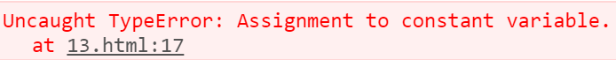

## 作用域

### let关键字

①let声明的变量只在所处于的块级有效

②使用var声明的变量不具备块级作用域特性。

③不存在变量提升(必须先声明后使用)

④暂时性死区

```js
if(true){
    //var声明的变量不具备块级作用域特性
    var a = 5;
    //let声明的变量只在所处于的块级有效
    let b = 10;
    console.log(b);
}
console.log(a);
console.log(b);
```


 **不存在变量提升**

```js
//不存在变量提升
console.log(a);
let a = 5;
```


 **暂时性死区**

```js
//暂时性死区
var num = 10;
var name = "我是name";
if(true){
    //在块级作用域中使用了num关键字
    //num就会和这个块级作用域绑定
    //打印num将不会向上级查找这个变量
    console.log(name);
    console.log(num);
    let num = 20;
}
```


### let经典面试题


### const关键字

①声明常量，常量就是值(内存地址)不能变化的量。即值不能改变

②具有块级作用域

③声明常量时必须赋值(必须有初始值)

④常量赋值后，值不能修改。

```js
if(true){
    //具有块级作用域
    const a = 10;
    if(true){
        //具有块级作用域,与上面的a无关
        const a = 20;
        console.log(a);
    }
    console.log(a);
}
console.log(a);
```


 **声明常量时必须赋值**

```js
//声明常量时必须赋值
const PI;
```


 **常量赋值后，值不能修改**

```js
//常量赋值后，值不能修改。
const PI = 3.14;
PI = 100;
```


```js
//第一种情况：未改变数组地址
const arr = [100,200];
arr[0] = 'a';
arr[1] = 'b';
console.log(arr);
```


 

```js
//第二种情况：改变数组地址
const arr = [100,200];
arr = ['a','b']
console.log(arr);
```



### let、const、var的区别

1.使用var声明的变量，其作用域为该语句所在的函数内，且存在变量提升现象。

2.使用let声明的变量，其作用域为该语句所在的代码块内，不存在变量提升。

3.使用const声明的是常量，在后面出现的代码中不能再修改该常量的值。


