## 什么是BOM

BOM ( Browser Object Model )即浏览器对象模型,它提供了独立于内容而与浏览器窗口进行交互的对象,其核心对象是window。

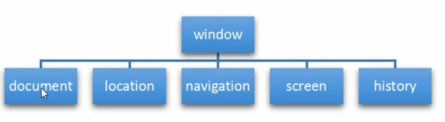

window对象是浏览器的顶级对象,它具有双重角色。

1.它是JS访问浏览器窗口的一个接口。

2.它是一个全局对象。定义在全局作用域中的变量、函数都会变成window对象的属性和方法。

在调用的时候可以省略window ,前面学习的对话框都属于window对象方法,如alert0、prompt0等。

注意: window下的一个特殊属性window.name

```html
<body>
    <script>
        var num = 10;
        //console.log(num);
        console.log(window.num);
        function fn(){
            console.log(11);
        }
        // fn();
        window.fn();
        // alert(11);
        window.alert(11);
    </script>
</body>
```

```js
console.log(window);
```

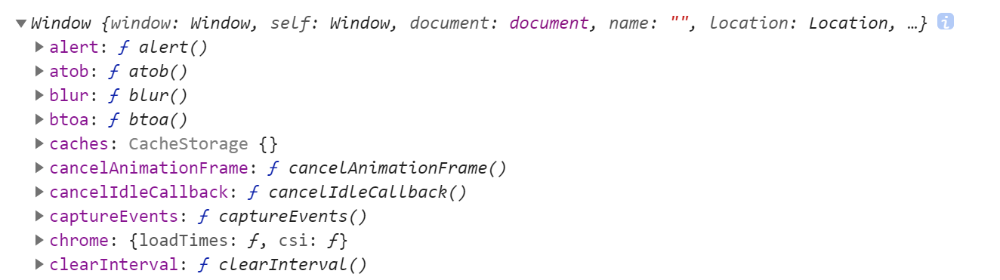

## BOM事件

窗口加载事件(传统方式)

①window.onload是窗口(页面)加载事件,当文档内容完全加载完成会触发该事件(包含图片,css,)

②只能定义一次

```html
<body>
    <script>
        window.onload = function(){
            var btn = document.querySelector('button');
            btn.addEventListener('click',function(){
                console.log('点击我');
            })
        }
    </script>
    <button>点击</button>
</body>
```

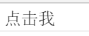

窗口加载事件(推荐方式)

```html
<body>
    <script>
        window.addEventListener('load',function(){
            var btn = document.querySelector('button');
            btn.addEventListener('click',function(){
                console.log('点击我');
            })
        })
        window.addEventListener('load',function(){
            var btn = document.querySelector('button');
            btn.addEventListener('click',function(){
                console.log('再次点击我');
            })
        })
    </script>
    <button>点击</button>
</body>
```

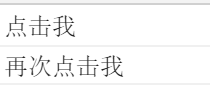

DOM加载完毕就执行(不包含flash,css,图片)

```html
<script>
    document.addEventListener('DOMContentLoaded',function(){
        console.log(66);
    })
</script>
```

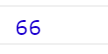

调整窗口大小事件

①当调整浏览器窗口大小时就会触发

```html
<body>
    <script>
        window.addEventListener('resize',function(){
            console.log(window.innerWidth);
            console.log('变化了');
        })
    </script>
</body>
```

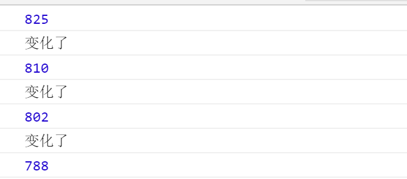

## 定时器

### setTimeout

**window.setTimeout()**

①两秒后执行

```js
//1.window可以省略
//1.2秒后调用这个函数
setTimeout(function() {
    console.log('时间到了');
}, 2000);
```

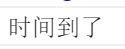

②另一种写法

```js
//第二种方法
function calback(){
    console.log('爆炸');
}
setTimeout(calback,3000)
```

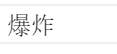

③取一个名字

```js
function calback(){
    console.log('爆炸');
}
var timer1 = setTimeout(calback,3000);
var timer2 = setTimeout(calback,2000);
```

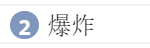

6.停止setTimeout()定时器

window.clearTimeout(timer)

```js
var timer = setTimeout(function calback(){
    console.log('爆炸');
}, 2000);
//清除定时器
clearTimeout(timer);
```


### setInterval

7.定时器间隔时间执行

```html
<script>
    setInterval(function(){
        console.log('持续输出');
    }, 1000);
</script>
```

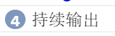

8.倒计时效果

```html
<body>
    <div>
        <span class="hour">1</span>
        <span class="minute">2</span>
        <span class="second">3</span>
    </div>
    <script>
        // 1.获取元素
        var hour = document.querySelector('.hour');
        var minute = document.querySelector('.minute');
        var second = document.querySelector('.second');
        var inputTime = +new Date('2020-12-17 23:00:00'); //用户输入时间总的毫秒数
        //先调用一次
        countDown();
        //开启定时器
        setInterval(countDown, 1000);
        function countDown() {
            var nowTime = +new Date(); // 返回的是当前时间总的毫秒数
            var times = (inputTime - nowTime) / 1000; // times是剩余时间总的秒数 
            var h = parseInt(times / 60 / 60 % 24); //时
            h = h < 10 ? '0' + h : h;
            hour.innerHTML = h; // 把剩余的小时给 小时黑色盒子
            var m = parseInt(times / 60 % 60); // 分
            m = m < 10 ? '0' + m : m;
            minute.innerHTML = m;
            var s = parseInt(times % 60); // 当前的秒
            s = s < 10 ? '0' + s : s;
            second.innerHTML = s;
        }
    </script>
</body>
```


9.清除定时器

```html
<body>
    <button class="begin">开启定时器</button>
    <button class="stop">停止定时器</button>
    <span>50</span>
    <script>
        var begin = document.querySelector('.begin');
        var stop = document.querySelector('.stop');
        var span = document.querySelector('span');
        var timer = null;
        //开启定时器
        begin.addEventListener('click',function(){
          timer = setInterval(function(){
            span.innerText --;
          },1000)  
        })
        stop.addEventListener('click',function(){
            clearInterval(timer);
        })
    </script>
</body>
```

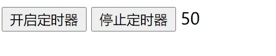

### 案例：模仿发送验证码

```html
<body>
    手机号：<input type="text"> <button>发送</button>
    <script>
        var btn = document.querySelector('button');
        var timer = null;
        var time = 3; 
        btn.addEventListener('click',function(){
            //禁用按钮
            btn.disabled = true;
            timer = setInterval(function(){
                if(time == 0){
                    clearInterval(timer);
                    btn.disabled = false;
                    btn.innerHTML = '发送';
                    time = 3;
                }else{
                    btn.innerHTML = '还剩下'+time+'秒'
                    time--;
                }
            }, 1000);
        })
    </script>
</body>
```

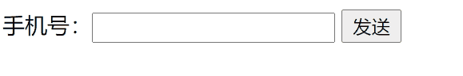

## location对象

5.2 URL 统一资源定位符(Uniform Resource Locator, URL)是互联网上标准资源的地址。互联网上的每个文件都有

一个唯一的URL ,它包含的信息指出文件的位置以及浏览器应该怎么处理它。

URL的一般语法格式为:

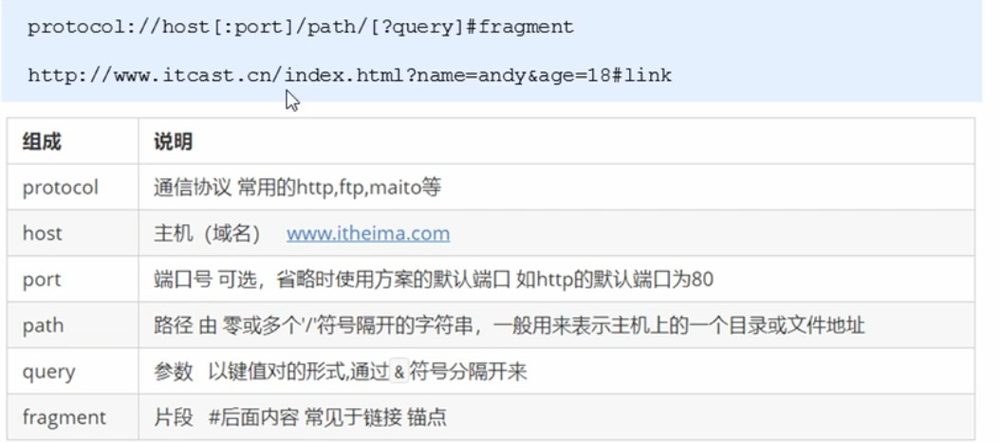

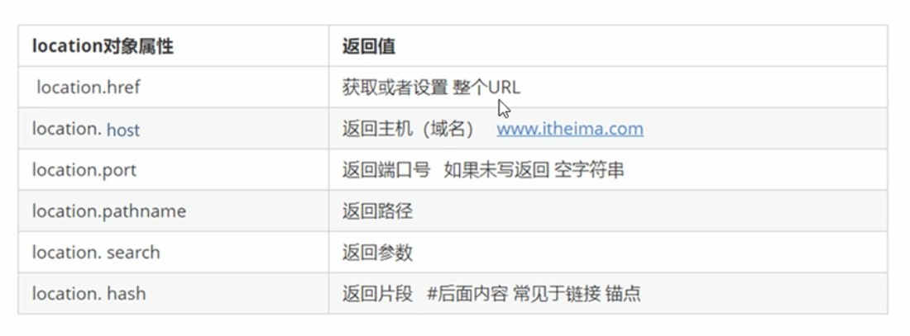

 

```js
console.log(location);
```

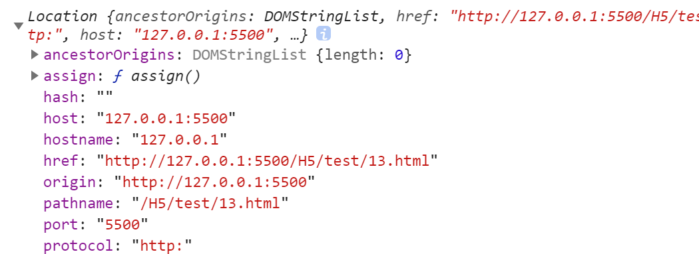

 

```js
console.log(location.href);
```

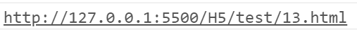

12.获取url参数

```html
<body>
    <script>
        console.log(location.search); 
        //1.去掉?
        var params = location.search.substr(1); //从第一位置开始截取
        console.log(params);
        //2.利用=把字符串分割为数组
        var arr = params.split('=');
        console.log(arr);
    </script>
```

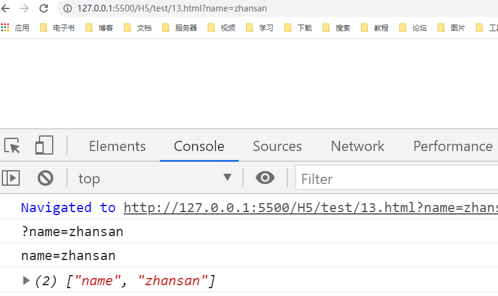

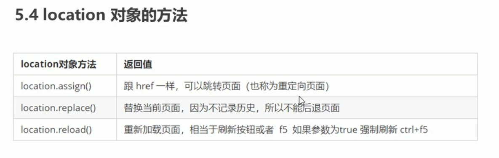

```html
<body>
    <script>
        //记录历史有后退功能
        location.assign('http://www.baidu.com');
        //不记录历史没有后退功能
        location.replace('http://www.baidu.com')
        //相当于重新加载
        location.reload();
    </script>
</body>
```

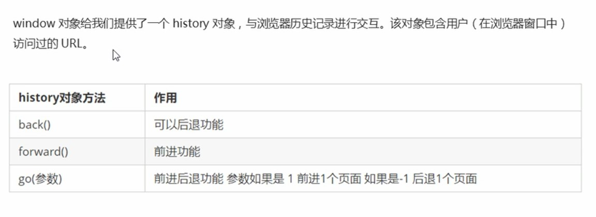

```html
<body>
    <script>
        //后退
        history.back();
        //前进
        history.forward();
        //前进两步
        history.go(2);
        //后退一步
        history.go(-1);
    </script>
</body>
```