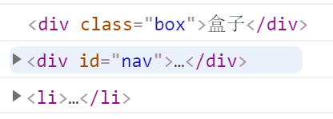
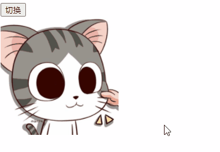

## 获取节点

### 通过id获取元素

```html
<body>
    <div id="time">2020-12-12</div>
</body>
<script>
    var timer = document.getElementById('time');
    console.log(timer);
</script>
```


### 通过标签名获取元素

```html
<body>
    <li>BAIDU</li>
    <li>TAOBAO</li>
    <li>TENXUN</li>
</body>
<script>
    var lis = document.getElementsByTagName('li');
    console.dir(lis);
    for(var i = 0;i < lis.length;i++){
        console.log(lis[i]);
    }
</script>
```


**获取ol下的li**

```html
<body>
    <ol id="ol">
        <li>BAIDU</li>
        <li>TAOBAO</li>
        <li>TENXUN</li>
    </ol>
</body>
<script>
    var ol = document.getElementById('ol');
    console.log(ol.getElementsByTagName('li'));
</script>
```


### 通过类名获取元素

```html
<body>
    <div class="box">盒子</div>
    <div class="box">盒子</div>
</body>
<script>
    var boxs = document.getElementsByClassName('box');
    console.log(boxs);
</script>
```


### querySelector选择第一个元素

```html
<body>
    <div class="box">盒子</div>
    <div class="box">盒子</div>
    <div id="nav">
        <ul>
            <li>首页</li>
            <li>产品</li>
        </ul>
    </div>
</body>
<script>
    //指定选择器第一个元素
    var firstBox = document.querySelector('.box');
    console.log(firstBox);
    var nav = document.querySelector('#nav');
    console.log(nav);
    var li = document.querySelector('li');
    console.log(li);
</script>
```



### querySelectorAll选择所有元素

```js
var boxs = document.querySelectorAll('.box');
var lis = document.querySelectorAll('li');
console.log(boxs);
console.log(lis);
```


### 获取body和html元素

```js
var bodyEle = document.body;
var htmlEle = document.documentElement;
console.log(bodyEle);
console.log(htmlEle);
```


## 节点内容

9.innerText和innerHTML

```html
<body>
    <div></div>
    <p>hello</p>
    <script>
        var div = document.querySelector('div');
        var p = document.querySelector('p');
        p.innerText = '你好'
        div.innerHTML = "<h2>HTML</h2>"
    </script>
</body>
```


 

```html
<body>
    <div>
        <p>hello</p>
        <p>world</p>
    </div>
    <script>
        var div = document.querySelector('div');
        console.log(div.innerText);
        console.log(div.innerHTML);
    </script>
</body>
```


## 修改元素的属性

```html
<body>
    <button>切换</button>
    
    <script>
        var btn = document.querySelector('button');
        var img = document.querySelector('img');
        btn.onclick = function(){
            img.src = "img/2.jpg"
            img.title = "蜡笔小新"
        }
    </script>
</body>
```



## 修改样式

注意:

1.JS里面的样式采取驼峰命名法比如fontSize、backgroundColor

2.JS修改style样式操作，产生的是行内样式，css权重比较高

```html
<body>
    <div></div>
    <script>
        var div = document.querySelector('div');
        div.onclick = function(){
            this.style.backgroundColor = "purple";
            this.style.width = "300px";
        }
    </script>
</body>
```


## 文本显示隐藏(焦点事件)

```html
<body>
    <input type="text" value="手机">
    <script>
        var text = document.querySelector('input');
        //获得焦点事件
        text.onfocus = function(){
            if(text.value == '手机'){
                this.value = '';
            }
            this.style.color = '#333';
        }
        //失去焦点
        text.onblur = function(){
            if(text.value.trim() === ''){
                this.value = '手机';
                this.style.color = '#999';
            }
        }
    </script>
</body>
```


## 修改类名

```html
<body>
    <div>文本</div>
    <script>
        var div = document.querySelector('div');
        div.onclick = function(){
            //修改类名
            this.className = 'change'
        }
    </script>
</body>
```


## 添加移除类名

```js
//添加类名
this.classList.add('change');
//异常类名
this.classList.remove('base');
```

## 获取自定义属性值

①element.id 只能获取自带的属性

②element.getAttribute可以获取自带属性和自定义属性

```html
<body>
    <div @click="change" index="1">文本</div>
    <script>
        var div = document.querySelector('div');
        console.log(div.getAttribute("@click"));
        console.log(div.getAttribute("index"));
    </script>
</body>
```


## 设置自定义属性值

①element.id 只能设置自带的属性

②element.setAttribute 可以设置自带属性和自定义属性

③H5自定义属性规范`data-index="1"`

```html
<body>
    <div index="1" class="nav">文本</div>
    <script>
        var div = document.querySelector('div');
        div.setAttribute('index',2);
        div.className = "nav1";
        div.setAttribute('class','nav2');
    </script>
</body>
```


## 移除属性值

②element.removeAttribute 移除自定义属性

```html
<body>
    <div index="1" class="nav">文本</div>
    <script>
        var div = document.querySelector('div');
        div.removeAttribute('index');
    </script>
</body>
```


## H5新增的获取自定义属性的方法

①div.dataset.index 获取自定义属性

```html
<body>
    <div data-index="2" data-time="20" data-list-name="andy">文本</div>
    <script>
        var div = document.querySelector('div');
        // dataset 是一个集合里面存放了所有以data开头的自定义属性
        console.log(div.dataset);
        console.log(div.dataset.index);
        console.log(div.dataset['index']);
        //属性中有多个-链接的单词，采用驼峰命名法
        console.log(div.dataset.listName);
        console.log(div.dataset['listName']);
    </script>
</body>
```


## 节点概述

一般地，节点至少拥有nodeType(节点类型 ) 、nodeName(节点名称）和nodeValue(节点值)这三个基本属性。

①元素节点nodeType为1

②属性节点nodeType为2

③文本节点nodeType为3 (文本节点包含文字、空格、换行等)

```html
<body>
    <div id="box">文本</div>
    <script>
        var div = document.querySelector('#box');
        console.dir(div);
    </script>
</body>
```


## 节点层次


## 获取父节点

```html
<body>
    <div id="box">
        <span class="erweima"></span>
    </div>
    <script>
        var erweima = document.querySelector('.erweima');
        //得到的是离元素最近的父节点
        console.log(erweima.parentNode);
    </script>
</body>
```


## 获取所有子节点(包含空格)

```html
<body>
    <ul>
        <li></li>
        <li></li>
        <li></li>
    </ul>
    <script>
        var ul = document.querySelector("ul");
        // 子节点 childNodes 所有的子节点 包含 元素节点 文本节点等等
        console.log(ul.childNodes);
    </script>
</body>
```


 

```js
console.log(ul.childNodes[0].nodeType); //3文本节点
console.log(ul.childNodes[1].nodeType); //1元素节点
```


## 获取所有子元素节点(不包含空格)

①element.children 获取子节点

```html
<body>
    <ul>
        <li></li>
        <li></li>
        <li></li>
    </ul>
    <script>
        var ul = document.querySelector("ul");
        // 获取子元素节点，实际开发常用
        console.log(ul.children);
    </script>
</body>
```


## 获取第一个和最后一个节点(不分文本元素节点)

```html
<body>
    <ul>
        <li>我是li1</li>
        <li>我是li2</li>
        <li>我是li3</li>
    </ul>
    <script>
        var ul = document.querySelector("ul");
        // 获取第一个子节点 不管是文本节点还是元素节点
        console.log(ul.firstChild);
        // 获取最后一个子节点 不管是文本节点还是元素节点
        console.log(ul.lastChild);
    </script>
</body>
```


## 获取第一个和最后一个元素节点(有兼容性问题IE9+)

```html
<body>
    <ul>
        <li>我是li1</li>
        <li>我是li2</li>
        <li>我是li3</li>
    </ul>
    <script>
        var ul = document.querySelector("ul");
        // 获取第一个子元素节点
        console.log(ul.firstElementChild);
        // 获取最后一子元素节点
        console.log(ul.lastElementChild);
    </script>
</body>
```


## 获取第一个和最后一个元素节点(无兼容性问题)

```html
<body>
    <ul>
        <li>我是li1</li>
        <li>我是li2</li>
        <li>我是li3</li>
    </ul>
    <script>
        var ul = document.querySelector("ul");
        // 获取第一个子元素节点
        console.log(ul.children[0]);
        // 获取最后一子元素节点
        console.log(ul.children[ul.children.length - 1]);
    </script>
</body>
```


## 获取兄弟节点(不分文本元素节点)

```html
<body>
    <div>我是div</div>
    <span>我是span</span>
    <script>
        var div = document.querySelector("div");
        //获取下一个兄弟节点 包含空格字符换行
        console.log(div.nextSibling);
        //获取上一个兄弟节点 包含空格字符换行
        console.log(div.previousSibling);
    </script>
</body>
```

## 获取兄弟节点(有兼容性问题IE9+)

```html
<body>
    <span>我是上</span>
    <div>我是div</div>
    <span>我是span</span>
    <script>
        var div = document.querySelector("div");
        //获取下一个兄弟节点
        console.log(div.nextElementSibling);
        //获取上一个兄弟节点
        console.log(div.previousElementSibling);
    </script>
</body>
```

## 获取兄弟节点(无兼容性问题)

```html
<body>
    <span>我是上</span>
    <div>我是div</div>
    <span>我是span</span>
    <script>
        function getNextElementSibling(element){
            var el = element;
            while(el = el.nextSibling){
                if(el.nodeType === 1){
                    return el;
                }
            }
            return null;
        }
        var div = document.querySelector("div");
        //获取下一个兄弟节点
        console.log(getNextElementSibling(div));
    </script>
</body>
```


## 创建节点和添加节点元素

```html
<body>
    <ul>
        <li>123</li>
    </ul>
    <script>
        // 1.创建节点元素节点
        var li = document.createElement('li');
        var lili = document.createElement('li');
        // 2.后面添加节点
        var ul = document.querySelector('ul');
        ul.appendChild(li);
        // 3.前面添加元素
        ul.insertBefore(lili,ul.children[0]);
    </script>
</body>
```


## 删除节点

```html
<body>
    <ul>
        <li>第一个元素</li>
        <li>第二个元素</li>
        <li>第三个元素</li>
    </ul>
    <script>
        var ul = document.querySelector("ul");
        // 删除元素
        ul.removeChild(ul.children[0]);
    </script>
</body>
```


## 复制节点

node..cloneNode()

注意:

①如果括号参数为空或者为false ,则是浅拷贝,即只克隆复制节点本身,不克隆里面的子节点。

```html
<body>
    <ul>
        <li>1</li>
        <li>2</li>
        <li>3</li>
    </ul>
    <script>
        var ul = document.querySelector("ul");
        //克隆节点:浅拷贝
        var lili = ul.children[0].cloneNode();
        //添加到最后
        ul.appendChild(lili)
    </script>
</body>
```


 

```html
<body>
    <ul>
        <li>1</li>
        <li>2</li>
        <li>3</li>
    </ul>
    <script>
        var ul = document.querySelector("ul");
        //克隆节点:深拷贝
        var lili = ul.children[0].cloneNode(true);
        //添加到最后
        ul.appendChild(lili)
    </script>
</body>
```


## 三种动态创建元素的区别

● document. write()

● element . inner HTML

● document. createElement ()

区别

\1. document .write是直接将内容写入页面的内容流,但是文档流执行完毕,则它会导致页面全部重绘

\2. innerHTML 是将内容写入某个DOM节点,不会导致页面全部重绘

\3. innerHTML 创建多个元素效率更高(不要拼接字符串,采取数组形式拼接) , 结构稍微复杂

\4. createElement() 创建多个元素效率稍低一点点 ,但是结构更清晰

总结:不同浏览器下, innerHTML效率要比creatElement高

```html
<body>
    <button>点击</button>
    <p>abc</p>
    <script>
        // 三种创建元素方式区别
        var btn = document.querySelector('button');
        btn.onclick = function(){
            document.write('<div>123</div>');
        }
    </script>
</body>
```


## 注册事件

给元素添加事件,称为注册事件或者绑定事件。

注册事件有两种方式:传统方式和方法监听注册方式 

### 传统注册方式

```html
<body>
    <button>传统注册事件</button>
    <button>方法监听注册事件</button>
    <script>
        var btns = document.querySelectorAll('button');
        btns[0].onclick = function(){
            alert('hi');
        }
        btns[0].onclick = function(){
            alert('hello');
        }
    </script>
</body>
```


### 方法监听注册方式

●特点:同一个元素同一个事件可以注册多个监听器

●按注册顺序依次执行

eventTarget .addEventListener ()方法将指定的监听器注册到eventTarget (目标对象)上,当该对象触发指定的事件时, 就会执行事件处理函数。

该方法接收三个参数:

●type :事件类型字符串,比如click、mouseover ,注意这里不要带on

●listener :事件处理函数,事件发生时,会调用该监听函数

●useCapture :可选参数,是一个布尔值,默认是false。学完DOM事件流后,我们再进一步学习

```html
<body>
    <button>传统注册事件</button>
    <button>方法监听注册事件</button>
    <script>
        var btns = document.querySelectorAll('button');
        // 2.事件侦听注册事件,同一个事件可以添加多次
        btns[1].addEventListener('click',function(){
            alert(22);
        })
    </script>
</body>
```


## 删除事件(解绑事件)

2.1删除事件的方式

1.传统注册方式

`eventTarget. onclick = null;`

2.方法监听注册方式

`eventTarget. removeEventListener (type, listener[, useCapture]) ;`

###  传统注册方式

```html
<body>
    <div>1</div>
    <div>2</div>
    <div>3</div>
    <script>
        var divs = document.querySelectorAll('div');
        divs[0].onclick = function(){
            alert(11);
            //传统方式删除事件
            this.onclick = null;
        }
    </script>
</body>
```


###  方法监听注册方式

```html
<body>
    <div>1</div>
    <div>2</div>
    <div>3</div>
    <script>
        var divs = document.querySelectorAll('div');
        
        // 1.添加事件
        divs[0].addEventListener('click',fn);
        function fn(){
            alert(11);
            // 2.移除事件
            divs[0].removeEventListener('click',fn);
        }
    </script>
</body>
```


## 事件的捕获阶段

①JS代码只能执行捕获或者冒泡其中一个阶段

②onclick只能得到冒泡阶段

③捕获阶段 如果addEventListener 第三个参数是true 那么处于捕获阶段 

④ document -> html -> body ->father -> son

```html
<body>
    <div class="father">
        <div class="son">son盒子</div>
    </div>
    <script>
        // 1.JS代码只能执行捕获或者冒泡其中一个阶段
        // 2.onclick只能得到冒泡阶段
        // 3.捕获阶段 如果addEventListener 第三个参数是true 那么处于捕获阶段 
        // document -> html -> body ->father -> son
        var son = document.querySelector('.son');
        var father = document.querySelector('.father');
        son.addEventListener('click',function(){
            alert('son')
        },true)
        father.addEventListener('click',function(){
            alert('father')
        },true)
    </script>
</body>
```


## 事件冒泡阶段

①实际开发中我们很少使用事件捕获,我们更关注事件冒泡。

②有些事件是没有冒泡的,比如onblur onfocus onmouseenter onmouseleave

③冒泡阶段 如果addEventListener第三个参数是false或者省略，则处于冒泡阶段

④ son -> father -> body -> html ->document

```html
<body>
    <div class="father">
        <div class="son">son盒子</div>
    </div>
    <script>
        //冒泡阶段 如果addEventListener第三个参数是false或者省略，则处于冒泡阶段
        //son -> father -> body -> html ->document
        var son = document.querySelector('.son');
        var father = document.querySelector('.father');
        son.addEventListener('click',function(){
            alert('son')
        },false)
        father.addEventListener('click',function(){
            alert('father')
        },false)
    </script>
</body>
```


## 事件对象

①event 就是一个事件对象 写到我们侦听函数的小括号里面

②事件对象只有有了事件才会存在。系统自动创建的

③包含了事件信息鼠标就包含鼠标相关信息，键盘就包含键盘相关信息

```html
<body>
    <div>123</div>
    <script>
        //事件对象
        var div = document.querySelector('div');
        div.onclick = function(event){
            console.log(event);
        }
    </script>
</body>
```


### 事件对象属性target

①e.target 返回的是触发事件的对象(元素)

②this 返回的是绑定事件的对象(元素)

```html
<body>
    <ul>
        <li>------</li>
        <li>------</li>
        <li>------</li>
    </ul>
    <script>
        var ul = document.querySelector('ul');
        ul.addEventListener('click',function(e){
            // e.target 返回的是触发事件的对象(元素)
            console.log(e.target);
            // this 返回的是绑定事件的对象(元素)
            console.log(this);
        })
    </script>
</body>
```


### 事件对象属性事件类型type

```html
<body>
    <div></div>
    <script>
        var div = document.querySelector('div');
        div.addEventListener('click',fn);
        div.addEventListener('mouseover',fn);
        div.addEventListener('mouseout',fn);
        
        function fn(e){
            //事件类型
            console.log(e.type);
        }
    </script>
</body>
```


## 阻止默认行为

①阻止默认行为(事件) 让链接不跳转 或者让按钮不提交

②阻止默认行为 `e.preventDefault(); `方法

③低版本浏览器 ie678 `returnValue`属性

④我们可以利用`return false`也能阻止默认行为

```html
<body>
    <a href="http://www.baidu.com">百度</a>
    <script>
        // 阻止默认行为(事件) 让链接不跳转 或者让按钮不提交
        var a = document.querySelector('a');
        a.addEventListener('click',function(e){
            //阻止默认行为 e.preventDefault(); 方法
            e.preventDefault();
            //低版本浏览器 ie678 returnValue属性
            //e.returnValue;
            //我们可以利用return false也能阻止默认行为
            //return false;
        })
    </script>
</body>
```


## 阻止冒泡事件

①事件冒泡:开始时由最具体的元素接收,然后逐级向.上传播到到DOM最顶层节点。

②标准写法:利用事件对象里面的e.stopPropagation()方法

②IE678写法:利用事件对象里面的e.cancelBubble = true;

```html
<body>
    <div class="father">
        <div class="son">son盒子</div>
    </div>
    <script>
        var son = document.querySelector('.son');
        var father = document.querySelector('.father');
        son.addEventListener('click',function(e){
            alert('son');
            //阻止冒泡标准写法
            e.stopPropagation();
        },false)
        father.addEventListener('click',function(e){
            alert('father')
        },false)
    </script>
</body>
```


## 事件委托(代理、委托)

①事件冒泡本身的特性,会带来的坏处,也会带来的好处,需要我们灵活掌握。

②事件委托的原理：不是每个子节点单独设置事件监听器,而是事件监听器设置在其父节点上,然后利用冒泡原理影响设置每个子节点。

③事件委托的作用：我们只操作了一次 DOM ,提高了程序的性能。

```html
<body>
    <ul>
        <li>1</li>
        <li>2</li>
        <li>3</li>
    </ul>
    <script>
        var ul = document.querySelector('ul');
        ul.addEventListener('click',function(e){
            //e.target会获取被点击得元素
            e.target.style.backgroundColor = 'pink'
        })
    </script>
</body>
```


## 鼠标事件

### 点击事件

```html
<body>
    <button id="btn">按钮</button>
    <script>
        var btn = document.querySelector('#btn');
        btn.onclick = function(){
            console.log('被点击了');
        }
    </script>
</body>
```


### 文字事件

**禁止选中文字和禁止选中右键菜单**

```html
<body>
    我是一段不愿意分享得文字
    <script>
        // 1.contextmenu 我们可以禁用右键菜单
        document.addEventListener('contextmenu',function(e){
            e.preventDefault();
        })
        // 2.禁止选中文字 selectstart
        document.addEventListener('selectstart',function(e){
            e.preventDefault();
        })
    </script>
</body>
```

### 坐标

**返回鼠标相对于浏览器窗口可视区的坐标**

```html
<body>
    <script>
        // 鼠标事件对象 MouseEvent
        document.addEventListener('click',function(e){
            //client 鼠标在可视区得x和y坐标
            console.log(e.clientX);
            console.log(e.clientY);
        })
    </script>
</body>
```


### 

**返回鼠标相对于文档页面的X坐标**

```html
<body>
    <script>
        // 鼠标事件对象 MouseEvent
        document.addEventListener('click',function(e){
            //page鼠标在页面文档得x和y坐标
            console.log(e.pageX);
            console.log(e.pageY);
        })
    </script>
</body>
```


**返回鼠标相对于电脑屏幕的X坐标**

```html
<body>
    <script>
        // 鼠标事件对象 MouseEvent
        document.addEventListener('click',function(e){
            //screen鼠标距离屏幕得x和y坐标
            console.log(e.screenX);
            console.log(e.screenY);
        })
    </script>
</body>
```

**小天使跟随鼠标**

```html
<style>
    img{
        position: absolute;
    }
</style>
<body>
    
    <script>
        var pic = document.querySelector('img');
        document.addEventListener('mousemove',function(e){
            //mousemove 只有移动1px就会触发
            var x = e.pageX;
            var y = e.pageY;
            pic.style.left = x - 30 + 'px';
            pic.style.top = y - 40 + 'px';
        })
    </script>
</body>
```


## 键盘事件

①keyup 按键弹起得时候触发

②keydown 按键按下得时候发

③keypress 按键按下时触发 不识别功能键

⑤触发顺序 keydown -> keypress ->keyup

```html
<body>
    <script>
        //1.keyup 按键弹起得时候触发
        document.addEventListener('keyup',function(){
            console.log('我弹起了');
        })
        //2.keydown 按键按下得时候发
        document.addEventListener('keydown',function(){
            console.log('我按下了');
        })
        //3.keypress 按键按下时触发 不识别功能键
        document.addEventListener('keypress',function(){
            console.log("按下press");
        })
    </script>
</body>
```

### keycode判断按下的键

①获取按键ascall码值，不区分大小写

②keypress 事件 区分字母大小写

```html
<body>
    <script>
        //1.keyup 按键弹起得时候触发
        document.addEventListener('keyup',function(e){
            console.log(e);
            //获取按键ascall码值，不区分大小写
            console.log('up:'+e.keyCode);
        })
        //2.keypress 事件 区分字母大小写 a和A得到得都是65
        document.addEventListener('keypress',function(e){
            //区分大小写
            console.log('keypress'+e.keyCode);
        })
    </script>
</body>
```


### 案例

按s键输入框获得焦点

```html
<body>
    <input type="text">
    <script>
        var search = document.querySelector('input');
        document.addEventListener('keyup',function(e){
            if(e.keyCode === 83){
                search.focus();
            }
        })
    </script>
</body>
```

