## 箭头函数

### 案例一

```js
const fn = function(){
    console.log("hello");
}
fn();
```

**简化后**

```js
const fn = () =>{
    console.log("hello");
}
fn();
```

### 案例二

**函数体中只有一句代码，且代码的执行结果就是返回值，可以省略大括号**

```js
//函数体中只有一句代码，且代码的执行结果就是返回值，可以省略大括号
const sum = function(num1,num2){
    return num1 + num2;
}
```

简化第一步

```js
const sum = (num1,num2) =>{
    return num1 + num2;
}
```

简化第二部

```js
const sum = (num1,num2) =>num1 + num2;
```

### 案例三

**如果形参只有一个，可以省略小括号**

```js
const fn = function(v){
    console.log(v);
}
fn(2);
```

简化第一步

```js
const fn = (v) =>{
    console.log(v);
}
```

简化第二步

```js
//一个参数小括号可以省略
const fn = v =>{
    console.log(v);
}
```

### 箭头函数面试题

```js
var obj = {
    age: 20,
    say: () =>{
         console.log(this);
    }
}
obj.say();
```

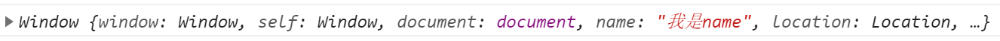

分析：箭头函数没有自己的this,say方法中的this就是obj里的this，而obj对象是被window调用的所以this是window

不使用箭头函数时有自己的this

```js
var obj = {
    age: 20,
    say: function(){
         console.log(this);
    }
}
obj.say();
```

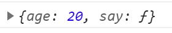

## 函数的定义方式

### 命名函数

```js
//1.自定义函数(命名函数)
function fn(){
}
```

### 匿名函数

```js
//2. 函数表达式(匿名函数)
var fun = function(){
    
}
```

### Function关键字

```js
//3.利用 Function('参数1','参数2','函数体')
//一个参数就是函数体
var f = new Function('console.log(123)')
f();
```

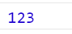

 

```js
//3.利用 Function('参数1','参数2','函数体')
var f = new Function('a','b','console.log(a+b)')
f(1,3);
```

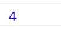

4.重点

①所有函数都是Function的实例(对象)

②函数也属于对象

```js
var f = new Function('a','b','console.log(a+b)')
console.dir(f);
console.log(f instanceof Object)
```

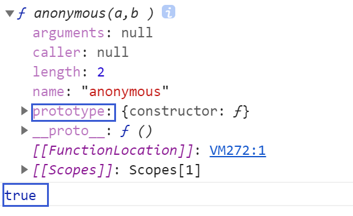

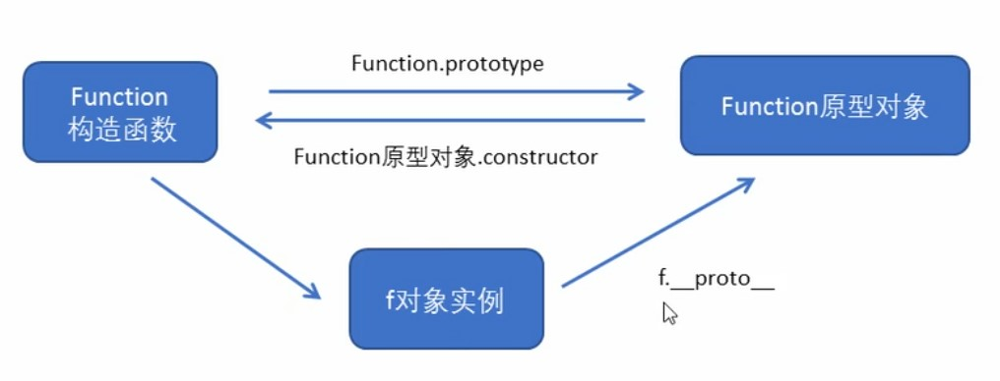

## 函数的调用方式

```js
// 1.普通函数
function fn(){
    console.log('普通函数');
}
fn();
// 2.对象的方法
var o = {
    sayHi:function(){
        console.log('普通函数'); 
    }
}
o.sayHi();
// 3.构造函数
function Star(){
}
new Star();
//4.绑定事件函数
btn.onclick = function(){}; //点击了按钮调用
//5.定时器函数
setInterval(function(){},1000);
//6.立即执行函数:自动调用
(function(){
    console.log('人生的巅峰');
})()
```

## this的指向问题

这些this的指向，是当我们调用函数的时候确定的。调用方式的不同决定了this的指向不同一般指向我们的调用者.

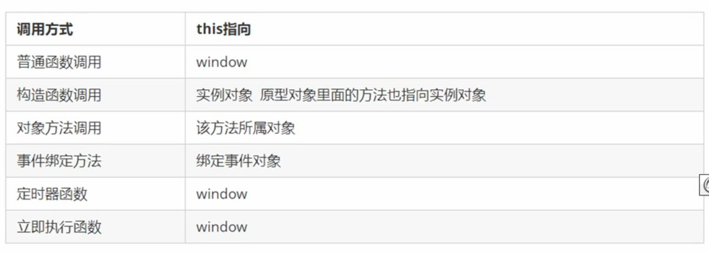

### 普通函数

```js
// 1.普通函数 this指向window
function fn(){
    console.log('普通函数'+this);
}
//实际是window.fn();
fn();
```

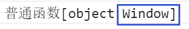

### 对象的方法

```js
//2.对象的方法 this指向的是对象o
var o = {
    sayHi:function(){
        console.log('对象方法的this' + this); 
    }
}
o.sayHi();
```

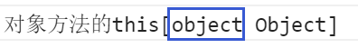

### 构造函数

```js
// 3.构造函数 this 指向 ldh 这个实例对象
function Star(){
    
}
var ldh = new Star();
```

### 绑定事件函数

```js
//4.绑定事件函数 this 指向函数的调用者
btn.onclick = function(){}; //点击了按钮调用
```

### 定时器函数

```js
//5.定时器函数 this指向window
setInterval(function(){
    console.log('定时器this:' + this);
},1000);
```

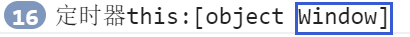

### 立即执行函数

```js
//6.立即执行函数:自动调用 this执行window
(function(){
    console.log('自动执行函数:'+this);
})()
```


## 改变函数的指向

### call方法

```js
var o = {
    name : 'andy'
}
function fn(){
    console.log(this)
}
//让fn的this指向o
fn.call(o);
```

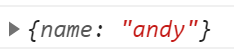

### apply方法

```js
var o = {
    name : 'andy'
}
function fn(arr){
    console.log(this)
    console.log(arr)
}
// 1.可以调用函数,改变this的指向
// 2.他的参数必须是数组
fn.apply(o,['red'])
```

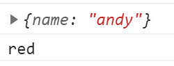

**apply借助数学内置对象求最大最小值**

```js
var arr = [1,66,3,99,4];
var max = Math.max.apply(Math,arr);
console.log(max)
```

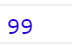

### bind方法

```js
var o = {
    name : 'andy'
}
function fn(){
    console.log(this)
}
//1.bind方法不调用
//2.返回的原函数修改this之后产生的新函数
var f = fn.bind(o);
f();
```

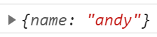

**bind的应用**

```js
var btn = document.querySelector('button');
btn.onclick = function(){
    //禁用按钮
    this.disabled = true; //这个this指向btn这个按钮
    setTimeout(function(){
        this.disabled = false;
    }.bind(this), 3000); //改变函数的this指向为btn
}
```

8.call apply bind总结

相同点:

都可以改变函数内部的this指向.

区别点:

1. call和apply 会调用函数,并且改变函数内部this指向.

2. call和apply传递的参数不一样, call传递参数aru1, aru2..形式 apply必须数组形式[arg]

3. bind不会调用函数,可以改变函数内部this指向.

主要的应用场景

1. call经常做继承.

2. apply经常跟数组有关系.比如借助于数学对象实现数组最大值最小值

3. bind 不调用函数,但是还想改变this指向.比如改变定时器内部的this指向.

**9.严格模式下this指向问题**

①以前在全局作用域函数中的this指向window对象。

②严格模式下全局作用域中函数中的this是undefined。

③以前构造函数时不加new也可以调用,当普通函数，this指向全局对象

④严格模式下,如果构造函数不加new调用, this会报错.

⑤new 实例化的构造函数指向创建的对象实例。

⑥定时器this还是指向window 。

⑦事件、对象还是指向调用者。

## 高阶函数

高阶函数是对其他函数进行操作的函数，它接收函数作为参数或将函数作为返回值输出。

```js
//高阶函数- 函数可以作为参数传递
function fn(a,b,callback){
    console.log(a + b);
    //有参数传进来就调用,没有参数就不调用
    callback && callback();
}
fn(1,2,function(){
    console.log("我是最后调用的");
})
```

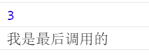

## 递归

### 递归求阶乘

```html
<body>
    <script>
        function fn(n){
            if(n == 1){
                return 1;
            }
            return n * fn(n - 1);
        }
        console.log(fn(3));
    </script>
</body>
```

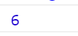

### 斐波那契数列

利用递归函数求斐波那契数列(兔子序列)1、1、2、3、5、8、13、21...

```html
<body>
    <script>
        // 斐波那契数列(兔子序列)1、1、2、3、5、8、13、21...
        // 我们只需要知道用户输入得n的前面两项就可以计算出n的值
        function fb(n){
            if(n === 1 || n === 2){
                return 1;
            }
            return fb(n - 1) + fb(n - 2)
        }
        console.log(fb(3));
        console.log(fb(6));
    </script>
</body>
```

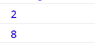

### 案例:根据id查询数据

```html
<body>
    <script>
        var data = [{
            id: 1,
            name: '家电',
            goods: [{
                id: 11,
                gname: '冰箱'
            },{
                id: 12,
                gname: '洗衣机'
            }]
        },{
            id: 2,
            name: '服饰'
        }]
        
        //根据id号获取数据
        function getID(json,id){
            var o = {};
            json.forEach(function(item){
               if(item.id == id){
                   o = item;
                   return item;
               }else if(item.goods && item.goods.length >0){
                   o = getID(item.goods,id);
               }
            });
            return o;
        }
        console.log(getID(data,1));
        console.log(getID(data,2));
        console.log(getID(data,11));
        console.log(getID(data,12));
    </script>
</body>
```

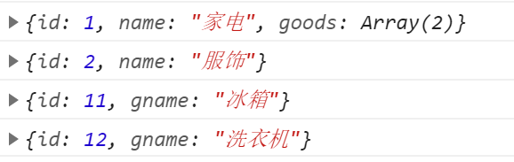

## 浅拷贝

①浅拷贝只是拷贝一层，更深层次对象级别的只拷贝引用.

②Object.assign( target,..sources)  es6新增方法可以浅拷贝

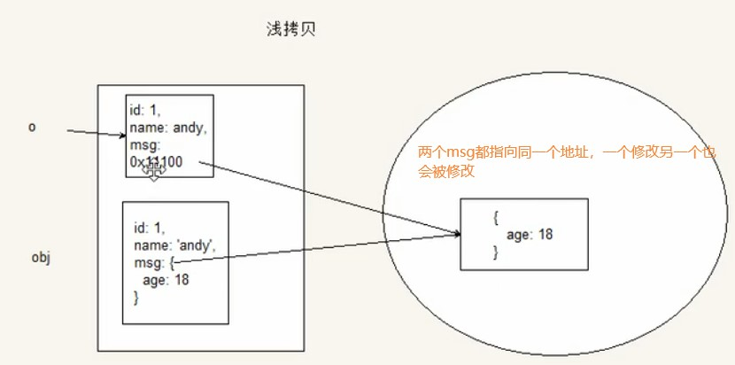

 

```html
<body>
    <script>
        var obj = {
            id: 1,
            name: 'andy',
            msg:{
                age: 18
            }
        };
        var o = {};
        for(var k in obj){
            //k属性名 obj[k]属性值
            o[k] = obj[k];
        }
        console.log(o);
        //修改o里的msg会影响obj里的msg
        o.msg.age = 20;
        console.log(obj);
    </script>
</body>
```


```html
<body>
    <script>
        var obj = {
            id: 1,
            name: 'andy',
            msg:{
                age: 18
            }
        };
        var o = {};
        //方法2
        Object.assign(o,obj);
        
        console.log(o);
        o.msg.age = 20;
        console.log(obj);
    </script>
</body>
```

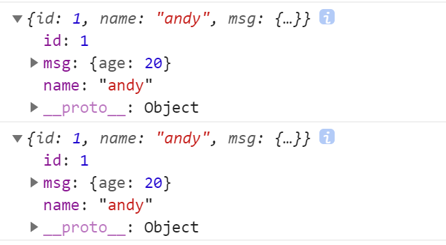

## 深拷贝

①深拷贝考贝多层,每一级别的数据都会拷贝

②利用递归进行深拷贝

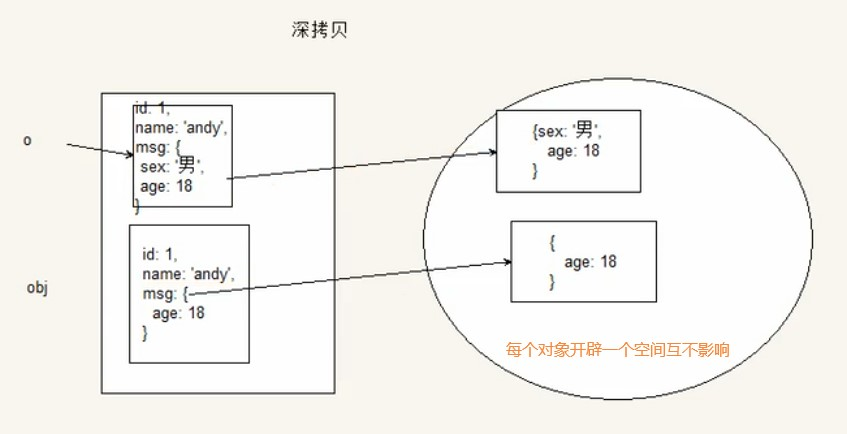

 

```html
<body>
    <script>
        var obj = {
            id: 1,
            name: 'andy',
            msg:{
                age: 18
            },
            color :['red','green','blue']
        };
        var o = {};
        
        //封装函数
        function deepCopy(newobj, oldobj){
            for(var k in oldobj){
                //判断我们的属性属于那种数据类型
                var item = oldobj[k];
                //1.判断是否是数组
                if(item instanceof Array){
                    newobj[k] = [];
                    deepCopy(newobj[k], item)
                }else if(item instanceof Object){
                    //2.判断是否是对象
                    newobj[k] = {};
                    deepCopy(newobj[k],item)
                }else{
                    //3.属于简单数据类型
                    newobj[k] = item;
                }
            }
        }
        deepCopy(o,obj);
        console.log(o);
        o.msg.age = 20;
        console.log(obj);
    </script>
</body>
```

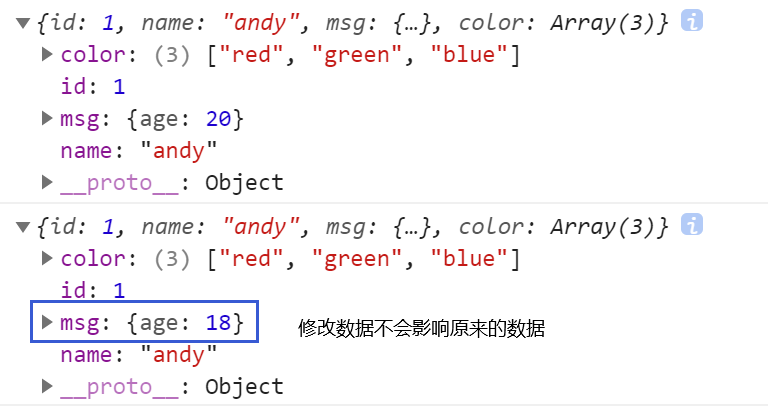

## 闭包

什么是闭包

闭包( closure)指有权访问另一个函数作用域中变量的函数。

闭包的作用：延申了变量的作用范围

```js
// 闭包:指有权访问另一个函数作用域中变量的函数
// 闭包：我们fun这个函数作用域访问了另一个函数fn里面的局部变量num
function fn(){
    var num = 10;
    function fun(){
        console.log(num);
    }
    fun();
}
fn();
```

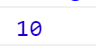

2.在全局作用域访问局部作用域的变量

```js
function fn(){
    var num = 10;
    function fun(){
        console.log(num);
    }
    
    return fun;
}
var f = fn();
f();
// 类似于
// var f = function fun() {
//     console.log(num);
// }
```


简写方式

```js
function fn(){
    var num = 10;
    
    return function fun() {
        console.log(num);
    }
}
var f = fn();
f();
```

3.闭包的案例1

```js
var lis = document.querySelectorAll("li");
for(var i = 0;i< lis.length;i++){
    //利用for创建4个立即执行函数
    (function(index) {
        lis[index].onclick = function(){
            console.log(index);
        }
    })(i);
}
```

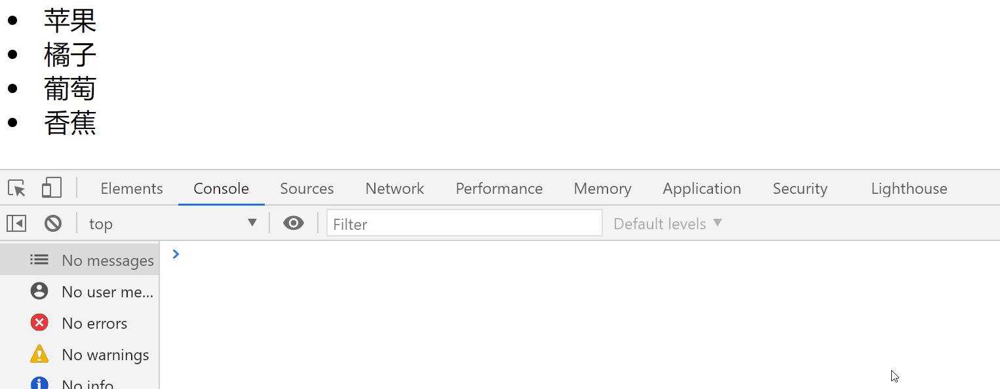

4.闭包的应用2定时器

```js
var lis = document.querySelectorAll("li");
for(var i = 0;i< lis.length;i++){
    //利用for创建4个立即执行函数
    (function(index) {
        setTimeout(function() {
            console.log(lis[index].innerHTML);
        }, 3000);
    })(i);
}
```

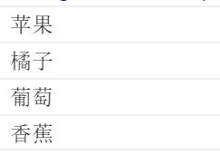

5.闭包的应用3(打车)

```js
var car = (function(){
    var start = 13; //起步价 局部变量
    var total = 0; //总价 局部变量
    return{
        //正常的总价
        price: function(n){
            if(n <= 3){
                total = start;
            }else{
                total = start + (n-3) * 5;
            }
            return total;
        },
        // 拥堵之后的费用
        yd: function(flag){
            return flag ? total + 10 :total;
        }
    }
})();
console.log(car.price(5)); 
console.log(car.yd(true));
console.log(car.price(1));
console.log(car.yd(false));
```

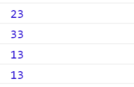

6.两个思考题

第一个思考题

```js
var name = "The window"
var object = {
    name : "My Object",
    getNameFunc: function(){
        return function(){
            return this.name;
        };
    }
};
console.log(object.getNameFunc()())
```

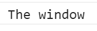

分析：上面的代码相当于

```js
var f = object.getNameFunc()
// 类似于
var f = function(){
    return this.name;
}
f();
//相当于立即执行函数,立即执行函数里面的this是window
function(){}()
```

第二个思考题

```js
var name = "The window"
var object = {
    name : "My Object",
    getNameFunc: function(){
        var that = this;
        return function(){
            return that.name;
        };
    }
};
console.log(object.getNameFunc()())
```

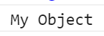

分析：上面的代码相当于

```js
var f = object.getNameFunc();
var f = function(){
    //getNameFunc是被object调用的,所以this是object
    return that.name;
};
f();
```

