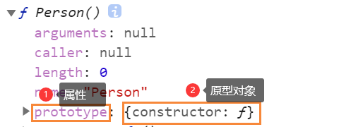
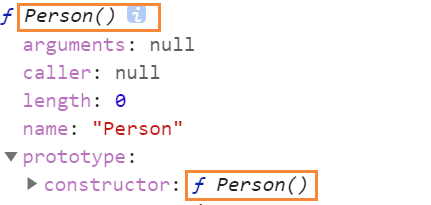
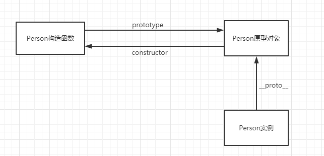

## 理解对象

### 1.创建对象

构造函数创建

```javascript
let person = new Object();
person.name = 'zhangsan';
person.age = 29;
person.sayName = function(){
    console.log(this.name);
}
```

字面量方式

```javascript
let person = {
    name:'zhangsan',
    age: 21,
    sayName(){
        console.log(this.name);
    }
}
```

### 2.属性的类型

**1.数据属性**

数据属性有四个特性（configurable，enumerable，writable，value）描述它们的行为

- configurable ：属性是否可以通过**delete删除**并**重新定义**，默认为true
- enumerable ：属性是否可枚举(是否能for-in循环)，默认为true
- writable：属性是否能被修改，默认true
- value：属性的值，默认undefined

例一 设置属性的value和是否能被修改

```javascript
// 定义person对象
let person = {}
// 设置person下的name值为lisi和只读(不能被修改)
Object.defineProperty(person,"name",{
    writable:false,
    value:'lisi'
})

console.log(person.name); // lisi
person.name = 'wangwu';   // 如果是严格模式会报错
console.log(person.name); // lisi
```

例二 设置属性不能删除，并且不能重新配置

```javascript
// 定义person对象
let person = {}
// 设置person下的name不能被删除
Object.defineProperty(person,"name",{
    configurable:false,
    value:'lisi'
})

console.log(person.name); // lisi
delete person.name;       // 如果是严格模式会报错
console.log(person.name); // lisi
```

例三 设置不能被重新定义

```javascript
// 定义person对象
let person = {}
// 设置person下的name不能被重新配置
Object.defineProperty(person,"name",{
    configurable:false,
    value:'lisi'
})

// 抛出错误
Object.defineProperty(person,'name',{
    configurable:true,
    value:'lisi'
})
```


**2.访问器属性**

数据属性有四个特性（configurable，enumerable，get，set）描述它们的行为

- configurable ：属性是否可以通过**delete删除**并**重新定义**，默认为true
- enumerable ：属性是否可枚举(是否能for-in循环)，默认为true
- get：获取**函数**,读取属性时调用，默认undefined
- set：设置**函数**,写入属性时调用，默认undefined

例一 设置book对象,包含**私有成员**year_和**公有成员**edition

```javascript
let book = {
    // 通常使用下划线来表示私有
    year_: 2019,
    edition: 1
}

Object.defineProperty(book,'year',{
    get(){
        return this.year_;
    },
    set(newValue){
        if(newValue > 2019){
            this.year_ = newValue;
            this.edition += newValue - 2019;
        }
    }
})

console.log(book);      // {year_: 2019, edition: 1}
console.log(book.year); // 2019

/** 修改属性大于2019 */
book.year = 2021;
console.log(book.year);    // 2021
console.log(book.edition); // 3

/** 修改属性小于2019 */
book.year = 2015;
console.log(book.year);    // 2021
console.log(book.edition); // 3
```

### 3.定义多个属性

```javascript
let book = {}

Object.defineProperties(book,{
    year_:{
        value:2019
    },
    edition:{
        value: 1
    },

    year:{
        get(){
            return this.year_;
        },
        set(newValue){
            if(newValue > 2019){
                this.year_ = newValue;
                this.edition += newValue - 2019;
            }
        }
    }
})
```

### 4.读取属性的特性

**1.读取单个属性的特性** `Object.getOwnPropertyDescriptor(book,'year_')`

```javascript
let book = {}

Object.defineProperties(book,{
    year_:{
        value:2019
    },
    edition:{
        value: 1
    },

    year:{
        get(){
            return this.year_;
        },
        set(newValue){
            if(newValue > 2019){
                this.year_ = newValue;
                this.edition += newValue - 2019;
            }
        }
    }
})

const descriptor1 = Object.getOwnPropertyDescriptor(book,'year_');
console.log(descriptor1.value);          // 2019
console.log(descriptor1.configurable);   // false
console.log(typeof descriptor1.get);     // undefined

const descriptor2 = Object.getOwnPropertyDescriptor(book,'year');
console.log(descriptor2.value);          // undefined
console.log(descriptor2.configurable);   // false
console.log(typeof descriptor2.get);     // undefined
```

**2.读取多个属性的特性** `Object.getOwnPropertyDescriptors(book)`

```javascript
let book = {}

Object.defineProperties(book,{
    year_:{
        value:2019
    },
    edition:{
        value: 1
    },

    year:{
        get(){
            return this.year_;
        },
        set(newValue){
            if(newValue > 2019){
                this.year_ = newValue;
                this.edition += newValue - 2019;
            }
        }
    }
})

const descriptors = Object.getOwnPropertyDescriptors(book);
console.log(descriptors);
/**
{
    edition: {value: 1, writable: false, enumerable: false, configurable: false}
    year: {enumerable: false, configurable: false, get: ƒ get(), set: ƒ set(newValue)}
    year_: {value: 2019, writable: false, enumerable: false, configurable: false}
}
*/
```

### 5.合并对象

实例一  简单复制

```javascript
// 目标对象
let dest = {};
// 源对象
let src = {id:'src'};

// 将src合并到dest,返回值为修改后的目标对象
const result = Object.assign(dest,src);

console.log(dest === result); // true
console.log(dest === src);    // false

console.log(result); // {id: "src"}
console.log(dest);   // {id: "src"}
```

实例二 多个源对象

```javascript
// 目标对象
let dest = {};

// 将多个源对象合并到dest,返回值为修改后的目标对象
const result = Object.assign(dest,{a:'foo'},{b:'bar'});

console.log(dest === result); // true

console.log(result); // {a: "foo", b: "bar"}
console.log(dest);   // {a: "foo", b: "bar"}
```

实例三 获取函数与设置函数

```javascript
// 目标对象
let dest = {
    set a(val){
        console.log(val); //输出 foo
    }
};

// 源对象
let src = {
    get a(){
        return 'foo'
    }
}

// 1.调用src的获取方法
// 2.调用dest的设置方法并传入参数“foo”

// 4行 这里的设置函数不执行赋值操作，所以并没有把值转移过来
Object.assign(dest,src);

console.log(dest);   // {set a: ƒ a(val)}
```

实例四 覆盖属性

```javascript
// 目标对象
let dest = {id:'dest'};

// 重复属性id被覆盖
const result = Object.assign(dest,{id:'src1',a:'foo'},{id:'src2',b:'bar'});

console.log(dest);   // {id: "src2", a: "foo", b: "bar"}
```

查看复制的过程

```javascript
// 目标对象
let dest = {
    set id(x){
        console.log(x);
    }
};

const result = Object.assign(dest,{id:'src1',a:'foo'},{id:'src2',b:'bar'});

console.log(dest);   // {a: "foo", b: "bar"}

// src1
// src2
```

实例五：对象的引用，浅复制只会复制对象的引用

```javascript
// 目标对象
let dest = {};
// 源对象
let src = { a:{} }

const result = Object.assign(dest,src);

console.log(dest);             // { a: {} }
console.log(dest.a === src.a); // true

dest.a = {age:5};
console.log(dest); // { a: {age: 5} }
console.log(src);  // { a: {age: 5} }
```

实例六：错误处理，出错后不会回滚，出错前的部分会被保留

```javascript
// 目标对象
let desc = {};
//源对象
let src = {
    a: 'foo',
    get b(){
        // 抛出错误
        throw new Error();
    },
    c: 'bar'
}

try {
    Object.assign(desc,src);
} catch (error) {
}

// a复制成功，出错后c不会被复制
console.log(desc); // {a: "foo"}
```

### 6.对象标识及相等判断

1.ES6之前判断

```javascript
// 符合预期的情况
console.log(true === 1); // false
console.log({} === {});  // false
console.log("2" === 2);  // false

// javascript引擎中表现不同，但仍被认为相等
console.log(+0 === -0); // true
console.log(+0 === 0);  // true
console.log(-0 === 0);  // true

// 判断Nan的相等性
console.log(NaN === NaN); // false
console.log(isNaN(NaN));  // true
```

2.Object.is方法

```javascript
console.log(Object.is(true,1));    // false
console.log(Object.is({},{}));     // false
console.log(Object.is("2" === 2)); // false

console.log(Object.is(+0,-0)); // false
console.log(Object.is(+0,0));  // true
console.log(Object.is(-0,0));  // false

console.log(Object.is(NaN,NaN)); // true
```

### 7.增强的对象语法

**1.属性简写**

```javascript
let name = 'lisi';

let person = {
	name:name
}

// 简写为
let person = {
	name
}
```

**2.可计算属性**

中括号包围的对象告诉运行时将其作为**javascript表达式**而不是字符串来求值

实例一

```javascript
const nameKey = 'name';
const ageKey = 'age';

let person = {};

// [计算属性]
person[nameKey] = 'lisi';
person[ageKey] = 12;

console.log(person); // {name: "lisi", age: 12}
```

实例二

```javascript
const nameKey = 'name';
const ageKey = 'age';

let person = {
    [nameKey]: 'lisi',
    [ageKey]: 12
};

console.log(person); // {name: "lisi", age: 12}
```

实例三

```javascript
const nameKey = 'name';
const ageKey = 'age';

let uniqueToken = 0;

// 获取唯一值
function getUniqueKey(key){
    return `${key}_${uniqueToken++}`
}

let person = {
    [getUniqueKey(nameKey)]: 'lisi',
    [getUniqueKey(ageKey)]: 12
};

console.log(person); // {name_0: "lisi", age_1: 12}
```

**3.简写方法名**

实例一

```javascript
let person = {
    sayName: function(name){
        console.log(name);
    }
}

// 简写后
let person = {
    sayName(name){
        console.log(name);
    }
}
```

实例二：简写方法名和计算属性相互兼容

```javascript
const methodKey = "sayName";

let person = {
    [methodKey](name){
        console.log(name);
    }
}
```

### 8.对象结构

实例一：直接使用属性名

```javascript
let person = {
    name: 'Matt',
    age: 12
}

// 直接使用属性名
const {name,age} = person;

console.log(name);  // Matt 
console.log(age);   // 12
```

实例二：自定义名字

```javascript
let person = {
    name: 'Matt',
    age: 12
}

// 自定义属性名
const {name: personName,age: personAge} = person;

console.log(personName);  // Matt 
console.log(personAge);   // 12
```

实例三：属性不匹配

```javascript
let person = {
    name: 'Matt',
    age: 12
}

// 属性不匹配
const {name,job} = person;

console.log(name);  // Matt 
console.log(job);   // undefined
```

实例四：默认值

```javascript
let person = {
    name: 'Matt',
    age: 12
}

// 默认值
const {name,job='software engineer'} = person;

console.log(name);  // Matt 
console.log(job);   // software engineer
```

结构在内部使用函数**`ToObject()`** (**不能在运行时直接访问**) 把源数据结构**转换为对象**。这意味着在对象解构的上下文中，原始值会当成对象。根据`ToObject()`的定义**null和undefined不能被结构**。

```javascript
// 获取length
let { length } = 'foobar';
console.log(length); // 6

// 获取构造函数
let {constructor} = 4;
console.log(constructor === Number); // true

let { _ } = null;      // TypeError
let { _ } = undefined; // TypeError
```

## 创建对象

### 1.工厂模式

```javascript
function createPerson(name,age,job){
    let o = new Object();
    o.name = name;
    o.age = age;
    o.job = job;
    o.sayName = function(){
        console.log(this.name);
    }
    return o;
}

let person1 = createPerson('zhangsan',16,'sofware Engineer'); 
let person2 = createPerson('lisi',15,'doctor'); 

console.log(person1); 
// {name: "zhangsan", age: 16, job: "sofware Engineer", sayName: ƒ}

console.log(person2); // {name: "lisi", age: 15, job: "doctor", sayName: ƒ}
```

### 2.构造函数模式

创建person对象使用new操作符，这种方式调用构造函数会执行如下操作。

(1) 在内存中创建一个新对象

(2) 这个新对象内部的[[prototype]]特性被赋值为构造函数的prototype属性

(3) 构造函数内部的this被复制为这个新对象（即this指向的新对象）

(4) 执行构造函数内部的代码(给新对象添加属性)

(5)如果构造函数返回非空对象，则返回该对象；否则，返回刚创建的新对象。

```javascript
function Person(name,age,job){
    this.name = name;
    this.age = age;
    this.job = job;
    this.sayName = function(){
        console.log(this.name);
    }
}

let person1 = new Person('zhangsan',16,'sofware Engineer');
let person2 = new Person('lisi',15,'doctor');

person1.sayName();  // zhangsan
person2.sayName();  // lisi
```

### 3.原型模式

作用：每个函数都会创建一个prototype属性，这个属性是一个对象。使用**原型对象**的好处是，在上面定义的**属性**和**方法**可以被对象实例**共享**。

① 构造函数通过原型分配的函数时所有对象共享的

② 每一个构造函数都有一个prototype属性

③ 可以把那些不变的方法，直接定义在prototype原型对象上。

```javascript
function Person() {};

Person.prototype.name = 'Nicholas';
Person.prototype.age = 13;
Person.prototype.sayName = function(){
    console.log(this.name);
}

let person1 = new Person();
person1.sayName();  // Nicholas

let person2 = new Person();
person2.sayName(); // Nicholas

console.log(person1.sayName === person2.sayName); // true
```

**1.理解原型**

- 构造函数上有一个prototype属性，引用其原型对象
- 原型对象上有一个属性constructor，引用这个构造函数

> 在Person构造函数下有一个prototype属性，属性的值引用其原型对象。



> 原型对象上有一个constructor属性，属性的值引用这个构造函数



```javascript
function Person(){};

console.log(typeof Person.prototype); // object
console.log(Person.prototype); // {constructor: ƒ Person(),__proto__: Object}

/** constructor属性引用其构造函数 **/
console.log(Person.prototype.constructor === Person); // true
```

原型链：原型链都会终止与Object的原型对象

```javascript
function Person(){};

console.log(Person.prototype.__proto__ === Object.prototype);   // true
console.log(Person.prototype.__proto__.constructor === Object); // true
console.log(Person.prototype.__proto__.__proto__ === null);     // true
```

**构造函数、原型对象和实例直接的关系**

- 实例是通过`__proto__`**链接到原型对象**
- 构造函数通过prototype**链接到原型对象**
- 实例**与原型对象没有直接的联系**，与**原型对象有直接的联系**



```javascript
function Person(){};

const person = new Person();

/** 构造函数的是实例对象的constructor执行当前构造函数 */
console.log(Person.prototype.constructor === Person); // true
/** 实例的__proto__引用构造函数的实例对象 */
console.log(person.__proto__ === Person.prototype);   // true
```

**同一个构造函数的两个实例共享一个原型对象**


```javascript
function Person(){};
const person1 = new Person();
const person2 = new Person();

console.log(person1.__proto__ === person2.__proto__); // true

// 判断person1的原型和Person构造函数的原型是否相等
console.log(Person.prototype.isPrototypeOf(person1)); // true
```

