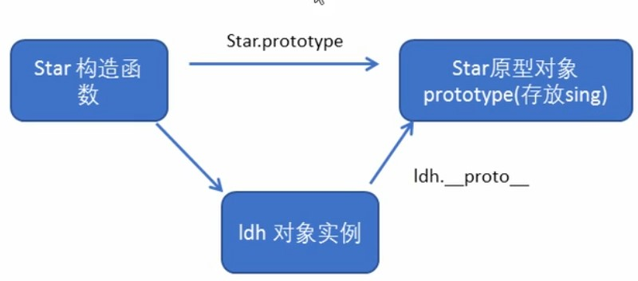
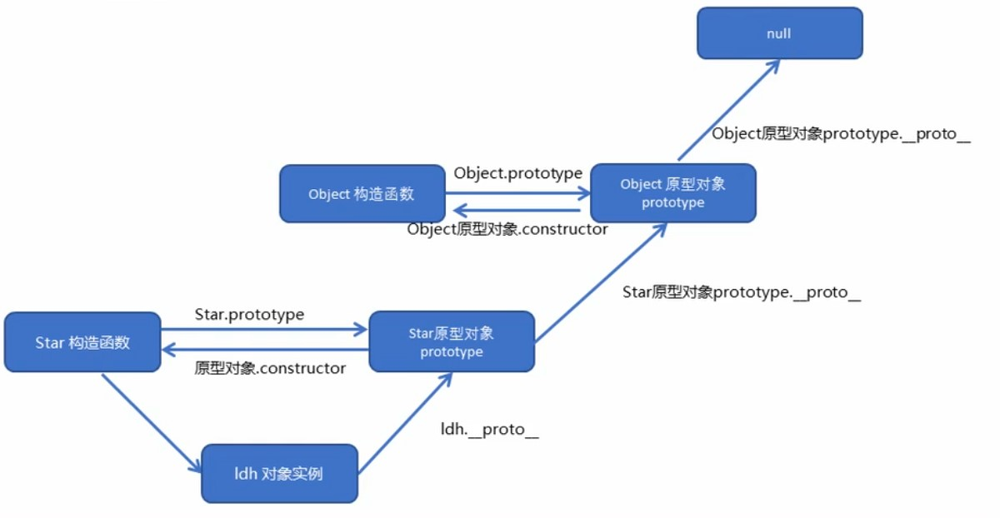
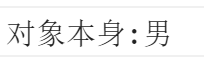
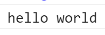

## 理解对象

获取对象所有的属性名

```js
var obj = {
    id: 1,
    pname: '小米',
    price: 1999,
    num: 2000
}
//获取所有的key
var arr = Object.keys(obj);
console.log(arr)
```


3.对象中新增属性或修改原来的属性

```js
var arr = Object.defineProperty(obj,prop,descriptor);
```

①obj:必需。目标对象 prop:必需。需定义或修改的属性的名字 descriptor:必需。目标属性所拥有的特性

②Object.defineProperty第三个参数descriptor说明︰以对象形式{目}书写

value:设置属性的值默认为undefined

writable:值是否可以重写。true | false 默认为false

enumerable:目标属性是否可以被枚举。true | false 默认为false

configurable:目标属性是否可以被删除或是否可以再次修改特性true | false 默认为false

4.原始方式添加和修改数据

```js
var obj = {
    id: 1,
    pname: '小米',
    price: 1999
}
obj.num = 1000;
obj.price = 99;
console.log(obj)
```


5.使用defineProperty添加和修改数据

```js
var obj = {
    id: 1,
    pname: '小米',
    price: 1999
}
Object.defineProperty(obj, 'num' ,{
    value: 1000
});
Object.defineProperty(obj, 'price' ,{
    value: 9.9
});
console.log(obj);
```


6.让obj的属性值不能修改

```js
var obj = {
    id: 1,
    pname: '小米',
    price: 1999
}
Object.defineProperty(obj,'id',{
    writable: false,
});
obj.id = 2;
console.log(obj);
```


7.设置对象不能枚举

```js
var obj = {
    id: 1,
    pname: '小米',
    price: 1999
}
Object.defineProperty(obj,'address',{
    value:"中国山东",
    //设置不能枚举
    enumerable: false
});
console.log(Object.keys(obj));
```


8.设置不允许删除

```js
var obj = {
    id: 1,
    pname: '小米',
    price: 1999
}
Object.defineProperty(obj,'address',{
    value:"中国山东",
    //设置不能枚举
    enumerable: false,
    //设置不能被删除
    configurable: false
});
console.log(Object.keys(obj));
console.log(obj)
delete obj.address;
delete obj.pname;
console.log(obj);
```


9.设置不允许修改属性

```js
var obj = {
    id: 1,
    pname: '小米',
    price: 1999
}
Object.defineProperty(obj,'address',{
    value:"中国山东",
    //设置不能再次修改属性
    configurable: false
});
Object.defineProperty(obj,'address',{
    value:"中国山西",
    //设置不能再次修改属性
    configurable: false 
});
console.log(obj);
```


## 创建对象

### 2.构造函数模式

1.用构造函数创建对象，构造函数一般首字母使用大写

```js
//利用构造函数创建对象
function Star(uname,age){
    this.uname = uname;
    this.age = age;
    this.sing = function(){
        console.log("我会唱歌");
    }
}
var ldh = new Star("刘德华",18);
console.log(ldh)
ldh.sing()
```

2.访问实例成员

```js
//利用构造函数创建对象
function Star(uname,age){
    this.uname = uname;
    this.age = age;
    this.sing = function(){
        console.log("我会唱歌");
    }
}
var ldh = new Star("刘德华",18);
//1.实例成员：通过构造函数内部通过this添加的成员
//实例成员只能通过实例化的对象访问
console.log(ldh.uname) // 刘德华
```

3.访问静态成员

```js
//利用构造函数创建对象
function Star(uname,age){
    this.uname = uname;
    this.age = age;
    this.sing = function(){
        console.log("我会唱歌");
    }
}
var ldh = new Star("刘德华",18);
//2.静态成员 在构造函数本身上添加的成员
Star.sex = "男";
//静态成员只能通过构造函数访问
console.log(Star.sex); // 男
console.log(ldh.sex); // undefined 不能通过实例对象访问
```

4.构造函数存在的问题

每new一个实例对象都会重复存储相同的函数，存在浪费内存的问题


```js
//利用构造函数创建对象
function Star(uname,age){
    this.uname = uname;
    this.age = age;
    this.sing = function(){
        console.log("我会唱歌");
    }
}
var ldh = new Star("刘德华",18);
var zxy = new Star("张学友",19);
console.log(ldh.sing == zxy.sing) // false
```

### 3.原型模式

1.原型prototype对象

①构造函数通过原型分配的函数是所有对象共享的

②每一个构造函数都有一个prototype属性

③我们可以把那些不变的方法，直接定义在prototype原型对象上，就可以实现共享

```js
//利用构造函数创建对象
function Star(uname,age){
    this.uname = uname;
    this.age = age;
    this.sing = function(){
        console.log("我会唱歌");
    }
}
console.dir(Star)
```


2.原型的两个问题

**①原型是什么 ？ 一个对象，prototyep为原型对象**

**②原型的作用是什么？共享方法**

```js
//利用构造函数创建对象
function Star(uname,age){
    this.uname = uname;
    this.age = age;
}
//将函数添加到原型对象上
Star.prototype.sing = function(){
    console.log("我会唱歌")
}
var ldh = new Star("刘德华",18);
var zxy = new Star("张学友",19);
ldh.sing();                       // 我会唱歌
console.log(ldh.sing == zxy.sing) // true
```

4.对象原型`_proto_`

①对象上的_proto_指向我们构造函数的原型对象

②对象上的原型和构造方法的原型是一样的

③方法的查找原则，先查找对象上是否有这个方法，如果没有再去__proto__上查找这个方法

```js
//利用构造函数创建对象
function Star(uname,age){
    this.uname = uname;
    this.age = age;
}
//将函数添加到原型对象上
Star.prototype.sing = function(){
    console.log("我会唱歌")
}
var ldh = new Star("刘德华",18);
var zxy = new Star("张学友",19);
console.log(ldh)
```

```js
console.log(ldh.__proto__ == Star.prototype)
```



有一个构造函数Star,构造函数上有一个原型对象prototype,我们把sing这个方法挂载到原型对象上。我们通过构造方法创建一个ldh对象实例，在对象实例上有一个__proto__对象原型，这个原型指向构造函数的原型对象prototype

### 4.原型上的构造函数

**①**对象原型(_proto_)和构造函数(（ prototype )原型对象里面都有一个属性constructor属性，constructor我们称为构造函数，因为它指回构造函数本身。

②constructor主要用于记录对象引用于那个构造函数，它可以让原型对象重新指向原来的构造函数

```js
//将函数添加到原型对象上
Star.prototype.sing = function(){
    console.log("我会唱歌")
}
var ldh = new Star("刘德华",18);
console.log(ldh.__proto__)
console.log(Star.prototype)
```


1.挂载多个函数(普通方式)

```js
//利用构造函数创建对象
function Star(uname,age){
    this.uname = uname;
    this.age = age;
}
//将函数添加到原型对象上
Star.prototype.sing = function(){
    console.log("我会唱歌")
}
Star.prototype.movie = function(){
    console.log("我会演电影")
}
var ldh = new Star("刘德华",18);
console.log(ldh.__proto__)
console.log(Star.prototype)

```


2.挂载多个函数(对象方式)

```js
//利用构造函数创建对象
function Star(uname,age){
    this.uname = uname;
    this.age = age;
}
Star.prototype = {
    sing: function(){
        console.log("我会唱歌")
    },
    move: function(){
        console.log("我会演电影")
    }
}
var ldh = new Star("刘德华",18);
console.log(ldh.__proto__.constructor)
console.log(Star.prototype.constructor)

```

出现问题：原型对象的构造方法指向了Object对象，没有指向原来的对象，把原来的对象给覆盖了。

4.重新指回原来的构造函数

①如果我们修改了原来的原型对象，给原型对象赋值的是一个对象，则必须利用constructor指回原来的构造函数

```js
constructor: Star

```

```js
//利用构造函数创建对象
function Star(uname,age){
    this.uname = uname;
    this.age = age;
}
Star.prototype = {
    constructor: Star,
    sing: function(){
        console.log("我会唱歌")
    },
    move: function(){
        console.log("我会演电影")
    }
}
var ldh = new Star("刘德华",18);
console.log(ldh.__proto__.constructor)
console.log(Star.prototype.constructor)

```


5.构造函数、实例、原型对象三者之间的关系


有一个构造函数Star,构造函数上有一个原型对象prototype,原型对象上面有一个属性constructor指向构造函数。我们通过构造方法创建一个ldh对象实例，在对象实例上有一个__proto__对象原型，这个原型指向构造函数的原型对象prototype

### 5.原型链

1.Star原型对象prototype上的原型__proto__是Object的原型对象

```js
//利用构造函数创建对象
function Star(uname,age){
    this.uname = uname;
    this.age = age;
}
console.log(Star.prototype)

```


 

```js
//利用构造函数创建对象
function Star(uname,age){
    this.uname = uname;
    this.age = age;
}
console.log(Star.prototype.__proto__ === Object.prototype)

```


2.Object原型对象protorype上的原型指向null

 

```
console.log(Object.prototype.__proto__)

```


3.原型链



①有一个构造函数Star,构造函数上有一个原型对象prototype,原型对象上面有一个属性constructor指向构造函数。

②我们通过构造方法创建一个ldh对象实例，在对象实例上有一个__proto__对象原型，这个原型指向构造函数的原型对象prototype。

③在构造函数Star的原型对象protorype上有一个对象原型__proto__指向Object构造函数的原型对象。

④Object构造函数上有个原型对象prototype,原型对象上有一个属性constructor指向objectobject构造函数。

⑤在Object构造函数的原型prototype上有一个原型__proto__指向null

**4.成员的查找机制**

①当访问一个对象的属性(包括方法)时，首先查找这个对象自身有没有该属性。

②如果没有就查找它的原型（也就是_proto_指向的prototype原型对象）。

③如果还没有就查找原型对象的原型(Object的原型对象)。

④依此类推一直找到Object为止 ( null )。

⑤_proto_对象原型的意义就在于为对象成员查找机制提供一个方向，或者说─条路线。

```js
function Star(uname,age){
    this.uname = uname;
    this.age = age;
}
var ldh = new Star("刘德华",18);
ldh.sex = "对象本身:男";
console.log(ldh.sex);

```



 

```js
function Star(uname,age){
    this.uname = uname;
    this.age = age;
}
var ldh = new Star("刘德华",18);
Star.prototype.sex = "Star构造函数原型上:男"
console.log(ldh.sex);

```


 

```js
function Star(uname,age){
    this.uname = uname;
    this.age = age;
}
var ldh = new Star("刘德华",18);
Object.prototype.sex = "Object构造函数原型上:男"
console.log(ldh.sex);

```


 

```js
function Star(uname,age){
    this.uname = uname;
    this.age = age;
}
var ldh = new Star("刘德华",18);
console.log(ldh.sex);

```


**5.原型对象this的指向问题**

①在构造函数中,里面this指向的是对象实例ldh

②原型对象函数里面的this指向的是实例对象 ldh

```js
function Star(uname,age){
    this.uname = uname;
    this.age = age;
}
var that;
Star.prototype.sing = function(){
    console.log('我会唱歌');
    that = this;
}
var ldh = new Star("刘德华",18);
//调用sing方法
ldh.sing();
console.log(that === ldh);

```


**6.扩展内置对象(求和)**

```js
Array.prototype.sum = function(){
    var sum = 0;
    //这个this指向的是调用者
    for(var i = 0;i < this.length; i++){
        sum += this[i];
    }
    return sum;
}
var arr = [1,2,3];
console.log(arr.sum())
console.log(Array.prototype)

```


**7.call调用函数**

```js
function fn(){
    console.log("hello world")
}
//call调用函数
fn.call();

```



**8.改变this的指向**

```js
function fn(){
    console.log("hello world")
    console.log(this)
}
var o = {
    name: 'andy'
}
//改变this的指向，让this指向o
fn.call(o);

```


**9.call传递参数**

```js
function fn(x,y){
    console.log(this)
    console.log(x + y)
}
var o = {
    name: 'andy'
}
//传递参数
fn.call(o,1,2);

```


10.借用父构造函数继承属性

```js
//1.父构造函数
function Father(uname,age){
    this.uname = uname;
    this.age = age;
}
//2.子构造函数
function Son(uname,age,score){
    //改变父构造函数this为子构造函数中的this
    Father.call(this,uname,age)
    this.score = score;
}
var son = new Son("刘德华",18,100)
console.log(son)

```


11.继承父构造函数的方法

```
Son.prototype = Father.prototype;

```

```js
//1.父构造函数
function Father(uname,age){
    this.uname = uname;
    this.age = age;
}
Father.prototype.money = function(){
    console.log(100000)
}
//2.子构造函数
function Son(uname,age,score){
    //改变父构造函数this为子构造函数中的this
    Father.call(this,uname,age)
    this.score = score;
}
//将Father的原型对象赋值给Son的原型对象
Son.prototype = Father.prototype;
var son = new Son("刘德华",18,100)
console.log(son)

```


12.这样存在的问题

①当子对象的原型对象添加元素时会修改父元素的原型对象

```
Son.prototype = Father.prototype;

```

```js
//1.父构造函数
function Father(uname,age){
    this.uname = uname;
    this.age = age;
}
Father.prototype.money = function(){
    console.log(100000)
}
//2.子构造函数
function Son(uname,age,score){
    //改变父构造函数this为子构造函数中的this
    Father.call(this,uname,age)
    this.score = score;
}
//将Father的原型对象赋值给Son的原型对象
Son.prototype = Father.prototype;
Son.prototype.exam = function(){
    console.log("孩子要考试");
}
var son = new Son("刘德华",18,100)
console.log(Father.prototype)

```


Son.prototype = Father.prototype会将子元素的原型对象指向父元素的原型对象，修改子元素的元素对象就是修改父元素的原型对象。

13.解决方法

①Son构造函数的原型对象指向Father的实例对象

②因为Father实例对象的__proto__指向Father原型对象，所有Son构造函数能够访问money方法


 

```
Son.prototype = new Father();

```

 

```js
//1.父构造函数
function Father(uname,age){
    this.uname = uname;
    this.age = age;
}
Father.prototype.money = function(){
    console.log(100000)
}
//2.子构造函数
function Son(uname,age,score){
    //改变父构造函数this为子构造函数中的this
    Father.call(this,uname,age)
    this.score = score;
}
//Son构造函数的原型对象指向Father的实例对象
Son.prototype = new Father();
Son.prototype.exam = function(){
    console.log("孩子要考试");
}
var son = new Son("刘德华",18,100)
console.log(son)
console.log(Father.prototype)

```


存在问题：子元素的原型对象的构造方法指向父元素

 

```
console.log(Son.prototype.constructor)

```


解决方法：让子元素的原型对象的构造方法重新指向son构造方法

```
Son.prototype.constructor = Son;

```

```js
//1.父构造函数
function Father(uname,age){
    this.uname = uname;
    this.age = age;
}
Father.prototype.money = function(){
    console.log(100000)
}
//2.子构造函数
function Son(uname,age,score){
    //改变父构造函数this为子构造函数中的this
    Father.call(this,uname,age)
    this.score = score;
}
//Son构造函数的原型对象指向Father的实例对象
Son.prototype = new Father();
//指回原来的构造函数
Son.prototype.constructor = Son;
Son.prototype.exam = function(){
    console.log("孩子要考试");
}
var son = new Son("刘德华",18,100)
console.log(son)
console.log(Son.prototype.constructor)

```


## 类

### 1. 类的定义

```js
//1.创建类 class 
class Star{
    //构造函数
    constructor(uname){
        this.uname = uname;
    }
}
//2.创建对象
var ldh = new Star("刘德华")
console.log(ldh.uname) // 刘德华
```

### 2. 类中添加方法

```js
//1.创建类 class 
class Star{
    //构造函数
    constructor(uname, age){
        this.uname = uname;
        this.age = age;
    }
    //方法
    sing(song){
        console.log(this.uname + song);
    }
}
//2.创建对象
var ldh = new Star("刘德华",18)
ldh.sing("冰雨") // 刘德华冰雨
```

### 3. 类的继承

```js
class Father{
    constructor(){
    }
    money(){
        console.log(100);
    }
}
//继承父类方法
class Son extends Father{
}
var son = new Son();
son.money(); // 100
```

 2.错误实例

```js
class Father{
    constructor(x,y){
        this.x = x;
        this.y = y;
    }
    sum(){
        console.log(this.x + this.y);
    }
}
//继承父类的方法
class Son extends Father{
    constructor(x,y){
        this.x = x;
        this.y = y;
    }
}
var son = new Son(1,2);
son.sum();
```


3.父类中的this是执行父类的定义的数据

```js
class Father{
    constructor(x,y){
        this.x = x;
        this.y = y;
    }
    sum(){
        console.log(this.x + this.y);
    }
}
class Son extends Father{
    constructor(x,y){
        //调用父类的构造方法
        super(x,y);
    }
}
var son = new Son(1,2);
son.sum(); // 3
```

### 4. super关键字

**1.继承中，如果实例化子类输出一个方法，会先看子类有没有，再查看父类有没有**

```js
class Father{
    say(){
        return "我是爸爸";
    }
}
class Son extends Father{
    say(){
        console.log("我是儿子")
    }
}
var son = new Son();
son.say(); // 我是儿子
```

**使用super关键字调用父类的方法**

```js
class Father{
    say(){
        return "我是爸爸";
    }
}
class Son extends Father{
    say(){
        console.log(super.say()+"的儿子")
    }
}
var son = new Son();
son.say(); // 我是爸爸的儿子
```

**1.5 子类拥有父类加法的同时存在减法**

```js
class Father{
    constructor(x,y){
        this.x = x;
        this.y = y;
    }
    sum(){
        console.log(this.x + this.y)
    }
}
class Son extends Father{
    constructor(x,y){
        //调用父类的构造方法
        //super必须在子类this之前调用
        super(x,y)
        this.x = x;
        this.y = y;
    }
    subtract(){
        console.log(this.x - this.y);
    }
}
var son = new Son(5,3);
son.sum();      // 8
son.subtract()  // 2
```

### 5. 类的三个注意点

**①没有变量提升，必须先调用再使用**

```js
new Star("刘德华",18)
class Star{
    constructor(uname,age){
        this.uname = uname;
        this.age = age;
    }
    sing(){
        console.log(this.uname)
    }
}
```


**②类里面公有的属性和方法一定要加this**

```js
class Star{
    constructor(uname,age){
        this.uname = uname;
        this.age = age;
        //没有加this
        sing();
    }
    sing(){
        console.log(this.uname)
    }
}
new Star("刘德华",18)
```


**③constructor里面的this指向实例对象，方法里面的this指向方法的调用者**

```js
var that;
class Star{
    constructor(uname,age){
        that = this;
        console.log("constructor里的this");
        console.log(this)
        this.uname = uname;
        this.age = age;
        
        this.btn = document.querySelector("button");
        this.btn.onclick = this.sing;
    }
    sing(){
        console.log("被调用方法sing里的this");
        console.log(this)
        console.log(that.uname)
    }
    dance(){
        console.log("被调用方法dance里的this");
        console.log(this)
    }
}
var ldh = new Star("刘德华",18);
ldh.dance();
```

