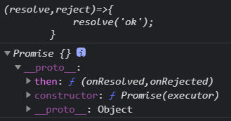
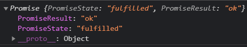
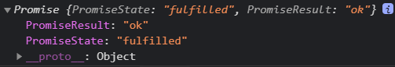
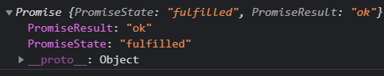
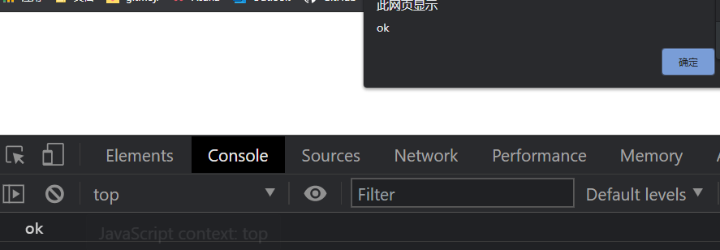
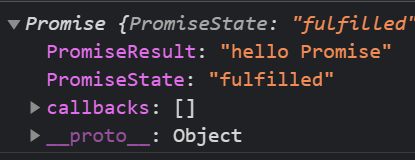
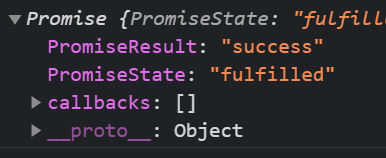
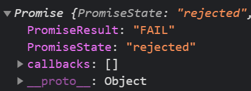
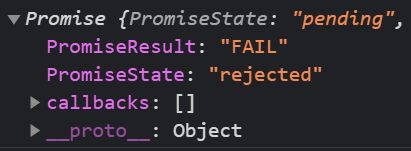

## Promise基本使用

### 起步

①我们可以用 `new Promise(executor)` 创建一个promise对象，该构造函数会把一个叫做“处理器函数”（executor function）的函数作为它的参数。

②这个“处理器函数”接受两个函数——`resolve` 和 `reject` ——作为其参数。

③当异步任务顺利完成且返回结果值时，会调用 `resolve` 函数；而当异步任务失败且返回失败原因（通常是一个错误对象）时，会调用`reject` 函数。

```js
//返回成功的状态
var promise =  new Promise((resolve,reject)=>{
	resolve(); // Promise状态设置为[成功]
});
console.log(promise);
//PromiseState: "fulfilled"
```

```js
//返回成功的状态
var promise =  new Promise((resolve,reject)=>{
    reject(); // Promise状态设置为[失败]
});
console.log(promise);
//PromiseState: "rejected"
```

### 传递参数

```js
//成功传递参数
var promise =  new Promise((resolve,reject)=>{
    resolve("success") // Promise状态设置为[成功]并传递参数
});

promise.then(value=>{
    //接受到成功的回调
    console.log(value);
},reason=>{
    //接受到失败的回调
    console.log(value);
})
//success
```

```js
var promise =  new Promise((resolve,reject)=>{
    reject("erro")
});

promise.then(value=>{
    //接受到成功的回调
    console.log(value);
},reason=>{
    //接受到失败的回调
    console.log(reason);
})
//erro
```

## 案例

### 读取文件案例

```js
const fs = require('fs');

let p = new Promise((resolve,reject)=>{
    // 异步函数
    fs.readFile('./resource/content.txt',(err,data)=>{
        if(err) reject(err);
        resolve(data);
    })
})

p.then(value=>{
   console.log(value.toString()); 
},reason=>{
    console.log(reason);
})
```

### 发送AJAX案例

```html
<!DOCTYPE html>
<html lang="en">
<head>
    <meta charset="UTF-8">
    <meta name="viewport" content="width=device-width, initial-scale=1.0">
    <title>Promise基本使用</title>
</head>
<body>
    <div>
        <h2>Promise初体验</h2>
        <button id="btn">点击抽奖</button>
    </div>

    <script>
        const btn = document.querySelector('#btn');
        btn.addEventListener('click',()=>{
            const p = new Promise((resolve,reject)=>{
                //1.创建对象
                const xhr = new XMLHttpRequest();
                //2.初始化
                xhr.open('GET','https://api.apiopen.top/getJoke');
                //3.发生
                xhr.send();
                //4.处理相应
                xhr.onreadystatechange = ()=>{
                    if(xhr.readyState === 4){
                        //判断相应状态码2xx
                        if(xhr.status>=200&&xhr.status<300){
                            //控制台输出相应体
                            resolve(xhr.response);
                        }else{
                            reject(xhr.status)
                        }
                    }
                }
            })
            p.then(value=>{
                console.log(value.toString());
            },reason=>{
                console.warn(reason)
            })
            
        })
    </script>
</body>
</html>
```

### 封装读取文件

```js
/**
 * 封装一个函数mineReadFile 读取文件内容
 * 参数：path 文件路径
 * 返回：promise 对象
 */

 function mineReadFile(path){
     return new Promise((resolve,reject)=>{
         //读取文件
         require('fs').readFile(path,(err,data)=>{
             //判断
             if(err) reject(err);
             //成功
             resolve(data);
         })
     })
 }

 mineReadFile('./resource/content.txt')
 .then(value=>{
    console.log(value.toString());
 },reason=>{
    console.log(reason);
 })
```

### 封装AJAX请求

```js
/**
 * 封装一个函数 sendAJAX发送GET AJAX请求
 * 参数 URL
 * 返回结果 Promise 对象
 */
function sendAJAX(url) {
    return new Promise((resolve, reject) => {
        const xhr = new XMLHttpRequest();
        xhr.responseType = 'json';
        xhr.open('GET', url);
        xhr.send();
        //处理结果
        xhr.onreadystatechange = function () {
            if (xhr.readyState === 4) {
                //判断成功
                if (xhr.status >= 200 && xhr.status <= 300) {
                    resolve(xhr.response);
                } else {
                    reject(xhr.status);
                }
            }
        }
    })
}

sendAJAX('https://api.apiopen.top/getJoke')
    .then(value => {
        console.log(value);
    }, reason => {
        console.log(reason);
    })

console.log(sendAJAX('https://api.apiopen.top/getJoke'));
```

## Promise中的对象和值

### Promise的状态

实例对象中的一个属性 [[PromiseState]]

* pending 未决定的

* resolved / fullfilled 成功

* reject 失败

注意

* 只能由pending->resolved / fullfilled或pending->reject

* 不能 resolved/ fullfilled<—>reject


### Promise对象的值

实例对象中的另一个属性[[PromiseResult]]

保存异步任务[成功/失败]的结果

resolve和reject可以修改PromiseResult中的值

## Promise中的api

### catch

```js
//Promise构造函数:Promise(excutor){}
//excutor函数：执行器(resolve,reject)=>{}
let p = new Promise((resolve, reject) => {
    reject('erro');
})

//失败回调函数
p.catch(reason => {
    console.log(reason);
})
```

### resolve

- 如果传入的参数为非promise类型的对象，则返回的结果为成功promise对象

```js
let p1 = Promise.resolve(123);
console.log(p1);
```

- 如果传入的参数为Promise对象，则参数的结果决定了resolve的结果

```js
let p2 = Promise.resolve(new Promise((resolve,reject)=>{
    resolve('ok');
}))
console.log(p2);
```

### reject

不管传入的是不是promise对象都是失败

```js
let p1 = Promise.reject(512);
console.log(p1);
```

```js
let p2 = Promise.reject(new Promise((resolve,reject)=>{
	resolve('ok');
}))
console.log(p2);
```

### all

- 全部成功才成功，返回所有结果为数组

- 一个失败则失败，返回失败的结果

```js
//成功的例子
let p1 = new Promise((resolve,reject)=>{
    resolve('ok');
})
let p2 = Promise.resolve("success");
let p3 = Promise.resolve('Oh Yeah');

const result = Promise.all([p1,p2,p3])

console.log(result);
```

```js
//失败的例子
let p1 = new Promise((resolve,reject)=>{
    resolve('ok');
})
let p2 = Promise.reject("e");
let p3 = Promise.resolve('Oh Yeah');

const result = Promise.all([p1,p2,p3])

console.log(result);
```

### race

最先完成的决定结果

```js
let p1 = new Promise((resolve,reject)=>{
    // resolve('ok');
    setTimeout(() => {
        resolve('ok');
    }, 1000);
})
let p2 = Promise.resolve("success");
let p3 = Promise.resolve('Oh Yeah');

//最先完成的决定结果
const result = Promise.race([p1,p2,p3])
console.log(result);
```

## promise关键问题

### 状态改变

```js
let p = new Promise((resolve,reject)=>{
    //1.resolve函数
    //resolve('ok'); //pending => fulfilled (resolve)
    //2.reject函数
    //reject('erro'); //pending => reject
    //3.抛出错误
    throw '出问题了'; //pending => reject
})

console.log(p);
```

### 执行多个回调

指定每一个回调都会被执行

```js
let p = new Promise((resolve,reject)=>{
    resolve('ok');
})

//指定回调 1
p.then(value =>{
    console.log(value); //ok
})

//指定回调 2
p.then(value =>{
    console.log(value); //ok
    console.log(666); //666
})
```

### 改变状态与指定回调顺序问题

- 同步任务先改变状态后指定回调

```js
let p = new Promise((resolve,reject)=>{
    //同步任务先改变状态后指定回调
    resolve('ok');
})

p.then(value=>{
    console.log(value);
},reason=>{

})
```

- 异步任务先指定回调后改变状态

```js
let p = new Promise((resolve,reject)=>{
    //异步任务先指定回调后改变状态
    setTimeout(() => {
        resolve('ok');
    }, 1000);
})

p.then(value=>{
    console.log(value);
},reason=>{

})
```

### 返回结果由谁决定

无返回值

```js
let p = new Promise((resolve,reject)=>{
    resolve('ok');
})

//执行then方法
let result = p.then(value=>{
    console.log(value);  //ok
},reason=>{
    console.log(reason);
})

console.log(result); 
// [[PromiseState]]: "fulfilled"
// [[PromiseResult]]: undefined
```

抛出错误

```js
let p = new Promise((resolve,reject)=>{
    resolve('ok');
})

//执行then方法
let result = p.then(value=>{
    //抛出错误
    throw '出了问题'
},reason=>{
    console.log(reason);
})

console.log(result);
// [[PromiseState]]: "rejected"
// [[PromiseResult]]: "出了问题"
```

返回结果是非promise对象

```js
let p = new Promise((resolve,reject)=>{
    resolve('ok');
})

//执行then方法
let result = p.then(value=>{
    //返回结果是非promise对象
    return 500;
},reason=>{
    console.log(reason);
})

console.log(result);
// [[PromiseState]]: "fulfilled"
// [[PromiseResult]]: 500
```

返回值是promise对象

- 如果promise对象的返回值成功则成功
- 如果promise对象的返回值失败则失败

```js
let p = new Promise((resolve,reject)=>{
    resolve('ok');
})

//执行then方法
let result = p.then(value=>{
    //3.返回结果是promise对象
    return new Promise((resolve,reject)=>{
         //resolve('success');
         reject('erro')
     })

},reason=>{
    console.log(reason);
})

console.log(result);
// [[PromiseState]]: "rejected"
// [[PromiseResult]]: "erro"
```

### 串联多个任务

```js
let p = new Promise((resolve,reject)=>{
    setTimeout(() => {
        resolve('ok');
    }, 1000);
})

p.then(value =>{
    return new Promise((resolve,reject)=>{
        resolve('success');
    })
}).then(value=>{
    console.log(value);
    // return 007;
}).then(value=>{
    console.log(value);
})
```

### 异常穿透现象

任何一个环节出错都会被catch捕获

```js
let p = new Promise((resolve,reject)=>{
    setTimeout(() => {
        resolve('ok');
        // reject('erro');
    }, 1000);
})

p.then(value=>{
    console.log(111);
}).then(value=>{
    // console.log(222);
    throw '出错了'
}).then(value=>{
    console.log(333);
}).catch(reason=>{
    console.warn(reason);
})
```

### 中断promise链

返回一个空的promise对象就可以中断promise链`return new Promise(()=>{})`

```js
let p = new Promise((resolve,reject)=>{
    setTimeout(() => {
        resolve('ok');
    }, 1000);
})

p.then(value=>{
    console.log(111);
    //中断promise链：返回一个pending状态的promse对象
    return new Promise(()=>{})
}).then(value=>{
    console.log(222);
}).then(value=>{
    console.log(333);
}).catch(reason=>{
    console.warn(reason);
})
```

## async与await

### async函数

1.函数的返回值为promise对象

2.promise对象的结果有async函数执行的返回值决定

```js
async function main(){

}

let result = main();

console.log(result);

//result是一个promise对象
//[[PromiseState]]: "fulfilled"
//[[PromiseResult]]: undefined
```

#### 返回一个非promise对象

```js
async function main(){
	//如果返回是一个非promise类型的数据
	return 521;
}

let result = main();
console.log(result);

// [[PromiseState]]: "fulfilled"
// [[PromiseResult]]: 521
```

#### 返回一个promise对象

返回结果的状态由promise的结果决定

```js
async function main(){
	//如果返回的是一个promise对象
    return new Promise((resolve,reject)=>{
    reject("出错了")
    })
}

let result = main();
console.log(result);

//[[PromiseState]]: "rejected"
//[[PromiseResult]]: "出错了"
```

#### 如果抛出一个错误

```JS
async function main(){
	//3.抛出异常
	throw "oh  NO"
}

let result = main();
console.log(result);
// [[PromiseState]]: "rejected"
// [[PromiseResult]]: "oh  NO"
```

### await 表达式

1.await右侧的表达式一般为promise对象，但也可以是其它的值

2.如果表达式时promise对象,await返回的是promise成功的值

3.如果表达式是其它值，直接将此值作为await的返回值

注意：

1.await必须写在async函数中，但async函数中可以没有await

2.如果await的promise失败了，就会抛出异常，需要try...catch捕获处理

#### 右侧是promise对象

```js
async function main(){
	let p = new Promise((resolve,reject)=>{
		resolve('OK');
	})
	//右侧为promise对象的情况
	let res = await p;
	console.log(res);
}

main();

//log输出的结果 OK
```

#### 右侧是其他类型的值

```js
async function main(){
	//右侧为其他类型的数据
    let res = await 20;
    console.log(res);
}

main();

//log输出的结果 20
```

#### promise失败的情况

需要通过try...catch进行捕获

```js
async function main(){
    let p = new Promise((resolve,reject)=>{
    	reject("出错了")
    })
    //promise失败的情况
    try {
    	let res = await p;
    } catch (error) {
    	console.log(error);
    }
}

main();
//log输出的结果 出错了
```

### await案例

要求：读取三个文件的内容并拼接在一起

#### 不使用await函数完成

```js
const fs = require('fs');

fs.readFile('./resource/1.txt',(err,data1)=>{
    if(err) throw err;
    fs.readFile('./resource/2.txt',(err,data2)=>{
        if(err) throw err;
        fs.readFile('./resource/3.txt',(err,data3)=>{
            if(err) throw err;
            console.log(data1+data2+data3);
        })
    })
})

/*
我是第一个文件的内容
我是第二个文件的内容
我是第三个文件的内容
*/
```

#### 使用await函数简化

```js
const fs = require('fs');
const util = require('util');
// 将fs转换为promise对象
const mineReadFile = util.promisify(fs.readFile);


async function main(){
    try {
        //读取第文件的内容
        let data1 = await mineReadFile('./resource/1.txt');
        let data2 = await mineReadFile('./resource/2.txt');
        let data3 = await mineReadFile('./resource/3.txt');
        console.log(data1+data2+data3);
    } catch (error) {
        console.log("读取文件出错了");
    }

}

main();


/*
我是第一个文件的内容
我是第二个文件的内容
我是第三个文件的内容
*/
```


## 手写promise

### 初始结构搭建

```js
// executor执行器=>是一个函数
function Promise(executor){
	console.log(executor);
}

//添加then方法
Promise.prototype.then = function(onResolved,onRejected){
    
}
```

```js
//测试代码,省略html的js导入
let p = new Promise((resolve,reject)=>{
	resolve('ok')
})
console.log(p);
```

运行结果



### resolve和reject结构搭建

```js
//声明构造函数
function Promise(executor){
    //resolve函数
    function resolve(data){
        console.log(data);
    }

    function reject(data){
        console.log(data);
    }

    //同步调用[执行器函数]
    executor(resolve,reject);
    
}

//添加then方法
Promise.prototype.then = function(onResolved,onRejected){
    
}
```

**详解:** 将执行器传递到promise并调用了promise中的resolve方法

```js
// executor(resolve,reject);相当于
const executor = (resolve,reject)=>{
    // 调用resolve传递过来的
	resolve('ok')
}

executor(function resolve(data){
    console.log(data);
},function reject(data){
    console.log(data);
});

```

测试

```js
//测试代码,省略html的js导入
let p = new Promise((resolve,reject)=>{
    resolve('ok')
})
```

效果


### 改变promise状态


```js {4-5,12-15,19-22} 
//声明构造函数
function Promise(executor){
    //添加属性
    this.PromiseState = 'pending';
    this.PromiseResult = null;

    //保存实例对象的this的值
    const _this = this;

    //resolve函数
    function resolve(data){
        //1.修改对象状态(promiseState)
        _this.PromiseState = 'fulfilled'; //resolved
        //2.设置对象结果值(promiseResult)
        _this.PromiseResult = data;
    }

    function reject(data){
        //1.修改对象状态(promiseState)
        _this.PromiseState = 'reject'; //reject
        //2.设置对象结果值(promiseResult)
        _this.PromiseResult = data;
    }

    //同步调用[执行器函数]
    executor(resolve,reject);
    
}

//添加then方法
Promise.prototype.then = function(onResolved,onRejected){
    
}
```

```js
//测试代码,省略html的js导入
let p = new Promise((resolve,reject)=>{
    resolve('ok');
})

console.log(p);
```

**运行结果**



### throw抛出异常
```js {25-30} 
//声明构造函数
function Promise(executor){
    //添加属性
    this.PromiseState = 'pending';
    this.PromiseResult = null;

    //保存实例对象的this的值
    const _this = this;

    //resolve函数
    function resolve(data){
        //1.修改对象状态(promiseState)
        _this.PromiseState = 'fulfilled'; //resolved
        //2.设置对象结果值(promiseResult)
        _this.PromiseResult = data;
    }

    function reject(data){
        //1.修改对象状态(promiseState)
        _this.PromiseState = 'reject'; //reject
        //2.设置对象结果值(promiseResult)
        _this.PromiseResult = data;
    }

    try {
        //同步调用[执行器函数]
        executor(resolve,reject);
    } catch (error) {
        reject();
    }
    
}

//添加then方法
Promise.prototype.then = function(onResolved,onRejected){
    
}
```

测试

```js
let p = new Promise((resolve,reject)=>{
	throw "error";
})

console.log(p);
```

效果



### 实现状态只能修改一次

思路：判断是否之前被改过，如果被改过不再更改

{13,22} 

```js {13,22} 
//声明构造函数
function Promise(executor){
    //添加属性
    this.PromiseState = 'pending';
    this.PromiseResult = null;

    //保存实例对象的this的值
    const _this = this;

    //resolve函数
    function resolve(data){
        // 判断状态
        if(_this.PromiseState !== 'pending') return;
        //1.修改对象状态(promiseState)
        _this.PromiseState = 'fulfilled'; //resolved
        //2.设置对象结果值(promiseResult)
        _this.PromiseResult = data;
    }

    function reject(data){
        // 判断状态
        if(_this.PromiseState !== 'pending') return;
        //1.修改对象状态(promiseState)
        _this.PromiseState = 'rejected'; //reject
        //2.设置对象结果值(promiseResult)
        _this.PromiseResult = data;
    }

    try {
        //同步调用[执行器函数]
        executor(resolve,reject);
    } catch (error) {
        reject();
    }
    
}

//添加then方法
Promise.prototype.then = function(onResolved,onRejected){
    
}
```

测试

```js
let p = new Promise((resolve,reject)=>{
    resolve('ok');
    reject('error')
})

console.log(p);
```

效果



### then方法执行回调

思路：通过PromiseState判断状态,通过PromiseResult获取存放的值

{39-47} 

```js {39-47} 
//声明构造函数
function Promise(executor){
    //添加属性
    this.PromiseState = 'pending';
    this.PromiseResult = null;

    //保存实例对象的this的值
    const _this = this;

    //resolve函数
    function resolve(data){
        // 判断状态
        if(_this.PromiseState !== 'pending') return;
        //1.修改对象状态(promiseState)
        _this.PromiseState = 'fulfilled'; //resolved
        //2.设置对象结果值(promiseResult)
        _this.PromiseResult = data;
    }

    function reject(data){
        // 判断状态
        if(_this.PromiseState !== 'pending') return;
        //1.修改对象状态(promiseState)
        _this.PromiseState = 'rejected'; //reject
        //2.设置对象结果值(promiseResult)
        _this.PromiseResult = data;
    }

    try {
        //同步调用[执行器函数]
        executor(resolve,reject);
    } catch (error) {
        reject();
    }
    
}

//添加then方法
Promise.prototype.then = function(onResolved,onRejected){
    // 调用回调函数 PromiseState
    if(this.PromiseState === 'fulfilled'){
        onResolved(this.PromiseResult);
    }
    if(this.PromiseState === 'rejected'){
        onRejected(this.PromiseResult)
    }
}
```

then方法详解

```js
if(this.PromiseState === 'fulfilled'){
	onResolved(this.PromiseResult);
}

// 相当于
const onResolved = value=>{
	console.log(value);
}

onResolved('ok')
```

测试

```js
let p = new Promise((resolve,reject)=>{
    resolve('ok');
    reject('error')
})

p.then(value=>{
    console.log(value);
    },reason=>{
    console.warn(reason);
})
```

运行结果


### 执行异步任务回调

思路：在resolve函数中不能执行到then方法，所以我们需要执行then方法的时候将其保存，到异步事件到后再调用

{7,57-64,21-23,34-36} 

```js {7,57-64,21-23,34-36} 
//声明构造函数
function Promise(executor){
    //添加属性
    this.PromiseState = 'pending';
    this.PromiseResult = null;
    //声明属性
    this.callback = {};

    //保存实例对象的this的值
    const _this = this;

    //resolve函数
    function resolve(data){
        // 判断状态
        if(_this.PromiseState !== 'pending') return;
        //1.修改对象状态(promiseState)
        _this.PromiseState = 'fulfilled'; //resolved
        //2.设置对象结果值(promiseResult)
        _this.PromiseResult = data;
        //调用成功的回调函数
        if(_this.callback.onResolved){
            _this.callback.onResolved(data);
        }
    }

    function reject(data){
        // 判断状态
        if(_this.PromiseState !== 'pending') return;
        //1.修改对象状态(promiseState)
        _this.PromiseState = 'rejected'; //reject
        //2.设置对象结果值(promiseResult)
        _this.PromiseResult = data;
        //调用失败的回调函数
        if(_this.callback.onRejected){
            _this.callback.onRejected(data);
        }
    }

    try {
        //同步调用[执行器函数]
        executor(resolve,reject);
    } catch (error) {
        reject();
    }
    
}

//添加then方法
Promise.prototype.then = function(onResolved,onRejected){
    // 调用回调函数 PromiseState
    if(this.PromiseState === 'fulfilled'){
        onResolved(this.PromiseResult);
    }
    if(this.PromiseState === 'rejected'){
        onRejected(this.PromiseResult)
    }
    //判断pedding状态
    if(this.PromiseState === 'pending'){
        //保存回调函数
        this.callback = {
            onResolved:onResolved,
            onRejected:onRejected
        }
    }
}
```

测试代码

```js
let p = new Promise((resolve,reject)=>{
    setTimeout(() => {
    	resolve('ok');
    }, 1000);
})

p.then(value=>{
	console.log(value);
},reason=>{
	console.warn(reason);
})
```

1秒后运行结果


### 执行多个回调

实现思路：将所以回调保存到数组中，然后遍历调用

{7,21-23,34-36,58-64} 

```js {7,21-23,34-36,58-64} 
//声明构造函数
function Promise(executor){
    //添加属性
    this.PromiseState = 'pending';
    this.PromiseResult = null;
    //声明属性
    this.callbacks = [];

    //保存实例对象的this的值
    const _this = this;

    //resolve函数
    function resolve(data){
        // 判断状态
        if(_this.PromiseState !== 'pending') return;
        //1.修改对象状态(promiseState)
        _this.PromiseState = 'fulfilled'; //resolved
        //2.设置对象结果值(promiseResult)
        _this.PromiseResult = data;
        //调用成功的回调函数
        _this.callbacks.forEach(item=>{
            item.onResolved(data);
        })
    }

    function reject(data){
        // 判断状态
        if(_this.PromiseState !== 'pending') return;
        //1.修改对象状态(promiseState)
        _this.PromiseState = 'rejected'; //reject
        //2.设置对象结果值(promiseResult)
        _this.PromiseResult = data;
        //调用失败的回调函数
        _this.callbacks.forEach(item=>{
            item.onRejected(data);
        })
    }

    try {
        //同步调用[执行器函数]
        executor(resolve,reject);
    } catch (error) {
        reject();
    }
    
}

//添加then方法
Promise.prototype.then = function(onResolved,onRejected){
    // 调用回调函数 PromiseState
    if(this.PromiseState === 'fulfilled'){
        onResolved(this.PromiseResult);
    }
    if(this.PromiseState === 'rejected'){
        onRejected(this.PromiseResult)
    }
    //判断pedding状态
    if(this.PromiseState === 'pending'){
        //保存回调函数
        this.callbacks.push({
            onResolved:onResolved,
            onRejected:onRejected
        })
    }
}
```

测试代码：

```js
let p = new Promise((resolve,reject)=>{
    setTimeout(() => {
    	resolve('ok');
    }, 1000);
})

p.then(value=>{
	console.log(value);
},reason=>{
	console.warn(reason);
})

p.then(value=>{
	alert(value);
},reason=>{
	alert(reason);
})
```

运行结果



### 同步修改then方法结果返回值

无返回值 

```js
//执行then方法
let result = p.then(value=>{
    console.log(value);  //ok
})

console.log(result); 
// PromiseState: "fulfilled" PromiseResult: undefined
```

抛出错误

```js
let result = p.then(value=>{
    //抛出错误
    throw '出了问题'
})

console.log(result);
// PromiseState: "rejected" PromiseResult: "出了问题"
```

返回结果是非promise对象

```js
let result = p.then(value=>{
    //返回结果是非promise对象
    return 500;
})

console.log(result);
// PromiseState: "fulfilled" PromiseResult: 500
```

返回值是promise对象

- 如果promise对象的返回值成功则成功
- 如果promise对象的返回值失败则失败

```js
let result = p.then(value=>{
    //3.返回结果是promise对象
    return new Promise((resolve,reject)=>{
         //resolve('success');
         reject('erro')
     })
})

console.log(result);
// PromiseState: "rejected" PromiseResult: "erro"
```

**实现思路**

**1.返回值为：无返回值或返回值为非promise对象**

思路：如果返回函数执行结果为非promise对象，则修改状态为成功

{50,52-62} 

```js {50,52-62}
//声明构造函数
function Promise(executor){
    //添加属性
    this.PromiseState = 'pending';
    this.PromiseResult = null;
    //声明属性
    this.callbacks = [];

    //保存实例对象的this的值
    const _this = this;

    //resolve函数
    function resolve(data){
        // 判断状态
        if(_this.PromiseState !== 'pending') return;
        //1.修改对象状态(promiseState)
        _this.PromiseState = 'fulfilled'; //resolved
        //2.设置对象结果值(promiseResult)
        _this.PromiseResult = data;
        //调用成功的回调函数
        _this.callbacks.forEach(item=>{
            item.onResolved(data);
        })
    }

    function reject(data){
        // 判断状态
        if(_this.PromiseState !== 'pending') return;
        //1.修改对象状态(promiseState)
        _this.PromiseState = 'rejected'; //reject
        //2.设置对象结果值(promiseResult)
        _this.PromiseResult = data;
        //调用失败的回调函数
        _this.callbacks.forEach(item=>{
            item.onRejected(data);
        })
    }

    try {
        //同步调用[执行器函数]
        executor(resolve,reject);
    } catch (error) {
        reject();
    }
    
}

//添加then方法
Promise.prototype.then = function(onResolved,onRejected){
    return new Promise((resolve,reject)=>{
        // 调用回调函数 PromiseState
        if(this.PromiseState === 'fulfilled'){
            // 获取回调函数的执行结果
            const result = onResolved(this.PromiseResult);
            // 判断
            if(result instanceof Promise){
                //
            }else{
                //结果的对象状态为成功
                resolve(result);
            }
        }
        if(this.PromiseState === 'rejected'){
            onRejected(this.PromiseResult)
        }
        //判断pedding状态
        if(this.PromiseState === 'pending'){
            //保存回调函数
            this.callbacks.push({
                onResolved:onResolved,
                onRejected:onRejected
            })
        }
    })
}
```

测试代码

{5-6}

```js
let p = new Promise((resolve,reject)=>{
	resolve('ok');
})
const res = p.then(value=>{
    // console.log(value);
    return 'hello Promise';
},reason=>{
	console.warn(reason);
})
console.log(res);
```



**2.返回值为promise对象**

思路：将返回状态设为promise对象状态，返回值设置为promise对象返回值。

```js
//声明构造函数
function Promise(executor){
    //添加属性
    this.PromiseState = 'pending';
    this.PromiseResult = null;
    //声明属性
    this.callbacks = [];

    //保存实例对象的this的值
    const _this = this;

    //resolve函数
    function resolve(data){
        // 判断状态
        if(_this.PromiseState !== 'pending') return;
        //1.修改对象状态(promiseState)
        _this.PromiseState = 'fulfilled'; //resolved
        //2.设置对象结果值(promiseResult)
        _this.PromiseResult = data;
        //调用成功的回调函数
        _this.callbacks.forEach(item=>{
            item.onResolved(data);
        })
    }

    function reject(data){
        // 判断状态
        if(_this.PromiseState !== 'pending') return;
        //1.修改对象状态(promiseState)
        _this.PromiseState = 'rejected'; //reject
        //2.设置对象结果值(promiseResult)
        _this.PromiseResult = data;
        //调用失败的回调函数
        _this.callbacks.forEach(item=>{
            item.onRejected(data);
        })
    }

    try {
        //同步调用[执行器函数]
        executor(resolve,reject);
    } catch (error) {
        reject();
    }
    
}

//添加then方法
Promise.prototype.then = function(onResolved,onRejected){
    return new Promise((resolve,reject)=>{
        // 调用回调函数 PromiseState
        if(this.PromiseState === 'fulfilled'){
            // 获取回调函数的执行结果
            const result = onResolved(this.PromiseResult);
            // 判断
            if(result instanceof Promise){
                //如果返回结果是promise对象
                result.then(v=>{
                    resolve(v);
                },r=>{
                    reject(r);
                })
            }else{
                //结果的对象状态为成功
                resolve(result);
            }
        }
        if(this.PromiseState === 'rejected'){
            onRejected(this.PromiseResult)
        }
        //判断pedding状态
        if(this.PromiseState === 'pending'){
            //保存回调函数
            this.callbacks.push({
                onResolved:onResolved,
                onRejected:onRejected
            })
        }
    })
}
```

测试

```js
let p = new Promise((resolve,reject)=>{
	resolve('ok');
})
const res = p.then(value=>{
	return new Promise((resolve,reject)=>{
		resolve('success')
	})
},reason=>{
	console.warn(reason);
})
console.log(res);
```



**3.抛出异常**

实现思路：通过trycatch进行包裹，返回状态为失败，并设置失败值为抛出的值

```js
//声明构造函数
function Promise(executor){
    //添加属性
    this.PromiseState = 'pending';
    this.PromiseResult = null;
    //声明属性
    this.callbacks = [];

    //保存实例对象的this的值
    const _this = this;

    //resolve函数
    function resolve(data){
        // 判断状态
        if(_this.PromiseState !== 'pending') return;
        //1.修改对象状态(promiseState)
        _this.PromiseState = 'fulfilled'; //resolved
        //2.设置对象结果值(promiseResult)
        _this.PromiseResult = data;
        //调用成功的回调函数
        _this.callbacks.forEach(item=>{
            item.onResolved(data);
        })
    }

    function reject(data){
        // 判断状态
        if(_this.PromiseState !== 'pending') return;
        //1.修改对象状态(promiseState)
        _this.PromiseState = 'rejected'; //reject
        //2.设置对象结果值(promiseResult)
        _this.PromiseResult = data;
        //调用失败的回调函数
        _this.callbacks.forEach(item=>{
            item.onRejected(data);
        })
    }

    try {
        //同步调用[执行器函数]
        executor(resolve,reject);
    } catch (error) {
        reject();
    }
    
}

//添加then方法
Promise.prototype.then = function(onResolved,onRejected){
    return new Promise((resolve,reject)=>{
        // 调用回调函数 PromiseState
        if(this.PromiseState === 'fulfilled'){
            try {
                // 获取回调函数的执行结果
                const result = onResolved(this.PromiseResult);
                // 判断
                if(result instanceof Promise){
                    //如果返回结果是promise对象
                    result.then(v=>{
                        resolve(v);
                    },r=>{
                        reject(r);
                    })
                }else{
                    //结果的对象状态为成功
                    resolve(result);
                }
            } catch (error) {
                reject(error);
            }
        }
        if(this.PromiseState === 'rejected'){
            onRejected(this.PromiseResult)
        }
        //判断pedding状态
        if(this.PromiseState === 'pending'){
            //保存回调函数
            this.callbacks.push({
                onResolved:onResolved,
                onRejected:onRejected
            })
        }
    })
}
```

测试代码

```js
let p = new Promise((resolve,reject)=>{
	resolve('ok');
})
const res = p.then(value=>{
	throw 'FAIL';
},reason=>{
	console.warn(reason);
})
console.log(res);
```

运行结果



### 异步修改then方法结果返回值

```JS
//声明构造函数
function Promise(executor){
    //添加属性
    this.PromiseState = 'pending';
    this.PromiseResult = null;
    //声明属性
    this.callbacks = [];

    //保存实例对象的this的值
    const _this = this;

    //resolve函数
    function resolve(data){
        // 判断状态
        if(_this.PromiseState !== 'pending') return;
        //1.修改对象状态(promiseState)
        _this.PromiseState = 'fulfilled'; //resolved
        //2.设置对象结果值(promiseResult)
        _this.PromiseResult = data;
        //调用成功的回调函数
        _this.callbacks.forEach(item=>{
            item.onResolved(data);
        })
    }

    function reject(data){
        // 判断状态
        if(_this.PromiseState !== 'pending') return;
        //1.修改对象状态(promiseState)
        _this.PromiseState = 'rejected'; //reject
        //2.设置对象结果值(promiseResult)
        _this.PromiseResult = data;
        //调用失败的回调函数
        _this.callbacks.forEach(item=>{
            item.onRejected(data);
        })
    }

    try {
        //同步调用[执行器函数]
        executor(resolve,reject);
    } catch (error) {
        reject();
    }
    
}

//添加then方法
Promise.prototype.then = function(onResolved,onRejected){
    const _this = this;
    return new Promise((resolve,reject)=>{
        // 调用回调函数 PromiseState
        if(this.PromiseState === 'fulfilled'){
            try {
                // 获取回调函数的执行结果
                const result = onResolved(this.PromiseResult);
                // 判断
                if(result instanceof Promise){
                    //如果返回结果是promise对象
                    result.then(v=>{
                        resolve(v);
                    },r=>{
                        reject(r);
                    })
                }else{
                    //结果的对象状态为成功
                    resolve(result);
                }
            } catch (error) {
                reject(error);
            }
        }
        if(this.PromiseState === 'rejected'){
            onRejected(this.PromiseResult)
        }
        //判断pedding状态
        if(this.PromiseState === 'pending'){
            //保存回调函数
            this.callbacks.push({
                onResolved:function(){
                    try {
                        // 获取回调函数的执行结果
                        const result = onResolved(_this.PromiseResult);
                        // 判断
                        if(result instanceof Promise){
                            //如果返回结果是promise对象
                            result.then(v=>{
                                resolve(v);
                            },r=>{
                                reject(r);
                            })
                        }else{
                            //结果的对象状态为成功
                            resolve(result);
                        }
                    } catch (error) {
                        reject(error);
                    }
                },
                onRejected:function(){
                    try {
                        // 获取回调函数的执行结果
                        const result = onRejected(_this.PromiseResult);
                        // 判断
                        if(result instanceof Promise){
                            //如果返回结果是promise对象
                            result.then(v=>{
                                resolve(v);
                            },r=>{
                                reject(r);
                            })
                        }else{
                            //结果的对象状态为成功
                            resolve(result);
                        }
                    } catch (error) {
                        reject(error);
                    }
                }
            })
        }
    })
}
```

测试代码

```js
let p = new Promise((resolve,reject)=>{
setTimeout(() => {
	resolve('ok');
	}, 1000);
})
const res = p.then(value=>{
	// return 'success';
	throw 'FAIL';
},reason=>{
	console.warn(reason);
})
console.log(res);
```



### 优化

存在重复代码需要优化

```js
//声明构造函数
function Promise(executor){
    //添加属性
    this.PromiseState = 'pending';
    this.PromiseResult = null;
    //声明属性
    this.callbacks = [];

    //保存实例对象的this的值
    const _this = this;

    //resolve函数
    function resolve(data){
        // 判断状态
        if(_this.PromiseState !== 'pending') return;
        //1.修改对象状态(promiseState)
        _this.PromiseState = 'fulfilled'; //resolved
        //2.设置对象结果值(promiseResult)
        _this.PromiseResult = data;
        //调用成功的回调函数
        _this.callbacks.forEach(item=>{
            item.onResolved(data);
        })
    }

    function reject(data){
        // 判断状态
        if(_this.PromiseState !== 'pending') return;
        //1.修改对象状态(promiseState)
        _this.PromiseState = 'rejected'; //reject
        //2.设置对象结果值(promiseResult)
        _this.PromiseResult = data;
        //调用失败的回调函数
        _this.callbacks.forEach(item=>{
            item.onRejected(data);
        })
    }

    try {
        //同步调用[执行器函数]
        executor(resolve,reject);
    } catch (error) {
        reject();
    }
    
}

//添加then方法
Promise.prototype.then = function(onResolved,onRejected){
    const _this = this;
    return new Promise((resolve,reject)=>{
        //封装函数
        function callback(type){
            try {
                // 获取回调函数的执行结果
                const result = type(_this.PromiseResult);
                // 判断
                if(result instanceof Promise){
                    //如果返回结果是promise对象
                    result.then(v=>{
                        resolve(v);
                    },r=>{
                        reject(r);
                    })
                }else{
                    //结果的对象状态为成功
                    resolve(result);
                }
            } catch (error) {
                reject(error);
            }
        }
        // 调用回调函数 PromiseState
        if(this.PromiseState === 'fulfilled'){
            callback(onResolved);
        }
        if(this.PromiseState === 'rejected'){
            callback(onRejected);
        }
        //判断pedding状态
        if(this.PromiseState === 'pending'){
            //保存回调函数
            this.callbacks.push({
                onResolved:function(){
                    callback(onResolved);
                },
                onRejected:function(){
                    callback(onRejected);
                }
            })
        }
    })
}
```

