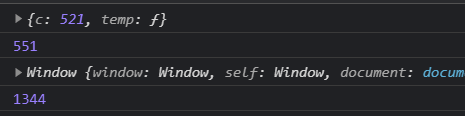
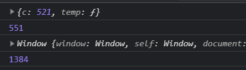
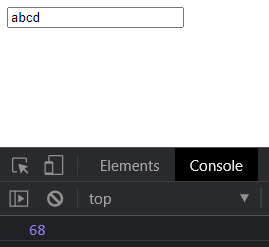

## 1. call方法的实现

思路：在obj上追加传入的方法改变指向并执行方法

```js
function call(Fn,obj,...args){
    //判断
    if(obj === undefined || obj === null){
        obj = globalThis; //全局对象(js新特性)
    }
    //为obj添加临时的方法
    obj.temp = Fn;
    //调用temp方法
    let result = obj.temp(...args);
    //删除temp方法
    delete obj.temp;
    //返回执行结果
    return result;
}
```

测试：

```js
// 声明函数
function add(a,b){
    // 打印this
    console.log(this);
    return a + b + this.c;
}

// 声明一个对象
let obj = {
	c: 521
}

// 添加全局属性
window.c = 1314;

// 执行call函数
console.log(call(add,obj,10,20));
console.log(call(add,null,10,20));
```



## 2. apply方法实现

思路：与call方法类似，不同的是数组采用展开运算

```js
function apply(Fn,obj,args){
    //判断
    if(obj === undefined || obj === null){
        obj = globalThis;
    }
    // 为obj添加临时方法
    obj.temp = Fn;
    // 执行方法
    let result = obj.temp(...args);
    // 删除临时属性
    delete obj.temp;
    // 返回结果
    return result;
}
```

测试：

```js
// 声明函数
function add(a,b){
    console.log(this);
    return a + b + this.c;
}

// 声明一个对象
let obj = {
	c: 521
}

// 添加全局属性
window.c = 1314;

// 执行apply函数
console.log(apply(add,obj,[10,20]));
console.log(apply(add,null,[30,40]));
```



## 3. bind方法实现

```js
function bind(Fn,obj,...args){
    //返回一个新的函数
    return function(...args2){
        //执行 call函数
        return call(Fn,obj,...args,...args2);
    }
}
```

测试：

```js
// 声明函数
function add(a,b){
    console.log(this);
    return a + b + this.c;
}

// 声明一个对象
let obj = {
	c: 521
}

// 添加全局属性
window.c = 1314;

// 执行bind函数
let fn = bind(add,obj,10,20);
console.log(fn());

let fn2 = bind(add,obj);
console.log(fn2(10,20));

let fn3 = add.bind(obj,10,20);
console.log(fn3(30,40));
```

## 4. 节流的实现

- 一些浏览器事件：window.onresize window.mousemove等

思路：返回一个函数，这个函数会被执行

```js
function throttle(callback,wait){
    //定义开始时间
    let start = 0;
    //返回结果是一个函数
    return function(e){
        //获取当前的时间戳
        let now = Date.now();
        //判断
        if(now - start >= wait){
            //若满足条件，则执行回调函数
            callback.call(this,e);
            //修改开始时间
            start = now;
        }
    }
}
```

测试：

```js
window.addEventListener('scroll',throttle(function(e){
	console.log(Date.now());
},500))
```

## 5. 防抖的实现

```js
function debounce(callback,time){
    //定时器变量
    let timeId = null;
    //返回一个函数
    return function(e){
        //判断
        if(timeId !== null){
            // 清空定时器
            clearTimeout(timeId);
        }
        //启动定时器
        timeId = setTimeout(() => {
            //执行回调
            callback.call(this,e);
            //重置定时器变量
            timeId = null;
        }, time);
    }
    
}
```

测试：

```js
let input = document.querySelector('input');
input.onkeydown = debounce(function(e){
	console.log(e.keyCode);
},1000)
```



