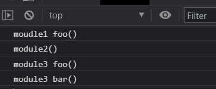
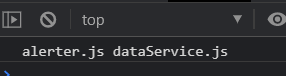
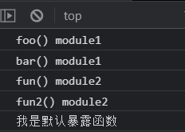

## commonjs 规范

### 基于服务端

```
ModularTest
└─ 01_CommonJS-Node
   ├─ app.js
   ├─ modules
   │  ├─ module1.js
   │  ├─ module2.js
   │  └─ module3.js
   └─ package.json
```

1.定义模块代码

module1.js

```js
// 暴露一个对象 module.exports = value 
module.exports = {
    msg: 'module1',
    foo(){
        console.log(this.msg);
    }
}
```

module2.js

```js
// 暴露一个函数 module.exports = function(){}
module.exports = function(){
    console.log("module2");
}
```

module3.js

```js
// exports.xxx = value
exports.foo = function(){
    console.log('foo() module3');
}

exports.bar = function(){
    console.log('bar() module3');
}

exports.arr = [1,2,3,4]
```

app.js

```js
// 将其他的模块汇集到主模块
let module1 = require('./modules/module1')
let module2 = require('./modules/module2')
let module3 = require('./modules/module3')

module1.foo();
module2();
module3.foo();
module3.bar();
console.log(module3.arr);
```

2.运行

```
node app.js
```

```
module1
module2
foo() module3
bar() module3
[ 1, 2, 3, 4 ]
```

### 基于浏览器端

```
ModularTest
└─ 02_CommonJS-Browserify
   ├─ index.html
   ├─ js
   │  ├─ dist //打包生成文件的目录
   │  └─ src  //源码所在的目录
   │     ├─ app.js // 应用主源文件
   │     ├─ module1.js
   │     ├─ module2.js
   │     └─ module3.js
   └─ package.json 
```

1.初始化项目 

```
npm init --y
```

2.下载browserify

```
全局  npm i browserify -g
局部  npm i browserify --save-dev
```

3.定义模块代码

module1.js

```js
// 暴露一个对象
module.exports = {
    foo(){
        console.log('moudle1 foo()');
    }
}
```

module2.js

```js
// 暴露一个函数
module.exports = function(){
    console.log('module2()');
}
```

module3.js

```js
// 分别暴露
exports.foo = function(){
    console.log('module3 foo()');
}

exports.bar = function(){
    console.log('module3 bar()');
}
```

app.js

```js
let module1 = require('./module1');
let module2 = require('./module2');
let module3 = require('./module3');

module1.foo();
module2();
module3.foo();
module3.bar();
```

4.打包

```
browserify js/src/app.js -o js/dist/bundle.js
```

5.引入

```html
<!DOCTYPE html>
<html lang="en">
<head>
    <meta charset="UTF-8">
    <meta http-equiv="X-UA-Compatible" content="IE=edge">
    <meta name="viewport" content="width=device-width, initial-scale=1.0">
    <title>Document</title>
    <script src="./js/dist/bundle.js"></script>
</head>
<body>
    
</body>
</html>
```

浏览器输出



## AMD规范

#### 不使用模块化规范

```
├─ 03._AMD_RequireJS
│  ├─ 01_NoAMD
│  │  ├─ app.js
│  │  ├─ js
│  │  │  ├─ alerter.js
│  │  │  └─ dataService.js
│  │  └─ test1.html
```

1.定义模块

dataService.js

```
// 定义一个没有依赖的模块
(function(window){
    let name = 'dataService.js';
    function getName(){
        return name;
    }
    window.dataService = {getName};
})(window)
```

alerter.js

```
// 定义一个有依赖的模块
(function(){
    let msg = 'alerter.js';
    function showMsg(){
        console.log(msg,dataService.getName());
    }
    window.alerter = {showMsg}
})(window,dataService)
```

app.js

```
(function(alerter){
    alerter.showMsg();
})(alerter)
```

2.使用

```html
<!DOCTYPE html>
<html lang="en">
<head>
    <meta charset="UTF-8">
    <meta http-equiv="X-UA-Compatible" content="IE=edge">
    <meta name="viewport" content="width=device-width, initial-scale=1.0">
    <title>Document</title>
    <script src="./js/dataService.js"></script>
    <script src="./js/alerter.js"></script>
    <script src="./app.js"></script>
</head>
<body>
    
</body>
</html>
```

3.运行



缺点：html中引入要依次进行，不能弄反

#### 使用AMD规范

1.下载require.js,并引入

```
官网 https://requirejs.org/
```

2.目录结构

```
├─ 03._AMD_RequireJS
│  └─ 02_RequireJS
│     ├─ index.html
│     └─ js
│        ├─ app.js
│        ├─ libs
│        │  └─ require.js
│        └─ modules
│           ├─ alerter.js
│           └─ dataService.js
```

3.定义模块

dataService.js

```js
// 定义没有依赖的模块

define(function(){
    let name = 'dataService.js';
    function getName(){
        return name;
    }
    // 暴露模块
    return {getName};
})
```

alerter.js

```js
// 定义有依赖的模块
// ['模块名称'],function(模块别名)
define(['dataService'],function(dataService){
    let msg = 'alerter.js';
    function showMsg(){
        console.log(msg,dataService.getName());
    }
    // 暴露模块
    return {showMsg};
})
```

app.js

```js
// 引入模块
(function(){
    requirejs.config({
        baseUrl: 'js/modules',  //基本路径
        paths:{ //配置路径
            // 模块名称：所在路径
            dataService: 'dataService',
            alerter: 'alerter'
        }
    })
    requirejs(['alerter'],function(alerter){
        alerter.showMsg();
    })
})();
```

4.使用

```html
<!DOCTYPE html>
<html lang="en">
<head>
    <meta charset="UTF-8">
    <meta http-equiv="X-UA-Compatible" content="IE=edge">
    <meta name="viewport" content="width=device-width, initial-scale=1.0">
    <title>Document</title>
    <!-- 引入require.js并指定js主文件的入口 -->
    <script data-main="js/app.js" src="./js/libs/require.js"></script>
</head>
<body>
</body>
</html>
```

5运行


#### 引入第三方模块

1.目录结构

```
ModularTest
│  └─ 02_RequireJS
│     ├─ index.html
│     └─ js
│        ├─ app.js
│        ├─ libs
│        │  ├─ jquery.js
│        │  └─ require.js
│        └─ modules
│           ├─ alerter.js
│           └─ dataService.js
```

2.jquery定义模块

```js
// jquery 源码
if ( typeof define === "function" && define.amd ) {
	define( "jquery", [], function () { return jQuery; } );
}
```

3.引入jquery

```js
// 引入模块
(function(){
    requirejs.config({
        baseUrl: 'js/',  //基本路径
        paths:{ //配置路径
            // 模块名称：所在路径
            dataService: './modules/dataService',
            alerter: './modules/alerter',
            jquery: './libs/jquery'
        }
    })
    requirejs(['alerter'],function(alerter){
        alerter.showMsg();
    })
})();
```

4.使用jquery

```js
// 定义有依赖的模块
// ['模块名称'],function(模块别名)
define(['dataService','jquery'],function(dataService,$){
    let msg = 'alerter.js';
    function showMsg(){
        console.log(msg,dataService.getName());
    }
    $('body').css('background','deeppink');
    // 暴露模块
    return {showMsg};
})
```

## ES6规范

```
ModularTest
├─ 04_ES6_Babel_Browserify
│  ├─ .babelrc
│  ├─ index.html
│  ├─ js
│  │  ├─ lib
│  │  │  ├─ app.js       ---es6->es5
│  │  │  ├─ module1.js   ---es6->es5
│  │  │  ├─ module2.js   ---es6->es5
│  │  │  ├─ module3.js   ---es6->es5
│  │  │  └─ bundle.js    ---browserify
│  │  └─ src
│  │     ├─ app.js
│  │     ├─ module1.js
│  │     ├─ module2.js
│  │     └─ module3.js
│  ├─ package-lock.json
│  └─ package.json
```

1.初始化包管理器

```
npm init --y
```

2.安装babel-cli,babel-preset-es2015和browserify

```
npm i babel-cli browserify -g
npm i babel-preset-es2015 --save-dev
```

3.定义.babelrc文件

```
{
  "presets": ["es2015"]
}
```

4.定义模块

module1.js

```js
// 暴露模块 分别暴露
export function foo(){
    console.log('foo() module1');
}

export function bar(){
    console.log('bar() module1');
}

export let arr = [1,2,3,4];
```

module2.js

```js
// 统一暴露
function fun(){
    console.log('fun() module2');
}

function fun2(){
    console.log('fun2() module2');
}

export {fun,fun2}
```

module3.js

```js
// 默认暴露 
export default ()=>{
    console.log('我是默认暴露函数');
}
```

app.js

```js
// 引入其他的模块
//语法：import xxx from '路径'
import {foo,bar} from './module1';
import {fun,fun2} from './module2';
import module3 from './module3'

foo();
bar();
fun();
fun2();
module3();
```

5.编译

```
ES6转ES5           babel js/src -d js/lib
Browserify编译js   browserify js/lib/app.js -o js/lib/bundle.js
```

6.引入

```html
<!DOCTYPE html>
<html lang="en">
<head>
    <meta charset="UTF-8">
    <meta http-equiv="X-UA-Compatible" content="IE=edge">
    <meta name="viewport" content="width=device-width, initial-scale=1.0">
    <title>Document</title>
    <script src="./js/lib/bundle.js"></script>
</head>
<body>
    
</body>
</html>
```

7.运行结果



