## Array

### 1.创建数组

1.使用Array构造函数

```js
let colors = new Array();         // []
let numbers = new Array(1,2,3,4)  // [1, 2, 3, 4]
let types = new Array(3)          // [empty × 3]
```

2.**数组字面量**表示法

> 数组字面量表示法不会调用Array构造函数

```js
let colors = [];         // []
let numbers = [1,2,3,4]  // [1, 2, 3, 4]
let types = [,,,]		// [empty × 3] 称为数组空位
```

3.**静态方法**from()将**类数组**结构转换为数组实例

```js
/** 转换字符串 */
const str = Array.from('Matt'); // ["M", "a", "t", "t"]
/** 转换集合 */
const m = new Map().set(1,'zhangsan').set(2,'lisi'); 
const mArray = Array.from(m); // [[1, "zhangsan"],[2, "lisi"]]
const s = new Set().add(1).add(2).add(3);
const sArray = Array.from(s); // [1, 2, 3]
/** 对数组浅复制 */
const a1 = [1,2,3,4,5];
const a2 = Array.from(a1); // [1, 2, 3, 4, 5]
console.log(a1===a2);      // false
/** 对象转数组 */
function ars(){
    return Array.from(arguments);
}
console.log(ars(1,2,3,4)); // [1, 2, 3, 4]
/** 转换自定义类对象 */
const arrayLikeObject = {
    0:'h',
    1:'e',
    2:'l',
    3:'l',
    4:'o',
    length:5
}
const arr = Array.from(arrayLikeObject) // ["h", "e", "l", "l", "o"]
```

### 2.检测数组

1.第一种方式

```js
if(value instanceof Array){

}
```

2.第二种方式

```js
if(Array.isArray(value)){

}
```

### 3.迭代器方法

​	Array原型上暴露了3个用于检索数组内容的方法：keys()、values()、entries()

keys()返回数组索引**迭代器**，values()返回数据元素的迭代器，entries()返回索引/值对的迭代器

```js
const a = ['foo','bar','baz'];
const aKeys = Array.from(a.keys());       // [0, 1, 2]
const aValue = Array.from(a.values());    // ["foo", "bar", "baz"]
const aEntries = Array.from(a.entries()); // [[0, "foo"],[1, "bar"],[2, "baz"]]
```

### 4.复制和填充

1.填充fill()

```js
// 用5填充整个数组
const zeroes = [0, 0, 0, 0, 0];
zeroes.fill(5);
console.log(zeroes); // [5, 5, 5, 5, 5]
zeroes.fill(0); // 重置

// 用6填充索引大于3的元素
zeroes.fill(6, 3);
console.log(zeroes); // [0, 0, 0, 6, 6]
zeroes.fill(0); // 重置

// 用7填充索引大于1且小于3的元素
zeroes.fill(7, 1, 3);
console.log(zeroes); // [0, 7, 7, 0, 0]
zeroes.fill(0); // 重置

// 用8填充索引大于等于1且小于等于4的元素
// (-4 + zeroes.length = 1)
// (-1 + zeroes.length = 4)
zeroes.fill(8, -4, -1);
console.log(zeroes); // [0, 8, 8, 8, 0]
zeroes.fill(0); // 重置

// 忽略超出数组边界的索引、零长度、相反方向的索引范围
zeroes.fill(1, -10, -6);
```

2.复制方法copywithin

从数组中复制一部分到同数组中的另外位置

| 参数     | 描述                                                         |
| -------- | ------------------------------------------------------------ |
| *target* | 必需。复制到指定目标索引位置。                               |
| *start*  | 可选。元素复制的起始位置。                                   |
| *end*    | 可选。停止复制的索引位置 (默认为 *array*.length)。如果为负值，表示倒数。 |

```js
const arr = [1, 2, 3, 4];
//赋值到索引2,从[0,2)
arr.copyWithin(2, 0, 2)
console.log(arr); // [1,2,1,2]
```

### 4.转换方法

1.数组转换

```js
let colors = ['red','blue','green'];
console.log(colors.toString());       // red,blue,green
console.log(colors.toLocaleString()); // red,blue,green
console.log(colors.valueOf());        // ["red", "blue", "green"]
```

2.数组连接

```js
let colors = ['red','blue','green'];
console.log(colors.join(','));   // red,blue,green
console.log(colors.join('||'));  // red||blue||green
```

### 5.栈方法

1.入栈push()方法：压入元素，返回值为数组元素数量

```js
let arr = [1,2,3]
let len = arr.push(4) 
console.log(arr)  // [1,2,3,4]
console.log(len)  // 4

/** 添加多个 */
let arr = [1,2,3]
let arr2 = ['a','b','c']
arr.push(...arr2)
console.log(arr)  // [1, 2, 3, "a", "b", "c"]
```

2.出栈pop()方法：从末尾弹出元素，直接改变元数组，返回值为弹出的元素

```js
let arr = [1,2,3]
let n = arr.pop()
console.log(arr)  // [1,2]
console.log(n)    // 3
```

### 6.队列方法

入队方法由push代替

1.出队shift(): 从数组前面取出一个元素

```js
let arr = [1,2,3]
let n = arr.shift()
console.log(arr) // [2, 3]
console.log(n)   // 1
```

2.从头部添加

```js
let arr = [1,2,3]
let n = arr.unshift(4)
console.log(arr)  // [4, 1, 2, 3]
console.log(n)    // 4
```

### 7.排序方法

1.反转数组顺序reverse()

```js
let arr = [1, 4, 2, 9];
let re = arr.reverse()
console.log(re) // [9, 2, 4, 1]
```

2.排序方法sort()

`sort`每次使用两个值进行比较 `Array.sort((a,b)=>a-b`

- 返回负数 a 排在 b前面，从小到大
- 返回正数 b 排在a 前面
- 返回 0 时不动

2.1 从小到大排序

```js
let arr = [1, 4, 2, 9];
let sor = arr.sort()
console.log(arr) // [1, 4, 2, 9]
console.log(sor) // [1, 4, 2, 9]
```

2.2 从大到小排序

```js
let arr = [1, 4, 2, 9];
let sor = arr.sort(function(v1,v2){
    return v2 - v1
})
console.log(sor) // [9, 4, 2, 1]
console.log(arr) // [9, 4, 2, 1]
```

2.3 按年龄从小到大排序

```js
let user = [
    {name:"张三",age:15},
    {name:"李四",age:13},
    {name:"王五",age:17}
]
let sor = user.sort(function(v1,v2){
    return v1.age - v2.age
})
console.log(sor)
```

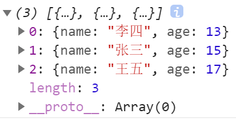

### 8.操作方法

1.连接数组concat()方法

**连接两个或多个数组**

```js
let arr = [0, 1, 2, 3];
let arr2 = ['a','b']
let arr3 = [1,2]
let con = arr.concat(arr2,arr3)
console.log(con) // [0, 1, 2, 3, "a", "b", 1, 2]
```

2.使用 slice 方法从数组中截取部分元素组合成新数组（并不会改变原数组）

```js
let arr = [1,2,3,4,5,6]
let sl = arr.slice(1,3)
console.log(arr)  // [1, 2, 3, 4, 5, 6]
console.log(sl)   // [2, 3]
```

3.使用splice()方法会对原数组进行改变，返回值为删除的元素。

```js
let arr = [0, 1, 2, 3, 4, 5, 6];
let sp = arr.splice(1,3) 
console.log(sp)   // [1, 2, 3]
console.log(arr)  // [0, 4, 5, 6]
```

4.设置在删除位置添加的元素

```js
let arr = [0, 1, 2, 3, 4, 5, 6];
let sp = arr.splice(1,3,'a','b')
console.log(sp)  // [1, 2, 3]
console.log(arr) // [0, "a", "b", 4, 5, 6]
```

5.方法split()用于将字符串分割成数组

```js
let str = "a,b,c,d"
let arr = str.split(",")
console.log(arr) // ["a", "b", "c", "d"]
```

### 9.搜索和位置方法

1.严格相等搜索

```js
let nums = [1,2,3,4,5,4,3,2,1];

// 从头或尾开始查找
console.log(nums.indexOf(4));       // 3
console.log(nums.lastIndexOf(4));   // 5
console.log(nums.includes(4));      // true

// 从4索引开始查找
console.log(nums.indexOf(4,4));     // 5
console.log(nums.lastIndexOf(4,4)); // 3
console.log(nums.includes(4,7)); // true

// 对象查找(严格相等)
let person = {name: 'Nicholas'};
let people = [{name: 'Nicholas'}];
let morePeople = [person];

console.log(people.indexOf(person));      // -1 未查找到
console.log(morePeople.indexOf(person));  // 0  查找到，索引为0
console.log(people.includes(person));     // false
console.log(morePeople.includes(person)); // true
```

2.断言搜函数搜索

2.1使用find ()方法找到后会把值返回出来

```js
let arr = ["baidu","taobao","jd"];
let find = arr.find(function(item){
    return item == "taobao"
})
console.log(find) // taobao
```

2.使用find ()方法查找对象

```js
const user = [{ name: "李四",age:11 }, { name: "张三" ,age:12}, { name: "王五" ,age:13}];
const find = user.find(function(u){
    return u.name = "王五"
})
console.log(find) // {name: "王五", age: 11}
```

3.使用findIndex()方法返回索引值

```js
const user = [{ name: "李四",age:11 }, { name: "张三" ,age:12}, { name: "王五" ,age:13}];
let find = user.findIndex(function(item){
    return item.name == "张三"
})
console.log(find) // 1
```

### 10.迭代方法

1.方法every() 用于递归的检测元素，要所有元素操作都要返回真结果才为真。

```js
const user = [
    { name: "李四", js: 89 },
    { name: "马六", js: 55 },
    { name: "张三", js: 78 }
  ];
const result = user.every(function(u){
    return u.js >= 60
})
console.log(result) // false
```

2.方法some() 可以递归的检测元素，如果有一个返回true，表达式结果就是真。

```js
const user = [
    { name: "李四", js: 59 },
    { name: "马六", js: 55 },
    { name: "张三", js: 78 }
  ];
//第一个参数为元素，第二个参数为索引，第三个参数为原数组。
const result = user.some(function(item,index,arry){
    return item.js >= 60
})
console.log(result) // true
```

3.方法filter ()可以过滤数据中元素

```js
//过滤js成绩小于等于60的元素
const user = [
    { name: "李四", js: 59 },
    { name: "马六", js: 55 },
    { name: "张三", js: 78 }
  ];
const result = user.filter(function(item,index,arry){
    return item.js <= 60
})
console.log(result)
```

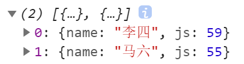

4.方法map 映射可以在数组的所有元素上应用函数，用于映射出新的值。

4.1 返回用户名数组

```js
const user = [
    { name: "李四", js: 89 },
    { name: "马六", js: 55 },
    { name: "张三", js: 78 }
  ];
const result = user.map(function(item){
    return item.name
})
console.log(result) // ["李四", "马六", "张三"]
```

4.2 名字前面加上标题

```js
const user = [
    { name: "李四", js: 89 },
    { name: "马六", js: 55 },
    { name: "张三", js: 78 }
  ];
const result = user.map(function(u){
    return "1班:"+u.name
})
console.log(result) // ["1班:李四", "1班:马六", "1班:张三"]
```

5.方法forEach()使函数作用在每个数组元素上，但是没有返回值。

```js
let user = [
    {name:"张三",age:15},
    {name:"李四",age:13},
    {name:"王五",age:17}
]

user.forEach((item,index,array)=>{
    item.age += 5
})

console.log(user);
```

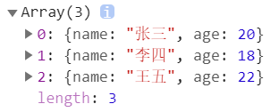

### 11.归并方法

reduce Todo

迭代数组的所有元素

函数参数说明如下

| 参数  | 说明                       |
| ----- | -------------------------- |
| prev  | 上次调用回调函数返回的结果 |
| cur   | 当前的元素值               |
| index | 当前的索引                 |
| array | 原数组                     |

### 12.循环遍历

1.使用for函数遍历数组

```js
let arr = [1, 4, 2, 9];
for(let i = 0;i < arr.length;i++){
    console.log(arr[i])
}
/*
1
4
2
9
*/
```

2.使用for/in遍历时的 key 值为数组的索引

```js
let user = [
    {name:"张三",age:15},
    {name:"李四",age:13},
    {name:"王五",age:17}
]
for(const key in  user){
    u = user[key]
    console.log(u.name)
}
/*
张三
李四
王五
*/
```

3.使用for/of 与 for/in 不同的是 for/of 每次循环取其中的值而不是索引。

```js
let user = [
    {name:"张三",age:15},
    {name:"李四",age:13},
    {name:"王五",age:17}
]
for(const u of  user){
    console.log(u)
}
/*
{name: "张三", age: 15}
{name: "李四", age: 13}
{name: "王五", age: 17}
*/
```

## Set 集合

用于存储任何类型的唯一值，无论是基本类型还是对象引用。

- 只能保存值没有键名
- 严格类型检测如字符串数字不等于数值型数字
- 值是唯一的
- 遍历顺序是添加的顺序，方便保存回调函数

### 1.创建set

```js
let set = new Set()
set.add(1)
set.add(2)
console.log(set) // Set(2) {1, 2}
```

### 2.获取元素数量

```js
let set = new Set(['a','b'])
let size = set.size
console.log(size) // 2
```

### 3.元素检测:

检测元素是否存在

```js
let set = new Set(['baidu','taobao'])
let ishas = set.has('baidu')
console.log(ishas) // true
```

### 4.删除元素

1.使用 `delete` 方法删除单个元素，返回值为`boolean`类型

```js
let set = new Set()
set.add(1)
set.add(2)
//删除元素
let flag = set.delete(1)
console.log(flag) // true 删除成功
console.log(set)  // Set(1) {2}   剩余2
```

2.使用 `clear` 删除所有元素

```js
let set = new Set()
set.add(1)
set.add(2)
set.clear()
console.log(set)  // Set(0) {}
```

3.去除重复元素

```js
// 去除字符串重复
console.log([...new Set("www.baidu.com")].join("")) // w.baiducom
// 去除数组重复
const arr = [1, 2, 3, 5, 2, 3]
console.log(...new Set(arr)) // 1 2 3 5
```

4.移除Set中大于5的数值

```js
let hd = new Set("123456789");
hd = new Set([...hd].filter(item => item<5))
console.log(hd) // Set(4) {"1", "2", "3", "4"}
```

### 6.转换方法

1.将Set类型转为数组

```js
let set = new Set(['baidu','taobao'])
let arr = Array.from(set)
console.log(arr) // ["baidu", "taobao"]
```

2.点语法将Set类型转为数组

```js
let set = new Set(['baidu','taobao'])
let arr = [...set]
console.log(arr) // ["baidu", "taobao"]
```

### 7.遍历数据

返回迭代对象

```js
const hd = new Set(["hdcms", "houdunren"]);
console.log(hd.values());
console.log(hd.keys()); 
console.log(hd.entries()); 
```

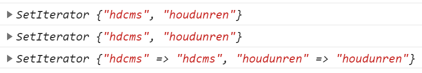

forEach 遍历Set数据

```js
let set = new Set([7, 6, 2, 8, 2, 6]);
set.forEach(function(item,key){
    console.log(item,key)
})
```

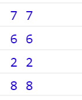

for of 遍历Set数据

```js
let set = new Set([7, 6, 2, 8, 2, 6]);
for(const iter of set){
    console.log(iter)
}
```

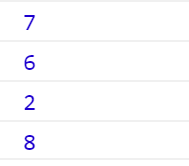

## Map 集合

Map是一组键值对的结构，用于解决以往不能用对象做为键的问题

- 具有极快的查找速度
- 函数、对象、基本类型都可以作为键或值

### 1.创建map

```js
let m = new Map([
    [1,"张三"],
    [2,"李四"]
])
console.log(m)  // Map(2) {1 => "张三", 2 => "李四"}
```

### 2.添加元素

使用set 方法添加元素，支持链式操作

```js
let m = new Map([
    [1,"张三"],
    [2,"李四"]
])
m.set(3,"王五")
console.log(m) // Map(3) {1 => "张三", 2 => "李四", 3 => "王五"}
```

### 3.获取数量

```js
let m = new Map([
    [1,"张三"],
    [2,"李四"]
])
console.log(m.size) // 2
```

### 4.元素检测

检测元素是否存在

```js
let m = new Map([
    [1,"张三"],
    [2,"李四"]
])
console.log(m.has(1)) // true
```

###  5.读取元素

```js
let m = new Map([
    [1,"张三"],
    [2,"李四"]
])
console.log(m.get(2)) // 李四
```

### 6.删除元素

1.使用 `delete()` 方法删除单个元素

```js
let m = new Map([
    [1,"张三"],
    [2,"李四"]
])
m.delete(1)
console.log(m) // Map(1) {2 => "李四"}
```

2.使用`clear`方法清除Map所有元素

```js
let m = new Map([
    [1,"张三"],
    [2,"李四"]
])
m.clear()
console.log(m) // Map(0) {}
```

### 7.遍历数据

1.返回可遍历的迭代对象

```js
let m = new Map([
    [1,"张三"],
    [2,"李四"]
])
console.log(m.keys()); 
console.log(m.values()); 
console.log(m.entries());
```

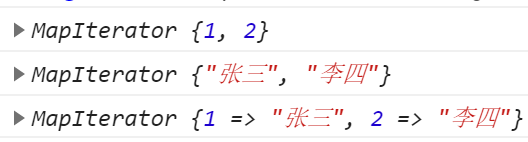

2.可以使用keys/values 函数遍历键与值

```js
let m = new Map([
    [1,"张三"],
    [2,"李四"]
])
for(const key of m.keys()){
    console.log(key)
}
for(const vlue of m.values()){
    console.log(vlue)
}
```

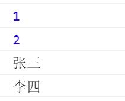

3.使用for/of遍历操作

```js
let m = new Map([
    [1,"张三"],
    [2,"李四"]
])
for(const [key,value] of m){
    console.log(key,value)
}
```

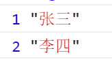

4.使用forEach遍历操作

```js
let m = new Map([
    [1,"张三"],
    [2,"李四"]
])
m.forEach(function(value,key){
    console.log(value+'=>'+key)
})
```

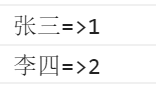

###  8.数组转换

1.`Array.form` 静态方法将Map类型转为数组

```js
let m = new Map([
    [1,"张三"],
    [2,"李四"]
])
console.log(Array.from(m))
```

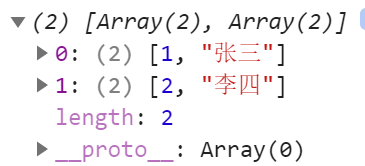

2.展开语法转换为数组

```js
let m = new Map([
    [1,"张三"],
    [2,"李四"]
])
console.log(...m)
console.log(...m.entries())
console.log(...m.values())
console.log(...m.keys())
```

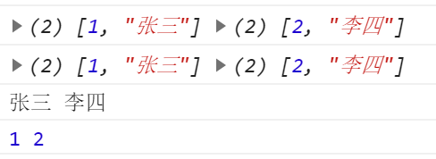