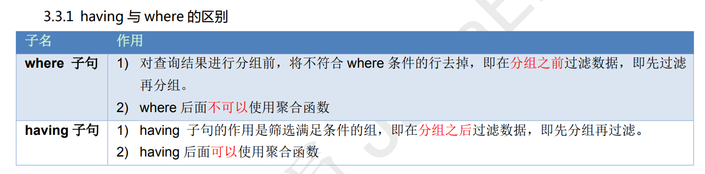

## 数据库操作

1.直接创建数据库 db1

```sql
create database db1;
```

2.判断是否存在，如果不存在则创建数据库 db2

```sql
create database if not exists db2;
```

3.创建数据库并指定字符集为 gbk

```sql
create database db3 default character set gbk;
```

4.查看所有的数据库

```sql
show databases;
```

5.查看某个数据库的定义信息

```sql
show create database db3;
```

6.将 db3 数据库的字符集改成 utf8

```sql
alter database db3 character set utf8;
```

7.删除 db2 数据库

```sql
drop database db2;
```

8.查看正在使用的数据库

```sql
select database();
```

9.改变要使用的数据库

```sql
use db4;
```

## 操作表结构

1.创建 student 表包含 id,name,birthday 字段

```sql
create table student (
id int, -- 整数
name varchar(20), -- 字符串
birthday date -- 生日，最后没有逗号
);
```

2.查看 day21 数据库中的所有表

```sql
use day21;
show tables;
```

3.查看 student 表的结构

```sql
desc student;
```

4.查看 student 的创建表 SQL 语句

```sql
show create table student;
```

5.创建一个 s1 的表与 student 结构相同

```sql
create table s1 like student;
desc s1;
```

6.直接删除表 s1 表

```sql
drop table s1;
```

7.判断表是否存在并删除 s1 表

```sql
drop table if exists s1;
```

8.为学生表添加一个新的字段 remark,类型为 varchar(20)

```sql
alter table student add remark varchar(20);
```

9.将 student 表中的 remark 字段的改成 varchar(100)

```sql
alter table student modify remark varchar(100);
```

10.将 student 表中的 remark 字段名改成 intro，类型 varchar(30)

```sql
alter table student change remark intro varchar(30);
```

11.删除 student 表中的字段 intro

```sql
ALTER TABLE student DROP intro;
```

12.将学生表 student 改名成 student2

```sql
rename table student to student2;
```

13.将 student2 表的编码修改成 gbk

```sql
alter table student2 character set gbk;
```

## 操作表中的数据

1.插入所有的列，向学生表中

```sql
insert into student (id,name,age,sex) values (1, '孙悟空', 20, '男');
insert into student (id,name,age,sex) values (2, '孙悟天', 16, '男');
```

2.插入所有列

```sql
insert into student values (3, '孙悟饭', 18, '男', '龟仙人洞中');
```

3.如果只插入部分列，必须写列名

```sql
insert into student values (3, '孙悟饭', 18, '男');
```

4.创建 student2 表，student2 结构和 student 表结构一样

```sql
drop table student2;
create table student2 like student;
```

5.将 student 表中的数据添加到 student2 表中

```sql
insert into student2 select * from student;
```

6.如果只想复制 student 表中 name,age 字段数据到 student2 表中，两张表都写出相应的列名

```sql
insert into student2 (name,age) select name,age from student;
```

7.不带条件修改数据，将所有的性别改成女

```sql
update student set sex = '女';
```

8.带条件修改数据，将 id 号为 2 的学生性别改成男

```sql
update student set sex='男' where id=2;
```

9.一次修改多个列，把 id 为 3 的学生，年龄改成 26 岁，address 改成北京

```sql
update student set age=26, address='北京' where id=3;
```

10.带条件删除数据，删除 id 为 1 的记录

```sql
delete from student where id=1;
```

11.不带条件删除数据,删除表中的所有数据

```sql
delete from student;
```

## 查询表中的数据

1.查询所有的学生

```sql
select * from student;
```

2.查询 student 表中的 name 和 age 列

```sql
select name,age from student;
```

3.使用别名

```sql
select name as 姓名,age as 年龄 from student;
```

4.表使用别名

```sql
select st.name as 姓名,age as 年龄 from student as st
```

5.查询学生来至于哪些地方

```sql
select address from student;
```

6.去掉重复的记录

```sql
select distinct address from student;
```

```sql
CREATE TABLE student3 (
 id int, -- 编号
 name varchar(20), -- 姓名
 age int, -- 年龄
 sex varchar(5), -- 性别
 address varchar(100), -- 地址
 math int, -- 数学
 english int -- 英语
);
INSERT INTO student3(id,NAME,age,sex,address,math,english) VALUES (1,'马云',55,'男','
杭州',66,78),(2,'马化腾',45,'女','深圳',98,87),(3,'马景涛',55,'男','香港',56,77),(4,'柳岩
',20,'女','湖南',76,65),(5,'柳青',20,'男','湖南',86,NULL),(6,'刘德华',57,'男','香港
',99,99),(7,'马德',22,'女','香港',99,99),(8,'德玛西亚',18,'男','南京',56,65);
```

7.给所有的数学加 5 分

```sql
select math+5 from student;
```

8.查询 math + english 的和

```sql
select *,(math+english) as 总成绩 from student;
-- as 可以省略
select *,(math+english) 总成绩 from student;
```

9.查询 math 分数大于 80 分的学生

```sql
select * from student3 where math>80;
```

10.查询 english 分数小于或等于 80 分的学生

```sql
select * from student3 where english <=80;
```

11.查询 age 等于 20 岁的学生

```sql
select * from student3 where age = 20;
```

12.查询 age 不等于 20 岁的学生，注：不等于有两种写法

```sql
select * from student3 where age <> 20;
select * from student3 where age != 20;
```

13.查询 age 大于 35 且性别为男的学生(两个条件同时满足)

```sql
select * from student3 where age>35 and sex='男';
```

14.查询 age 大于 35 或性别为男的学生(两个条件其中一个满足)

```sql
select * from student3 where age>35 or sex='男';
```

15.查询 id 是 1 或 3 或 5 的学生

```sql
select * from student3 where id=1 or id=3 or id=5;
```

16.查询 id 是 1 或 3 或 5 的学生

```sql
select * from student3 where id in(1,3,5);
```

17.查询 id 不是 1 或 3 或 5 的学生

```sql
select * from student3 where id not in(1,3,5);
```

18.english 成绩大于等于 75，且小于等于 90 的学生

```sql
select * from student3 where english between 75 and 90;
```

19.查询姓马的学生

```sql
select * from student3 where name like '马%';
```

20.查询姓名中包含'德'字的学生

```sql
select * from student3 where name like '%德%';
```

21.查询姓马，且姓名有两个字的学生

```sql
select * from student3 where name like '马_';
```

## 条件查询

1.查询所有数据,使用年龄降序排序

```sql
select * from student order by age desc;
```

2.查询所有数据,在年龄降序排序的基础上，如果年龄相同再以数学成绩升序排序

```sql
select * from student order by age desc, math asc;
```

3.查询学生总数

```sql
select count(id) as 总人数 from student;
select count(*) as 总人数 from student;
```

4.查询 id 字段，如果为 null，则使用 0 代替

```sql
select ifnull(id,0) from student;
--我们可以利用 IFNULL()函数，如果记录为 NULL，给个默认值，这样统计的数据就不会遗漏
select count(ifnull(id,0)) from student;
```

5.查询年龄大于 20 的总数

```sql
select count(*) from student where age>20;
```

6.查询数学成绩总分

```sql
select sum(math) 总分 from student;
```

7.查询数学成绩平均分

```sql
select avg(math) 平均分 from student;
```

8.查询数学成绩最高分

```sql
select max(math) 最高分 from student;
```

9.查询数学成绩最低分

```sql
select min(math) 最低分 from student;
```

10.按性别进行分组，求男生和女生数学的平均分

```sql
select sex, avg(math) from student3 group by sex;
```

11.查询男女各多少人

```sql
select sex, count(*) from student3 group by sex;
```

12.查询年龄大于 25 岁的人,按性别分组,统计每组的人数

```sql
select sex, count(*) from student3 where age > 25 group by sex ;
```

13.查询年龄大于 25 岁的人，按性别分组，统计每组的人数，并只显示性别人数大于 2 的数据

```sql
--错误代码
SELECT sex, COUNT(*) FROM student3 WHERE age > 25 GROUP BY sex WHERE COUNT(*) >2;
--正确代码
SELECT sex, COUNT(*) FROM student3 WHERE age > 25 GROUP BY sex having COUNT(*) >2;
```



14.查询学生表中数据，从第 3 条开始显示，显示 6 条。

```sql
select * from student3 limit 2,6;
--如果第一个参数是 0 可以省略写
select * from student3 limit 5;
--最后如果不够 5 条，有多少显示多少
select * from student3 limit 10,5;
```