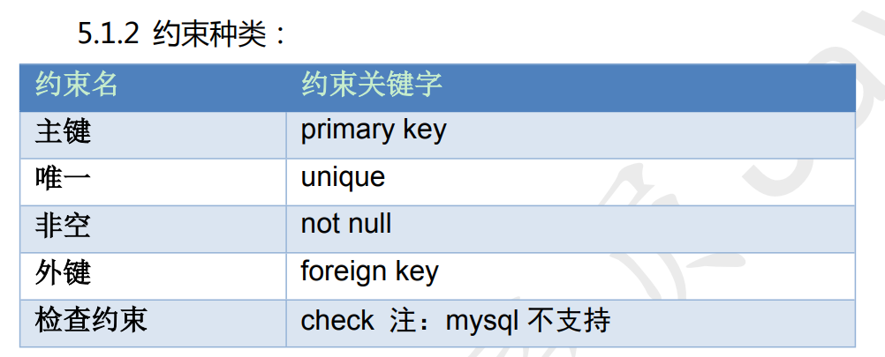
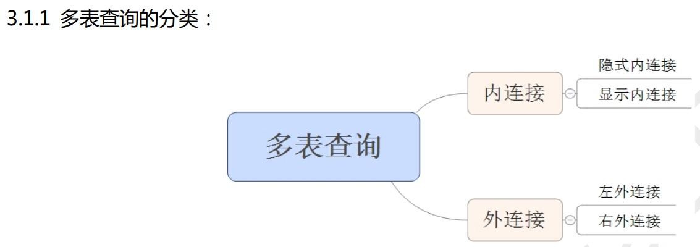

## 数据库备份和还原

1.备份 day21 数据库中的数据到·`d:\day21.sql `文件中

```sql
mysqldump -uroot -proot day21 > d:/day21.sql
```

2.还原 day21 数据库中的数据，注意：还原的时候需要先登录 MySQL,并选中对应的数据库。

```sql
use day21;
source d:/day21.sql;
```

## 数据表的约束



1.创建表学生表 st5, 包含字段(id, name, age)将 id 做为主键

```sql
--主键特点：非空，唯一
create table st5 (
 id int primary key, -- id 为主键
 name varchar(20),
 age int
)
desc st5;
-- 插入重复的主键值
insert into st5 values (1, '关羽', 30);
-- 错误代码： 1062 Duplicate entry '1' for key 'PRIMARY'
insert into st5 values (1, '关云长', 20);
select * from st5;
-- 插入 NULL 的主键值, Column 'id' cannot be null
insert into st5 values (null, '关云长', 20);
```

2.删除 st5 表的主键

```sql
alter table st5 drop primary key;
```

3.添加主键

```sql
alter table st5 add primary key(id);
```

3.指定主键自增起始值为 1000

```sql
create table st4 (
 id int primary key auto_increment,
 name varchar(20)
) auto_increment = 1000;
```

4.创建好以后修改起始值

```sql
alter table st4 auto_increment = 2000;
```

5.DELETE 和 TRUNCATE 对自增长的影响

```
DELETE：删除所有的记录之后，自增长没有影响。
TRUNCATE：删除以后，自增长又重新开始。
```

7.创建学生表 st7, 包含字段(id, name),name 这一列设置唯一约束,不能出现同名的学生

```sql
--唯一约束特点 null 没有数据，不存在重复的问题
create table st7 (
 id int,
 name varchar(20) unique
)
-- 重复插入多个 null 会怎样？
insert into st7 values (2, null);
insert into st7 values (3, null);
```

8.创建表学生表 st8, 包含字段(id,name,gender)其中 name 不能为 NULL

```sql
create table st8 (
id int,
name varchar(20) not null,
gender char(1)
)
```

9.创建一个学生表 st9，包含字段(id,name,address)， 地址默认值是广州

```sql
create table st9 (
 id int,
 name varchar(20),
 address varchar(20) default '广州'
)
-- 添加一条记录,使用默认地址
insert into st9 values (1, '李四', default);
insert into st9 (id,name) values (2, '李白');
-- 添加一条记录,不使用默认地址
insert into st9 values (3, '李四光', '深圳');
```

10.创建从表 employee 并添加外键约束 emp_depid_fk

```sql
create table employee(
id int primary key auto_increment,
name varchar(20),
age int,
dep_id int, -- 外键对应主表的主键
-- 创建外键约束
constraint emp_depid_fk foreign key (dep_id) references department(id)
)
[CONSTRAINT] [外键约束名称] FOREIGN KEY(外键字段名) REFERENCES 主表名(主键字段名)
```

11.在 employee 表情存在的情况下添加外键

```sql
alter table employee add constraint emp_depid_fk
foreign key (dep_id) references department(id);
--已有表增加外键
ALTER TABLE 从表 ADD [CONSTRAINT] [外键约束名称] FOREIGN KEY (外键字段名) REFERENCES 主表(主
键字段名);
```

12.删除 employee 表的 emp_depid_fk 外键

```sql
alter table employee drop foreign key emp_depid_fk;
```


13.删除 employee 表，重新创建 employee 表，添加级联更新和级联删除

```sql
drop table employee;
create table employee(
id int primary key auto_increment,
name varchar(20),
age int,
dep_id int, -- 外键对应主表的主键
-- 创建外键约束
constraint emp_depid_fk foreign key (dep_id) references
 department(id) on update cascade on delete cascade
)
-- 再次添加数据到员工表和部门表
INSERT INTO employee (NAME, age, dep_id) VALUES ('张三', 20, 1);
INSERT INTO employee (NAME, age, dep_id) VALUES ('李四', 21, 1);
INSERT INTO employee (NAME, age, dep_id) VALUES ('王五', 20, 1);
INSERT INTO employee (NAME, age, dep_id) VALUES ('老王', 20, 2);
INSERT INTO employee (NAME, age, dep_id) VALUES ('大王', 22, 2);
INSERT INTO employee (NAME, age, dep_id) VALUES ('小王', 18, 2);
-- 删除部门表？能不能直接删除？
drop table department;
-- 把部门表中 id 等于 1 的部门改成 id 等于 10
update department set id=10 where id=1;
select * from employee;
select * from department;
-- 删除部门号是 2 的部门
delete from department where id=2;
```


## 表连接查询

数据准备

```sql
create table dept(
 id int primary key auto_increment,
 name varchar(20)
)
insert into dept (name) values ('开发部'),('市场部'),('财务部');
# 创建员工表
create table emp (
 id int primary key auto_increment,
 name varchar(10),
 gender char(1), -- 性别
 salary double, -- 工资
 join_date date, -- 入职日期
 dept_id int,
 foreign key (dept_id) references dept(id) -- 外键，关联部门表(部门表的主键)
)
insert into emp(name,gender,salary,join_date,dept_id) values('孙悟空','男
',7200,'2013-02-24',1);
insert into emp(name,gender,salary,join_date,dept_id) values('猪八戒','男
',3600,'2010-12-02',2);
insert into emp(name,gender,salary,join_date,dept_id) values('唐僧','男',9000,'2008-
08-08',2);
insert into emp(name,gender,salary,join_date,dept_id) values('白骨精','女
',5000,'2015-10-07',3);
insert into emp(name,gender,salary,join_date,dept_id) values('蜘蛛精','女
',4500,'2011-03-14',1);
```



1.查询所有的员工和所有的部门

```sql
select * from emp,dept;
```

2.查询员工和部门的名字

```sql
select emp.`name`, dept.`name` from emp,dept where emp.`dept_id` = dept.`id`;
```

3.隐式内连接：看不到 JOIN 关键字，条件使用 WHERE 指定

```sql
select * from emp,dept where emp.`dept_id` = dept.`id`;
--SELECT 字段名 FROM 左表, 右表 WHERE 条件
```

4.显示内连接：使用 INNER JOIN ... ON 语句, 可以省略 INNER

```sql
SELECT 字段名 FROM 左表 [INNER] JOIN 右表 ON 条件
```

5.查询唐僧的信息，显示员工 id，姓名，性别，工资和所在的部门名称

```sql
-- 1.确定查询哪些表
select * from emp inner join dept;
--2.确定表连接条件，员工表.dept_id = 部门表.id 的数据才是有效的
select * from emp e inner join dept d on e.`dept_id` = d.`id`;
--3.确定查询条件，我们查询的是唐僧的信息，员工表.name='唐僧'
select * from emp e inner join dept d on e.`dept_id` = d.`id` where e.`name`='唐僧
';
--4.确定查询字段，查询唐僧的信息，显示员工 id，姓名，性别，工资和所在的部门名称
select e.`id`,e.`name`,e.`gender`,e.`salary`,d.`name` from emp e inner join dept d
on e.`dept_id` = d.`id` where e.`name`='唐僧';
--5.我们发现写表名有点长，可以给表取别名，显示的字段名也使用别名
select e.`id` 编号,e.`name` 姓名,e.`gender` 性别,e.`salary` 工资,d.`name` 部门名字 from
emp e inner join dept d on e.`dept_id` = d.`id` where e.`name`='唐僧';
```

6.左外连接：使用 LEFT OUTER JOIN ... ON，OUTER 可以省略

```sql
SELECT 字段名 FROM 左表 LEFT [OUTER] JOIN 右表 ON 条件
-- 在部门表中增加一个销售部
insert into dept (name) values ('销售部');
select * from dept;
-- 使用内连接查询
select * from dept d inner join emp e on d.`id` = e.`dept_id`;
-- 使用左外连接查询
select * from dept d left join emp e on d.`id` = e.`dept_id`;
```

7.右外连接：使用 RIGHT OUTER JOIN ... ON，OUTER 可以省略

```sql
SELECT 字段名 FROM 左表 RIGHT [OUTER ]JOIN 右表 ON 条件
-- 在员工表中增加一个员工
insert into emp values (null, '沙僧','男',6666,'2013-12-05',null);
select * from emp;
-- 使用内连接查询
select * from dept inner join emp on dept.`id` = emp.`dept_id`;
-- 使用右外连接查询
select * from dept right join emp on dept.`id` = emp.`dept_id`;
```

## 子查询

子查询的概念:

1)一个查询的结果做为另一个查询的条件

2)有查询的嵌套，内部的查询称为子查询

3)子查询要使用括号

数据准备

```sql
create table dept(
 id int primary key auto_increment,
 name varchar(20)
)
insert into dept (name) values ('开发部'),('市场部'),('财务部');
# 创建员工表
create table emp (
 id int primary key auto_increment,
 name varchar(10),
 gender char(1), -- 性别
 salary double, -- 工资
 join_date date, -- 入职日期
 dept_id int,
 foreign key (dept_id) references dept(id) -- 外键，关联部门表(部门表的主键)
)
insert into emp(name,gender,salary,join_date,dept_id) values('孙悟空','男
',7200,'2013-02-24',1);
insert into emp(name,gender,salary,join_date,dept_id) values('猪八戒','男
',3600,'2010-12-02',2);
insert into emp(name,gender,salary,join_date,dept_id) values('唐僧','男',9000,'2008-
08-08',2);
insert into emp(name,gender,salary,join_date,dept_id) values('白骨精','女
',5000,'2015-10-07',3);
insert into emp(name,gender,salary,join_date,dept_id) values('蜘蛛精','女
',4500,'2011-03-14',1);
```

1.查询开发部中有哪些员工

```sql
select * from emp;
-- 通过两条语句查询
select id from dept where name='开发部' ;
select * from emp where dept_id = 1;
-- 使用子查询
select * from emp where dept_id = (select id from dept where name='开发部');
```

2.查询工资最高的员工是谁？

```sql
-- 1) 查询最高工资是多少
select max(salary) from emp;
-- 2) 根据最高工资到员工表查询到对应的员工信息
select * from emp where salary = (select max(salary) from emp);
```

3.查询工资小于平均工资的员工有哪些？

```sql
-- 1) 查询平均工资是多少
select avg(salary) from emp;
-- 2) 到员工表查询小于平均的员工信息
select * from emp where salary < (select avg(salary) from emp);
```

4.查询工资大于 5000 的员工，来自于哪些部门的名字

```sql
-- 先查询大于 5000 的员工所在的部门 id
select dept_id from emp where salary > 5000;
-- 再查询在这些部门 id 中部门的名字 Subquery returns more than 1 row
select name from dept where id = (select dept_id from emp where salary > 5000);
select name from dept where id in (select dept_id from emp where salary > 5000);
```

5.查询开发部与财务部所有的员工信息

```sql
-- 先查询开发部与财务部的 id
select id from dept where name in('开发部','财务部');
-- 再查询在这些部门 id 中有哪些员工
select * from emp where dept_id in (select id from dept where name in('开发部','财务
部'));
```

6.查询出 2011 年以后入职的员工信息，包括部门名称

```sql
-- 查询出 2011 年以后入职的员工信息，包括部门名称
-- 在员工表中查询 2011-1-1 以后入职的员工
select * from emp where join_date >='2011-1-1';
-- 查询所有的部门信息，与上面的虚拟表中的信息组合，找出所有部门 id 等于的 dept_id
select * from dept d, (select * from emp where join_date >='2011-1-1') e where
d.`id`= e.dept_id ;
```

## 事务

