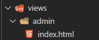
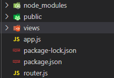

## 入门

**安装**

```
npm install express --save
```

**创建服务**

```js
let express = require('express')
// 创建服务器程序
let app = express()
// 监听get请求
app.get('/',(req,resp)=>{
    resp.send('hello express')
})
// 监听端口
app.listen(3000,()=>{
    console.log('app is runing at port:3000');
})
```

## 公开访问静态资源

```js
// 公开指定目录
// 只要带上/public/就会访问./public/目录
app.use('/public/',express.static('./public/'))
```

能直接访问public下的index.html

```
http://localhost:3000/public/index.html
```

**可以设置多个目录**

```js
// 公开指定目录
// 只要带上/public/就会访问./public/目录
app.use('/public/',express.static('./public/'))
app.use('/static/',express.static('./static/'))
```

**完整代码**

```js
let express = require('express')
// 创建服务器程序
let app = express()
// 公开指定目录
// 只要带上/public/就会访问./public/目录
// 如果没有第一个参数，访问的时候不需要加/public/
app.use('/public/',express.static('./public/'))
// 监听get请求
app.get('/',(req,resp)=>{
    resp.send('hello express')
})
// 监听端口
app.listen(3000,()=>{
    console.log('app is runing at port:3000');
})
```

## 获取请求参数

**参数在query中**

```
app.get('/home',(req,resp)=>{
    const {username,password} = req.query
    console.log(username,password);
    resp.send('hello express')
})
```

**访问**

```js
浏览器访问
http://localhost:3000/home?username=admin&&password=123
输出
admin 123
```

## 热加载

修改代码后自动加载

```sh
npm install --global nodemon
```

启动命令

```sh
nodemon aa.js
```

## post请求

```js
// post请求
app.post('/login',(req,resp)=>{
    resp.send('post请求')
})
```

## 在express中配置模板引擎

### 基本使用

**安装依赖** 

```sh
 npm install --save art-template
 npm install --save express-art-template
```

**配置**

```js
//配置使用art-template模板引擎
// 第一个参数指定后缀html,art
app.engine('html',require('express-art-template'))
```

**使用**

\- 将会返回view下的index.html文件

```js
// Express 为response提供一个render方法
// render 方法默认是不能使用的，需要配置模板引擎
// 第一个参数不能写路径，默认会去项目中的views中查找该模板文件
app.get('/',(req,resp)=>{
    resp.render('index.html')
})
```

### 使用模板引擎渲染页面



```html
<!DOCTYPE html>
<html lang="en">
<head>
    <meta charset="UTF-8">
    <meta name="viewport" content="width=device-width, initial-scale=1.0">
    <title>{{ title }}管理系统</title>
</head>
<body>
    <h2>{{ title }}管理系统</h2>
</body>
</html>
```

**渲染页面**

```js
app.get('/admin',(req,resp)=>{
    resp.render('admin/index.html',{
        title:'学生'
    })
})
```

**效果**


**如果想修改默认view渲染目录**

```js
//修改默认路径
app.set('views',目录路径)
```

## 解析post请求体

**默认情况下不能解析post请求体(表单)数据**


**安装依赖**

```sh
npm i --save body-parser
```

1.配置

```js
const bodyParser = require('body-parser')
// 配置 body-parser
app.use(bodyParser.urlencoded({extended:false}))
// parse application/json
app.use(bodyParser.json())
```

2.使用

```js
app.post('/pos',(res,resp)=>{
    //通过body获取请求体数据
    console.log(res.body);
})
```

## 整个项目

**1.初始化package**

```sh
npm init -y
```

**2.引入依赖**

```js
// express模块
npm install express --save
// 模板引擎
npm install --save art-template
npm install --save express-art-template
// 表单数据获取
npm i --save body-parser
// 合成一句
npm i express art-template express-art-template body-parser --save
```

**3.新建文件和目录**



- public 存放静态资源js,图片,css等等

- views 存放视图资源

- app.js 入口文件

- router.js 路由提取

**4.新建app.js**

```js
const express = require('express')
const bodyParser = require('body-parser')
const router = require('./router')
const app = express()
// 配置静态资源路径
app.use('/node_modules',express.static('./node_modules/'))
app.use('/public/',express.static('./public/'))
// 配置模板引擎
app.engine('html',require('express-art-template'))
// 配置 body-parser
app.use(bodyParser.urlencoded({extended:false}))
app.use(bodyParser.json())
// 挂载路由容器到app服务中
// 配置模板引擎和body-parser一定要挂载路由之前
app.use(router)
// 监听端口
app.listen(3000,()=>{
    console.log('running 3000');
})
```

**5.新建router.js**

```js
// 专门用来包装路由
const express = require('express')
// 创建路由容器
let router = express.Router()
router.get('/student',(req,resp)=>{
    resp.send('hello student')
})
// 把路由导出
module.exports = router
```