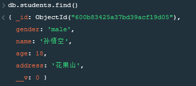

## 安装

安装mongoose

```sh
npm i mongoose --save
```

引入mongoose

```sh
var mongoose = require("mongoose")
```

## 连接数据库

```js
var mongoose = require("mongoose")
// 1.连接mongoDB数据库
// 如果端口是默认端口号(27017)可以省略
// mongoose.connect('mongodb://数据库ip地址:端口号/数据库名')
mongoose.connect('mongodb://127.0.0.1/mongoose_test',{ useNewUrlParser: true,useUnifiedTopology: true  } )
// 监听数据库连接状态
// 数据库连接成功事件
mongoose.connection.once("open",function(){
    console.log("数据库连接成功");
})
// 数据库断开事件
mongoose.connection.once('close',function(){
    console.log("数据库连接断开");
})
// 断开数据库连接(一般不用)
// mongoose.disconnect()
```

## 创建schema和model对象

```js
var mongoose = require("mongoose")
mongoose.connect('mongodb://127.0.0.1/mongoose_test',{ useNewUrlParser: true,useUnifiedTopology: true  } )
mongoose.connection.once("open",function(){
    console.log("数据库连接成功");
})
// 将mongoose.Schema 赋值给一个变量
var Schema = mongoose.Schema;
// 创建Schema(模式)对象
var stuSchema = new Schema({
    name:String,
    age:Number,
    gender:{
        type:String,
        // 默认值
        default:"female"
    },
    address:String
})
// 通过Schema来创建Model
// Model代表的数据库中的集合，通过Model才能对数据进行操作
// mongoose.model(数据库中集合名,schema);
var StuModel = mongoose.model("student",stuSchema);
```

## 基本操作

### 插入文档

**插入一条数据**

```js
StuModel.create({
    name:"孙悟空",
    age:18,
    gender:"male",
    address:"花果山"
},(err)=>{
    if(!err){
        console.log("插入成功");
    }
})
```



**完整代码**

```js
var mongoose = require("mongoose")
mongoose.connect('mongodb://127.0.0.1/mongoose_test',{ useNewUrlParser: true,useUnifiedTopology: true  } )
mongoose.connection.once("open",function(){
    console.log("数据库连接成功");
})
// 将mongoose.Schema 赋值给一个变量
var Schema = mongoose.Schema;
// 创建Schema(模式)对象
var stuSchema = new Schema({
    name:String,
    age:Number,
    gender:{
        type:String,
        // 默认值
        default:"female"
    },
    address:String
})
// 通过Schema来创建Model
// Model代表的数据库中的集合，通过Model才能对数据进行操作
// mongoose.model(数据库中集合名,schema);
var StuModel = mongoose.model("student",stuSchema);
StuModel.create({
    name:"孙悟空",
    age:18,
    gender:"male",
    address:"花果山"
},(err)=>{
    if(!err){
        console.log("插入成功");
    }
})
```

**插入多条文档**

```js
StuModel.create([
    {
        name:"猪八戒",
        age:18,
        gender:"male",
        address:"高老庄"
    },{
        name:"唐僧",
        age:18,
        gender:"male",
        address:"女儿国"
    }
],(err)=>{
    if(!err){
        console.log("插入成功");
    }
})
```

### 查询文档

```js
/* 
    查询:
    model.find(conditions,[projection],[options],callback)
    conditions:查询的条件 
    projection:投影  { name: 1, gender: 1, _id: 0 } 或 'name gender -_id'
    options:查询选项  { skip: xx, limit: xx }   
 
    model.findOne(...)
    model.findById(...)
    model.countDocuments(conditions,callback) 查询文档的数量
 */
 StuModel.find({},(err,docs)=>{
     if(!err){
         console.log(docs);
     }
 })
```

查询结果

```json
[
  {
    gender: 'male',
    _id: 600b83425a37bd39acf19d05,
    name: '孙悟空',
    age: 18,
    address: '花果山',
    __v: 0
  },
  {
    gender: 'male',
    _id: 600b84a0a434001a244e6a42,
    name: '猪八戒',
    age: 18,
    address: '高老庄',
    __v: 0
  }
]
```

查询指定字段

```js
 //查询指定字段
 StuModel.find({},"name age -_id",(err,docs)=>{
    if(!err){
        console.log(docs);
    }
})
```

查询结果

```json
[
  { name: '孙悟空', age: 18 },
  { name: '猪八戒', age: 18 },
  { name: '唐僧', age: 18 }
]
```

带条件

```js
// 带条件
StuModel.find({},"name age -_id",{ skip:1 , limit:1 },(err,docs)=>{
    if(!err){
        console.log(docs);
    }
})
```

查询结果

```js
[ { name: '猪八戒', age: 18 } ]
```

根据id查询

```js
// 根据id查询
StuModel.findById("600b83425a37bd39acf19d05",(err,docs)=>{
    if(!err){
        console.log(docs);
    }
})
```

查询结果

```js
{
  gender: 'male',
  _id: 600b83425a37bd39acf19d05,
  name: '孙悟空',
  age: 18,
  address: '花果山',
  __v: 0
}
```

返回值问题

```js
StuModel.findById("600b83425a37bd39acf19d05",(err,docs)=>{
    if(!err){
        // docs是stuModel的实例对象
        console.log(docs instanceof StuModel);  // true
    }
})
```

### 更新文档

```js
// 修改唐僧年龄为20
StuModel.updateOne({name:"唐僧"},{$set:{age:20}},(err)=>{
    if(!err){
        console.log("修改成功");
    }
})
```

### 删除文档

```js
/* 
删除：
model.remove(conditions,callback)
model.deleteOne(...)
model.deleteMany(...)
*/
StuModel.remove({name:"猪八戒"},err=>{
    if(!err){
        console.log("删除成功~~");
    }
})
```

### 统计数据

```js
// 统计数据
StuModel.count({},(err,count)=>{
    if(!err){
        console.log(count);
    }
})
```

## document对象方法

### save方法

```js
// 创建一个document
var stu = new StuModel({
    name:"奔波霸",
    age:48,
    gender:"male",
    address:"碧波谭"
})
// save方法
stu.save(err=>{
    if(!err){
        console.log("保存成功");
    }
})
```

**完整代码**

```js
var mongoose = require("mongoose")
mongoose.connect('mongodb://127.0.0.1/mongoose_test',{ useNewUrlParser: true,useUnifiedTopology: true  } )
mongoose.connection.once("open",function(){
    console.log("数据库连接成功");
})
// 将mongoose.Schema 赋值给一个变量
var Schema = mongoose.Schema;
// 创建Schema(模式)对象
var stuSchema = new Schema({
    name:String,
    age:Number,
    gender:{
        type:String,
        // 默认值
        default:"female"
    },
    address:String
})
var StuModel = mongoose.model("student",stuSchema);
// 创建一个document
var stu = new StuModel({
    name:"奔波霸",
    age:48,
    gender:"male",
    address:"碧波谭"
})
// save方法
stu.save(err=>{
    if(!err){
        console.log("保存成功");
    }
})
```

### update方法

第一种方法

```js
StuModel.findOne({},(err,doc)=>{
    if(!err){
        //document修改方法
        doc.update({$set:{age:28}},err=>{
            if(!err){
                console.log("修改成功");
            }
        })
    }
})
```

第二种方法

```js
StuModel.findOne({},(err,doc)=>{
    if(!err){
        doc.age = 18;
        doc.save();
    }
})
```

### remove方法

```js
// 删除
StuModel.findOne({},(err,doc)=>{
    if(!err){
        doc.remove(err=>{
            if(!err){
                console.log("删除成功");
            }
        })
    }
})
```

### get方法

```js
StuModel.findOne({},(err,doc)=>{
    if(!err){
        // 获取指定属性值
        console.log(doc.get("name"));
        // 或者
        console.log(doc.name);
    }
})
```

### set 方法

```js
StuModel.findOne({},(err,doc)=>{
    if(!err){
        // set 方法
        doc.set("name","孙悟空");
        doc.save()
    }
})
```

## 模块化处理

### 目录结构

```
├── models
    ├── student.js # 抽取模块
├── tools
│   └── mongodb.js # 抽取db操作
├── index.js #使用
```

**1.单独创建一个数据库连接文件mongodb.js**

```js
var mongoose = require("mongoose")
mongoose.connect('mongodb://127.0.0.1/mongoose_test',{ useNewUrlParser: true,useUnifiedTopology: true  } )
mongoose.connection.once("open",function(){
    console.log("数据库连接成功");
})
```

**2.为每一个集合创建一个模型对象文件student.js**

```js
// 定义student模型
var mongoose = require("mongoose");
var Schema = mongoose.Schema;
// 创建Schema(模式)对象
var stuSchema = new Schema({
    name:String,
    age:Number,
    gender:{
        type:String,
        // 默认值
        default:"female"
    },
    address:String
});
// 定义模型
var stuModel = mongoose.model("student",stuSchema);
// 导出
module.exports = stuModel;
```

**3.在最终的文件index.js中引入数据库连接文件和创建模型的文件**

```js
require("./tools/conn_mongo");
var Student = require("./models/student");
Student.find({},(err,docs)=>{
    if(!err){
        console.log(docs);
    }
})
```