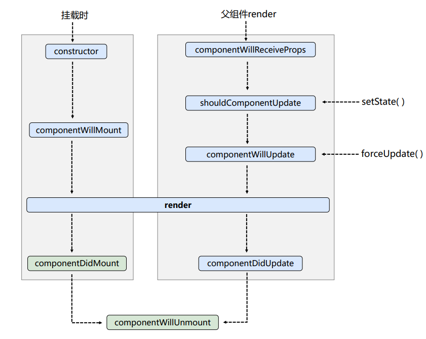
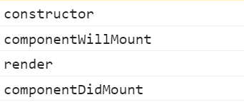

## react入门

```html
<body>
    <div id="test">

    </div>
    <script type="text/babel">
        //1.创建虚拟DOM
        const VDOM = <h1>Hello,React</h1>
        //2.渲染虚拟DOM到页面
        ReactDOM.render(VDOM,document.getElementById("test"));
    </script>
</body>
```


**通过括号可以包含多行标签**

```html
<body>
    <div id="test"></div>
    <script type="text/babel">
        //1.创建虚拟DOM
        const VDOM = (
            <h1 id="title">
                <span>Hello,React</span>
            </h1>
        )
        //2.渲染虚拟DOM到页面
        ReactDOM.render(VDOM,document.getElementById("test"));
    </script>
</body>
```

## jsx语法规则

**1.定义虚拟DOM，不要写引号**

::: tip
错误代码实例
:::

```js
const VDOM = "<h1>Hello,React</h1>"
```

**正确写法**

```jsx
const VDOM = <h1>Hello,React</h1>
```

```jsx
const VDOM = (
            <h1 id="title">
                <span>Hello,React</span>
            </h1>
        )
```

**2.标签中混入JS表达式要用{}**

```jsx
<span>{myData.toLowerCase()}</span>
<h2 id={myId.toLowerCase()}>
```

**3.内联的类名指定不要用class，要用className**

```jsx
<h2 className="title">
```

**4.内联样式要用key value的形式去写**

```jsx
<span style={{color:'white',fontSize:'29px'}}></span>
```

**5.若小写字母开头，则将该标签转为html同名元素**

**6.若大写字母开头，react就去渲染对应的组件，若组件没有定义则报错**

## 数组遍历

```html
<body>
    <div id="test"></div>
    <script type="text/babel"> 
        const data = ['Angular','React','Vue']
        // 1.创建虚拟DOM
        const VDOM = (
            <div>
                <h1>前端js框架列表</h1>
                <ul>
                    {
                        data.map((item,index) =>{
                            return <li key={index}>{item}</li>
                        })  
                    }  
                </ul>
            </div>
        )

        //2.渲染虚拟DOM到页面
        ReactDOM.render(VDOM,document.getElementById('test'))
    </script>
</body>
```

## 组件

### 函数式组件

```html
<body>
    <div id="test"></div>
    <script type="text/babel"> 
        //1.创建函数式组件
        function MyComponent(){
            return <h2>我是用函数定义的组件(适用于[简单组件]的定义)</h2>
        }

        //2.渲染虚拟DOM到页面
        ReactDOM.render(<MyComponent />,document.getElementById('test'))
    </script>
</body>
```

### 类式组件

```html
<body>
    <div id="test"></div>
    <script type="text/babel"> 
        //1.创建类式组件
        class MyComponent extends React.Component{
            render(){
                console.log(this);
                return <h2>我是用类定义的组件(适用于[复杂组件]的定义)</h2>
            }
        }

        //2.渲染虚拟DOM到页面
        ReactDOM.render(<MyComponent />,document.getElementById('test'))
    </script>
</body>
```

## 组件的三大属性

### state 属性

```html
<body>
    <div id="test"></div>
    <script type="text/babel"> 
        //1.创建类式组件
        class Weather extends React.Component{
            state = {isHot:false}
            render(){
                //读取状态
                const {isHot} = this.state;
                return <h1 onClick={this.changeWeather}>今天天气很{this.state.isHot ? '炎热' : '凉爽'}</h1>
            }

            changeWeather = ()=>{
                //读取状态
                const isHot = this.state.isHot;
                this.setState({isHot:!isHot})
            }

        }

        //2.渲染虚拟DOM到页面
        ReactDOM.render(<Weather />,document.getElementById('test'))
        
    </script>
</body>
```

### props 属性

```html
<body>
    <div id="test"></div>
    <script type="text/babel"> 
        //1.创建类式组件
        class Person extends React.Component{
            render(){
                console.log(this);
                const {name,sex,age} = this.props;
                return (
                    <ul>
                        <li>姓名：{name}</li> 
                        <li>性别：{sex}</li>   
                        <li>年龄：{age}</li>   
                    </ul>
                )
            }

        }

        //2.渲染虚拟DOM到页面
        ReactDOM.render(<Person name="jerry" age="19" sex="男"/>,document.getElementById('test'))
    </script>
</body>
```

**批量传递**

```jsx
ReactDOM.render(<Person {...p}/>,document.getElementById('test'))
```

### props 验证

```html
<body>
    <div id="test"></div>
    <script type="text/babel">
        //1.创建函数式组件
        function Person(props){
            const {name,sex,age} = props;
            return (
                    <ul>
                        <li>姓名：{name}</li> 
                        <li>性别：{sex}</li>   
                        <li>年龄：{age}</li>   
                    </ul>
            )
            
        }
        Person.propTypes = {
            name:PropTypes.string.isRequired, //限制name必传，且为字符串
            sex:PropTypes.string, //限制sex为字符串
            age:PropTypes.number, //限制age为数值
            speak:PropTypes.func //限制speak为函数
        }

        Person.defaultProps = {
            sex:'男',
            age:18
        }
        
        //2.渲染虚拟DOM到页面
        ReactDOM.render(<Person name="jerry" sex="女" age={18}/>,document.getElementById('test'))
    </script>
</body>
```

### refs 属性

**1.字符串形式的ref(不建议使用)**

```html
 <input ref="input1" type="text"/>
```

获取数据

```js
const {input1} = this.refs;
```

```html
<body>
    <div id="test"></div>
    <script type="text/babel">
        //创建组件
        class Demo extends React.Component{
            //展示左侧数据
            showData = ()=>{
                const {input1} = this.refs;
                alert(input1.value)
            }
            render(){
                return(
                    <div>
                        <input ref="input1" type="text" placeholder="点击按钮提升数据"/>
                        <button onClick={this.showData}>点击提升左侧数据</button>
                    </div>
                )
            }
        }
        ReactDOM.render(<Demo/>,document.getElementById('test'))
    </script>
</body>
```


**2.回调形式ref**

```jsx
<input ref={(currentNode)=>{this.input1 = currentNode}} type="text" />
```

```html
<body>
    <div id="test"></div>
    <script type="text/babel">
        //创建组件
        class Demo extends React.Component{
            //展示左侧数据
            showData = ()=>{
                const {input1} = this;
                alert(input1.value)
            }
            render(){
                return(
                    <div>
                        <input ref={(currentNode)=>{this.input1 = currentNode}} type="text" placeholder="点击按钮提升数据"/>
                        <button onClick={this.showData}>点击提升左侧数据</button>
                    </div>
                )
            }
        }
        ReactDOM.render(<Demo/>,document.getElementById('test'))
    </script>
</body>
```

**3.createRef**

```jsx
//创建ref容器
myRef = React.createRef();

//使用
<input ref={this.myRef} type="text" />
```

```html
<body>
    <div id="test"></div>
    <script type="text/babel">
        //创建组件
        class Demo extends React.Component{
            //创建ref容器
            myRef = React.createRef();
            myRef2 = React.createRef();

            //展示左侧数据
            showData = ()=>{
                console.log(this.myRef);
                alert(this.myRef.current.value)
            }

            showData2 = ()=>{
                console.log(this.myRef2);
                alert(this.myRef2.current.value)
            }
            render(){
                return(
                    <div>
                        <input ref={this.myRef} type="text" placeholder="点击按钮提升数据"/>
                        <button onClick={this.showData}>点击提升左侧数据</button>
                        <input  onBlur={this.showData2} ref={this.myRef2} type="text" placeholder="点击按钮提升数据"/>
                    </div>
                )
            }
        }
        ReactDOM.render(<Demo/>,document.getElementById('test'))
    </script>
</body>
```

## 表单数据收集

### 非受控组件收集

```html
<body>
    <div id="test"></div>

    <script type="text/babel">
        //创建组件
        class Login extends React.Component{
            handleSubmit = (event) =>{
                event.preventDefault(); //阻止提交表单
                // 取出用户名和密码输入框对象
                const {username,password} = this;
                alert(`你输入的用户名是:${username.value}，你输入的密码是${password.value}`)
            }
            render(){
                return(
                    <form onSubmit={this.handleSubmit}>
                        用户名: <input ref={c => this.username = c} type="text" name="username"/>
                        密码：<input ref={c => this.password = c} type="text" name="password"/>  
                        <button>登录</button>  
                    </form>
                )
            }
        }

        //渲染组件
        ReactDOM.render(<Login/>,document.getElementById('test'))
    </script>
</body>
```


### 受控组件收集

```html
<body>
    <div id="test"></div>

    <script type="text/babel">
        //创建组件
        class Login extends React.Component{
            //初始化状态
            state = {
                username:'',//用户名
                password:''//密码
            }

            //保存用户名到状态中
            saveUsername = (event)=>{
                this.setState({username:event.target.value})
            }

            //保存密码到状态中
            savePassword = (event)=>{
                this.setState({password:event.target.value})
            }

            //提交表单回调
            handleSubmit = event=>{
                event.preventDefault();//阻止表单提交
                const {username,password} = this.state;
                alert(`你输入的用户名是：${username},你输入的密码是：${password}`)
            }
            render(){
                return(
                    <form onSubmit={this.handleSubmit}>
                        用户名: <input onChange={this.saveUsername} type="text" name="username"/>
                        密码：<input onChange={this.savePassword} type="text" name="password"/>  
                        <button>登录</button>  
                    </form>
                )
            }
        }

        //渲染组件
        ReactDOM.render(<Login/>,document.getElementById('test'))
    </script>
</body>
```


## 生命周期



### 挂载组件

```react
<body>
    <div id="test"></div>

    <script type="text/babel">
        //创建组件
        class Life extends React.Component{

            // 构造器
            constructor(props){
                console.log('constructor');
                super(props)
                // 初始化状态
                this.state = {opacity:1}
            }

            death = ()=>{
                // 卸载组件
                ReactDOM.unmountComponentAtNode(document.getElementById('test'))
            }

            // 组件将要挂载
            componentWillMount(){
                console.log('componentWillMount');
            }

            // 组件挂载完毕
            componentDidMount(){
                console.log("componentDidMount");
            }

            // 组件将要卸载
            componentWillUnmount(){
                console.log('componentWillUnmount');
            }

            // 初始化渲染、状态更新之后
            render(){
                console.log('render');
                return(
                    <div>
                        <button onClick={this.death}>卸载组件</button>
                    </div>
                )
            }
        }

        //渲染组件
        ReactDOM.render(<Life/>,document.getElementById('test'))
    </script>
</body>
```



**点击卸载按钮后**


### 更新组件

更新组件三条路线

#### 第一条线

组件是否应该被更新：shouldComponentUpdate相当于一个阀门，当没有定义这个钩子时默认为true

```jsx
<body>
    <div id="test"></div>

    <script type="text/babel">
        //创建组件
        class Life extends React.Component{

            // 构造器
            constructor(props){
                console.log('constructor');
                super(props)
                // 初始化状态
                this.state = {count:1}
            }

            death = ()=>{
                // 卸载组件
                ReactDOM.unmountComponentAtNode(document.getElementById('test'))
            }
            add = ()=>{
                const {count} = this.state
                this.setState({count:count+1})
            }

            // 控制组件更新的“阀门”
            shouldComponentUpdate(){
                console.log('shouldCompoentUpdate');
                return true
            }
            // 组件将要更新的钩子
            componentWillUpdate(){
                console.log('componentWillUpdate');
            }
            
            // 组件更新完毕的钩子
            componentDidUpdate(){
                console.log('compoenntDidUpdate');
            }

            // 初始化渲染、状态更新之后
            render(){
                console.log('render');
                return(
                    <div>
                        <button onClick={this.add}>点我+1</button>
                        <button onClick={this.death}>卸载组件</button>
                    </div>
                )
            }
        }

        //渲染组件
        ReactDOM.render(<Life/>,document.getElementById('test'))
    </script>
</body>
```

点击+1后


如果阀门为false

```jsx
// 控制组件更新的“阀门”
shouldComponentUpdate(){
    console.log('shouldCompoentUpdate');
    return false
}
```


#### 第二条线

不更改任何状态的数据强制更新一下`this.forceUpdate();`

```jsx
<body>
    <div id="test"></div>

    <script type="text/babel">
        //创建组件
        class Life extends React.Component{

            // 构造器
            constructor(props){
                console.log('constructor');
                super(props)
                // 初始化状态
                this.state = {count:1}
            }

            death = ()=>{
                // 卸载组件
                ReactDOM.unmountComponentAtNode(document.getElementById('test'))
            }
 
            // 强制更新按钮的回调
            force = ()=>{
                this.forceUpdate();
            }

            // 控制组件更新的“阀门”
            shouldComponentUpdate(){
                console.log('shouldCompoentUpdate');
                return false
            }
            // 组件将要更新的钩子
            componentWillUpdate(){
                console.log('componentWillUpdate');
            }
            
            // 组件更新完毕的钩子
            componentDidUpdate(){
                console.log('compoenntDidUpdate');
            }

            // 初始化渲染、状态更新之后
            render(){
                console.log('render');
                return(
                    <div>
                        <button onClick={this.force}>强制更新</button>
                    </div>
                )
            }
        }

        //渲染组件
        ReactDOM.render(<Life/>,document.getElementById('test'))
    </script>
</body>
```

**点击强制更新按钮**：即使阀门关闭也可以触发


### 第三条线


## 脚手架项目

### 入门

**1.全局安装react脚手架**

```shell
npm i create-react-app -g
```

**2.创建react应用**

```shell
create-react-app 项目名
```

**3.启动项目**

```shell
npm start
```

### 模块化

目录结构

```
├─ public
   ├─ favicon.ico  --网站图标
   ├─ index.html  --主页面
├─ src
   ├─ App.js  --App组件
   ├─ index.js --入口文件
```

index.html

```html
<!DOCTYPE html>
<html lang="en">
<head>
    <meta charset="UTF-8">
    <link rel="icon" href="%PUBLIC_URL%/favicon.ico" />
    <meta name="viewport" content="width=device-width, initial-scale=1.0">
    <title>react</title>
</head>
<body>
    <div id="root"></div>
</body>
</html>
```

App.js

```jsx
//App.js 创建顶级组件
import React from 'react'

//创建App组件
class App extends React.Component{
    render(){
        return(
            <div>hello world</div>
        )
    }
}

//导出
export default App
```

index.js

```jsx
//index.js 入口文件
//引入react核心库
import React from 'react'
//引入reactDOM 
import ReactDOM from 'react-dom'
//引入App组件-js,jsx后面可以省略
import App from './App'

//渲染App到页面
ReactDOM.render(<App/>,document.getElementById('root'))
```

### 样式模块化

**样式冲突问题**：当两个组件使用相同的class会造成样式冲突

```html
import hello from './index.css'

<h2 className={hello.title}>hello react</h2>
```

### 配置代理

#### 单个请求地址问题解决

在page.json中配置代理

```js
//最下面
"proxy":"http://localhost:5000"
```

服务器会将发给3000的数据转发给5000

```js
//配置成3000
axios.get("http://localhost:3000/students").then(response =>{
		console.log("成功了",response.data);
	},error =>{
		console.log("失败了",error);
	}
)
```

#### 多个请求地址问题解决

1.在src下新建**setupProxy.js**

```js
const proxy = require('http-proxy-middleware')

module.exports = function(app) {
  app.use(
    proxy('/api1', {  //api1是需要转发的请求(所有带有/api1前缀的请求都会转发给5000)
      target: 'http://localhost:5000', //配置转发目标地址(能返回数据的服务器地址)
      changeOrigin: true, //控制服务器接收到的请求头中host字段的值
      /*
      	changeOrigin设置为true时，服务器收到的请求头中的host为：localhost:5000
      	changeOrigin设置为false时，服务器收到的请求头中的host为：localhost:3000
      	changeOrigin默认值为false，但我们一般将changeOrigin值设为true
      */
      pathRewrite: {'^/api1': ''} //去除请求前缀，保证交给后台服务器的是正常请求地址(必须配置)
    }),
    proxy('/api2', { 
      target: 'http://localhost:5001',
      changeOrigin: true,
      pathRewrite: {'^/api2': ''}
    })
  )
}
```

使用

```js
axios.get("http://localhost:3000/api1/students").then(response =>{
    	console.log("成功了",response.data);
    },error =>{
    	console.log("失败了",error);
    }
)
```

## 消息订阅发布机制

**安装依赖**

```
npm install pubsub-js --save
```

**发布端**

```js
import PubSub from 'pubsub-js' //引入

// 发布一个叫Hello的消息
// data传递的数据
PubSub.publish('Hello', {name:张三}) //发布消息
```

**订阅端**

```js
import PubSub from 'pubsub-js' //引入

//订阅一个主题
//msg消息名,data传过来的数据
PubSub.subscribe('Hello', function(msg,data){ 
	//处理函数
    console.log(msg);
    console.log(data);
}); //订阅

//输出
Hello
{name:张三}
```

### react推荐方式

```js
//组件加载是
componentDidMount(){
    //token标识，用来取消订阅
	this.token=pubSub.subscribe("search",(msg,data)=>{
		this.setState(data)
	})
}

//组件卸载时
componentWillUnmount(){
    //取消订阅
	pubSub.unsubscribe(this.token);
}
```

