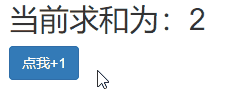
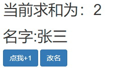
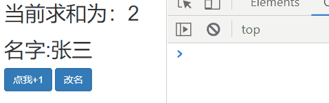
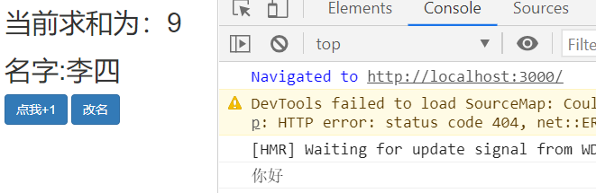
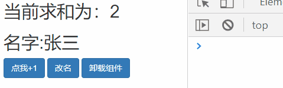
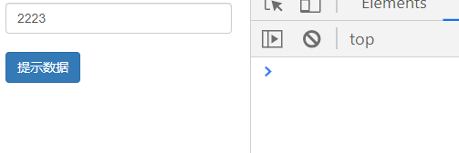
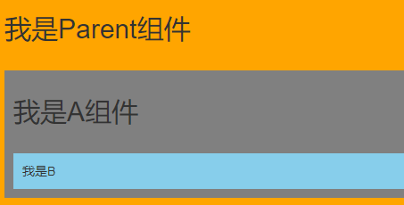
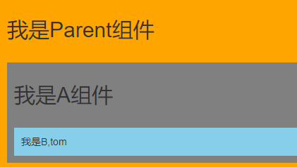
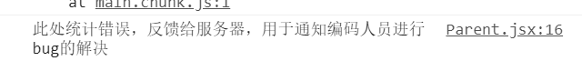

## 更新状态两种方法

### 对象式

```js
//对象式的setState
const {count} = this.state;   //获取原来的state
this.setState({count:count+1}) //修改state的值
```

### 函数式

```js
//函数式的setState
this.setState(state =>{
	return {count:state.count+1};
})
```

## 路由组件的lazyLoad

1.通过React的lazy函数配合import()函数动态加载路由组件 ===> 路由组件代码会被分开打包。

注：指定的路由被加载才从服务器加载，不会一次加载所有的路由组件

```js
const Login = lazy(()=>import('@/pages/Login'))
```

2.通过**Suspense**指定在加载得到路由打包文件前显示一个自定义loading界面

注：如果加载失败或加载过程中，将显示fallback指定的页面

```jsx
<Suspense fallback={<h1>loading.....</h1>}>
    <Switch>
        <Route path="/xxx" component={Xxxx}/>
        <Redirect to="/login"/>
    </Switch>
</Suspense>
```

## Hooks

### Hooks是什么?

1.Hook是React 16.8.0版本增加的新特性/新语法

2.可以让你在函数组件中使用 state 以及其他的 React 特性

**三个常用的Hook**

1.State Hook: React.useState()

2.Effect Hook: React.useEffect()

3.Ref Hook: React.useRef()

### State Hook

1.State Hook让函数组件也可以有state状态, 并进行状态数据的读写操作

2.语法const [状态名,修改状态的函数] = React.useState(初始值);

3.修改状态的2种写法:
setXxx(newValue): 参数为非函数值, 直接指定新的状态值, 内部用其覆盖原来的状态值setXxx(value => newValue): 参数为函数, 接收原本的状态值, 返回新的状态值, 内部用其覆盖原来的状态值

```jsx
import React from 'react'
function Demo() {
    //[状态,修改状态的方法]
    //2 count的初始值是2
    const [count,setCount] = React.useState(2);
    function add() {
        //setCount(count+1); //第一种写法
        setCount((count)=>{
            return count+1;
        })
    }
    return (
        <div>
            <h2>当前求和为：{count}</h2>
            <button onClick={add} className="btn btn-primary">点我+1</button>
        </div>
    )
}
export default Demo
```



设值多个状态

```jsx
import React from 'react'
function Demo() {
    //[状态,修改状态的方法]
    //2 count的初始值是2
    const [count,setCount] = React.useState(2);
    const [name,setName] = React.useState("张三");
    function add() {
        //setCount(count+1); //第一种写法
        setCount((count)=>{
            return count+1;
        })
    }
    function changeName() {
        setName("李四");
    }
    return (
        <div>
            <h2>当前求和为：{count}</h2>
            <h2>名字:{name}</h2>
            <button onClick={add} className="btn btn-primary">点我+1</button>&nbsp;
            <button onClick={changeName} className="btn btn-primary">改名</button>
        </div>
    )
}
export default Demo
```

****

### Effect Hook

1.Effect Hook 可以让你在函数组件中执行副作用操作(用于模拟类组件中的生命周期钩子)

2.不写第二个参数每次所有的状态发生变化都会调用这个函数。

3.相当于componentDidMount()+componentDidUpdate()

```js
//如果不写第二个方法
//所有状态发生改变都会调用这个方法
React.useEffect(()=>{
    console.log("你好");
})
```



**只检测count的变化**

```jsx
React.useEffect(()=>{
    console.log("你好"); 
},count)
```


**不检测任何状态的变化**

只会在第一次render()后执行

```jsx
React.useEffect(()=>{
    console.log("你好"); 
},[])
```



**组件被卸载后调用**

```jsx
//点击按钮后触发
function unmount(){
    ReactDOM.unmountComponentAtNode(document.getElementById('root'));
}
React.useEffect(()=>{
    return ()=>{
        console.log("组件被卸载了");
    }
},[])
```



### Ref Hook

1.定义Ref

```js
//使用ref
const myRef = React.useRef();
```

2.使用Ref

```js
<input ref={myRef} type="text" />
```

3.获取值

```js
myRef.current.value
```



 

```jsx
import React from 'react'
import ReactDOM from 'react-dom'
function Demo() {
    //使用ref
    const myRef = React.useRef();
    function show() {
        console.log(myRef);
        console.log(myRef.current.value);
    }
    return (
        <div>
            <input ref={myRef} type="text" className="form-control"/><br/>
            <button onClick={show} className="btn btn-primary">提示数据</button>
        </div>
    )
}
export default Demo
```

## Fragment

1.可以不用必须有一个真实的DOM根标签了

2.不会渲染在页面上

```jsx
<Fragment>
    <h1>你好</h1>
    <div>Hello</div>
</Fragment>
```

2.也可以使用第二种方式

```jsx
<>
    <h1>你好</h1>
    <div>Hello</div>
</>
```

3.Fragment可以设置Key属性，遍历的时候可以用Fragment

```jsx
<Fragment key="1">
    <h1>你好</h1>
    <div>Hello</div>
</Fragment>
```

## Context

一种组件间通信方式, 常用于【祖组件】与【后代组件】间通信

**使用：**

**1.创建Context对象**

```jsx
const MyContext = React.createContext();
```

**2.渲染子组时，外面包裹xxxContext.Provider, 通过**value属性给后代组件传递数据：这样B组件以及B的子组件都能接收到username属性

```js
const {Provider} = MyContext
```

```jsx
<Provider value={this.state.username}>
    <B/>
</Provider>
```

**3.后代组件读取数据**

第一种方式:仅适用于类组件 

```
// 申明接受context
static contextType = MyContext;
// 读取context中的value数据
this.context
```


完整代码

```jsx
import React, { Component } from 'react'
import './index.css'
//创建context对象
const MyContext = React.createContext();
const {Provider} = MyContext
export default class A extends Component {
    state = {username:'tom',age:18}
    render() {
        return (
            <div className="parent">
                <h3>我是A组件</h3>
                <Provider value={this.state.username}>
                    <B/>
                </Provider>
            </div>
        )
    }
}
class B extends Component{
    //第一种方式:仅适用于类组件 
    //申明接受context
    static contextType = MyContext;
    render(){
        return (
            <div className="child">
                <h3>我是B组件</h3>
                <h4>我从A组件接受到的用户名{this.context}</h4>
                <C/>
            </div>
        )
    }
}
class C extends Component{
    //第一种方式:仅适用于类组件 
    //申明接受context
    static contextType = MyContext;
    render(){
        return (
            <div className="grand">
                <h3>我是C组件</h3>
                <h4>我从A组件接受到的用户名{this.context}</h4>
            </div>
        )
    }
}
```

第二种方式: 函数组件与类组件都可以

```jsx
const MyContext = React.createContext();
//引入Consumer组件
const {Provider,Consumer} = MyContext
```

```jsx
<Consumer>
    {
        value =>{
            return `我从A组件接受到的用户名${value}`
        }
    }
</Consumer>
```


完整代码

```jsx
import React, { Component } from 'react'
import './index.css'
//创建context对象
const MyContext = React.createContext();
const {Provider,Consumer} = MyContext
export default class A extends Component {
    state = {username:'tom',age:18}
    render() {
        return (
            <div className="parent">
                <h3>我是A组件</h3>
                <Provider value={this.state.username}>
                    <B/>
                </Provider>
            </div>
        )
    }
}
class B extends Component{
    //第一种方式:仅适用于类组件 
    //申明接受context
    static contextType = MyContext;
    render(){
        return (
            <div className="child">
                <h3>我是B组件</h3>
                
                <h4>我从A组件接受到的用户名{this.context}</h4>
                <C/>
            </div>
        )
    }
}
class C extends Component{
    //第一种方式:仅适用于类组件 
    //申明接受context
    static contextType = MyContext;
    render(){
        return (
            <div className="grand">
                <h3>我是C组件</h3>
                <h4>
                    <Consumer>
                        {value =>{
                            console.log(value);
                            return `我从A组件接受到的用户名${value}`
                        }}
                    </Consumer>
                </h4>
                
            </div>
        )
    }
}
```

传递对象

```jsx
<Provider value={{username,age}}>
    <B/>
</Provider>
```

## 组件优化

### Component的2个问题 

1. 只要执行setState(),即使不改变状态数据, 组件也会重新render()

2. 只当前组件重新render(), 就会自动重新render子组件 ==> 效率低

**解决办法一**

对比新旧props对象，如果一样则开启阀门(return true)，否则关闭阀门(return false)

如果接下来要变化的值与当前相等就阻止，如果接下来要变化的值与当前不相等则放行

```jsx
shouldComponentUpdate(nextProps,nextState){
        //目前的props和state
        console.log(this.props,this.state);
        //接下来要变化的props和state
        console.log(nextProps,nextState);
        if(this.props.carName===this.nextProps){
            return false;
        }
        return true;
}
```

**解决办法二**

使用PureComponent

1.PureComponent重写了shouldComponentUpdate(), 只有state或props数据有变化才返回true

2.注意:只是进行state和props数据的浅比较, 如果只是数据对象内部数据变了, 返回false 

3.不要直接修改state数据, 而是要产生新数据

4.项目中一般使用PureComponent来优化

```jsx
//导入纯组件
import React, { PureComponent } from 'react'
//使用纯组件
export default class Parent extends PureComponent {
    render() {
        return (
            <div> </div>
        )
    }
}
```

## render props

相对于vue中插槽技术

**1.使用children props: 通过组件标签体传入结构**

Parent组件向A组件传递数据

```jsx
<A>Hello</A>
```

A组件接受数据

```jsx
{this.props.children} 
```


Parent组件向A组件传递B组件

```jsx
<A>
    <B/>
</A>
```

A组件接收

```jsx
{this.props.children} 
```



 

```jsx
import React, { Component } from 'react'
import './index.css'
export default class Parent extends Component {
    render() {
        return (
            <div className="parent">
                <h2>我是Parent组件</h2>
                <A>
                    <B/>
                </A>
            </div>
        )
    }
}
class A extends Component {
    render() {
        console.log(this.props);
        return (
            <div className="a">
                <h2>我是A组件</h2>
               {this.props.children} 
            </div>
        )
    }
}
class B extends Component {
    render() {
        return (
            <div className="b">
                我是B
            </div>
        )
    }
}
```

**2.render props 通过组件标签属性传入结构, 一般用render函数属性**

1.Parent组件向A组件传递一个函数

```
<A r={(name)=>{
    return <B name={name} />
}}/>
```

2.A从props中接收定义的这个参数并传递数据，则会返回一个<B name={name} />的组件

```
{this.props.r(name)} 
```

3.B组件中接收这个参数

```
{this.props.name}
```



 

```jsx
import React, { Component } from 'react'
import './index.css'
export default class Parent extends Component {
    render() {
        return (
            <div className="parent">
                <h2>我是Parent组件</h2>
                <A r={(name)=>{
                    return <B name={name} />
                }}/>
            </div>
        )
    }
}
class A extends Component {
    state = {name:'tom'}
    render() {
        const {name} = this.state;
        return (
            <div className="a">
                <h2>我是A组件</h2>
               {this.props.r(name)} 
            </div>
        )
    }
}
class B extends Component {
    render() {
        return (
            <div className="b">
                我是B,{this.props.name}
            </div>
        )
    }
}
```

## 错误边界

理解：错误边界：用来捕获后代组件错误，渲染出备用页面

特点：只能捕获后代组件生命周期产生的错误，不能捕获自己组件产生的错误和其他组件在合成事件、定时器中产生的错误

使用方式：

```jsx
import React, { Component } from 'react'
import Child from "./Child";
export default class Parent extends Component {
    state = {hasError:''} //用于标识网络是否出错
    //当parent组件出现任何报错都会调用这个钩子
    static getDerivedStateFromError(error){
        console.log(error);
        //需要返回一个状态对象
        return {hasError:error}
    }
    //如果子组件出现问题引发错误就会调用这个组件
    componentDidCatch(){
        console.log('此处统计错误，反馈给服务器，用于通知编码人员进行bug的解决');
    }
    render() {
        return (
            <div>
                <div>
                    <h2>我是Parent组件</h2>
                    {this.state.hasError ? <h2>当前网络不稳定，稍后再试</h2> : <Child/>}
                </div>
            </div>
        )
    }
}
```




