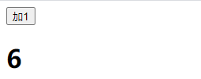

## Context

Context提供了一种方式，能够让数据在组件数中传递不必一级一级手动传递。


案例一：

```react
// 1.导入context
import React, { Component,createContext } from 'react'

// 2.创建context
const BatteryContext = createContext();

class Leaf extends Component {
  render() {
    return (
      // 4.消费者
      <BatteryContext.Consumer>
      {
        battery => <h1>Battery: {battery}</h1>
      }
      </BatteryContext.Consumer>
    )
  }
}

class Middle extends Component {
  render(){
    return <Leaf/>
  }
}

export default class App extends Component {
  render() {
    return (
      <div>
        {/* 3.生产者 */}
        <BatteryContext.Provider value={60}>
          <Middle/>
        </BatteryContext.Provider>
      </div>
    )
  }
}
```


实例二

```react
export default class App extends Component {
  state = {
    battery: 60
  }
  render() {
    const {battery} = this.state
    return (
      <div>
        {/* 生产者 */}
        <BatteryContext.Provider value={battery}>
          <button onClick={() => this.setState({battery:battery-1})}>减1</button>
          <Middle/>
        </BatteryContext.Provider>
      </div>
    )
  }
}
```


实例三：多个context

```react
// 1.导入context
import React, { Component,createContext } from 'react'

// 2.创建context
const BatteryContext = createContext();
const OnlineContext = createContext();

class Leaf extends Component {
  render() {
    return (
      // 4.消费者
      <BatteryContext.Consumer>
      {
        battery => (
          <OnlineContext.Consumer>
            {
              online => <h1>Battery: {battery},Online: {String(online)}</h1>
            }
          </OnlineContext.Consumer>
        )
      }
      </BatteryContext.Consumer>
    )
  }
}

class Middle extends Component {
  render(){
    return <Leaf/>
  }
}

export default class App extends Component {
  state = {
    battery: 60,
    online: false
  }
  render() {
    const { battery, online } = this.state
    return (
      <div>
        {/* 3.生产者 */}
        <BatteryContext.Provider value={battery}>
          <OnlineContext.Provider value={online}>
            <button onClick={() => this.setState({battery:battery-1})}>减1</button>
            <button onClick={() => this.setState({online:!online})}>取反</button>
            <Middle/>
          </OnlineContext.Provider>
        </BatteryContext.Provider>
      </div>
    )
  }
}
```


如果不使用`BatteryContext.Provider`可以使用`const BatteryContext = createContext(90);`传递默认值

## ContextType

```react
// 1.导入context
import React, { Component,createContext } from 'react'

// 2.创建context
const BatteryContext = createContext();

class Leaf extends Component {
  // 使用contextType
  static contextType = BatteryContext
  render() {
    const battery  = this.context
    return (
      // 4.消费者
      <h1>Battery: {battery}</h1>
    )
  }
}

class Middle extends Component {
  render(){
    return <Leaf/>
  }
}

export default class App extends Component {
  state = {
    battery: 60
  }
  render() {
    const { battery, online } = this.state
    return (
      <div>
        {/* 3.生产者 */}
        <BatteryContext.Provider value={battery}>
            <Middle/>
        </BatteryContext.Provider>
      </div>
    )
  }
}
```


## 纯组件

```react
import React, { Component } from 'react'

class Foo extends Component {
  render() {
    console.log('Foo render');
    return null
  }
}

export default class App extends Component {
  state = {
    count: 0
  }
  render() {
    const {count} = this.state
    return (
      <div>
        <button onClick={() => this.setState({count:count+1})}>加1</button>
        <Foo name='Mike'/>
      </div>
    )
  }
}
```


**存在问题：**当父组件状态发生变化但是**子组件状态未发生变化还是会引起子组件重新调用render**

**解决方法一：**在子组件中增加判断来打开阀门

```jsx
class Foo extends Component {
  shouldComponentUpdate(nextProps, nextState) {
    if (nextProps.name === this.props.name){
      return false
    }
  }
  render() {
    console.log('Foo render');
    return null
  }
}
```

**解决方法二：**使用纯组件

```jsx
// 继承PureComponent
class Foo extends PureComponent {
  render() {
    console.log('Foo render');
    return null
  }
}
```

## Memo

```jsx
import React, { Component } from 'react'

// 不使用memo
function Foo (props){
    console.log('Foo render');
    return <h1>{props.person.age}</h1>
}

export default class App extends Component {
  state = {
    count: 0,
    person: {
      age: 1
    }
  }
  render() {
    const {count,person} = this.state
    return (
      <div>
        <button onClick={() => this.setState({count:count+1})}>加1</button>
        <Foo person={person}/>
      </div>
    )
  }
}
```


**问题：**没有了PureComponent组件的功能

**解决：**使用memo

```jsx
// 导入memo
import React, { Component,memo } from 'react'

// 使用memo
const Foo = memo(
  function Foo (props){
    console.log('Foo render');
    return <h1>{props.person.age}</h1>
  }
)
```

## Hook

### useState

```jsx
import React, { useState } from 'react'

function App() {
  const [count,setCount] = useState(0)
  return (
    <div>
      <h2>{count}</h2>
      <button onClick={() =>{setCount(count+1)}}>加1</button>
    </div>
  )
}

export default App
```


### useContext

函数式组件中使用context

```jsx
import React, { useState,createContext,useContext } from 'react'

// 创建context
const CountCountext = createContext()

// 函数式组件中使用context
function Counter() {
  const count = useContext(CountCountext)
  return (
    <h1>{count}</h1>
  )
}

function App() {
  const [count,setCount] = useState(0)
  return (
    <div>
      <button onClick={() =>{setCount(count+1)}}>加1</button>
      <CountCountext.Provider value={count}>
        <Counter/>
      </CountCountext.Provider>
    </div>
  )
}

export default App
```



### useEffect

1.Effect Hook 可以让你在函数组件中执行副作用操作(用于模拟类组件中的生命周期钩子)

2.不写第二个参数每次所有的状态发生变化都会调用这个函数。

3.相当于componentDidMount()+componentDidUpdate()

```js
//如果不写第二个方法
//所有状态发生改变都会调用这个方法
React.useEffect(()=>{
    console.log("你好");
})
```


**只检测count的变化**

```jsx
React.useEffect(()=>{
    console.log("你好"); 
},count)
```


**不检测任何状态的变化**

只会在第一次render()后执行

```jsx
React.useEffect(()=>{
    console.log("你好"); 
},[])
```


**组件被卸载后调用**

```jsx
//点击按钮后触发
function unmount(){
    ReactDOM.unmountComponentAtNode(document.getElementById('root'));
}
React.useEffect(()=>{
    return ()=>{
        console.log("组件被卸载了");
    }
},[])
```


### useMemo

userMemo的规则和useEffect类似

```jsx
import React, { useState,createContext,useContext,useMemo } from 'react'

function App() {
  const [count,setCount] = useState(0)

  const double = useMemo(() =>{
    return count * 2
  },[count])

  return (
    <div>
      <button onClick={() =>{setCount(count+1)}}>加1</button>
      count:{count} double:{double}
    </div>
  )
}

export default App
```


设置userMemo中count===3才渲染

```jsx
const double = useMemo(() =>{
    return count * 2
},[count === 3])
```

memo组件: 当count===3时count才会渲染

```jsx
import React, { useState,createContext,memo,useMemo} from 'react'

const Counter = memo(function Counter(props) {
  console.log('Counter render');
  return (
    <h1>{props.count}</h1>
  )
})

function App() {
  const [count,setCount] = useState(0)

  const double = useMemo(() =>{
    return count * 2
  },[count === 3])

  return (
    <div>
      <button onClick={() =>{setCount(count+1)}}>加1</button>
      count:{count} double:{double}
      <Counter count={double}/>
    </div>
  )
}

export default App
```


实例二

```jsx
import React, { useState,createContext,memo,useMemo} from 'react'

const Counter = memo(function Counter(props) {
  console.log('Counter render');
  return (
    <div>
      <h1>{props.count}</h1>
      <button onClick={props.onClick}>onClick</button>
    </div>
  )
})

function App() {
  const [count,setCount] = useState(0)

  const double = useMemo(() =>{
    return count * 2
  },[count === 3])

  const onClick = () =>{
    console.log('click')
  }
  return (
    <div>
      <button onClick={() =>{setCount(count+1)}}>加1</button>
      count:{count} double:{double}
      <Counter count={double} onClick={onClick}/>
    </div>
  )
}

export default App
```


**问题：**Counter组件有回调时函数还是会渲染

**解决：**onclick用useMemo替代

```jsx
const onClick = useMemo(()=>{
      return () =>{
        console.log('click')
      }
    },[])
```


简略写法：使用useCallback

```jsx
import React, { useCallback} from 'react'
const onClick = useCallback(()=>{
      console.log('click')
},[])
```

### useRef

1.定义Ref

```js
//使用ref
const myRef = React.useRef();
```

2.使用Ref

```js
<input ref={myRef} type="text" />
```

3.获取值

```js
myRef.current.value
```


```jsx
import React from 'react'
import ReactDOM from 'react-dom'
function Demo() {
    //使用ref
    const myRef = React.useRef();
    function show() {
        console.log(myRef);
        console.log(myRef.current.value);
    }
    return (
        <div>
            <input ref={myRef} type="text" className="form-control"/><br/>
            <button onClick={show} className="btn btn-primary">提示数据</button>
        </div>
    )
}
export default Demo
```

###  自定义Hook

```jsx
import React, { useState,useRef,useEffect} from 'react'

function useCount(defaultCount) {
  const [count,setCount] = useState(defaultCount)
  const it  = useRef()

  useEffect(() =>{
    it.current = setInterval(() => {
      setCount(count => count + 1)
    }, 1000);
  },[])

  useEffect(() =>{
    if (count >= 10){
      clearInterval(it.current)
    }
  })

  return [count, setCount]
}

function App() {
  const [count, setCount] = useCount(0)
  return (
    <div>
      <button onClick={() =>{setCount(count+1)}}>加1</button>
      count:{count}
    </div>
  )
}

export default App
```

**自动加到十后停止**

