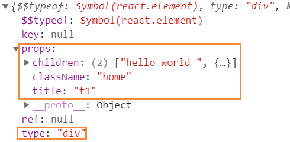

## 环境搭建

1.安装react

```
npx create-react-app my-react
```

2.在src新建react目录

```js
// react/index.js
let React = {
    render
}

function render(element,container){
    container.innerText = element;
}

export default React;
```

3.入口文件

```js
import React from './react'

React.render('hello',document.getElementById('root'))
```

4.运行

```
浏览器

hello
```

## 原理解析

JSX语法会被babel转换

```jsx
const obj = <div className='home'>
    hello world
</div>
```

转换后

```js
const obj = React.createElement("div", {
  className: "home"
}, "hello world");
```

### 提取虚拟dom

```
import React from './react'

const obj = <div className='home' title="t1">
    hello world <span>66</span>
</div>
React.render(obj,document.getElementById('root'))
```

```
let React = {
    render
}

function render(element,container){
	console.log(element);
}

export default React;
```



```
let React = {
    render
}
function render(element,container){
	// type: div   dom类型
	// children 子节点
	// config 属性
    const {type,props} = element;
    const {children,...config} = props;
}

export default React;
```

## 手写createElement

```
window.parent.run(React, domReactDOM.contentWindow.ReactDOM)
```

