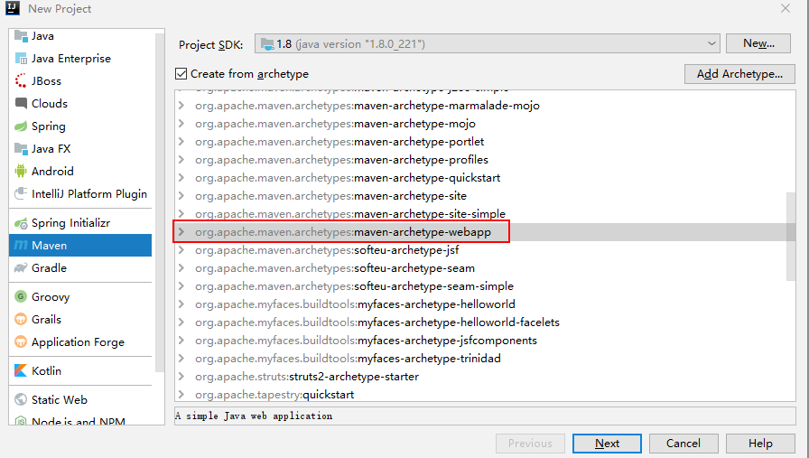
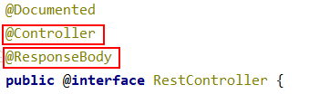
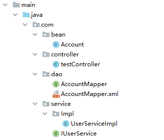
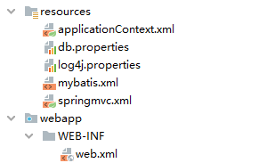
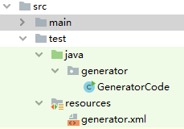

## 基本环境搭建

[完整代码地址](https://gitee.com/xiaobin3/key-documents/tree/master/ssm)

1.创建MAVEN项目



2.新建java和resources文件夹


3.导入jar坐标

```xml
	<dependencies>
       <dependency>
          <groupId>org.projectlombok</groupId>
          <artifactId>lombok</artifactId>
          <version>1.18.4</version>
          <scope>provided</scope>
    	</dependency>
		<!--引入pageHelper分页插件 -->
		<dependency>
			<groupId>com.github.pagehelper</groupId>
			<artifactId>pagehelper</artifactId>
			<version>5.0.0</version>
		</dependency>

		<!-- MBG -->
		<!-- https://mvnrepository.com/artifact/org.mybatis.generator/mybatis-generator-core -->
		<dependency>
			<groupId>org.mybatis.generator</groupId>
			<artifactId>mybatis-generator-core</artifactId>
			<version>1.3.5</version>
		</dependency>


		<dependency>
			<groupId>org.springframework</groupId>
			<artifactId>spring-webmvc</artifactId>
			<version>4.3.7.RELEASE</version>
		</dependency>

		<!-- 返回json字符串的支持 -->
		<!-- https://mvnrepository.com/artifact/com.fasterxml.jackson.core/jackson-databind -->
		<dependency>
			<groupId>com.fasterxml.jackson.core</groupId>
			<artifactId>jackson-databind</artifactId>
			<version>2.8.8</version>
		</dependency>

		<!--JSR303数据校验支持；tomcat7及以上的服务器， tomcat7以下的服务器：el表达式。额外给服务器的lib包中替换新的标准的el -->
		<!-- https://mvnrepository.com/artifact/org.hibernate/hibernate-validator -->
		<dependency>
			<groupId>org.hibernate</groupId>
			<artifactId>hibernate-validator</artifactId>
			<version>5.4.1.Final</version>
		</dependency>


		<!-- Spring-Jdbc -->
		<!-- https://mvnrepository.com/artifact/org.springframework/spring-jdbc -->
		<dependency>
			<groupId>org.springframework</groupId>
			<artifactId>spring-jdbc</artifactId>
			<version>4.3.7.RELEASE</version>
		</dependency>

		<!--Spring-test -->
		<!-- https://mvnrepository.com/artifact/org.springframework/spring-test -->
		<dependency>
			<groupId>org.springframework</groupId>
			<artifactId>spring-test</artifactId>
			<version>4.3.7.RELEASE</version>
		</dependency>


		<!-- Spring面向切面编程 -->
		<!-- https://mvnrepository.com/artifact/org.springframework/spring-aspects -->
		<dependency>
			<groupId>org.springframework</groupId>
			<artifactId>spring-aspects</artifactId>
			<version>4.3.7.RELEASE</version>
		</dependency>

		<!--MyBatis -->
		<!-- https://mvnrepository.com/artifact/org.mybatis/mybatis -->
		<dependency>
			<groupId>org.mybatis</groupId>
			<artifactId>mybatis</artifactId>
			<version>3.4.2</version>
		</dependency>
		<!-- MyBatis整合Spring的适配包 -->
		<!-- https://mvnrepository.com/artifact/org.mybatis/mybatis-spring -->
		<dependency>
			<groupId>org.mybatis</groupId>
			<artifactId>mybatis-spring</artifactId>
			<version>1.3.1</version>
		</dependency>

		<!-- 数据库连接池、驱动 -->
		<!-- https://mvnrepository.com/artifact/c3p0/c3p0 -->
		<dependency>
			<groupId>c3p0</groupId>
			<artifactId>c3p0</artifactId>
			<version>0.9.1</version>
		</dependency>
		<!-- https://mvnrepository.com/artifact/mysql/mysql-connector-java -->
		<dependency>
			<groupId>mysql</groupId>
			<artifactId>mysql-connector-java</artifactId>
			<version>5.1.41</version>
		</dependency>
		<!-- （jstl，servlet-api，junit） -->
		<!-- https://mvnrepository.com/artifact/jstl/jstl -->
		<dependency>
			<groupId>jstl</groupId>
			<artifactId>jstl</artifactId>
			<version>1.2</version>
		</dependency>

		<!-- https://mvnrepository.com/artifact/javax.servlet/javax.servlet-api -->
		<dependency>
			<groupId>javax.servlet</groupId>
			<artifactId>javax.servlet-api</artifactId>
			<version>3.0.1</version>
			<scope>provided</scope>
		</dependency>


		<!-- junit -->
		<!-- https://mvnrepository.com/artifact/junit/junit -->
		<dependency>
			<groupId>junit</groupId>
			<artifactId>junit</artifactId>
			<version>4.12</version>
		</dependency>

		<!--日志 start-->
        <dependency>
            <groupId>log4j</groupId>
            <artifactId>log4j</artifactId>
            <version>1.2.17</version>
        </dependency>
        <dependency>
            <groupId>org.slf4j</groupId>
            <artifactId>slf4j-api</artifactId>
            <version>1.7.25</version>
        </dependency>
        <dependency>
            <groupId>org.slf4j</groupId>
            <artifactId>slf4j-log4j12</artifactId>
            <version>1.7.25</version>
            <scope>test</scope>
        </dependency>
        <dependency>
            <groupId>org.slf4j</groupId>
            <artifactId>slf4j-simple</artifactId>
            <version>1.7.25</version>
            <scope>test</scope>
        </dependency>
        <!--日志end-->
	</dependencies>
```

3.创建数据库和表结构

```sql
create database ssm;
use ssm;
create table account(
    id int primary key auto_increment,
    name varchar(20),
    money double
);
```

## 整合SpringMVC

1.在web.xml中配置DispatcherServlet前端控制器

```xml
<!DOCTYPE web-app PUBLIC
 "-//Sun Microsystems, Inc.//DTD Web Application 2.3//EN"
 "http://java.sun.com/dtd/web-app_2_3.dtd" >

<web-app>
  <display-name>Archetype Created Web Application</display-name>

  <!-- 配置前端控制器，服务器启动加载springmvc.xml配置文件 -->
  <servlet>
    <servlet-name>dispatcherServlet</servlet-name>
    <servlet-class>org.springframework.web.servlet.DispatcherServlet</servlet-class>
    <!-- 配置初始化参数 -->
    <init-param>
      <param-name>contextConfigLocation</param-name>
      <param-value>classpath:springmvc.xml</param-value>
    </init-param>
  </servlet>
  <servlet-mapping>
    <servlet-name>dispatcherServlet</servlet-name>
    <url-pattern>/</url-pattern>
  </servlet-mapping>
</web-app>
```

2.在web.xml中配置DispatcherServlet过滤器解决中文乱码

```xml
<!-- 配置字符编码过滤器 -->
<filter>
    <filter-name>CharacterEncodingFilter</filter-name>
    <filter-class>org.springframework.web.filter.CharacterEncodingFilter</filter-class>
    <!-- 设置编码格式 -->
    <init-param>
        <param-name>encoding</param-name>
        <param-value>utf-8</param-value>
    </init-param>
    <!-- 设置请求编码过滤为true -->
    <init-param>
        <param-name>forceRequestEncoding</param-name>
        <param-value>true</param-value>
    </init-param>
    <!-- 设置响应编码过滤为true -->
    <init-param>
        <param-name>forceResponseEncoding</param-name>
        <param-value>true</param-value>
    </init-param>
</filter>
<filter-mapping>
    <filter-name>CharacterEncodingFilter</filter-name>
    <url-pattern>/*</url-pattern>
</filter-mapping>
```

3.配置rest风格

```xml
<!-- rest风格URL,将普通页面的post请求转为delete或put请求 -->
<filter>
    <filter-name>HiddenHttpMethodFilter</filter-name>
    <filter-class>org.springframework.web.filter.HiddenHttpMethodFilter</filter-class>
</filter>
<filter-mapping>
    <filter-name>HiddenHttpMethodFilter</filter-name>
    <url-pattern>/*</url-pattern>
</filter-mapping>
```

4.配置springMVC

在resources目录下新建springmvc.xml

```xml
<?xml version="1.0" encoding="UTF-8" ?>
<beans xmlns="http://www.springframework.org/schema/beans"
       xmlns:xsi="http://www.w3.org/2001/XMLSchema-instance"
       xmlns:context="http://www.springframework.org/schema/context"
       xmlns:mvc="http://www.springframework.org/schema/mvc"
       xsi:schemaLocation="http://www.springframework.org/schema/mvc http://www.springframework.org/schema/mvc/spring-mvc-4.3.xsd
		http://www.springframework.org/schema/beans http://www.springframework.org/schema/beans/spring-beans.xsd
		http://www.springframework.org/schema/context http://www.springframework.org/schema/context/spring-context-4.3.xsd">

    <!-- 1.配置扫描包:配置要扫描的包-->
    <context:component-scan base-package="com.controller" use-default-filters="false">
        <!-- 配置只扫控制器 -->
        <context:include-filter type="annotation" expression="org.springframework.stereotype.Controller"/>
    </context:component-scan>

    <!-- 2.配置资源视图解析器 -->
    <bean class="org.springframework.web.servlet.view.InternalResourceViewResolver">
        <!-- 前缀 -->
        <property name="prefix" value="/WEB-INF/views/"></property>
        <!--后缀-->
        <property name="suffix" value=".jsp"></property>
    </bean>

    <!-- 两个标准配置 -->
    <!-- 将springMVC不能处理的请求交给tomcat -->
    <mvc:default-servlet-handler/>
    <!-- 能支持SpringMVC更高级的一些操作 -->
    <mvc:annotation-driven />
</beans>
```

**测试**

```java
@Controller
public class testController {
    @GetMapping("/test")
    @ResponseBody
    public String test(){
        return "Hello SpringMVC";
    }
}
```

注：@Controller和@ResponseBody可以使用@RestController代替



## 整合Spring

1.在web.xml中配置spring监听器

```xml
<!-- 启动Spring容器 -->
<context-param>
    <param-name>contextConfigLocation</param-name>
    <param-value>classpath:applicationContext.xml</param-value>
</context-param>

<listener>
    <listener-class>org.springframework.web.context.ContextLoaderListener</listener-class>
</listener>
```

2.配置spring

在resources目录下新建applicationContext.xml

```xml
<?xml version="1.0" encoding="UTF-8"?>
<beans xmlns="http://www.springframework.org/schema/beans"
       xmlns:xsi="http://www.w3.org/2001/XMLSchema-instance"
       xmlns:context="http://www.springframework.org/schema/context"
       xsi:schemaLocation="http://www.springframework.org/schema/beans http://www.springframework.org/schema/beans/spring-beans.xsd
		http://www.springframework.org/schema/context http://www.springframework.org/schema/context/spring-context-4.3.xsd">
    <!-- 扫描业务组件 -->
    <context:component-scan base-package="com">
        <!--配置哪些注解不扫描-->
        <context:exclude-filter type="annotation" expression="org.springframework.stereotype.Controller" />
    </context:component-scan>
    
</beans>
```

## 配置log4j

log4j.properties

```properties
### direct log messages to stdout ###
log4j.appender.stdout=org.apache.log4j.ConsoleAppender
log4j.appender.stdout.Target=System.err
log4j.appender.stdout.layout=org.apache.log4j.PatternLayout
log4j.appender.stdout.layout.ConversionPattern=%d{ABSOLUTE} %5p %c{1}:%L - %m%n

### direct messages to file mylog.log ###
log4j.appender.file=org.apache.log4j.FileAppender
log4j.appender.file.File=d\:mylog.log
log4j.appender.file.layout=org.apache.log4j.PatternLayout
log4j.appender.file.layout.ConversionPattern=%d{ABSOLUTE} %5p %c{1}:%L - %m%n

### set log levels - for more verbose logging change 'info' to 'debug' ###

log4j.rootLogger=info, stdout , file
```

## 整合mybatis

**1.配置数据库连接地址**db.properties

```properties
## db.properties
driverClass=com.mysql.jdbc.Driver
jdbcUrl=jdbc:mysql://localhost:3306/test
user=root
password=root
```

**2.配置spring**

- 配置db.properties
- 配置c3p0
- 配置mybatis配置文件位置
- 配置事务

```xml
<!-- 配置c3p0数据源 -->
<!-- 获取db.properties类路径 -->
<context:property-placeholder location="classpath:db.properties" />

<bean id="dataSource" class="com.mchange.v2.c3p0.ComboPooledDataSource">
    <property name="driverClass" value="${driverClass}"></property>
    <property name="jdbcUrl" value="${jdbcUrl}"></property>
    <property name="user" value="${user}"></property>
    <property name="password" value="${password}"></property>
</bean>

<!-- 配置SqlSessionFactory工厂 -->
<bean class="org.mybatis.spring.SqlSessionFactoryBean" id="sqlSessionFactoryBean">
    <property name="dataSource" ref="dataSource"/>
    <!-- 指定配置文件位置 -->
    <property name="configLocation" value="classpath:mybatis.xml"/>
</bean>

<!-- 配置扫描器，将mybatis实现加入到ioc容器 -->
<bean class="org.mybatis.spring.mapper.MapperScannerConfigurer">
    <!-- 扫描所有dao接口实现，加入到ioc容器中 -->
    <property name="basePackage" value="com.dao"></property>
</bean>


<!-- 事务管理配置 -->
<bean id="transactionManager" class="org.springframework.jdbc.datasource.DataSourceTransactionManager">
<!-- 控制数据源 -->
<property name="dataSource" ref="dataSource"></property>
</bean>

<!-- 开启基于注解的事务 -->
<aop:config>
    <!-- 切入点配置 -->
    <aop:pointcut
    expression="execution(* com.service..*(..))" id="txPoint" />
    <!-- 配置事务增强 如何切入，切入点 -->
    <aop:advisor advice-ref="txAdvice" pointcut-ref="txPoint" />
</aop:config>

<!-- 配置事务增强 -->
<tx:advice id="txAdvice" transaction-manager="transactionManager">
    <tx:attributes>
        <!-- 所有方法都是事务方法 -->
        <tx:method name="*" />
        <!-- 以get开始的所有方法 -->
        <tx:method name="get*" read-only="true" />
    </tx:attributes>
</tx:advice>
```

**3.配置mybaties**

mybatis.xml

```xml
<?xml version="1.0" encoding="UTF-8"?>
<!DOCTYPE configuration
        PUBLIC "-//mybatis.org//DTD Config 3.0//EN"
        "http://mybatis.org/dtd/mybatis-3-config.dtd">
<configuration>
    <!-- 类型别名配置 -->
    <typeAliases>
        <package name="com.bean"/>
    </typeAliases>
    <!-- 加载配置文件 -->
    <mappers>
        <package name="com.dao"/>
    </mappers>
</configuration>
```

## xml文件不能加载问题

maven项目，只会把resource目录的文件输出，所以当然就找不到对应的mapper.xml文件了。所以在相应的dao层的pom文件设置下编译文件时的路径。

```xml
<build>
    <resources>
        <resource>
            <directory>src/main/java</directory>
            <includes>
                <include>**/*.properties</include>
                <include>**/*.xml</include>
            </includes>
            <filtering>false</filtering>
        </resource>
    </resources>
</build>
```

## 完整配置

### java文件



bean文件

```java
package com.bean;

import lombok.Data;

@Data
public class Account {
    private Integer id;
    private String name;
    private  Double money;
}
```

Dao接口

```java
package com.dao;

import com.bean.Account;

public interface AccountMapper {
    public Account findAccountById(int id);
}
```

xml

```xml
<?xml version="1.0" encoding="UTF-8" ?>
<!DOCTYPE mapper
        PUBLIC "-//mybatis.org//DTD Mapper 3.0//EN"
        "http://mybatis.org/dtd/mybatis-3-mapper.dtd">

<mapper namespace="com.dao.AccountMapper">
    <select id="findAccountById" parameterType="int" resultType="Account">
        SELECT * FROM ACCOUNT WHERE id = #{?}
    </select>
</mapper>
```

Service接口

```java
package com.service;

import com.bean.Account;

public interface IUserService {
    public Account findAccountById(int id);
}
```

Service实现

```java
@Service
public class UserServiceImpl implements IUserService {

    @Autowired
    private AccountMapper accountMapper;

    public Account findAccountById(int id){
        return accountMapper.findAccountById(id);
    }
}
```

Controller

```java
@RestController
public class testController {

    @Autowired
    private IUserService UserServiceImpl;

    @GetMapping("/test")
    public Account test(){
        return UserServiceImpl.findAccountById(1);
    }
}
```

### 配置文件



1.web.xml

```xml
<!DOCTYPE web-app PUBLIC
 "-//Sun Microsystems, Inc.//DTD Web Application 2.3//EN"
 "http://java.sun.com/dtd/web-app_2_3.dtd" >

<web-app>
  <display-name>Archetype Created Web Application</display-name>

  <!-- 配置前端控制器，服务器启动加载springmvc.xml配置文件 -->
  <!-- 启动Spring容器 -->
  <context-param>
    <param-name>contextConfigLocation</param-name>
    <param-value>classpath:applicationContext.xml</param-value>
  </context-param>

  <listener>
    <listener-class>org.springframework.web.context.ContextLoaderListener</listener-class>
  </listener>
  <servlet>
    <servlet-name>dispatcherServlet</servlet-name>
    <servlet-class>org.springframework.web.servlet.DispatcherServlet</servlet-class>
    <!-- 配置初始化参数 -->
    <init-param>
      <param-name>contextConfigLocation</param-name>
      <param-value>classpath:springmvc.xml</param-value>
    </init-param>
  </servlet>
  <servlet-mapping>
    <servlet-name>dispatcherServlet</servlet-name>
    <url-pattern>/</url-pattern>
  </servlet-mapping>
</web-app>
```

db.properties

```properties
## db.properties
driverClass=com.mysql.jdbc.Driver
jdbcUrl=jdbc:mysql://localhost:3306/ssm
user=root
password=root
```

log4j.properties

```properties
### direct log messages to stdout ###
log4j.appender.stdout=org.apache.log4j.ConsoleAppender
log4j.appender.stdout.Target=System.err
log4j.appender.stdout.layout=org.apache.log4j.PatternLayout
log4j.appender.stdout.layout.ConversionPattern=%d{ABSOLUTE} %5p %c{1}:%L - %m%n

### direct messages to file mylog.log ###
log4j.appender.file=org.apache.log4j.FileAppender
log4j.appender.file.File=d\:mylog.log
log4j.appender.file.layout=org.apache.log4j.PatternLayout
log4j.appender.file.layout.ConversionPattern=%d{ABSOLUTE} %5p %c{1}:%L - %m%n

### set log levels - for more verbose logging change 'info' to 'debug' ###

log4j.rootLogger=info, stdout , file
```

spring配置

```xml
<?xml version="1.0" encoding="UTF-8"?>
<beans xmlns="http://www.springframework.org/schema/beans"
       xmlns:xsi="http://www.w3.org/2001/XMLSchema-instance"
       xmlns:context="http://www.springframework.org/schema/context" xmlns:tx="http://www.springframework.org/schema/tx"
       xmlns:aop="http://www.springframework.org/schema/aop"
       xsi:schemaLocation="http://www.springframework.org/schema/beans http://www.springframework.org/schema/beans/spring-beans.xsd
		http://www.springframework.org/schema/context http://www.springframework.org/schema/context/spring-context-4.3.xsd http://www.springframework.org/schema/tx http://www.springframework.org/schema/tx/spring-tx.xsd http://www.springframework.org/schema/aop http://www.springframework.org/schema/aop/spring-aop.xsd">
    <!-- 扫描业务组件 -->
    <context:component-scan base-package="com">
        <!--配置哪些注解不扫描-->
        <context:exclude-filter type="annotation" expression="org.springframework.stereotype.Controller" />
    </context:component-scan>

    <!-- 配置c3p0数据源 -->
    <!-- 获取db.properties类路径 -->
    <context:property-placeholder location="classpath:db.properties" />

    <bean id="dataSource" class="com.mchange.v2.c3p0.ComboPooledDataSource">
        <property name="driverClass" value="${driverClass}"></property>
        <property name="jdbcUrl" value="${jdbcUrl}"></property>
        <property name="user" value="${user}"></property>
        <property name="password" value="${password}"></property>
    </bean>

    <!-- 配置SqlSessionFactory工厂 -->
    <bean class="org.mybatis.spring.SqlSessionFactoryBean" id="sqlSessionFactoryBean">
        <property name="dataSource" ref="dataSource"/>
        <!-- 指定配置文件位置 -->
        <property name="configLocation" value="classpath:mybatis.xml"/>
    </bean>

    <!-- 配置扫描器，将mybatis实现加入到ioc容器 -->
    <bean class="org.mybatis.spring.mapper.MapperScannerConfigurer">
        <!-- 扫描所有dao接口实现，加入到ioc容器中 -->
        <property name="basePackage" value="com.dao"></property>
    </bean>


    <!-- 事务管理配置 -->
    <bean id="transactionManager" class="org.springframework.jdbc.datasource.DataSourceTransactionManager">
        <!-- 控制数据源 -->
        <property name="dataSource" ref="dataSource"></property>
    </bean>

    <!-- 开启基于注解的事务 -->
    <aop:config>
        <!-- 切入点配置 -->
        <aop:pointcut
                expression="execution(* com.service..*(..))" id="txPoint" />
        <!-- 配置事务增强 如何切入，切入点 -->
        <aop:advisor advice-ref="txAdvice" pointcut-ref="txPoint" />
    </aop:config>

    <!-- 配置事务增强 -->
    <tx:advice id="txAdvice" transaction-manager="transactionManager">
        <tx:attributes>
            <!-- 所有方法都是事务方法 -->
            <tx:method name="*" />
            <!-- 以get开始的所有方法 -->
            <tx:method name="get*" read-only="true" />
        </tx:attributes>
    </tx:advice>
</beans>
```

springMVC配置

```xml
<?xml version="1.0" encoding="UTF-8" ?>
<beans xmlns="http://www.springframework.org/schema/beans"
       xmlns:xsi="http://www.w3.org/2001/XMLSchema-instance"
       xmlns:context="http://www.springframework.org/schema/context"
       xmlns:mvc="http://www.springframework.org/schema/mvc"
       xsi:schemaLocation="http://www.springframework.org/schema/mvc http://www.springframework.org/schema/mvc/spring-mvc-4.3.xsd
		http://www.springframework.org/schema/beans http://www.springframework.org/schema/beans/spring-beans.xsd
		http://www.springframework.org/schema/context http://www.springframework.org/schema/context/spring-context-4.3.xsd">

    <!-- 1.配置扫描包:配置要扫描的包-->
    <context:component-scan base-package="com.controller" use-default-filters="false">
        <!-- 配置只扫控制器 -->
        <context:include-filter type="annotation" expression="org.springframework.stereotype.Controller"/>
    </context:component-scan>

    <!-- 2.配置资源视图解析器 -->
    <bean class="org.springframework.web.servlet.view.InternalResourceViewResolver">
        <!-- 前缀 -->
        <property name="prefix" value="/WEB-INF/views/"></property>
        <!--后缀-->
        <property name="suffix" value=".jsp"></property>
    </bean>

    <!-- 两个标准配置 -->
    <!-- 将springMVC不能处理的请求交给tomcat -->
    <mvc:default-servlet-handler/>
    <!-- 能支持SpringMVC更高级的一些操作 -->
    <mvc:annotation-driven />
</beans>
```

mybaties配置

```xml
<?xml version="1.0" encoding="UTF-8"?>
<!DOCTYPE configuration
        PUBLIC "-//mybatis.org//DTD Config 3.0//EN"
        "http://mybatis.org/dtd/mybatis-3-config.dtd">
<configuration>
    <!-- 类型别名配置 -->
    <typeAliases>
        <package name="com.bean"/>
    </typeAliases>
    <!-- 加载配置文件 -->
    <mappers>
        <package name="com.dao"/>
    </mappers>
</configuration>
```

### pom文件

```xml
<?xml version="1.0" encoding="UTF-8"?>

<project xmlns="http://maven.apache.org/POM/4.0.0" xmlns:xsi="http://www.w3.org/2001/XMLSchema-instance"
  xsi:schemaLocation="http://maven.apache.org/POM/4.0.0 http://maven.apache.org/xsd/maven-4.0.0.xsd">
  <modelVersion>4.0.0</modelVersion>

  <groupId>org.example</groupId>
  <artifactId>ssm</artifactId>
  <version>1.0-SNAPSHOT</version>
  <packaging>war</packaging>

  <name>ssm Maven Webapp</name>
  <!-- FIXME change it to the project's website -->
  <url>http://www.example.com</url>

  <properties>
    <project.build.sourceEncoding>UTF-8</project.build.sourceEncoding>
    <maven.compiler.source>1.7</maven.compiler.source>
    <maven.compiler.target>1.7</maven.compiler.target>
  </properties>

  <dependencies>
    <dependency>
      <groupId>org.projectlombok</groupId>
      <artifactId>lombok</artifactId>
      <version>1.18.4</version>
      <scope>provided</scope>
    </dependency>
    <!--引入pageHelper分页插件 -->
    <dependency>
      <groupId>com.github.pagehelper</groupId>
      <artifactId>pagehelper</artifactId>
      <version>5.0.0</version>
    </dependency>

    <!-- MBG -->
    <!-- https://mvnrepository.com/artifact/org.mybatis.generator/mybatis-generator-core -->
    <dependency>
      <groupId>org.mybatis.generator</groupId>
      <artifactId>mybatis-generator-core</artifactId>
      <version>1.3.5</version>
    </dependency>


    <dependency>
      <groupId>org.springframework</groupId>
      <artifactId>spring-webmvc</artifactId>
      <version>4.3.7.RELEASE</version>
    </dependency>

    <!-- 返回json字符串的支持 -->
    <!-- https://mvnrepository.com/artifact/com.fasterxml.jackson.core/jackson-databind -->
    <dependency>
      <groupId>com.fasterxml.jackson.core</groupId>
      <artifactId>jackson-databind</artifactId>
      <version>2.8.8</version>
    </dependency>

    <!--JSR303数据校验支持；tomcat7及以上的服务器， tomcat7以下的服务器：el表达式。额外给服务器的lib包中替换新的标准的el -->
    <!-- https://mvnrepository.com/artifact/org.hibernate/hibernate-validator -->
    <dependency>
      <groupId>org.hibernate</groupId>
      <artifactId>hibernate-validator</artifactId>
      <version>5.4.1.Final</version>
    </dependency>


    <!-- Spring-Jdbc -->
    <!-- https://mvnrepository.com/artifact/org.springframework/spring-jdbc -->
    <dependency>
      <groupId>org.springframework</groupId>
      <artifactId>spring-jdbc</artifactId>
      <version>4.3.7.RELEASE</version>
    </dependency>

    <!--Spring-test -->
    <!-- https://mvnrepository.com/artifact/org.springframework/spring-test -->
    <dependency>
      <groupId>org.springframework</groupId>
      <artifactId>spring-test</artifactId>
      <version>4.3.7.RELEASE</version>
    </dependency>


    <!-- Spring面向切面编程 -->
    <!-- https://mvnrepository.com/artifact/org.springframework/spring-aspects -->
    <dependency>
      <groupId>org.springframework</groupId>
      <artifactId>spring-aspects</artifactId>
      <version>4.3.7.RELEASE</version>
    </dependency>

    <!--MyBatis -->
    <!-- https://mvnrepository.com/artifact/org.mybatis/mybatis -->
    <dependency>
      <groupId>org.mybatis</groupId>
      <artifactId>mybatis</artifactId>
      <version>3.4.2</version>
    </dependency>
    <!-- MyBatis整合Spring的适配包 -->
    <!-- https://mvnrepository.com/artifact/org.mybatis/mybatis-spring -->
    <dependency>
      <groupId>org.mybatis</groupId>
      <artifactId>mybatis-spring</artifactId>
      <version>1.3.1</version>
    </dependency>

    <!-- 数据库连接池、驱动 -->
    <!-- https://mvnrepository.com/artifact/c3p0/c3p0 -->
    <dependency>
      <groupId>c3p0</groupId>
      <artifactId>c3p0</artifactId>
      <version>0.9.1</version>
    </dependency>
    <!-- https://mvnrepository.com/artifact/mysql/mysql-connector-java -->
    <dependency>
      <groupId>mysql</groupId>
      <artifactId>mysql-connector-java</artifactId>
      <version>5.1.41</version>
    </dependency>
    <!-- （jstl，servlet-api，junit） -->
    <!-- https://mvnrepository.com/artifact/jstl/jstl -->
    <dependency>
      <groupId>jstl</groupId>
      <artifactId>jstl</artifactId>
      <version>1.2</version>
    </dependency>

    <!-- https://mvnrepository.com/artifact/javax.servlet/javax.servlet-api -->
    <dependency>
      <groupId>javax.servlet</groupId>
      <artifactId>javax.servlet-api</artifactId>
      <version>3.0.1</version>
      <scope>provided</scope>
    </dependency>


    <!-- junit -->
    <!-- https://mvnrepository.com/artifact/junit/junit -->
    <dependency>
      <groupId>junit</groupId>
      <artifactId>junit</artifactId>
      <version>4.12</version>
    </dependency>

    <!--日志 start-->
    <dependency>
      <groupId>log4j</groupId>
      <artifactId>log4j</artifactId>
      <version>1.2.17</version>
    </dependency>
    <dependency>
      <groupId>org.slf4j</groupId>
      <artifactId>slf4j-api</artifactId>
      <version>1.7.25</version>
    </dependency>
    <dependency>
      <groupId>org.slf4j</groupId>
      <artifactId>slf4j-log4j12</artifactId>
      <version>1.7.25</version>
      <scope>test</scope>
    </dependency>
    <dependency>
      <groupId>org.slf4j</groupId>
      <artifactId>slf4j-simple</artifactId>
      <version>1.7.25</version>
      <scope>test</scope>
    </dependency>
    <!--日志end-->
  </dependencies>


  <build>
    <resources>
      <resource>
        <directory>src/main/java</directory>
        <includes>
          <include>**/*.properties</include>
          <include>**/*.xml</include>
        </includes>
        <filtering>false</filtering>
      </resource>
    </resources>
  </build>
</project>
```

## 逆向工程



创建generator.xml

```xml
<?xml version="1.0" encoding="UTF-8"?>
<!DOCTYPE generatorConfiguration
        PUBLIC "-//mybatis.org//DTD MyBatis Generator Configuration 1.0//EN"
        "http://mybatis.org/dtd/mybatis-generator-config_1_0.dtd">

<generatorConfiguration>

    <context id="mysqlTables" targetRuntime="MyBatis3">
        <commentGenerator>
            <property name="suppressDate" value="true"/>
            <property name="suppressAllComments" value="true" />
        </commentGenerator>
        <!--数据库配置-->
        <jdbcConnection driverClass="com.mysql.jdbc.Driver"
                        connectionURL="jdbc:mysql://localhost:3306/ssm"
                        userId="root"
                        password="root">
        </jdbcConnection>

        <!-- java类型解析 -->
        <javaTypeResolver >
            <property name="forceBigDecimals" value="false" />
        </javaTypeResolver>

        <!-- 模型生成包名-->
        <javaModelGenerator targetPackage="com.bean" targetProject=".\src\main\java">
            <property name="enableSubPackages" value="true" />
            <property name="trimStrings" value="true" />
        </javaModelGenerator>

        <!-- mybatis的映射.xml-->
        <sqlMapGenerator targetPackage="com.dao"  targetProject=".\src\main\java">
            <property name="enableSubPackages" value="true" />
        </sqlMapGenerator>

        <!-- mybatis 的mapper接口生成的包路径-->
        <javaClientGenerator type="XMLMAPPER" targetPackage="com.dao"  targetProject=".\src\main\java">
            <property name="enableSubPackages" value="true" />
        </javaClientGenerator>

        <!-- 配置生成表的模型-->
        <table tableName="account" domainObjectName="Account" ></table>
    </context>
</generatorConfiguration>
```

2.生成代码

```java
package generator;

import org.mybatis.generator.api.MyBatisGenerator;
import org.mybatis.generator.config.Configuration;
import org.mybatis.generator.config.xml.ConfigurationParser;
import org.mybatis.generator.exception.InvalidConfigurationException;
import org.mybatis.generator.exception.XMLParserException;
import org.mybatis.generator.internal.DefaultShellCallback;

import java.io.File;
import java.io.IOException;
import java.sql.SQLException;
import java.util.ArrayList;
import java.util.List;

public class GeneratorCode {
    public static void main(String[] args) throws Exception{
        List<String> warnings = new ArrayList<String>();
        boolean overwrite = true;
        File configFile = getResource("generator.xml");
        ConfigurationParser cp = new ConfigurationParser(warnings);
        Configuration config = cp.parseConfiguration(configFile);
        DefaultShellCallback callback = new DefaultShellCallback(overwrite);
        MyBatisGenerator myBatisGenerator = new MyBatisGenerator(config,
                callback, warnings);
        myBatisGenerator.generate(null);
    }

    // 获取路径方法
    private static final File getResource(String file) {
        return new File(GeneratorCode.class.getClassLoader().getResource(file).getPath());
    }
}
```

## 分页

**1.添加依赖**

```xml
<!--引入pageHelper分页插件 -->
<dependency>
    <groupId>com.github.pagehelper</groupId>
    <artifactId>pagehelper</artifactId>
    <version>5.0.0</version>
</dependency>
```

**2.在spring配置文件中配置插件(推荐)**

```xml
<!--配置mybatis 插件-->
<property name="plugins">
    <set>
        <!--配置pageHelper 分页插件-->
        <bean class="com.github.pagehelper.PageInterceptor">
            <property name="properties">
                <props>
                    <!--方言：-->
                    <prop key="helperDialect">mysql</prop>
                </props>
            </property>
        </bean>
    </set>
</property>
```

完整配置

```xml
<!-- 配置SqlSessionFactory工厂 -->
<bean class="org.mybatis.spring.SqlSessionFactoryBean" id="sqlSessionFactoryBean">
    <property name="dataSource" ref="dataSource"/>
    <!-- 指定配置文件位置 -->
    <property name="configLocation" value="classpath:mybatis.xml"/>
    <!--配置mybatis 插件-->
    <property name="plugins">
        <set>
            <!--配置pageHelper 分页插件-->
            <bean class="com.github.pagehelper.PageInterceptor">
                <property name="properties">
                    <props>
                        <!--方言：-->
                        <prop key="helperDialect">mysql</prop>
                    </props>
                </property>
            </bean>
    	</set>
    </property>
</bean>
```

第二种方式在mybaties配置文件中配置

```xml
<plugins>
	<plugin interceptor="com.github.pagehelper.PageInterceptor"></plugin>
</plugins>
```

**3.获取分页数据**

```java
@GetMapping("/count")
public List<Account> getAll(){
    //PageHelper.startPage(page, pageSize);
    // 查询第一页,每页2条数据
    PageHelper.startPage(1, 2);
    // 再查询就只有两条数据
    List<Account> accounts = accountService.selectAll();
    return accounts;
}
```

结果

```
[{"id":1,"name":"张三","money":999.0},{"id":2,"name":"李四","money":555.0}]
```

**4.获取分页信息**

```java
@GetMapping("/count")
public List<Account> getAll(){
    //PageHelper.startPage(page, pageSize);
    // 查询第一页,每页2条数据
    PageHelper.startPage(1, 2);
    // 再查询就只有两条数据
    List<Account> accounts = accountService.selectAll();
    
    // 获取分页信息
    PageInfo<Account> pageInfo = new PageInfo<>(accounts);
    // 获取总页数
    System.out.println("总数量："+pageInfo.getTotal());
    return accounts;
}

// 总数量：4
```

**源码分析**

构造方法

```java
// 空参构造方法
public PageInfo()
// 带参构造方法
public PageInfo(List<T> list)

// list          page结果
// navigatePages 页码数量
public PageInfo(List<T> list, int navigatePages) 
```

普通方法

```java
public int getPageNum()
public int getPageSize()
public int getSize()
public int getStartRow()
public int getEndRow()
// 总条数
public long getTotal()
public int getPages()
public List<T> getList()
public int getPrePage()
public int getNextPage()
// 是否是第一页
public boolean isIsFirstPage()
// 是否是最后一页
public boolean isIsLastPage()
// 是否有前一页
public boolean isHasPreviousPage()
// 是否有后一页
public boolean isHasNextPage()
```


