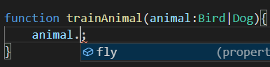
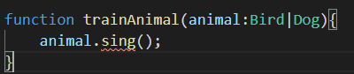
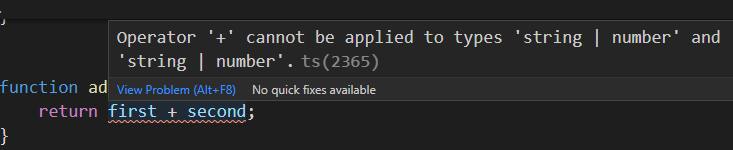

## 基础类型

```typescript
// 基础类型 null,undefined,symbol,boolean,void
const count:number = 123;
const teacherName:string = 'Dell';
```

```typescript
// 对象类型
const teacher:{
    name:string;
    age:number;
}={
    name: 'Dell',
    age: 18
}

const numbers:number[] = [1,2,3];

const getTotal: ()=>number = ()=>{
    return 123;
}
```

## 类型推断

```typescript
// 类型注解,我们告诉TS变量是什么类型
let count:number;
count = 123;

// 类型推断->推断出countInference是number类型
let countInference = 123;
```

## 函数类型

```typescript
function add(first:number,second:number){
    return first + second + '';
}

const count = add(1,2);
```

这种情况下没写返回值，我们在错误的情况下加了''导致返回值与我们要求number类型不符

```typescript
function add(first:number,second:number):number{
    return first + second;
}

const count = add(1,2);
```

返回值为void，没有返回值。如果有返回值将报错

```typescript
function sayHello():void{
    console.log('hello');
}
```

never类型：这个函数永远不可能执行完

```typescript
function errorEmitter():never{
    throw new Error();
    console.log(123); //执行不到
}
```

```typescript
function errorEmitter():never{
    while(true){}
    console.log(123); //执行不到
}
```

解构类型

```typescript
// 传入参数first为number,second为number返回值为number
function add({first,second}:{first:number,second:number}):number{
    return first+second;
}

const total = add({first:1,second:2});
```

## 联合类型

 当 ts 不确定一个联合类型的变量到底是哪个类型的时候，我们只能访问此联合类型的所有类型里**共有的属性或方法**

### 实例一

```ts
interface Bird{
    fly:boolean;
    sing:()=>{};
}

interface Dog{
    fly:boolean;
    bark:()=>{};
}

function trainAnimal(animal:Bird|Dog){
    animal.fly;
}
```

在这个例子中只有fly是共有的属性和方法



如果访问非共有属性和方法就会报错



解决方法一：类型断言做类型保护

```typescript
function trainAnimal(animal:Bird|Dog){
    if(animal.fly){
        (animal as Bird).sing();
    }else{
        (animal as Dog).bark();
    }
}
```

解决方法二：in语法做类型保护

```typescript
function trainAnimal(animal:Bird|Dog){
    if('sing' in animal){
        animal.sing();
    }else{
        animal.bark();
    }
}
```

### 实例二

```typescript
function add(first:string|number,second:string|number){
    return first + second;
}
```



这种情况下不能判断值是否为数字不能相加

```typescript
// typeof语法来做类型保护
function add(first:string|number,second:string|number){
    if(typeof first === 'string' || typeof second === 'string'){
        return `${first}${second}`
    }
    return first + second;
}
```

使用instanceof做类型保护

```typescript
// instanceof做类型保护
class NumberObj{
    count:number;
}
function add(first:object|NumberObj,second:object|NumberObj){
    if(first instanceof NumberObj && second instanceof NumberObj){
        return first.count + second.count;
    }
    return 0;
}
```

这种情况必须用类，类才有instanceof

## 数组的类型

### 存储基本数据类型

```typescript
// number类型数组
const numberArr: number[] = [1,2,3]
// number或者string类型数组
const arr: (number | string)[] =[1,'2',3];
// undefine类型数组
const undefinedArr: undefined[] = [undefined];
```

### 存储对象类型

```typescript
// 对象类型数组
const objectArr: {name:string}[]=[{name:'dell'}];
```

类型别名方式

```typescript
// type alias 类型别名
type User = {name:string,age:number};

const objectArr: User[]=[{name:'dell',age:20}];
```

类方式

```typescript
// 类方式
class User{
    name:string;
    age:number;
}

const objectArr: User[]=[{name:'dell',age:20}];
```

