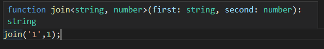

## 元组

```typescript
// 元组tuple []
// 第一个string,第二个string,第三个数字
const userInfo:[string,string,number] = ['Dell','male',18]

// 表格
const userList:[string,string,number][] = [
    ['dell','male',19],
    ['sun','female',26],
    ['jeny','female',38]
]
```

## 枚举

不使用TS

```typescript
const Status = {
    OFFLINE: 0,
    ONLINE: 1,
    DELETED: 2
};

function getResult(status){
    if(status === Status.OFFLINE){
        return 'offline'
    } else if(status === Status.ONLINE){
        return 'online'
    } else if(status === Status.DELETED){
        return 'error'
    }
}

getResult(Status.OFFLINE);
// 返回 offline
```

使用枚举实现上面方法

```typescript
enum Status{
    OFFLINE,
    ONLINE,
    DELETED
}


function getResult(status){
    if(status === Status.OFFLINE){
        return 'offline'
    } else if(status === Status.ONLINE){
        return 'online'
    } else if(status === Status.DELETED){
        return 'error'
    }
}

getResult(Status.OFFLINE); // offline
getResult(1); // offline
```

可设置默认值

```typescript
enum Status{
    OFFLINE = 2,
    ONLINE,
    DELETED
}
console.log(Status.OFFLINE) //2
console.log(Status.ONLINE) //3
console.log(Status.DELETED) //4
console.log(Status[2]) // OFFLINE
```

## 接口

```typescript
// type和interface都能定义类型，优先使用interface
interface Person{
    readonly id?:string; //只读
    name:string;
    age?:number;
    [propName:string]: any;
    say():string;

}

const getPersonName = (person:Person):void =>{
    console.log(person.name);
}

const setPersonName = (person:Person,name:string):void{
    person.name = name;
}


const person = {
    name: 'dell',
    sex:'male',
    say(){
        return 'hello'
    }
}

getPersonName(person);
setPersonName(person,'lee');
```

函数类型接口

```typescript
const say:SayHi = (word:string)=>{
    return word;
}
```

## 泛型

### 在函数中使用泛型

```typescript
// 泛型 generic
function join<ABC>(first:ABC,second:ABC){
    return `${first}${second}`;
}

join<string>('1','2');
join<number>(1,2);
```

泛型数组

```typescript
function map<ABC>(params: Array<ABC>){
    return params;
}

map<string>(['123'])
```

两个参数或多个参数

```typescript
// 泛型 generic
function join<T,P>(first:T,second:P){
    return `${first}${second}`;
}

join<number,string>(1,'1');
join<number,number>(1,1);
join('1',1); //如果不写将会进行类型推断
```



### 在类中使用泛型

```typescript
class DataManager<T>{
    constructor(private data: T[]){}
    getItem(index:number):T{
        return this.data[index];
    }
}

const data = new DataManager<string>(['1']);
data.getItem(0)
```

泛型的继承

```typescript
interface Item{
    name:string;
}

class DataManager<T extends Item>{
    constructor(private data: T[]){}
    getItem(index:number):string{
        return this.data[index].name;
    }
}

const data = new DataManager([{
    name:'dell'
}]);
data.getItem(0)
```

问题：希望T只能是number或者string

```typescript
interface Item{
    name:string;
}

class DataManager<T extends string | number>{
    constructor(private data: T[]){}
    getItem(index:number):T{
        return this.data[index];
    }
}

const data1 = new DataManager<string>(['1']);
const data2 = new DataManager<number>([1]);
```

泛型作为一个具体的类型注解

```typescript
function hello<T>(params:T){
    return params;
}

const func: <T>(param:T) => T = hello;
```

