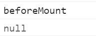

## 模板语法

### v-text指令

```html
<div id="app">
    <h2 v-text="message"></h2>
	<h2 v-text="info"></h2>
</div>
<script>
    var app = new Vue({
        el:"#app",
        data:{
            message:"土豆",
            info:"你好"
        }
    })
</script>
```

使用文本插值

```html
<h2>{{ message }}</h2>
```

### v-html指令

使用 v-html 指令用于输出 html 代码：

```html
<div id="app">
    <div v-html="message"></div>
</div>
    
<script>
new Vue({
  el: '#app',
  data: {
    message: '<h1>Hello</h1>'
  }
})
</script>
```

### v-on指令

```html
<div id="app">
    <input type="button" value="v-on指令" v-on:click="doIt" />
    <input type="button" value="v-on简写" @click="doIt" />
    <input type="button" value="双击事件" @dblclick="doIt" />
</div>
<script type="text/javascript">
    var app = new Vue({
        el:"#app",
        methods:{
            doIt:function(){
            alert("打他");
        }
    }
    })
</script>
```

传递参数

```vue
<div id="app">
  <button @click="doIt('老铁',666)">点击</button>
  <!-- 回车事件 -->
  <input type="text" @keyup.enter="sayHi" />

</div>
<script type="text/javascript">
  var app = new Vue({
    el: "#app",
    methods: {
      doIt: function (p1, c2) {
        console.log(p1);
        console.log(c2);
      },
      sayHi: function () {
        alert("你好")
      }
    }
  })

</script>
```


### v-show指令

v-if会从DOM中删除，v-show设置display。频繁切换用v-show

```html
<div id="app">
  
  <button @click="changeIsShow">切换显示状态</button>
</div>
<script type="text/javascript">
  var app = new Vue({
    el: "#app",
    data: {
      isShow: false
    },
    methods: {
      changeIsShow: function () {
        this.isShow = !this.isShow
      }
    }
  })

</script>
```

### v-if

```html
<div id="app">
  =18" src="img/1.jpg" width="150px">
</div>
<script type="text/javascript">
  var app = new Vue({
    el: "#app",
    data: {
      age: 18
    }
  })
</script>
```

### v-bind

```html
<div id="app">
  <!-- 标准方式 -->
  
  <!-- 简写方式 -->
  
</div>
<script type="text/javascript">
  var app = new Vue({
    el: "#app",
    data: {
      imgSrc: "img/1.jpg"
    }
  })

</script>

```

vue三元表达式：样式切换

```html
<style type="text/css">
  .active {
    border: 1px solid red;
  }

</style>

<div id="app">
  <!-- 简写方式 -->
  
  <!-- 三元表达式 -->
  
  <!-- vue方式 -->
  
</div>
<script type="text/javascript">
  var app = new Vue({
    el: "#app",
    data: {
      imgSrc: "img/1.jpg",
      imgTitle: "土豆",
      IsActive: true
    }
  })

</script>
```

### v-for

```html
<div id="app">
  <ul>
    <li v-for="item in city">
      城市:{{item}}
    </li>
  </ul>
</div>
<script type="text/javascript">
  var app = new Vue({
    el: "#app",
    data: {
      city: ["北京", "上海", "广州"]
    }
  })

</script>
```

索引值打印

```html
<div id="app">
  <ul>
    <li v-for="(it,index) in city">
      {{index}}城市:{{it}}
    </li>
  </ul>
</div>
<script type="text/javascript">
  var app = new Vue({
    el: "#app",
    data: {
      city: ["北京", "上海", "广州"]
    }
  })

</script>

```

对象数组遍历

```html
<div id="app">
  <h2 v-for="item in user">
    {{item}}
  </h2>
</div>
<script type="text/javascript">
  var app = new Vue({
    el: "#app",
    data: {
      user: [{
          name: "张三",
          age: "18"
        },
        {
          name: "李四",
          age: "20"
        }
      ]
    }
  })

</script>
```

### v-mode

```html
<div id="app">
  <input type="text" v-model="message" />
  <h2>{{message}}</h2>
</div>
<script type="text/javascript">
  var app = new Vue({
    el: "#app",
    data: {
      message: "你好"
    }
  })

</script>

```

## 事件修饰符

### 阻止冒泡修饰符

```html
<div id="app">
    <div>{{num}}</div>
    <div @click="hand1">
        <button @click.stop="hand0" type="button">点击</button>
    </div>
</div>

<script type="text/javascript">
    var app = new Vue({
        el: "#app",
        data: {
            num: 0
        },
        methods: {
            hand0: function() {},
            hand1: function() {
                this.num++;
            }
        }
    })
</script>
```

### 阻止默认跳转修饰符

```html
<a href="http://www.baidu.com" @click.prevent="handle3">百度</a>
```

## 计算属性

计算属性关键词: computed。

```html
<div id="app">
    <div>{{reverseString}}</div>
</div>

<script type="text/javascript">
    var vm = new Vue({
        el: "#app",
        data: {
            msg: 'Hello world'
        },
        computed:{
            reverseString:function(){
                return this.msg.split('').reverse().join('');
            }
        }
    })
</script>
```

## 监听属性

### 监听数据变化

```html
<div id="app">
    <div>
        <span>名</span>
        <span>
            <input type="text" v-model="firstName" />
        </span>
    </div>
    <div>
        <span>姓</span>
        <span>
            <input type="text" v-model="lastName" />
        </span>
    </div>
    <div>{{fullName}}</div>
</div>

<script type="text/javascript">
    var vm = new Vue({
        el: "#app",
        data: {
            firstName: 'Jim',
            lastName: 'Green',
            fullName: 'Jim Green'
        },
        watch: {
            firstName: function(val) {
                this.fullName = val + " " + this.lastName;
            },
            lastName: function(val) {
                this.fullName = this.firstName + " " + val;
            }
        }
    })
</script>
```


### 监听器用户名验证

```html
<div id="app">
    <div>
        <span>用户名：</span>
        <input type="text" v-model.lazy="uname" />
        <span>{{tip}}</span>
    </div>
</div>

<script type="text/javascript">
    var vm = new Vue({
        el: "#app",
        data: {
            uname: '',
            tip: ''
        },
        methods: {
            checkName: function(uname) {
                var that = this;
                //调用接口，可以使用定时任务模拟
                setTimeout(function() {
                    if (uname == 'admin') {
                        that.tip = "用户名已经存在，请更换一个";
                    } else {
                        that.tip = '用户名可以使用';
                    }
                }, 2000)
            }
        },
        watch: {
            uname: function(val) {
                // 调用后台接口验证用户名的合法性
                this.checkName(val);
                //修改提示信息
                this.tip = "正在验证中..."
            }
        }
    })
</script>
```


## 过滤器

### 过滤器的基本使用

1.定义一个名为upper的过滤器

```js
Vue. filter(upper，function(value) {
	//首字母转换为大写
	return val.charAt(0).toUpperCase() + val.slice(1);
})
```

2.使用过滤器

```html
<!-- 用|来使用过滤器 -->
<!-- msg原来数据 -->
<div>{{msg | upper}}</div>
```


完整代码

```html
<div id="app">
    <input type="text" v-model="msg" />
    <!-- 用|来使用过滤器 -->
    <div>{{msg | upper}}</div>
</div>

<script type="text/javascript">
    //定义过滤器
    Vue.filter("upper", function(val) {
        return val.charAt(0).toUpperCase() + val.slice(1);
    })

    var vm = new Vue({
        el: "#app",
        data: {
            msg: ''
        }
    })
</script>
```

### 多个过滤器使用

```html
<div id="app">
    <input type="text" v-model="msg" />
    <!-- 用|来使用过滤器 -->
    <div>{{msg | upper}}</div>
    <!-- 使用多个过滤器 -->
    <div>{{msg | upper | lower}}</div>
</div>

<script>
    //定义过滤器
    Vue.filter("upper", function(val) {
        return val.charAt(0).toUpperCase() + val.slice(1);
    })
    Vue.filter("lower", function(val) {
        return val.charAt(0).toLowerCase() + val.slice(1);
    })
    var vm = new Vue({
        el: "#app",
        data: {
            msg: ''
        }
    })
</script>
```


### 局部过滤器

```html
<div id="app">
    <input type="text" v-model="msg" />
    <!-- 用|来使用过滤器 -->
    <div>{{msg | upper}}</div>
</div>

<script type="text/javascript">
    var vm = new Vue({
        el: "#app",
        data: {
            msg: ''
        },
        filters: {
            upper: function(val) {
                return val.charAt(0).toUpperCase() + val.slice(1);
            }
        }
    })
</script>
```


### 带参数的过滤器

```html
<div id="app">
    <div>{{date | format('yyyy-MM-dd')}}</div>
</div>

<script type="text/javascript">
    //格式化日期
    Vue.filter('format', function(value, arg) {
        if (arg == 'yyyy-MM-dd') {
            var ret = '';
            ret += value.getFullYear() + '-' + (value.getMonth() + 1) + '-' + value.getDate();
            return ret;
        }
    })

    var vm = new Vue({
        el: "#app",
        data: {
            date: new Date()
        }
    })
</script>
```


## 样式绑定

### 样式绑定(对象语法)

```html
//绑定一个
<div :class="{active:isActive}"></div>
//绑定多个
<div :class="{active:isActive,error:isError}"></div>
```

案例

```html
<style>
.active{
	width: 100px;
	height: 100px;
	border: 1px solid skyblue;
}
</style>
<body>
    <div id="app">
        <div :class="{active:isActive}"></div>
        <button @click="handle">切换</button>
    </div>

    <script>
        var vm = new Vue({
            el: '#app',
            data: {
                isActive:true
            },
            methods: {
                handle(){
                    this.isActive = !this.isActive
                }
            }
        });
    </script>
</body>
```


### 样式绑定(数组语法)

```html
<div :class="[activeClass,errorClass]"></div>
```

```html
<head>
    <meta charset="UTF-8">
    <meta name="viewport" content="width=device-width, initial-scale=1.0">
    <meta http-equiv="X-UA-Compatible" content="ie=edge">
    <title>Document</title>
    <script src="js/vue.min.js"></script>
    <style>
        .active{
            width: 100px;
            height: 100px;
            border: 1px solid skyblue;
        }
        .error{
            background-color: tan;
        }
    </style>
</head>

<body>
    <div id="app">
        <div :class="[activeClass,errorClass]"></div>
    </div>

    <script>
        var vm = new Vue({
            el: '#app',
            data: {
                activeClass:'active',
                errorClass:'error'
            },
            methods: {}
        });
    </script>
</body>
```


### 对象绑定和数组绑定结合使用

```html
<div :class="[activeClass,errorClass],{test:isTest}"></div>
```

### 数组语法简化

```html
<body>
    <div id="app">
        <!-- 数组简化写法 -->
        <div :class="arrClasses"></div>
    </div>

    <script>
        var vm = new Vue({
            el: '#app',
            data: {
                arrClasses:['active','error']
            },
            methods: {}
        });
    </script>
</body>
```

### 对象简化写法

```html
<body>
    <div id="app">
        <!-- 对象简化写法 -->
        <div :class="objClasses"></div>
    </div>

    <script>
        var vm = new Vue({
            el: '#app',
            data: {
                objClasses:{
                    acive:true,
                    error:true
                }
            },
            methods: {}
        });
    </script>
</body>
```

### 保留默认class

```html
<!-- 默认class写法 -->
<div class="base" :class="objClasses"></div>
```

### 内联样式style

```html
<div :style='{border:borderStyle,width:widthStyle,height:HeightStyle}'></div>
```

```html
<body>
    <div id="app">
        <!-- 内联样式操作 -->
        <div :style='{border:borderStyle,width:widthStyle,height:HeightStyle}'></div>
    </div>

    <script>
        var vm = new Vue({
            el: '#app',
            data: {
                borderStyle:'1px solid red',
                widthStyle:'100px',
                HeightStyle:'100px'
            },
            methods: {}
        });
    </script>
</body>
```

## 生命周期

**生命周期图示**


实例一

```vue
<script>
export default {
  name: 'App',
  data () {
    return {
       msg: 'hello vue'
    }
  },
  // 创建之前
  beforeCreate () {
    console.log('beforeCreate');
  },
  // 创建之后
  created () {
    console.log('created');
  },
  // 挂载之前
  beforeMount () {
    console.log('beforeMount');
  },
  // 挂载之后
  mounted () {
    console.log('mounted');
  }
}
</script>
```


实例二：创建之前**数据data**和事件**方法methods**还没有绑定到实例对象上

```vue
<script>
export default {
  name: 'App',
  data () {
    return {
       msg: 'hello vue'
    }
  },
  // 创建之前
  beforeCreate () {
    console.log('beforeCreate');
    console.log(this);
    console.log(this.msg);
  },
  ....
  methods: {
    clickEvent(){
		
    }
  }
}
</script>
```


实例三：创建之前**数据data**和事件**方法methods**绑定到实例对象上

```vue
<script>
export default {
  name: 'App',
  data () {
    return {
       msg: 'hello vue'
    }
  },
  // 创建之后
  created () {
    console.log('created');
    console.log(this);
    console.log(this.msg);
    console.log(this.clickEvent);
  },
  methods: {
    clickEvent(){

    }
  }
}
</script>
```


实例四：渲染之前，根据数据生成的DOM对象是获取不到的

```vue
<template>
  <div class="container">
    <h1>{{msg}}</h1>
    <h1 :class="className"></h1>
  </div>
</template>

<script>
export default {
  name: 'App',
  data () {
    return {
       msg: 'hello vue',
       className:'redBg'
    }
  },
  // 挂载之前
  beforeMount () {
    // 渲染之前
    console.log('beforeMount');
    let dom = document.querySelector('.redBg')
    console.log(dom);
  },
  methods: {
    clickEvent(){

    }
  }
}
</script>
```



实例五：渲染之后，可以获取数据生成的DOM对象

```vue
<template>
  <div class="container">
    <h1>{{msg}}</h1>
    <h1 :class="className"></h1>
  </div>
</template>

<script>
export default {
  name: 'App',
  data () {
    return {
       msg: 'hello vue',
       className:'redBg'
    }
  },
  // 挂载之后
  mounted () {
    console.log('mounted');
    let dom = document.querySelector('.redBg')
    console.log(dom);
  },
  methods: {
    clickEvent(){

    }
  }
}
</script>
```


实例六：

```vue
<script>
export default {
  name: 'App',
  data () {
    return {
       msg: 'hello vue',
       className:'redBg'
    }
  },
  // 更新之前
  beforeUpdate () {
    console.log('beforeUpdate');
  },
  // 更新之后
  updated () {
    console.log('updated');
  }
}
</script>
```


实例七：使用v-if来销毁

**父组件**

```vue
<template>
  <div class="container">
    <Hello v-if="isShow"></Hello>
  </div>
</template>

<script>
import Hello from "./components/Hello";
export default {
  name: 'App',
  components: {
    Hello
  },
  data () {
    return {
       isShow:true
    }
  }
}
</script>
```

**子组件**

```vue
<template>
    <div>
        Hello 
    </div>
</template>
<script>
export default {
  data() {
    return {
    }
  },
  // 创建之前
  beforeCreate () {
    console.log('beforeCreate');
  },
  // 创建之后
  created () {
    console.log('created');
  },
  // 挂载之前
  beforeMount () {
    // 渲染之前
    console.log('beforeMount');
  },
  // 挂载之后
  mounted () {
    console.log('mounted');
  },
  // 更新之前
  beforeUpdate () {
    console.log('beforeUpdate');
  },
  // 更新之后
  updated () {
    console.log('updated');
  },
  // 销毁前
  beforeDestroy () {
    console.log("beforeDestroy");
  },
  // 销毁后
  destroyed () {
    console.log('destroyed');
  }
}
</script>
```

**修改isShow为false**


**再修改isShow为true**


**使用v-show不会卸载组件和重新创建组件**

```vue
<Hello v-show="isShow"></Hello>
```

