## 1.常见组件封装

### 1.1 项目初始化

使用vue-cli脚手架快速搭建一个vue项目

```js
// 选择scss babel 和 eslint
vue create chestnut-ui
```

```sh
? Please pick a preset: Manually select features
? Check the features needed for your project:
 (*) Choose Vue version
 (*) Babel
 ( ) TypeScript
 ( ) Progressive Web App (PWA) Support
 ( ) Router
 ( ) Vuex
>(*) CSS Pre-processors
 (*) Linter / Formatter
 ( ) Unit Testing
 ( ) E2E Testing  
```

```
> Sass/SCSS (with dart-sass)
  Sass/SCSS (with node-sass)
  Less
  Stylus 
```

```
  ESLint with error prevention only
  ESLint + Airbnb config
> ESLint + Standard config
  ESLint + Prettier 
```

```
  In dedicated config files
> In package.json  
```

启动项目

```sh
cd chestnut-ui
yarn serve
```

### 1.2 button组件

#### 1.2.1 前置知识

```
组件通讯
组件插槽
props校验
```

#### 1.2.2 参数支持

| 参数名   | 参数描述                                        | 参数类型 | 默认值  |
| :------- | :---------------------------------------------- | :------- | :------ |
| type     | 按钮类型（primary/success/warning/danger/info） | string   | default |
| plain    | 是否是朴素按钮                                  | boolean  | false   |
| round    | 是否是圆角按钮                                  | boolean  | false   |
| circle   | 是否是圆形按钮                                  | boolean  | false   |
| disabled | 是否禁用按钮                                    | boolean  | false   |
| icon     | 图标类名                                        | string   | 无      |

事件支持：

| 事件名 | 事件描述 |
| :----- | :------- |
| click  | 点击事件 |

#### 1.2.3 基本结构

compcht下创建一个button.vue的文件，放置button组件代码。创建一个组建的button组件，并且指定name为ChButton。

```vue
<template>
  <button class="ch-button">
    按钮组件 
  </button>
</template>

<script>
export default {
  name:'ch-Button'
}
</script>

<style scoped lang="scss">

</style>
```

创建组件完成后，不能在项目中直接使用，需要到main.js中注册才可以使用。

```js
import Vue from 'vue'
import App from './App.vue'
// 第一步：导入button组件
import Button from './compchnts/button.vue'
 
Vue.config.productionTip = false
 
// 第二步：注册组件,设置(组件名，组件)
Vue.compchnt(Button.name, Button)
 
new Vue({
  render: h => h(App)
}).$mount('#app')
```

注册完成后，组件就可以在项目中使用了

```vue
<template>
  <div>
    <ch-button></ch-button>
  </div>
</template>
```

按钮效果：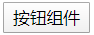

使用slot来定义按钮上的文本内容：

```vue
<template>
  <button class="ch-button">
   <span><slot></slot></span>
  </button>
</template>
```

在使用时就可以直接输入文本，定义按钮文本内容了：

```vue
<template>
  <div>
    <ch-button>登录</ch-button>
    <ch-button>删除</ch-button>
    <ch-button>取消</ch-button>
  </div>
</template>
```

效果：

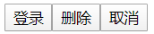

button组件基础样式：

```vue
<style lang="scss">
  .ch-button{
    display: inline-block;
    line-height: 1;
    white-space: nowrap;
    cursor: pointer;
    background: #ffffff;
    border: 1px solid #dcdfe6;
    color: #606266;
    -webkit-appearance: nch;
    text-align: center;
    box-sizing: border-box;
    outline: nch;
    margin: 0;
    transition: 0.1s;
    font-weight: 500;
    //禁止元素的文字被选中
    -moz-user-select: nch;
    -webkit-user-select: nch;
    -moz-user-select: nch;
    -ms-user-select: nch;
    padding: 12px 20px;
    font-size: 14px;
    border-radius: 4px;
    &:hover,
    &:hover{
      color: #409eff;
      border-color: #c6e2ff;
      background-color: #ecf5ff;
    }
  }
</style>
```

效果：

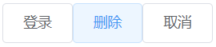

1.2.3 type属性

让按钮支持type属性，使得按钮支持不同样式：

第一步:父组件组件传递type属性

```vue
<template>
  <div id="app">
    <div class="row">
    <ch-button>按钮</ch-button>
    <ch-button type="primary">primary按钮</ch-button>
    <ch-button type="success">success按钮</ch-button>
    <ch-button type="info">info按钮</ch-button>
    <ch-button type="danger">danger按钮</ch-button>
    <ch-button type="warning">warning按钮</ch-button>
    </div>
  </div>
</template>
```

第二步：子组件接收负组件传递的数据

```js
export default {
  name: 'ChButton',
  // 此时对props进行校验，值接收string类型的type值
  props: {
    type:{
      type: String，
      // 设置默认值：如果不传值，那么使用default
      default: 'default'
    }
  },
  created () {
    console.log(this.type)//defalut primary success info danger warning
  }
}
```

第三步:通过绑定类名的方法动态控制样式

```vue
<template>
  <button class="ch-button" :class="`ch-button-${type}`">
   <span><slot></slot></span>
  </button>
</template>
```

第四步：设置不同类型的样式

```scss
.ch-button-primary{
  color:#fff;
  background-color: #409eff;
  border-color: #409eff;
  &:hover,
  &:focus{
    background: #66b1ff;
    background-color: #66b1ff;
    color: #fff;
    }
  }
  .ch-button-success{
  color:#fff;
  background-color: #67c23a;
  border-color: #67c23a;
  &:hover,
  &:focus{
    background: #85ce61;
    background-color: #85ce61;
    color: #fff;
    }
  }
  .ch-button-info{
  color:#fff;
  background-color: #909399;
  border-color: #909399;
  &:hover,
  &:focus{
    background: #a6a9ad;
    background-color: #a6a9ad;
    color: #fff;
    }
  }
  .ch-button-warning{
  color:#fff;
  background-color: #e6a23c;
  border-color: #e6a23c;
  &:hover,
  &:focus{
    background: #ebb563;
    background-color: #ebb563;
    color: #fff;
    }
  }
  .ch-button-danger{
  color:#fff;
  background-color: #f56c6c;
  border-color: #f56c6c;
  &:hover,
  &:focus{
    background: #f78989;
    background-color: #f78989;
    color: #fff;
    }
  }
```

第五步：至此就完成了对于按钮样式的设置，查看一下效果

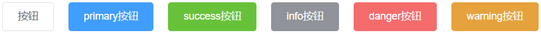

#### 1.2.4 plain属性

和type类型相同，我们只要将样式先设置好，然后通过父组件传递过来的值进行判断，就可以设置plain属性了。

第一步:父组件组件传递plain值

```vue
<template>
  <div id="app">
    <div class="row">
    <ch-button plain>按钮</ch-button>
    <ch-button plain type="primary">primary按钮</ch-button>
    <ch-button plain type="success">success按钮</ch-button>
    <ch-button plain type="info">info按钮</ch-button>
    <ch-button plain type="danger">danger按钮</ch-button>
    <ch-button plain type="warning">warning按钮</ch-button>
    </div>
  </div>
</template>
```

第二步：子组件接收负组件传递的数据，同样进行props校验，并且设置默认值为false

```css
  props: {
    plain: {
      type: Boolean,
      default: false
    }
  }
```

第三步:通过绑定类名的方法动态控制样式，由于plain类型是布尔值，所以在类型中我们使用对象的形式来控制样式

```vue
<template>
  <button class="ch-button" :class="[`ch-button-${type}`,{
    'is-plain':plain
  }]">
   <span><slot></slot></span>
  </button>
</template>
```

第四步：设置不同类型的样式，由于plain类型是以对象的形式在类中定义的，所以使用获取属性的方法定义样式

```scss
// 朴素按钮样式
.ch-button.is-plain{
  &:hover,
  &:focus{
    background: #fff;
    border-color: #489eff;
    color: #409eff;
  }
}
.ch-button-primary.is-plain{
  color: #409eff;
  background: #ecf5ff;
  &:hover,
  &:focus{
    background: #409eff;
    border-color: #409eff;
    color: #fff;
  }
}
.ch-button-success.is-plain{
  color: #67c23a;
  background: #c2e7b0;
  &:hover,
  &:focus{
    background: #67c23a;
    border-color: #67c23a;
    color: #fff;
  }
}
.ch-button-info.is-plain{
  color: #909399;
  background: #d3d4d6;
  &:hover,
  &:focus{
    background: #909399;
    border-color: #909399;
    color: #fff;
  }
}
.ch-button-warning.is-plain{
  color: #e6a23c;
  background: #f5dab1;
  &:hover,
  &:focus{
    background: #e6a23c;
    border-color: #e6a23c;
    color: #fff;
  }
}
.ch-button-danger.is-plain{
  color: #f56c6c;
  background: #fbc4c4;
  &:hover,
  &:focus{
    background: #f56c6c;
    border-color: #f56c6c;
    color: #fff;
  }
}
```

第五步：至此就完成了对于按钮样式的设置，查看一下效果

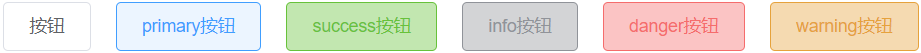

#### 1.2.5 round属性

设置round属性和之前的相似，只要在组件中定义好了样式，动态获取属性值即可。

获取属性值：

```js
round: {
    type: Boolean,
    default: false
}
```

round样式：

```css
.ch-button.is-round{
  border-radius: 20px;
  padding: 12px 23px;
}
```

效果图：

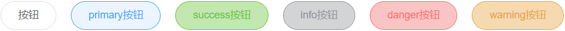

#### 1.2.6 circle属性

circle同样是上面的方法，样式为：

```css
.ch-button.is-circle{
  border-radius: 50%;
  padding: 12px;
}
```

#### 1.2.7 使用字体图标

在项目中使用字体图标，首先需要有字体图标，我们可以去[阿里巴巴矢量图标库](https://www.iconfont.cn/)下载。

下载完成后，在asset目录下新建一个fonts目录，存放我们下载到的字体图标。

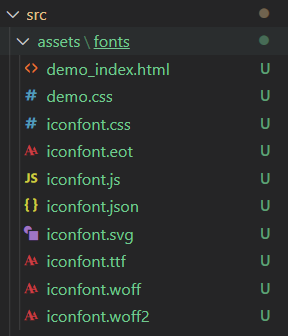

做完准备工作后，我们就可以开始把字体图标运用到项目中了。

第一步：在main.js中引入字体图标

```css
import './assets/fonts/iconfont.css'
```

第二步：将下载的字体图标css文件中的类名做修改，我将icon全部改为了ch-icon，并且将初始的iconfont类改为了[class*='ch-icon']，当类名中有ch-icon时使用，如下

```css
[class*='ch-icon'] {
  font-family: "iconfont" !important;
  font-size: 16px;
  font-style: normal;
  -webkit-font-smoothing: antialiased;
  -moz-osx-font-smoothing: grayscale;
}
.ch-icon-bluetoothoff:before {
  content: "\e697";
}
```

第三步：父组件传递图标名，子组件接收并且放到图标中

父组件传值：

```html
<div class="row">
    <ch-button icon="bluetoothon"></ch-button>
    <ch-button type="primary" icon="camera">照相机</ch-button>
    <ch-button type="success" icon="course"></ch-button>
    <ch-button type="info" icon="bluetooth_link"></ch-button>
    <ch-button type="danger" icon="addto"></ch-button>
    <ch-button type="warning" icon="audio"></ch-button>
</div>
```

子组件接收：

```css
icon: {
    type: String,
    default: ''
}
```

使用接收到的字体图标。在没有传入icon时隐藏`<i>`标签，在slot插槽没有传入值时，不显示`<span>`标签

```vue
<template>
  <button class="ch-button" :class="[`ch-button-${type}`,{
    'is-plain':plain,
    'is-round':round,
    'is-circle':circle,
  }]">
  <i v-if="icon" :class="`ch-icon-${icon}`"></i>
  <!-- 如果没传入文本插槽，则不显示span内容 -->
   <span v-if="$slots.default"><slot></slot></span>
  </button>
</template>
```

第四步：设置icon配套样式，使图标和文字之间有一定间隔

```css
.ch-button [class*=ch-icon-]+span{
  margin-left: 5px;
}
```

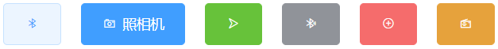

#### 1.2.8 点击事件支持

我们在使用组件时，直接给组件定义事件是不会被触发的。我们需要在组件中定义一个点击事件，这个点击事件不进行其他操作，只出发父组件中的点击事件。

组件中的定义点击事件：

```vue
<template>
  <button class="ch-button" :class="[`ch-button-${type}`,{
    'is-plain':plain,
    'is-round':round,
    'is-circle':circle,
  }]"
  @click="handleClick"
  >
  <i v-if="icon" :class="`ch-icon-${icon}`"></i>
  <!-- 如果没传入文本插槽，则不显示span内容 -->
   <span v-if="$slots.default"><slot></slot></span>
  </button>
</template>
```

 定义一个点击事件，这个点击事件的作用是调用父组件中的点击事件，并且回调 

```js
  methods: {
    handleClick (e) {
      this.$emit('click', e)
    }
  }
```

父组件在使用时定义自己的点击事件，其本质是子组件中的点击事件触发父组件中的点击事件。

```vue
<div class="row">
  <ch-button @click="getInfo">按钮</ch-button>
</div>
```

```js
methods: {
    getInfo () {
      console.log('获取信息！！')//获取信息！！
    }
  }
```

#### 1.2.9 disabled属性

和之前相似，只要父子组件传值并且动态获取这个值并且赋给disabled属性,并且设置一个disabled样式即可。

```vue
<div class="row">
  <ch-button @click="getInfo" disabled>按钮</ch-button>
</div>
```

```vue
<template>
  <button class="ch-button" :class="[`ch-button-${type}`,{
    'is-plain':plain,
    'is-round':round,
    'is-circle':circle,
    'is-disabled':disabled
  }]"
  @click="handleClick"
  :disabled="disabled"
  >
  <i v-if="icon" :class="`ch-icon-${icon}`"></i>
   <span v-if="$slots.default"><slot></slot></span>
  </button>
</template>
```

```css
disabled: {
    type: Boolean,
    default: false
}
```

disabled样式：

```css
.ch-button.is-disabled{
   cursor: no-drop;
}
```

### 1.3 dialog组件

#### 1.3.1 前置知识：

```
vue过渡动画
sync修饰符
具名插槽与v-slot指令
```

#### 1.3.2 参数支持：

| 参数名  | 参数描述                         | 参数类型 | 默认值 |
| :------ | :------------------------------- | :------- | :----- |
| title   | 对话框标题                       | string   | 提示   |
| width   | 宽度                             | string   | 50%    |
| top     | 与顶部的距离                     | string   | 15vh   |
| visible | 是否显示dialog（支持sync修饰符） | boolean  | false  |

#### 1.3.3 事件支持：

| 事件名 | 事件描述       |
| :----- | :------------- |
| opened | 模态框显示事件 |
| closed | 模态框关闭事件 |

#### 1.3.4 插槽说明：

| 插槽名称 | 插槽描述           |
| :------- | :----------------- |
| default  | dialog的内容       |
| title    | dialog的标题       |
| footer   | dialog的底部操作区 |

#### 1.3.5 基本结构

首先搭建起来dialog组件的框架，暂时不加入插槽，只构建出基本的框架和样式。

框架分为三个部分，头部（header）、内容（body）、底部（footer），基本框架如下：

```vue
<template>
 <div class="ch-dialog_wrapper">
   <div class="ch-dialog">
     <div class="ch-dialog_header">
       <span class="ch-dialog_title">提示</span>
       <button class="ch-dialog_headerbtn">
         <i class="ch-icon-close"></i>
       </button>
     </div>
     <div class="ch-dialog_body">
       <span>这是一段信息</span>
     </div>
     <div class="ch-dialog_footer">
       <ch-button>取消</ch-button>
       <ch-button type="primary">确定</ch-button>
     </div>
   </div>
 </div>
</template>
```

样式如下：

```vue
<style lang="scss" scoped>
.ch-dialog_wrapper{
  position: fixed;
  top: 0;
  right: 0;
  bottom: 0;
  left: 0;
  overflow: auto;
  margin: 0;
  z-index: 2001;
  background-color: rgba(0,0,0,0.5);
  .ch-dialog{
    position: relative;
    margin: 15vh auto 50px;
    background: #fff;
    border-radius: 2px;
    box-shadow: 0 1px 3px rgba(0,0,0,0.3);
    box-sizing: border-box;
    width: 30%;
    &_header{
      padding: 20px 20px 10px;
      .ch-dialog_title{
        line-height: 24px;
        font-size: 18px;
        color: #303133;
      }
      .ch-dialog_headerbtn{
        position: absolute;
        top: 20px;
        right: 20px;
        padding: 0;
        background: transparent;
        border: nch;
        outline: nch;
        cursor: pointer;
        font-size: 16px;
        .ch-icon-close{
          color:909399
        }
      }
    }
    &_body{
      padding: 30px 20px;
      color: #606266;
      font-size: 14px;
      word-break: break-all;
    }
    &_footer{
      padding: 10px 20px 20px;
      text-align: right;
      box-sizing: border-box;
      ::v-deep .ch-button:first-child{
        margin-right: 20px;
      }
    }
  }
}
</style>
```

在main.js注册后，在app.vue中引用，形成以下效果：

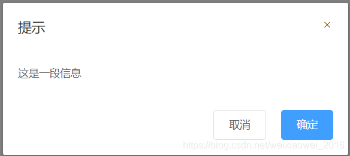

#### 1.3.6 title属性

title标题部分除了普通的标题内容外，也应该可以设置标题的样式，比如设置为h1红色的自定义标题内容，所以在这里我们就使用到了插槽，可以在使用时按照需求自定义标题内容和样式。

```vue
<template>
 <div class="ch-dialog_wrapper">
   <div class="ch-dialog">
     <div class="ch-dialog_header">
       <slot name="title">
         <!-- 将span放到slot内，这样不仅可以定义title文本，还可以定义样式等 -->
        <span class="ch-dialog_title">
          {{title}}
        </span>
       </slot>
       <button class="ch-dialog_headerbtn">
         <i class="ch-icon-close"></i>
       </button>
     </div>
     <div class="ch-dialog_body">
       <span>这是一段信息</span>
     </div>
     <div class="ch-dialog_footer">
       <ch-button>取消</ch-button>
       <ch-button type="primary">确定</ch-button>
     </div>
   </div>
 </div>
</template>
```

通过父子组件之间得传值以及slot指定组件自定义title内容和样式

```vue
 <ch-dialog title="温馨提示">
     <!-- 使用v-slot指定插槽进行编辑 -->
     <template v-slot:title>
     	<h3 style="color:red">我是标题</h3>
     </template>
 </ch-dialog>
```

效果如下

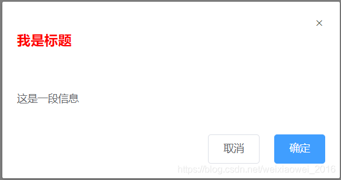

#### 1.3.7 width属性和top属性

实现在组件调用时控制dialog组件的宽度以及位置。

只需要在父组件中传递宽度和高度，并且在子组件中获取并且使用即可。

父组件传值：

```vue
<ch-dialog width="80%" top="200px"></ch-dialog>
```

子组件使用：

```vue
<template>
 <div class="ch-dialog_wrapper">
   <div class="ch-dialog" :style="{width:width,marginTop:top}">
     ···
   </div>
 </div>
</template>
```

#### 1.3.8 内容插槽

body内容可能是除span以外的其他内容，比如列表等，所以在这里使用插，并且在这里使用匿名插槽，使用匿名插槽的好处就是在使用时不需要使用template标签指定内容，直接在组件标签下编写内容即可。

在body中使用匿名组件

```vue
<div class="ch-dialog_body">
	<slot></slot>
</div>
```

在父组件中，只需要在标签下直接编辑内容即可，不需要再使用template标签绑定插槽或者父子组件传值了

```vue
<ch-dialog>
    <ul>
        <li>1</li>
        <li>2</li>
        <li>3</li>
    </ul>
</ch-dialog>
```

显示效果

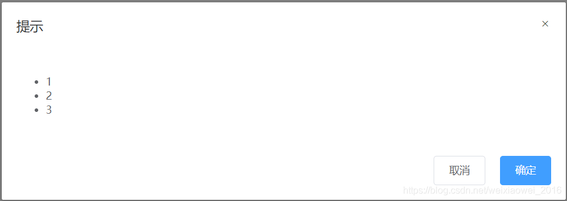 

#### 1.3.9 底部插槽

footer中使用slot插槽，在父组件中的定义底部内容。

设置footer插槽，如果没有指定footer插槽，则不显示

```vue
<div class="ch-dialog_footer">
    <!-- 如果footer不传递内容，则不显示footer -->
    <slot name="footer" v-if="$slots.footer"></slot>
</div>
```

父组件中的定义footer插槽内容

```vue
<template v-slot:footer>
    <ch-button>取消</ch-button>
    <ch-button type="primary">确定</ch-button>
</template>
```

#### 1.3.10 控制显示与隐藏

dialog组件的显示与隐藏，需要使用到sync语法糖。这里简单介绍以下什么是sync语法糖，sync通俗来说，是父子组件传值过程中提供的一种模式，这种模式有两个功能：1.将父组件向子组件传值；2.子组件回调一个值给父组件。

打个比方，如下代码需要两部才能实现上述功能：1.向子组件传值；2.接收子组件回调的值

```vue
//父组件传值 
<demo :visible="visible" :mchy="mchy" @update:aa="fn1"></demo>
//子组件回调
  methods: {
    fn () {
     this.$emit('aa', 200)
    }
  }
```

根据上面对于sync语法糖的介绍，我们在dialog显示和隐藏中要进行两种处理

控制dialog的显示和隐藏，我们首先在子组件中使用v-show对于组建的显示与隐藏进行控制。

```vue
<div class="ch-dialog_wrapper" v-show="visible" @click.self="handleClose">
   ···
</div>
```

父组件控制dialog的显示和隐藏

父组件中的直接通过传递一个参数visible，使用点击方法控制这个参数的布尔值即可。

```vue
<ch-dialog :visible.sync="visible">
    <ul>
        <li>1</li>
        <li>2</li>
        <li>3</li>
    </ul>
    <template v-slot:footer>
        <ch-button @click="switchDialog">取消</ch-button>
        <ch-button type="primary">确定</ch-button>
    </template>
</ch-dialog>
```

子组件控制dialog的显示和隐藏

子组件控制dialog的显示和隐藏，不能直接修改父组件传递过来的值，需要使用回调触发父组件中的值进行修改，这里就使用到了上面介绍的sync语法糖。

首先在父组件中使用:visible.sync="visible"向子组件进行传值并且接收子组件回调。

```vue
<ch-dialog :visible.sync="visible">
    <ul>
        <li>1</li>
        <li>2</li>
        <li>3</li>
    </ul>
    <template v-slot:footer>
        <ch-button @click="switchDialog">取消</ch-button>
        <ch-button type="primary">确定</ch-button>
    </template>
</ch-dialog>
```

子组件通过自身定义的方法，控制dialog组件的显示与隐藏，然后将visible属性回调给父组件。

```vue
<template v-slot:footer>
  <ch-button>取消</ch-button>
  <ch-button type="primary">确定</ch-button>
</template>
```

回调方法：

```js
  method{
    handleClose () {
      this.$emit('update:visible', false)
    }
  }
```

#### 1.3.11 动画效果

使用transition包裹整个dialog框架

```vue
<template>
  <transition name="dialog-fade">
    <div class="ch-dialog_wrapper" v-show="visible" @click.self="handleClose">
        ···
    </div>
  </transition>
</template>
```

使用vue动画进行处理

这里先定义了fade动画，然后在dialog组件显示和隐藏的时候调用（反向调用）这个动画。

```css
.dialog-fade-enter-active{
  animation: fade .3s;
}
.dialog-fade-leave-active{
  animation: fade .3s reverse;
}
@keyframes fade{
  0% {
    opacity: 0;
    transform: translateY(-20px);
  }
  100%{
    opacity: 1;
    transform: translateY(0);
  }
}
```

### 1.4 input组件

#### 1.4.1 参数支持

| 参数名称      | 参数描述                    | 参数类型 | 默认值 |
| :------------ | :-------------------------- | :------- | :----- |
| placeholder   | 占位符                      | string   | 无     |
| type          | 文本框类型（text/password） | string   | text   |
| disabled      | 禁用                        | boolean  | false  |
| clearable     | 是否显示清空按钮            | boolean  | false  |
| show-password | 是否显示密码切换按钮        | boolean  | false  |
| name          | name属性                    | string   | 无     |

#### 1.4.2 事件支持

| 事件名称 | 事件描述     |
| :------- | :----------- |
| blur     | 失去焦点事件 |
| change   | 内容改变事件 |
| focus    | 获取焦点事件 |

#### 1.4.3 基本框架和样式以及处理

因为这部分与前面介绍的内容相同且比较简单，所以将这部分放在一起，不多做介绍了。

这里需要注意的是，disabled属性为true时，输入框禁用，并且需要改变样式，之前在button组件封装的时候也用到了相同的方法，获取到值后动态设置组件样式。

input组件的框架以及样式，获取到的数据以及数据处理：

```vue
<template>
 <div class="ch-input">
   <input
   class="ch-input_inner"
   :class="{'is-disabled': disabled}"
   :placeholder="placeholder"
   :type="type"
   :name="name"
   :disabled="disabled">
 </div>
</template>
<script>
export default {
  name: 'chInput',
  compchnts: {
  },
  props: {
    placeholder: {
      type: String,
      default: ''
    },
    type: {
      type: String,
      default: 'text'
    },
    name: {
      type: String,
      default: ''
    },
    disabled: {
      type: Boolean,
      default: false
    }
  },
  data () {
    return {}
  },
  methods: {}
}
</script>
<style lang="scss" scoped>
  .ch-input{
    width: 100%;
    position: relative;
    font-size: 14px;
    display: inline-block;
    .ch-input_inner{
      -webkit-appearance: nch;
      background-color: #fff;
      background-image: nch;
      border: 1px solid #dcdfe6;
      border-radius: 4px;
      box-sizing: border-box;
      color: #606266;
      display: inline-block;
      font-size: inherit;
      height: 40px;
      line-height: 40px;
      outline: nch;
      padding: 0 15px;
      transition: border-color .2s cubic-bezier(.645,045,.355,1);
      width: 100%;
 
      &:focus{
        outline: nch;
        border-color: #409eff;
      }
      // input禁用样式
      &.is-disabled{
        background-color: #f5f7fa;
        border-color: #e4e7ed;
        color: #c0c4cc;
        cursor:not-allowed;
      }
    }
  }
</style>
```

父组件中传值也是与之前一样的：

```vue
 <ch-input placeholder="请输入密码" type="password" name="name" disabled=true></ch-input>
```

#### 1.4.4 v-model语法糖

当我们给一个input标签进行双向数据绑定时，我们需要使用value绑定数据，再使用input事件监听标签内数据的变动，如下：

```vue
<input :value="username" @input="username=$event.target.value"/>
```

在封装input组件时，这样显然是不合适的，所以这里我们需要使用到v-model语法糖。

显然，我们是不能给我们封装的input组件直接使用v-model绑定数据的，但是由于v-model的特性，他将value值绑定在了组件上，所以，我们组件内部通过接收value值的方式，就可以接收到传入的数据；并且v-model也实现了input事件，在组件内部绑定的input事件作为回调，把value值返回给父组件，这样就实现了input组件的双向绑定了。

父组件中的使用v-model绑定：

```vue
<ch-input v-model="username"></ch-input>
```

组件内部绑定value值以及实现回调：

```vue
//绑定value值和input事件  
 <input
   class="ch-input_inner"
   :class="{'is-disabled': disabled}"
   :placeholder="placeholder"
   :type="type"
   :name="name"
   :value="value"
   @input="handleInput"
   :disabled=disabled>
```

```js
//绑定input事件进行回调
handleInput (e) {
	this.$emit('input', e.target.value)
}
```

#### 1.4.5 实现clearable功能和showPassword功能

当我们在组件中键入clearable属性时，我们希望组件可以有一个一键删除数据得功能。

当input组件的type属性是password时，我们希望在给与show-password属性时，可以有一个显示和隐藏密码的按钮。

实现这个两个功能，除了基本的父子组件传值外，还要添加i标签的icon字体图标，以及实现功能。

```vue
 <div class="ch-input" :class="{'ch-input_suffix':showSuffix}">
   <input
   class="ch-input_inner"
   :class="{'is-disabled': disabled}"
   :placeholder="placeholder"
   :type="type"
   :name="name"
   :value="value"
   @input="handleInput"
   :disabled=disabled>
  <span class="ch-input_suffix">
   <i class="on-input_icon ch-icon-cancel" v-if="clearable && value" @click="clear"></i>
   <i class="on-input_icon ch-icon-visible" v-if="showPassword && type=='password'" @click="handlePassword"></i>
 </span>
 </div>
```

样式：

```scss
  .ch-input_suffix{
    .ch-input_inner{
      padding-right: 30px;
    }
    .ch-input_suffix{
      position: absolute;
      right: 10px;
      height: 100%;
      top: 0;
      line-height: 40px;
      text-align: center;
      color: #c0c4cc;
      transition: all .3s;
      z-index: 900;
      i{
        color: #c0c4cc;
        font-size: 14px;
        cursor: pointer;
        transition: color .2s cubic-bezier(.645,.045,.355,1);
      }
    }
  }
```

实现clearable功能

首先获取父组件传递的clearable值，然后给i标签绑定一个点击事件，这个事件触发input事件回调，当点击叉号字体图标时，将父组件的value清空：

```js
clear () {
	this.$emit('input', '')
}
```

实现showPassword功能

实现showPassword功能的思路很简单，就是改变input的type类型即可。但是，我们不能直接改变父组件传递过来的type值，但是我们可以使用判断type值的方式，实现type的改变。

首先设置一个布尔类型的变量，并且设置点击事件改变这个变量：

```javascript
 data () {
    return {
      // 显示是否显示密码框
      passwordVisible: false
    }
  },
methods: {
    handlePassword () {
      this.passwordVisible = !this.passwordVisible
    }
  }
```

然后我们需要在绑定type值时，进行两重判断。

第一步、判断showPassword是否为真；第二步、如果为真则通过passwordVisible去判断type为text还是password，以此来控制隐藏和现实，否则type值就为传入的type值即可：

```js
:type="showPassword ? (passwordVisible ? 'text' : 'password') : type"
```

### 1.5 switch组件

#### 1.5.1 参数支持

| 参数名        | 参数描述           | 参数类型 | 默认值  |
| :------------ | :----------------- | :------- | :------ |
| v-model       | 双向绑定           | 布尔类型 | false   |
| name          | name属性           | string   | text    |
| activeColor   | 自定义的激活颜色   | string   | #1ec63b |
| inactiveColor | 自定义的不激活颜色 | string   | #dd001b |

#### 1.5.2 事件支持

| 事件名称 | 事件描述           |
| :------- | :----------------- |
| change   | change时触发的事件 |

#### 1.5.3 基本结构

switch组件基本框架：

```vue
<template>
  <div class="ch-switch">
    <span class="on-switch_core">
      <span class="ch-switch_button"></span>
    </span>
  </div>
</template>
```

switch组件样式：

```scss
<style lang="scss" scoped>
  .ch-switch{
    display: inline-block;
    align-items: center;
    position: relative;
    font-size: 14px;
    line-height: 20px;
    vertical-align: middle;
    .ch-switch_core{
    margin: 0;
    display: inline-block;
    position: relative;
    width: 40px;
    height: 20px;
    border: 1px solid #dcdfe6;
    outline: nch;
    border-radius: 10px;
    box-sizing: border-box;
    background: #dcdfe6;
    cursor: pointer;
    transition: border-color .3s,background-color .3s;
    vertical-align: middle;
    .ch-switch_button{
      position:absolute;
      top: 1px;
      left: 1px;
      border-radius: 100%;
      transition: all .3s;
      width: 16px;
      height: 16px;
      background-color: #fff;
      }
    }
  }
</style>
```

#### 1.5.4 数据双向绑定

实现switch组件数据双向绑定和input组件相同，使用v-model语法糖即可。

在父组件种通过v-model绑定数据，在组件内部获取value属性，并且定义一个回调函数与父组件通信，改变父组件中的绑定值即可。

父组件：

```vue
<ch-switch v-model="active" ></ch-switch>
```

子组件，点击时改变is-checked类状态，触发滑块滑动：

```vue
<div class="ch-switch" :class="{'is-checked':value}" @click="handleClick">
  <span class="ch-switch_core">
    <span class="ch-switch_button"></span>
  </span>
</div>
 
methods: {
    handleClick () {
    	this.$emit('input', !this.value)
    }
}
```

滑动样式：

```scss
  // 选中样式
  .is-checked {
    .ch-switch_core{
      border-color: #409eff;
      background-color: #409eff;
      .ch-switch_button {
        transform: translateX(20px);
      }
    }
  }
```

#### 1.5.5 颜色自定义

自定义switch组件的颜色，首先需要传入颜色的值，在子组件中获取后，使用ref获取节点，将背景颜色改变为对应颜色即可。

父组件传递色彩参数：

```vue
<ch-switch
v-model="active"
active-color="#13ce66"
inactive-color="#ff4949"
></ch-switch>
```

子组件中定义ref="core"以确定节点：

```vue
 <div class="ch-switch" :class="{'is-checked':value}" @click="handleClick">
    <span class="ch-switch_core" ref="core">
      <span class="ch-switch_button"></span>
    </span>
  </div>
```

通过mouted钩子和watch监听，在刚进入页面以及value改变时对颜色进行改变：

```js
  mounted () {
    // 修改开关颜色
    if (this.activeColor || this.inactiveColor) {
      var color = !this.value ? this.activeColor : this.inactiveColor
      this.$refs.core.style.borderColor = color
      this.$refs.core.style.backgroundColor = color
    }
  },
  watch: {
    'value' (e) {
    // 修改开关颜色
      if (this.activeColor || this.inactiveColor) {
        var color = !e ? this.activeColor : this.inactiveColor
        this.$refs.core.style.borderColor = color
        this.$refs.core.style.backgroundColor = color
      }
    }
  }
```

#### 1.5.6 name属性支持

用户在使用switch组件的时候，实质上是当成表单元素来使用的。因此可能会用到组件的name属性。所以需要在switch组件中添加一个checkbox，并且当值改变的时候，也需要设置checkbox的value值。

加入input标签：

```vue
<template>
  <div class="ch-switch" :class="{'is-checked':value}" @click="handleClick">
    <span class="ch-switch_core" ref="core">
      <span class="ch-switch_button"></span>
    </span>
    <input type="checkbox" class="ch-switch_input" :name="name" ref="input">
  </div>
</template>
```

设置标签样式，因为input标签只作为name绑定使用，所以将其隐藏起来：

```css
// 隐藏input标签
.ch-switch_input{
    position:absolute;
    width: 0;
    height: 0;
    opacity: 0;
    margin: 0;
}
```

我们在页面加载和点击时修改input的checked值，保证可以和value值同步：

```js
  mounted () {
    // 修改开关颜色
    if (this.activeColor || this.inactiveColor) {
      var color = !this.value ? this.activeColor : this.inactiveColor
      this.$refs.core.style.borderColor = color
      this.$refs.core.style.backgroundColor = color
    }
    // 控制checkbox的值,input值同步value值
    this.$refs.input.checked = this.value
  },
  methods: {
    handleClick () {
      this.$emit('input', !this.value)
      // 控制checkbox的值,input值同步value值
      this.$refs.input.checked = this.value
    }
  }
```

### 1.6 radio组件

#### 1.6.1 前置知识点：

```
radio的基本使用
```

#### 1.6.2 参数支持：

| 参数名称 | 参数描述        | 参数类型             | 默认值 |
| :------- | :-------------- | :------------------- | :----- |
| v-model  | 双向绑定        | 布尔类型             | false  |
| label    | 单选框和value值 | string，num，Boolean | ' '    |
| name     | na'm            |                      |        |

#### 1.6.3 基本结构

框架、基本样式以及选中样式：

```scss
<template>
  <label class="ch-radio is-checke">
    <span class="ch-radio_input">
      <span class="ch-radio_inner"></span>
      <input
      type="radio"
      class="ch-radio_original"
      >
    </span>
    <span class="ch-radio_label">我是label</span>
  </label>
</template>
<script>
export default {
  name: 'chRadio',
  props: {}
  },
  watch: {},
  data () {
    return {}
  },
  methods: {}
}
</script>
<style lang="scss" scoped>
  .ch-radio{
    color: #606266;
    font-weight: 500;
    line-height: 1;
    position: relative;
    cursor: pointer;
    display: inline-block;
    white-space: nowrap;
    outline: nch;
    font-size: 14px;
    margin-right: 30px;
    -moz-user-select: nch;
    -webkit-user-select: nch;
    -moz-user-select: nch;
    .ch-radio_input{
      white-space: nowrap;
      cursor: pointer;
      outline: nch;
      display: inline-block;
      line-height: 1;
      position: relative;
      vertical-align: middle;
      .ch-radio_inner{
        border: 1px solid #dcdfe6;
        border-radius: 100%;
        width: 14px;
        height: 14px;
        background-color: #fff;
        position: relative;
        cursor: pointer;
        display: inline-block;
        box-sizing: border-box;
        &:after{
          width: 4px;
          height: 4px;
          border-radius: 100%;
          background-color: #fff;
          content: "";
          position: absolute;
          left: 50%;
          top: 50%;
          transform: translate(-50%,-50%) scale(0);
          transition: transform .15s ease-in;
        }
      }
      .ch-radio_original{
        opacity: 0;
        outline: nch;
        position: absolute;
        z-index: -1;
        top: 0;
        left: 0px;
        right: 0;
        bottom: 0;
        margin: 0;
      }
    }
    .ch-radio_label{
      font-size: 14px;
      padding-left: 10px;;
    }
  }
  // 选中的样式
  .ch-radio.is-checked{
    .ch-radio_input{
      .ch-radio_inner{
        border-color: #409eff;
        background-color: #409eff;
        &:after{
          transform: translate(-50%,-50%) scale(1);
        }
      }
    }
    .ch-radio_label{
      color:#409eff;
    }
  }
</style>
```

#### 1.6.4 数据双向绑定

实现radio组件的数据双向绑定，除了要绑定数据本身外，还要控制radio组件的样式。

实现radio组件数据的绑定，需要父组件传递的label值和value值，其中value值使用v-model语法糖来绑定。

```vue
 <ch-radio v-model="gender" label="0">男</ch-radio>
 <ch-radio v-model="gender" label="1">女</ch-radio>
```

子组件接收数据后，要对数据进行处理。

当radio组件被点击时，绑定的数据应该变为该组件的label值。我们将组件中的input标签的value绑定为传入的label值，并且声明一个计算属性model双向绑定到input组件上，model我们需要通过get方法获取值；并且通过set方法将值回调给父组件。

同时，当我们在点击radio组件时，我们应该让被选中的组件添加选中样式，我们通过label和value的比较来判断，如果相同则显示选中样式。

```vue
<template>
  <label class="ch-radio" :class="{'is-checked': label == value}">
    <span class="ch-radio_input">
      <span class="ch-radio_inner"></span>
      <input
      type="radio"
      class="ch-radio_original"
      :value="label"
      v-model="model"
      >
    </span>
    <span class="ch-radio_label">
      <slot></slot>
      <!-- 如果没有传值，就把label作为文本显示 -->
      <template v-if="!$slots.default">{{label}}</template>
      </span>
  </label>
</template>
//计算属性
computed: {
    model: {
        get () {
        	return this.value
        },
        set (value) {
            // 触发父组件的input事件
            this.$emit('input', value)
        }
    }
}
```

### 1.7 radio-group组件

radio-group组件是再radio组件上进行优化的，它的目的是在我们使用radio组件时，不必给每个组件都添加一个v-model，而是通过绑定一个v-model来实现数据绑定。

使用radio-group组件包裹radio组件时，需要考虑到的一个问题就是radio-group组件于radio组件之间的通讯。我们在使用radio-group组件时将数据通过v-model进行了绑定，那么raido组件就不能直接拿到这个值，所以我们需要使用provide/inject进行祖孙组件之间得传值。

使用provide/inject非常简单，在radio-group中通过声明provide对象将组件自身进行传递，在radio中使用inject进行接收即可。

radio-group组件架构：

```vue
<template>
  <div class="ch-radio-group">
    <slot></slot>
  </div>
</template>
<script>
export default {
  name: 'chRadioGroup',
  provide () {
    return {
      RadioGroup: this
    }
  },
  props: {
    // 组件接收到了value值，我们需要触发这个组件的input事件
    // provide 与 inject  用来做祖孙之间得组件通讯
    value: null
  }
}
</script>
```

在radio组件中，通过inject可以直接接收到参数，此时，原本通过v-model传递进来的value值，变成了radio-group组件传进来的RadioGroup.value值，所以在computed计算属性中，我们先写一个radio组件是否被radio-group组件进行判断的方法，并且使用在model中，如果被包裹了，则使用RadioGroup.value值，否则使用value值。

同时在is-checked类的判断上抛弃label于value的比较，转而通过label于model（model此时的值为value或RadioGroup.value）比较，来进行样式的更改。

```vue
<template>
  <label class="ch-radio" :class="{'is-checked': label == model}">
    <span class="ch-radio_input">
      <span class="ch-radio_inner"></span>
      <input
      type="radio"
      class="ch-radio_original"
      :value="label"
      v-model="model"
      >
    </span>
    <span class="ch-radio_label">
      <slot></slot>
      <!-- 如果没有传值，就把label作为文本显示 -->
      <template v-if="!$slots.default">{{label}}</template>
      </span>
  </label>
</template>
<script>
export default {
  name: 'chRadio',
  props: {
    label: {
      type: [String, Number, Boolean],
      defualt: ''
    },
    value: null,
    name: {
      type: String,
      defualt: ''
    }
  },
  inject: {
    RadioGroup: {
      default: ''
    }
  },
  computed: {
    model: {
      get () {
        return this.isGroup ? this.RadioGroup.value : this.value
      },
      set (value) {
        // 触发父组件的input事件
        this.isGroup ? this.RadioGroup.$emit('input', value) : this.$emit('input', value)
      }
    },
    // 用于判断radio是否被radioGroup包裹
    isGroup () {
      return !!this.RadioGroup
    }
  }
}
</script>
```

### 1.8 checkbox组件

```vue
<template>
  <label class="ch-checkbox" :class="{' is-checked':isChecked}">
    <span class="ch-checkbox_input">
      <span class="ch-checkbox_inner"></span>
      <input type="checkbox"
      class="ch-checkbox_original"
      :name="name"
      v-model="model"
      :value="label"
      >
    </span>
    <span class="ch-checkbox_label">
      <slot></slot>
      <template v-if="!$slots.default">
        {{label}}
      </template>
    </span>
  </label>
</template>
<script>
export default {
  name: 'chCheckbox',
  inject: {
    CheckboxGroup: {
      default: ''
    }
  },
  props: {
    value: {
      type: Boolean,
      default: false
    },
    label: {
      type: String,
      default: ''
    },
    name: {
      type: String,
      default: ''
    }
  },
  computed: {
    model: {
      get () {
        return this.isGroup ? this.CheckboxGroup.value : this.value
      },
      set (value) {
        this.isGroup ? this.CheckboxGroup.$emit('input', value) : this.$emit('input', value)
        console.log(value)
      }
    },
    isGroup () {
      return !!this.CheckboxGroup
    },
    isChecked () {
      // 如果十group包裹，判断label是否在model中
      // 如果没有group包裹,直接使用model
      return this.isGroup ? this.model.includes(this.label) : this.model
    }
  }
}
</script>
 
<style lang="scss" scoped>
  .ch-checkbox{
    color: #606266;
    font-weight: 500;
    font-size: 14px;
    position: relative;
    cursor: pointer;
    display: inline-block;
    white-space: nowrap;
    user-select: nch;
    margin-right: 30px;
    .ch-checkbox_input{
      white-space: nowrap;
      cursor: pointer;
      outline: nch;
      display: inline-block;
      line-height: 1;
      position: relative;
      vertical-align: middle;
      .ch-checkbox_inner{
        display: inline-block;
        position: relative;
        border: 1px solid #dcdfe6;
        border-radius: 2px;
        box-sizing: border-box;
        width: 14px;
        height: 14px;
        background-color: #fff;
        z-index: 1;
        transition: border-color .25s cubic-bezier(.71,-.46,.29,1.46),background-color .25s,cubic-bezier(.71,-.46,.29,1.46);
        &:after{
          box-sizing: content-box;
          content: '';
          border: 1px solid #ffffff;
          border-left: 0;
          border-top: 0;
          height: 7px;
          left: 4px;
          position: absolute;
          top: 1px;
          transform: rotate(45deg) scaleY(0);
          width: 3px;
          transition: transform .15s ease-in .05s;
          transform-origin: center;
        }
      }
      .ch-checkbox_original{
        opacity: 0;
        outline: nch;
        position: absolute;
        left: 10px;
        margin: 0;
        width: 0;
        height: 0;
        z-index: -1;
      }
    }
    .ch-checkbox_label{
      display: inline-block;
      padding-left: 10px;
      line-height: 19px;
      font-size: 14px;
    }
  }
  // 选中的样式
  .ch-checkbox.is-checked{
    .ch-checkbox_input{
      .ch-checkbox_inner{
        background-color: #409eff;
        border-color: #409eff;
      }
      &:after{
        transform: rotate(45deg) scaleY(1);
      }
    }
    .ch-checkbox_label{
      color: #409eff;
    }
  }
</style>
```

### 1.9 checkbox-group组件

```vue
<template>
  <div class="ch-checkbox-group">
    <slot></slot>
  </div>
</template>
<script>
export default {
  name: 'chCheckboxGroup',
  provide () {
    return {
      CheckboxGroup: this
    }
  },
  props: {
    value: {
      type: Array
    }
  }
}
</script>
```

### 1.10 form组件

```vue
<template>
  <div class="ch-form">
    <slot></slot>
  </div>
</template>
<script>
export default {
  name: 'chForm',
  provide () {
    return {
      Form: this
    }
  },
  props: {
    model: {
      type: Object,
      required: true
    },
    labelWidth: {
      type: String,
      default: '80px'
    }
  }
}
</script>
```

### 1.11 form-item组件

```vue
<template>
  <div class="ch-form-item">
    <label :style="labelStyle" class="ch-form-item_label">{{label}}</label>
    <div class="ch-form-item_content">
      <slot></slot>
    </div>
  </div>
</template>
<script>
export default {
  name: 'chFormItem',
  props: {
    label: {
      type: String,
      default: ''
    }
  },
  inject: ['Form'],
  computed: {
    labelStyle () {
      return {
        width: this.Form.labelWidth
      }
    }
  }
}
</script>
 
<style lang="scss" scoped>
  .ch-form-item{
    margin-bottom: 25px;
    .ch-form-item_label{
      text-align: right;
      vertical-align: middle;
      float: left;
      font-size: 14px;
      color: #606266;
      line-height: 40px;
      padding: 0 12px 0 0;
      box-sizing: border-box;
    }
    .ch-form-item_content{
      line-height: 40px;
      position: relative;
      font-size: 14px;
      overflow: hidde;
    }
  }
</style>
```

## 2.封装成ui组件库

我们在前面已经将组件全部封装完毕了，现在我们要将组件打包成组件库，上传到github上。由于是模仿element-ui进行的组件封装，所以在发布时也是用element-ui的打包结构。

### 2.1 目录调整

我们新建一个vue项目，并且在根目录创建两个文件夹就packages和examples。

- packages：用于存放所有的组件
- examples：用于进行测试，把src改为examples

我们将之前写好的组件以及字体图标copy到新建项目的packages路径下，将App.vue和main.js放到examples路径下。其实一个单纯的组件库是不需要examples路径的，这样设计是为了以后我们封装新的组件时，便于测试。并且我们将原来的src文件删除。

### 2.2 配置vue.config.js

我们在项目根目录下创建vue.config.js文件，并进行如下配置。

我们通过设置entry属性将入口文件设置为examps路径下的main.js文件

我们再通过chainWebpack对于项目进行配置，使用babel处理可以将高版本语法转成低版本语法，在我们封装组件库时，这部分配置可以直接复制使用。

```vue
const path = require('path')
module.exports = {
  pages:{
    index:{
      // 修改项目入口文件
      entry:'examples/main.js',
      template:'public/index.html',
      filename:'index.html'
    }
  },
  // 扩展webpack配置,使webpages加入编译
  chainWebpack: config => {
    config.module
    .rule('js')
    .include.add(path.resolve(__dirname,'packages')).end()
    .use('babel')
    .loader('babel-loader')
    .tap(options => {
      return options
    })
  }
}
```

### 2.3 install方法

安装vue.js插件，如果插件使一个对象，那么必须提供install方法。

此时，我们需要在packages路径下，新建一个index.js文件，用于声明install对象。

1. 我们将所有的组件和字体图标引入到index.js文件中
2. 声明conpoments数组，将组件全部放到这个数组中
3. 定义install方法，在Vue中注册所有的组件
4. 判断是否直接引入了文件，如果引入了，则不需要调用Vue.use()方法
5. 导出install对象

```vue
// 整个包的入口
// 统一导出
// 导出颜色选择器组件
import Button from './button'
import Dialog from './dialog'
import Input from './input'
import Checkbox from './checkbox'
import Radio from './radio'
import RadioGroup from './radio-group'
import Switch from './switch'
import CheckboxGroup from './checkbox-group'
import Form from './form'
import FormItem from './form-item'
import './fonts/iconfont.css'
 
const compchnts = [
  Button,
  Dialog,
  Input,
  Checkbox,
  Radio,
  RadioGroup,
  Switch,
  CheckboxGroup,
  Form,
  FormItem
]
// 定义install方法
const install = function (Vue) {
  // 注册所有的组件
  compchnts.forEach(compchnt => {
    Vue.compchnt(compchnt.name, compchnt)
  })
}
// 判断是否直接引入文件，如果是，就不用调用Vue.use()
if (typeof window !== 'undefined' && window.Vue) {
  install(window.Vue)
}
// 导出install方法
export default {
  install
}
```

### 2.4 打包组件库

vue-cli给开发者提供了很多构建目标的命令，我们可以将我们的vue项目构建成应用、库或者Web Compchnts组件。

我们需要构建成库，所以我们在vue-cli官方文档中找到相应命令：

```sh
vue-cli-service build --target lib
```

所以我们在package.json文件中的script下加入该条指令，并且命名为lib，需要注意的是，我们需要在打包指令后面加上需要打包的路径，这里我们指定为 packages/index.js 。

```javascript
  "scripts": {
    "serve": "vue-cli-service serve",
    "build": "vue-cli-service build",
    "lint": "vue-cli-service lint",
    "lib":"vue-cli-service build --target lib packages/index.js"
  },
```

然后我们在终端中使用lib（npm run lib）命令就可以对packages/index.js指定的组件进行打包了。打包完成后，会默认生成一个名为dist的路径，我们的打包文件就在这个路径下。


在dist路径下我们看到有多个js文件，这是因为打包生成了多种js规范的文件。

12.5组件库上传前的准备工作

1.将README.md文件中的内容进行处理，我的处理方式是将原来的内容全部删除，新增了项目介绍和个人介绍：

```
CSDN:
账号ID：weixiaowei_2016
用户名：耳鼻喉科魏主任
 
- 本项目仅作为vue组件封装的练习参考
 
- 初始化vue项目
    vue created demo
 
- 安装组件库
    npm add ch-ui
 
- 全局导入
    import chUI form 'ch-ui'
    import 'ch-ui/lib/ch.css'
 
    Vue.use(chUI)
```

2.在package.json文件中声明了个人信息

```js
{
  "name": "ch-ui-weizhuren",
  "version": "0.1.0",
  "private": false,
  "main": "dist/ch-ui-upload.umd.min.js",
  "author": {
    "name": "weizhuren",
    "CSDN": "耳鼻喉科魏主任",
    "github":"https://github.com/weizhuren/ch-ui"
 }
```

github管理项目

我们使用github管理项目，首先要有一个github的账号，这部分不多做介绍了。

在有账号的情况下，我们到自己账号的仓库中新建一个仓库，来保存我们本次的项目代码。


创建好项目库后，在本地项目中右键进入git指令页面。


第一步、使用git status命令查看git状态

第二步、使用git add命令提交路径下文件

第三步、 使用git commit -m '上传组件'命令填写上传描述

第四步、使用 git remote add origin git@github.com:weizhuren/ch-ui.git把组件库上传到这个这个库中

第五步、使用git push -u origin master将代码上传

github项目地址：https://github.com/weizhuren/ch-ui

12.7组件库上传到npm

第一步、设置package.json中的配置项

- 如果想把包发布到npm上，package.json中的private必须为fasle，我们需要将其设置位公有的包："private": false,
- 并且name必须为npm上没有的包，否则不能上传
- 同时我们可以指定入口文件 "main": "dist/ch-ui-upload.umd.min.js"
- 我们可以添加其他个人信息

```json
  "name": "ch-ui-weizhuren",
  "version": "0.1.0",
  "private": false,
  "main": "dist/ch-ui-upload.umd.min.js",
  "author": {
    "name": "weizhuren",
    "CSDN": "耳鼻喉科魏主任",
    "github":"https://github.com/weizhuren/ch-ui"
  },
```

第二步、根目录下增加一个.npmigore文件

这个文件的作用是将一些不需要上传到npm的路径、文件进行忽略，我们在上传到npm时就不会把这部分上传了。因为我们已经将项目打包好了，所以我们只用上传dist路径下的打包文件，不需要上传源码了。

```
# 忽略目录
examples/
packages/
public/
 
# 忽略指定文件
vue.config.js
babel.config.js
*.map
```

第三步、上传到npm

1.如果安装了nrm，需要保证当前的源时是npm。

```ls
nrm ls

  npm -------- https://registry.npmjs.org/
  yarn ------- https://registry.yarnpkg.com/
  cnpm ------- http://r.cnpmjs.org/
* taobao ----- https://registry.npm.taobao.org/
  nj --------- https://registry.nodejitsu.com/
  npmMirror -- https://skimdb.npmjs.com/registry/
  edunpm ----- http://registry.enpmjs.org/
```

切换源

```
nrm use npm
```

2.使用npm login 登录

这里需要注意的是，密码是密文，不会显示。

```
PS E:\vue封装组件\ch-ui> npm login
Username: **********
Password:
Email: (this IS public) **********
```

3.使用npm publish命令直接发布到npm上

12.8测试npm上传结果

1.进入npm官网直接搜索name属性指定的包名就可以找到了


2.将组件库下载到本地项目中

在项目路径下，终端中输入npm add ch-ui-weizhuren，将我们上传的包下载下来我们就可以在项目的node——modules路径下找到这个包了。


3.使用ch-ui

在main.js中导入组件和组件依赖的样式

```js
import Vue from 'vue'
import App from './App.vue'
import chUI from 'ch-ui-weizhuren'
import 'ch-ui-weizhuren/dist/ch-ui-upload.css'
 
Vue.config.productionTip = false
Vue.use(chUI)
new Vue({
  render: h => h(App)
}).$mount('#app')
```

我们在App.vue中使用组件，查看是否可行

```vue
<template>
  <div id="app">
    <ch-button type="primary">确认</ch-button>
  </div>
</template>
```

