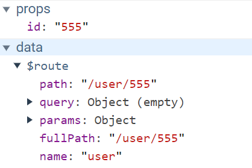

## 安装

### NPM

```bash
npm install vue-router --save
```

如果在一个模块化工程中使用它，必须要通过 `Vue.use()` 明确地安装路由功能：

```js
import Vue from 'vue'
import VueRouter from 'vue-router'

Vue.use(VueRouter)
```

### Vue CLI

如果你有一个正在使用 [Vue CLI](https://cli.vuejs.org/zh/) 的项目，你可以以项目插件的形式添加 Vue Router。CLI 可以生成上述代码及两个示例路由。**它也会覆盖你的 `App.vue`**，因此请确保在项目中运行以下命令之前备份这个文件：

```sh
vue add router
```

## 起步

```js
import Vue from 'vue'
import VueRouter from 'vue-router'

//导入用户组件
import User from '../views/User.vue'
//导入注册组件
import Register from '../views/Register.vue'

// 安装路由
Vue.use(VueRouter)


//创建路由器
export default new VueRouter({
  routes:[
  	{ 
        path: '/user', 
        component: User 
    },
  	{ 
        path: '/register', 
        component: Register 
    }
  ]
})
```

入口js中引入router

```js
import Vue from 'vue'
import App from './App.vue'
import router from './router'

new Vue({
  el:'#app',
  components:{App},
  template:'<App/>',
  router
})
```

**设置路由导航**

```vue
<!-- 1.添加路由连接 -->
<router-link to="/user">User</router-link>
<router-link to="/register">Register</router-link>
```

点击样式

```css
.router-link-active{
	color: red;
}
```

**设置路由占位符**

```vue
 <!-- 2.路由占位符 -->
<router-view></router-view>
```

## 重定向

重定向也是通过 `routes` 配置来完成，下面例子是从 `/` 重定向到 `/user`：

```js
routes:[
    { path: '/', redirect:'/user' },
    { path: '/user', component: User },
    { path: '/register', component: Register }
]
```

**设置路由导航**

```vue
<!-- 1.添加路由连接 -->
<router-link to="/user">User</router-link>
<router-link to="/register">Register</router-link>
```

**设置路由占位符**

```vue
 <!-- 2.路由占位符 -->
<router-view></router-view>
```

## 嵌套路由

```js
//所有路由规则
routes:[
    { 
        path: '/', 
        redirect:'/user' 
    },
    { 
        path: '/user', 
        component: User 
    },
    //children表示子组件规则
    { 
        path: '/register', 
        component: Register,children:[
        	{ 
                path: '/register/tab1', 
                component: Tab1 
            },
        	{ 
                // 简写
                path: 'tab2', 
                component: Tab2 
            }
    ] }
]
```

**设置路由导航**

```vue
<!-- 1.添加路由连接 -->
<router-link to="/register/tab1">tab1</router-link>
<router-link to="/register/tab2">tab2</router-link>
```

**设置路由占位符**

```vue
 <!-- 2.路由占位符 -->
<router-view></router-view>
```

## 保存路由存活

**当切换路由后输入框的数据还能保存**

```vue
<keep-alive>
	<router-view></router-view>          
</keep-alive>
```


## 动态路由匹配

### 动态路由匹配1

```js
routes:[
    { path: '/', redirect:'/user' },
    // 路由占位符id
    { path: '/user/:id', component: User }
]
```

**传递参数**

```vue
<router-link :to="`/user/${user.id}`">User</router-link>

// 路由占位符
<router-view></router-view>

<script>
export default {
  ...
  data () {
    return {
      user: {
        id: 666
      }
    }
  }
}
</script>
```


接收参数

```vue
<h1>{{ $route.params.id }}</h1>
```

### 动态路由匹配2

开启props，则可以在props中接收到参数

```js
routes:[
    { 
    	path: '/user/:id', 
    	component: User,
    	// 开启props参数
    	props: true
    }
]
```


## 命名路由

你可以在创建 Router 实例的时候，在 `routes` 配置中给某个路由设置名称。

```js
routes: [
    {
      path: '/user/:id',
      // 配置路由名称
      name: 'user',
      component: User,
      props: true
    }
]
```

要链接到一个命名路由，可以给 `router-link` 的 `to` 属性传一个对象：

```vue
<router-link :to="{ name: 'user', params :{id: 555} }">User</router-link>
```



## 编程式导航

### push

想要导航到不同的 URL，则使用 `router.push` 方法。这个方法会向 history 栈添加一个新的记录，所以，当用户点击浏览器后退按钮时，则回到之前的 URL。

```js
// 字符串
router.push('home')

// 对象
router.push({ path: 'home' })

// 命名的路由
router.push({ name: 'user', params: { userId: '123' }})

// 带查询参数，变成 /register?plan=private
router.push({ path: 'register', query: { plan: 'private' }})
```

**注意：如果提供了 `path`，`params` 会被忽略，上述例子中的 `query` 并不属于这种情况。取而代之的是下面例子的做法，你需要提供路由的 `name` 或手写完整的带有参数的 `path`：**

```js
const userId = '123'
router.push({ name: 'user', params: { userId }}) // -> /user/123
router.push({ path: `/user/${userId}` }) // -> /user/123
// 这里的 params 不生效
router.push({ path: '/user', params: { userId }}) // -> /user
```

### replace

跟 `router.push` 很像，唯一的不同就是，它不会向 history 添加新记录，而是跟它的方法名一样 —— 替换掉当前的 history 记录。

```js
// 字符串
router.replace('home')

// 对象
router.replace({ path: 'home' })

// 命名的路由
router.replace({ name: 'user', params: { userId: '123' }})

// 带查询参数，变成 /register?plan=private
router.replace({ path: 'register', query: { plan: 'private' }})
```

### go

这个方法的参数是一个整数，意思是在 history 记录中向前或者后退多少步，类似 `window.history.go(n)`

例子

```js
// 在浏览器记录中前进一步，等同于 history.forward()
router.go(1)

// 后退一步记录，等同于 history.back()
router.go(-1)

// 前进 3 步记录
router.go(3)

// 如果 history 记录不够用，那就默默地失败呗
router.go(-100)
router.go(100)
```