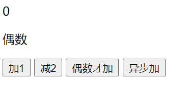

## Vuex 是什么

Vuex 是一个专为 Vue.js 应用程序开发的**状态管理模式**。

这个状态自管理应用包含以下几个部分：

- **state**，驱动应用的数据源；
- **view**，以声明方式将 **state** 映射到视图；
- **actions**，响应在 **view** 上的用户输入导致的状态变化。


状态图


## 入门

### NPM

```bash
npm install vuex --save
```

### 简单store

```js
// vuex的核心管理对象模块：store
import Vue from 'vue'
import Vuex from 'vuex'

Vue.use(Vuex)

// 状态对象
const state = {
  count: 0
}

// 包含多个跟新state函数对象
const mutations = {
  INCREMENT (state) {
    state.count++
  },
  DECREMENT (state, amont) {
    console.log(amont)
    state.count -= amont
  }
}

// 包含多个对应事件回调函数的对象
const actions = { // 初始化状态
  increment ({commit}) {
    // 提交一个mutation请求
    commit('INCREMENT')
  },
  decrement ({commit}, amont) {
    // 提交一个mutation请求
    commit('DECREMENT', amont)
  },
  incrementIfOdd ({commit, state}) {
    if (state.count % 2 === 0) {
      commit('INCREMENT')
    }
  },
  incrementAsync ({commit}) {
    setTimeout(() => {
      commit('INCREMENT')
    }, 500)
  }
}

// 包含多个getter计算属性函数的对象
const getters = {
  evenOrOdd (state) {
    return state.count % 2 === 0 ? '偶数' : '奇数'
  }
}

export default new Vuex.Store({
  state, // 状态对象
  mutations, // 包含多个跟新state函数对象
  actions, // 包含多个对应事件回调函数的对象
  getters // 包含多个getter计算属性函数的对象
})
```

### 挂载store

```js
import Vue from 'vue'
import App from './App'
import store from './vuex/store'

new Vue({
  el: '#app',
  components: { App },
  template: '<App/>',
  store // 所有组件对象都多了一个属性:$store
})
```

### 使用

```vue
<template>
  <div>
    <p>{{ $store.state.count }}</p>
    <p>{{ evenOrOdd }}</p>
    <button @click="increment">加1</button>
    <button @click="decrement">减2</button>
    <button @click="incrementIfOdd">偶数才加</button>
    <button @click="incrementAsync">异步加</button>
  </div>
</template>

<script>
import User from './components/User'

export default {
  ...
  computed: {
    // 计算属性
    evenOrOdd () {
      // getters获取计算属性
      return this.$store.getters.evenOrOdd
    }
  },
  methods: {
    increment () {
      this.$store.dispatch('increment')
    },
    decrement () {
      this.$store.dispatch('decrement', 2)
    },
    incrementIfOdd () {
      this.$store.dispatch('incrementIfOdd')
    },
    incrementAsync () {
      this.$store.dispatch('incrementAsync')
    }
  }
}
</script>
```



### 优化

**`mapState` 辅助函数**

`tt`


