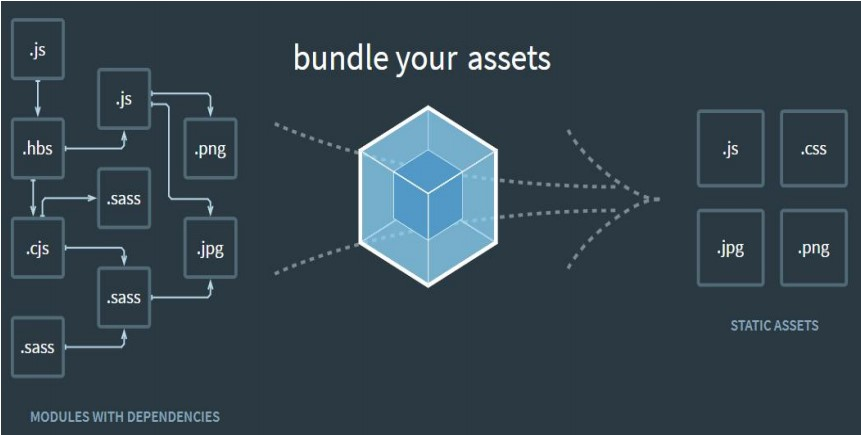
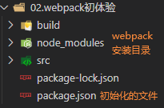
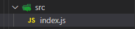
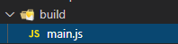

## webpack是什么

 webpack 是一种前端资源构建工具，一个静态模块打包器(module bundler)。 在 webpack 看来, 前端的所有资源文件(js/json/css/img/less/...)都会作为模块处理。 它将根据模块的依赖关系进行静态分析，打包生成对应的静态资源(bundle)。



## webpack 五个核心概念

① **Entry**：入口指示webpack以哪个文件为入口起点开始打包，分析构建内部依赖图。

② **Output**：输出指示 webpack 打包后的资源 bundles 输出到哪里去，以及如何命名。

③ **plugins：**插件可以用于执行范围更广的任务。插件的范围包括，从打包优化和压缩，一直到重新定义环境中的变量。

④ **Mode：**模式指示webpack使用相应模式的配置。

| 选项        | 描述                                                         | 特点                        |
| ----------- | ------------------------------------------------------------ | --------------------------- |
| development | 会将 DefinePlugin 中 process.env.NODE_ENV 的值设置 为 development。启用 NamedChunksPlugin 和 NamedModulesPlugin。 | 能让代码本地调试 运行的环境 |
| production  | 会将 DefinePlugin 中 process.env.NODE_ENV 的值设置 为 production。启用 FlagDependencyUsagePlugin, FlagIncludedChunksPlugin, ModuleConcatenationPlugin, NoEmitOnErrorsPlugin, OccurrenceOrderPlugin, SideEffectsFlagPlugin 和 TerserPlugin。 | 能让代码优化上线 运行的环境 |

## 入门

### 初始化配置

初始化 package.json

```sh
npm init
```

生成的package.json

```json
{
  "name": "webpack_test",
  "version": "1.0.0",
  "description": "",
  "main": "index.js",
  "scripts": {
    "test": "echo \"Error: no test specified\" && exit 1"
  },
  "author": "",
  "license": "ISC"
}
```

**下载并webpack**

```sh
npm install webpack webpack-cli -g
npm install webpack webpack-cli -D
```

package.json增加了依赖

```json
{
  "name": "webpack_test",
  "version": "1.0.0",
  "description": "",
  "main": "index.js",
  "scripts": {
    "test": "echo \"Error: no test specified\" && exit 1"
  },
  "author": "",
  "license": "ISC",
  "devDependencies": {
    "webpack": "^5.12.3",
    "webpack-cli": "^4.3.1"
  }
}
```

3.新建src和build文件夹



### 编译打包应用

1.src下新建index.js



 

```js
function add(x,y){
    return x + y;
}
console.log(add(1,2));
```

2.开发环境指令

 

```js
webpack --entry ./src/index.js -o ./build/ --mode=development
//含义：以index.js为入口文件，打包输出到./build/main.js，以开发模式
```



3.生产环境指令

```js
webpack --entry ./src/index.js -o ./build/ --mode=production
//在开发配置功能上多一个功能，压缩代码。
```


4.结论 

**webpack 能够编译打包 js 和 json 文件。** 

**能将 es6 的模块化语法转换成浏览器能识别的语法。 能压缩代码。** 

**不能编译打包 css、img 等文件。 不能将 js 的 es6 基本语法转化为 es5 以下语法。**