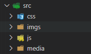

## 5.1HMR ：优化打包构建速度 

1.创建文件



2.修改配置文件

```js
/*
  HMR: hot module replacement 热模块替换 / 模块热替换
    作用：一个模块发生变化，只会重新打包这一个模块（而不是打包所有模块） 
      极大提升构建速度
      
      样式文件：可以使用HMR功能：因为style-loader内部实现了~
      js文件：默认不能使用HMR功能 --> 需要修改js代码，添加支持HMR功能的代码
        注意：HMR功能对js的处理，只能处理非入口js文件的其他文件。
      html文件: 默认不能使用HMR功能.同时会导致问题：html文件不能热更新了~ （不用做HMR功能）
        解决：修改entry入口，将html文件引入
*/
const { resolve } = require('path');
const HtmlWebpackPlugin = require('html-webpack-plugin');
module.exports = {
  entry: ['./src/js/index.js', './src/index.html'],
  output: {
    filename: 'js/built.js',
    path: resolve(__dirname, 'build')
  },
  module: {
    rules: []
  },
  plugins: [
    // plugins的配置
    new HtmlWebpackPlugin({
      template: './src/index.html'
    })
  ],
  mode: 'development',
  devServer: {
    contentBase: resolve(__dirname, 'build'),
    compress: true,
    port: 3000,
    open: true,
    // 开启HMR功能
    // 当修改了webpack配置，新配置要想生效，必须重新webpack服务
    hot: true
  }
};
```

5.运行指令: 

```
webpack
```

## 5.2 source-map :优化代码调试

1.创建文件


2.修改配置文件

```js
const { resolve } = require('path');
const HtmlWebpackPlugin = require('html-webpack-plugin');
module.exports = {
  entry: ['./src/js/index.js', './src/index.html'],
  output: {
    filename: 'js/built.js',
    path: resolve(__dirname, 'build')
  },
  module: {
    rules: []
  },
  plugins: [
    // plugins的配置
    new HtmlWebpackPlugin({
      template: './src/index.html'
    })
  ],
  mode: 'development',
  devServer: {
    contentBase: resolve(__dirname, 'build'),
    compress: true,
    port: 3000,
    open: true,
    hot: true
  },
  devtool: 'eval-source-map'
};
/*
  source-map: 一种 提供源代码到构建后代码映射 技术 （如果构建后代码出错了，通过映射可以追踪源代码错误）
    [inline-|hidden-|eval-][nosources-][cheap-[module-]]source-map
    source-map：外部
      错误代码准确信息 和 源代码的错误位置
    inline-source-map：内联
      只生成一个内联source-map
      错误代码准确信息 和 源代码的错误位置
    hidden-source-map：外部
      错误代码错误原因，但是没有错误位置
      不能追踪源代码错误，只能提示到构建后代码的错误位置
    eval-source-map：内联
      每一个文件都生成对应的source-map，都在eval
      错误代码准确信息 和 源代码的错误位置
    nosources-source-map：外部
      错误代码准确信息, 但是没有任何源代码信息
    cheap-source-map：外部
      错误代码准确信息 和 源代码的错误位置 
      只能精确的行
    cheap-module-source-map：外部
      错误代码准确信息 和 源代码的错误位置 
      module会将loader的source map加入
    内联 和 外部的区别：1. 外部生成了文件，内联没有 2. 内联构建速度更快
    开发环境：速度快，调试更友好
      速度快(eval>inline>cheap>...)
        eval-cheap-souce-map
        eval-source-map
      调试更友好  
        souce-map
        cheap-module-souce-map
        cheap-souce-map
      --> eval-source-map  / eval-cheap-module-souce-map
    生产环境：源代码要不要隐藏? 调试要不要更友好
      内联会让代码体积变大，所以在生产环境不用内联
      nosources-source-map 全部隐藏
      hidden-source-map 只隐藏源代码，会提示构建后代码错误信息
      --> source-map / cheap-module-souce-map
*/
```

## 5.3 oneOf：只匹配一个 

1.修改配置文件

```js
const { resolve } = require('path');
const MiniCssExtractPlugin = require('mini-css-extract-plugin');
const OptimizeCssAssetsWebpackPlugin = require('optimize-css-assets-webpack-plugin');
const HtmlWebpackPlugin = require('html-webpack-plugin');
// 定义nodejs环境变量：决定使用browserslist的哪个环境
process.env.NODE_ENV = 'production';
// 复用loader
const commonCssLoader = [
  MiniCssExtractPlugin.loader,
  'css-loader',
  {
    // 还需要在package.json中定义browserslist
    loader: 'postcss-loader',
    options: {
      ident: 'postcss',
      plugins: () => [require('postcss-preset-env')()]
    }
  }
];
module.exports = {
  entry: './src/js/index.js',
  output: {
    filename: 'js/built.js',
    path: resolve(__dirname, 'build')
  },
  module: {
    rules: [
      {
        // 在package.json中eslintConfig --> airbnb
        test: /\.js$/,
        exclude: /node_modules/,
        // 优先执行
        enforce: 'pre',
        loader: 'eslint-loader',
        options: {
          fix: true
        }
      },
      {
        // 以下loader只会匹配一个
        // 注意：不能有两个配置处理同一种类型文件
        oneOf: [
          {
            test: /\.css$/,
            use: [...commonCssLoader]
          },
          {
            test: /\.less$/,
            use: [...commonCssLoader, 'less-loader']
          },
          /*
            正常来讲，一个文件只能被一个loader处理。
            当一个文件要被多个loader处理，那么一定要指定loader执行的先后顺序：
              先执行eslint 在执行babel
          */
          {
            test: /\.js$/,
            exclude: /node_modules/,
            loader: 'babel-loader',
            options: {
              presets: [
                [
                  '@babel/preset-env',
                  {
                    useBuiltIns: 'usage',
                    corejs: {version: 3},
                    targets: {
                      chrome: '60',
                      firefox: '50'
                    }
                  }
                ]
              ]
            }
          },
          {
            test: /\.(jpg|png|gif)/,
            loader: 'url-loader',
            options: {
              limit: 8 * 1024,
              name: '[hash:10].[ext]',
              outputPath: 'imgs',
              esModule: false
            }
          },
          {
            test: /\.html$/,
            loader: 'html-loader'
          },
          {
            exclude: /\.(js|css|less|html|jpg|png|gif)/,
            loader: 'file-loader',
            options: {
              outputPath: 'media'
            }
          }
        ]
      }
    ]
  },
  plugins: [
    new MiniCssExtractPlugin({
      filename: 'css/built.css'
    }),
    new OptimizeCssAssetsWebpackPlugin(),
    new HtmlWebpackPlugin({
      template: './src/index.html',
      minify: {
        collapseWhitespace: true,
        removeComments: true
      }
    })
  ],
  mode: 'production'
};
```

2.运行指令 

```
webpack
```

## 5.4 缓存

1.修改配置文件

```js
const { resolve } = require('path');
const MiniCssExtractPlugin = require('mini-css-extract-plugin');
const OptimizeCssAssetsWebpackPlugin = require('optimize-css-assets-webpack-plugin');
const HtmlWebpackPlugin = require('html-webpack-plugin');
/*
  缓存：
    babel缓存
      cacheDirectory: true
      --> 让第二次打包构建速度更快
    文件资源缓存
      hash: 每次wepack构建时会生成一个唯一的hash值。
        问题: 因为js和css同时使用一个hash值。
          如果重新打包，会导致所有缓存失效。（可能我却只改动一个文件）
      chunkhash：根据chunk生成的hash值。如果打包来源于同一个chunk，那么hash值就一样
        问题: js和css的hash值还是一样的
          因为css是在js中被引入的，所以同属于一个chunk
      contenthash: 根据文件的内容生成hash值。不同文件hash值一定不一样    
      --> 让代码上线运行缓存更好使用
*/
// 定义nodejs环境变量：决定使用browserslist的哪个环境
process.env.NODE_ENV = 'production';
// 复用loader
const commonCssLoader = [
  MiniCssExtractPlugin.loader,
  'css-loader',
  {
    // 还需要在package.json中定义browserslist
    loader: 'postcss-loader',
    options: {
      ident: 'postcss',
      plugins: () => [require('postcss-preset-env')()]
    }
  }
];
module.exports = {
  entry: './src/js/index.js',
  output: {
    filename: 'js/built.[contenthash:10].js',
    path: resolve(__dirname, 'build')
  },
  module: {
    rules: [
      {
        // 在package.json中eslintConfig --> airbnb
        test: /\.js$/,
        exclude: /node_modules/,
        // 优先执行
        enforce: 'pre',
        loader: 'eslint-loader',
        options: {
          fix: true
        }
      },
      {
        // 以下loader只会匹配一个
        // 注意：不能有两个配置处理同一种类型文件
        oneOf: [
          {
            test: /\.css$/,
            use: [...commonCssLoader]
          },
          {
            test: /\.less$/,
            use: [...commonCssLoader, 'less-loader']
          },
          /*
            正常来讲，一个文件只能被一个loader处理。
            当一个文件要被多个loader处理，那么一定要指定loader执行的先后顺序：
              先执行eslint 在执行babel
          */
          {
            test: /\.js$/,
            exclude: /node_modules/,
            loader: 'babel-loader',
            options: {
              presets: [
                [
                  '@babel/preset-env',
                  {
                    useBuiltIns: 'usage',
                    corejs: { version: 3 },
                    targets: {
                      chrome: '60',
                      firefox: '50'
                    }
                  }
                ]
              ],
              // 开启babel缓存
              // 第二次构建时，会读取之前的缓存
              cacheDirectory: true
            }
          },
          {
            test: /\.(jpg|png|gif)/,
            loader: 'url-loader',
            options: {
              limit: 8 * 1024,
              name: '[hash:10].[ext]',
              outputPath: 'imgs',
              esModule: false
            }
          },
          {
            test: /\.html$/,
            loader: 'html-loader'
          },
          {
            exclude: /\.(js|css|less|html|jpg|png|gif)/,
            loader: 'file-loader',
            options: {
              outputPath: 'media'
            }
          }
        ]
      }
    ]
  },
  plugins: [
    new MiniCssExtractPlugin({
      filename: 'css/built.[contenthash:10].css'
    }),
    new OptimizeCssAssetsWebpackPlugin(),
    new HtmlWebpackPlugin({
      template: './src/index.html',
      minify: {
        collapseWhitespace: true,
        removeComments: true
      }
    })
  ],
  mode: 'production',
  devtool: 'source-map'
};
```

2.运行指令:

```
webpack
```

## 5.5 tree shaking：去除无用代码

1.修改配置文件

```js
const { resolve } = require('path');
const MiniCssExtractPlugin = require('mini-css-extract-plugin');
const OptimizeCssAssetsWebpackPlugin = require('optimize-css-assets-webpack-plugin');
const HtmlWebpackPlugin = require('html-webpack-plugin');
/*
  tree shaking：去除无用代码
    前提：1. 必须使用ES6模块化  2. 开启production环境
    作用: 减少代码体积
    在package.json中配置 
      "sideEffects": false 所有代码都没有副作用（都可以进行tree shaking）
        问题：可能会把css / @babel/polyfill （副作用）文件干掉
      "sideEffects": ["*.css", "*.less"]
*/
// 定义nodejs环境变量：决定使用browserslist的哪个环境
process.env.NODE_ENV = 'production';
// 复用loader
const commonCssLoader = [
  MiniCssExtractPlugin.loader,
  'css-loader',
  {
    // 还需要在package.json中定义browserslist
    loader: 'postcss-loader',
    options: {
      ident: 'postcss',
      plugins: () => [require('postcss-preset-env')()]
    }
  }
];
module.exports = {
  entry: './src/js/index.js',
  output: {
    filename: 'js/built.[contenthash:10].js',
    path: resolve(__dirname, 'build')
  },
  module: {
    rules: [
      {
        // 在package.json中eslintConfig --> airbnb
        test: /\.js$/,
        exclude: /node_modules/,
        // 优先执行
        enforce: 'pre',
        loader: 'eslint-loader',
        options: {
          fix: true
        }
      },
      {
        // 以下loader只会匹配一个
        // 注意：不能有两个配置处理同一种类型文件
        oneOf: [
          {
            test: /\.css$/,
            use: [...commonCssLoader]
          },
          {
            test: /\.less$/,
            use: [...commonCssLoader, 'less-loader']
          },
          /*
            正常来讲，一个文件只能被一个loader处理。
            当一个文件要被多个loader处理，那么一定要指定loader执行的先后顺序：
              先执行eslint 在执行babel
          */
          {
            test: /\.js$/,
            exclude: /node_modules/,
            loader: 'babel-loader',
            options: {
              presets: [
                [
                  '@babel/preset-env',
                  {
                    useBuiltIns: 'usage',
                    corejs: { version: 3 },
                    targets: {
                      chrome: '60',
                      firefox: '50'
                    }
                  }
                ]
              ],
              // 开启babel缓存
              // 第二次构建时，会读取之前的缓存
              cacheDirectory: true
            }
          },
          {
            test: /\.(jpg|png|gif)/,
            loader: 'url-loader',
            options: {
              limit: 8 * 1024,
              name: '[hash:10].[ext]',
              outputPath: 'imgs',
              esModule: false
            }
          },
          {
            test: /\.html$/,
            loader: 'html-loader'
          },
          {
            exclude: /\.(js|css|less|html|jpg|png|gif)/,
            loader: 'file-loader',
            options: {
              outputPath: 'media'
            }
          }
        ]
      }
    ]
  },
  plugins: [
    new MiniCssExtractPlugin({
      filename: 'css/built.[contenthash:10].css'
    }),
    new OptimizeCssAssetsWebpackPlugin(),
    new HtmlWebpackPlugin({
      template: './src/index.html',
      minify: {
        collapseWhitespace: true,
        removeComments: true
      }
    })
  ],
  mode: 'production',
  devtool: 'source-map'
};
```