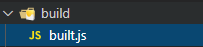

## 创建配置文件

1. 初始化 package.json

```sh
npm init
```

2.安装 webpack

```sh
npm install webpack webpack-cli -D
```

3.创建文件 webpack.config.js

```js
const {resolve} = require('path');
module.exports = {
    // 打包入口起点
    entry: './src/index.js',
    // 输出
    output: {
        //输出文件名
        filename: './built.js',
        //输出路径
        path: resolve(__dirname,'build')
    },
    //模式
    mode: 'development' //开发环境
}
```


4.运行指令: 

```sh
webpack
```


## 3.2 打包样式资源

1.创建样式文件


 

```css
/* index.css */
html,body{
    margin:0;
    padding: 0;
    height: 100%;
    background-color: pink;
}
```

```less
/* index.less */
#title {
    color: #fff;
}
```

```js
// 引入样式资源index.js
import './index.css';
import './index.less';
```

2.下载安装 loader 包

```sh
# 安装css-loader style-loader less-loader less
npm i css-loader style-loader less-loader less -D
```

3.修改配置文件webpack.config.js

```js
const {resolve} = require('path');
module.exports = {
    // 打包入口起点
    entry: './src/index.js',
    // 输出
    output: {
        //输出文件名
        filename: './built.js',
        //输出路径
        path: resolve(__dirname,'build')
    },
    // loader配置
    module: {
        rules: [
            //详细loader配置
            {
                // 匹配规则
                test:/\.css$/,
                // 使用哪些loader进行处理
                use:[
                    //执行顺序:从下到上
                    //将js中的样式插入进行，添加到head中
                    'style-loader',
                    // 将css文件变成common.js模块加载到js中
                    'css-loader'
                ]
            },
            {
                test:/\.less$/,
                use:[
                    //执行顺序:从下到上
                    'style-loader',
                    'css-loader',
                    // 将less文件编译成css文件
                    'less-loader'
                ]
            },
        ]
    },
    //模式
    mode: 'development' //开发环境
}
```

4.运行指令:

```sh
webpacks
```



5.运行效果

```html
<!DOCTYPE html>
<html lang="en">
<head>
    <meta charset="UTF-8">
    <meta name="viewport" content="width=device-width, initial-scale=1.0">
    <title>Document</title>
    <script src="./built.js"></script>
</head>
<body>
    <h2 id="title">less</h2>
</body>
</html>
```

## 3.3 打包 HTML 资源

1.创建html文件


 

```html
<!DOCTYPE html>
<html lang="en">
<head>
    <meta charset="UTF-8">
    <meta name="viewport" content="width=device-width, initial-scale=1.0">
    <title>webpack</title>
</head>
<body>
    <h1 id="title">hello html</h1>
</body>
</html>
```

```js
//index.js
function add(x, y) {
    return x + y;
  }
  
console.log(add(2, 3));
```

2.下载安装 plugin 包

```sh
npm install --save-dev html-webpack-plugin
npm i html-webpack-plugin@next -D
```

3.修改配置文件

```js
const { resolve } = require('path');
const HtmlWebpackPlugin = require('html-webpack-plugin');
module.exports = {
    entry: './src/index.js',
    output: {
        filename: 'build.js',
        path:resolve(__dirname,'build')
    },
    module:{
        rules:[
        ]
    },
    plugins: [
        // plugins的配置
        // 自动引入打包资源
        new HtmlWebpackPlugin({
            template: './src/index.html'
        })
    ],
    mode: 'development'
}
```

4.运行指令: webpack


 

```html
<!DOCTYPE html>
<html lang="en">
<head>
    <meta charset="UTF-8">
    <meta name="viewport" content="width=device-width, initial-scale=1.0">
    <title>webpack</title>
<script defer src="build.js"></script></head>
<body>
    <h1 id="title">hello html</h1>
</body>
</html>
```

## 3.4 打包图片资源

1.创建文件


 

```html
<!DOCTYPE html>
<html lang="en">
<head>
  <meta charset="UTF-8">
  <meta name="viewport" content="width=device-width, initial-scale=1.0">
  <title>webpack</title>
</head>
<body>
  <div id="box1"></div>
  <div id="box2"></div>
  <div id="box3"></div>
  
</body>
</html>
```

```js
//index.js
import './index.less';
```

```less
/*index.less*/
#box1{
  width: 100px;
  height: 100px;
  background-image: url('./vue.jpg');
  background-repeat: no-repeat;
  background-size: 100% 100%;
}
#box2{
  width: 200px;
  height: 200px;
  background-image: url('./react.png');
  background-repeat: no-repeat;
  background-size: 100% 100%;
}
#box3{
  width: 300px;
  height: 300px;
  background-image: url('./angular.jpg');
  background-repeat: no-repeat;
  background-size: 100% 100%;
}
```

2.下载安装 loader 包

```sh
npm i html-loader url-loader file-loader -d
```

3.修改配置文件

```js
const { resolve } = require('path');
const HtmlWebpackPlugin = require('html-webpack-plugin');
module.exports = {
    entry: './src/index.js',
    output: {
        filename: 'built.js',
        path: resolve(__dirname, 'build')
    },
    module: {
        rules: [{
                test: /\.less$/,
                // 要使用多个loader处理用use
                use: ['style-loader', 'css-loader', 'less-loader']
            },
            {
                //处理图片资源
                test: /\.(jpg|png|gif)$/,
                loader: 'url-loader',
                options: {
                    // 图片大小小于8kb,就会被base64处理
                    // 优点: 减少请求数量（减轻服务器压力）
                    // 缺点：图片体积会更大（文件请求速度更慢）
                    limit: 8 * 1024,
                     // 问题：因为url-loader默认使用es6模块化解析，而html-loader引入图片是commonjs
                    // 解析时会出问题：
                    // 解决：关闭url-loader的es6模块化，使用commonjs解析
                    esModule:false,
                    // 给图片进行重命名
                    // [hash:10]取图片的hash的前10位
                    // [ext]取文件原来扩展名
                    name: '[hash:10].[ext]'
                }
            },
            {
                test: /\.html$/,
                // 处理html文件的img图片（负责引入img，从而能被url-loader进行处理）
                loader: 'html-loader'
            }
        ]
    },
    plugins: [
        new HtmlWebpackPlugin({
            template: './src/index.html'
        })
    ],
    mode: 'development'
};
```

4.运行指令: webpack


```html
<!DOCTYPE html>
<html lang="en">
<head>
  <meta charset="UTF-8">
  <meta name="viewport" content="width=device-width, initial-scale=1.0">
  <title>webpack</title>
<script defer src="built.js"></script></head>
<body>
  <div id="box1"></div>
  <div id="box2"></div>
  <div id="box3"></div>
  
</body>
</html>
```

## 3.5 打包其他资源

1.创建文件


 

```html
<!DOCTYPE html>
<html lang="en">
<head>
  <meta charset="UTF-8">
  <meta name="viewport" content="width=device-width, initial-scale=1.0">
  <title>webpack</title>
</head>
<body>
  <span class="iconfont icon-icon-test"></span>
  <span class="iconfont icon-icon-test2"></span>
  <span class="iconfont icon-icon-test3"></span>
  <span class="iconfont icon-icon-test1"></span>
</body>
</html>
```

```css
// 引入 iconfont 样式文件
import './iconfont.css';
```

2.安装loader 

```sh
npm i file-loader -d
```

3.修改配置文件

```js
const { resolve } = require('path');
const HtmlWebpackPlugin = require('html-webpack-plugin');
module.exports = {
    entry: './src/index.js',
    output: {
        filename: 'built.js',
        path: resolve(__dirname,'build')
    },
    module:{
        rules:[
            {
                test: /\.css$/,
                use:[
                    'style-loader',
                    'css-loader'
                ]
            },
            {
                // 排除css/js/html资源
                exclude: /\.(css|js|html|less)$/,
                loader: 'file-loader',
                options: {
                    name: '[hash:10].[ext]'
                }
            }
        ]
    },
    plugins:[
        new HtmlWebpackPlugin({
            template: './src/index.html'
        })
    ],
    mode:'development'
}
```

4.运行指令: webpack


```html
<!DOCTYPE html>
<html lang="en">
<head>
  <meta charset="UTF-8">
  <meta name="viewport" content="width=device-width, initial-scale=1.0">
  <title>webpack</title>
<script defer src="built.js"></script></head>
<body>
  <span class="iconfont icon-icon-test"></span>
  <span class="iconfont icon-icon-test2"></span>
  <span class="iconfont icon-icon-test3"></span>
  <span class="iconfont icon-icon-test1"></span>
</body>
</html>
```

## 3.6 devserver

1.创建文件


2.安装依赖包

```sh
npm i webpack-dev-server -D
```

3.修改配置文件

```js
const { resolve } = require('path');
const HtmlWebpackPlugin = require('html-webpack-plugin');
module.exports = {
    entry: './src/index.js',
    output: {
        filename: 'built.js',
        path: resolve(__dirname,'build')
    },
    module:{
        rules:[
            {
                test: /\.css$/,
                use:[
                    'style-loader',
                    'css-loader'
                ]
            },
            {
                // 排除css/js/html资源
                exclude: /\.(css|js|html|less)$/,
                loader: 'file-loader',
                options: {
                    name: '[hash:10].[ext]'
                }
            }
        ]
    },
    plugins:[
        new HtmlWebpackPlugin({
            template: './src/index.html'
        })
    ],
    mode:'development',
    devServer: {
        // 项目构建后路径
        contentBase: resolve(__dirname,'build'),
        // 启动gzip压缩
        compress: true,
        // 端口号
        port: 3000,
        // 自动打开浏览器
        open: true
    }
}
```

4.运行指令

```sh
npx webpack serve
```


## 3.7 开发环境配置

1.创建文件


2. 修改配置文件

```js
/*
  开发环境配置：能让代码运行
    运行项目指令：
      webpack 会将打包结果输出出去
      npx webpack-dev-server 只会在内存中编译打包，没有输出
*/
const { resolve } = require('path');
const HtmlWebpackPlugin = require('html-webpack-plugin');
module.exports = {
  entry: './src/js/index.js',
  output: {
    filename: 'js/built.js',
    path: resolve(__dirname, 'build')
  },
  module: {
    rules: [
      // loader的配置
      {
        // 处理less资源
        test: /\.less$/,
        use: ['style-loader', 'css-loader', 'less-loader']
      },
      {
        // 处理css资源
        test: /\.css$/,
        use: ['style-loader', 'css-loader']
      },
      {
        // 处理图片资源
        test: /\.(jpg|png|gif)$/,
        loader: 'url-loader',
        options: {
          limit: 8 * 1024,
          name: '[hash:10].[ext]',
          // 关闭es6模块化
          esModule: false,
          outputPath: 'imgs'
        }
      },
      {
        // 处理html中img资源
        test: /\.html$/,
        loader: 'html-loader'
      },
      {
        // 处理其他资源
        exclude: /\.(html|js|css|less|jpg|png|gif)/,
        loader: 'file-loader',
        options: {
          name: '[hash:10].[ext]',
          outputPath: 'media'
        }
      }
    ]
  },
  plugins: [
    // plugins的配置
    new HtmlWebpackPlugin({
      template: './src/index.html'
    })
  ],
  mode: 'development',
  devServer: {
    contentBase: resolve(__dirname, 'build'),
    compress: true,
    port: 3000,
    open: true
  }
};
```

3.运行指令

```sh
npx webpack serve
```