## 4.1 提取 css 成单独文件

1.创建文件

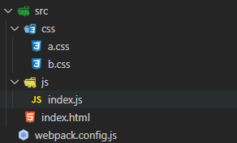

2.下载插件 

```sh
npm install mini-css-extract-plugin -D
```

3.修改配置文件

```js
const { resolve } = require('path');
const HtmlWebpackPlugin = require('html-webpack-plugin');
const MiniCssExtractPlugin = require('mini-css-extract-plugin');
module.exports = {
  entry: './src/js/index.js',
  output: {
    filename: 'js/built.js',
    path: resolve(__dirname, 'build')
  },
  module: {
    rules: [
      {
        test: /\.css$/,
        use: [
          // 创建style标签，将样式放入
          // 'style-loader', 
          // 这个loader取代style-loader。作用：提取js中的css成单独文件
          MiniCssExtractPlugin.loader,
          // 将css文件整合到js文件中
          'css-loader'
        ]
      }
    ]
  },
  plugins: [
    new HtmlWebpackPlugin({
      template: './src/index.html'
    }),
    new MiniCssExtractPlugin({
      // 对输出的css文件进行重命名
      filename: 'css/built.css'
    })
  ],
  mode: 'development'
};
```

4 .运行指令: 

```
webpack
```

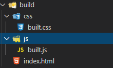

## 4.2 css 兼容性处理

1.创建文件

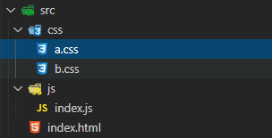

 

```css
/* a.css */
#box1 {
  width: 100px;
  height: 100px;
  background-color: pink;
  /* 下面两句存在兼容性问题 */
  display: flex; 
  backface-visibility: hidden;
}
```

2.下载 loader 

```sh
npm install postcss-loader postcss-preset-env -D
```

3.修改配置文件

```js
const { resolve } = require('path');
const HtmlWebpackPlugin = require('html-webpack-plugin');
const MiniCssExtractPlugin = require('mini-css-extract-plugin');
// 设置nodejs环境变量
// process.env.NODE_ENV = 'development';
module.exports = {
  entry: './src/js/index.js',
  output: {
    filename: 'js/built.js',
    path: resolve(__dirname, 'build')
  },
  module: {
    rules: [
      {
        test:/\.css$/,
        use: [
          MiniCssExtractPlugin.loader,
          'css-loader',
          {
            loader: 'postcss-loader',
            options: {
              ident: 'postcss',
              plugins: ()=>[
                // postcss的插件
                require('postcss-preset-env')()
              ]
            }
          }
        ]
      }
    ]
  },
  plugins: [
    new HtmlWebpackPlugin({
      template: './src/index.html'
    }),
    new MiniCssExtractPlugin({
      filename: 'css/built.css'
    })
  ],
  mode: 'development'
};
```

4.修改 package.json

```json
"browserslist": {
    "development": [
      "last 1 chrome version",
      "last 1 firefox version",
      "last 1 safari version"
    ],
    "production": [
      ">0.2%",
      "not dead",
      "not op_mini all"
    ]
  },
```

5.运行指令: 

```
webpack
```

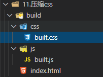

处理后

```css
/* a.css */
#box1 {
  width: 100px;
  height: 100px;
  background-color: pink;
  /* 下面两句存在兼容性问题 */
  display: flex; 
  -webkit-backface-visibility: hidden; 
          backface-visibility: hidden;
}
/* b.css */
#box2 {
  width: 200px;
  height: 200px;
  background-color: deeppink;
}
```

## 4.3 压缩 css 

1.创建文件

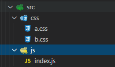

2.下载安装包 

```sh
npm install optimize-css-assets-webpack-plugin -D
```

3.修改配置文件

```js
const { resolve } = require('path');
const HtmlWebpackPlugin = require('html-webpack-plugin');
const MiniCssExtractPlugin = require('mini-css-extract-plugin');
const OptimizeCssAssetsWebpackPlugin = require('optimize-css-assets-webpack-plugin')
// 设置nodejs环境变量
// process.env.NODE_ENV = 'development';
module.exports = {
  entry: './src/js/index.js',
  output: {
    filename: 'js/built.js',
    path: resolve(__dirname, 'build')
  },
  module: {
    rules: [
      {
        test: /\.css$/,
        use: [
          MiniCssExtractPlugin.loader,
          'css-loader',
          {
            loader: 'postcss-loader',
            options: {
              ident: 'postcss',
              plugins: () => [
                // postcss的插件
                require('postcss-preset-env')()
              ]
            }
          }
        ]
      }
    ]
  },
  plugins: [
    new HtmlWebpackPlugin({
      template: './src/index.html'
    }),
    new MiniCssExtractPlugin({
      filename: 'css/built.css'
    }),
    // 压缩css
    new OptimizeCssAssetsWebpackPlugin()
  ],
  mode: 'development'
};
```

5.运行指令: 

```
webpack
```


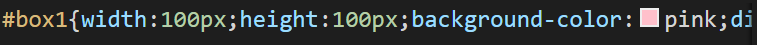

## 4.4 js 语法检查

1.创建文件

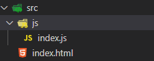

 

```js
function add(x, y) {
  return x + y;
}
// 下一行eslint所有规则都失效（下一行不进行eslint检查）
// eslint-disable-next-line
console.log(add(2, 5));
```

2.下载安装包 

```sh
npm install eslint-loader eslint eslint-config-airbnb-base eslint-plugin-import -D
```

3.修改配置文件

```js
const { resolve } = require('path');
const HtmlWebpackPlugin = require('html-webpack-plugin');
module.exports = {
  entry: './src/js/index.js',
  output: {
    filename: 'js/built.js',
    path: resolve(__dirname, 'build')
  },
  module: {
    rules: [
      {
        test: /\.js$/,
        exclude: /node_modules/,
        loader: 'eslint-loader',
        options:{
          //自动修复eslint的错误
          fix: true
        }
      }
    ]
  },
  plugins: [
    new HtmlWebpackPlugin({
      template: './src/index.html'
    })
  ],
  mode: 'development'
};
```

4. 配置 package.json

```json
"eslintConfig": {
    "extends": "airbnb-base",
    "env": {
      "browser": true
    }
}
```

5.运行指令: 

```
webpack
```

## 4.5 js 兼容性处理 

1.创建文件

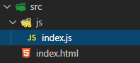

 

```js
// import '@babel/polyfill';
const add = (x, y) => {
  return x + y;
};
console.log(add(2, 5));
const promise = new Promise(resolve => {
  setTimeout(() => {
    console.log('定时器执行完了~');
    resolve();
  }, 1000);
});
console.log(promise);
```

2.下载安装包 

```sh
npm install babel-loader @babel/core @babel/preset-env @babel/polyfill core-js -D
```

3.修改配置文件

```js
const { resolve } = require('path');
const HtmlWebpackPlugin = require('html-webpack-plugin');
module.exports = {
  entry: './src/js/index.js',
  output: {
    filename: 'js/built.js',
    path: resolve(__dirname, 'build')
  },
  module: {
    rules: [
      /*
        js兼容性处理：babel-loader @babel/core 
          1. 基本js兼容性处理 --> @babel/preset-env
            问题：只能转换基本语法，如promise高级语法不能转换
          2. 全部js兼容性处理 --> @babel/polyfill  
            问题：我只要解决部分兼容性问题，但是将所有兼容性代码全部引入，体积太大了~
          3. 需要做兼容性处理的就做：按需加载  --> core-js
      */  
      {
        test: /\.js$/,
        exclude: /node_modules/,
        loader: 'babel-loader',
        options: {
          // 预设：指示babel做怎么样的兼容性处理
          presets: [
            [
              '@babel/preset-env',
              {
                // 按需加载
                useBuiltIns: 'usage',
                // 指定core-js版本
                corejs: {
                  version: 3
                },
                // 指定兼容性做到哪个版本浏览器
                targets: {
                  chrome: '60',
                  firefox: '60',
                  ie: '9',
                  safari: '10',
                  edge: '17'
                }
              }
            ]
          ]
        }
      }
    ]
  },
  plugins: [
    new HtmlWebpackPlugin({
      template: './src/index.html'
    })
  ],
  mode: 'development'
};
```

5.运行指令: 

```
webpack
```

## 4.6 js 压缩 

1.创建文件

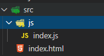

2.修改配置文件

```js
const { resolve } = require('path');
const HtmlWebpackPlugin = require('html-webpack-plugin');
module.exports = {
  entry: './src/js/index.js',
  output: {
    filename: 'js/built.js',
    path: resolve(__dirname, 'build')
  },
  plugins: [
    new HtmlWebpackPlugin({
      template: './src/index.html'
    })
  ],
  // 生产环境下会自动压缩js代码
  mode: 'production'
};
```

3.运行指令: 

```
webpack
```

## 4.7 HTML 压缩 

1.创建文件

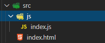

2. 修改配置文件

```js
const { resolve } = require('path');
const HtmlWebpackPlugin = require('html-webpack-plugin');
module.exports = {
  entry: './src/js/index.js',
  output: {
    filename: 'js/built.js',
    path: resolve(__dirname, 'build')
  },
  plugins: [
    new HtmlWebpackPlugin({
      template: './src/index.html',
      // 压缩html代码
      minify: {
        // 移除空格
        collapseWhitespace: true,
        // 移除注释
        removeComments: true
      }
    })
  ],
  mode: 'production'
};
```

5.运行指令: 

```
webpack
```

## 4.8 生产环境配置 

1.创建文件

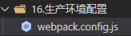

2.修改配置文件

```js
const { resolve } = require('path');
const MiniCssExtractPlugin = require('mini-css-extract-plugin');
const OptimizeCssAssetsWebpackPlugin = require('optimize-css-assets-webpack-plugin');
const HtmlWebpackPlugin = require('html-webpack-plugin');
// 定义nodejs环境变量：决定使用browserslist的哪个环境
process.env.NODE_ENV = 'production';
// 复用loader
const commonCssLoader = [
  MiniCssExtractPlugin.loader,
  'css-loader',
  {
    // 还需要在package.json中定义browserslist
    loader: 'postcss-loader',
    options: {
      ident: 'postcss',
      plugins: () => [require('postcss-preset-env')()]
    }
  }
];
module.exports = {
  entry: './src/js/index.js',
  output: {
    filename: 'js/built.js',
    path: resolve(__dirname, 'build')
  },
  module: {
    rules: [
      {
        test: /\.css$/,
        use: [...commonCssLoader]
      },
      {
        test: /\.less$/,
        use: [...commonCssLoader, 'less-loader']
      },
      /*
        正常来讲，一个文件只能被一个loader处理。
        当一个文件要被多个loader处理，那么一定要指定loader执行的先后顺序：
          先执行eslint 在执行babel
      */
      {
        // 在package.json中eslintConfig --> airbnb
        test: /\.js$/,
        exclude: /node_modules/,
        // 优先执行
        enforce: 'pre',
        loader: 'eslint-loader',
        options: {
          fix: true
        }
      },
      {
        test: /\.js$/,
        exclude: /node_modules/,
        loader: 'babel-loader',
        options: {
          presets: [
            [
              '@babel/preset-env',
              {
                useBuiltIns: 'usage',
                corejs: {version: 3},
                targets: {
                  chrome: '60',
                  firefox: '50'
                }
              }
            ]
          ]
        }
      },
      {
        test: /\.(jpg|png|gif)/,
        loader: 'url-loader',
        options: {
          limit: 8 * 1024,
          name: '[hash:10].[ext]',
          outputPath: 'imgs',
          esModule: false
        }
      },
      {
        test: /\.html$/,
        loader: 'html-loader'
      },
      {
        exclude: /\.(js|css|less|html|jpg|png|gif)/,
        loader: 'file-loader',
        options: {
          outputPath: 'media'
        }
      }
    ]
  },
  plugins: [
    new MiniCssExtractPlugin({
      filename: 'css/built.css'
    }),
    new OptimizeCssAssetsWebpackPlugin(),
    new HtmlWebpackPlugin({
      template: './src/index.html',
      minify: {
        collapseWhitespace: true,
        removeComments: true
      }
    })
  ],
  mode: 'production'
};
```

5.运行指令: 

```
webpack
```